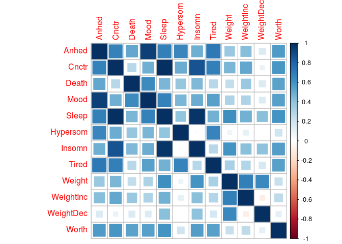

Conduct SEM model of MDD symptom genomic correlation matrix

``` {.r}
library(GenomicSEM)
library(corrplot)
```

Read in LDSC structure for UKB CIDI symptoms

``` {.r}
cidi_covstruct <- dget('ldsc/ukb_mhq_cidi_covstruct.deparse.R')

# the +/- in weight change column names doesn't play well with
# lavaan model syntax
dimnames(cidi_covstruct$S)[[2]][10:11] <- c('WeightInc', 'WeightDec')
```

Plot correlation matrix (truncate correlations \> 1)

``` {.r}
cidi_cor <- cov2cor(cidi_covstruct$S)
cidi_cor[which(cidi_cor > 1)] <- 1
rownames(cidi_cor) <- colnames(cidi_cor)

corrplot(cidi_cor, 'square')
```



Fit common factor model (all symptoms)

``` {.r}
gfactor_fit <- commonfactor(cidi_covstruct)
```

    ## elapsed 
    ##   0.708 
    ## [1] "The S matrix was smoothed prior to model estimation due to a non-positive definite matrix. The largest\n                difference in a cell between the smoothed and non-smoothed matrix was 0.0057130950885052"

``` {.r}
gfactor_fit$results
```

    ##           lhs op       rhs Unstandardized_Estimate Unstandardized_SE
    ## 1          F1 =~     Anhed              0.29872823       0.015543247
    ## 2          F1 =~     Cnctr              0.21191158       0.026058926
    ## 3          F1 =~     Death              0.11679475       0.021308490
    ## 4          F1 =~      Mood              0.24876854       0.018085356
    ## 5          F1 =~     Sleep              0.19976406       0.024508679
    ## 6          F1 =~  Hypersom              0.11862204       0.025484869
    ## 7          F1 =~    Insomn              0.14721308       0.024010490
    ## 8          F1 =~     Tired              0.18092546       0.026358676
    ## 9          F1 =~    Weight              0.12488048       0.022545667
    ## 10         F1 =~ WeightInc              0.14097289       0.024697385
    ## 11         F1 =~ WeightDec              0.04213252       0.019619799
    ## 12         F1 =~     Worth              0.16449048       0.019889763
    ## 104     Anhed ~~     Anhed              0.01156925       0.006954829
    ## 105     Cnctr ~~     Cnctr              0.03607988       0.016729220
    ## 106     Death ~~     Death              0.02316605       0.009492100
    ## 107      Mood ~~      Mood              0.02518825       0.008172170
    ## 108     Sleep ~~     Sleep              0.02208519       0.018170308
    ## 109  Hypersom ~~  Hypersom              0.03646428       0.013124015
    ## 110    Insomn ~~    Insomn              0.03295458       0.016174024
    ## 111     Tired ~~     Tired              0.03234927       0.023024881
    ## 112    Weight ~~    Weight              0.05164360       0.012723705
    ## 113 WeightInc ~~ WeightInc              0.06881304       0.013620384
    ## 114 WeightDec ~~ WeightDec              0.03666971       0.010835487
    ## 115     Worth ~~     Worth              0.03853931       0.010241430
    ##     Standardized_Est Standardized_SE
    ## 1          0.9408696      0.04895473
    ## 2          0.7446434      0.09156938
    ## 3          0.6087763      0.11106750
    ## 4          0.8430462      0.06128904
    ## 5          0.8023298      0.09843639
    ## 6          0.5276757      0.11336635
    ## 7          0.6298616      0.10273060
    ## 8          0.7091932      0.10332102
    ## 9          0.4815976      0.08694672
    ## 10         0.4733763      0.08293204
    ## 11         0.2148810      0.10006340
    ## 12         0.6422452      0.07765858
    ## 104        0.1147647      0.06899102
    ## 105        0.4455055      0.20656815
    ## 106        0.6293914      0.25788798
    ## 107        0.2892732      0.09385318
    ## 108        0.3562660      0.29311226
    ## 109        0.7215578      0.25969905
    ## 110        0.6032742      0.29608469
    ## 111        0.4970447      0.35377546
    ## 112        0.7680637      0.18923173
    ## 113        0.7759134      0.15357915
    ## 114        0.9538258      0.28184478
    ## 115        0.5875225      0.15612788

``` {.r}
gfactor_fit$modelfit
```

    ##       chisq df p_chisq      AIC       CFI      SRMR
    ## df 5626.362 54       0 5674.362 0.5165797 0.1514578

Common factor model (excluding directional symptoms that have zero or negative genetic correlations with each other)

``` {.r}
symptomfactor_model <- "F1 =~ NA*Mood + Anhed + Cnctr + Death + Sleep + Tired + Worth + Weight
F1 ~~ 1*F1"

symptomfactor_fit <- usermodel(cidi_covstruct, model=symptomfactor_model)
```

    ## [1] "Running primary model"
    ## [1] "Calculating model chi-square"
    ## [1] "Calculating CFI"
    ## [1] "Calculating Standardized Results"
    ## [1] "Calculating SRMR"
    ## elapsed 
    ##    0.56 
    ## [1] "The S matrix was smoothed prior to model estimation due to a non-positive definite matrix. The largest\n                  difference in a cell between the smoothed and non-smoothed matrix was 0.0054001413137482"

``` {.r}
symptomfactor_fit$results
```

    ##       lhs op    rhs Unstandardized_Estimate Unstandardized_SE
    ## 1      F1 =~   Mood             0.259411222       0.017407594
    ## 2      F1 =~  Anhed             0.305777478       0.014579048
    ## 3      F1 =~  Cnctr             0.196890128       0.025436718
    ## 4      F1 =~  Death             0.113389581       0.020719618
    ## 5      F1 =~  Sleep             0.190810013       0.024095532
    ## 6      F1 =~  Tired             0.178670993       0.025614917
    ## 7      F1 =~  Worth             0.165086542       0.019443302
    ## 8      F1 =~ Weight             0.108086333       0.022349139
    ## 62  Anhed ~~  Anhed             0.007033591       0.006323733
    ## 63  Cnctr ~~  Cnctr             0.040673363       0.016932321
    ## 64  Death ~~  Death             0.023362249       0.009424735
    ## 65   Mood ~~   Mood             0.019610061       0.007951801
    ## 66  Sleep ~~  Sleep             0.025269553       0.019457306
    ## 67  Tired ~~  Tired             0.032982190       0.023014566
    ## 68 Weight ~~ Weight             0.055482204       0.013399745
    ## 69  Worth ~~  Worth             0.038297797       0.010463927
    ##    Standardized_Est Standardized_SE
    ## 1        0.87997050      0.05904978
    ## 2        0.96438447      0.04598053
    ## 3        0.69856445      0.09024934
    ## 4        0.59580223      0.10887068
    ## 5        0.76830895      0.09702227
    ## 6        0.70131472      0.10054308
    ## 7        0.64479399      0.07594151
    ## 8        0.41706118      0.08623624
    ## 62       0.06996234      0.06290180
    ## 63       0.51200814      0.21314848
    ## 64       0.64501724      0.26021203
    ## 65       0.22565129      0.09150070
    ## 66       0.40970110      0.31546590
    ## 67       0.50815390      0.35458560
    ## 68       0.82606045      0.19950530
    ## 69       0.58424067      0.15962946

``` {.r}
symptomfactor_fit$modelfit
```

    ##       chisq df      p_chisq      AIC       CFI      SRMR
    ## df 47.40019 20 0.0005160302 79.40019 0.9889784 0.1104296

Common factor model with directional symptoms but excluding their non-directional parent symptoms

``` {.r}
valencefactor_model <- "F1 =~ NA*Mood + Anhed + Cnctr + Death + Insomn + Hypersom + Tired + Worth + WeightInc + WeightDec
F1 ~~ 1*F1"

valencefactor_fit <- usermodel(cidi_covstruct, model=valencefactor_model)
```

    ## [1] "Running primary model"
    ## [1] "Calculating model chi-square"
    ## [1] "Calculating CFI"
    ## [1] "Calculating Standardized Results"
    ## [1] "Calculating SRMR"
    ## elapsed 
    ##   0.665 
    ## [1] "The S matrix was smoothed prior to model estimation due to a non-positive definite matrix. The largest\n                  difference in a cell between the smoothed and non-smoothed matrix was 0.00263634577289902"

``` {.r}
valencefactor_fit$results
```

    ##          lhs op       rhs Unstandardized_Estimate Unstandardized_SE
    ## 1         F1 =~      Mood             0.255985258       0.017125249
    ## 2         F1 =~     Anhed             0.313383986       0.015045371
    ## 3         F1 =~     Cnctr             0.195532141       0.024877360
    ## 4         F1 =~     Death             0.116966616       0.020338119
    ## 5         F1 =~    Insomn             0.134135820       0.023352820
    ## 6         F1 =~  Hypersom             0.124139434       0.024614922
    ## 7         F1 =~     Tired             0.181415673       0.024844323
    ## 8         F1 =~     Worth             0.162112616       0.019341355
    ## 9         F1 =~ WeightInc             0.126133784       0.024092177
    ## 10        F1 =~ WeightDec             0.032383828       0.019260947
    ## 87     Anhed ~~     Anhed             0.002484238       0.006695752
    ## 88     Cnctr ~~     Cnctr             0.039569855       0.017014131
    ## 89     Death ~~     Death             0.022953209       0.009411294
    ## 90      Mood ~~      Mood             0.020981952       0.007810766
    ## 91  Hypersom ~~  Hypersom             0.034982863       0.013222675
    ## 92    Insomn ~~    Insomn             0.037493803       0.017063658
    ## 93     Tired ~~     Tired             0.031770185       0.022853118
    ## 94 WeightInc ~~ WeightInc             0.072542801       0.013812681
    ## 95 WeightDec ~~ WeightDec             0.036946362       0.010980354
    ## 96     Worth ~~     Worth             0.039313586       0.010258588
    ##    Standardized_Est Standardized_SE
    ## 1        0.87032386      0.05822409
    ## 2        0.98758741      0.04741346
    ## 3        0.70100445      0.08918811
    ## 4        0.61110695      0.10625913
    ## 5        0.56944494      0.09913949
    ## 6        0.55299703      0.10965069
    ## 7        0.71331896      0.09768684
    ## 8        0.63297144      0.07551871
    ## 9        0.42410760      0.08100669
    ## 10       0.16613644      0.09881298
    ## 87       0.02467068      0.06649621
    ## 88       0.50858863      0.21868310
    ## 89       0.62654840      0.25689776
    ## 90       0.24253683      0.09028704
    ## 91       0.69419484      0.26238872
    ## 92       0.67573483      0.30752961
    ## 93       0.49117614      0.35331597
    ## 94       0.82013292      0.15615924
    ## 95       0.97239957      0.28899416
    ## 96       0.59934792      0.15639501

``` {.r}
valencefactor_fit$modelfit
```

    ##       chisq df      p_chisq      AIC       CFI      SRMR
    ## df 74.03477 35 0.0001292391 114.0348 0.9850659 0.1229941

Fit model close to Kendler…Neale (no psychomotor symptom).

``` {.r}
kendler...neale_model <- "
F1 =~ NA*Mood + Anhed + Worth
F2 =~ NA*Cnctr + Death + Worth
F3 =~ NA*Sleep + Tired + Weight
F1 ~~ 1*F1
F2 ~~ 1*F2
F3 ~~ 1*F3
F1 ~~ F2 + F3
F2 ~~ F3"
kendler...neale_fit <- usermodel(cidi_covstruct, model=kendler...neale_model)
```

    ## [1] "Running primary model"

    ## Warning in lav_object_post_check(object): lavaan WARNING: some estimated ov
    ## variances are negative

    ## Warning in lav_object_post_check(object): lavaan WARNING: covariance matrix of latent variables
    ##                 is not positive definite;
    ##                 use lavInspect(fit, "cov.lv") to investigate.

    ## [1] "Error: The primary model produced correlations among your latent variables that are either greater than 1 or less than -1. \n              Consquently, model fit estimates could not be computed and results should likely not be interpreted. Results are provided below \n              to enable troubleshooting. A model constraint that constrains the latent correlations to be above -1 or less than 1 is suggested."
    ##        lhs op    rhs Unstandardized_Estimate          SE
    ## 1       F1 =~   Mood             0.267226503 0.017074666
    ## 2       F1 =~  Anhed             0.322315634 0.016307956
    ## 3       F1 =~  Worth             0.001805828 0.109945035
    ## 4       F2 =~  Cnctr             0.215901171 0.036391763
    ## 5       F2 =~  Death             0.118561254 0.024457754
    ## 6       F2 =~  Worth             0.174917995 0.110812532
    ## 7       F3 =~  Sleep             0.208860507 0.033942026
    ## 8       F3 =~  Tired             0.191792049 0.035415087
    ## 9       F3 =~ Weight             0.116875724 0.026486854
    ## 13      F1 ~~     F2             0.828442107 0.127774227
    ## 14      F1 ~~     F3             0.819317483 0.127203859
    ## 15      F2 ~~     F3             1.034769641 0.152463439
    ## 100  Anhed ~~  Anhed            -0.003353902 0.008347545
    ## 101  Cnctr ~~  Cnctr             0.032825865 0.017019159
    ## 102  Death ~~  Death             0.022162666 0.009462978
    ## 103   Mood ~~   Mood             0.015494191 0.007673760
    ## 104  Sleep ~~  Sleep             0.018055321 0.020053063
    ## 105  Tired ~~  Tired             0.028121342 0.024773947
    ## 106 Weight ~~ Weight             0.053504910 0.013350650
    ## 107  Worth ~~  Worth             0.034428431 0.012637828

Add constraints to the model to limit factor correlations to \< 1 and residual variances to \> 0.

``` {.r}
kendler...neale_constrain_model <- "
F1 =~ NA*Mood + Anhed + Worth
F2 =~ NA*Cnctr + Death + Worth
F3 =~ NA*Sleep + Tired + Weight
F1 ~~ 1*F1
F2 ~~ 1*F2
F3 ~~ 1*F3
F1 ~~ F2 + F3
F2 ~~ b*F3
Anhed~~a*Anhed
a > .001
b < 1"

kendler...neale_constrain_fit <- usermodel(cidi_covstruct, estimation = "DWLS", model=kendler...neale_constrain_model)
```

    ## [1] "Running primary model"

    ## Warning in lav_object_post_check(object): lavaan WARNING: covariance matrix of latent variables
    ##                 is not positive definite;
    ##                 use lavInspect(fit, "cov.lv") to investigate.

    ## [1] "Calculating model chi-square"
    ## [1] "Calculating CFI"
    ## [1] "Calculating Standardized Results"

    ## Warning in lav_object_post_check(object): lavaan WARNING: covariance matrix of latent variables
    ##                 is not positive definite;
    ##                 use lavInspect(fit, "cov.lv") to investigate.

    ## [1] "Calculating SRMR"
    ## elapsed 
    ##   3.066 
    ## [1] "The S matrix was smoothed prior to model estimation due to a non-positive definite matrix. The largest\n                  difference in a cell between the smoothed and non-smoothed matrix was 0.0054001413137482"

``` {.r}
kendler...neale_constrain_fit$modelfit
```

    ##     chisq df   p_chisq    AIC       CFI       SRMR
    ## df 22.021 16 0.1425147 62.021 0.9975781 0.09520366

``` {.r}
kendler...neale_constrain_fit$results
```

    ##        lhs op    rhs Unstandardized_Estimate Unstandardized_SE
    ## 1       F1 =~   Mood             0.268932520       0.017138112
    ## 2       F1 =~  Anhed             0.317068846       0.016154906
    ## 3       F1 =~  Worth            -0.004437760       0.120955153
    ## 4       F2 =~  Cnctr             0.216629408       0.036576891
    ## 5       F2 =~  Death             0.119480754       0.024592533
    ## 6       F2 =~  Worth             0.182920132       0.121783122
    ## 7       F3 =~  Sleep             0.211408956       0.033777033
    ## 8       F3 =~  Tired             0.193856331       0.035338789
    ## 9       F3 =~ Weight             0.118208217       0.026513449
    ## 13      F1 ~~     F2             0.830994128       0.128602889
    ## 14      F1 ~~     F3             0.815174519       0.124585978
    ## 15      F2 ~~     F3             1.000000000       0.145901488
    ## 16   Anhed ~~  Anhed             0.001000629       0.008048486
    ## 101  Cnctr ~~  Cnctr             0.032510768       0.017064732
    ## 102  Death ~~  Death             0.021943779       0.009507705
    ## 103   Mood ~~   Mood             0.014579527       0.007719853
    ## 104  Sleep ~~  Sleep             0.016984259       0.020076266
    ## 105  Tired ~~  Tired             0.027325244       0.024812263
    ## 106 Weight ~~ Weight             0.053191668       0.013370562
    ## 107  Worth ~~  Worth             0.033421023       0.013244948
    ##     Standardized_Est Standardized_SE
    ## 1        0.911090550      0.05808816
    ## 2        1.003409046      0.05104671
    ## 3       -0.017458195      0.46889643
    ## 4        0.768706458      0.12980703
    ## 5        0.627666716      0.12923214
    ## 6        0.714561025      0.47229880
    ## 7        0.851147021      0.13600021
    ## 8        0.761006961      0.13870029
    ## 9        0.456123777      0.10230682
    ## 13       0.829767110      0.12844820
    ## 14       0.814184078      0.12443841
    ## 15       1.000000127      0.14590279
    ## 16       0.001000269      0.08065663
    ## 101      0.409090534      0.21482454
    ## 102      0.606034453      0.26250945
    ## 103      0.169913952      0.08871836
    ## 104      0.275549254      0.32547723
    ## 105      0.420868857      0.38225569
    ## 106      0.791950744      0.19906569
    ## 107      0.509799381      0.20213381
