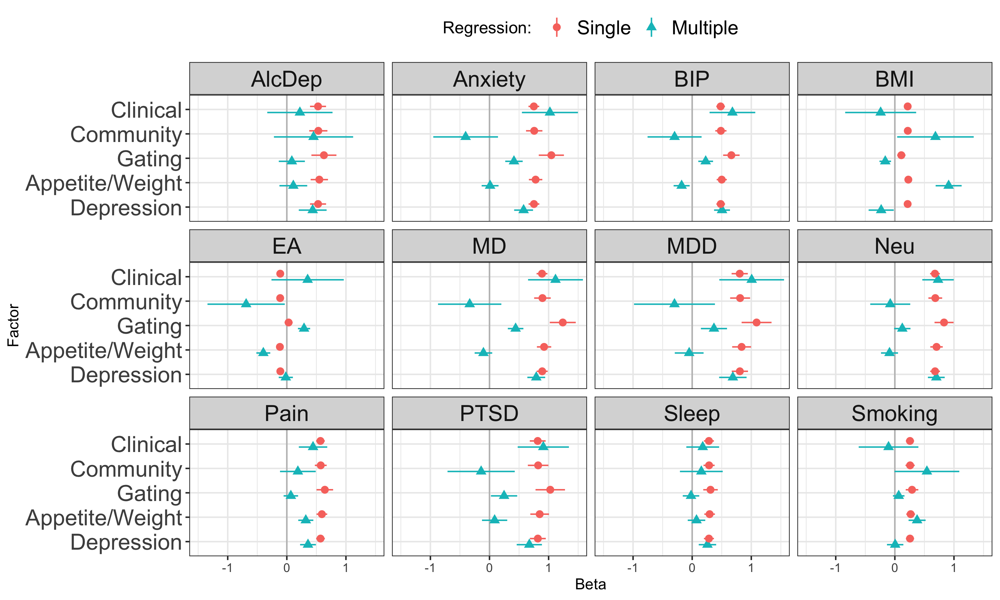

Test genetic relationship between [symptom factors](mdd-symptom-gsem-model.md) and a selection of other phenotypes that are genetically correlated with MDD, as well as to MDD itself. Phenotypes to examine:

- Major depressive disorder: Clinical cohorts from [Wray et al](https://www.nature.com/articles/s41588-018-0090-3%5C) and all cohorts from [Howard et al](https://www.nature.com/articles/s41593-018-%200326-7). Download from [PGC](https://www.med.unc.edu/pgc/download-results/) and obtain via [data access](https://www.med.unc.edu/pgc/shared-methods/how-to/).
- bipolar disorder: [Mullins et al](https://pubmed.ncbi.nlm.nih.gov/34002096/). Download from [PGC](https://figshare.com/articles/dataset/PGC3_bipolar_disorder_GWAS_summary_statistics/14102594)
- anxiety: [meta-analysis](https://drive.google.com/drive/folders/1fguHvz7l2G45sbMI9h_veQun4aXNTy1v) of [UKBB, iPSYCH](https://www.nature.com/articles/s41380-019-0559-1), and [ANGST](https://pubmed.ncbi.nlm.nih.gov/26754954/), from [Grotzinger et al medRxiv](https://www.medrxiv.org/content/10.1101/2020.09.22.20196089v1.full)
- PTSD: [Nievergelt et al](https://pubmed.ncbi.nlm.nih.gov/31594949/). Download from [PGC](https://figshare.com/articles/dataset/ptsd2019/14672133)
- tobacco use. Cigarettes per day [Liu et al](https://www.nature.com/articles/s41588-018-0307-5). Download from [UofM](https://conservancy.umn.edu/handle/11299/201564)
- alcohol dependence. [Walters et al](https://www.nature.com/articles/s41593-018-0275-1). Download from [PGC](https://doi.org/10.6084/m9.figshare.14672187)
- educational attainment. [Okbay et. al](https://www.nature.com/articles/s41588-022-01016-z). Download from [SSGAC Data Portal](https://thessgac.com).
- BMI, sex combined [Pulit et al](https://academic.oup.com/hmg/article/28/1/166/5098227). Download from [GIANT/Broad](https://portals.broadinstitute.org/collaboration/giant/index.php/GIANT_consortium_data_files#2018_GIANT_and_UK_BioBank_Meta-analysis).
- neuroticism: [Nagel et al](https://www.nature.com/articles/s41588-018-0151-7). Download from [CNCR](https://ctg.cncr.nl/software/summary_statistics)
- pain: multisite chronic pain [Johnston et al](https://journals.plos.org/plosgenetics/article?id=10.1371/journal.pgen.1008164). Download from [UoG](https://researchdata.gla.ac.uk/822/)
- chronotype: long sleep duration. [Dashti et al](https://www.ncbi.nlm.nih.gov/pubmed/30846698). Download from [SDKP](https://sleep.hugeamp.org/downloads.html).

# Setup

## R packages

R version


```r
R.version
```

```
##                _                           
## platform       aarch64-apple-darwin20      
## arch           aarch64                     
## os             darwin20                    
## system         aarch64, darwin20           
## status                                     
## major          4                           
## minor          1.0                         
## year           2021                        
## month          05                          
## day            18                          
## svn rev        80317                       
## language       R                           
## version.string R version 4.1.0 (2021-05-18)
## nickname       Camp Pontanezen
```

Package installation


```r
required_packages <- c('devtools', 'readr', 'tidyr', 'dplyr', 'ggplot2', 'stringr', 'corrplot')
for(pack in required_packages) if(!require(pack, character.only=TRUE)) install.packages(pack)

library(devtools)

if(!require(GenomicSEM)) install_github("MichelNivard/GenomicSEM")

if(!require(tidySEM)) install_github("cjvanlissa/tidySEM")
```

GenomicSEM version

```r
require(readr)
require(tidyr)
require(stringr)
require(dplyr)
require(ggplot2)
require(corrplot)
require(GenomicSEM)

packageVersion("GenomicSEM")
```

```
## [1] '0.0.3'
```

# Process external sumstats

## Reformat

Format the external sumstats for reading by GenomicSEM with columns `SNP`, `A1` (effect allele), `A2` (non-effect allele), `BETA`/`OR`, `P`, `INFO`, and `N`.


```r
# Major depressive disorder
mdd <- read_table('sumstats/PGC_UKB_23andMe_depression_genome-wide_info_N.txt.gz')
mdd_sumstats <- mdd %>%
    mutate(Nca=UKB_Ncases+PGC_Ncases+X23andMe_Ncases,
           Nco=UKB_Ncontrols+PGC_Ncontrols+X23andMe_Ncontrols) %>%
    transmute(SNP=MarkerName, A1=toupper(Allele1), A2=toupper(Allele2),
              BETA=Effect, SE=StdErr, P=P.value, 
              FREQ=Freq1, N=4*Nca*Nco/(Nca+Nco))
write_tsv(mdd_sumstats, 'sumstats/MD.txt')

mdd_clin <- read_tsv('sumstats/daner_MDD29.0515a_mds6.0316.gz')
mdd_clin_sumstats <- mdd_clin %>%
    transmute(SNP, A1, A2, BETA=log(OR), SE, FREQ=FRQ_U_25632, INFO, P,
              N=4*Nca*Nco/(Nca+Nco))
write_tsv(mdd_clin_sumstats, 'sumstats/MDD.txt')

# Bipolar disorder
bip <- read_tsv('sumstats/pgc-bip2021-all.vcf.tsv.gz', comment='##')
bip_sumstats <- bip %>%
    filter(IMPINFO >= 0.6) %>%
    transmute(SNP=ID, A1, A2, BETA, SE, P=PVAL, INFO=IMPINFO, N=2*NEFFDIV2)
write_tsv(bip_sumstats, 'sumstats/BIP.txt')

# alcohol dependence
alcdep <- read_table('sumstats/pgc_alcdep.eur_discovery.aug2018_release.txt.gz')
alcdep_sumstats <- alcdep %>%
mutate(SNP=str_split_fixed(SNP, pattern=":", n=2)[,1]) %>%
select(SNP, A1, A2, BETA=Z, P, N=Weight)
write_tsv(alcdep_sumstats, 'sumstats/AlcDep.txt')

# body-mass index
bmi <- read_table('sumstats/Bmi.giant-ukbb.meta-analysis.combined.23May2018.HapMap2_only.txt.gz')
bmi_sumstats <- bmi %>%
    separate(SNP, into=c('SNP', 'A1', 'A2'), sep=':') %>%
    filter(INFO >= 0.6) %>%
    select(SNP, A1=Tested_Allele, A2=Other_Allele, BETA, SE, P, INFO, N)
write_tsv(bmi_sumstats, 'sumstats/BMI.txt')

# educational attainment
ea <- read_tsv('sumstats/EA4_additive_excl_23andMe.txt.gz')
ea_sumstats <-  ea %>%
    transmute(SNP=rsID, A1=Effect_allele, A2=Other_allele, FREQ=EAF_HRC, BETA=Beta, SE_unadj, P=P_unadj, N=765283)
write_tsv(ea_sumstats, 'sumstats/EA.txt')

# multisite chronic pain
pain <- read_tsv('sumstats/chronic_pain-bgen.stats.gz')
pain_sumstats <- pain %>%
    filter(INFO >= 0.6) %>%
    transmute(SNP, A1=ALLELE1, A2=ALLELE0, BETA, SE, P=P_BOLT_LMM_INF, INFO, N=387649) 
write_tsv(pain_sumstats, 'sumstats/Pain.txt')

# tabacco use
smoking <- read_table('sumstats/CigarettesPerDay.txt.gz')
smoking_sumstats <- smoking %>%
    select(SNP=RSID, A1=ALT, A2=REF, BETA, SE, P=PVALUE, N)
write_tsv(smoking_sumstats, 'sumstats/Smoking.txt')

# chronotype (long sleep duration)
sleep <- read_table('sumstats/longsumstats.txt.gz')
sleep_sumstats <- sleep %>%
    filter(INFO >= 0.6) %>%
    transmute(SNP, A1=ALLELE1, A2=ALLELE0, BETA=BETA_LONGSLEEP, SE=SE_LONGSLEEP, P=P_LONGSLEEP, INFO, N=4*34184*(305742-34184)/305742)
write_tsv(sleep_sumstats, 'sumstats/Sleep.txt')

# anxiety disorder
anxiety <- read_table('sumstats/META_UKBB_iPSYCH_ANGST_wNcol.sumstats.gz')
anxiety_sumstats <- anxiety %>%
    mutate(Nca=25453+12655+7016, Nco=58113+19225+14745) %>%
    transmute(SNP, A1=Allele1, A2=Allele2, BETA=Effect, SE=StdErr, P, N=4*Nca*Nco/(Nca+Nco))
write_tsv(anxiety_sumstats, 'sumstats/Anxiety.txt')    

# post-traumatic stress disorder
ptsd <- read_tsv('sumstats/pts_eur_freeze2_overall.results.gz')
ptsd_sumstats <- ptsd %>%
    transmute(SNP,  A1, A2, OR, SE, P, INFO, N=4*Nca*Nco/(Nca+Nco))
write_tsv(ptsd_sumstats, 'sumstats/PTSD.txt')
    
# neuroticism
neu <- read_tsv('sumstats/sumstats_neuroticism_ctg_format.txt.gz')
neu_sumstats <- neu %>%
    filter(!is.na(INFO_UKB)) %>%
    select(SNP=RSID, A1, A2, BETA=Z, P, INFO=INFO_UKB, N)
write_tsv(neu_sumstats, 'sumstats/Neu.txt')
```

## Munge


```r
ext_traits <- c('AlcDep'=0.159, 'Anxiety'=0.16, 'BIP'=0.01,
                'BMI'=NA, 'EA'=NA, 'MD'=0.3, 'MDD'=0.15, 'Neu'=NA,
                'PTSD'=0.3, 'Pain'=NA, 'Sleep'=0.11, 'Smoking'=NA)
ext_trait_names <- names(ext_traits)
```


```r
munge(file.path('sumstats', paste(ext_trait_names, 'txt', sep='.')),
trait.names=ext_trait_names,
hm3=here::here("sumstats/reference/w_hm3.snplist"),
info.filter = 0.9, maf.filter = 0.01)
```

# Symptom labels

MDD DSM symptoms are numbered 1-9:


```r
# plot labels

dsm_mdd_symptoms_labels <-
read_delim("
MDD1;Mood;Mood;Dep
MDD2;Interest;Interest;Anh
MDD3;Weight⇅;Weight⇆;App
MDD3a;Weight⇊;Weight⇇;AppDec
MDD3b;Weight⇈;Weight⇉;AppInc
MDD4;Sleep⇅;Sleep⇆;Sle
MDD4a;Sleep⇊;Sleep⇇;SleDec
MDD4b;Sleep⇈;Sleep⇉;SleInc
MDD5;Motor⇅;Motor⇆;Moto
MDD5a;Motor⇈;Motor⇉;MotoInc
MDD5b;Motor⇊;Motor⇇;MotoDec
MDD6;Fatigue;Fatigue;Fatig
MDD7;Guilt;Guilt;Guilt
MDD8;Concentrate;Concentrate;Conc
MDD9;Suicidality;Suicidality;Sui
", col_names=c('ref', 'h', 'v', 'abbv'), delim=';')
```

```
## Rows: 15 Columns: 4
## ── Column specification ─────────────────────────────────────────────────────────────────────────
## Delimiter: ";"
## chr (4): ref, h, v, abbv
## 
## ℹ Use `spec()` to retrieve the full column specification for this data.
## ℹ Specify the column types or set `show_col_types = FALSE` to quiet this message.
```

```r
dsm_mdd_symptoms_reference <-
read_delim("
MDD1;Depressed mood most of the day, nearly every day
MDD2;Markedly diminished interest or pleasure in all, or almost all, activities most of the day, nearly every day
MDD3;Significant change in weight or appetite
MDD3a;Significant weight loss or decrease in appetite
MDD3b;Significant weight gain or increase in appetite
MDD4;Sleeping too much or not sleeping enough
MDD4a;Insomnia nearly every day
MDD4b;Hypersomnia nearly every day
MDD5;Changes in speed/amount of moving or speaking
MDD5a;Psychomotor agitation nearly every day
MDD5b;Psychomotor slowing nearly every day
MDD6;Fatigue or loss of energy nearly every day
MDD7;Feelings of worthlessness or excessive or inappropriate guilt
MDD8;Diminished ability to think or concentrate, or indecisiveness
MDD9;Recurrent thoughts of death or suicide or a suicide attempt or a specific plan for attempting suicide
", col_names=c('Reference', 'Description'), delim=';')
```

```
## Rows: 15 Columns: 2
## ── Column specification ─────────────────────────────────────────────────────────────────────────
## Delimiter: ";"
## chr (2): Reference, Description
## 
## ℹ Use `spec()` to retrieve the full column specification for this data.
## ℹ Specify the column types or set `show_col_types = FALSE` to quiet this message.
```


# Symptom prevalences

Load previously calculated symptom prevalences:


```r
all_covstruct_prefix <- 'all.covstruct'
all_sumstats_prevs <- read_tsv(here::here('ldsc', paste(all_covstruct_prefix, 'prevs', 'txt', sep='.'))) 
```

```
## Rows: 12 Columns: 5
## ── Column specification ─────────────────────────────────────────────────────────────────────────
## Delimiter: "\t"
## chr (4): filename, sumstats, trait_name, symptom
## dbl (1): pop_prev
## 
## ℹ Use `spec()` to retrieve the full column specification for this data.
## ℹ Specify the column types or set `show_col_types = FALSE` to quiet this message.
```


# Multivariable LDSC estimation

Calculate LDSC covariance structure for syptoms used in the combined structural model and the external phenotypes.


```r
covstruct_prefix <- 'all.symptoms.external.covstruct'
covstruct_r <- here::here('ldsc', paste(covstruct_prefix, 'deparse.R', sep='.'))
covstruct_rds <- here::here('ldsc', paste(covstruct_prefix, 'rds', sep='.'))

if(!file.exists(covstruct_r)) {
    
  symptoms_sumstats_prevs <- all_sumstats_prevs %>%
  left_join(dsm_mdd_symptoms_labels, by=c('symptom'='ref')) %>%
  mutate(samp_prev=0.5) %>%
  filter(!symptom %in% c('MDD5b')) %>%
  transmute(filename=here::here(filename), samp_prev, pop_prev, trait_name=abbv)

  # external files, prevalences and trait names
  external_sumstats_prevs <-
    tibble(filename=paste(ext_trait_names, 'sumstats', 'gz', sep='.'),
           trait_name=ext_trait_names,
           pop_prev=ext_traits) %>%
    mutate(samp_prev=if_else(!is.na(pop_prev), true=0.5, false=NA_real_))
    
  sumstats_prevs <- bind_rows(symptoms_sumstats_prevs, external_sumstats_prevs)
    

  symptoms_covstruct <- ldsc(traits=sumstats_prevs$filename,
                             sample.prev=sumstats_prevs$samp_prev,
                             population.prev=sumstats_prevs$pop_prev,
                             ld=here::here('sumstats/reference/eur_w_ld_chr/'),
                             wld=here::here('sumstats/reference/eur_w_ld_chr/'),
                             trait.names=sumstats_prevs$trait_name)

  dput(symptoms_covstruct, covstruct_r, control=c('exact'))
  saveRDS(symptoms_covstruct, covstruct_rds)
  
  # check for exact match of deparsed object
  identical(dget(covstruct_r), symptoms_covstruct)

} else {

  symptoms_covstruct <- dget(covstruct_r)

}
```

# Models

## Symptom factors

Base model of symptom factors


```r
model <- "
Affect =~ NA*Dep + Guilt + Sui 
Neuroveg =~ NA*Anh + AppDec + AppInc + SleDec + SleInc + MotoInc + Fatig + Conc
Affect ~~ 1*Affect
Neuroveg ~~ 1*Neuroveg
Dep ~~ Anh
AppDec ~~ AppInc
"
fit <- usermodel(symptoms_covstruct, estimation='DWLS', model=model)
```

```
## [1] "Running primary model"
## [1] "Calculating CFI"
## [1] "Calculating Standardized Results"
## [1] "Calculating SRMR"
## elapsed 
##   0.355 
## [1] "The S matrix was smoothed prior to model estimation due to a non-positive definite matrix. The largest absolute difference in a cell between the smoothed and non-smoothed matrix was  0.012268991311798 As a result of the smoothing, the largest Z-statistic change for the genetic covariances was  0.999664813010093 . We recommend setting the smooth_check argument to true if you are going to run a multivariate GWAS."
```

```
## Warning in usermodel(symptoms_covstruct, estimation = "DWLS", model = model):
## A difference greater than .025 was observed pre- and post-smoothing for Z-
## statistics in the genetic covariance matrix. This reflects a large difference
## and results should be interpreted with caution!! This can often result from
## including low powered traits, and you might consider removing those traits from
## the model. If you are going to run a multivariate GWAS we strongly recommend
## setting the smooth_check argument to true to check smoothing for each SNP.
```

```
## [1] "The V matrix was smoothed prior to model estimation due to a non-positive definite matrix. The largest absolute difference in a cell between the smoothed and non-smoothed matrix was  5.37435660617714e-12 As a result of the smoothing, the largest Z-statistic change for the genetic covariances was  0.999664813010093 . We recommend setting the smooth_check argument to true if you are going to run a multivariate GWAS."
```

```r
fit$modelfit
```

<div class="kable-table">

|   |   chisq| df| p_chisq|     AIC|       CFI|    SRMR|
|:--|-------:|--:|-------:|-------:|---------:|-------:|
|df | 6435359| 41|       0| 6435409| 0.9903801| 0.14504|

</div>

```r
fit$results[c(1,2,3,6,7,9)]
```

<div class="kable-table">

|   |lhs      |op |rhs      | STD_Genotype|STD_Genotype_SE    |   p_value|
|:--|:--------|:--|:--------|------------:|:------------------|---------:|
|1  |Affect   |=~ |Dep      |    0.9346899|0.0418165780540045 | 0.0000000|
|2  |Affect   |=~ |Guilt    |    0.5693982|0.0768551891357806 | 0.0000000|
|3  |Affect   |=~ |Sui      |    1.0142456|0.0441027971997104 | 0.0000000|
|16 |Neuroveg |=~ |Anh      |    1.0649120|0.0506224666230989 | 0.0000000|
|17 |Neuroveg |=~ |AppDec   |    0.1245924|0.08492274949662   | 0.1423428|
|18 |Neuroveg |=~ |AppInc   |    0.4052140|0.0735214910114586 | 0.0000000|
|22 |Neuroveg |=~ |SleDec   |    0.4012336|0.100688234328776  | 0.0000675|
|23 |Neuroveg |=~ |SleInc   |    0.4978289|0.0929525076201506 | 0.0000001|
|21 |Neuroveg |=~ |MotoInc  |    0.2226107|0.124996236492471  | 0.0749237|
|20 |Neuroveg |=~ |Fatig    |    0.6400736|0.1104692203408    | 0.0000000|
|19 |Neuroveg |=~ |Conc     |    0.7265481|0.10746027127426   | 0.0000000|
|11 |Dep      |~~ |Anh      |    0.1240322|0.0496939825465514 | 0.0125633|
|8  |AppDec   |~~ |AppInc   |   -0.4653825|0.110008004956431  | 0.0000233|
|12 |Dep      |~~ |Dep      |    0.1263557|0.0403247385040629 | 0.0017276|
|14 |Guilt    |~~ |Guilt    |    0.6757879|0.154561104532794  | 0.0000123|
|27 |Sui      |~~ |Sui      |   -0.0286939|0.0448053470363941 | 0.5219405|
|6  |Anh      |~~ |Anh      |   -0.1340375|0.0873264140976875 | 0.1248017|
|7  |AppDec   |~~ |AppDec   |    0.9844729|0.197581113582005  | 0.0000006|
|9  |AppInc   |~~ |AppInc   |    0.8358021|0.136625049432531  | 0.0000000|
|25 |SleDec   |~~ |SleDec   |    0.8390131|0.228063103140124  | 0.0002343|
|26 |SleInc   |~~ |SleInc   |    0.7521655|0.235380696163257  | 0.0013957|
|15 |MotoInc  |~~ |MotoInc  |    0.9504406|0.465515618018077  | 0.0411808|
|13 |Fatig    |~~ |Fatig    |    0.5903071|0.362190674805687  | 0.1031385|
|10 |Conc     |~~ |Conc     |    0.4721290|0.290738001968433  | 0.1043980|
|5  |Affect   |~~ |Neuroveg |    0.7881978|0.0459416355471037 | 0.0000000|
|4  |Affect   |~~ |Affect   |    1.0000000|                   |        NA|
|24 |Neuroveg |~~ |Neuroveg |    1.0000000|                   |        NA|

</div>

## External phenotypes

Compare symptom factors against each external phenotype. Single regression of each external phenotype on each symptom or symptom cluster.


```r
ext.glue <- "
Affect =~ NA*Dep + Guilt + Sui 
Neuroveg =~ NA*Anh + AppDec + AppInc + SleDec + SleInc + MotoInc + Fatig + Conc
Affect ~~ 1*Affect
Neuroveg ~~ 1*Neuroveg
Dep ~~ Anh
AppDec ~~ AppInc
AlcDep ~ {symptom}
Anxiety ~  {symptom}
BIP ~ {symptom}
BMI ~ {symptom}
EA ~ {symptom}
MD ~ {symptom}
MDD ~ {symptom}
Neu ~ {symptom}
PTSD ~ {symptom}
Pain ~ {symptom}
Sleep ~ {symptom}
Smoking ~ {symptom}
"

ext.model_list <- lapply(c('Affect', 'Neuroveg'), function(symptom) str_glue_data(list(symptom=symptom), ext.glue))

ext.fit_list <- lapply(ext.model_list, function(model) usermodel(symptoms_covstruct, estimation='DWLS', model=model))
```

```
## [1] "Running primary model"
## [1] "Calculating CFI"
## [1] "Calculating Standardized Results"
## [1] "Calculating SRMR"
## elapsed 
##   9.219 
## [1] "The S matrix was smoothed prior to model estimation due to a non-positive definite matrix. The largest absolute difference in a cell between the smoothed and non-smoothed matrix was  0.0169738442961599 As a result of the smoothing, the largest Z-statistic change for the genetic covariances was  1.55656040065943 . We recommend setting the smooth_check argument to true if you are going to run a multivariate GWAS."
```

```
## Warning in usermodel(symptoms_covstruct, estimation = "DWLS", model = model):
## A difference greater than .025 was observed pre- and post-smoothing for Z-
## statistics in the genetic covariance matrix. This reflects a large difference
## and results should be interpreted with caution!! This can often result from
## including low powered traits, and you might consider removing those traits from
## the model. If you are going to run a multivariate GWAS we strongly recommend
## setting the smooth_check argument to true to check smoothing for each SNP.
```

```
## [1] "The V matrix was smoothed prior to model estimation due to a non-positive definite matrix. The largest absolute difference in a cell between the smoothed and non-smoothed matrix was  8.06659379999066e-12 As a result of the smoothing, the largest Z-statistic change for the genetic covariances was  1.55656040065943 . We recommend setting the smooth_check argument to true if you are going to run a multivariate GWAS."
## [1] "Running primary model"
## [1] "Calculating CFI"
## [1] "Calculating Standardized Results"
## [1] "Calculating SRMR"
## elapsed 
##   8.494 
## [1] "The S matrix was smoothed prior to model estimation due to a non-positive definite matrix. The largest absolute difference in a cell between the smoothed and non-smoothed matrix was  0.0169738442961599 As a result of the smoothing, the largest Z-statistic change for the genetic covariances was  1.55656040065943 . We recommend setting the smooth_check argument to true if you are going to run a multivariate GWAS."
```

```
## Warning in usermodel(symptoms_covstruct, estimation = "DWLS", model = model):
## A difference greater than .025 was observed pre- and post-smoothing for Z-
## statistics in the genetic covariance matrix. This reflects a large difference
## and results should be interpreted with caution!! This can often result from
## including low powered traits, and you might consider removing those traits from
## the model. If you are going to run a multivariate GWAS we strongly recommend
## setting the smooth_check argument to true to check smoothing for each SNP.
```

```
## [1] "The V matrix was smoothed prior to model estimation due to a non-positive definite matrix. The largest absolute difference in a cell between the smoothed and non-smoothed matrix was  8.06659379999066e-12 As a result of the smoothing, the largest Z-statistic change for the genetic covariances was  1.55656040065943 . We recommend setting the smooth_check argument to true if you are going to run a multivariate GWAS."
```


```r
ext_full <-
bind_rows(lapply(ext.fit_list, function(fit) fit$results)) %>%
select(lhs, op, rhs, STD_Genotype, STD_Genotype_SE, p_value) %>%
filter(lhs %in% ext_trait_names, rhs %in% c('Affect', 'Neuroveg')) %>%
mutate(Beta='Total', Factor=rhs, Phenotype=lhs)
```

Multiple regression of each phenotype on symptom factors, to estimate relationship after condition on each of the other factors. 


```r
ext_mult.model <- "
Affect =~ NA*Dep + Guilt + Sui 
Neuroveg =~ NA*Anh + AppDec + AppInc + SleDec + SleInc + MotoInc + Fatig + Conc
Affect ~~ 1*Affect
Neuroveg ~~ 1*Neuroveg
Dep ~~ Anh
AppDec ~~ AppInc
AlcDep ~ Affect + Neuroveg
Anxiety ~ Affect + Neuroveg
BIP ~ Affect + Neuroveg
BMI ~ Affect + Neuroveg
EA ~ Affect + Neuroveg
MD ~ Affect + Neuroveg
MDD ~ Affect + Neuroveg
Neu ~ Affect + Neuroveg
PTSD ~ Affect + Neuroveg
Pain ~ Affect + Neuroveg
Sleep ~ Affect + Neuroveg
Smoking ~ Affect + Neuroveg
"
ext_mult.fit <- usermodel(symptoms_covstruct, estimation='DWLS', model=ext_mult.model)
```

```
## [1] "Running primary model"
## [1] "Calculating CFI"
## [1] "Calculating Standardized Results"
## [1] "Calculating SRMR"
## elapsed 
##  10.779 
## [1] "The S matrix was smoothed prior to model estimation due to a non-positive definite matrix. The largest absolute difference in a cell between the smoothed and non-smoothed matrix was  0.0169738442961599 As a result of the smoothing, the largest Z-statistic change for the genetic covariances was  1.55656040065943 . We recommend setting the smooth_check argument to true if you are going to run a multivariate GWAS."
```

```
## Warning in usermodel(symptoms_covstruct, estimation = "DWLS", model =
## ext_mult.model): A difference greater than .025 was observed pre- and post-
## smoothing for Z-statistics in the genetic covariance matrix. This reflects a
## large difference and results should be interpreted with caution!! This can often
## result from including low powered traits, and you might consider removing those
## traits from the model. If you are going to run a multivariate GWAS we strongly
## recommend setting the smooth_check argument to true to check smoothing for each
## SNP.
```

```
## [1] "The V matrix was smoothed prior to model estimation due to a non-positive definite matrix. The largest absolute difference in a cell between the smoothed and non-smoothed matrix was  8.06659379999066e-12 As a result of the smoothing, the largest Z-statistic change for the genetic covariances was  1.55656040065943 . We recommend setting the smooth_check argument to true if you are going to run a multivariate GWAS."
```


```r
ext_partial <-
bind_rows(lapply(list(ext_mult.fit),
                 function(fit) fit$results)) %>%
  select(lhs, op, rhs, STD_Genotype, STD_Genotype_SE, p_value) %>%
  filter(lhs %in% ext_trait_names, rhs %in% c('Affect', 'Neuroveg')) %>%
  mutate(Beta='Specific', Factor=rhs, Phenotype=lhs)
```


```r
bind_rows(ext_full, ext_partial) %>%
select(Factor, Phenotype, Model=Beta, STD_Genotype, STD_Genotype_SE, p_value) %>%
arrange(Factor, Phenotype, Model)
```

<div class="kable-table">

|Factor   |Phenotype |Model    | STD_Genotype|STD_Genotype_SE    |   p_value|
|:--------|:---------|:--------|------------:|:------------------|---------:|
|Affect   |AlcDep    |Specific |   -0.0456183|0.253636372857857  | 0.8572762|
|Affect   |AlcDep    |Total    |    0.4999482|0.0739961337392351 | 0.0000000|
|Affect   |Anxiety   |Specific |    0.5438069|0.148491833074245  | 0.0002500|
|Affect   |Anxiety   |Total    |    0.6935843|0.0519216876586154 | 0.0000000|
|Affect   |BIP       |Specific |    0.4911706|0.136291186458522  | 0.0003135|
|Affect   |BIP       |Total    |    0.5109457|0.0392503461305172 | 0.0000000|
|Affect   |BMI       |Specific |   -0.6483490|0.196420963293597  | 0.0009640|
|Affect   |BMI       |Total    |    0.2065047|0.0279544069184537 | 0.0000000|
|Affect   |EA        |Specific |    0.8352126|0.223306711580872  | 0.0001838|
|Affect   |EA        |Total    |   -0.0686905|0.0313133927111822 | 0.0282616|
|Affect   |MD        |Specific |    0.7965045|0.145938282827662  | 0.0000000|
|Affect   |MD        |Total    |    0.8925609|0.0391784391459985 | 0.0000000|
|Affect   |MDD       |Specific |    0.4249761|0.219682578757415  | 0.0530510|
|Affect   |MDD       |Total    |    0.7917357|0.0806534155214744 | 0.0000000|
|Affect   |Neu       |Specific |    0.5502529|0.126590951948537  | 0.0000138|
|Affect   |Neu       |Total    |    0.6467729|0.0363126401471525 | 0.0000000|
|Affect   |Pain      |Specific |   -0.1202824|0.158400627149776  | 0.4476454|
|Affect   |Pain      |Total    |    0.5599653|0.038044023546841  | 0.0000000|
|Affect   |PTSD      |Specific |    0.1172003|0.2254267144384    | 0.6031148|
|Affect   |PTSD      |Total    |    0.8639243|0.0682506130016438 | 0.0000000|
|Affect   |Sleep     |Specific |   -0.4070494|0.18774468879252   | 0.0301509|
|Affect   |Sleep     |Total    |    0.2458985|0.047771212251295  | 0.0000003|
|Affect   |Smoking   |Specific |   -0.1856754|0.136803053135553  | 0.1747041|
|Affect   |Smoking   |Total    |    0.2880992|0.0365980819598274 | 0.0000000|
|Neuroveg |AlcDep    |Specific |    0.5678938|0.240766028529571  | 0.0183389|
|Neuroveg |AlcDep    |Total    |    0.5051587|0.0739397942196628 | 0.0000000|
|Neuroveg |Anxiety   |Specific |    0.1691357|0.148443242001337  | 0.2545301|
|Neuroveg |Anxiety   |Total    |    0.6990884|0.052486401850733  | 0.0000000|
|Neuroveg |BIP       |Specific |    0.0349428|0.140756512054108  | 0.8039234|
|Neuroveg |BIP       |Total    |    0.5145321|0.0399401532156914 | 0.0000000|
|Neuroveg |BMI       |Specific |    0.8881299|0.194956990744916  | 0.0000052|
|Neuroveg |BMI       |Total    |    0.2115176|0.0278477118795848 | 0.0000000|
|Neuroveg |EA        |Specific |   -0.9301924|0.22210213130999   | 0.0000281|
|Neuroveg |EA        |Total    |   -0.0727999|0.0315535470344258 | 0.0210440|
|Neuroveg |MD        |Specific |    0.1252329|0.155671800805534  | 0.4211121|
|Neuroveg |MD        |Total    |    0.8980737|0.041715775023724  | 0.0000000|
|Neuroveg |MDD       |Specific |    0.3940511|0.229506737208225  | 0.0859834|
|Neuroveg |MDD       |Total    |    0.7991198|0.08284827905566   | 0.0000000|
|Neuroveg |Neu       |Specific |    0.1146922|0.131528593862162  | 0.3831970|
|Neuroveg |Neu       |Total    |    0.6513988|0.0380748972227258 | 0.0000000|
|Neuroveg |Pain      |Specific |    0.7136433|0.156928281484106  | 0.0000054|
|Neuroveg |Pain      |Total    |    0.5668429|0.0388826811089672 | 0.0000000|
|Neuroveg |PTSD      |Specific |    0.7852363|0.221728879157147  | 0.0003979|
|Neuroveg |PTSD      |Total    |    0.8722568|0.0703577722729154 | 0.0000000|
|Neuroveg |Sleep     |Specific |    0.6698153|0.187591152678354  | 0.0003561|
|Neuroveg |Sleep     |Total    |    0.2502248|0.0484097491119888 | 0.0000002|
|Neuroveg |Smoking   |Specific |    0.4941649|0.130740233460178  | 0.0001570|
|Neuroveg |Smoking   |Total    |    0.2921347|0.0363624604031794 | 0.0000000|

</div>


```r
ggplot(bind_rows(ext_full, ext_partial),
       aes(x=factor(Factor, levels=c('Neuroveg', 'Affect')),
           y=STD_Genotype,
           color=factor(Beta, levels=c('Specific', 'Total')),
           shape=factor(Beta, levels=c('Specific', 'Total')),
          ymin=qnorm(0.025, mean=STD_Genotype, sd=as.numeric(STD_Genotype_SE)),
          ymax=qnorm(0.975, mean=STD_Genotype, sd=as.numeric(STD_Genotype_SE)))) +
geom_hline(yintercept=0, col='gray') +
geom_pointrange(position=position_dodge(width=0.5)) +
facet_wrap(~Phenotype) +
scale_x_discrete('Factor') +
scale_y_continuous(expression(r[g]), breaks=c(-1, 0, 1)) +
scale_color_discrete('Correlation: ') +
coord_flip(ylim=c(-1, 1)) +
theme_bw() +
theme(axis.text.y=element_text(size=16),
      strip.text=element_text(size=16),
      legend.title=element_text(size=12),
      legend.text=element_text(size=14),
      legend.position='top') +
labs(color  = "Correlation: ", shape = "Correlation: ")
```

<!-- -->

Test for attenuation of correlations


```r
ext_factor_wide <-
bind_rows(ext_full, ext_partial) %>%
as_tibble() %>%
select(Factor, Phenotype, STD_Genotype, STD_Genotype_SE, p_value, Beta) %>%
pivot_wider(id_cols=c(Phenotype, Factor),
            names_from=Beta, 
            values_from=c(STD_Genotype, STD_Genotype_SE, p_value))

ext_attenuation <-     
ext_factor_wide %>%
mutate(rg_Total=STD_Genotype_Total, rg_Specific=STD_Genotype_Specific,
       se_Total=as.numeric(STD_Genotype_SE_Total),
       se_Specific=as.numeric(STD_Genotype_SE_Specific)) %>%
mutate(attenuation_z=(rg_Total-rg_Specific)/sqrt(se_Total^2+se_Specific^2)) %>%
mutate(attenuation_p=2*pnorm(abs(attenuation_z), lower.tail=F)) %>%
select(Phenotype, Factor, p_value_Total, p_value_Specific, attenuation_p)

knitr::kable(ext_attenuation)
```


|Phenotype |Factor   | p_value_Total| p_value_Specific| attenuation_p|
|:---------|:--------|-------------:|----------------:|-------------:|
|AlcDep    |Affect   |     0.0000000|        0.8572762|     0.0389326|
|Anxiety   |Affect   |     0.0000000|        0.0002500|     0.3410308|
|BIP       |Affect   |     0.0000000|        0.0003135|     0.8891126|
|BMI       |Affect   |     0.0000000|        0.0009640|     0.0000164|
|EA        |Affect   |     0.0282616|        0.0001838|     0.0000611|
|MD        |Affect   |     0.0000000|        0.0000000|     0.5249785|
|MDD       |Affect   |     0.0000000|        0.0530510|     0.1170647|
|Neu       |Affect   |     0.0000000|        0.0000138|     0.4636198|
|PTSD      |Affect   |     0.0000000|        0.6031148|     0.0015224|
|Pain      |Affect   |     0.0000000|        0.4476454|     0.0000297|
|Sleep     |Affect   |     0.0000003|        0.0301509|     0.0007504|
|Smoking   |Affect   |     0.0000000|        0.1747041|     0.0008212|
|AlcDep    |Neuroveg |     0.0000000|        0.0183389|     0.8032962|
|Anxiety   |Neuroveg |     0.0000000|        0.2545301|     0.0007630|
|BIP       |Neuroveg |     0.0000000|        0.8039234|     0.0010461|
|BMI       |Neuroveg |     0.0000000|        0.0000052|     0.0005910|
|EA        |Neuroveg |     0.0210440|        0.0000281|     0.0001324|
|MD        |Neuroveg |     0.0000000|        0.4211121|     0.0000016|
|MDD       |Neuroveg |     0.0000000|        0.0859834|     0.0968941|
|Neu       |Neuroveg |     0.0000000|        0.3831970|     0.0000887|
|PTSD      |Neuroveg |     0.0000000|        0.0003979|     0.7083431|
|Pain      |Neuroveg |     0.0000000|        0.0000054|     0.3638756|
|Sleep     |Neuroveg |     0.0000002|        0.0003561|     0.0303283|
|Smoking   |Neuroveg |     0.0000000|        0.0001570|     0.1365478|

