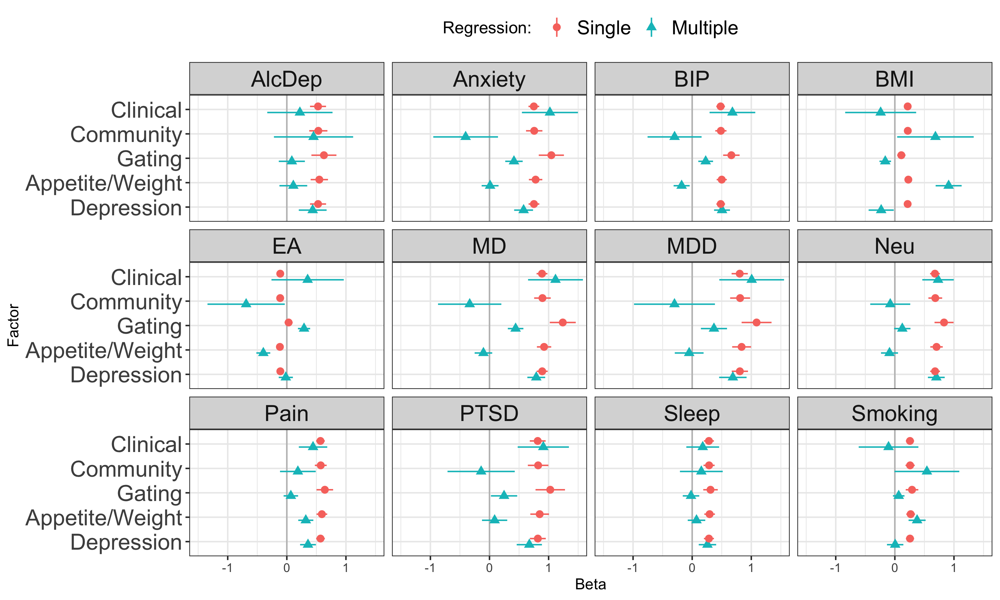

Test genetic relationship between [symptom
factors](mdd-symptom-gsem-model.md) and a selection of other phenotypes
that are genetically correlated with MDD, as well as to MDD itself.
Phenotypes to examine:

-   Major depressive disorder: Clinical cohorts from [Wray et
    al](https://www.nature.com/articles/s41588-018-0090-3%5C) and all
    cohorts from [Howard et
    al](https://www.nature.com/articles/s41593-018-%200326-7). Download
    from [PGC](https://www.med.unc.edu/pgc/download-results/) and obtain
    via [data
    access](https://www.med.unc.edu/pgc/shared-methods/how-to/).
-   bipolar disorder: [Mullins et
    al](https://pubmed.ncbi.nlm.nih.gov/34002096/). Download from
    [PGC](https://figshare.com/articles/dataset/PGC3_bipolar_disorder_GWAS_summary_statistics/14102594)
-   anxiety:
    [meta-analysis](https://drive.google.com/drive/folders/1fguHvz7l2G45sbMI9h_veQun4aXNTy1v)
    of [UKBB,
    iPSYCH](https://www.nature.com/articles/s41380-019-0559-1), and
    [ANGST](https://pubmed.ncbi.nlm.nih.gov/26754954/), from [Grotzinger
    et al
    medRxiv](https://www.medrxiv.org/content/10.1101/2020.09.22.20196089v1.full)
-   PTSD: [Nievergelt et al](https://pubmed.ncbi.nlm.nih.gov/31594949/).
    Download from
    [PGC](https://figshare.com/articles/dataset/ptsd2019/14672133)
-   tobacco use. Cigarettes per day [Liu et
    al](https://www.nature.com/articles/s41588-018-0307-5). Download
    from [UofM](https://conservancy.umn.edu/handle/11299/201564)
-   alcohol dependence. [Walters et
    al](https://www.nature.com/articles/s41593-018-0275-1). Download
    from [PGC](https://doi.org/10.6084/m9.figshare.14672187)
-   educational attainment. [Okbay et.
    al](https://www.nature.com/articles/s41588-022-01016-z). Download
    from [SSGAC Data Portal](https://thessgac.com).
-   BMI, sex combined [Pulit et
    al](https://academic.oup.com/hmg/article/28/1/166/5098227). Download
    from
    [GIANT/Broad](https://portals.broadinstitute.org/collaboration/giant/index.php/GIANT_consortium_data_files#2018_GIANT_and_UK_BioBank_Meta-analysis).
-   neuroticism: [Nagel et
    al](https://www.nature.com/articles/s41588-018-0151-7). Download
    from [CNCR](https://ctg.cncr.nl/software/summary_statistics)
-   pain: multisite chronic pain [Johnston et
    al](https://journals.plos.org/plosgenetics/article?id=10.1371/journal.pgen.1008164).
    Download from [UoG](https://researchdata.gla.ac.uk/822/)
-   chronotype: long sleep duration. [Dashti et
    al](https://www.ncbi.nlm.nih.gov/pubmed/30846698). Download from
    [SDKP](https://sleep.hugeamp.org/downloads.html).

# Setup

## R packages

R version

``` r
R.version
```

    ##                _                           
    ## platform       aarch64-apple-darwin20      
    ## arch           aarch64                     
    ## os             darwin20                    
    ## system         aarch64, darwin20           
    ## status                                     
    ## major          4                           
    ## minor          2.2                         
    ## year           2022                        
    ## month          10                          
    ## day            31                          
    ## svn rev        83211                       
    ## language       R                           
    ## version.string R version 4.2.2 (2022-10-31)
    ## nickname       Innocent and Trusting

Package installation

``` r
required_packages <- c('devtools', 'readr', 'tidyr', 'dplyr', 'ggplot2', 'stringr', 'corrplot')
for(pack in required_packages) if(!require(pack, character.only=TRUE)) install.packages(pack)

library(devtools)

if(!require(GenomicSEM)) install_github("MichelNivard/GenomicSEM")

if(!require(tidySEM)) install_github("cjvanlissa/tidySEM")
```

GenomicSEM version

``` r
require(readr)
require(tidyr)
require(stringr)
require(dplyr)
require(ggplot2)
require(corrplot)
require(GenomicSEM)

packageVersion("GenomicSEM")
```

    ## [1] '0.0.5'

# Process external sumstats

## Reformat

Format the external sumstats for reading by GenomicSEM with columns
`SNP`, `A1` (effect allele), `A2` (non-effect allele), `BETA`/`OR`, `P`,
`INFO`, and `N`.

``` r
# Major depressive disorder
mdd <- read_table('sumstats/PGC_UKB_23andMe_depression_genome-wide_info_N.txt.gz')
mdd_sumstats <- mdd %>%
    mutate(Nca=UKB_Ncases+PGC_Ncases+X23andMe_Ncases,
           Nco=UKB_Ncontrols+PGC_Ncontrols+X23andMe_Ncontrols) %>%
    transmute(SNP=MarkerName, A1=toupper(Allele1), A2=toupper(Allele2),
              BETA=Effect, SE=StdErr, P=P.value, 
              FREQ=Freq1, N=4*Nca*Nco/(Nca+Nco))
write_tsv(mdd_sumstats, 'sumstats/MD.txt')

mdd_clin <- read_tsv('sumstats/daner_MDD29.0515a_mds6.0316.gz')
mdd_clin_sumstats <- mdd_clin %>%
    transmute(SNP, A1, A2, BETA=log(OR), SE, FREQ=FRQ_U_25632, INFO, P,
              N=4*Nca*Nco/(Nca+Nco))
write_tsv(mdd_clin_sumstats, 'sumstats/MDD.txt')

# Bipolar disorder
bip <- read_tsv('sumstats/pgc-bip2021-all.vcf.tsv.gz', comment='##')
bip_sumstats <- bip %>%
    filter(IMPINFO >= 0.6) %>%
    transmute(SNP=ID, A1, A2, BETA, SE, P=PVAL, INFO=IMPINFO, N=2*NEFFDIV2)
write_tsv(bip_sumstats, 'sumstats/BIP.txt')

# alcohol dependence
alcdep <- read_table('sumstats/pgc_alcdep.eur_discovery.aug2018_release.txt.gz')
alcdep_sumstats <- alcdep %>%
mutate(SNP=str_split_fixed(SNP, pattern=":", n=2)[,1]) %>%
select(SNP, A1, A2, BETA=Z, P, N=Weight)
write_tsv(alcdep_sumstats, 'sumstats/AlcDep.txt')

# body-mass index
bmi <- read_table('sumstats/Bmi.giant-ukbb.meta-analysis.combined.23May2018.HapMap2_only.txt.gz')
bmi_sumstats <- bmi %>%
    separate(SNP, into=c('SNP', 'A1', 'A2'), sep=':') %>%
    filter(INFO >= 0.6) %>%
    select(SNP, A1=Tested_Allele, A2=Other_Allele, BETA, SE, P, INFO, N)
write_tsv(bmi_sumstats, 'sumstats/BMI.txt')

# educational attainment
ea <- read_tsv('sumstats/EA4_additive_excl_23andMe.txt.gz')
ea_sumstats <-  ea %>%
    transmute(SNP=rsID, A1=Effect_allele, A2=Other_allele, FREQ=EAF_HRC, BETA=Beta, SE_unadj, P=P_unadj, N=765283)
write_tsv(ea_sumstats, 'sumstats/EA.txt')

# multisite chronic pain
pain <- read_tsv('sumstats/chronic_pain-bgen.stats.gz')
pain_sumstats <- pain %>%
    filter(INFO >= 0.6) %>%
    transmute(SNP, A1=ALLELE1, A2=ALLELE0, BETA, SE, P=P_BOLT_LMM_INF, INFO, N=387649) 
write_tsv(pain_sumstats, 'sumstats/Pain.txt')

# tabacco use
smoking <- read_table('sumstats/CigarettesPerDay.txt.gz')
smoking_sumstats <- smoking %>%
    select(SNP=RSID, A1=ALT, A2=REF, BETA, SE, P=PVALUE, N)
write_tsv(smoking_sumstats, 'sumstats/Smoking.txt')

# chronotype (long sleep duration)
sleep <- read_table('sumstats/longsumstats.txt.gz')
sleep_sumstats <- sleep %>%
    filter(INFO >= 0.6) %>%
    transmute(SNP, A1=ALLELE1, A2=ALLELE0, BETA=BETA_LONGSLEEP, SE=SE_LONGSLEEP, P=P_LONGSLEEP, INFO, N=4*34184*(305742-34184)/305742)
write_tsv(sleep_sumstats, 'sumstats/Sleep.txt')

# anxiety disorder
anxiety <- read_table('sumstats/META_UKBB_iPSYCH_ANGST_wNcol.sumstats.gz')
anxiety_sumstats <- anxiety %>%
    mutate(Nca=25453+12655+7016, Nco=58113+19225+14745) %>%
    transmute(SNP, A1=Allele1, A2=Allele2, BETA=Effect, SE=StdErr, P, N=4*Nca*Nco/(Nca+Nco))
write_tsv(anxiety_sumstats, 'sumstats/Anxiety.txt')    

# post-traumatic stress disorder
ptsd <- read_tsv('sumstats/pts_eur_freeze2_overall.results.gz')
ptsd_sumstats <- ptsd %>%
    transmute(SNP,  A1, A2, OR, SE, P, INFO, N=4*Nca*Nco/(Nca+Nco))
write_tsv(ptsd_sumstats, 'sumstats/PTSD.txt')
    
# neuroticism
neu <- read_tsv('sumstats/sumstats_neuroticism_ctg_format.txt.gz')
neu_sumstats <- neu %>%
    filter(!is.na(INFO_UKB)) %>%
    select(SNP=RSID, A1, A2, BETA=Z, P, INFO=INFO_UKB, N)
write_tsv(neu_sumstats, 'sumstats/Neu.txt')
```

## Munge

``` r
ext_traits <- c('AlcDep'=0.159, 'Anxiety'=0.16, 'BIP'=0.01,
                'BMI'=NA, 'EA'=NA, 'MD'=0.3, 'MDD'=0.15, 'Neu'=NA,
                'PTSD'=0.3, 'Pain'=NA, 'Sleep'=0.11, 'Smoking'=NA)
ext_trait_names <- names(ext_traits)
```

``` r
munge(file.path('sumstats', paste(ext_trait_names, 'txt', sep='.')),
trait.names=ext_trait_names,
hm3=here::here("sumstats/reference/w_hm3.snplist"),
info.filter = 0.9, maf.filter = 0.01)
```

# Symptom labels

MDD DSM symptoms are numbered 1-9:

``` r
# plot labels

dsm_mdd_symptoms_labels <-
read_delim("
MDD1;Mood;Mood;Dep
MDD2;Interest;Interest;Anh
MDD3;Weight⇅;Weight⇆;App
MDD3a;Weight⇊;Weight⇇;AppDec
MDD3b;Weight⇈;Weight⇉;AppInc
MDD4;Sleep⇅;Sleep⇆;Sle
MDD4a;Sleep⇊;Sleep⇇;SleDec
MDD4b;Sleep⇈;Sleep⇉;SleInc
MDD5;Motor⇅;Motor⇆;Moto
MDD5a;Motor⇈;Motor⇉;MotoInc
MDD5b;Motor⇊;Motor⇇;MotoDec
MDD6;Fatigue;Fatigue;Fatig
MDD7;Guilt;Guilt;Guilt
MDD8;Concentrate;Concentrate;Conc
MDD9;Suicidality;Suicidality;Sui
", col_names=c('ref', 'h', 'v', 'abbv'), delim=';')
```

    ## Rows: 15 Columns: 4
    ## ── Column specification ─────────────────────────────────────────────────────────────────────────────────────────────────────────────────────────────────
    ## Delimiter: ";"
    ## chr (4): ref, h, v, abbv
    ## 
    ## ℹ Use `spec()` to retrieve the full column specification for this data.
    ## ℹ Specify the column types or set `show_col_types = FALSE` to quiet this message.

``` r
dsm_mdd_symptoms_reference <-
read_delim("
MDD1;Depressed mood most of the day, nearly every day
MDD2;Markedly diminished interest or pleasure in all, or almost all, activities most of the day, nearly every day
MDD3;Significant change in weight or appetite
MDD3a;Significant weight loss or decrease in appetite
MDD3b;Significant weight gain or increase in appetite
MDD4;Sleeping too much or not sleeping enough
MDD4a;Insomnia nearly every day
MDD4b;Hypersomnia nearly every day
MDD5;Changes in speed/amount of moving or speaking
MDD5a;Psychomotor agitation nearly every day
MDD5b;Psychomotor slowing nearly every day
MDD6;Fatigue or loss of energy nearly every day
MDD7;Feelings of worthlessness or excessive or inappropriate guilt
MDD8;Diminished ability to think or concentrate, or indecisiveness
MDD9;Recurrent thoughts of death or suicide or a suicide attempt or a Multiple plan for attempting suicide
", col_names=c('Reference', 'Description'), delim=';')
```

    ## Rows: 15 Columns: 2
    ## ── Column specification ─────────────────────────────────────────────────────────────────────────────────────────────────────────────────────────────────
    ## Delimiter: ";"
    ## chr (2): Reference, Description
    ## 
    ## ℹ Use `spec()` to retrieve the full column specification for this data.
    ## ℹ Specify the column types or set `show_col_types = FALSE` to quiet this message.

# Symptom prevalences

Load previously calculated symptom prevalences:

``` r
all_covstruct_prefix <- 'agds_pgc.alspac_ukb.covstruct'
all_sumstats_prevs <- read_tsv(here::here('ldsc', paste(all_covstruct_prefix, 'prevs', 'txt', sep='.'))) 
```

    ## Rows: 38 Columns: 9
    ## ── Column specification ─────────────────────────────────────────────────────────────────────────────────────────────────────────────────────────────────
    ## Delimiter: "\t"
    ## chr (5): cohorts, symptom, sumstats, filename, trait_name
    ## dbl (4): Nca, Nco, samp_prev, pop_prev
    ## 
    ## ℹ Use `spec()` to retrieve the full column specification for this data.
    ## ℹ Specify the column types or set `show_col_types = FALSE` to quiet this message.

# Multivariable LDSC estimation

Calculate LDSC covariance structure for syptoms used in the combined
structural model and the external phenotypes.

``` r
covstruct_prefix <- 'symptoms.external.covstruct'
covstruct_r <- here::here('ldsc', paste(covstruct_prefix, 'deparse.R', sep='.'))
covstruct_rds <- here::here('ldsc', paste(covstruct_prefix, 'rds', sep='.'))

if(!file.exists(covstruct_r)) {
    
  symptoms_sumstats_prevs <- all_sumstats_prevs %>%
  left_join(dsm_mdd_symptoms_labels, by=c('symptom'='ref')) %>%
  mutate(samp_prev=0.5,
         cohort=case_when(str_detect(filename, 'AGDS_PGC') ~ 'Clin',
                          str_detect(filename, 'ALSPAC_UKB') ~ 'Comm',
                          str_detect(filename, 'UKBt') ~ 'Ukb')) %>%
  transmute(filename=here::here(filename), samp_prev, pop_prev, trait_name=paste0(cohort, abbv))

  # external files, prevalences and trait names
  external_sumstats_prevs <-
    tibble(filename=paste(ext_trait_names, 'sumstats', 'gz', sep='.'),
           trait_name=ext_trait_names,
           pop_prev=ext_traits) %>%
    mutate(samp_prev=if_else(!is.na(pop_prev), true=0.5, false=NA_real_))
    
  sumstats_prevs <- bind_rows(symptoms_sumstats_prevs, external_sumstats_prevs)
    

  symptoms_covstruct <- ldsc(traits=sumstats_prevs$filename,
                             sample.prev=sumstats_prevs$samp_prev,
                             population.prev=sumstats_prevs$pop_prev,
                             ld=here::here('sumstats/reference/eur_w_ld_chr/'),
                             wld=here::here('sumstats/reference/eur_w_ld_chr/'),
                             trait.names=sumstats_prevs$trait_name)

  dput(symptoms_covstruct, covstruct_r, control=c('exact'))
  saveRDS(symptoms_covstruct, covstruct_rds)
  
  # check for exact match of deparsed object
  identical(dget(covstruct_r), symptoms_covstruct)

} else {

  symptoms_covstruct <- dget(covstruct_r)

}
```

# Models

## Symptom factors

Base model of symptom factors, with merged Cognitive/Vegeative and
Appetite.

``` r
model <- "
DEP =~ NA*CommDep + CommAnh + UkbDep + UkbAnh + ClinSleDec + CommSleDec + ClinMotoInc + CommGuilt + ClinSui + CommSui + ClinSleInc + CommSleInc + ClinMotoDec + CommFatig + CommConc
APP =~ NA*ClinAppInc + ClinAppDec + CommAppDec + app_co3b*CommAppInc
GATE =~ NA*CommDep + CommAnh + UkbDep + UkbAnh

DEP ~~ 1*DEP
APP ~~ 1*APP
GATE ~~ 1*GATE
GATE ~~ 0*DEP + 0*APP

u1 > 0.001
UkbDep ~~ u1*UkbDep
co3b > 0.001
CommAppInc ~~ co3b*CommAppInc
"
fit <- usermodel(symptoms_covstruct, estimation='DWLS', model=model, CFIcalc=TRUE)
```

    ## [1] "Running primary model"
    ## [1] "Calculating CFI"
    ## [1] "Calculating Standardized Results"
    ## [1] "Calculating SRMR"
    ## elapsed 
    ##   4.697 
    ## [1] "The S matrix was smoothed prior to model estimation due to a non-positive definite matrix. The largest absolute difference in a cell between the smoothed and non-smoothed matrix was  0.0465162451355036 As a result of the smoothing, the largest Z-statistic change for the genetic covariances was  1.63713097734562 . We recommend setting the smooth_check argument to true if you are going to run a multivariate GWAS."

    ## Warning in usermodel(symptoms_covstruct, estimation = "DWLS", model = model, :
    ## A difference greater than .025 was observed pre- and post-smoothing in the
    ## genetic covariance matrix. This reflects a large difference and results should
    ## be interpreted with caution!! This can often result from including low powered
    ## traits, and you might consider removing those traits from the model. If you are
    ## going to run a multivariate GWAS we strongly recommend setting the smooth_check
    ## argument to true to check smoothing for each SNP.

    ## Warning in usermodel(symptoms_covstruct, estimation = "DWLS", model = model, :
    ## A difference greater than .025 was observed pre- and post-smoothing for
    ## Z-statistics in the genetic covariance matrix. This reflects a large difference
    ## and results should be interpreted with caution!! This can often result from
    ## including low powered traits, and you might consider removing those traits from
    ## the model. If you are going to run a multivariate GWAS we strongly recommend
    ## setting the smooth_check argument to true to check smoothing for each SNP.

## Sample factors

Base model of Clinical and Community sample factors.

``` r
model <- "
CLIN =~ NA*ClinAppDec + ClinAppInc + ClinSleDec + ClinSleInc + ClinMotoInc + ClinMotoDec + ClinSui
COMM =~ NA*CommDep + CommAnh + UkbDep + UkbAnh + CommAppDec + CommAppInc + CommSleDec + CommSleInc + CommFatig + CommGuilt + CommConc + CommSui
GATE =~ NA*CommDep + CommAnh + UkbDep + UkbAnh

CLIN ~~ 1*CLIN
GATE ~~ 1*GATE
COMM ~~ 1*COMM
GATE ~~ 0*COMM + 0*CLIN
"
fit <- usermodel(symptoms_covstruct, estimation='DWLS', model=model, CFIcalc=TRUE)
```

    ## [1] "Running primary model"
    ## [1] "Calculating CFI"
    ## [1] "Calculating Standardized Results"
    ## [1] "Calculating SRMR"
    ## elapsed 
    ##   1.339 
    ## [1] "The S matrix was smoothed prior to model estimation due to a non-positive definite matrix. The largest absolute difference in a cell between the smoothed and non-smoothed matrix was  0.0465162451355036 As a result of the smoothing, the largest Z-statistic change for the genetic covariances was  1.63713097734562 . We recommend setting the smooth_check argument to true if you are going to run a multivariate GWAS."

    ## Warning in usermodel(symptoms_covstruct, estimation = "DWLS", model = model, :
    ## A difference greater than .025 was observed pre- and post-smoothing in the
    ## genetic covariance matrix. This reflects a large difference and results should
    ## be interpreted with caution!! This can often result from including low powered
    ## traits, and you might consider removing those traits from the model. If you are
    ## going to run a multivariate GWAS we strongly recommend setting the smooth_check
    ## argument to true to check smoothing for each SNP.

    ## Warning in usermodel(symptoms_covstruct, estimation = "DWLS", model = model, :
    ## A difference greater than .025 was observed pre- and post-smoothing for
    ## Z-statistics in the genetic covariance matrix. This reflects a large difference
    ## and results should be interpreted with caution!! This can often result from
    ## including low powered traits, and you might consider removing those traits from
    ## the model. If you are going to run a multivariate GWAS we strongly recommend
    ## setting the smooth_check argument to true to check smoothing for each SNP.

## External phenotypes

### Symptom factors

Compare symptom factors against each external phenotype. Single
regression of each external phenotype on each symptom or symptom
cluster.

``` r
ext_symp.glue <- "
DEP =~ NA*CommDep + CommAnh + UkbDep + UkbAnh + ClinSleDec + CommSleDec + ClinMotoInc + CommGuilt + ClinSui + CommSui + ClinSleInc + CommSleInc + ClinMotoDec + CommFatig + CommConc
APP =~ NA*ClinAppInc + ClinAppDec + CommAppDec + app_co3b*CommAppInc
GATE =~ NA*CommDep + CommAnh + UkbDep + UkbAnh

DEP ~~ 1*DEP
APP ~~ 1*APP
GATE ~~ 1*GATE
GATE ~~ 0*DEP + 0*APP

u1 > 0.001
UkbDep ~~ u1*UkbDep
co3b > 0.001
CommAppInc ~~ co3b*CommAppInc

AlcDep ~ {symptom}
Anxiety ~  {symptom}
BIP ~ {symptom}
BMI ~ {symptom}
EA ~ {symptom}
MD ~ {symptom}
MDD ~ {symptom}
Neu ~ {symptom}
PTSD ~ {symptom}
Pain ~ {symptom}
Sleep ~ {symptom}
Smoking ~ {symptom}
"

ext_symp.model_list <- lapply(c('DEP', 'APP', 'GATE'), function(symptom) str_glue_data(list(symptom=symptom), ext_symp.glue))

ext_symp.fit_list <- lapply(ext_symp.model_list, function(model) usermodel(symptoms_covstruct, estimation='DWLS', model=model))
```

    ## [1] "Running primary model"
    ## [1] "Calculating CFI"
    ## [1] "Calculating Standardized Results"
    ## [1] "Calculating SRMR"
    ## elapsed 
    ##  54.975 
    ## [1] "The S matrix was smoothed prior to model estimation due to a non-positive definite matrix. The largest absolute difference in a cell between the smoothed and non-smoothed matrix was  0.0499086254058032 As a result of the smoothing, the largest Z-statistic change for the genetic covariances was  1.97466132311611 . We recommend setting the smooth_check argument to true if you are going to run a multivariate GWAS."

    ## Warning in usermodel(symptoms_covstruct, estimation = "DWLS", model = model): A
    ## difference greater than .025 was observed pre- and post-smoothing in the
    ## genetic covariance matrix. This reflects a large difference and results should
    ## be interpreted with caution!! This can often result from including low powered
    ## traits, and you might consider removing those traits from the model. If you are
    ## going to run a multivariate GWAS we strongly recommend setting the smooth_check
    ## argument to true to check smoothing for each SNP.

    ## Warning in usermodel(symptoms_covstruct, estimation = "DWLS", model = model): A
    ## difference greater than .025 was observed pre- and post-smoothing for
    ## Z-statistics in the genetic covariance matrix. This reflects a large difference
    ## and results should be interpreted with caution!! This can often result from
    ## including low powered traits, and you might consider removing those traits from
    ## the model. If you are going to run a multivariate GWAS we strongly recommend
    ## setting the smooth_check argument to true to check smoothing for each SNP.

    ## [1] "Running primary model"
    ## [1] "Calculating CFI"
    ## [1] "Calculating Standardized Results"
    ## [1] "Calculating SRMR"
    ## elapsed 
    ##  58.929 
    ## [1] "The S matrix was smoothed prior to model estimation due to a non-positive definite matrix. The largest absolute difference in a cell between the smoothed and non-smoothed matrix was  0.0499086254058032 As a result of the smoothing, the largest Z-statistic change for the genetic covariances was  1.97466132311611 . We recommend setting the smooth_check argument to true if you are going to run a multivariate GWAS."

    ## Warning in usermodel(symptoms_covstruct, estimation = "DWLS", model = model): A
    ## difference greater than .025 was observed pre- and post-smoothing in the
    ## genetic covariance matrix. This reflects a large difference and results should
    ## be interpreted with caution!! This can often result from including low powered
    ## traits, and you might consider removing those traits from the model. If you are
    ## going to run a multivariate GWAS we strongly recommend setting the smooth_check
    ## argument to true to check smoothing for each SNP.

    ## Warning in usermodel(symptoms_covstruct, estimation = "DWLS", model = model): A
    ## difference greater than .025 was observed pre- and post-smoothing for
    ## Z-statistics in the genetic covariance matrix. This reflects a large difference
    ## and results should be interpreted with caution!! This can often result from
    ## including low powered traits, and you might consider removing those traits from
    ## the model. If you are going to run a multivariate GWAS we strongly recommend
    ## setting the smooth_check argument to true to check smoothing for each SNP.

    ## [1] "Running primary model"
    ## [1] "Calculating CFI"
    ## [1] "Calculating Standardized Results"
    ## [1] "Calculating SRMR"
    ## elapsed 
    ##  69.895 
    ## [1] "The S matrix was smoothed prior to model estimation due to a non-positive definite matrix. The largest absolute difference in a cell between the smoothed and non-smoothed matrix was  0.0499086254058032 As a result of the smoothing, the largest Z-statistic change for the genetic covariances was  1.97466132311611 . We recommend setting the smooth_check argument to true if you are going to run a multivariate GWAS."

    ## Warning in usermodel(symptoms_covstruct, estimation = "DWLS", model = model): A
    ## difference greater than .025 was observed pre- and post-smoothing in the
    ## genetic covariance matrix. This reflects a large difference and results should
    ## be interpreted with caution!! This can often result from including low powered
    ## traits, and you might consider removing those traits from the model. If you are
    ## going to run a multivariate GWAS we strongly recommend setting the smooth_check
    ## argument to true to check smoothing for each SNP.

    ## Warning in usermodel(symptoms_covstruct, estimation = "DWLS", model = model): A
    ## difference greater than .025 was observed pre- and post-smoothing for
    ## Z-statistics in the genetic covariance matrix. This reflects a large difference
    ## and results should be interpreted with caution!! This can often result from
    ## including low powered traits, and you might consider removing those traits from
    ## the model. If you are going to run a multivariate GWAS we strongly recommend
    ## setting the smooth_check argument to true to check smoothing for each SNP.

### Sample factors

``` r
ext_samp.glue <- "
CLIN =~ NA*ClinAppDec + ClinAppInc + ClinSleDec + ClinSleInc + ClinMotoInc + ClinMotoDec + ClinSui
COMM =~ NA*CommDep + CommAnh + UkbDep + UkbAnh + CommAppDec + CommAppInc + CommSleDec + CommSleInc + CommFatig + CommGuilt + CommConc + CommSui
GATE =~ NA*CommDep + CommAnh + UkbDep + UkbAnh

CLIN ~~ 1*CLIN
GATE ~~ 1*GATE
COMM ~~ 1*COMM
GATE ~~ 0*COMM + 0*CLIN

cc < 0.99
CLIN ~~ cc*COMM

AlcDep ~ {symptom}
Anxiety ~  {symptom}
BIP ~ {symptom}
BMI ~ {symptom}
EA ~ {symptom}
MD ~ {symptom}
MDD ~ {symptom}
Neu ~ {symptom}
PTSD ~ {symptom}
Pain ~ {symptom}
Sleep ~ {symptom}
Smoking ~ {symptom}
"

ext_samp.model_list <- lapply(c('CLIN', 'COMM'), function(symptom) str_glue_data(list(symptom=symptom), ext_samp.glue))

ext_samp.fit_list <- lapply(ext_samp.model_list, function(model) usermodel(symptoms_covstruct, estimation='DWLS', model=model))
```

    ## [1] "Running primary model"
    ## [1] "Calculating CFI"
    ## [1] "Calculating Standardized Results"
    ## [1] "Calculating SRMR"
    ## elapsed 
    ##  82.797 
    ## [1] "The S matrix was smoothed prior to model estimation due to a non-positive definite matrix. The largest absolute difference in a cell between the smoothed and non-smoothed matrix was  0.0499086254058032 As a result of the smoothing, the largest Z-statistic change for the genetic covariances was  1.97466132311611 . We recommend setting the smooth_check argument to true if you are going to run a multivariate GWAS."

    ## Warning in usermodel(symptoms_covstruct, estimation = "DWLS", model = model): A
    ## difference greater than .025 was observed pre- and post-smoothing in the
    ## genetic covariance matrix. This reflects a large difference and results should
    ## be interpreted with caution!! This can often result from including low powered
    ## traits, and you might consider removing those traits from the model. If you are
    ## going to run a multivariate GWAS we strongly recommend setting the smooth_check
    ## argument to true to check smoothing for each SNP.

    ## Warning in usermodel(symptoms_covstruct, estimation = "DWLS", model = model): A
    ## difference greater than .025 was observed pre- and post-smoothing for
    ## Z-statistics in the genetic covariance matrix. This reflects a large difference
    ## and results should be interpreted with caution!! This can often result from
    ## including low powered traits, and you might consider removing those traits from
    ## the model. If you are going to run a multivariate GWAS we strongly recommend
    ## setting the smooth_check argument to true to check smoothing for each SNP.

    ## [1] "Running primary model"
    ## [1] "Calculating CFI"
    ## [1] "Calculating Standardized Results"
    ## [1] "Calculating SRMR"
    ## elapsed 
    ##  71.699 
    ## [1] "The S matrix was smoothed prior to model estimation due to a non-positive definite matrix. The largest absolute difference in a cell between the smoothed and non-smoothed matrix was  0.0499086254058032 As a result of the smoothing, the largest Z-statistic change for the genetic covariances was  1.97466132311611 . We recommend setting the smooth_check argument to true if you are going to run a multivariate GWAS."

    ## Warning in usermodel(symptoms_covstruct, estimation = "DWLS", model = model): A
    ## difference greater than .025 was observed pre- and post-smoothing in the
    ## genetic covariance matrix. This reflects a large difference and results should
    ## be interpreted with caution!! This can often result from including low powered
    ## traits, and you might consider removing those traits from the model. If you are
    ## going to run a multivariate GWAS we strongly recommend setting the smooth_check
    ## argument to true to check smoothing for each SNP.

    ## Warning in usermodel(symptoms_covstruct, estimation = "DWLS", model = model): A
    ## difference greater than .025 was observed pre- and post-smoothing for
    ## Z-statistics in the genetic covariance matrix. This reflects a large difference
    ## and results should be interpreted with caution!! This can often result from
    ## including low powered traits, and you might consider removing those traits from
    ## the model. If you are going to run a multivariate GWAS we strongly recommend
    ## setting the smooth_check argument to true to check smoothing for each SNP.

``` r
ext_single <-
bind_rows(lapply(c(ext_symp.fit_list, ext_samp.fit_list), function(fit) mutate(fit$results, p_value=as.character(p_value)))) %>%
select(lhs, op, rhs, STD_Genotype, STD_Genotype_SE, p_value) %>%
filter(lhs %in% ext_trait_names, rhs %in% c('DEP', 'APP', 'GATE', 'CLIN', 'COMM')) %>%
mutate(Beta='Single', Factor=rhs, Phenotype=lhs, p_value=as.numeric(p_value))
```

### Symptom factors

Multiple regression of each phenotype on symptom factors, to estimate
relationship after condition on each of the other factors.

``` r
ext_mult_symp.model <- "
DEP =~ NA*CommDep + CommAnh + UkbDep + UkbAnh + ClinSleDec + CommSleDec + ClinMotoInc + CommGuilt + ClinSui + CommSui + ClinSleInc + CommSleInc + ClinMotoDec + CommFatig + CommConc
APP =~ NA*ClinAppInc + ClinAppDec + CommAppDec + app_co3b*CommAppInc
GATE =~ NA*CommDep + CommAnh + UkbDep + UkbAnh

DEP ~~ 1*DEP
APP ~~ 1*APP
GATE ~~ 1*GATE
GATE ~~ 0*DEP + 0*APP

u1 > 0.001
UkbDep ~~ u1*UkbDep
co3b > 0.001
CommAppInc ~~ co3b*CommAppInc

AlcDep ~ DEP + APP + GATE
Anxiety ~  DEP + APP + GATE
BIP ~ DEP + APP + GATE
BMI ~ DEP + APP + GATE
EA ~ DEP + APP + GATE
MD ~ DEP + APP + GATE
MDD ~ DEP + APP + GATE
Neu ~ DEP + APP + GATE
PTSD ~ DEP + APP + GATE
Pain ~ DEP + APP + GATE
Sleep ~ DEP + APP + GATE
Smoking ~ DEP + APP + GATE
"
ext_mult_symp.fit <- usermodel(symptoms_covstruct, estimation='DWLS', model=ext_mult_symp.model)
```

    ## [1] "Running primary model"
    ## [1] "Calculating CFI"
    ## [1] "Calculating Standardized Results"
    ## [1] "Calculating SRMR"
    ## elapsed 
    ##  69.857 
    ## [1] "The S matrix was smoothed prior to model estimation due to a non-positive definite matrix. The largest absolute difference in a cell between the smoothed and non-smoothed matrix was  0.0499086254058032 As a result of the smoothing, the largest Z-statistic change for the genetic covariances was  1.97466132311611 . We recommend setting the smooth_check argument to true if you are going to run a multivariate GWAS."

    ## Warning in usermodel(symptoms_covstruct, estimation = "DWLS", model =
    ## ext_mult_symp.model): A difference greater than .025 was observed pre- and
    ## post-smoothing in the genetic covariance matrix. This reflects a large
    ## difference and results should be interpreted with caution!! This can often
    ## result from including low powered traits, and you might consider removing those
    ## traits from the model. If you are going to run a multivariate GWAS we strongly
    ## recommend setting the smooth_check argument to true to check smoothing for each
    ## SNP.

    ## Warning in usermodel(symptoms_covstruct, estimation = "DWLS", model =
    ## ext_mult_symp.model): A difference greater than .025 was observed pre- and
    ## post-smoothing for Z-statistics in the genetic covariance matrix. This reflects
    ## a large difference and results should be interpreted with caution!! This can
    ## often result from including low powered traits, and you might consider removing
    ## those traits from the model. If you are going to run a multivariate GWAS we
    ## strongly recommend setting the smooth_check argument to true to check smoothing
    ## for each SNP.

### Sample factors

``` r
ext_samp_mult.model <- "
CLIN =~ NA*ClinAppDec + ClinAppInc + ClinSleDec + ClinSleInc + ClinMotoInc + ClinMotoDec + ClinSui
COMM =~ NA*CommDep + CommAnh + UkbDep + UkbAnh + CommAppDec + CommAppInc + CommSleDec + CommSleInc + CommFatig + CommGuilt + CommConc + CommSui
GATE =~ NA*CommDep + CommAnh + UkbDep + UkbAnh

CLIN ~~ 1*CLIN
GATE ~~ 1*GATE
COMM ~~ 1*COMM
GATE ~~ 0*COMM + 0*CLIN

AlcDep ~ CLIN + COMM 
Anxiety ~  CLIN + COMM
BIP ~ CLIN + COMM 
BMI ~ CLIN + COMM 
EA ~ CLIN + COMM 
MD ~ CLIN + COMM
MDD ~ CLIN + COMM
Neu ~ CLIN + COMM
PTSD ~ CLIN + COMM
Pain ~ CLIN + COMM
Sleep ~ CLIN + COMM
Smoking ~ CLIN + COMM
"
ext_samp_mult.fit <- usermodel(symptoms_covstruct, estimation='DWLS', model=ext_samp_mult.model)
```

    ## [1] "Running primary model"
    ## [1] "Calculating CFI"
    ## [1] "Calculating Standardized Results"
    ## [1] "Calculating SRMR"
    ## elapsed 
    ##  37.954 
    ## [1] "The S matrix was smoothed prior to model estimation due to a non-positive definite matrix. The largest absolute difference in a cell between the smoothed and non-smoothed matrix was  0.0499086254058032 As a result of the smoothing, the largest Z-statistic change for the genetic covariances was  1.97466132311611 . We recommend setting the smooth_check argument to true if you are going to run a multivariate GWAS."

    ## Warning in usermodel(symptoms_covstruct, estimation = "DWLS", model =
    ## ext_samp_mult.model): A difference greater than .025 was observed pre- and
    ## post-smoothing in the genetic covariance matrix. This reflects a large
    ## difference and results should be interpreted with caution!! This can often
    ## result from including low powered traits, and you might consider removing those
    ## traits from the model. If you are going to run a multivariate GWAS we strongly
    ## recommend setting the smooth_check argument to true to check smoothing for each
    ## SNP.

    ## Warning in usermodel(symptoms_covstruct, estimation = "DWLS", model =
    ## ext_samp_mult.model): A difference greater than .025 was observed pre- and
    ## post-smoothing for Z-statistics in the genetic covariance matrix. This reflects
    ## a large difference and results should be interpreted with caution!! This can
    ## often result from including low powered traits, and you might consider removing
    ## those traits from the model. If you are going to run a multivariate GWAS we
    ## strongly recommend setting the smooth_check argument to true to check smoothing
    ## for each SNP.

``` r
ext_multiple <-
bind_rows(lapply(list(ext_mult_symp.fit, ext_samp_mult.fit),
                 function(fit) fit$results)) %>%
  select(lhs, op, rhs, STD_Genotype, STD_Genotype_SE, p_value) %>%
  filter(lhs %in% ext_trait_names, rhs %in% c('DEP', 'APP', 'GATE', 'CLIN', 'COMM')) %>%
  mutate(Beta='Multiple', Factor=rhs, Phenotype=lhs)
```

``` r
ext_table <-
bind_rows(ext_single, ext_multiple) %>%
transmute(Phenotype,
          Factor=factor(Factor,
                        levels=c('DEP', 'APP', 'GATE', 'CLIN', 'COMM'),
                        labels=c("Depression", "Appetite/Weight", "Gating", "Community", "Clinical")),
          Model=Beta, STD_Genotype, STD_Genotype_SE, p_value) %>%
mutate(fdr=p.adjust(p_value, 'BY')) |>
arrange(Phenotype, desc(Factor), Model)

ext_table
```

    ##     Phenotype          Factor    Model STD_Genotype    STD_Genotype_SE
    ## 1      AlcDep        Clinical Multiple  0.120842614  0.370476961320492
    ## 2      AlcDep        Clinical   Single  0.472744390  0.072715189272104
    ## 3      AlcDep       Community Multiple  0.553998533  0.451475966420007
    ## 4      AlcDep       Community   Single  0.477097321 0.0822308805109108
    ## 5      AlcDep          Gating Multiple  0.025083620  0.134302847033415
    ## 6      AlcDep          Gating   Single  0.567515837  0.132508060276344
    ## 7      AlcDep Appetite/Weight Multiple  0.109170628  0.112673798240983
    ## 8      AlcDep Appetite/Weight   Single  0.545975000 0.0942203291541773
    ## 9      AlcDep      Depression Multiple  0.438410495  0.101255527199284
    ## 10     AlcDep      Depression   Single  0.472377555 0.0728086169004453
    ## 11    Anxiety        Clinical Multiple  0.987202049  0.334212763993674
    ## 12    Anxiety        Clinical   Single  0.706727367 0.0502600320551331
    ## 13    Anxiety       Community Multiple -0.447304347  0.395788775975659
    ## 14    Anxiety       Community   Single  0.712958656 0.0791675441466363
    ## 15    Anxiety          Gating Multiple  0.411125225 0.0846264509973725
    ## 16    Anxiety          Gating   Single  1.000869392  0.132584660936842
    ## 17    Anxiety Appetite/Weight Multiple -0.023883790  0.065607169181795
    ## 18    Anxiety Appetite/Weight   Single  0.814346426 0.0850138040134893
    ## 19    Anxiety      Depression Multiple  0.532500357 0.0669557071460516
    ## 20    Anxiety      Depression   Single  0.705947198 0.0503852932048178
    ## 21        BIP        Clinical Multiple  0.776226448  0.324816025541961
    ## 22        BIP        Clinical   Single  0.498052986 0.0363035201204751
    ## 23        BIP       Community Multiple -0.451185853  0.377105431259951
    ## 24        BIP       Community   Single  0.502497313 0.0558807401700145
    ## 25        BIP          Gating Multiple  0.220222312 0.0744804689413058
    ## 26        BIP          Gating   Single  0.678715803 0.0986536175663139
    ## 27        BIP Appetite/Weight Multiple -0.137367821 0.0630937304552237
    ## 28        BIP Appetite/Weight   Single  0.572589285 0.0606180054600234
    ## 29        BIP      Depression Multiple  0.463845830 0.0541942257769026
    ## 30        BIP      Depression   Single  0.497550876 0.0363816076430194
    ## 31        BMI        Clinical Multiple -0.512882984  0.722403664125655
    ## 32        BMI        Clinical   Single  0.209441867  0.027101582747042
    ## 33        BMI       Community Multiple  1.175474385    0.7937046512339
    ## 34        BMI       Community   Single  0.211334293 0.0327028634246196
    ## 35        BMI          Gating Multiple -0.142247842 0.0615964023200802
    ## 36        BMI          Gating   Single  0.160135633 0.0454357398495868
    ## 37        BMI Appetite/Weight Multiple  0.869791234  0.108330760647499
    ## 38        BMI Appetite/Weight   Single  0.246277661 0.0361528417843866
    ## 39        BMI      Depression Multiple -0.027330562 0.0946403755902889
    ## 40        BMI      Depression   Single  0.212455921 0.0270988752762927
    ## 41         EA        Clinical Multiple  0.441755693  0.534646529525153
    ## 42         EA        Clinical   Single -0.099383064  0.028591720855334
    ## 43         EA       Community Multiple -0.863433424  0.585694284005175
    ## 44         EA       Community   Single -0.100385913 0.0291786839273907
    ## 45         EA          Gating Multiple  0.326132585 0.0757967054732548
    ## 46         EA          Gating   Single  0.007589984 0.0415863683277659
    ## 47         EA Appetite/Weight Multiple -0.235869484 0.0504535050811291
    ## 48         EA Appetite/Weight   Single -0.116513026  0.033805885103372
    ## 49         EA      Depression Multiple -0.191592998 0.0446507071861614
    ## 50         EA      Depression   Single -0.098192288 0.0286157176315153
    ## 51         MD        Clinical Multiple  1.087658449  0.263989857042839
    ## 52         MD        Clinical   Single  0.883867825 0.0387631464950772
    ## 53         MD       Community Multiple -0.314768097  0.320838492341552
    ## 54         MD       Community   Single  0.891635773 0.0842683837826528
    ## 55         MD          Gating Multiple  0.463276077 0.0759946762718348
    ## 56         MD          Gating   Single  1.246129949  0.156851523732874
    ## 57         MD Appetite/Weight Multiple  0.014627641 0.0574259693070218
    ## 58         MD Appetite/Weight   Single  1.018201005 0.0903256069310309
    ## 59         MD      Depression Multiple  0.690495206 0.0548803974926601
    ## 60         MD      Depression   Single  0.885562740 0.0388615688427246
    ## 61        MDD        Clinical Multiple  1.123048366  0.425872159719764
    ## 62        MDD        Clinical   Single  0.789450260 0.0721919040779266
    ## 63        MDD       Community Multiple -0.526449098  0.511747314532823
    ## 64        MDD       Community   Single  0.796398241 0.0961948348056698
    ## 65        MDD          Gating Multiple  0.423315057  0.129265396771256
    ## 66        MDD          Gating   Single  1.114320530  0.169673464033471
    ## 67        MDD Appetite/Weight Multiple -0.060047145  0.109680953536236
    ## 68        MDD Appetite/Weight   Single  0.909295326   0.10965139431752
    ## 69        MDD      Depression Multiple  0.630231849 0.0986172812319723
    ## 70        MDD      Depression   Single  0.789794785 0.0722070401790363
    ## 71        Neu        Clinical Multiple  0.716426894  0.141036769670343
    ## 72        Neu        Clinical   Single  0.658738978  0.036818313492786
    ## 73        Neu       Community Multiple -0.088114162  0.195992511987339
    ## 74        Neu       Community   Single  0.664553354 0.0671021281930817
    ## 75        Neu          Gating Multiple  0.102403731  0.084662161041217
    ## 76        Neu          Gating   Single  0.827612650  0.113276123056742
    ## 77        Neu Appetite/Weight Multiple -0.031340100 0.0567111700054539
    ## 78        Neu Appetite/Weight   Single  0.758034592 0.0723517426867886
    ## 79        Neu      Depression Multiple  0.652832146 0.0535795529035438
    ## 80        Neu      Depression   Single  0.659528558 0.0368276099586796
    ## 81       PTSD        Clinical Multiple  0.891323498  0.252573458582583
    ## 82       PTSD        Clinical   Single  0.752055722 0.0640070272834876
    ## 83       PTSD       Community Multiple -0.223412035   0.34801383869207
    ## 84       PTSD       Community   Single  0.758788916 0.0971739423320513
    ## 85       PTSD          Gating Multiple  0.318617004  0.116944717792587
    ## 86       PTSD          Gating   Single  1.012480839  0.152524242400984
    ## 87       PTSD Appetite/Weight Multiple  0.098013122 0.0931845912364923
    ## 88       PTSD Appetite/Weight   Single  0.867746159 0.0996557050194647
    ## 89       PTSD      Depression Multiple  0.580029473 0.0849911270755315
    ## 90       PTSD      Depression   Single  0.752039330 0.0640123736621122
    ## 91       Pain        Clinical Multiple  0.326962172  0.250509815204117
    ## 92       Pain        Clinical   Single  0.569143606 0.0364114685612383
    ## 93       Pain       Community Multiple  0.394275921  0.294699439656623
    ## 94       Pain       Community   Single  0.574209271 0.0608871788983916
    ## 95       Pain          Gating Multiple  0.056295394 0.0773547515830571
    ## 96       Pain          Gating   Single  0.669143562 0.0942298911977462
    ## 97       Pain Appetite/Weight Multiple  0.338772773 0.0606096548268192
    ## 98       Pain Appetite/Weight   Single  0.658746622 0.0653843781286945
    ## 99       Pain      Depression Multiple  0.429173509 0.0551643309828978
    ## 100      Pain      Depression   Single  0.570001241  0.036479973769422
    ## 101     Sleep        Clinical Multiple  0.173362483  0.171980850568423
    ## 102     Sleep        Clinical   Single  0.287781585 0.0470993019805111
    ## 103     Sleep       Community Multiple  0.180193731  0.233665669666763
    ## 104     Sleep       Community   Single  0.290379784 0.0547082088136701
    ## 105     Sleep          Gating Multiple -0.045536042  0.095224081325654
    ## 106     Sleep          Gating   Single  0.334094298 0.0805665999122042
    ## 107     Sleep Appetite/Weight Multiple  0.006266135 0.0694967073394952
    ## 108     Sleep Appetite/Weight   Single  0.331527678 0.0589492645227232
    ## 109     Sleep      Depression Multiple  0.324906651 0.0639322418425593
    ## 110     Sleep      Depression   Single  0.287848652 0.0471608530370599
    ## 111   Smoking        Clinical Multiple -0.116282319  0.401478185650852
    ## 112   Smoking        Clinical   Single  0.281604465 0.0362003139181727
    ## 113   Smoking       Community Multiple  0.643899765  0.447983662807281
    ## 114   Smoking       Community   Single  0.284173054 0.0440562581722677
    ## 115   Smoking          Gating Multiple  0.136812166 0.0619620124025219
    ## 116   Smoking          Gating   Single  0.363746563 0.0665256419220358
    ## 117   Smoking Appetite/Weight Multiple  0.386104588 0.0676954206242069
    ## 118   Smoking Appetite/Weight   Single  0.327694288 0.0482979772031205
    ## 119   Smoking      Depression Multiple  0.067964296  0.058904684035378
    ## 120   Smoking      Depression   Single  0.283649356 0.0362448904128285
    ##           p_value           fdr
    ## 1    7.440459e-01  1.000000e+00
    ## 2    7.961778e-11  1.046834e-09
    ## 3    2.197182e-01  1.000000e+00
    ## 4    6.556328e-09  7.410540e-08
    ## 5    8.517884e-01  1.000000e+00
    ## 6    1.845642e-05  1.698687e-04
    ## 7    3.326445e-01  1.000000e+00
    ## 8    6.848558e-09  7.607381e-08
    ## 9    1.545982e-05  1.464737e-04
    ## 10   8.694747e-11  1.120343e-09
    ## 11   3.128936e-03  2.458368e-02
    ## 12   6.557135e-45  6.035039e-43
    ## 13   2.583376e-01  1.000000e+00
    ## 14   2.142276e-19  5.520768e-18
    ## 15   1.184116e-06  1.155884e-05
    ## 16   4.402059e-14  7.090222e-13
    ## 17   7.153553e-01  1.000000e+00
    ## 18   9.812952e-22  2.873697e-20
    ## 19   1.910333e-15  3.817402e-14
    ## 20   1.329713e-44  1.070858e-42
    ## 21   1.682568e-02  1.275316e-01
    ## 22   7.798552e-43  5.582586e-41
    ## 23   2.314438e-01  1.000000e+00
    ## 24   2.419685e-19  5.995833e-18
    ## 25   3.107414e-03  2.458368e-02
    ## 26   6.008308e-12  9.002181e-11
    ## 27   2.954503e-02  2.163046e-01
    ## 28   3.528660e-21  9.884301e-20
    ## 29   1.298840e-17  2.988558e-16
    ## 30   1.410355e-42  9.086414e-41
    ## 31   4.776757e-01  1.000000e+00
    ## 32   1.092257e-14  1.804364e-13
    ## 33   1.385062e-01  1.000000e+00
    ## 34   1.031454e-10  1.302998e-09
    ## 35   2.092696e-02  1.567731e-01
    ## 36   4.244128e-04  3.645786e-03
    ## 37   1.402735e-15  2.915264e-14
    ## 38   9.624449e-12  1.377931e-10
    ## 39   7.597536e-01  1.000000e+00
    ## 40   4.523839e-15  8.572199e-14
    ## 41   4.085868e-01  1.000000e+00
    ## 42   5.090736e-04  4.315499e-03
    ## 43   1.403267e-01  1.000000e+00
    ## 44   5.808989e-04  4.798108e-03
    ## 45   1.686684e-05  1.574884e-04
    ## 46   8.551816e-01  1.000000e+00
    ## 47   3.038452e-06  2.921740e-05
    ## 48   5.677323e-04  4.750255e-03
    ## 49   1.991607e-05  1.807213e-04
    ## 50   5.989042e-04  4.884209e-03
    ## 51   3.764986e-05  3.322802e-04
    ## 52  4.404833e-115 1.948013e-112
    ## 53   3.265085e-01  1.000000e+00
    ## 54   3.650813e-26  1.306715e-24
    ## 55   1.085036e-09  1.248303e-08
    ## 56   1.955320e-15  3.817402e-14
    ## 57   7.993565e-01  1.000000e+00
    ## 58   1.797678e-29  7.721196e-28
    ## 59   3.224011e-36  1.888286e-34
    ## 60  6.047250e-115 1.948013e-112
    ## 61   8.343708e-03  6.399467e-02
    ## 62   7.803174e-28  2.957239e-26
    ## 63   3.035501e-01  1.000000e+00
    ## 64   1.241822e-16  2.666872e-15
    ## 65   1.057016e-03  8.512466e-03
    ## 66   5.126824e-11  6.881310e-10
    ## 67   5.839453e-01  1.000000e+00
    ## 68   1.108860e-16  2.463445e-15
    ## 69   1.734016e-10  2.107858e-09
    ## 70   7.594224e-28  2.957239e-26
    ## 71   3.754591e-07  3.779607e-06
    ## 72   1.370889e-71  2.208037e-69
    ## 73   6.530585e-01  1.000000e+00
    ## 74   4.012478e-23  1.230998e-21
    ## 75   2.263902e-01  1.000000e+00
    ## 76   2.755753e-13  4.330325e-12
    ## 77   5.807813e-01  1.000000e+00
    ## 78   1.103214e-25  3.740850e-24
    ## 79   4.601470e-34  2.470469e-32
    ## 80   1.011033e-71  2.171242e-69
    ## 81   4.156638e-04  3.618883e-03
    ## 82   7.096399e-32  3.314253e-30
    ## 83   5.209005e-01  1.000000e+00
    ## 84   5.783531e-15  1.035034e-13
    ## 85   6.437279e-03  4.996757e-02
    ## 86   3.182778e-11  4.362872e-10
    ## 87   2.931448e-01  1.000000e+00
    ## 88   3.111297e-18  7.424065e-17
    ## 89   9.478615e-12  1.377931e-10
    ## 90   7.201942e-32  3.314253e-30
    ## 91   1.915965e-01  1.000000e+00
    ## 92   4.485059e-55  5.263015e-53
    ## 93   1.808442e-01  1.000000e+00
    ## 94   4.071119e-21  1.092865e-19
    ## 95   4.666747e-01  1.000000e+00
    ## 96   1.240158e-12  1.902356e-11
    ## 97   2.456360e-08  2.594336e-07
    ## 98   7.138817e-24  2.299642e-22
    ## 99   1.014788e-14  1.720505e-13
    ## 100  4.901419e-55  5.263015e-53
    ## 101  3.132514e-01  1.000000e+00
    ## 102  9.956242e-10  1.187861e-08
    ## 103  4.405708e-01  1.000000e+00
    ## 104  1.109608e-07  1.134731e-06
    ## 105  6.325584e-01  1.000000e+00
    ## 106  3.372804e-05  3.018023e-04
    ## 107  9.280836e-01  1.000000e+00
    ## 108  1.866057e-08  2.003722e-07
    ## 109  3.858509e-07  3.824461e-06
    ## 110  1.036903e-09  1.214617e-08
    ## 111  7.721715e-01  1.000000e+00
    ## 112  7.306202e-15  1.272196e-13
    ## 113  1.505291e-01  1.000000e+00
    ## 114  1.116717e-10  1.383578e-09
    ## 115  2.723915e-02  2.017151e-01
    ## 116  4.559827e-08  4.738279e-07
    ## 117  1.276693e-08  1.394115e-07
    ## 118  1.162986e-11  1.628848e-10
    ## 119  2.566346e-01  1.000000e+00
    ## 120  5.049938e-15  9.295698e-14

``` r
ggplot(bind_rows(ext_multiple, ext_single),
       aes(x=factor(Factor,
                    levels=c('DEP', 'APP', 'GATE', 'CLIN', 'COMM'),
                       labels=c("Depression", "Appetite/Weight", "Gating", "Community", "Clinical")),
           y=STD_Genotype,
           color=factor(Beta, levels=c('Single', 'Multiple')),
           shape=factor(Beta, levels=c('Single', 'Multiple')),
          ymin=qnorm(0.025, mean=STD_Genotype, sd=as.numeric(STD_Genotype_SE)),
          ymax=qnorm(0.975, mean=STD_Genotype, sd=as.numeric(STD_Genotype_SE)))) +
geom_hline(yintercept=0, col='gray') +
geom_pointrange(position=position_dodge(width=-0.5)) +
facet_wrap(~Phenotype) +
scale_x_discrete('Factor') +
scale_y_continuous('Beta') +
scale_color_discrete('Regression: ') +
coord_flip(ylim=c(-1.5, 1.5)) +
theme_bw() +
theme(axis.text.y=element_text(size=16),
      strip.text=element_text(size=16),
      legend.title=element_text(size=12),
      legend.text=element_text(size=14),
      legend.position='top') +
labs(color  = "Regression: ", shape = "Regression: ")
```

    ## Warning: `position_dodge()` requires non-overlapping x intervals
    ## `position_dodge()` requires non-overlapping x intervals
    ## `position_dodge()` requires non-overlapping x intervals
    ## `position_dodge()` requires non-overlapping x intervals
    ## `position_dodge()` requires non-overlapping x intervals
    ## `position_dodge()` requires non-overlapping x intervals
    ## `position_dodge()` requires non-overlapping x intervals
    ## `position_dodge()` requires non-overlapping x intervals
    ## `position_dodge()` requires non-overlapping x intervals
    ## `position_dodge()` requires non-overlapping x intervals
    ## `position_dodge()` requires non-overlapping x intervals
    ## `position_dodge()` requires non-overlapping x intervals



Test for attenuation of correlations

``` r
ext_factor_wide <-
bind_rows(ext_single, ext_multiple) %>%
as_tibble() %>%
select(Factor, Phenotype, STD_Genotype, STD_Genotype_SE, p_value, Beta) %>%
pivot_wider(id_cols=c(Phenotype, Factor),
            names_from=Beta, 
            values_from=c(STD_Genotype, STD_Genotype_SE, p_value))

ext_attenuation <-     
ext_factor_wide %>%
mutate(rg_Single=STD_Genotype_Single, rg_Multiple=STD_Genotype_Multiple,
       se_Single=as.numeric(STD_Genotype_SE_Single),
       se_Multiple=as.numeric(STD_Genotype_SE_Multiple)) %>%
mutate(attenuation_z=(rg_Single-rg_Multiple)/sqrt(se_Single^2+se_Multiple^2)) %>%
mutate(attenuation_p=2*pnorm(abs(attenuation_z), lower.tail=F)) %>%
select(Phenotype, Factor, p_value_Single, p_value_Multiple, attenuation_p)

knitr::kable(ext_attenuation)
```

| Phenotype | Factor | p_value_Single | p_value_Multiple | attenuation_p |
|:----------|:-------|---------------:|-----------------:|--------------:|
| AlcDep    | DEP    |      0.0000000 |        0.0000155 |     0.7853468 |
| Anxiety   | DEP    |      0.0000000 |        0.0000000 |     0.0384642 |
| BIP       | DEP    |      0.0000000 |        0.0000000 |     0.6055987 |
| BMI       | DEP    |      0.0000000 |        0.7597536 |     0.0148600 |
| EA        | DEP    |      0.0005989 |        0.0000199 |     0.0782102 |
| MD        | DEP    |      0.0000000 |        0.0000000 |     0.0037223 |
| MDD       | DEP    |      0.0000000 |        0.0000000 |     0.1917317 |
| Neu       | DEP    |      0.0000000 |        0.0000000 |     0.9179655 |
| PTSD      | DEP    |      0.0000000 |        0.0000000 |     0.1059591 |
| Pain      | DEP    |      0.0000000 |        0.0000000 |     0.0332224 |
| Sleep     | DEP    |      0.0000000 |        0.0000004 |     0.6408847 |
| Smoking   | DEP    |      0.0000000 |        0.2566346 |     0.0018176 |
| AlcDep    | APP    |      0.0000000 |        0.3326445 |     0.0029400 |
| Anxiety   | APP    |      0.0000000 |        0.7153553 |     0.0000000 |
| BIP       | APP    |      0.0000000 |        0.0295450 |     0.0000000 |
| BMI       | APP    |      0.0000000 |        0.0000000 |     0.0000000 |
| EA        | APP    |      0.0005677 |        0.0000030 |     0.0493804 |
| MD        | APP    |      0.0000000 |        0.7993565 |     0.0000000 |
| MDD       | APP    |      0.0000000 |        0.5839453 |     0.0000000 |
| Neu       | APP    |      0.0000000 |        0.5807813 |     0.0000000 |
| PTSD      | APP    |      0.0000000 |        0.2931448 |     0.0000000 |
| Pain      | APP    |      0.0000000 |        0.0000000 |     0.0003320 |
| Sleep     | APP    |      0.0000000 |        0.9280836 |     0.0003581 |
| Smoking   | APP    |      0.0000000 |        0.0000000 |     0.4824324 |
| AlcDep    | GATE   |      0.0000185 |        0.8517884 |     0.0040395 |
| Anxiety   | GATE   |      0.0000000 |        0.0000012 |     0.0001773 |
| BIP       | GATE   |      0.0000000 |        0.0031074 |     0.0002080 |
| BMI       | GATE   |      0.0004244 |        0.0209270 |     0.0000780 |
| EA        | GATE   |      0.8551816 |        0.0000169 |     0.0002292 |
| MD        | GATE   |      0.0000000 |        0.0000000 |     0.0000071 |
| MDD       | GATE   |      0.0000000 |        0.0010570 |     0.0011973 |
| Neu       | GATE   |      0.0000000 |        0.2263902 |     0.0000003 |
| PTSD      | GATE   |      0.0000000 |        0.0064373 |     0.0003060 |
| Pain      | GATE   |      0.0000000 |        0.4666747 |     0.0000005 |
| Sleep     | GATE   |      0.0000337 |        0.6325584 |     0.0023383 |
| Smoking   | GATE   |      0.0000000 |        0.0272392 |     0.0125530 |
| AlcDep    | CLIN   |      0.0000000 |        0.2197182 |     0.8669169 |
| Anxiety   | CLIN   |      0.0000000 |        0.2583376 |     0.0040457 |
| BIP       | CLIN   |      0.0000000 |        0.2314438 |     0.0123620 |
| BMI       | CLIN   |      0.0000000 |        0.1385062 |     0.2248607 |
| EA        | CLIN   |      0.0005809 |        0.1403267 |     0.1931918 |
| MD        | CLIN   |      0.0000000 |        0.3265085 |     0.0002760 |
| MDD       | CLIN   |      0.0000000 |        0.3035501 |     0.0110704 |
| Neu       | CLIN   |      0.0000000 |        0.6530585 |     0.0002799 |
| PTSD      | CLIN   |      0.0000000 |        0.5209005 |     0.0065614 |
| Pain      | CLIN   |      0.0000000 |        0.1808442 |     0.5498820 |
| Sleep     | CLIN   |      0.0000001 |        0.4405708 |     0.6461351 |
| Smoking   | CLIN   |      0.0000000 |        0.1505291 |     0.4242118 |
| AlcDep    | COMM   |      0.0000000 |        0.7440459 |     0.3512964 |
| Anxiety   | COMM   |      0.0000000 |        0.0031289 |     0.4066075 |
| BIP       | COMM   |      0.0000000 |        0.0168257 |     0.3947117 |
| BMI       | COMM   |      0.0000000 |        0.4776757 |     0.3177036 |
| EA        | COMM   |      0.0005091 |        0.4085868 |     0.3121606 |
| MD        | COMM   |      0.0000000 |        0.0000376 |     0.4450019 |
| MDD       | COMM   |      0.0000000 |        0.0083437 |     0.4399300 |
| Neu       | COMM   |      0.0000000 |        0.0000004 |     0.6922790 |
| PTSD      | COMM   |      0.0000000 |        0.0004157 |     0.5929963 |
| Pain      | COMM   |      0.0000000 |        0.1915965 |     0.3387181 |
| Sleep     | COMM   |      0.0000000 |        0.3132514 |     0.5210853 |
| Smoking   | COMM   |      0.0000000 |        0.7721715 |     0.3236180 |
