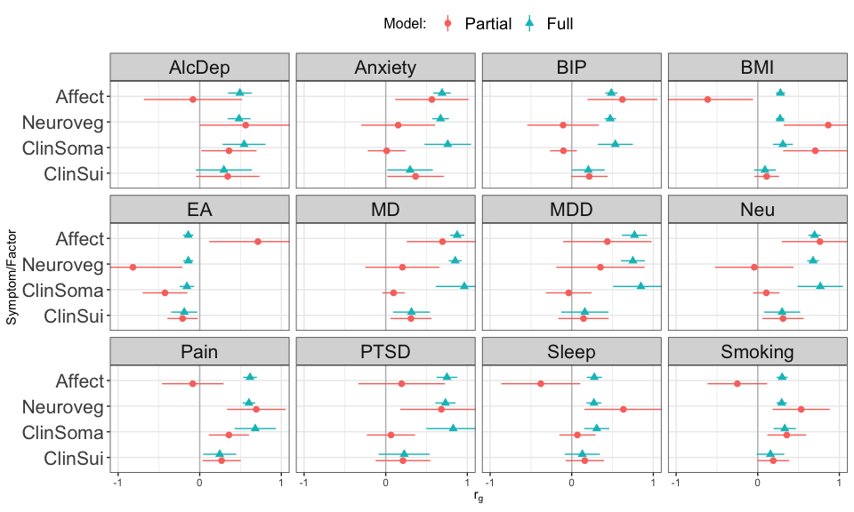

Test genetic relationship between [symptom factors](mdd-symptom-gsem-model.md) and other phenotypes that are genetically correlated with MDD. Phenotypes to examine:

- bipolar disorder: [Mullins et al](https://pubmed.ncbi.nlm.nih.gov/34002096/). Download from [PGC](https://figshare.com/articles/dataset/PGC3_bipolar_disorder_GWAS_summary_statistics/14102594)
- anxiety: [meta-analysis](https://drive.google.com/drive/folders/1fguHvz7l2G45sbMI9h_veQun4aXNTy1v) of [UKBB, iPSYCH](https://www.nature.com/articles/s41380-019-0559-1), and [ANGST](https://pubmed.ncbi.nlm.nih.gov/26754954/), from [Grotzinger et al medRxiv](https://www.medrxiv.org/content/10.1101/2020.09.22.20196089v1.full)
- PTSD: [Nievergelt et al](https://pubmed.ncbi.nlm.nih.gov/31594949/). Download from [PGC](https://figshare.com/articles/dataset/ptsd2019/14672133)
- tobacco use. Cigarettes per day [Liu et al](https://www.nature.com/articles/s41588-018-0307-5). Download from [UofM](https://conservancy.umn.edu/handle/11299/201564)
- alcohol dependence. [Walters et al](https://www.nature.com/articles/s41593-018-0275-1). Download from [PGC](https://doi.org/10.6084/m9.figshare.14672187)
- BMI, sex combined [Pulit et al](https://academic.oup.com/hmg/article/28/1/166/5098227). Download from [GIANT/Broad](https://portals.broadinstitute.org/collaboration/giant/index.php/Main_Page).php/GIANT_consortium_data_files#2018_GIANT_and_UK_BioBank_Meta-analysis)
- neuroticism: [Nagel et al](https://www.nature.com/articles/s41588-018-0151-7). Download from [CNCR](https://ctg.cncr.nl/software/summary_statistics)
- pain: multisite chronic pain [Johnston et al](https://journals.plos.org/plosgenetics/article?id=10.1371/journal.pgen.1008164). Download from [UoG](https://researchdata.gla.ac.uk/822/)
- chronotype: long sleep duration. [Dashti et al](https://www.ncbi.nlm.nih.gov/pubmed/30846698). Download from [SDKP](https://sleep.hugeamp.org/downloads.html).

# Setup

## R packages

R version


```r
R.version
```

```
##                _                           
## platform       x86_64-generic-linux-gnu    
## arch           x86_64                      
## os             linux-gnu                   
## system         x86_64, linux-gnu           
## status                                     
## major          4                           
## minor          1.3                         
## year           2022                        
## month          03                          
## day            10                          
## svn rev        81868                       
## language       R                           
## version.string R version 4.1.3 (2022-03-10)
## nickname       One Push-Up
```

Package installation


```r
required_packages <- c('devtools', 'readr', 'tidyr', 'dplyr', 'ggplot2', 'stringr', 'corrplot')
for(pack in required_packages) if(!require(pack, character.only=TRUE)) install.packages(pack)

library(devtools)

if(!require(GenomicSEM)) install_github("MichelNivard/GenomicSEM")

if(!require(tidySEM)) install_github("cjvanlissa/tidySEM")
```

GenomicSEM version

```r
require(readr)
require(tidyr)
require(stringr)
require(dplyr)
require(ggplot2)
require(corrplot)
require(GenomicSEM)

packageVersion("GenomicSEM")
```

```
## [1] '0.0.5'
```

# Process external sumstats

## Reformat

Format the external sumstats for reading by GenomicSEM with columns `SNP`, `A1` (effect allele), `A2` (non-effect allele), `BETA`/`OR`, `P`, `INFO`, and `N`.


```r
# Bipolar disorder
bip <- read_tsv('sumstats/pgc-bip2021-all.vcf.tsv.gz', comment='##')
bip_sumstats <- bip %>%
    filter(IMPINFO >= 0.6) %>%
    transmute(SNP=ID, A1, A2, BETA, SE, P=PVAL, INFO=IMPINFO, N=2*NEFFDIV2)
write_tsv(bip_sumstats, 'sumstats/BIP.txt')

# alcohol dependence
alcdep <- read_table('sumstats/pgc_alcdep.eur_discovery.aug2018_release.txt.gz')
alcdep_sumstats <- alcdep %>%
mutate(SNP=str_split_fixed(SNP, pattern=":", n=2)[,1]) %>%
select(SNP, A1, A2, BETA=Z, P, N=Weight)
write_tsv(alcdep_sumstats, 'sumstats/AlcDep.txt')

bmi <- read_table('sumstats/Bmi.giant-ukbb.meta-analysis.combined.23May2018.HapMap2_only.txt.gz')
bmi_sumstats <- bmi %>%
    separate(SNP, into=c('SNP', 'A1', 'A2'), sep=':') %>%
    filter(INFO >= 0.6) %>%
    select(SNP, A1=Tested_Allele, A2=Other_Allele, BETA, SE, P, INFO, N)
write_tsv(bmi_sumstats, 'sumstats/BMI.txt')

pain <- read_tsv('sumstats/chronic_pain-bgen.stats.gz')
pain_sumstats <- pain %>%
    filter(INFO >= 0.6) %>%
    transmute(SNP, A1=ALLELE1, A2=ALLELE0, BETA, SE, P=P_BOLT_LMM_INF, INFO, N=387649) 
write_tsv(pain_sumstats, 'sumstats/Pain.txt')

smoking <- read_table('sumstats/CigarettesPerDay.txt.gz')
smoking_sumstats <- smoking %>%
    select(SNP=RSID, A1=ALT, A2=REF, BETA, SE, P=PVALUE, N)
write_tsv(smoking_sumstats, 'sumstats/Smoking.txt')

sleep <- read_table('sumstats/longsumstats.txt')
sleep_sumstats <- sleep %>%
    filter(INFO >= 0.6) %>%
    transmute(SNP, A1=ALLELE1, A2=ALLELE0, BETA=BETA_LONGSLEEP, SE=SE_LONGSLEEP, P=P_LONGSLEEP, INFO, N=4*34184*(305742-34184)/305742)
write_tsv(sleep_sumstats, 'sumstats/Sleep.txt')

anxiety <- read_table('sumstats/META_UKBB_iPSYCH_ANGST_wNcol.sumstats.gz')
anxiety_sumstats <- anxiety %>%
    mutate(Nca=25453+12655+7016, Nco=58113+19225+14745) %>%
    transmute(SNP, A1=Allele1, A2=Allele2, BETA=Effect, SE=StdErr, P, N=4*Nca*Nco/(Nca+Nco))
write_tsv(anxiety_sumstats, 'sumstats/Anxiety.txt')    

ptsd <- read_tsv('sumstats/pts_eur_freeze2_overall.results.gz')
ptsd_sumstats <- ptsd %>%
    transmute(SNP,  A1, A2, OR, SE, P, INFO, N=4*Nca*Nco/(Nca+Nco))
write_tsv(ptsd_sumstats, 'sumstats/PTSD.txt')
     
neu <- read_tsv('sumstats/sumstats_neuroticism_ctg_format.txt.gz')
neu_sumstats <- neu %>%
    filter(!is.na(INFO_UKB)) %>%
    select(SNP=RSID, A1, A2, BETA=Z, P, INFO=INFO_UKB, N)
write_tsv(neu_sumstats, 'sumstats/Neu.txt')
```

## Munge


```r
ext_traits <- c('AlcDep'=0.159, 'Anxiety'=0.16, 'BIP'=0.01, 'BMI'=NA, 'PTSD'=0.3,
'Pain'=NA, 'Sleep'=0.11, 'Smoking'=NA)
ext_trait_names <- names(ext_traits)
```


```r
munge(file.path('sumstats', paste(ext_trait_names, 'txt', sep='.')),
trait.names=ext_trait_names,
hm3=here::here("sumstats/reference/w_hm3.snplist"),
info.filter = 0.9, maf.filter = 0.01)
```

# Symptom labels

MDD DSM symptoms are numbered 1-9:


```r
# plot labels

dsm_mdd_symptoms_labels <-
read_delim("
MDD1;Mood;Mood;Dep
MDD2;Interest;Interest;Anh
MDD3;Weight⇅;Weight⇆;App
MDD3a;Weight⇊;Weight⇇;AppDec
MDD3b;Weight⇈;Weight⇉;AppInc
MDD4;Sleep⇅;Sleep⇆;Sle
MDD4a;Sleep⇊;Sleep⇇;SleDec
MDD4b;Sleep⇈;Sleep⇉;SleInc
MDD5;Motor⇅;Motor⇆;Psyc
MDD5a;Motor⇈;Motor⇉;PsycInc
MDD5b;Motor⇊;Motor⇇;PsycDec
MDD6;Fatigue;Fatigue;Fatig
MDD7;Guilt;Guilt;Guilt
MDD8;Concentrate;Concentrate;Conc
MDD9;Suicidality;Suicidality;Sui
", col_names=c('ref', 'h', 'v', 'abbv'), delim=';')
```

```
## Rows: 15 Columns: 4
## ── Column specification ───────────────────────────────────────────────────────────────────────────────────────────────────────────────────
## Delimiter: ";"
## chr (4): ref, h, v, abbv
## 
## ℹ Use `spec()` to retrieve the full column specification for this data.
## ℹ Specify the column types or set `show_col_types = FALSE` to quiet this message.
```

```r
dsm_mdd_symptoms_reference <-
read_delim("
MDD1;Depressed mood most of the day, nearly every day
MDD2;Markedly diminished interest or pleasure in all, or almost all, activities most of the day, nearly every day
MDD3;Significant change in weight or appetite
MDD3a;Significant weight loss or decrease in appetite
MDD3b;Significant weight gain or increase in appetite
MDD4;Sleeping too much or not sleeping enough
MDD4a;Insomnia nearly every day
MDD4b;Hypersomnia nearly every day
MDD5;Changes in speed/amount of moving or speaking
MDD5a;Psychomotor agitation nearly every day
MDD5b;Psychomotor retardation nearly every day
MDD6;Fatigue or loss of energy nearly every day
MDD7;Feelings of worthlessness or excessive or inappropriate guilt
MDD8;Diminished ability to think or concentrate, or indecisiveness
MDD9;Recurrent thoughts of death or suicide or a suicide attempt or a specific plan for attempting suicide
", col_names=c('Reference', 'Description'), delim=';')
```

```
## Rows: 15 Columns: 2
## ── Column specification ───────────────────────────────────────────────────────────────────────────────────────────────────────────────────
## Delimiter: ";"
## chr (2): Reference, Description
## 
## ℹ Use `spec()` to retrieve the full column specification for this data.
## ℹ Specify the column types or set `show_col_types = FALSE` to quiet this message.
```


# Symptom prevalences

Load previously calculated symptom prevalences:


```r
symptoms_sample_prev <- read_tsv(here::here('meta/symptoms_prev.txt'))
```

```
## Rows: 24 Columns: 6
## ── Column specification ───────────────────────────────────────────────────────────────────────────────────────────────────────────────────
## Delimiter: "\t"
## chr (3): cohorts, symptom, sumstats
## dbl (3): Nca, Nco, samp_prev
## 
## ℹ Use `spec()` to retrieve the full column specification for this data.
## ℹ Specify the column types or set `show_col_types = FALSE` to quiet this message.
```

```r
pop_prevs_w <-
symptoms_sample_prev %>%
mutate(w=case_when(cohorts == 'AGDS_PGC' ~ 0.15,
                   symptom %in% c('MDD1', 'MDD2') ~ 1.0,
                   TRUE ~ 0.57)) %>%
mutate(pop_prev=samp_prev*w) %>%
select(symptom, cohorts, pop_prev) %>%
pivot_wider(names_from=cohorts, values_from=pop_prev) %>%
group_by(symptom) %>%
mutate(pop_prev=mean(c(AGDS_PGC, ALSPAC_UKB))) %>%
select(symptom, pop_prev)
```


# Multivariable LDSC estimation

Calculate LDSC covariance structure for syptoms used in the combined structural model and the external phenotypes.


```r
covstruct_prefix <- 'symptoms.external.covstruct'
covstruct_r <- here::here('ldsc', paste(covstruct_prefix, 'deparse.R', sep='.'))
covstruct_rds <- here::here('ldsc', paste(covstruct_prefix, 'rds', sep='.'))

if(!file.exists(covstruct_r)) {

  # list sumstats distribution directories
  sumstats_files <- list.files(here::here('meta', 'munged'), '.gz', full.names=TRUE)

  # pull out which cohorts and symptom 'x' this is from the filename (COHORTS_MDDx_*)
  cohorts_symptoms <- str_match(basename(sumstats_files), '([A-Z_]+).(MDD[:digit:](a|b)?)')[,1]

  sumstats_paths <- data.frame(filename=sumstats_files, sumstats=str_remove(basename(sumstats_files), '.sumstats.gz'))

  # symptom files, prevalences, and trait names
  symptoms_sumstats_prevs <- 
    symptoms_sample_prev %>%
    left_join(sumstats_paths, by='sumstats') %>%
    left_join(pop_prevs_w, by='symptom') %>%
    left_join(dsm_mdd_symptoms_labels, by=c('symptom'='ref')) %>%
    mutate(Sample=if_else(cohorts=="AGDS_PGC", true='Clin', false='Pop')) %>%
    mutate(trait_name=paste0(Sample, abbv)) %>%
    filter(trait_name %in% c('ClinAppInc', 'ClinSleDec', 'ClinSleInc',
                             'ClinPsycInc', 'ClinSui',
                             'PopDep', 'PopGuilt', 'PopSui',
                             'PopAnh', 'PopAppInc', 'PopAppDec',
                             'PopSleInc', 'PopSleDec', 'PopFatig',
                             'PopConc'))
    
  # external files, prevalences and trait names
  external_sumstats_prevs <-
    tibble(filename=paste(ext_trait_names, 'sumstats', 'gz', sep='.'),
           trait_name=ext_trait_names,
           pop_prev=ext_traits) %>%
    mutate(if_else(!is.na(pop_prev), true=0.5, false=NA_real_))
    
  sumstats_prevs <- bind_rows(symptoms_sumstats_prevs, external_sumstats_prevs)
    

  symptoms_covstruct <- ldsc(traits=sumstats_prevs$filename,
                             sample.prev=sumstats_prevs$samp_prev,
                             population.prev=sumstats_prevs$pop_prev,
                             ld=here::here('sumstats/reference/eur_w_ld_chr/'),
                             wld=here::here('sumstats/reference/eur_w_ld_chr/'),
                             trait.names=sumstats_prevs$trait_name)

  dput(symptoms_covstruct, covstruct_r, control=c('all', 'digits17'))
  saveRDS(symptoms_covstruct, covstruct_rds)
  
  # check for exact match of deparsed object
  identical(dget(covstruct_r), symptoms_covstruct)

} else {

  symptoms_covstruct <- dget(covstruct_r)

}
```

# Models

## Clinical and population factors

Base model of symptom factors


```r
clin_pop.model <- "
Soma =~ NA*ClinAppInc + ClinSleDec + ClinSleInc + ClinPsycInc
Soma ~~ 1*Soma
Affect =~ NA*PopDep + PopGuilt + PopSui
Neuroveg =~ NA*PopAnh + PopAppInc + PopAppDec + PopSleInc + PopSleDec + PopFatig + PopConc
Affect ~~ 1*Affect
Neuroveg ~~ 1*Neuroveg
PopDep ~~ PopAnh
ClinSui ~~ Soma + Affect + Neuroveg
"
clin_pop.fit <- usermodel(symptoms_covstruct, estimation='DWLS', model=clin_pop.model)
```

```
## [1] "Running primary model"
## [1] "Calculating CFI"
## [1] "Calculating Standardized Results"
## [1] "Calculating SRMR"
## elapsed 
##   3.715 
## [1] "The S matrix was smoothed prior to model estimation due to a non-positive definite matrix. The largest absolute difference in a cell between the smoothed and non-smoothed matrix was  0.0289190810466153 As a result of the smoothing, the largest Z-statistic change for the genetic covariances was  1.11962312826334 . We recommend setting the smooth_check argument to true if you are going to run a multivariate GWAS."
```

```
## Warning in usermodel(symptoms_covstruct, estimation = "DWLS", model =
## clin_pop.model): A difference greater than .025 was observed pre- and post-
## smoothing in the genetic covariance matrix. This reflects a large difference
## and results should be interpreted with caution!! This can often result from
## including low powered traits, and you might consider removing those traits from
## the model. If you are going to run a multivariate GWAS we strongly recommend
## setting the smooth_check argument to true to check smoothing for each SNP.
```

```
## Warning in usermodel(symptoms_covstruct, estimation = "DWLS", model =
## clin_pop.model): A difference greater than .025 was observed pre- and post-
## smoothing for Z-statistics in the genetic covariance matrix. This reflects a
## large difference and results should be interpreted with caution!! This can often
## result from including low powered traits, and you might consider removing those
## traits from the model. If you are going to run a multivariate GWAS we strongly
## recommend setting the smooth_check argument to true to check smoothing for each
## SNP.
```

```r
clin_pop.fit$modelfit
```

<div class="kable-table">

|   |    chisq| df| p_chisq|      AIC|       CFI|      SRMR|
|:--|--------:|--:|-------:|--------:|---------:|---------:|
|df | 166.5296| 84|   2e-07| 238.5296| 0.9895636| 0.1492129|

</div>

```r
clin_pop.fit$results[c(1,2,3,6,7,9)]
```

<div class="kable-table">

|   |lhs         |op |rhs         | STD_Genotype|STD_Genotype_SE    |   p_value|
|:--|:-----------|:--|:-----------|------------:|:------------------|---------:|
|32 |Soma        |=~ |ClinAppInc  |    0.6331167|0.249315964519487  | 0.0111036|
|34 |Soma        |=~ |ClinSleDec  |    0.3999701|0.28514891712612   | 0.1607154|
|35 |Soma        |=~ |ClinSleInc  |    0.5250231|0.32379614112126   | 0.1049170|
|33 |Soma        |=~ |ClinPsycInc |    0.5512468|0.251746458408462  | 0.0285469|
|1  |Affect      |=~ |PopDep      |    0.7422368|0.0711883555737093 | 0.0000000|
|2  |Affect      |=~ |PopGuilt    |    0.7564180|0.0966276584783182 | 0.0000000|
|3  |Affect      |=~ |PopSui      |    0.6751448|0.108369010956025  | 0.0000000|
|12 |Neuroveg    |=~ |PopAnh      |    0.8126224|0.0662731036391502 | 0.0000000|
|14 |Neuroveg    |=~ |PopAppInc   |    0.4284819|0.0822715940548333 | 0.0000002|
|13 |Neuroveg    |=~ |PopAppDec   |    0.2005954|0.0874704946013171 | 0.0218309|
|18 |Neuroveg    |=~ |PopSleInc   |    0.4973924|0.103163472766322  | 0.0000014|
|17 |Neuroveg    |=~ |PopSleDec   |    0.6304220|0.0996274695455007 | 0.0000000|
|16 |Neuroveg    |=~ |PopFatig    |    0.7402491|0.0930793821924976 | 0.0000000|
|15 |Neuroveg    |=~ |PopConc     |    0.7922114|0.0918017359133495 | 0.0000000|
|25 |PopDep      |~~ |PopAnh      |    0.4044683|0.0925563300545413 | 0.0000124|
|37 |Soma        |~~ |ClinSui     |    0.1227571|0.255142309699146  | 0.6304177|
|5  |Affect      |~~ |ClinSui     |    0.7333826|0.13531498614748   | 0.0000001|
|19 |Neuroveg    |~~ |ClinSui     |    0.6574773|0.132218363326854  | 0.0000007|
|7  |ClinAppInc  |~~ |ClinAppInc  |    0.5991668|0.444388081649053  | 0.1775707|
|9  |ClinSleDec  |~~ |ClinSleDec  |    0.8400303|0.628750873516943  | 0.1815426|
|10 |ClinSleInc  |~~ |ClinSleInc  |    0.7243430|0.88258860152466   | 0.4118152|
|8  |ClinPsycInc |~~ |ClinPsycInc |    0.6961301|0.544701812792492  | 0.2012488|
|26 |PopDep      |~~ |PopDep      |    0.4490840|0.124940164766279  | 0.0003252|
|28 |PopGuilt    |~~ |PopGuilt    |    0.4278329|0.180789594345253  | 0.0179597|
|31 |PopSui      |~~ |PopSui      |    0.5441828|0.241437218582954  | 0.0242019|
|21 |PopAnh      |~~ |PopAnh      |    0.3396447|0.111071711534987  | 0.0022290|
|23 |PopAppInc   |~~ |PopAppInc   |    0.8164036|0.154946833406535  | 0.0000001|
|22 |PopAppDec   |~~ |PopAppDec   |    0.9597593|0.231342547177412  | 0.0000334|
|30 |PopSleInc   |~~ |PopSleInc   |    0.7526031|0.252689112396908  | 0.0028979|
|29 |PopSleDec   |~~ |PopSleDec   |    0.6025688|0.295152478043401  | 0.0411962|
|27 |PopFatig    |~~ |PopFatig    |    0.4520298|0.275301216035336  | 0.1006004|
|24 |PopConc     |~~ |PopConc     |    0.3723983|0.251346509715028  | 0.1384421|
|11 |ClinSui     |~~ |ClinSui     |    1.0000004|0.328014352733054  | 0.0022988|
|36 |Soma        |~~ |Affect      |    0.0878338|0.138186258889343  | 0.5250331|
|38 |Soma        |~~ |Neuroveg    |    0.4679749|0.180711881873901  | 0.0096082|
|6  |Affect      |~~ |Neuroveg    |    0.8283105|0.0664911442650997 | 0.0000000|
|39 |Soma        |~~ |Soma        |    1.0000000|                   |        NA|
|4  |Affect      |~~ |Affect      |    1.0000000|                   |        NA|
|20 |Neuroveg    |~~ |Neuroveg    |    1.0000000|                   |        NA|

</div>

## External phenotypes

Compare symptom factors against each external phenotype. Correlation of each phenotype with the symptom factors.


```r
clin_pop_ext.model <- "
Soma =~ NA*ClinAppInc + ClinSleDec + ClinSleInc + ClinPsycInc
Soma ~~ 1*Soma
Affect =~ NA*PopDep + PopGuilt + PopSui
Neuroveg =~ NA*PopAnh + PopAppInc + PopAppDec + PopSleInc + PopSleDec + PopFatig + PopConc
Affect ~~ 1*Affect
Neuroveg ~~ 1*Neuroveg
PopDep ~~ PopAnh
ClinSui ~~ Soma + Affect + Neuroveg
AlcDep ~~ Soma + ClinSui + Affect + Neuroveg
Anxiety ~~ Soma + ClinSui + Affect + Neuroveg
BIP ~~ Soma + ClinSui + Affect + Neuroveg
BMI ~~ Soma + ClinSui + Affect + Neuroveg
PTSD ~~ Soma + ClinSui + Affect + Neuroveg
Pain ~~ Soma + ClinSui + Affect + Neuroveg
Sleep ~~ Soma + ClinSui + Affect + Neuroveg
Smoking ~~ Soma + ClinSui + Affect + Neuroveg
"
clin_pop_ext.fit <- usermodel(symptoms_covstruct, estimation='DWLS', model=clin_pop_ext.model)
```

```
## [1] "Running primary model"
## [1] "Calculating CFI"
## [1] "Calculating Standardized Results"
## [1] "Calculating SRMR"
## elapsed 
##  15.469 
## [1] "The S matrix was smoothed prior to model estimation due to a non-positive definite matrix. The largest absolute difference in a cell between the smoothed and non-smoothed matrix was  0.0336919131811917 As a result of the smoothing, the largest Z-statistic change for the genetic covariances was  1.84530127815109 . We recommend setting the smooth_check argument to true if you are going to run a multivariate GWAS."
```

```
## Warning in usermodel(symptoms_covstruct, estimation = "DWLS", model =
## clin_pop_ext.model): A difference greater than .025 was observed pre- and post-
## smoothing in the genetic covariance matrix. This reflects a large difference
## and results should be interpreted with caution!! This can often result from
## including low powered traits, and you might consider removing those traits from
## the model. If you are going to run a multivariate GWAS we strongly recommend
## setting the smooth_check argument to true to check smoothing for each SNP.
```

```
## Warning in usermodel(symptoms_covstruct, estimation = "DWLS", model =
## clin_pop_ext.model): A difference greater than .025 was observed pre- and post-
## smoothing for Z-statistics in the genetic covariance matrix. This reflects a
## large difference and results should be interpreted with caution!! This can often
## result from including low powered traits, and you might consider removing those
## traits from the model. If you are going to run a multivariate GWAS we strongly
## recommend setting the smooth_check argument to true to check smoothing for each
## SNP.
```

```
## [1] "The V matrix was smoothed prior to model estimation due to a non-positive definite matrix. The largest absolute difference in a cell between the smoothed and non-smoothed matrix was  1.34184139934633e-11 As a result of the smoothing, the largest Z-statistic change for the genetic covariances was  1.84530127815109 . We recommend setting the smooth_check argument to true if you are going to run a multivariate GWAS."
```

```r
clin_pop_ext.fit$modelfit
```

<div class="kable-table">

|   |     chisq|  df| p_chisq|       AIC|       CFI|      SRMR|
|:--|---------:|---:|-------:|---------:|---------:|---------:|
|df | 581248698| 200|       0| 581248850| 0.5395984| 0.1737964|

</div>

```r
clin_pop_ext.fit$results %>%
select(lhs, op, rhs, STD_Genotype, STD_Genotype_SE, p_value) %>%
filter(rhs %in% ext_trait_names, lhs %in% c('Soma', 'ClinSui', 'Affect', 'Neuroveg'))
```

<div class="kable-table">

|lhs      |op |rhs     | STD_Genotype|STD_Genotype_SE    |   p_value|
|:--------|:--|:-------|------------:|:------------------|---------:|
|Soma     |~~ |AlcDep  |    0.2780752|0.143514750830567  | 0.0526667|
|ClinSui  |~~ |AlcDep  |    0.2959872|0.160005269787055  | 0.0643325|
|Affect   |~~ |AlcDep  |    0.3939265|0.0877868463997958 | 0.0000072|
|Neuroveg |~~ |AlcDep  |    0.5073037|0.0789705021510745 | 0.0000000|
|Soma     |~~ |Anxiety |   -0.0326535|0.104680409081424  | 0.7550651|
|ClinSui  |~~ |Anxiety |    0.3524858|0.104441116722825  | 0.0007382|
|Affect   |~~ |Anxiety |    0.6885040|0.0647737109461219 | 0.0000000|
|Neuroveg |~~ |Anxiety |    0.6212882|0.0588772299964682 | 0.0000000|
|Soma     |~~ |BIP     |   -0.1173502|0.0738812818654783 | 0.1121947|
|ClinSui  |~~ |BIP     |    0.2109282|0.0794844053408987 | 0.0079617|
|Affect   |~~ |BIP     |    0.5278194|0.0459340223420515 | 0.0000000|
|Neuroveg |~~ |BIP     |    0.4069568|0.0418173585227186 | 0.0000000|
|Soma     |~~ |BMI     |    0.6592451|0.178376461580182  | 0.0002190|
|ClinSui  |~~ |BMI     |    0.0846267|0.061595764404679  | 0.1694696|
|Affect   |~~ |BMI     |    0.1101282|0.0310084699443982 | 0.0003829|
|Neuroveg |~~ |BMI     |    0.4221668|0.0328202004187987 | 0.0000000|
|Soma     |~~ |PTSD    |    0.0393150|0.125686665122271  | 0.7544095|
|ClinSui  |~~ |PTSD    |    0.2218192|0.142981375574092  | 0.1208030|
|Affect   |~~ |PTSD    |    0.6623001|0.0753816046131675 | 0.0000000|
|Neuroveg |~~ |PTSD    |    0.7420623|0.0689061431275109 | 0.0000000|
|Soma     |~~ |Pain    |    0.3058112|0.105557161523999  | 0.0037647|
|ClinSui  |~~ |Pain    |    0.2476201|0.0771901249342637 | 0.0013369|
|Affect   |~~ |Pain    |    0.4880444|0.0487725084025144 | 0.0000000|
|Neuroveg |~~ |Pain    |    0.6594585|0.0464750660599162 | 0.0000000|
|Soma     |~~ |Sleep   |    0.0527131|0.0977311537591925 | 0.5896186|
|ClinSui  |~~ |Sleep   |    0.1359738|0.109276962298019  | 0.2133864|
|Affect   |~~ |Sleep   |    0.1458957|0.0512829307021244 | 0.0044424|
|Neuroveg |~~ |Sleep   |    0.3338159|0.0553809600459304 | 0.0000000|
|Soma     |~~ |Smoking |    0.3070760|0.102084266942511  | 0.0026281|
|ClinSui  |~~ |Smoking |    0.1537106|0.0832170049725576 | 0.0647329|
|Affect   |~~ |Smoking |    0.2011443|0.0405571729173207 | 0.0000007|
|Neuroveg |~~ |Smoking |    0.3515944|0.0368702864130281 | 0.0000000|

</div>

Regression of each phenotype on the symptom factors, to estimate relationship after condition on each of the other factors. 


```r
clin_pop_ext_mult.model <- "
Soma =~ NA*ClinAppInc + ClinSleDec + ClinSleInc + ClinPsycInc
Soma ~~ 1*Soma
Affect =~ NA*PopDep + PopGuilt + PopSui
Neuroveg =~ NA*PopAnh + PopAppInc + PopAppDec + PopSleInc + PopSleDec + PopFatig + PopConc
Affect ~~ 1*Affect
Neuroveg ~~ 1*Neuroveg
PopDep ~~ PopAnh
ClinSui ~~ Soma + Affect + Neuroveg
AlcDep ~ Soma + ClinSui + Affect + Neuroveg
Anxiety ~ Soma + ClinSui + Affect + Neuroveg
BIP ~ Soma + ClinSui + Affect + Neuroveg
BMI ~ Soma + ClinSui + Affect + Neuroveg
PTSD ~ Soma + ClinSui + Affect + Neuroveg
Pain ~ Soma + ClinSui + Affect + Neuroveg
Sleep ~ Soma + ClinSui + Affect + Neuroveg
Smoking ~ Soma + ClinSui + Affect + Neuroveg
"
clin_pop_ext_mult.fit <- usermodel(symptoms_covstruct, estimation='DWLS', model=clin_pop_ext_mult.model)
```

```
## [1] "Running primary model"
## [1] "Calculating CFI"
## [1] "Calculating Standardized Results"
## [1] "Calculating SRMR"
## elapsed 
##  29.777 
## [1] "The S matrix was smoothed prior to model estimation due to a non-positive definite matrix. The largest absolute difference in a cell between the smoothed and non-smoothed matrix was  0.0336919131811917 As a result of the smoothing, the largest Z-statistic change for the genetic covariances was  1.84530127815109 . We recommend setting the smooth_check argument to true if you are going to run a multivariate GWAS."
```

```
## Warning in usermodel(symptoms_covstruct, estimation = "DWLS", model =
## clin_pop_ext_mult.model): A difference greater than .025 was observed pre-
## and post-smoothing in the genetic covariance matrix. This reflects a large
## difference and results should be interpreted with caution!! This can often
## result from including low powered traits, and you might consider removing those
## traits from the model. If you are going to run a multivariate GWAS we strongly
## recommend setting the smooth_check argument to true to check smoothing for each
## SNP.
```

```
## Warning in usermodel(symptoms_covstruct, estimation = "DWLS", model =
## clin_pop_ext_mult.model): A difference greater than .025 was observed pre- and
## post-smoothing for Z-statistics in the genetic covariance matrix. This reflects
## a large difference and results should be interpreted with caution!! This can
## often result from including low powered traits, and you might consider removing
## those traits from the model. If you are going to run a multivariate GWAS we
## strongly recommend setting the smooth_check argument to true to check smoothing
## for each SNP.
```

```
## [1] "The V matrix was smoothed prior to model estimation due to a non-positive definite matrix. The largest absolute difference in a cell between the smoothed and non-smoothed matrix was  1.34184139934633e-11 As a result of the smoothing, the largest Z-statistic change for the genetic covariances was  1.84530127815109 . We recommend setting the smooth_check argument to true if you are going to run a multivariate GWAS."
```

```r
clin_pop_ext_mult.fit$modelfit
```

<div class="kable-table">

|   |     chisq|  df| p_chisq|       AIC|       CFI|      SRMR|
|:--|---------:|---:|-------:|---------:|---------:|---------:|
|df | 288962491| 172|       0| 288962699| 0.7711156| 0.1394206|

</div>

```r
clin_pop_ext_mult.fit$results %>%
select(lhs, op, rhs, STD_Genotype, STD_Genotype_SE, p_value) %>%
filter(lhs %in% ext_trait_names, rhs %in% c('Soma', 'ClinSui', 'Affect', 'Neuroveg'))
```

<div class="kable-table">

|lhs     |op |rhs      | STD_Genotype|STD_Genotype_SE   |   p_value|
|:-------|:--|:--------|------------:|:-----------------|---------:|
|AlcDep  |~  |Soma     |    0.1272462|0.230273215280035 | 0.5805460|
|AlcDep  |~  |ClinSui  |   -0.0341650|0.373489759689543 | 0.9271216|
|AlcDep  |~  |Affect   |    0.0860318|0.438343917563618 | 0.8443975|
|AlcDep  |~  |Neuroveg |    0.4142522|0.368035016462278 | 0.2603643|
|Anxiety |~  |Soma     |   -0.1786844|0.219715218588425 | 0.4160655|
|Anxiety |~  |ClinSui  |   -0.2832497|0.344284181079098 | 0.4106682|
|Anxiety |~  |Affect   |    0.5611628|0.380489496279383 | 0.1402571|
|Anxiety |~  |Neuroveg |    0.4196138|0.388910440025492 | 0.2806029|
|BIP     |~  |Soma     |   -0.1796155|0.199214929809461 | 0.3672507|
|BIP     |~  |ClinSui  |   -0.3088487|0.355599874297263 | 0.3851015|
|BIP     |~  |Affect   |    0.5973676|0.354137407123818 | 0.0916353|
|BIP     |~  |Neuroveg |    0.1929690|0.358509785624791 | 0.5903786|
|BMI     |~  |Soma     |    0.5105944|0.258008599293463 | 0.0478282|
|BMI     |~  |ClinSui  |   -0.1189198|0.277624181402695 | 0.6683897|
|BMI     |~  |Affect   |   -0.1864597|0.339286230875837 | 0.5826655|
|BMI     |~  |Neuroveg |    0.4573600|0.377146766738317 | 0.2253084|
|PTSD    |~  |Soma     |   -0.2526021|0.338885151828546 | 0.4560218|
|PTSD    |~  |ClinSui  |   -0.5611903|0.576551197921983 | 0.3303689|
|PTSD    |~  |Affect   |    0.3406645|0.537013006190922 | 0.5258863|
|PTSD    |~  |Neuroveg |    0.9145444|0.565203280180129 | 0.1056428|
|Pain    |~  |Soma     |    0.0649969|0.184565064051876 | 0.7247282|
|Pain    |~  |ClinSui  |   -0.2913035|0.339661993193538 | 0.3910900|
|Pain    |~  |Affect   |    0.1158625|0.310500701372164 | 0.7090621|
|Pain    |~  |Neuroveg |    0.7256564|0.31508466558227  | 0.0212768|
|Sleep   |~  |Soma     |   -0.2114788|0.242756446092891 | 0.3836750|
|Sleep   |~  |ClinSui  |   -0.0121407|0.296063729522205 | 0.9672805|
|Sleep   |~  |Affect   |   -0.4478453|0.427004064091696 | 0.2942627|
|Sleep   |~  |Neuroveg |    0.7721514|0.41287127098915  | 0.0614646|
|Smoking |~  |Soma     |    0.1832439|0.141941842450455 | 0.1967184|
|Smoking |~  |ClinSui  |   -0.0491367|0.208840760631604 | 0.8139947|
|Smoking |~  |Affect   |   -0.0538115|0.232245092736351 | 0.8167805|
|Smoking |~  |Neuroveg |    0.3578965|0.210070952220897 | 0.0884599|

</div>


```r
clin_pop_ext_full <-
clin_pop_ext.fit$results %>%
select(lhs, op, rhs, STD_Genotype, STD_Genotype_SE, p_value) %>%
filter(rhs %in% ext_trait_names, lhs %in% c('Soma', 'ClinSui', 'Affect', 'Neuroveg')) %>%
mutate(Beta='Full', Factor=lhs, Phenotype=rhs)

clin_pop_ext_partial <-
clin_pop_ext_mult.fit$results %>%
select(lhs, op, rhs, STD_Genotype, STD_Genotype_SE, p_value) %>%
filter(lhs %in% ext_trait_names, rhs %in% c('Soma', 'ClinSui', 'Affect', 'Neuroveg')) %>%
mutate(Beta='Partial', Factor=rhs, Phenotype=lhs)

ggplot(bind_rows(clin_pop_ext_full, clin_pop_ext_partial),
       aes(x=Factor, y=STD_Genotype, color=Beta,
          ymin=qnorm(0.025, mean=STD_Genotype, sd=as.numeric(STD_Genotype_SE)),
          ymax=qnorm(0.975, mean=STD_Genotype, sd=as.numeric(STD_Genotype_SE)))) +
geom_hline(yintercept=0, col='gray') +
geom_pointrange(position=position_dodge(width=0.5)) +
facet_grid(~Phenotype) +
scale_y_continuous('rg', breaks=c(-1, 0, 1)) +
coord_flip(ylim=c(-1, 1)) +
theme_bw() +
theme(axis.text.y=element_text(size=16),
      strip.text=element_text(size=16))
```

<!-- -->

