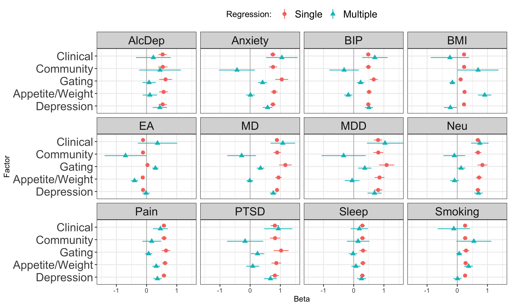

Test genetic relationship between [symptom
factors](mdd-symptom-gsem-model.md) and a selection of other phenotypes
that are genetically correlated with MDD, as well as to MDD itself.
Phenotypes to examine:

-   Major depressive disorder: Clinical cohorts from [Wray et
    al](https://www.nature.com/articles/s41588-018-0090-3%5C) and all
    cohorts from [Howard et
    al](https://www.nature.com/articles/s41593-018-%200326-7). Download
    from [PGC](https://www.med.unc.edu/pgc/download-results/) and obtain
    via [data
    access](https://www.med.unc.edu/pgc/shared-methods/how-to/).
-   bipolar disorder: [Mullins et
    al](https://pubmed.ncbi.nlm.nih.gov/34002096/). Download from
    [PGC](https://figshare.com/articles/dataset/PGC3_bipolar_disorder_GWAS_summary_statistics/14102594)
-   anxiety:
    [meta-analysis](https://drive.google.com/drive/folders/1fguHvz7l2G45sbMI9h_veQun4aXNTy1v)
    of [UKBB,
    iPSYCH](https://www.nature.com/articles/s41380-019-0559-1), and
    [ANGST](https://pubmed.ncbi.nlm.nih.gov/26754954/), from [Grotzinger
    et al
    medRxiv](https://www.medrxiv.org/content/10.1101/2020.09.22.20196089v1.full)
-   PTSD: [Nievergelt et al](https://pubmed.ncbi.nlm.nih.gov/31594949/).
    Download from
    [PGC](https://figshare.com/articles/dataset/ptsd2019/14672133)
-   tobacco use. Cigarettes per day [Liu et
    al](https://www.nature.com/articles/s41588-018-0307-5). Download
    from [UofM](https://conservancy.umn.edu/handle/11299/201564)
-   alcohol dependence. [Walters et
    al](https://www.nature.com/articles/s41593-018-0275-1). Download
    from [PGC](https://doi.org/10.6084/m9.figshare.14672187)
-   educational attainment. [Okbay et.
    al](https://www.nature.com/articles/s41588-022-01016-z). Download
    from [SSGAC Data Portal](https://thessgac.com).
-   BMI, sex combined [Pulit et
    al](https://academic.oup.com/hmg/article/28/1/166/5098227). Download
    from
    [GIANT/Broad](https://portals.broadinstitute.org/collaboration/giant/index.php/GIANT_consortium_data_files#2018_GIANT_and_UK_BioBank_Meta-analysis).
-   neuroticism: [Nagel et
    al](https://www.nature.com/articles/s41588-018-0151-7). Download
    from [CNCR](https://ctg.cncr.nl/software/summary_statistics)
-   pain: multisite chronic pain [Johnston et
    al](https://journals.plos.org/plosgenetics/article?id=10.1371/journal.pgen.1008164).
    Download from [UoG](https://researchdata.gla.ac.uk/822/)
-   chronotype: long sleep duration. [Dashti et
    al](https://www.ncbi.nlm.nih.gov/pubmed/30846698). Download from
    [SDKP](https://sleep.hugeamp.org/downloads.html).

# Setup

## R packages

R version

``` r
R.version
```

    ##                _                           
    ## platform       aarch64-apple-darwin20      
    ## arch           aarch64                     
    ## os             darwin20                    
    ## system         aarch64, darwin20           
    ## status                                     
    ## major          4                           
    ## minor          2.2                         
    ## year           2022                        
    ## month          10                          
    ## day            31                          
    ## svn rev        83211                       
    ## language       R                           
    ## version.string R version 4.2.2 (2022-10-31)
    ## nickname       Innocent and Trusting

Package installation

``` r
required_packages <- c('devtools', 'readr', 'tidyr', 'dplyr', 'ggplot2', 'stringr', 'corrplot')
for(pack in required_packages) if(!require(pack, character.only=TRUE)) install.packages(pack)

library(devtools)

if(!require(GenomicSEM)) install_github("MichelNivard/GenomicSEM")

if(!require(tidySEM)) install_github("cjvanlissa/tidySEM")
```

GenomicSEM version

``` r
require(readr)
require(tidyr)
require(stringr)
require(dplyr)
require(ggplot2)
require(corrplot)
require(GenomicSEM)

packageVersion("GenomicSEM")
```

    ## [1] '0.0.5'

# Process external sumstats

## Reformat

Format the external sumstats for reading by GenomicSEM with columns
`SNP`, `A1` (effect allele), `A2` (non-effect allele), `BETA`/`OR`, `P`,
`INFO`, and `N`.

``` r
# Major depressive disorder
mdd <- read_table('sumstats/PGC_UKB_23andMe_depression_genome-wide_info_N.txt.gz')
mdd_sumstats <- mdd %>%
    mutate(Nca=UKB_Ncases+PGC_Ncases+X23andMe_Ncases,
           Nco=UKB_Ncontrols+PGC_Ncontrols+X23andMe_Ncontrols) %>%
    transmute(SNP=MarkerName, A1=toupper(Allele1), A2=toupper(Allele2),
              BETA=Effect, SE=StdErr, P=P.value, 
              FREQ=Freq1, N=4*Nca*Nco/(Nca+Nco))
write_tsv(mdd_sumstats, 'sumstats/MD.txt')

mdd_clin <- read_tsv('sumstats/daner_MDD29.0515a_mds6.0316.gz')
mdd_clin_sumstats <- mdd_clin %>%
    transmute(SNP, A1, A2, BETA=log(OR), SE, FREQ=FRQ_U_25632, INFO, P,
              N=4*Nca*Nco/(Nca+Nco))
write_tsv(mdd_clin_sumstats, 'sumstats/MDD.txt')

# Bipolar disorder
bip <- read_tsv('sumstats/pgc-bip2021-all.vcf.tsv.gz', comment='##')
bip_sumstats <- bip %>%
    filter(IMPINFO >= 0.6) %>%
    transmute(SNP=ID, A1, A2, BETA, SE, P=PVAL, INFO=IMPINFO, N=2*NEFFDIV2)
write_tsv(bip_sumstats, 'sumstats/BIP.txt')

# alcohol dependence
alcdep <- read_table('sumstats/pgc_alcdep.eur_discovery.aug2018_release.txt.gz')
alcdep_sumstats <- alcdep %>%
mutate(SNP=str_split_fixed(SNP, pattern=":", n=2)[,1]) %>%
select(SNP, A1, A2, BETA=Z, P, N=Weight)
write_tsv(alcdep_sumstats, 'sumstats/AlcDep.txt')

# body-mass index
bmi <- read_table('sumstats/Bmi.giant-ukbb.meta-analysis.combined.23May2018.HapMap2_only.txt.gz')
bmi_sumstats <- bmi %>%
    separate(SNP, into=c('SNP', 'A1', 'A2'), sep=':') %>%
    filter(INFO >= 0.6) %>%
    select(SNP, A1=Tested_Allele, A2=Other_Allele, BETA, SE, P, INFO, N)
write_tsv(bmi_sumstats, 'sumstats/BMI.txt')

# educational attainment
ea <- read_tsv('sumstats/EA4_additive_excl_23andMe.txt.gz')
ea_sumstats <-  ea %>%
    transmute(SNP=rsID, A1=Effect_allele, A2=Other_allele, FREQ=EAF_HRC, BETA=Beta, SE_unadj, P=P_unadj, N=765283)
write_tsv(ea_sumstats, 'sumstats/EA.txt')

# multisite chronic pain
pain <- read_tsv('sumstats/chronic_pain-bgen.stats.gz')
pain_sumstats <- pain %>%
    filter(INFO >= 0.6) %>%
    transmute(SNP, A1=ALLELE1, A2=ALLELE0, BETA, SE, P=P_BOLT_LMM_INF, INFO, N=387649) 
write_tsv(pain_sumstats, 'sumstats/Pain.txt')

# tabacco use
smoking <- read_table('sumstats/CigarettesPerDay.txt.gz')
smoking_sumstats <- smoking %>%
    select(SNP=RSID, A1=ALT, A2=REF, BETA, SE, P=PVALUE, N)
write_tsv(smoking_sumstats, 'sumstats/Smoking.txt')

# chronotype (long sleep duration)
sleep <- read_table('sumstats/longsumstats.txt.gz')
sleep_sumstats <- sleep %>%
    filter(INFO >= 0.6) %>%
    transmute(SNP, A1=ALLELE1, A2=ALLELE0, BETA=BETA_LONGSLEEP, SE=SE_LONGSLEEP, P=P_LONGSLEEP, INFO, N=4*34184*(305742-34184)/305742)
write_tsv(sleep_sumstats, 'sumstats/Sleep.txt')

# anxiety disorder
anxiety <- read_table('sumstats/META_UKBB_iPSYCH_ANGST_wNcol.sumstats.gz')
anxiety_sumstats <- anxiety %>%
    mutate(Nca=25453+12655+7016, Nco=58113+19225+14745) %>%
    transmute(SNP, A1=Allele1, A2=Allele2, BETA=Effect, SE=StdErr, P, N=4*Nca*Nco/(Nca+Nco))
write_tsv(anxiety_sumstats, 'sumstats/Anxiety.txt')    

# post-traumatic stress disorder
ptsd <- read_tsv('sumstats/pts_eur_freeze2_overall.results.gz')
ptsd_sumstats <- ptsd %>%
    transmute(SNP,  A1, A2, OR, SE, P, INFO, N=4*Nca*Nco/(Nca+Nco))
write_tsv(ptsd_sumstats, 'sumstats/PTSD.txt')
    
# neuroticism
neu <- read_tsv('sumstats/sumstats_neuroticism_ctg_format.txt.gz')
neu_sumstats <- neu %>%
    filter(!is.na(INFO_UKB)) %>%
    select(SNP=RSID, A1, A2, BETA=Z, P, INFO=INFO_UKB, N)
write_tsv(neu_sumstats, 'sumstats/Neu.txt')
```

## Munge

``` r
ext_traits <- c('AlcDep'=0.159, 'Anxiety'=0.16, 'BIP'=0.01,
                'BMI'=NA, 'EA'=NA, 'MD'=0.3, 'MDD'=0.15, 'Neu'=NA,
                'PTSD'=0.3, 'Pain'=NA, 'Sleep'=0.11, 'Smoking'=NA)
ext_trait_names <- names(ext_traits)
```

``` r
munge(file.path('sumstats', paste(ext_trait_names, 'txt', sep='.')),
trait.names=ext_trait_names,
hm3=here::here("sumstats/reference/w_hm3.snplist"),
info.filter = 0.9, maf.filter = 0.01)
```

# Symptom labels

MDD DSM symptoms are numbered 1-9:

``` r
# plot labels

dsm_mdd_symptoms_labels <-
read_delim("
MDD1;Mood;Mood;Dep
MDD2;Interest;Interest;Anh
MDD3;Weight⇅;Weight⇆;App
MDD3a;Weight⇊;Weight⇇;AppDec
MDD3b;Weight⇈;Weight⇉;AppInc
MDD4;Sleep⇅;Sleep⇆;Sle
MDD4a;Sleep⇊;Sleep⇇;SleDec
MDD4b;Sleep⇈;Sleep⇉;SleInc
MDD5;Motor⇅;Motor⇆;Moto
MDD5a;Motor⇈;Motor⇉;MotoInc
MDD5b;Motor⇊;Motor⇇;MotoDec
MDD6;Fatigue;Fatigue;Fatig
MDD7;Guilt;Guilt;Guilt
MDD8;Concentrate;Concentrate;Conc
MDD9;Suicidality;Suicidality;Sui
", col_names=c('ref', 'h', 'v', 'abbv'), delim=';')
```

    ## Rows: 15 Columns: 4
    ## ── Column specification ────────────────────────────────────────────────────────────────────────────────────────────────────────────────────────────────────────
    ## Delimiter: ";"
    ## chr (4): ref, h, v, abbv
    ## 
    ## ℹ Use `spec()` to retrieve the full column specification for this data.
    ## ℹ Specify the column types or set `show_col_types = FALSE` to quiet this message.

``` r
dsm_mdd_symptoms_reference <-
read_delim("
MDD1;Depressed mood most of the day, nearly every day
MDD2;Markedly diminished interest or pleasure in all, or almost all, activities most of the day, nearly every day
MDD3;Significant change in weight or appetite
MDD3a;Significant weight loss or decrease in appetite
MDD3b;Significant weight gain or increase in appetite
MDD4;Sleeping too much or not sleeping enough
MDD4a;Insomnia nearly every day
MDD4b;Hypersomnia nearly every day
MDD5;Changes in speed/amount of moving or speaking
MDD5a;Psychomotor agitation nearly every day
MDD5b;Psychomotor slowing nearly every day
MDD6;Fatigue or loss of energy nearly every day
MDD7;Feelings of worthlessness or excessive or inappropriate guilt
MDD8;Diminished ability to think or concentrate, or indecisiveness
MDD9;Recurrent thoughts of death or suicide or a suicide attempt or a Multiple plan for attempting suicide
", col_names=c('Reference', 'Description'), delim=';')
```

    ## Rows: 15 Columns: 2
    ## ── Column specification ────────────────────────────────────────────────────────────────────────────────────────────────────────────────────────────────────────
    ## Delimiter: ";"
    ## chr (2): Reference, Description
    ## 
    ## ℹ Use `spec()` to retrieve the full column specification for this data.
    ## ℹ Specify the column types or set `show_col_types = FALSE` to quiet this message.

# Symptom prevalences

Load previously calculated symptom prevalences:

``` r
all_covstruct_prefix <- 'clin.comm.covstruct'
all_sumstats_prevs <- read_tsv(here::here('ldsc', paste(all_covstruct_prefix, 'prevs', 'txt', sep='.'))) 
```

    ## Rows: 26 Columns: 9
    ## ── Column specification ────────────────────────────────────────────────────────────────────────────────────────────────────────────────────────────────────────
    ## Delimiter: "\t"
    ## chr (5): cohorts, symptom, sumstats, filename, trait_name
    ## dbl (4): Nca, Nco, samp_prev, pop_prev
    ## 
    ## ℹ Use `spec()` to retrieve the full column specification for this data.
    ## ℹ Specify the column types or set `show_col_types = FALSE` to quiet this message.

# Multivariable LDSC estimation

Calculate LDSC covariance structure for syptoms used in the combined
structural model and the external phenotypes.

``` r
covstruct_prefix <- 'symptoms.external.covstruct'
covstruct_r <- here::here('ldsc', paste(covstruct_prefix, 'deparse.R', sep='.'))
covstruct_rds <- here::here('ldsc', paste(covstruct_prefix, 'rds', sep='.'))

if(!file.exists(covstruct_r)) {
    
  symptoms_sumstats_prevs <- all_sumstats_prevs %>%
  left_join(dsm_mdd_symptoms_labels, by=c('symptom'='ref')) %>%
  mutate(samp_prev=0.5,
         cohort=case_when(str_detect(filename, 'Clin') ~ 'Clin',
                          str_detect(filename, 'Comm') ~ 'Comm',
                          str_detect(filename, 'UKBt') ~ 'Ukb')) %>%
  transmute(filename=here::here(filename), samp_prev, pop_prev, trait_name=paste0(cohort, abbv))

  # external files, prevalences and trait names
  external_sumstats_prevs <-
    tibble(filename=paste(ext_trait_names, 'sumstats', 'gz', sep='.'),
           trait_name=ext_trait_names,
           pop_prev=ext_traits) %>%
    mutate(samp_prev=if_else(!is.na(pop_prev), true=0.5, false=NA_real_))
    
  sumstats_prevs <- bind_rows(symptoms_sumstats_prevs, external_sumstats_prevs)
    

  symptoms_covstruct <- ldsc(traits=sumstats_prevs$filename,
                             sample.prev=sumstats_prevs$samp_prev,
                             population.prev=sumstats_prevs$pop_prev,
                             ld=here::here('sumstats/reference/eur_w_ld_chr/'),
                             wld=here::here('sumstats/reference/eur_w_ld_chr/'),
                             trait.names=sumstats_prevs$trait_name)

  dput(symptoms_covstruct, covstruct_r, control=c('exact'))
  saveRDS(symptoms_covstruct, covstruct_rds)
  
  # check for exact match of deparsed object
  identical(dget(covstruct_r), symptoms_covstruct)

} else {

  symptoms_covstruct <- dget(covstruct_r)

}
```

# Models

## Symptom factors

Base model of symptom factors, with merged Cognitive/Vegeative and
Appetite.

``` r
model <- "
DEP =~ NA*CommDep + CommAnh + UkbDep + UkbAnh + ClinSleDec + CommSleDec + ClinMotoInc + ClinGuilt + CommGuilt + ClinSui + CommSui + ClinSleInc + CommSleInc + ClinMotoDec + CommFatig + CommConc
APP =~ NA*ClinAppInc + ClinAppDec + CommAppDec + app_co3b*CommAppInc
GATE =~ NA*CommDep + CommAnh + UkbDep + UkbAnh

DEP ~~ 1*DEP
APP ~~ 1*APP
GATE ~~ 1*GATE
GATE ~~ 0*DEP + 0*APP
"
fit <- usermodel(symptoms_covstruct, estimation='DWLS', model=model, CFIcalc=TRUE)
```

    ## [1] "Running primary model"
    ## [1] "Calculating CFI"
    ## [1] "Calculating Standardized Results"
    ## [1] "Calculating SRMR"
    ## elapsed 
    ##   1.852 
    ## [1] "The S matrix was smoothed prior to model estimation due to a non-positive definite matrix. The largest absolute difference in a cell between the smoothed and non-smoothed matrix was  0.0503268938714747 As a result of the smoothing, the largest Z-statistic change for the genetic covariances was  1.17257288534608 . We recommend setting the smooth_check argument to true if you are going to run a multivariate GWAS."

    ## Warning in usermodel(symptoms_covstruct, estimation = "DWLS", model = model, :
    ## A difference greater than .025 was observed pre- and post-smoothing in the
    ## genetic covariance matrix. This reflects a large difference and results should
    ## be interpreted with caution!! This can often result from including low powered
    ## traits, and you might consider removing those traits from the model. If you are
    ## going to run a multivariate GWAS we strongly recommend setting the smooth_check
    ## argument to true to check smoothing for each SNP.

    ## Warning in usermodel(symptoms_covstruct, estimation = "DWLS", model = model, :
    ## A difference greater than .025 was observed pre- and post-smoothing for
    ## Z-statistics in the genetic covariance matrix. This reflects a large difference
    ## and results should be interpreted with caution!! This can often result from
    ## including low powered traits, and you might consider removing those traits from
    ## the model. If you are going to run a multivariate GWAS we strongly recommend
    ## setting the smooth_check argument to true to check smoothing for each SNP.

## Sample factors

Base model of Clinical and Community sample factors.

``` r
model <- "
CLIN =~ NA*ClinAppDec + ClinAppInc + ClinSleDec + ClinSleInc + ClinMotoInc + ClinMotoDec + ClinGuilt + ClinSui
COMM =~ NA*CommDep + CommAnh + UkbDep + UkbAnh + CommAppDec + CommAppInc + CommSleDec + CommSleInc + CommFatig + CommGuilt + CommConc + CommSui
GATE =~ NA*CommDep + CommAnh + UkbDep + UkbAnh

CLIN ~~ 1*CLIN
GATE ~~ 1*GATE
COMM ~~ 1*COMM
GATE ~~ 0*COMM + 0*CLIN
"
fit <- usermodel(symptoms_covstruct, estimation='DWLS', model=model, CFIcalc=TRUE)
```

    ## [1] "Running primary model"
    ## [1] "Calculating CFI"
    ## [1] "Calculating Standardized Results"
    ## [1] "Calculating SRMR"
    ## elapsed 
    ##   2.096 
    ## [1] "The S matrix was smoothed prior to model estimation due to a non-positive definite matrix. The largest absolute difference in a cell between the smoothed and non-smoothed matrix was  0.0503268938714747 As a result of the smoothing, the largest Z-statistic change for the genetic covariances was  1.17257288534608 . We recommend setting the smooth_check argument to true if you are going to run a multivariate GWAS."

    ## Warning in usermodel(symptoms_covstruct, estimation = "DWLS", model = model, :
    ## A difference greater than .025 was observed pre- and post-smoothing in the
    ## genetic covariance matrix. This reflects a large difference and results should
    ## be interpreted with caution!! This can often result from including low powered
    ## traits, and you might consider removing those traits from the model. If you are
    ## going to run a multivariate GWAS we strongly recommend setting the smooth_check
    ## argument to true to check smoothing for each SNP.

    ## Warning in usermodel(symptoms_covstruct, estimation = "DWLS", model = model, :
    ## A difference greater than .025 was observed pre- and post-smoothing for
    ## Z-statistics in the genetic covariance matrix. This reflects a large difference
    ## and results should be interpreted with caution!! This can often result from
    ## including low powered traits, and you might consider removing those traits from
    ## the model. If you are going to run a multivariate GWAS we strongly recommend
    ## setting the smooth_check argument to true to check smoothing for each SNP.

## External phenotypes

### Symptom factors

Compare symptom factors against each external phenotype. Single
regression of each external phenotype on each symptom or symptom
cluster.

``` r
ext_symp.glue <- "
DEP =~ NA*CommDep + CommAnh + UkbDep + UkbAnh + ClinSleDec + CommSleDec + ClinMotoInc + ClinGuilt + CommGuilt + ClinSui + CommSui + ClinSleInc + CommSleInc + ClinMotoDec + CommFatig + CommConc
APP =~ NA*ClinAppInc + ClinAppDec + CommAppDec + app_co3b*CommAppInc
GATE =~ NA*CommDep + CommAnh + UkbDep + UkbAnh

DEP ~~ 1*DEP
APP ~~ 1*APP
GATE ~~ 1*GATE
GATE ~~ 0*DEP + 0*APP

AlcDep ~ {symptom}
Anxiety ~  {symptom}
BIP ~ {symptom}
BMI ~ {symptom}
EA ~ {symptom}
MD ~ {symptom}
MDD ~ {symptom}
Neu ~ {symptom}
PTSD ~ {symptom}
Pain ~ {symptom}
Sleep ~ {symptom}
Smoking ~ {symptom}
"

ext_symp.model_list <- lapply(c('DEP', 'APP', 'GATE'), function(symptom) str_glue_data(list(symptom=symptom), ext_symp.glue))

ext_symp.fit_list <- lapply(ext_symp.model_list, function(model) usermodel(symptoms_covstruct, estimation='DWLS', model=model))
```

    ## [1] "Running primary model"
    ## [1] "Calculating CFI"
    ## [1] "Calculating Standardized Results"
    ## [1] "Calculating SRMR"
    ## elapsed 
    ##  36.425 
    ## [1] "The S matrix was smoothed prior to model estimation due to a non-positive definite matrix. The largest absolute difference in a cell between the smoothed and non-smoothed matrix was  0.0575756285285676 As a result of the smoothing, the largest Z-statistic change for the genetic covariances was  1.47338133387456 . We recommend setting the smooth_check argument to true if you are going to run a multivariate GWAS."

    ## Warning in usermodel(symptoms_covstruct, estimation = "DWLS", model = model): A
    ## difference greater than .025 was observed pre- and post-smoothing in the
    ## genetic covariance matrix. This reflects a large difference and results should
    ## be interpreted with caution!! This can often result from including low powered
    ## traits, and you might consider removing those traits from the model. If you are
    ## going to run a multivariate GWAS we strongly recommend setting the smooth_check
    ## argument to true to check smoothing for each SNP.

    ## Warning in usermodel(symptoms_covstruct, estimation = "DWLS", model = model): A
    ## difference greater than .025 was observed pre- and post-smoothing for
    ## Z-statistics in the genetic covariance matrix. This reflects a large difference
    ## and results should be interpreted with caution!! This can often result from
    ## including low powered traits, and you might consider removing those traits from
    ## the model. If you are going to run a multivariate GWAS we strongly recommend
    ## setting the smooth_check argument to true to check smoothing for each SNP.

    ## [1] "Running primary model"
    ## [1] "Calculating CFI"
    ## [1] "Calculating Standardized Results"
    ## [1] "Calculating SRMR"
    ## elapsed 
    ##  33.801 
    ## [1] "The S matrix was smoothed prior to model estimation due to a non-positive definite matrix. The largest absolute difference in a cell between the smoothed and non-smoothed matrix was  0.0575756285285676 As a result of the smoothing, the largest Z-statistic change for the genetic covariances was  1.47338133387456 . We recommend setting the smooth_check argument to true if you are going to run a multivariate GWAS."

    ## Warning in usermodel(symptoms_covstruct, estimation = "DWLS", model = model): A
    ## difference greater than .025 was observed pre- and post-smoothing in the
    ## genetic covariance matrix. This reflects a large difference and results should
    ## be interpreted with caution!! This can often result from including low powered
    ## traits, and you might consider removing those traits from the model. If you are
    ## going to run a multivariate GWAS we strongly recommend setting the smooth_check
    ## argument to true to check smoothing for each SNP.

    ## Warning in usermodel(symptoms_covstruct, estimation = "DWLS", model = model): A
    ## difference greater than .025 was observed pre- and post-smoothing for
    ## Z-statistics in the genetic covariance matrix. This reflects a large difference
    ## and results should be interpreted with caution!! This can often result from
    ## including low powered traits, and you might consider removing those traits from
    ## the model. If you are going to run a multivariate GWAS we strongly recommend
    ## setting the smooth_check argument to true to check smoothing for each SNP.

    ## [1] "Running primary model"
    ## [1] "Calculating CFI"
    ## [1] "Calculating Standardized Results"
    ## [1] "Calculating SRMR"
    ## elapsed 
    ##  39.627 
    ## [1] "The S matrix was smoothed prior to model estimation due to a non-positive definite matrix. The largest absolute difference in a cell between the smoothed and non-smoothed matrix was  0.0575756285285676 As a result of the smoothing, the largest Z-statistic change for the genetic covariances was  1.47338133387456 . We recommend setting the smooth_check argument to true if you are going to run a multivariate GWAS."

    ## Warning in usermodel(symptoms_covstruct, estimation = "DWLS", model = model): A
    ## difference greater than .025 was observed pre- and post-smoothing in the
    ## genetic covariance matrix. This reflects a large difference and results should
    ## be interpreted with caution!! This can often result from including low powered
    ## traits, and you might consider removing those traits from the model. If you are
    ## going to run a multivariate GWAS we strongly recommend setting the smooth_check
    ## argument to true to check smoothing for each SNP.

    ## Warning in usermodel(symptoms_covstruct, estimation = "DWLS", model = model): A
    ## difference greater than .025 was observed pre- and post-smoothing for
    ## Z-statistics in the genetic covariance matrix. This reflects a large difference
    ## and results should be interpreted with caution!! This can often result from
    ## including low powered traits, and you might consider removing those traits from
    ## the model. If you are going to run a multivariate GWAS we strongly recommend
    ## setting the smooth_check argument to true to check smoothing for each SNP.

### Sample factors

``` r
ext_samp.glue <- "
CLIN =~ NA*ClinGuilt + ClinSui + ClinAppDec + ClinAppInc + ClinSleDec + ClinSleInc + ClinMotoInc + ClinMotoDec
COMM =~ NA*CommDep + CommAnh + UkbDep + UkbAnh + CommAppDec + CommAppInc + CommSleDec + CommSleInc + CommFatig + CommGuilt + CommConc + CommSui
GATE =~ NA*CommDep + CommAnh + UkbDep + UkbAnh

CLIN ~~ 1*CLIN
GATE ~~ 1*GATE
COMM ~~ 1*COMM
GATE ~~ 0*COMM + 0*CLIN

cc < 0.99
CLIN ~~ cc*COMM

AlcDep ~ {symptom}
Anxiety ~  {symptom}
BIP ~ {symptom}
BMI ~ {symptom}
EA ~ {symptom}
MD ~ {symptom}
MDD ~ {symptom}
Neu ~ {symptom}
PTSD ~ {symptom}
Pain ~ {symptom}
Sleep ~ {symptom}
Smoking ~ {symptom}
"

ext_samp.model_list <- lapply(c('CLIN', 'COMM'), function(symptom) str_glue_data(list(symptom=symptom), ext_samp.glue))

ext_samp.fit_list <- lapply(ext_samp.model_list, function(model) usermodel(symptoms_covstruct, estimation='DWLS', model=model))
```

    ## [1] "Running primary model"
    ## [1] "Calculating CFI"
    ## [1] "Calculating Standardized Results"
    ## [1] "Calculating SRMR"
    ## elapsed 
    ##  89.235 
    ## [1] "The S matrix was smoothed prior to model estimation due to a non-positive definite matrix. The largest absolute difference in a cell between the smoothed and non-smoothed matrix was  0.0575756285285676 As a result of the smoothing, the largest Z-statistic change for the genetic covariances was  1.47338133387456 . We recommend setting the smooth_check argument to true if you are going to run a multivariate GWAS."

    ## Warning in usermodel(symptoms_covstruct, estimation = "DWLS", model = model): A
    ## difference greater than .025 was observed pre- and post-smoothing in the
    ## genetic covariance matrix. This reflects a large difference and results should
    ## be interpreted with caution!! This can often result from including low powered
    ## traits, and you might consider removing those traits from the model. If you are
    ## going to run a multivariate GWAS we strongly recommend setting the smooth_check
    ## argument to true to check smoothing for each SNP.

    ## Warning in usermodel(symptoms_covstruct, estimation = "DWLS", model = model): A
    ## difference greater than .025 was observed pre- and post-smoothing for
    ## Z-statistics in the genetic covariance matrix. This reflects a large difference
    ## and results should be interpreted with caution!! This can often result from
    ## including low powered traits, and you might consider removing those traits from
    ## the model. If you are going to run a multivariate GWAS we strongly recommend
    ## setting the smooth_check argument to true to check smoothing for each SNP.

    ## [1] "Running primary model"
    ## [1] "Calculating CFI"
    ## [1] "Calculating Standardized Results"
    ## [1] "Calculating SRMR"
    ## elapsed 
    ##  80.311 
    ## [1] "The S matrix was smoothed prior to model estimation due to a non-positive definite matrix. The largest absolute difference in a cell between the smoothed and non-smoothed matrix was  0.0575756285285676 As a result of the smoothing, the largest Z-statistic change for the genetic covariances was  1.47338133387456 . We recommend setting the smooth_check argument to true if you are going to run a multivariate GWAS."

    ## Warning in usermodel(symptoms_covstruct, estimation = "DWLS", model = model): A
    ## difference greater than .025 was observed pre- and post-smoothing in the
    ## genetic covariance matrix. This reflects a large difference and results should
    ## be interpreted with caution!! This can often result from including low powered
    ## traits, and you might consider removing those traits from the model. If you are
    ## going to run a multivariate GWAS we strongly recommend setting the smooth_check
    ## argument to true to check smoothing for each SNP.

    ## Warning in usermodel(symptoms_covstruct, estimation = "DWLS", model = model): A
    ## difference greater than .025 was observed pre- and post-smoothing for
    ## Z-statistics in the genetic covariance matrix. This reflects a large difference
    ## and results should be interpreted with caution!! This can often result from
    ## including low powered traits, and you might consider removing those traits from
    ## the model. If you are going to run a multivariate GWAS we strongly recommend
    ## setting the smooth_check argument to true to check smoothing for each SNP.

``` r
ext_single <-
bind_rows(lapply(c(ext_symp.fit_list, ext_samp.fit_list), function(fit) mutate(fit$results, p_value=as.character(p_value)))) %>%
select(lhs, op, rhs, STD_Genotype, STD_Genotype_SE, p_value) %>%
filter(lhs %in% ext_trait_names, rhs %in% c('DEP', 'APP', 'GATE', 'CLIN', 'COMM')) %>%
mutate(Beta='Single', Factor=rhs, Phenotype=lhs, p_value=as.numeric(p_value))
```

### Symptom factors

Multiple regression of each phenotype on symptom factors, to estimate
relationship after condition on each of the other factors.

``` r
ext_mult_symp.model <- "
DEP =~ NA*CommDep + CommAnh + UkbDep + UkbAnh + ClinSleDec + CommSleDec + ClinMotoInc + ClinGuilt + CommGuilt + ClinSui + CommSui + ClinSleInc + CommSleInc + ClinMotoDec + CommFatig + CommConc
APP =~ NA*ClinAppInc + ClinAppDec + CommAppDec + CommAppInc
GATE =~ NA*CommDep + CommAnh + UkbDep + UkbAnh

DEP ~~ 1*DEP
APP ~~ 1*APP
GATE ~~ 1*GATE
GATE ~~ 0*DEP + 0*APP

AlcDep ~ DEP + APP + GATE
Anxiety ~  DEP + APP + GATE
BIP ~ DEP + APP + GATE
BMI ~ DEP + APP + GATE
EA ~ DEP + APP + GATE
MD ~ DEP + APP + GATE
MDD ~ DEP + APP + GATE
Neu ~ DEP + APP + GATE
PTSD ~ DEP + APP + GATE
Pain ~ DEP + APP + GATE
Sleep ~ DEP + APP + GATE
Smoking ~ DEP + APP + GATE
"
ext_mult_symp.fit <- usermodel(symptoms_covstruct, estimation='DWLS', model=ext_mult_symp.model)
```

    ## [1] "Running primary model"
    ## [1] "Calculating CFI"
    ## [1] "Calculating Standardized Results"
    ## [1] "Calculating SRMR"
    ## elapsed 
    ##  39.014 
    ## [1] "The S matrix was smoothed prior to model estimation due to a non-positive definite matrix. The largest absolute difference in a cell between the smoothed and non-smoothed matrix was  0.0575756285285676 As a result of the smoothing, the largest Z-statistic change for the genetic covariances was  1.47338133387456 . We recommend setting the smooth_check argument to true if you are going to run a multivariate GWAS."

    ## Warning in usermodel(symptoms_covstruct, estimation = "DWLS", model =
    ## ext_mult_symp.model): A difference greater than .025 was observed pre- and
    ## post-smoothing in the genetic covariance matrix. This reflects a large
    ## difference and results should be interpreted with caution!! This can often
    ## result from including low powered traits, and you might consider removing those
    ## traits from the model. If you are going to run a multivariate GWAS we strongly
    ## recommend setting the smooth_check argument to true to check smoothing for each
    ## SNP.

    ## Warning in usermodel(symptoms_covstruct, estimation = "DWLS", model =
    ## ext_mult_symp.model): A difference greater than .025 was observed pre- and
    ## post-smoothing for Z-statistics in the genetic covariance matrix. This reflects
    ## a large difference and results should be interpreted with caution!! This can
    ## often result from including low powered traits, and you might consider removing
    ## those traits from the model. If you are going to run a multivariate GWAS we
    ## strongly recommend setting the smooth_check argument to true to check smoothing
    ## for each SNP.

### Sample factors

``` r
ext_samp_mult.model <- "
CLIN =~ NA*ClinGuilt + ClinSui + ClinAppDec + ClinAppInc + ClinSleDec + ClinSleInc + ClinMotoInc + ClinMotoDec
COMM =~ NA*CommDep + CommAnh + UkbDep + UkbAnh + CommAppDec + CommAppInc + CommSleDec + CommSleInc + CommFatig + CommGuilt + CommConc + CommSui
GATE =~ NA*CommDep + CommAnh + UkbDep + UkbAnh

CLIN ~~ 1*CLIN
GATE ~~ 1*GATE
COMM ~~ 1*COMM
GATE ~~ 0*COMM + 0*CLIN

AlcDep ~ CLIN + COMM 
Anxiety ~  CLIN + COMM
BIP ~ CLIN + COMM 
BMI ~ CLIN + COMM 
EA ~ CLIN + COMM 
MD ~ CLIN + COMM
MDD ~ CLIN + COMM
Neu ~ CLIN + COMM
PTSD ~ CLIN + COMM
Pain ~ CLIN + COMM
Sleep ~ CLIN + COMM
Smoking ~ CLIN + COMM
"
ext_samp_mult.fit <- usermodel(symptoms_covstruct, estimation='DWLS', model=ext_samp_mult.model)
```

    ## [1] "Running primary model"
    ## [1] "Calculating CFI"
    ## [1] "Calculating Standardized Results"
    ## [1] "Calculating SRMR"
    ## elapsed 
    ##  39.292 
    ## [1] "The S matrix was smoothed prior to model estimation due to a non-positive definite matrix. The largest absolute difference in a cell between the smoothed and non-smoothed matrix was  0.0575756285285676 As a result of the smoothing, the largest Z-statistic change for the genetic covariances was  1.47338133387456 . We recommend setting the smooth_check argument to true if you are going to run a multivariate GWAS."

    ## Warning in usermodel(symptoms_covstruct, estimation = "DWLS", model =
    ## ext_samp_mult.model): A difference greater than .025 was observed pre- and
    ## post-smoothing in the genetic covariance matrix. This reflects a large
    ## difference and results should be interpreted with caution!! This can often
    ## result from including low powered traits, and you might consider removing those
    ## traits from the model. If you are going to run a multivariate GWAS we strongly
    ## recommend setting the smooth_check argument to true to check smoothing for each
    ## SNP.

    ## Warning in usermodel(symptoms_covstruct, estimation = "DWLS", model =
    ## ext_samp_mult.model): A difference greater than .025 was observed pre- and
    ## post-smoothing for Z-statistics in the genetic covariance matrix. This reflects
    ## a large difference and results should be interpreted with caution!! This can
    ## often result from including low powered traits, and you might consider removing
    ## those traits from the model. If you are going to run a multivariate GWAS we
    ## strongly recommend setting the smooth_check argument to true to check smoothing
    ## for each SNP.

``` r
ext_multiple <-
bind_rows(lapply(list(ext_mult_symp.fit, ext_samp_mult.fit),
                 function(fit) fit$results)) %>%
  select(lhs, op, rhs, STD_Genotype, STD_Genotype_SE, p_value) %>%
  filter(lhs %in% ext_trait_names, rhs %in% c('DEP', 'APP', 'GATE', 'CLIN', 'COMM')) %>%
  mutate(Beta='Multiple', Factor=rhs, Phenotype=lhs)
```

``` r
ext_table <-
bind_rows(ext_single, ext_multiple) %>%
transmute(Phenotype,
          Factor=factor(Factor,
                        levels=c('DEP', 'APP', 'GATE', 'CLIN', 'COMM'),
                        labels=c("Depression", "Appetite/Weight", "Gating", "Community", "Clinical")),
          Model=Beta, STD_Genotype, STD_Genotype_SE, p_value) %>%
mutate(fdr=p.adjust(p_value, 'BY')) |>
arrange(Phenotype, desc(Factor), Model)

ext_table
```

    ##     Phenotype          Factor    Model STD_Genotype    STD_Genotype_SE
    ## 1      AlcDep        Clinical Multiple  0.221005954   0.28166879414501
    ## 2      AlcDep        Clinical   Single  0.527879417 0.0691420409001757
    ## 3      AlcDep       Community Multiple  0.451854551  0.341901341595013
    ## 4      AlcDep       Community   Single  0.532794430 0.0784728741633183
    ## 5      AlcDep          Gating Multiple  0.084619846  0.112660221149703
    ## 6      AlcDep          Gating   Single  0.627539347   0.10802064333509
    ## 7      AlcDep Appetite/Weight Multiple  0.109836028  0.120037571864333
    ## 8      AlcDep Appetite/Weight   Single  0.549816710 0.0748248779755634
    ## 9      AlcDep      Depression Multiple  0.437606001  0.120063980968651
    ## 10     AlcDep      Depression   Single  0.528317382 0.0692496094679777
    ## 11    Anxiety        Clinical Multiple  1.022107351  0.241756185330013
    ## 12    Anxiety        Clinical   Single  0.750061780 0.0463288982802832
    ## 13    Anxiety       Community Multiple -0.403741071  0.279351869447744
    ## 14    Anxiety       Community   Single  0.756456595 0.0707778491083738
    ## 15    Anxiety          Gating Multiple  0.413702442 0.0752952990543272
    ## 16    Anxiety          Gating   Single  1.046097620  0.108595774533154
    ## 17    Anxiety Appetite/Weight Multiple  0.009849794 0.0729714602982125
    ## 18    Anxiety Appetite/Weight   Single  0.779940435 0.0580517254927797
    ## 19    Anxiety      Depression Multiple  0.576804992 0.0815766389147973
    ## 20    Anxiety      Depression   Single  0.752000496 0.0464902379927342
    ## 21        BIP        Clinical Multiple  0.680736294  0.197239113098916
    ## 22        BIP        Clinical   Single  0.481353782 0.0371813077236788
    ## 23        BIP       Community Multiple -0.297861949  0.233162416565811
    ## 24        BIP       Community   Single  0.485532210 0.0483638441545052
    ## 25        BIP          Gating Multiple  0.228374104 0.0637114390766197
    ## 26        BIP          Gating   Single  0.662792842 0.0710800058973141
    ## 27        BIP Appetite/Weight Multiple -0.178492021 0.0692856587584068
    ## 28        BIP Appetite/Weight   Single  0.500024546 0.0437848949655835
    ## 29        BIP      Depression Multiple  0.504945887  0.068614484927964
    ## 30        BIP      Depression   Single  0.483052729 0.0373473467703236
    ## 31        BMI        Clinical Multiple -0.240226878  0.306326503445612
    ## 32        BMI        Clinical   Single  0.216906663 0.0268404548586458
    ## 33        BMI       Community Multiple  0.686516510   0.33042281238573
    ## 34        BMI       Community   Single  0.218771969 0.0295365090534473
    ## 35        BMI          Gating Multiple -0.162317325 0.0500367044437687
    ## 36        BMI          Gating   Single  0.109560867 0.0360011164529976
    ## 37        BMI Appetite/Weight Multiple  0.909912713  0.112283880457386
    ## 38        BMI Appetite/Weight   Single  0.227951903 0.0293805649519879
    ## 39        BMI      Depression Multiple -0.231517644  0.108440911369766
    ## 40        BMI      Depression   Single  0.216229789 0.0268641512446537
    ## 41         EA        Clinical Multiple  0.351911570   0.31209417661722
    ## 42         EA        Clinical   Single -0.111169515 0.0281436660903823
    ## 43         EA       Community Multiple -0.688289577  0.333712241590538
    ## 44         EA       Community   Single -0.112398741  0.028921259934577
    ## 45         EA          Gating Multiple  0.291226750  0.052762385775747
    ## 46         EA          Gating   Single  0.030125096 0.0349050663527246
    ## 47         EA Appetite/Weight Multiple -0.397574961 0.0600109960353888
    ## 48         EA Appetite/Weight   Single -0.117151356 0.0298354541936746
    ## 49         EA      Depression Multiple -0.017144566 0.0611102977120907
    ## 50         EA      Depression   Single -0.109871185 0.0281870772378247
    ## 51         MD        Clinical Multiple  1.116470177  0.236835868992616
    ## 52         MD        Clinical   Single  0.888209248 0.0468303623348629
    ## 53         MD       Community Multiple -0.335213114  0.273429853563357
    ## 54         MD       Community   Single  0.895670999 0.0716370929285747
    ## 55         MD          Gating Multiple  0.441709866 0.0671749206043277
    ## 56         MD          Gating   Single  1.239562909  0.112262908293816
    ## 57         MD Appetite/Weight Multiple -0.102758100 0.0758790556444531
    ## 58         MD Appetite/Weight   Single  0.923016149 0.0617276284381924
    ## 59         MD      Depression Multiple  0.791039823 0.0768825687543885
    ## 60         MD      Depression   Single  0.891681288 0.0471145422051163
    ## 61        MDD        Clinical Multiple  1.006661492  0.279474356522564
    ## 62        MDD        Clinical   Single  0.804126422 0.0700256110591518
    ## 63        MDD       Community Multiple -0.299420124   0.34925087463455
    ## 64        MDD       Community   Single  0.810952201 0.0861035184191237
    ## 65        MDD          Gating Multiple  0.368326887  0.112836781945077
    ## 66        MDD          Gating   Single  1.089419331  0.129150038618888
    ## 67        MDD Appetite/Weight Multiple -0.050854222  0.124280470588989
    ## 68        MDD Appetite/Weight   Single  0.836260442 0.0815228809362791
    ## 69        MDD      Depression Multiple  0.688030635  0.118480809188793
    ## 70        MDD      Depression   Single  0.806546355 0.0702020450188699
    ## 71        Neu        Clinical Multiple  0.730493967  0.135729985258004
    ## 72        Neu        Clinical   Single  0.678156126  0.041969223779322
    ## 73        Neu       Community Multiple -0.078016009  0.172639240645004
    ## 74        Neu       Community   Single  0.683991168 0.0593926749835981
    ## 75        Neu          Gating Multiple  0.125715131 0.0708355796032961
    ## 76        Neu          Gating   Single  0.832043117 0.0821028408766912
    ## 77        Neu Appetite/Weight Multiple -0.090482389 0.0734637178451148
    ## 78        Neu Appetite/Weight   Single  0.705010451 0.0535534864813965
    ## 79        Neu      Depression Multiple  0.701368260 0.0725048430168041
    ## 80        Neu      Depression   Single  0.680402507 0.0421489579321692
    ## 81       PTSD        Clinical Multiple  0.910179544  0.221056512543717
    ## 82       PTSD        Clinical   Single  0.815494190 0.0684349504418707
    ## 83       PTSD       Community Multiple -0.141557723  0.290248681747059
    ## 84       PTSD       Community   Single  0.822631144 0.0887028941288432
    ## 85       PTSD          Gating Multiple  0.246318842  0.113446942509992
    ## 86       PTSD          Gating   Single  1.027799211  0.127159237484132
    ## 87       PTSD Appetite/Weight Multiple  0.086513096  0.108876609056638
    ## 88       PTSD Appetite/Weight   Single  0.848697077 0.0805547717310848
    ## 89       PTSD      Depression Multiple  0.673552439  0.108903874514058
    ## 90       PTSD      Depression   Single  0.817770733 0.0685787955604536
    ## 91       Pain        Clinical Multiple  0.443454308  0.122663823688696
    ## 92       Pain        Clinical   Single  0.568873516 0.0374217246609121
    ## 93       Pain       Community Multiple  0.186862789  0.154169755383601
    ## 94       Pain       Community   Single  0.573801683 0.0509264058162539
    ## 95       Pain          Gating Multiple  0.068101756  0.062562042363723
    ## 96       Pain          Gating   Single  0.642848727 0.0715536791592113
    ## 97       Pain Appetite/Weight Multiple  0.320954264  0.065110851780359
    ## 98       Pain Appetite/Weight   Single  0.592894281 0.0460703461690548
    ## 99       Pain      Depression Multiple  0.357965688 0.0682529116909194
    ## 100      Pain      Depression   Single  0.569689798 0.0375036264314594
    ## 101     Sleep        Clinical Multiple  0.178461657  0.141538114566595
    ## 102     Sleep        Clinical   Single  0.283232921 0.0430577815191179
    ## 103     Sleep       Community Multiple  0.154752031  0.184646518937871
    ## 104     Sleep       Community   Single  0.285753511 0.0479380300689912
    ## 105     Sleep          Gating Multiple -0.019881148 0.0710876860975128
    ## 106     Sleep          Gating   Single  0.310092946 0.0626164267940631
    ## 107     Sleep Appetite/Weight Multiple  0.073063478  0.075628580535641
    ## 108     Sleep Appetite/Weight   Single  0.294991409 0.0457427564277283
    ## 109     Sleep      Depression Multiple  0.258349713 0.0751673364959821
    ## 110     Sleep      Depression   Single  0.283337895 0.0431554845724002
    ## 111   Smoking        Clinical Multiple -0.106793863  0.257715990952685
    ## 112   Smoking        Clinical   Single  0.255952535 0.0353125867053994
    ## 113   Smoking       Community Multiple  0.542063797   0.27964235772602
    ## 114   Smoking       Community   Single  0.258318680 0.0396299218796944
    ## 115   Smoking          Gating Multiple  0.065081157 0.0499442880823935
    ## 116   Smoking          Gating   Single  0.290405688 0.0543564747177991
    ## 117   Smoking Appetite/Weight Multiple  0.376114717 0.0735553493506099
    ## 118   Smoking Appetite/Weight   Single  0.267528548 0.0375569716421921
    ## 119   Smoking      Depression Multiple  0.005278875 0.0707978207000606
    ## 120   Smoking      Depression   Single  0.256338853 0.0353758549408574
    ##          p_value          fdr
    ## 1   4.325971e-01 1.000000e+00
    ## 2   2.263308e-14 3.471829e-13
    ## 3   1.862938e-01 1.000000e+00
    ## 4   1.125081e-11 1.421274e-10
    ## 5   4.525887e-01 1.000000e+00
    ## 6   6.266984e-09 6.711868e-08
    ## 7   3.601775e-01 1.000000e+00
    ## 8   2.011325e-13 2.817010e-12
    ## 9   2.676013e-04 2.239038e-03
    ## 10  2.362994e-14 3.540448e-13
    ## 11  2.356086e-05 2.137947e-04
    ## 12  5.939530e-59 1.210252e-56
    ## 13  1.483680e-01 1.000000e+00
    ## 14  1.161479e-26 3.117913e-25
    ## 15  3.920551e-08 4.009319e-07
    ## 16  5.793040e-22 1.203951e-20
    ## 17  8.926107e-01 1.000000e+00
    ## 18  3.757221e-41 2.420643e-39
    ## 19  1.541007e-12 1.985632e-11
    ## 20  7.514009e-59 1.210252e-56
    ## 21  5.573498e-04 4.433093e-03
    ## 22  2.471273e-38 1.326794e-36
    ## 23  2.014212e-01 1.000000e+00
    ## 24  1.025477e-23 2.278201e-22
    ## 25  3.377268e-04 2.719816e-03
    ## 26  1.112234e-20 2.171432e-19
    ## 27  9.990264e-03 7.484150e-02
    ## 28  3.321407e-30 1.018983e-28
    ## 29  1.849887e-13 2.648480e-12
    ## 30  2.891688e-38 1.433086e-36
    ## 31  4.329118e-01 1.000000e+00
    ## 32  6.406561e-16 1.058338e-14
    ## 33  3.772603e-02 2.730959e-01
    ## 34  1.293546e-13 1.894057e-12
    ## 35  1.178765e-03 9.040903e-03
    ## 36  2.340285e-03 1.773837e-02
    ## 37  5.326479e-16 9.274756e-15
    ## 38  8.587103e-15 1.349357e-13
    ## 39  3.276622e-02 2.398875e-01
    ## 40  8.346511e-16 1.344340e-14
    ## 41  2.594817e-01 1.000000e+00
    ## 42  7.812766e-05 6.895185e-04
    ## 43  3.914597e-02 2.802261e-01
    ## 44  1.017559e-04 8.626014e-04
    ## 45  3.398006e-08 3.530989e-07
    ## 46  3.880984e-01 1.000000e+00
    ## 47  3.470283e-11 4.299575e-10
    ## 48  8.615895e-05 7.501234e-04
    ## 49  7.790025e-01 1.000000e+00
    ## 50  9.702099e-05 8.334287e-04
    ## 51  2.423717e-06 2.230734e-05
    ## 52  3.225507e-80 2.078078e-77
    ## 53  2.202059e-01 1.000000e+00
    ## 54  7.197593e-36 3.091434e-34
    ## 55  4.848693e-11 5.784888e-10
    ## 56  2.399043e-28 6.720075e-27
    ## 57  1.756702e-01 1.000000e+00
    ## 58  1.487898e-50 1.065110e-48
    ## 59  7.898328e-25 1.957158e-23
    ## 60  6.990078e-80 2.251729e-77
    ## 61  3.155563e-04 2.573439e-03
    ## 62  1.600214e-30 5.154805e-29
    ## 63  3.912628e-01 1.000000e+00
    ## 64  4.583275e-21 9.227625e-20
    ## 65  1.097588e-03 8.519722e-03
    ## 66  3.300125e-17 5.905980e-16
    ## 67  6.824183e-01 1.000000e+00
    ## 68  1.089700e-24 2.600202e-23
    ## 69  6.354908e-09 6.711868e-08
    ## 70  1.499694e-30 5.085260e-29
    ## 71  7.355706e-08 7.404715e-07
    ## 72  9.908098e-59 1.276687e-56
    ## 73  6.513566e-01 1.000000e+00
    ## 74  1.090400e-30 3.902810e-29
    ## 75  7.594072e-02 5.318031e-01
    ## 76  3.887992e-24 8.946051e-23
    ## 77  2.180846e-01 1.000000e+00
    ## 78  1.402772e-39 8.215963e-38
    ## 79  3.909167e-22 8.395120e-21
    ## 80  1.276143e-58 1.370289e-56
    ## 81  3.828144e-05 3.425467e-04
    ## 82  9.729385e-33 3.687232e-31
    ## 83  6.257487e-01 1.000000e+00
    ## 84  1.793123e-20 3.397780e-19
    ## 85  2.991421e-02 2.215248e-01
    ## 86  6.325189e-16 1.058338e-14
    ## 87  4.268360e-01 1.000000e+00
    ## 88  5.917260e-26 1.524912e-24
    ## 89  6.215277e-10 6.903931e-09
    ## 90  8.817264e-33 3.550405e-31
    ## 91  2.997980e-04 2.476271e-03
    ## 92  3.446331e-52 3.171925e-50
    ## 93  2.254765e-01 1.000000e+00
    ## 94  1.903756e-29 5.575098e-28
    ## 95  2.763549e-01 1.000000e+00
    ## 96  2.603559e-19 4.792514e-18
    ## 97  8.248909e-07 7.702140e-06
    ## 98  6.698399e-38 3.082528e-36
    ## 99  1.564617e-07 1.527313e-06
    ## 100 4.103485e-52 3.304661e-50
    ## 101 2.073126e-01 1.000000e+00
    ## 102 4.768804e-11 5.784888e-10
    ## 103 4.019709e-01 1.000000e+00
    ## 104 2.508722e-09 2.739457e-08
    ## 105 7.797289e-01 1.000000e+00
    ## 106 7.334887e-07 6.949419e-06
    ## 107 3.339948e-01 1.000000e+00
    ## 108 1.126482e-10 1.273250e-09
    ## 109 5.881497e-04 4.621022e-03
    ## 110 5.185292e-11 6.073997e-10
    ## 111 6.786169e-01 1.000000e+00
    ## 112 4.223724e-13 5.755541e-12
    ## 113 5.255971e-02 3.721136e-01
    ## 114 7.112331e-11 8.182537e-10
    ## 115 1.925463e-01 1.000000e+00
    ## 116 9.159773e-08 9.078944e-07
    ## 117 3.164186e-07 3.042644e-06
    ## 118 1.053907e-12 1.385703e-11
    ## 119 9.405303e-01 1.000000e+00
    ## 120 4.288085e-13 5.755541e-12

``` r
ggplot(bind_rows(ext_multiple, ext_single),
       aes(x=factor(Factor,
                    levels=c('DEP', 'APP', 'GATE', 'CLIN', 'COMM'),
                       labels=c("Depression", "Appetite/Weight", "Gating", "Community", "Clinical")),
           y=STD_Genotype,
           color=factor(Beta, levels=c('Single', 'Multiple')),
           shape=factor(Beta, levels=c('Single', 'Multiple')),
          ymin=qnorm(0.025, mean=STD_Genotype, sd=as.numeric(STD_Genotype_SE)),
          ymax=qnorm(0.975, mean=STD_Genotype, sd=as.numeric(STD_Genotype_SE)))) +
geom_hline(yintercept=0, col='gray') +
geom_pointrange(position=position_dodge(width=-0.5)) +
facet_wrap(~Phenotype) +
scale_x_discrete('Factor') +
scale_y_continuous('Beta') +
scale_color_discrete('Regression: ') +
coord_flip(ylim=c(-1.5, 1.5)) +
theme_bw() +
theme(axis.text.y=element_text(size=16),
      strip.text=element_text(size=16),
      legend.title=element_text(size=12),
      legend.text=element_text(size=14),
      legend.position='top') +
labs(color  = "Regression: ", shape = "Regression: ")
```

    ## Warning: `position_dodge()` requires non-overlapping x intervals
    ## `position_dodge()` requires non-overlapping x intervals
    ## `position_dodge()` requires non-overlapping x intervals
    ## `position_dodge()` requires non-overlapping x intervals
    ## `position_dodge()` requires non-overlapping x intervals
    ## `position_dodge()` requires non-overlapping x intervals
    ## `position_dodge()` requires non-overlapping x intervals
    ## `position_dodge()` requires non-overlapping x intervals
    ## `position_dodge()` requires non-overlapping x intervals
    ## `position_dodge()` requires non-overlapping x intervals
    ## `position_dodge()` requires non-overlapping x intervals
    ## `position_dodge()` requires non-overlapping x intervals



Consistancy of effect direction in single regression

``` r
ext_table |>
filter(Model == 'Single') |>
group_by(Phenotype) |>
filter(any(sign(STD_Genotype) == 1) & any(sign(STD_Genotype) == -1))
```

    ## # A tibble: 5 × 7
    ## # Groups:   Phenotype [1]
    ##   Phenotype Factor          Model  STD_Genotype STD_Genotype_SE  p_value     fdr
    ##   <chr>     <fct>           <chr>         <dbl> <chr>              <dbl>   <dbl>
    ## 1 EA        Clinical        Single      -0.111  0.0281436660903… 7.81e-5 6.90e-4
    ## 2 EA        Community       Single      -0.112  0.0289212599345… 1.02e-4 8.63e-4
    ## 3 EA        Gating          Single       0.0301 0.0349050663527… 3.88e-1 1   e+0
    ## 4 EA        Appetite/Weight Single      -0.117  0.0298354541936… 8.62e-5 7.50e-4
    ## 5 EA        Depression      Single      -0.110  0.0281870772378… 9.70e-5 8.33e-4

Specific relationship

``` r
specific_sample <-
ext_table |>
filter(Factor %in% c('Clinical', 'Community'), Model == 'Multiple') |>
group_by(Phenotype) |>
filter(any(fdr <= 0.05), any(fdr > 0.05))  |>
filter(fdr <= 0.05)
specific_sample
```

    ## # A tibble: 7 × 7
    ## # Groups:   Phenotype [7]
    ##   Phenotype Factor   Model    STD_Genotype STD_Genotype_SE       p_value     fdr
    ##   <chr>     <fct>    <chr>           <dbl> <chr>                   <dbl>   <dbl>
    ## 1 Anxiety   Clinical Multiple        1.02  0.241756185330013     2.36e-5 2.14e-4
    ## 2 BIP       Clinical Multiple        0.681 0.197239113098916     5.57e-4 4.43e-3
    ## 3 MD        Clinical Multiple        1.12  0.236835868992616     2.42e-6 2.23e-5
    ## 4 MDD       Clinical Multiple        1.01  0.279474356522564     3.16e-4 2.57e-3
    ## 5 Neu       Clinical Multiple        0.730 0.135729985258004     7.36e-8 7.40e-7
    ## 6 PTSD      Clinical Multiple        0.910 0.221056512543717     3.83e-5 3.43e-4
    ## 7 Pain      Clinical Multiple        0.443 0.122663823688696     3.00e-4 2.48e-3

``` r
ext_table |>
filter(Factor %in% c('Appetite/Weight', 'Depression', 'Gating'), Model == 'Multiple') |>
group_by(Phenotype) |>
filter(any(fdr <= 0.05), any(fdr > 0.05)) |>
ungroup() |>
filter(fdr <= 0.05) |>
arrange(Factor)
```

    ## # A tibble: 19 × 7
    ##    Phenotype Factor          Model    STD_Genotype STD_Genot…¹  p_value      fdr
    ##    <chr>     <fct>           <chr>           <dbl> <chr>          <dbl>    <dbl>
    ##  1 AlcDep    Depression      Multiple        0.438 0.12006398… 2.68e- 4 2.24e- 3
    ##  2 Anxiety   Depression      Multiple        0.577 0.08157663… 1.54e-12 1.99e-11
    ##  3 BIP       Depression      Multiple        0.505 0.06861448… 1.85e-13 2.65e-12
    ##  4 MD        Depression      Multiple        0.791 0.07688256… 7.90e-25 1.96e-23
    ##  5 MDD       Depression      Multiple        0.688 0.11848080… 6.35e- 9 6.71e- 8
    ##  6 Neu       Depression      Multiple        0.701 0.07250484… 3.91e-22 8.40e-21
    ##  7 PTSD      Depression      Multiple        0.674 0.10890387… 6.22e-10 6.90e- 9
    ##  8 Pain      Depression      Multiple        0.358 0.06825291… 1.56e- 7 1.53e- 6
    ##  9 Sleep     Depression      Multiple        0.258 0.07516733… 5.88e- 4 4.62e- 3
    ## 10 BMI       Appetite/Weight Multiple        0.910 0.11228388… 5.33e-16 9.27e-15
    ## 11 EA        Appetite/Weight Multiple       -0.398 0.06001099… 3.47e-11 4.30e-10
    ## 12 Pain      Appetite/Weight Multiple        0.321 0.06511085… 8.25e- 7 7.70e- 6
    ## 13 Smoking   Appetite/Weight Multiple        0.376 0.07355534… 3.16e- 7 3.04e- 6
    ## 14 Anxiety   Gating          Multiple        0.414 0.07529529… 3.92e- 8 4.01e- 7
    ## 15 BIP       Gating          Multiple        0.228 0.06371143… 3.38e- 4 2.72e- 3
    ## 16 BMI       Gating          Multiple       -0.162 0.05003670… 1.18e- 3 9.04e- 3
    ## 17 EA        Gating          Multiple        0.291 0.05276238… 3.40e- 8 3.53e- 7
    ## 18 MD        Gating          Multiple        0.442 0.06717492… 4.85e-11 5.78e-10
    ## 19 MDD       Gating          Multiple        0.368 0.11283678… 1.10e- 3 8.52e- 3
    ## # … with abbreviated variable name ¹​STD_Genotype_SE

Shared relationships

``` r
ext_table |>
filter(Factor %in% c('Clinical', 'Community')) |>
group_by(Phenotype) |>
filter(any(fdr < 0.05)) |>
filter(Model == 'Multiple') |>
filter(all(fdr >= 0.05))
```

    ## # A tibble: 10 × 7
    ## # Groups:   Phenotype [5]
    ##    Phenotype Factor    Model    STD_Genotype STD_Genotype_SE   p_value   fdr
    ##    <chr>     <fct>     <chr>           <dbl> <chr>               <dbl> <dbl>
    ##  1 AlcDep    Clinical  Multiple        0.221 0.28166879414501   0.433  1    
    ##  2 AlcDep    Community Multiple        0.452 0.341901341595013  0.186  1    
    ##  3 BMI       Clinical  Multiple       -0.240 0.306326503445612  0.433  1    
    ##  4 BMI       Community Multiple        0.687 0.33042281238573   0.0377 0.273
    ##  5 EA        Clinical  Multiple        0.352 0.31209417661722   0.259  1    
    ##  6 EA        Community Multiple       -0.688 0.333712241590538  0.0391 0.280
    ##  7 Sleep     Clinical  Multiple        0.178 0.141538114566595  0.207  1    
    ##  8 Sleep     Community Multiple        0.155 0.184646518937871  0.402  1    
    ##  9 Smoking   Clinical  Multiple       -0.107 0.257715990952685  0.679  1    
    ## 10 Smoking   Community Multiple        0.542 0.27964235772602   0.0526 0.372

``` r
ext_table |>
filter(Factor %in% c('Appetite/Weight', 'Depression', 'Gating'), Model == 'Multiple') |>
group_by(Phenotype) |>
filter(all(fdr <= 0.05))
```

    ## # A tibble: 0 × 7
    ## # Groups:   Phenotype [0]
    ## # … with 7 variables: Phenotype <chr>, Factor <fct>, Model <chr>,
    ## #   STD_Genotype <dbl>, STD_Genotype_SE <chr>, p_value <dbl>, fdr <dbl>

Test for attenuation of correlations

``` r
ext_factor_wide <-
bind_rows(ext_single, ext_multiple) %>%
as_tibble() %>%
select(Factor, Phenotype, STD_Genotype, STD_Genotype_SE, p_value, Beta) %>%
pivot_wider(id_cols=c(Phenotype, Factor),
            names_from=Beta, 
            values_from=c(STD_Genotype, STD_Genotype_SE, p_value))

ext_attenuation <-     
ext_factor_wide %>%
mutate(rg_Single=STD_Genotype_Single, rg_Multiple=STD_Genotype_Multiple,
       se_Single=as.numeric(STD_Genotype_SE_Single),
       se_Multiple=as.numeric(STD_Genotype_SE_Multiple)) %>%
mutate(attenuation_z=(rg_Single-rg_Multiple)/sqrt(se_Single^2+se_Multiple^2)) %>%
mutate(attenuation_p=2*pnorm(abs(attenuation_z), lower.tail=F)) %>%
select(Phenotype, Factor, p_value_Single, p_value_Multiple, attenuation_p)

knitr::kable(ext_attenuation)
```

| Phenotype | Factor | p_value_Single | p_value_Multiple | attenuation_p |
|:----------|:-------|---------------:|-----------------:|--------------:|
| AlcDep    | DEP    |      0.0000000 |        0.0002676 |     0.5128105 |
| Anxiety   | DEP    |      0.0000000 |        0.0000000 |     0.0620574 |
| BIP       | DEP    |      0.0000000 |        0.0000000 |     0.7792861 |
| BMI       | DEP    |      0.0000000 |        0.0327662 |     0.0000613 |
| EA        | DEP    |      0.0000970 |        0.7790025 |     0.1682474 |
| MD        | DEP    |      0.0000000 |        0.0000000 |     0.2643687 |
| MDD       | DEP    |      0.0000000 |        0.0000000 |     0.3894732 |
| Neu       | DEP    |      0.0000000 |        0.0000000 |     0.8025940 |
| PTSD      | DEP    |      0.0000000 |        0.0000000 |     0.2624594 |
| Pain      | DEP    |      0.0000000 |        0.0000002 |     0.0065546 |
| Sleep     | DEP    |      0.0000000 |        0.0005881 |     0.7731186 |
| Smoking   | DEP    |      0.0000000 |        0.9405303 |     0.0015129 |
| AlcDep    | APP    |      0.0000000 |        0.3601775 |     0.0018675 |
| Anxiety   | APP    |      0.0000000 |        0.8926107 |     0.0000000 |
| BIP       | APP    |      0.0000000 |        0.0099903 |     0.0000000 |
| BMI       | APP    |      0.0000000 |        0.0000000 |     0.0000000 |
| EA        | APP    |      0.0000862 |        0.0000000 |     0.0000286 |
| MD        | APP    |      0.0000000 |        0.1756702 |     0.0000000 |
| MDD       | APP    |      0.0000000 |        0.6824183 |     0.0000000 |
| Neu       | APP    |      0.0000000 |        0.2180846 |     0.0000000 |
| PTSD      | APP    |      0.0000000 |        0.4268360 |     0.0000000 |
| Pain      | APP    |      0.0000000 |        0.0000008 |     0.0006510 |
| Sleep     | APP    |      0.0000000 |        0.3339948 |     0.0120425 |
| Smoking   | APP    |      0.0000000 |        0.0000003 |     0.1885838 |
| AlcDep    | GATE   |      0.0000000 |        0.4525887 |     0.0005043 |
| Anxiety   | GATE   |      0.0000000 |        0.0000000 |     0.0000017 |
| BIP       | GATE   |      0.0000000 |        0.0003377 |     0.0000053 |
| BMI       | GATE   |      0.0023403 |        0.0011788 |     0.0000103 |
| EA        | GATE   |      0.3880984 |        0.0000000 |     0.0000367 |
| MD        | GATE   |      0.0000000 |        0.0000000 |     0.0000000 |
| MDD       | GATE   |      0.0000000 |        0.0010976 |     0.0000261 |
| Neu       | GATE   |      0.0000000 |        0.0759407 |     0.0000000 |
| PTSD      | GATE   |      0.0000000 |        0.0299142 |     0.0000045 |
| Pain      | GATE   |      0.0000000 |        0.2763549 |     0.0000000 |
| Sleep     | GATE   |      0.0000007 |        0.7797289 |     0.0004954 |
| Smoking   | GATE   |      0.0000001 |        0.1925463 |     0.0022699 |
| AlcDep    | CLIN   |      0.0000000 |        0.1862938 |     0.8175206 |
| Anxiety   | CLIN   |      0.0000000 |        0.1483680 |     0.0000567 |
| BIP       | CLIN   |      0.0000000 |        0.2014212 |     0.0010025 |
| BMI       | CLIN   |      0.0000000 |        0.0377260 |     0.1585480 |
| EA        | CLIN   |      0.0001018 |        0.0391460 |     0.0855659 |
| MD        | CLIN   |      0.0000000 |        0.2202059 |     0.0000133 |
| MDD       | CLIN   |      0.0000000 |        0.3912628 |     0.0020228 |
| Neu       | CLIN   |      0.0000000 |        0.6513566 |     0.0000300 |
| PTSD      | CLIN   |      0.0000000 |        0.6257487 |     0.0014886 |
| Pain      | CLIN   |      0.0000000 |        0.2254765 |     0.0171643 |
| Sleep     | CLIN   |      0.0000000 |        0.4019709 |     0.4922680 |
| Smoking   | CLIN   |      0.0000000 |        0.0525597 |     0.3150735 |
| AlcDep    | COMM   |      0.0000000 |        0.4325971 |     0.2900228 |
| Anxiety   | COMM   |      0.0000000 |        0.0000236 |     0.2690822 |
| BIP       | COMM   |      0.0000000 |        0.0005573 |     0.3205292 |
| BMI       | COMM   |      0.0000000 |        0.4329118 |     0.1371172 |
| EA        | COMM   |      0.0000781 |        0.2594817 |     0.1394640 |
| MD        | COMM   |      0.0000000 |        0.0000024 |     0.3444101 |
| MDD       | COMM   |      0.0000000 |        0.0003156 |     0.4820749 |
| Neu       | COMM   |      0.0000000 |        0.0000001 |     0.7125800 |
| PTSD      | COMM   |      0.0000000 |        0.0000383 |     0.6824135 |
| Pain      | COMM   |      0.0000000 |        0.0002998 |     0.3280916 |
| Sleep     | COMM   |      0.0000000 |        0.2073126 |     0.4788281 |
| Smoking   | COMM   |      0.0000000 |        0.6786169 |     0.1631627 |
