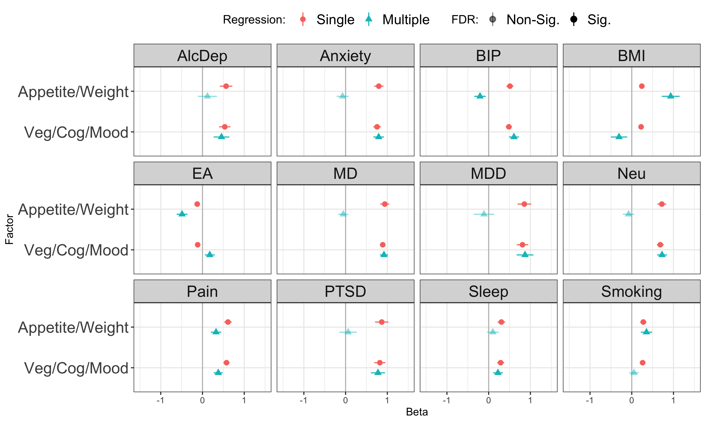

Test genetic relationship between [symptom
factors](mdd-symptom-gsem-model.md) and a selection of other phenotypes
that are genetically correlated with MDD, as well as to MDD itself.
Phenotypes to examine:

- Major depressive disorder: Clinical cohorts from [Wray et
  al](https://www.nature.com/articles/s41588-018-0090-3%5C) and non-PGC
  cohorts from . Download from
  [PGC](https://www.med.unc.edu/pgc/download-results/) and obtain via
  [data access](https://www.med.unc.edu/pgc/shared-methods/how-to/).
- Major depression: Non-PGC cohorts from [Als et
  al](https://www.medrxiv.org/content/10.1101/2022.08.24.22279149v1).
  Download from [iPsych](https://ipsych.dk/en/research/downloads).
- bipolar disorder: [Mullins et
  al](https://pubmed.ncbi.nlm.nih.gov/34002096/). Download from
  [PGC](https://figshare.com/articles/dataset/PGC3_bipolar_disorder_GWAS_summary_statistics/14102594)
- anxiety:
  [meta-analysis](https://drive.google.com/drive/folders/1fguHvz7l2G45sbMI9h_veQun4aXNTy1v)
  of [UKBB, iPSYCH](https://www.nature.com/articles/s41380-019-0559-1),
  and [ANGST](https://pubmed.ncbi.nlm.nih.gov/26754954/), from
  [Grotzinger et al
  medRxiv](https://www.medrxiv.org/content/10.1101/2020.09.22.20196089v1.full)
- PTSD: [Nievergelt et al](https://pubmed.ncbi.nlm.nih.gov/31594949/).
  Download from
  [PGC](https://figshare.com/articles/dataset/ptsd2019/14672133)
- tobacco use. Cigarettes per day [Liu et
  al](https://www.nature.com/articles/s41588-018-0307-5). Download from
  [UofM](https://conservancy.umn.edu/handle/11299/201564)
- alcohol dependence. [Walters et
  al](https://www.nature.com/articles/s41593-018-0275-1). Download from
  [PGC](https://doi.org/10.6084/m9.figshare.14672187)
- educational attainment. [Okbay et.
  al](https://www.nature.com/articles/s41588-022-01016-z). Download from
  [SSGAC Data Portal](https://thessgac.com).
- BMI, sex combined [Pulit et
  al](https://academic.oup.com/hmg/article/28/1/166/5098227). Download
  from
  [GIANT/Broad](https://portals.broadinstitute.org/collaboration/giant/index.php/GIANT_consortium_data_files#2018_GIANT_and_UK_BioBank_Meta-analysis).
- neuroticism: [Nagel et
  al](https://www.nature.com/articles/s41588-018-0151-7). Download from
  [CNCR](https://ctg.cncr.nl/software/summary_statistics)
- pain: multisite chronic pain [Johnston et
  al](https://journals.plos.org/plosgenetics/article?id=10.1371/journal.pgen.1008164).
  Download from [UoG](https://researchdata.gla.ac.uk/822/)
- chronotype: long sleep duration. [Dashti et
  al](https://www.ncbi.nlm.nih.gov/pubmed/30846698). Download from
  [SDKP](https://sleep.hugeamp.org/downloads.html).

# Setup

## R packages

R version

``` r
R.version
```

    ##                _                           
    ## platform       aarch64-apple-darwin20      
    ## arch           aarch64                     
    ## os             darwin20                    
    ## system         aarch64, darwin20           
    ## status                                     
    ## major          4                           
    ## minor          2.2                         
    ## year           2022                        
    ## month          10                          
    ## day            31                          
    ## svn rev        83211                       
    ## language       R                           
    ## version.string R version 4.2.2 (2022-10-31)
    ## nickname       Innocent and Trusting

Package installation

``` r
required_packages <- c('devtools', 'readr', 'tidyr', 'dplyr', 'ggplot2', 'stringr', 'corrplot')
for(pack in required_packages) if(!require(pack, character.only=TRUE)) install.packages(pack)

library(devtools)

if(!require(GenomicSEM)) install_github("MichelNivard/GenomicSEM")

if(!require(tidySEM)) install_github("cjvanlissa/tidySEM")
```

GenomicSEM version

``` r
require(readr)
require(tidyr)
require(stringr)
require(dplyr)
require(ggplot2)
require(corrplot)
require(GenomicSEM)

packageVersion("GenomicSEM")
```

    ## [1] '0.0.5'

# Process external sumstats

## Reformat

Format the external sumstats for reading by GenomicSEM with columns
`SNP`, `A1` (effect allele), `A2` (non-effect allele), `BETA`/`OR`, `P`,
`INFO`, and `N`.

``` r
# Major depression
md <- read_table('sumstats/daner_MDDwoBP_20201001_HRC_MDDwoBP_UKBtransformed_FinnGen_MVPaf_2_HRC_MAF01.gz')
md_sumstats <- mdd %>%
   transmute(SNP, A1, A2, BETA=log(OR), SE, FREQ=FRQ_U_667123, INFO, P, N=2*Neff_half)
write_tsv(md_sumstats, 'sumstats/MD.txt')

# Major depressive disorder
mdd <- read_tsv('sumstats/daner_MDD29.0515a_mds6.0316.gz')
mdd_sumstats <- mdd %>%
    transmute(SNP, A1, A2, BETA=log(OR), SE, FREQ=FRQ_U_25632, INFO, P,
              N=4*Nca*Nco/(Nca+Nco))
write_tsv(mdd_sumstats, 'sumstats/MDD.txt')

# Bipolar disorder
bip <- read_tsv('sumstats/pgc-bip2021-all.vcf.tsv.gz', comment='##')
bip_sumstats <- bip %>%
    filter(IMPINFO >= 0.6) %>%
    transmute(SNP=ID, A1, A2, BETA, SE, P=PVAL, INFO=IMPINFO, N=2*NEFFDIV2)
write_tsv(bip_sumstats, 'sumstats/BIP.txt')

# alcohol dependence
alcdep <- read_table('sumstats/pgc_alcdep.eur_discovery.aug2018_release.txt.gz')
alcdep_sumstats <- alcdep %>%
mutate(SNP=str_split_fixed(SNP, pattern=":", n=2)[,1]) %>%
select(SNP, A1, A2, BETA=Z, P, N=Weight)
write_tsv(alcdep_sumstats, 'sumstats/AlcDep.txt')

# body-mass index
bmi <- read_table('sumstats/Bmi.giant-ukbb.meta-analysis.combined.23May2018.HapMap2_only.txt.gz')
bmi_sumstats <- bmi %>%
    separate(SNP, into=c('SNP', 'A1', 'A2'), sep=':') %>%
    filter(INFO >= 0.6) %>%
    select(SNP, A1=Tested_Allele, A2=Other_Allele, BETA, SE, P, INFO, N)
write_tsv(bmi_sumstats, 'sumstats/BMI.txt')

# educational attainment
ea <- read_tsv('sumstats/EA4_additive_excl_23andMe.txt.gz')
ea_sumstats <-  ea %>%
    transmute(SNP=rsID, A1=Effect_allele, A2=Other_allele, FREQ=EAF_HRC, BETA=Beta, SE_unadj, P=P_unadj, N=765283)
write_tsv(ea_sumstats, 'sumstats/EA.txt')

# multisite chronic pain
pain <- read_tsv('sumstats/chronic_pain-bgen.stats.gz')
pain_sumstats <- pain %>%
    filter(INFO >= 0.6) %>%
    transmute(SNP, A1=ALLELE1, A2=ALLELE0, BETA, SE, P=P_BOLT_LMM_INF, INFO, N=387649) 
write_tsv(pain_sumstats, 'sumstats/Pain.txt')

# tabacco use
smoking <- read_table('sumstats/CigarettesPerDay.txt.gz')
smoking_sumstats <- smoking %>%
    select(SNP=RSID, A1=ALT, A2=REF, BETA, SE, P=PVALUE, N)
write_tsv(smoking_sumstats, 'sumstats/Smoking.txt')

# chronotype (long sleep duration)
sleep <- read_table('sumstats/longsumstats.txt.gz')
sleep_sumstats <- sleep %>%
    filter(INFO >= 0.6) %>%
    transmute(SNP, A1=ALLELE1, A2=ALLELE0, BETA=BETA_LONGSLEEP, SE=SE_LONGSLEEP, P=P_LONGSLEEP, INFO, N=4*34184*(305742-34184)/305742)
write_tsv(sleep_sumstats, 'sumstats/Sleep.txt')

# anxiety disorder
anxiety <- read_table('sumstats/META_UKBB_iPSYCH_ANGST_wNcol.sumstats.gz')
anxiety_sumstats <- anxiety %>%
    mutate(Nca=25453+12655+7016, Nco=58113+19225+14745) %>%
    transmute(SNP, A1=Allele1, A2=Allele2, BETA=Effect, SE=StdErr, P, N=4*Nca*Nco/(Nca+Nco))
write_tsv(anxiety_sumstats, 'sumstats/Anxiety.txt')    

# post-traumatic stress disorder
ptsd <- read_tsv('sumstats/pts_eur_freeze2_overall.results.gz')
ptsd_sumstats <- ptsd %>%
    transmute(SNP,  A1, A2, OR, SE, P, INFO, N=4*Nca*Nco/(Nca+Nco))
write_tsv(ptsd_sumstats, 'sumstats/PTSD.txt')
    
# neuroticism
neu <- read_tsv('sumstats/sumstats_neuroticism_ctg_format.txt.gz')
neu_sumstats <- neu %>%
    filter(!is.na(INFO_UKB)) %>%
    select(SNP=RSID, A1, A2, BETA=Z, P, INFO=INFO_UKB, N)
write_tsv(neu_sumstats, 'sumstats/Neu.txt')
```

## Munge

``` r
ext_traits <- c('AlcDep'=0.159, 'Anxiety'=0.16, 'BIP'=0.01,
                'BMI'=NA, 'EA'=NA, 'MD'=0.3, 'MDD'=0.15, 'Neu'=NA,
                'PTSD'=0.3, 'Pain'=NA, 'Sleep'=0.11, 'Smoking'=NA)
ext_trait_names <- names(ext_traits)
```

``` r
munge(file.path('sumstats', paste(ext_trait_names, 'txt', sep='.')),
trait.names=ext_trait_names,
hm3=here::here("sumstats/reference/w_hm3.snplist"),
info.filter = 0.9, maf.filter = 0.01)
```

# Symptom labels

MDD DSM symptoms are numbered 1-9:

``` r
# plot labels

dsm_mdd_symptoms_labels <-
read_delim("
MDD1;Mood;Mood;Dep
MDD2;Interest;Interest;Anh
MDD3;Weight⇅;Weight⇆;App
MDD3a;Weight⇊;Weight⇇;AppDec
MDD3b;Weight⇈;Weight⇉;AppInc
MDD4;Sleep⇅;Sleep⇆;Sle
MDD4a;Sleep⇊;Sleep⇇;SleDec
MDD4b;Sleep⇈;Sleep⇉;SleInc
MDD5;Motor⇅;Motor⇆;Moto
MDD5a;Motor⇈;Motor⇉;MotoInc
MDD5b;Motor⇊;Motor⇇;MotoDec
MDD6;Fatigue;Fatigue;Fatig
MDD7;Guilt;Guilt;Guilt
MDD8;Concentrate;Concentrate;Conc
MDD9;Suicidality;Suicidality;Sui
", col_names=c('ref', 'h', 'v', 'abbv'), delim=';')
```

    ## Rows: 15 Columns: 4
    ## ── Column specification ───────────────────────────────────────────────────────────────────────────────────────────────────────────────────
    ## Delimiter: ";"
    ## chr (4): ref, h, v, abbv
    ## 
    ## ℹ Use `spec()` to retrieve the full column specification for this data.
    ## ℹ Specify the column types or set `show_col_types = FALSE` to quiet this message.

``` r
dsm_mdd_symptoms_reference <-
read_delim("
MDD1;Depressed mood most of the day, nearly every day
MDD2;Markedly diminished interest or pleasure in all, or almost all, activities most of the day, nearly every day
MDD3;Significant change in weight or appetite
MDD3a;Significant weight loss or decrease in appetite
MDD3b;Significant weight gain or increase in appetite
MDD4;Sleeping too much or not sleeping enough
MDD4a;Insomnia nearly every day
MDD4b;Hypersomnia nearly every day
MDD5;Changes in speed/amount of moving or speaking
MDD5a;Psychomotor agitation nearly every day
MDD5b;Psychomotor slowing nearly every day
MDD6;Fatigue or loss of energy nearly every day
MDD7;Feelings of worthlessness or excessive or inappropriate guilt
MDD8;Diminished ability to think or concentrate, or indecisiveness
MDD9;Recurrent thoughts of death or suicide or a suicide attempt or a Multiple plan for attempting suicide
", col_names=c('Reference', 'Description'), delim=';')
```

    ## Rows: 15 Columns: 2
    ## ── Column specification ───────────────────────────────────────────────────────────────────────────────────────────────────────────────────
    ## Delimiter: ";"
    ## chr (2): Reference, Description
    ## 
    ## ℹ Use `spec()` to retrieve the full column specification for this data.
    ## ℹ Specify the column types or set `show_col_types = FALSE` to quiet this message.

# Symptom prevalences

Load previously calculated symptom prevalences:

``` r
all_covstruct_prefix <- 'clin.comm.covstruct'
all_sumstats_prevs <- read_tsv(here::here('ldsc', paste(all_covstruct_prefix, 'prevs', 'txt', sep='.'))) 
```

    ## Rows: 26 Columns: 9
    ## ── Column specification ───────────────────────────────────────────────────────────────────────────────────────────────────────────────────
    ## Delimiter: "\t"
    ## chr (5): cohorts, symptom, sumstats, filename, trait_name
    ## dbl (4): Nca, Nco, samp_prev, pop_prev
    ## 
    ## ℹ Use `spec()` to retrieve the full column specification for this data.
    ## ℹ Specify the column types or set `show_col_types = FALSE` to quiet this message.

# Multivariable LDSC estimation

Calculate LDSC covariance structure for syptoms used in the combined
structural model and the external phenotypes.

``` r
covstruct_prefix <- 'symptoms.external.covstruct'
covstruct_r <- here::here('ldsc', paste(covstruct_prefix, 'deparse.R', sep='.'))
covstruct_rds <- here::here('ldsc', paste(covstruct_prefix, 'rds', sep='.'))

if(!file.exists(covstruct_r)) {
    
  symptoms_sumstats_prevs <- all_sumstats_prevs %>%
  left_join(dsm_mdd_symptoms_labels, by=c('symptom'='ref')) %>%
  mutate(samp_prev=0.5,
         cohort=case_when(str_detect(filename, 'Clin') ~ 'Clin',
                          str_detect(filename, 'Comm') ~ 'Comm',
                          str_detect(filename, 'UKBt') ~ 'Ukb')) %>%
  transmute(filename=here::here(filename), samp_prev, pop_prev, trait_name=paste0(cohort, abbv))

  # external files, prevalences and trait names
  external_sumstats_prevs <-
    tibble(filename=paste(ext_trait_names, 'sumstats', 'gz', sep='.'),
           trait_name=ext_trait_names,
           pop_prev=ext_traits) %>%
    mutate(samp_prev=if_else(!is.na(pop_prev), true=0.5, false=NA_real_))
    
  sumstats_prevs <- bind_rows(symptoms_sumstats_prevs, external_sumstats_prevs)
    

  symptoms_covstruct <- ldsc(traits=sumstats_prevs$filename,
                             sample.prev=sumstats_prevs$samp_prev,
                             population.prev=sumstats_prevs$pop_prev,
                             ld=here::here('sumstats/reference/eur_w_ld_chr/'),
                             wld=here::here('sumstats/reference/eur_w_ld_chr/'),
                             trait.names=sumstats_prevs$trait_name)

  dput(symptoms_covstruct, covstruct_r, control=c('exact'))
  saveRDS(symptoms_covstruct, covstruct_rds)
  
  # check for exact match of deparsed object
  identical(dget(covstruct_r), symptoms_covstruct)

} else {

  symptoms_covstruct <- dget(covstruct_r)

}
```

# Models

## Symptom factors

Base model of symptom factors, with merged Cognitive/Vegeative and
Appetite.

``` r
model <- "
DEP =~ NA*CommDep + CommAnh + UkbDep + UkbAnh + ClinSleDec + CommSleDec + ClinMotoInc + ClinGuilt + CommGuilt + ClinSui + CommSui + ClinSleInc + CommSleInc + ClinMotoDec + CommFatig + CommConc
APP =~ NA*ClinAppInc + ClinAppDec + CommAppDec + app_co3b*CommAppInc
GATE =~ NA*CommDep + CommAnh + UkbDep + UkbAnh

DEP ~~ 1*DEP
APP ~~ 1*APP
GATE ~~ 1*GATE
GATE ~~ 0*DEP + 0*APP
"
fit <- usermodel(symptoms_covstruct, estimation='DWLS', model=model, CFIcalc=TRUE)
```

    ## [1] "Running primary model"
    ## [1] "Calculating CFI"
    ## [1] "Calculating Standardized Results"
    ## [1] "Calculating SRMR"
    ## elapsed 
    ##    2.51 
    ## [1] "The S matrix was smoothed prior to model estimation due to a non-positive definite matrix. The largest absolute difference in a cell between the smoothed and non-smoothed matrix was  0.0503268938714747 As a result of the smoothing, the largest Z-statistic change for the genetic covariances was  1.17257288534608 . We recommend setting the smooth_check argument to true if you are going to run a multivariate GWAS."

    ## Warning in usermodel(symptoms_covstruct, estimation = "DWLS", model = model, :
    ## A difference greater than .025 was observed pre- and post-smoothing in the
    ## genetic covariance matrix. This reflects a large difference and results should
    ## be interpreted with caution!! This can often result from including low powered
    ## traits, and you might consider removing those traits from the model. If you are
    ## going to run a multivariate GWAS we strongly recommend setting the smooth_check
    ## argument to true to check smoothing for each SNP.

    ## Warning in usermodel(symptoms_covstruct, estimation = "DWLS", model = model, :
    ## A difference greater than .025 was observed pre- and post-smoothing for
    ## Z-statistics in the genetic covariance matrix. This reflects a large difference
    ## and results should be interpreted with caution!! This can often result from
    ## including low powered traits, and you might consider removing those traits from
    ## the model. If you are going to run a multivariate GWAS we strongly recommend
    ## setting the smooth_check argument to true to check smoothing for each SNP.

## Sample factors

Base model of Clinical and Community sample factors.

``` r
model <- "
CLIN =~ NA*ClinAppDec + ClinAppInc + ClinSleDec + ClinSleInc + ClinMotoInc + ClinMotoDec + ClinGuilt + ClinSui
COMM =~ NA*CommDep + CommAnh + UkbDep + UkbAnh + CommAppDec + CommAppInc + CommSleDec + CommSleInc + CommFatig + CommGuilt + CommConc + CommSui
GATE =~ NA*CommDep + CommAnh + UkbDep + UkbAnh

CLIN ~~ 1*CLIN
GATE ~~ 1*GATE
COMM ~~ 1*COMM
GATE ~~ 0*COMM + 0*CLIN
"
fit <- usermodel(symptoms_covstruct, estimation='DWLS', model=model, CFIcalc=TRUE)
```

    ## [1] "Running primary model"
    ## [1] "Calculating CFI"
    ## [1] "Calculating Standardized Results"
    ## [1] "Calculating SRMR"
    ## elapsed 
    ##   1.968 
    ## [1] "The S matrix was smoothed prior to model estimation due to a non-positive definite matrix. The largest absolute difference in a cell between the smoothed and non-smoothed matrix was  0.0503268938714747 As a result of the smoothing, the largest Z-statistic change for the genetic covariances was  1.17257288534608 . We recommend setting the smooth_check argument to true if you are going to run a multivariate GWAS."

    ## Warning in usermodel(symptoms_covstruct, estimation = "DWLS", model = model, :
    ## A difference greater than .025 was observed pre- and post-smoothing in the
    ## genetic covariance matrix. This reflects a large difference and results should
    ## be interpreted with caution!! This can often result from including low powered
    ## traits, and you might consider removing those traits from the model. If you are
    ## going to run a multivariate GWAS we strongly recommend setting the smooth_check
    ## argument to true to check smoothing for each SNP.

    ## Warning in usermodel(symptoms_covstruct, estimation = "DWLS", model = model, :
    ## A difference greater than .025 was observed pre- and post-smoothing for
    ## Z-statistics in the genetic covariance matrix. This reflects a large difference
    ## and results should be interpreted with caution!! This can often result from
    ## including low powered traits, and you might consider removing those traits from
    ## the model. If you are going to run a multivariate GWAS we strongly recommend
    ## setting the smooth_check argument to true to check smoothing for each SNP.

## External phenotypes

### Symptom factors

Compare symptom factors against each external phenotype. Single
regression of each external phenotype on each symptom or symptom
cluster.

``` r
ext_symp.glue <- "
DEP =~ NA*CommDep + CommAnh + UkbDep + UkbAnh + ClinSleDec + CommSleDec + ClinMotoInc + ClinGuilt + CommGuilt + ClinSui + CommSui + ClinSleInc + CommSleInc + ClinMotoDec + CommFatig + CommConc
APP =~ NA*ClinAppInc + ClinAppDec + CommAppDec + app_co3b*CommAppInc
GATE =~ NA*CommDep + CommAnh + UkbDep + UkbAnh

DEP ~~ 1*DEP
APP ~~ 1*APP
GATE ~~ 1*GATE
GATE ~~ 0*DEP + 0*APP

AlcDep ~ {symptom}
Anxiety ~  {symptom}
BIP ~ {symptom}
BMI ~ {symptom}
EA ~ {symptom}
MD ~ {symptom}
MDD ~ {symptom}
Neu ~ {symptom}
PTSD ~ {symptom}
Pain ~ {symptom}
Sleep ~ {symptom}
Smoking ~ {symptom}
"

ext_symp.model_list <- lapply(c('DEP', 'APP', 'GATE'), function(symptom) str_glue_data(list(symptom=symptom), ext_symp.glue))

ext_symp.fit_list <- lapply(ext_symp.model_list, function(model) usermodel(symptoms_covstruct, estimation='DWLS', model=model))
```

    ## [1] "Running primary model"
    ## [1] "Calculating CFI"
    ## [1] "Calculating Standardized Results"
    ## [1] "Calculating SRMR"
    ## elapsed 
    ##  45.685 
    ## [1] "The S matrix was smoothed prior to model estimation due to a non-positive definite matrix. The largest absolute difference in a cell between the smoothed and non-smoothed matrix was  0.0576161416152574 As a result of the smoothing, the largest Z-statistic change for the genetic covariances was  1.46841854745071 . We recommend setting the smooth_check argument to true if you are going to run a multivariate GWAS."

    ## Warning in usermodel(symptoms_covstruct, estimation = "DWLS", model = model): A
    ## difference greater than .025 was observed pre- and post-smoothing in the
    ## genetic covariance matrix. This reflects a large difference and results should
    ## be interpreted with caution!! This can often result from including low powered
    ## traits, and you might consider removing those traits from the model. If you are
    ## going to run a multivariate GWAS we strongly recommend setting the smooth_check
    ## argument to true to check smoothing for each SNP.

    ## Warning in usermodel(symptoms_covstruct, estimation = "DWLS", model = model): A
    ## difference greater than .025 was observed pre- and post-smoothing for
    ## Z-statistics in the genetic covariance matrix. This reflects a large difference
    ## and results should be interpreted with caution!! This can often result from
    ## including low powered traits, and you might consider removing those traits from
    ## the model. If you are going to run a multivariate GWAS we strongly recommend
    ## setting the smooth_check argument to true to check smoothing for each SNP.

    ## [1] "Running primary model"
    ## [1] "Calculating CFI"
    ## [1] "Calculating Standardized Results"
    ## [1] "Calculating SRMR"
    ## elapsed 
    ##  40.047 
    ## [1] "The S matrix was smoothed prior to model estimation due to a non-positive definite matrix. The largest absolute difference in a cell between the smoothed and non-smoothed matrix was  0.0576161416152574 As a result of the smoothing, the largest Z-statistic change for the genetic covariances was  1.46841854745071 . We recommend setting the smooth_check argument to true if you are going to run a multivariate GWAS."

    ## Warning in usermodel(symptoms_covstruct, estimation = "DWLS", model = model): A
    ## difference greater than .025 was observed pre- and post-smoothing in the
    ## genetic covariance matrix. This reflects a large difference and results should
    ## be interpreted with caution!! This can often result from including low powered
    ## traits, and you might consider removing those traits from the model. If you are
    ## going to run a multivariate GWAS we strongly recommend setting the smooth_check
    ## argument to true to check smoothing for each SNP.

    ## Warning in usermodel(symptoms_covstruct, estimation = "DWLS", model = model): A
    ## difference greater than .025 was observed pre- and post-smoothing for
    ## Z-statistics in the genetic covariance matrix. This reflects a large difference
    ## and results should be interpreted with caution!! This can often result from
    ## including low powered traits, and you might consider removing those traits from
    ## the model. If you are going to run a multivariate GWAS we strongly recommend
    ## setting the smooth_check argument to true to check smoothing for each SNP.

    ## [1] "Running primary model"
    ## [1] "Calculating CFI"
    ## [1] "Calculating Standardized Results"
    ## [1] "Calculating SRMR"
    ## elapsed 
    ##  44.981 
    ## [1] "The S matrix was smoothed prior to model estimation due to a non-positive definite matrix. The largest absolute difference in a cell between the smoothed and non-smoothed matrix was  0.0576161416152574 As a result of the smoothing, the largest Z-statistic change for the genetic covariances was  1.46841854745071 . We recommend setting the smooth_check argument to true if you are going to run a multivariate GWAS."

    ## Warning in usermodel(symptoms_covstruct, estimation = "DWLS", model = model): A
    ## difference greater than .025 was observed pre- and post-smoothing in the
    ## genetic covariance matrix. This reflects a large difference and results should
    ## be interpreted with caution!! This can often result from including low powered
    ## traits, and you might consider removing those traits from the model. If you are
    ## going to run a multivariate GWAS we strongly recommend setting the smooth_check
    ## argument to true to check smoothing for each SNP.

    ## Warning in usermodel(symptoms_covstruct, estimation = "DWLS", model = model): A
    ## difference greater than .025 was observed pre- and post-smoothing for
    ## Z-statistics in the genetic covariance matrix. This reflects a large difference
    ## and results should be interpreted with caution!! This can often result from
    ## including low powered traits, and you might consider removing those traits from
    ## the model. If you are going to run a multivariate GWAS we strongly recommend
    ## setting the smooth_check argument to true to check smoothing for each SNP.

### Sample factors

``` r
ext_samp.glue <- "
CLIN =~ NA*ClinGuilt + ClinSui + ClinAppDec + ClinAppInc + ClinSleDec + ClinSleInc + ClinMotoInc + ClinMotoDec
COMM =~ NA*CommDep + CommAnh + UkbDep + UkbAnh + CommAppDec + CommAppInc + CommSleDec + CommSleInc + CommFatig + CommGuilt + CommConc + CommSui
GATE =~ NA*CommDep + CommAnh + UkbDep + UkbAnh

CLIN ~~ 1*CLIN
GATE ~~ 1*GATE
COMM ~~ 1*COMM
GATE ~~ 0*COMM + 0*CLIN

cc < 0.99
CLIN ~~ cc*COMM

AlcDep ~ {symptom}
Anxiety ~  {symptom}
BIP ~ {symptom}
BMI ~ {symptom}
EA ~ {symptom}
MD ~ {symptom}
MDD ~ {symptom}
Neu ~ {symptom}
PTSD ~ {symptom}
Pain ~ {symptom}
Sleep ~ {symptom}
Smoking ~ {symptom}
"

ext_samp.model_list <- lapply(c('CLIN', 'COMM'), function(symptom) str_glue_data(list(symptom=symptom), ext_samp.glue))

ext_samp.fit_list <- lapply(ext_samp.model_list, function(model) usermodel(symptoms_covstruct, estimation='DWLS', model=model))
```

    ## [1] "Running primary model"
    ## [1] "Calculating CFI"
    ## [1] "Calculating Standardized Results"
    ## [1] "Calculating SRMR"
    ## elapsed 
    ## 102.723 
    ## [1] "The S matrix was smoothed prior to model estimation due to a non-positive definite matrix. The largest absolute difference in a cell between the smoothed and non-smoothed matrix was  0.0576161416152574 As a result of the smoothing, the largest Z-statistic change for the genetic covariances was  1.46841854745071 . We recommend setting the smooth_check argument to true if you are going to run a multivariate GWAS."

    ## Warning in usermodel(symptoms_covstruct, estimation = "DWLS", model = model): A
    ## difference greater than .025 was observed pre- and post-smoothing in the
    ## genetic covariance matrix. This reflects a large difference and results should
    ## be interpreted with caution!! This can often result from including low powered
    ## traits, and you might consider removing those traits from the model. If you are
    ## going to run a multivariate GWAS we strongly recommend setting the smooth_check
    ## argument to true to check smoothing for each SNP.

    ## Warning in usermodel(symptoms_covstruct, estimation = "DWLS", model = model): A
    ## difference greater than .025 was observed pre- and post-smoothing for
    ## Z-statistics in the genetic covariance matrix. This reflects a large difference
    ## and results should be interpreted with caution!! This can often result from
    ## including low powered traits, and you might consider removing those traits from
    ## the model. If you are going to run a multivariate GWAS we strongly recommend
    ## setting the smooth_check argument to true to check smoothing for each SNP.

    ## [1] "Running primary model"
    ## [1] "Calculating CFI"
    ## [1] "Calculating Standardized Results"
    ## [1] "Calculating SRMR"
    ## elapsed 
    ##  88.002 
    ## [1] "The S matrix was smoothed prior to model estimation due to a non-positive definite matrix. The largest absolute difference in a cell between the smoothed and non-smoothed matrix was  0.0576161416152574 As a result of the smoothing, the largest Z-statistic change for the genetic covariances was  1.46841854745071 . We recommend setting the smooth_check argument to true if you are going to run a multivariate GWAS."

    ## Warning in usermodel(symptoms_covstruct, estimation = "DWLS", model = model): A
    ## difference greater than .025 was observed pre- and post-smoothing in the
    ## genetic covariance matrix. This reflects a large difference and results should
    ## be interpreted with caution!! This can often result from including low powered
    ## traits, and you might consider removing those traits from the model. If you are
    ## going to run a multivariate GWAS we strongly recommend setting the smooth_check
    ## argument to true to check smoothing for each SNP.

    ## Warning in usermodel(symptoms_covstruct, estimation = "DWLS", model = model): A
    ## difference greater than .025 was observed pre- and post-smoothing for
    ## Z-statistics in the genetic covariance matrix. This reflects a large difference
    ## and results should be interpreted with caution!! This can often result from
    ## including low powered traits, and you might consider removing those traits from
    ## the model. If you are going to run a multivariate GWAS we strongly recommend
    ## setting the smooth_check argument to true to check smoothing for each SNP.

``` r
ext_single <-
bind_rows(lapply(c(ext_symp.fit_list, ext_samp.fit_list), function(fit) mutate(fit$results, p_value=as.character(p_value)))) %>%
select(lhs, op, rhs, STD_Genotype, STD_Genotype_SE, p_value) %>%
filter(lhs %in% ext_trait_names, rhs %in% c('DEP', 'APP', 'GATE', 'CLIN', 'COMM')) %>%
mutate(Beta='Single', Factor=rhs, Phenotype=lhs, p_value=as.numeric(p_value))
```

### Symptom factors

Multiple regression of each phenotype on symptom factors, to estimate
relationship after condition on each of the other factors.

``` r
ext_mult_symp.model <- "
DEP =~ NA*CommDep + CommAnh + UkbDep + UkbAnh + ClinSleDec + CommSleDec + ClinMotoInc + ClinGuilt + CommGuilt + ClinSui + CommSui + ClinSleInc + CommSleInc + ClinMotoDec + CommFatig + CommConc
APP =~ NA*ClinAppInc + ClinAppDec + CommAppDec + CommAppInc
GATE =~ NA*CommDep + CommAnh + UkbDep + UkbAnh

DEP ~~ 1*DEP
APP ~~ 1*APP
GATE ~~ 1*GATE
GATE ~~ 0*DEP + 0*APP

AlcDep ~ DEP + APP + GATE
Anxiety ~  DEP + APP + GATE
BIP ~ DEP + APP + GATE
BMI ~ DEP + APP + GATE
EA ~ DEP + APP + GATE
MD ~ DEP + APP + GATE
MDD ~ DEP + APP + GATE
Neu ~ DEP + APP + GATE
PTSD ~ DEP + APP + GATE
Pain ~ DEP + APP + GATE
Sleep ~ DEP + APP + GATE
Smoking ~ DEP + APP + GATE
"
ext_mult_symp.fit <- usermodel(symptoms_covstruct, estimation='DWLS', model=ext_mult_symp.model)
```

    ## [1] "Running primary model"
    ## [1] "Calculating CFI"
    ## [1] "Calculating Standardized Results"
    ## [1] "Calculating SRMR"
    ## elapsed 
    ##  46.429 
    ## [1] "The S matrix was smoothed prior to model estimation due to a non-positive definite matrix. The largest absolute difference in a cell between the smoothed and non-smoothed matrix was  0.0576161416152574 As a result of the smoothing, the largest Z-statistic change for the genetic covariances was  1.46841854745071 . We recommend setting the smooth_check argument to true if you are going to run a multivariate GWAS."

    ## Warning in usermodel(symptoms_covstruct, estimation = "DWLS", model =
    ## ext_mult_symp.model): A difference greater than .025 was observed pre- and
    ## post-smoothing in the genetic covariance matrix. This reflects a large
    ## difference and results should be interpreted with caution!! This can often
    ## result from including low powered traits, and you might consider removing those
    ## traits from the model. If you are going to run a multivariate GWAS we strongly
    ## recommend setting the smooth_check argument to true to check smoothing for each
    ## SNP.

    ## Warning in usermodel(symptoms_covstruct, estimation = "DWLS", model =
    ## ext_mult_symp.model): A difference greater than .025 was observed pre- and
    ## post-smoothing for Z-statistics in the genetic covariance matrix. This reflects
    ## a large difference and results should be interpreted with caution!! This can
    ## often result from including low powered traits, and you might consider removing
    ## those traits from the model. If you are going to run a multivariate GWAS we
    ## strongly recommend setting the smooth_check argument to true to check smoothing
    ## for each SNP.

### Sample factors

``` r
ext_samp_mult.model <- "
CLIN =~ NA*ClinGuilt + ClinSui + ClinAppDec + ClinAppInc + ClinSleDec + ClinSleInc + ClinMotoInc + ClinMotoDec
COMM =~ NA*CommDep + CommAnh + UkbDep + UkbAnh + CommAppDec + CommAppInc + CommSleDec + CommSleInc + CommFatig + CommGuilt + CommConc + CommSui
GATE =~ NA*CommDep + CommAnh + UkbDep + UkbAnh

CLIN ~~ 1*CLIN
GATE ~~ 1*GATE
COMM ~~ 1*COMM
GATE ~~ 0*COMM + 0*CLIN

AlcDep ~ CLIN + COMM 
Anxiety ~  CLIN + COMM
BIP ~ CLIN + COMM 
BMI ~ CLIN + COMM 
EA ~ CLIN + COMM 
MD ~ CLIN + COMM
MDD ~ CLIN + COMM
Neu ~ CLIN + COMM
PTSD ~ CLIN + COMM
Pain ~ CLIN + COMM
Sleep ~ CLIN + COMM
Smoking ~ CLIN + COMM
"
ext_samp_mult.fit <- usermodel(symptoms_covstruct, estimation='DWLS', model=ext_samp_mult.model)
```

    ## [1] "Running primary model"
    ## [1] "Calculating CFI"
    ## [1] "Calculating Standardized Results"
    ## [1] "Calculating SRMR"
    ## elapsed 
    ##  48.673 
    ## [1] "The S matrix was smoothed prior to model estimation due to a non-positive definite matrix. The largest absolute difference in a cell between the smoothed and non-smoothed matrix was  0.0576161416152574 As a result of the smoothing, the largest Z-statistic change for the genetic covariances was  1.46841854745071 . We recommend setting the smooth_check argument to true if you are going to run a multivariate GWAS."

    ## Warning in usermodel(symptoms_covstruct, estimation = "DWLS", model =
    ## ext_samp_mult.model): A difference greater than .025 was observed pre- and
    ## post-smoothing in the genetic covariance matrix. This reflects a large
    ## difference and results should be interpreted with caution!! This can often
    ## result from including low powered traits, and you might consider removing those
    ## traits from the model. If you are going to run a multivariate GWAS we strongly
    ## recommend setting the smooth_check argument to true to check smoothing for each
    ## SNP.

    ## Warning in usermodel(symptoms_covstruct, estimation = "DWLS", model =
    ## ext_samp_mult.model): A difference greater than .025 was observed pre- and
    ## post-smoothing for Z-statistics in the genetic covariance matrix. This reflects
    ## a large difference and results should be interpreted with caution!! This can
    ## often result from including low powered traits, and you might consider removing
    ## those traits from the model. If you are going to run a multivariate GWAS we
    ## strongly recommend setting the smooth_check argument to true to check smoothing
    ## for each SNP.

``` r
ext_multiple <-
bind_rows(lapply(list(ext_mult_symp.fit, ext_samp_mult.fit),
                 function(fit) fit$results)) %>%
  select(lhs, op, rhs, STD_Genotype, STD_Genotype_SE, p_value) %>%
  filter(lhs %in% ext_trait_names, rhs %in% c('DEP', 'APP', 'GATE', 'CLIN', 'COMM')) %>%
  mutate(Beta='Multiple', Factor=rhs, Phenotype=lhs)
```

``` r
ext_table <-
bind_rows(ext_single, ext_multiple) %>%
transmute(Phenotype,
          Factor=factor(Factor,
                    levels=c('GATE', 'DEP', 'APP', 'CLIN', 'COMM'),
                        labels=c("Gating", "Veg/Cog/Mood", "Appetite/Weight", "Community", "Clinical")),
          Model=Beta, STD_Genotype, STD_Genotype_SE, p_value) %>%
mutate(fdr=p.adjust(p_value, 'BY')) |>
arrange(Phenotype, desc(Factor), Model)

ext_table
```

    ##     Phenotype          Factor    Model STD_Genotype    STD_Genotype_SE
    ## 1      AlcDep        Clinical Multiple  0.224514147    0.2930781129663
    ## 2      AlcDep        Clinical   Single  0.532780777 0.0695890033530825
    ## 3      AlcDep       Community Multiple  0.445816163   0.35250871390173
    ## 4      AlcDep       Community   Single  0.537703868  0.077892636963081
    ## 5      AlcDep Appetite/Weight Multiple  0.109685864  0.120188626807943
    ## 6      AlcDep Appetite/Weight   Single  0.565247937  0.075903641945665
    ## 7      AlcDep    Veg/Cog/Mood Multiple  0.438540157  0.120028276636872
    ## 8      AlcDep    Veg/Cog/Mood   Single  0.533448116 0.0697136062054994
    ## 9      AlcDep          Gating Multiple  0.083675864  0.112380334461399
    ## 10     AlcDep          Gating   Single  0.627948915  0.108105533328542
    ## 11    Anxiety        Clinical Multiple  1.050085203   0.26607407922922
    ## 12    Anxiety        Clinical   Single  0.751876755 0.0465292301764595
    ## 13    Anxiety       Community Multiple -0.434142077  0.303266811577734
    ## 14    Anxiety       Community   Single  0.758241737 0.0683543546251365
    ## 15    Anxiety Appetite/Weight Multiple  0.009717746 0.0732045283088427
    ## 16    Anxiety Appetite/Weight   Single  0.795905437 0.0574613137032865
    ## 17    Anxiety    Veg/Cog/Mood Multiple  0.578270045  0.081659736425248
    ## 18    Anxiety    Veg/Cog/Mood   Single  0.754101956 0.0467032496502194
    ## 19    Anxiety          Gating Multiple  0.411356507 0.0753474339204204
    ## 20    Anxiety          Gating   Single  1.046285229  0.108738985221118
    ## 21        BIP        Clinical Multiple  0.699035302  0.214770269408549
    ## 22        BIP        Clinical   Single  0.481923986 0.0373689676683766
    ## 23        BIP       Community Multiple -0.318027549  0.250184429867306
    ## 24        BIP       Community   Single  0.486075187 0.0467197782931644
    ## 25        BIP Appetite/Weight Multiple -0.178431593 0.0694551284584618
    ## 26        BIP Appetite/Weight   Single  0.509333733 0.0440438620781618
    ## 27        BIP    Veg/Cog/Mood Multiple  0.505207383 0.0686306967877668
    ## 28        BIP    Veg/Cog/Mood   Single  0.483815805 0.0375477179197763
    ## 29        BIP          Gating Multiple  0.228519473 0.0634680013627106
    ## 30        BIP          Gating   Single  0.662955934 0.0711418794992003
    ## 31        BMI        Clinical Multiple -0.243654945  0.322632558905034
    ## 32        BMI        Clinical   Single  0.223891333 0.0271838348787043
    ## 33        BMI       Community Multiple  0.688981292  0.345726695424247
    ## 34        BMI       Community   Single  0.225821094 0.0296103206045522
    ## 35        BMI Appetite/Weight Multiple  0.907036576  0.112105787746715
    ## 36        BMI Appetite/Weight   Single  0.240811039 0.0301763486246527
    ## 37        BMI    Veg/Cog/Mood Multiple -0.230550899  0.108273490883442
    ## 38        BMI    Veg/Cog/Mood   Single  0.223195791  0.027216658834216
    ## 39        BMI          Gating Multiple -0.162612078 0.0498740124573413
    ## 40        BMI          Gating   Single  0.109909716 0.0360284399614011
    ## 41         EA        Clinical Multiple  0.361148501  0.331884952542997
    ## 42         EA        Clinical   Single -0.117012064 0.0284219882015643
    ## 43         EA       Community Multiple -0.697661177  0.352553481384944
    ## 44         EA       Community   Single -0.118287588 0.0290473447473141
    ## 45         EA Appetite/Weight Multiple -0.397963661 0.0601516237695752
    ## 46         EA Appetite/Weight   Single -0.126176815 0.0305502505774698
    ## 47         EA    Veg/Cog/Mood Multiple -0.017503605 0.0611455287343463
    ## 48         EA    Veg/Cog/Mood   Single -0.115755210 0.0284744747904233
    ## 49         EA          Gating Multiple  0.292522226 0.0525743076019581
    ## 50         EA          Gating   Single  0.030112181 0.0349152221396346
    ## 51         MD        Clinical Multiple  1.081442666  0.207773598881208
    ## 52         MD        Clinical   Single  0.887200461 0.0346128597135449
    ## 53         MD       Community Multiple -0.280626133  0.242603533332147
    ## 54         MD       Community   Single  0.894657034  0.062649604320161
    ## 55         MD Appetite/Weight Multiple -0.010548128 0.0576909794864581
    ## 56         MD Appetite/Weight   Single  0.939281112 0.0547299322786408
    ## 57         MD    Veg/Cog/Mood Multiple  0.766001387 0.0578233502165252
    ## 58         MD    Veg/Cog/Mood   Single  0.890259762 0.0347314646592678
    ## 59         MD          Gating Multiple  0.344018937 0.0640870067647852
    ## 60         MD          Gating   Single  1.166485513  0.105562729815299
    ## 61        MDD        Clinical Multiple  1.036662792  0.304002251989274
    ## 62        MDD        Clinical   Single  0.807311267 0.0705441889706728
    ## 63        MDD       Community Multiple -0.332671886  0.373130185366155
    ## 64        MDD       Community   Single  0.814119235 0.0840410881768543
    ## 65        MDD Appetite/Weight Multiple -0.051964459  0.124626780966716
    ## 66        MDD Appetite/Weight   Single  0.854805178 0.0828666825706371
    ## 67        MDD    Veg/Cog/Mood Multiple  0.689603909  0.118601081157099
    ## 68        MDD    Veg/Cog/Mood   Single  0.809984427  0.070742129966017
    ## 69        MDD          Gating Multiple  0.366751106    0.1123341502703
    ## 70        MDD          Gating   Single  1.089713958  0.129227721797031
    ## 71        Neu        Clinical Multiple  0.747666501  0.147014030184277
    ## 72        Neu        Clinical   Single  0.681081631 0.0420521783500257
    ## 73        Neu       Community Multiple -0.097115834  0.183964205576084
    ## 74        Neu       Community   Single  0.686908955 0.0577424076909882
    ## 75        Neu Appetite/Weight Multiple -0.090458605 0.0735870644599524
    ## 76        Neu Appetite/Weight   Single  0.720739634 0.0542476095995377
    ## 77        Neu    Veg/Cog/Mood Multiple  0.700715195 0.0724797147852156
    ## 78        Neu    Veg/Cog/Mood   Single  0.683537259 0.0422441574366223
    ## 79        Neu          Gating Multiple  0.126522422  0.070416051166998
    ## 80        Neu          Gating   Single  0.832319129 0.0821243821043781
    ## 81       PTSD        Clinical Multiple  0.932075649  0.236985849099579
    ## 82       PTSD        Clinical   Single  0.817782344 0.0687835319851177
    ## 83       PTSD       Community Multiple -0.167400848  0.305210368971745
    ## 84       PTSD       Community   Single  0.824899216 0.0866396039978251
    ## 85       PTSD Appetite/Weight Multiple  0.086899694  0.108833874622065
    ## 86       PTSD Appetite/Weight   Single  0.866766379 0.0814609323857996
    ## 87       PTSD    Veg/Cog/Mood Multiple  0.671770728  0.108654711098117
    ## 88       PTSD    Veg/Cog/Mood   Single  0.820255391 0.0689374769876117
    ## 89       PTSD          Gating Multiple  0.244258549   0.11289978288913
    ## 90       PTSD          Gating   Single  1.024713470  0.126944340784626
    ## 91       Pain        Clinical Multiple  0.458139921  0.125009997167626
    ## 92       Pain        Clinical   Single  0.574660244 0.0376060594251327
    ## 93       Pain       Community Multiple  0.170613953  0.157107948952011
    ## 94       Pain       Community   Single  0.579613328 0.0488242339765231
    ## 95       Pain Appetite/Weight Multiple  0.320415745 0.0653189319292486
    ## 96       Pain Appetite/Weight   Single  0.610435914 0.0460975785624394
    ## 97       Pain    Veg/Cog/Mood Multiple  0.358819803   0.06833668509286
    ## 98       Pain    Veg/Cog/Mood   Single  0.575635990  0.037703284625588
    ## 99       Pain          Gating Multiple  0.066845781 0.0624362719676788
    ## 100      Pain          Gating   Single  0.642966541 0.0716527853756348
    ## 101     Sleep        Clinical Multiple  0.186915486  0.146390761375732
    ## 102     Sleep        Clinical   Single  0.286743969   0.04346225802776
    ## 103     Sleep       Community Multiple  0.144806048  0.189383378256927
    ## 104     Sleep       Community   Single  0.289275077 0.0476246488813093
    ## 105     Sleep Appetite/Weight Multiple  0.073020416   0.07578984555623
    ## 106     Sleep Appetite/Weight   Single  0.304248899 0.0466210669741548
    ## 107     Sleep    Veg/Cog/Mood Multiple  0.259401956  0.075195355765794
    ## 108     Sleep    Veg/Cog/Mood   Single  0.286946115 0.0435752155004726
    ## 109     Sleep          Gating Multiple -0.021327371 0.0708736043112238
    ## 110     Sleep          Gating   Single  0.310162560 0.0626698026037064
    ## 111   Smoking        Clinical Multiple -0.114287906   0.27300060991911
    ## 112   Smoking        Clinical   Single  0.259462065 0.0355402132237784
    ## 113   Smoking       Community Multiple  0.548188750   0.29396760579689
    ## 114   Smoking       Community   Single  0.261855177 0.0392616164545943
    ## 115   Smoking Appetite/Weight Multiple  0.374552937 0.0736397000669569
    ## 116   Smoking Appetite/Weight   Single  0.276771013 0.0382221256804699
    ## 117   Smoking    Veg/Cog/Mood Multiple  0.006724170 0.0708370430374214
    ## 118   Smoking    Veg/Cog/Mood   Single  0.259880783  0.035612615201055
    ## 119   Smoking          Gating Multiple  0.063663267 0.0498122419478732
    ## 120   Smoking          Gating   Single  0.290646265  0.054422662044535
    ##           p_value           fdr
    ## 1    4.435700e-01  1.000000e+00
    ## 2    1.916577e-14  2.939956e-13
    ## 3    2.059672e-01  1.000000e+00
    ## 4    5.087131e-12  6.426385e-11
    ## 5    3.614354e-01  1.000000e+00
    ## 6    9.555742e-14  1.368094e-12
    ## 7    2.585204e-04  2.135326e-03
    ## 8    1.978976e-14  2.965078e-13
    ## 9    4.565231e-01  1.000000e+00
    ## 10   6.297325e-09  6.761902e-08
    ## 11   7.916366e-05  6.800308e-04
    ## 12   9.777466e-59  1.049878e-56
    ## 13   1.522570e-01  1.000000e+00
    ## 14   1.359520e-28  3.649542e-27
    ## 15   8.943705e-01  1.000000e+00
    ## 16   1.251836e-43  7.331938e-42
    ## 17   1.425961e-12  1.837392e-11
    ## 18   1.198551e-58  1.103119e-56
    ## 19   4.775945e-08  4.962855e-07
    ## 20   6.453068e-22  1.299213e-20
    ## 21   1.133728e-03  8.695481e-03
    ## 22   4.717979e-38  2.026417e-36
    ## 23   2.036536e-01  1.000000e+00
    ## 24   2.375892e-25  5.669267e-24
    ## 25   1.019881e-02  7.640380e-02
    ## 26   6.253918e-31  1.918655e-29
    ## 27   1.821135e-13  2.550635e-12
    ## 28   5.442590e-38  2.191541e-36
    ## 29   3.175575e-04  2.589759e-03
    ## 30   1.176218e-20  2.228810e-19
    ## 31   4.501236e-01  1.000000e+00
    ## 32   1.777806e-16  3.095614e-15
    ## 33   4.626305e-02  3.348947e-01
    ## 34   2.413337e-14  3.533697e-13
    ## 35   5.914378e-16  9.770312e-15
    ## 36   1.461880e-15  2.297163e-14
    ## 37   3.322942e-02  2.432787e-01
    ## 38   2.389638e-16  4.051469e-15
    ## 39   1.112307e-03  8.633973e-03
    ## 40   2.283694e-03  1.730944e-02
    ## 41   2.765009e-01  1.000000e+00
    ## 42   3.839045e-05  3.435221e-04
    ## 43   4.781449e-02  3.422796e-01
    ## 44   4.656551e-05  4.109656e-04
    ## 45   3.688245e-11  4.483404e-10
    ## 46   3.625477e-05  3.289810e-04
    ## 47   7.746128e-01  1.000000e+00
    ## 48   4.798684e-05  4.177865e-04
    ## 49   2.637035e-08  2.785159e-07
    ## 50   3.884487e-01  1.000000e+00
    ## 51   1.936363e-07  1.890196e-06
    ## 52  6.695808e-145 2.156935e-142
    ## 53   2.473732e-01  1.000000e+00
    ## 54   2.901357e-46  1.869240e-44
    ## 55   8.549613e-01  1.000000e+00
    ## 56   5.101195e-66  1.095506e-63
    ## 57   4.672791e-40  2.301849e-38
    ## 58  6.599966e-145 2.156935e-142
    ## 59   7.962081e-08  8.142355e-07
    ## 60   2.185914e-28  5.633223e-27
    ## 61   6.489676e-04  5.161810e-03
    ## 62   2.518437e-30  7.054518e-29
    ## 63   3.726225e-01  1.000000e+00
    ## 64   3.419466e-22  7.343465e-21
    ## 65   6.767269e-01  1.000000e+00
    ## 66   6.001637e-25  1.380943e-23
    ## 67   6.080691e-09  6.639952e-08
    ## 68   2.356658e-30  6.901410e-29
    ## 69   1.095350e-03  8.606034e-03
    ## 70   3.382462e-17  6.053331e-16
    ## 71   3.656920e-07  3.464739e-06
    ## 72   5.372368e-59  8.653060e-57
    ## 73   5.975764e-01  1.000000e+00
    ## 74   1.240056e-32  4.438465e-31
    ## 75   2.189784e-01  1.000000e+00
    ## 76   2.786703e-40  1.496144e-38
    ## 77   4.130463e-22  8.584224e-21
    ## 78   6.907804e-59  8.900901e-57
    ## 79   7.237112e-02  5.068057e-01
    ## 80   3.866367e-24  8.589523e-23
    ## 81   8.379575e-05  7.103500e-04
    ## 82   1.346515e-32  4.565851e-31
    ## 83   5.833732e-01  1.000000e+00
    ## 84   1.714803e-21  3.347837e-20
    ## 85   4.245872e-01  1.000000e+00
    ## 86   1.935541e-26  4.796153e-25
    ## 87   6.302735e-10  7.123906e-09
    ## 88   1.204448e-32  4.438465e-31
    ## 89   3.050326e-02  2.258869e-01
    ## 90   6.904897e-16  1.112145e-14
    ## 91   2.472165e-04  2.068477e-03
    ## 92   1.022688e-52  8.236016e-51
    ## 93   2.774802e-01  1.000000e+00
    ## 94   1.665872e-32  5.366308e-31
    ## 95   9.321533e-07  8.579328e-06
    ## 96   5.001967e-40  2.301849e-38
    ## 97   1.513668e-07  1.500311e-06
    ## 98   1.258586e-52  9.009580e-51
    ## 99   2.843421e-01  1.000000e+00
    ## 100  2.874590e-19  5.291415e-18
    ## 101  2.016219e-01  1.000000e+00
    ## 102  4.180284e-11  4.987421e-10
    ## 103  4.444912e-01  1.000000e+00
    ## 104  1.247203e-09  1.385393e-08
    ## 105  3.353113e-01  1.000000e+00
    ## 106  6.755294e-11  7.771775e-10
    ## 107  5.611157e-04  4.518834e-03
    ## 108  4.546782e-11  5.326052e-10
    ## 109  7.634746e-01  1.000000e+00
    ## 110  7.453127e-07  6.959106e-06
    ## 111  6.755078e-01  1.000000e+00
    ## 112  2.866510e-13  3.929340e-12
    ## 113  6.219498e-02  4.403296e-01
    ## 114  2.566923e-11  3.180340e-10
    ## 115  3.650395e-07  3.464739e-06
    ## 116  4.449888e-13  5.850823e-12
    ## 117  9.243244e-01  1.000000e+00
    ## 118  2.932954e-13  3.936660e-12
    ## 119  2.012309e-01  1.000000e+00
    ## 120  9.266731e-08  9.328473e-07

``` r
ggplot(bind_rows(ext_multiple, ext_single),
       aes(x=factor(Factor,
                    levels=c('GATE','DEP', 'APP', 'CLIN', 'COMM'),
                       labels=c("Gating", "Veg/Cog/Mood", "Appetite/Weight", "Community", "Clinical")),
           y=STD_Genotype,
           color=factor(Beta, levels=c('Single', 'Multiple')),
           shape=factor(Beta, levels=c('Single', 'Multiple')),
          ymin=qnorm(0.025, mean=STD_Genotype, sd=as.numeric(STD_Genotype_SE)),
          ymax=qnorm(0.975, mean=STD_Genotype, sd=as.numeric(STD_Genotype_SE)))) +
geom_hline(yintercept=0, col='gray') +
geom_pointrange(position=position_dodge(width=-0.5)) +
facet_wrap(~Phenotype) +
scale_x_discrete('Factor') +
scale_y_continuous('Beta') +
scale_color_discrete('Regression: ') +
coord_flip(ylim=c(-1.5, 1.5)) +
theme_bw() +
theme(axis.text.y=element_text(size=16),
      strip.text=element_text(size=16),
      legend.title=element_text(size=12),
      legend.text=element_text(size=14),
      legend.position='top') +
labs(color  = "Regression: ", shape = "Regression: ")
```

    ## Warning: `position_dodge()` requires non-overlapping x intervals
    ## `position_dodge()` requires non-overlapping x intervals
    ## `position_dodge()` requires non-overlapping x intervals
    ## `position_dodge()` requires non-overlapping x intervals
    ## `position_dodge()` requires non-overlapping x intervals
    ## `position_dodge()` requires non-overlapping x intervals
    ## `position_dodge()` requires non-overlapping x intervals
    ## `position_dodge()` requires non-overlapping x intervals
    ## `position_dodge()` requires non-overlapping x intervals
    ## `position_dodge()` requires non-overlapping x intervals
    ## `position_dodge()` requires non-overlapping x intervals
    ## `position_dodge()` requires non-overlapping x intervals

<!-- -->

``` r
ggsave("mdd-symptom-gsem-ext_files/ex_beta.pdf", width = 10, height = 7, units = "in")
```

    ## Warning: `position_dodge()` requires non-overlapping x intervals
    ## `position_dodge()` requires non-overlapping x intervals
    ## `position_dodge()` requires non-overlapping x intervals
    ## `position_dodge()` requires non-overlapping x intervals
    ## `position_dodge()` requires non-overlapping x intervals
    ## `position_dodge()` requires non-overlapping x intervals
    ## `position_dodge()` requires non-overlapping x intervals
    ## `position_dodge()` requires non-overlapping x intervals
    ## `position_dodge()` requires non-overlapping x intervals
    ## `position_dodge()` requires non-overlapping x intervals
    ## `position_dodge()` requires non-overlapping x intervals
    ## `position_dodge()` requires non-overlapping x intervals

Consistancy of effect direction in single regression

``` r
ext_table |>
filter(Model == 'Single') |>
group_by(Phenotype) |>
filter(any(sign(STD_Genotype) == 1) & any(sign(STD_Genotype) == -1))
```

    ## # A tibble: 5 × 7
    ## # Groups:   Phenotype [1]
    ##   Phenotype Factor          Model  STD_Genotype STD_Genotype_SE  p_value     fdr
    ##   <chr>     <fct>           <chr>         <dbl> <chr>              <dbl>   <dbl>
    ## 1 EA        Clinical        Single      -0.117  0.0284219882015… 3.84e-5 3.44e-4
    ## 2 EA        Community       Single      -0.118  0.0290473447473… 4.66e-5 4.11e-4
    ## 3 EA        Appetite/Weight Single      -0.126  0.0305502505774… 3.63e-5 3.29e-4
    ## 4 EA        Veg/Cog/Mood    Single      -0.116  0.0284744747904… 4.80e-5 4.18e-4
    ## 5 EA        Gating          Single       0.0301 0.0349152221396… 3.88e-1 1   e+0

Specific relationship

``` r
specific_sample <-
ext_table |>
filter(Factor %in% c('Clinical', 'Community'), Model == 'Multiple') |>
group_by(Phenotype) |>
filter(any(fdr <= 0.05), any(fdr > 0.05))  |>
filter(fdr <= 0.05)
specific_sample
```

    ## # A tibble: 7 × 7
    ## # Groups:   Phenotype [7]
    ##   Phenotype Factor   Model    STD_Genotype STD_Genotype_SE       p_value     fdr
    ##   <chr>     <fct>    <chr>           <dbl> <chr>                   <dbl>   <dbl>
    ## 1 Anxiety   Clinical Multiple        1.05  0.26607407922922  0.0000792   6.80e-4
    ## 2 BIP       Clinical Multiple        0.699 0.214770269408549 0.00113     8.70e-3
    ## 3 MD        Clinical Multiple        1.08  0.207773598881208 0.000000194 1.89e-6
    ## 4 MDD       Clinical Multiple        1.04  0.304002251989274 0.000649    5.16e-3
    ## 5 Neu       Clinical Multiple        0.748 0.147014030184277 0.000000366 3.46e-6
    ## 6 PTSD      Clinical Multiple        0.932 0.236985849099579 0.0000838   7.10e-4
    ## 7 Pain      Clinical Multiple        0.458 0.125009997167626 0.000247    2.07e-3

``` r
ext_table |>
filter(Factor %in% c('Appetite/Weight', 'Depression', 'Gating'), Model == 'Multiple') |>
group_by(Phenotype) |>
filter(any(fdr <= 0.05), any(fdr > 0.05)) |>
ungroup() |>
filter(fdr <= 0.05) |>
arrange(Factor)
```

    ## # A tibble: 6 × 7
    ##   Phenotype Factor          Model   STD_Genotype STD_Genotype_SE p_value     fdr
    ##   <chr>     <fct>           <chr>          <dbl> <chr>             <dbl>   <dbl>
    ## 1 Anxiety   Gating          Multip…        0.411 0.075347433920… 4.78e-8 4.96e-7
    ## 2 BIP       Gating          Multip…        0.229 0.063468001362… 3.18e-4 2.59e-3
    ## 3 MD        Gating          Multip…        0.344 0.064087006764… 7.96e-8 8.14e-7
    ## 4 MDD       Gating          Multip…        0.367 0.1123341502703 1.10e-3 8.61e-3
    ## 5 Pain      Appetite/Weight Multip…        0.320 0.065318931929… 9.32e-7 8.58e-6
    ## 6 Smoking   Appetite/Weight Multip…        0.375 0.073639700066… 3.65e-7 3.46e-6

Shared relationships

``` r
ext_table |>
filter(Factor %in% c('Clinical', 'Community')) |>
group_by(Phenotype) |>
filter(any(fdr < 0.05)) |>
filter(Model == 'Multiple') |>
filter(all(fdr >= 0.05))
```

    ## # A tibble: 10 × 7
    ## # Groups:   Phenotype [5]
    ##    Phenotype Factor    Model    STD_Genotype STD_Genotype_SE   p_value   fdr
    ##    <chr>     <fct>     <chr>           <dbl> <chr>               <dbl> <dbl>
    ##  1 AlcDep    Clinical  Multiple        0.225 0.2930781129663    0.444  1    
    ##  2 AlcDep    Community Multiple        0.446 0.35250871390173   0.206  1    
    ##  3 BMI       Clinical  Multiple       -0.244 0.322632558905034  0.450  1    
    ##  4 BMI       Community Multiple        0.689 0.345726695424247  0.0463 0.335
    ##  5 EA        Clinical  Multiple        0.361 0.331884952542997  0.277  1    
    ##  6 EA        Community Multiple       -0.698 0.352553481384944  0.0478 0.342
    ##  7 Sleep     Clinical  Multiple        0.187 0.146390761375732  0.202  1    
    ##  8 Sleep     Community Multiple        0.145 0.189383378256927  0.444  1    
    ##  9 Smoking   Clinical  Multiple       -0.114 0.27300060991911   0.676  1    
    ## 10 Smoking   Community Multiple        0.548 0.29396760579689   0.0622 0.440

``` r
ext_table |>
filter(Factor %in% c('Appetite/Weight', 'Depression', 'Gating'), Model == 'Multiple') |>
group_by(Phenotype) |>
filter(all(fdr <= 0.05))
```

    ## # A tibble: 4 × 7
    ## # Groups:   Phenotype [2]
    ##   Phenotype Factor          Model STD_Genotype STD_Genotype_SE  p_value      fdr
    ##   <chr>     <fct>           <chr>        <dbl> <chr>              <dbl>    <dbl>
    ## 1 BMI       Appetite/Weight Mult…        0.907 0.112105787746… 5.91e-16 9.77e-15
    ## 2 BMI       Gating          Mult…       -0.163 0.049874012457… 1.11e- 3 8.63e- 3
    ## 3 EA        Appetite/Weight Mult…       -0.398 0.060151623769… 3.69e-11 4.48e-10
    ## 4 EA        Gating          Mult…        0.293 0.052574307601… 2.64e- 8 2.79e- 7

Test for attenuation of correlations

``` r
ext_factor_wide <-
bind_rows(ext_single, ext_multiple) %>%
as_tibble() %>%
select(Factor, Phenotype, STD_Genotype, STD_Genotype_SE, p_value, Beta) %>%
pivot_wider(id_cols=c(Phenotype, Factor),
            names_from=Beta, 
            values_from=c(STD_Genotype, STD_Genotype_SE, p_value))

ext_attenuation <-     
ext_factor_wide %>%
mutate(rg_Single=STD_Genotype_Single, rg_Multiple=STD_Genotype_Multiple,
       se_Single=as.numeric(STD_Genotype_SE_Single),
       se_Multiple=as.numeric(STD_Genotype_SE_Multiple)) %>%
mutate(attenuation_z=(rg_Single-rg_Multiple)/sqrt(se_Single^2+se_Multiple^2)) %>%
mutate(attenuation_p=2*pnorm(abs(attenuation_z), lower.tail=F)) %>%
select(Phenotype, Factor, p_value_Single, p_value_Multiple, attenuation_p)

knitr::kable(ext_attenuation)
```

| Phenotype | Factor | p_value_Single | p_value_Multiple | attenuation_p |
|:----------|:-------|---------------:|-----------------:|--------------:|
| AlcDep    | DEP    |      0.0000000 |        0.0002585 |     0.4941323 |
| Anxiety   | DEP    |      0.0000000 |        0.0000000 |     0.0616055 |
| BIP       | DEP    |      0.0000000 |        0.0000000 |     0.7845126 |
| BMI       | DEP    |      0.0000000 |        0.0332294 |     0.0000482 |
| EA        | DEP    |      0.0000480 |        0.7746128 |     0.1452138 |
| MD        | DEP    |      0.0000000 |        0.0000000 |     0.0654508 |
| MDD       | DEP    |      0.0000000 |        0.0000000 |     0.3833652 |
| Neu       | DEP    |      0.0000000 |        0.0000000 |     0.8377578 |
| PTSD      | DEP    |      0.0000000 |        0.0000000 |     0.2485340 |
| Pain      | DEP    |      0.0000000 |        0.0000002 |     0.0054695 |
| Sleep     | DEP    |      0.0000000 |        0.0005611 |     0.7512954 |
| Smoking   | DEP    |      0.0000000 |        0.9243244 |     0.0014081 |
| AlcDep    | APP    |      0.0000000 |        0.3614354 |     0.0013516 |
| Anxiety   | APP    |      0.0000000 |        0.8943705 |     0.0000000 |
| BIP       | APP    |      0.0000000 |        0.0101988 |     0.0000000 |
| BMI       | APP    |      0.0000000 |        0.0000000 |     0.0000000 |
| EA        | APP    |      0.0000363 |        0.0000000 |     0.0000561 |
| MD        | APP    |      0.0000000 |        0.8549613 |     0.0000000 |
| MDD       | APP    |      0.0000000 |        0.6767269 |     0.0000000 |
| Neu       | APP    |      0.0000000 |        0.2189784 |     0.0000000 |
| PTSD      | APP    |      0.0000000 |        0.4245872 |     0.0000000 |
| Pain      | APP    |      0.0000000 |        0.0000009 |     0.0002860 |
| Sleep     | APP    |      0.0000000 |        0.3353113 |     0.0093598 |
| Smoking   | APP    |      0.0000000 |        0.0000004 |     0.2385791 |
| AlcDep    | GATE   |      0.0000000 |        0.4565231 |     0.0004824 |
| Anxiety   | GATE   |      0.0000000 |        0.0000000 |     0.0000016 |
| BIP       | GATE   |      0.0000000 |        0.0003176 |     0.0000052 |
| BMI       | GATE   |      0.0022837 |        0.0011123 |     0.0000095 |
| EA        | GATE   |      0.3884487 |        0.0000000 |     0.0000321 |
| MD        | GATE   |      0.0000000 |        0.0000001 |     0.0000000 |
| MDD       | GATE   |      0.0000000 |        0.0010953 |     0.0000242 |
| Neu       | GATE   |      0.0000000 |        0.0723711 |     0.0000000 |
| PTSD      | GATE   |      0.0000000 |        0.0305033 |     0.0000043 |
| Pain      | GATE   |      0.0000000 |        0.2843421 |     0.0000000 |
| Sleep     | GATE   |      0.0000007 |        0.7634746 |     0.0004586 |
| Smoking   | GATE   |      0.0000001 |        0.2012309 |     0.0020938 |
| AlcDep    | CLIN   |      0.0000000 |        0.2059672 |     0.7990876 |
| Anxiety   | CLIN   |      0.0000000 |        0.1522570 |     0.0001253 |
| BIP       | CLIN   |      0.0000000 |        0.2036536 |     0.0015808 |
| BMI       | CLIN   |      0.0000000 |        0.0462631 |     0.1819468 |
| EA        | CLIN   |      0.0000466 |        0.0478145 |     0.1014605 |
| MD        | CLIN   |      0.0000000 |        0.2473732 |     0.0000027 |
| MDD       | CLIN   |      0.0000000 |        0.3726225 |     0.0027147 |
| Neu       | CLIN   |      0.0000000 |        0.5975764 |     0.0000478 |
| PTSD      | CLIN   |      0.0000000 |        0.5833732 |     0.0017622 |
| Pain      | CLIN   |      0.0000000 |        0.2774802 |     0.0129180 |
| Sleep     | CLIN   |      0.0000000 |        0.4444912 |     0.4594180 |
| Smoking   | CLIN   |      0.0000000 |        0.0621950 |     0.3343153 |
| AlcDep    | COMM   |      0.0000000 |        0.4435700 |     0.3061322 |
| Anxiety   | COMM   |      0.0000000 |        0.0000792 |     0.2695851 |
| BIP       | COMM   |      0.0000000 |        0.0011337 |     0.3192808 |
| BMI       | COMM   |      0.0000000 |        0.4501236 |     0.1487267 |
| EA        | COMM   |      0.0000384 |        0.2765009 |     0.1511482 |
| MD        | COMM   |      0.0000000 |        0.0000002 |     0.3564420 |
| MDD       | COMM   |      0.0000000 |        0.0006490 |     0.4623926 |
| Neu       | COMM   |      0.0000000 |        0.0000004 |     0.6632351 |
| PTSD      | COMM   |      0.0000000 |        0.0000838 |     0.6432463 |
| Pain      | COMM   |      0.0000000 |        0.0002472 |     0.3720845 |
| Sleep     | COMM   |      0.0000000 |        0.2016219 |     0.5132867 |
| Smoking   | COMM   |      0.0000000 |        0.6755078 |     0.1745942 |
