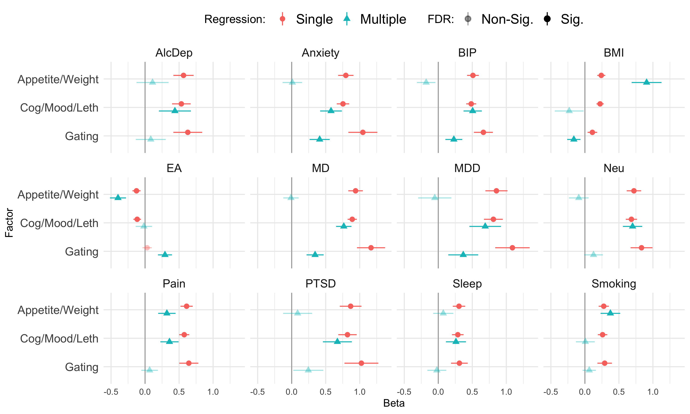

Test genetic relationship between [symptom factors](mdd-symptom-gsem-model.md) and a selection of other phenotypes that are genetically correlated with MDD, as well as to MDD itself. Phenotypes to examine:

- Major depressive disorder: Clinical cohorts from [Wray et al](https://www.nature.com/articles/s41588-018-0090-3%5C) and non-PGC cohorts from . Download from [PGC](https://www.med.unc.edu/pgc/download-results/) and obtain via [data access](https://www.med.unc.edu/pgc/shared-methods/how-to/).
- Major depression: Non-PGC cohorts from [Als et al](https://www.medrxiv.org/content/10.1101/2022.08.24.22279149v1). Download from [iPsych](https://ipsych.dk/en/research/downloads).
- bipolar disorder: [Mullins et al](https://pubmed.ncbi.nlm.nih.gov/34002096/). Download from [PGC](https://figshare.com/articles/dataset/PGC3_bipolar_disorder_GWAS_summary_statistics/14102594)
- anxiety: [meta-analysis](https://drive.google.com/drive/folders/1fguHvz7l2G45sbMI9h_veQun4aXNTy1v) of [UKBB, iPSYCH](https://www.nature.com/articles/s41380-019-0559-1), and [ANGST](https://pubmed.ncbi.nlm.nih.gov/26754954/), from [Grotzinger et al medRxiv](https://www.medrxiv.org/content/10.1101/2020.09.22.20196089v1.full)
- PTSD: [Nievergelt et al](https://pubmed.ncbi.nlm.nih.gov/31594949/). Download from [PGC](https://figshare.com/articles/dataset/ptsd2019/14672133)
- tobacco use. Cigarettes per day [Liu et al](https://www.nature.com/articles/s41588-018-0307-5). Download from [UofM](https://conservancy.umn.edu/handle/11299/201564)
- alcohol dependence. [Walters et al](https://www.nature.com/articles/s41593-018-0275-1). Download from [PGC](https://doi.org/10.6084/m9.figshare.14672187)
- educational attainment. [Okbay et. al](https://www.nature.com/articles/s41588-022-01016-z). Download from [SSGAC Data Portal](https://thessgac.com).
- BMI, sex combined [Pulit et al](https://academic.oup.com/hmg/article/28/1/166/5098227). Download from [GIANT/Broad](https://portals.broadinstitute.org/collaboration/giant/index.php/GIANT_consortium_data_files#2018_GIANT_and_UK_BioBank_Meta-analysis).
- neuroticism: [Nagel et al](https://www.nature.com/articles/s41588-018-0151-7). Download from [CNCR](https://ctg.cncr.nl/software/summary_statistics)
- pain: multisite chronic pain [Johnston et al](https://journals.plos.org/plosgenetics/article?id=10.1371/journal.pgen.1008164). Download from [UoG](https://researchdata.gla.ac.uk/822/)
- chronotype: long sleep duration. [Dashti et al](https://www.ncbi.nlm.nih.gov/pubmed/30846698). Download from [SDKP](https://sleep.hugeamp.org/downloads.html).

# Setup

## R packages

R version


```r
R.version
```

```
##                _                           
## platform       aarch64-apple-darwin20      
## arch           aarch64                     
## os             darwin20                    
## system         aarch64, darwin20           
## status                                     
## major          4                           
## minor          3.2                         
## year           2023                        
## month          10                          
## day            31                          
## svn rev        85441                       
## language       R                           
## version.string R version 4.3.2 (2023-10-31)
## nickname       Eye Holes
```

Package installation


```r
required_packages <- c('devtools', 'readr', 'tidyr', 'dplyr', 'ggplot2', 'stringr', 'corrplot')
for(pack in required_packages) if(!require(pack, character.only=TRUE)) install.packages(pack)

library(devtools)

if(!require(GenomicSEM)) install_github("MichelNivard/GenomicSEM")

if(!require(tidySEM)) install_github("cjvanlissa/tidySEM")
```

GenomicSEM version

```r
require(readr)
require(tidyr)
require(stringr)
require(dplyr)
require(ggplot2)
require(corrplot)
require(GenomicSEM)

packageVersion("GenomicSEM")
```

```
## [1] '0.0.5'
```

# Process external sumstats

## Reformat

Format the external sumstats for reading by GenomicSEM with columns `SNP`, `A1` (effect allele), `A2` (non-effect allele), `BETA`/`OR`, `P`, `INFO`, and `N`.


```r
# Major depression
md <- read_table('sumstats/daner_MDDwoBP_20201001_HRC_MDDwoBP_UKBtransformed_FinnGen_MVPaf_2_HRC_MAF01.gz')
md_sumstats <- mdd %>%
   transmute(SNP, A1, A2, BETA=log(OR), SE, FREQ=FRQ_U_667123, INFO, P, N=2*Neff_half)
write_tsv(md_sumstats, 'sumstats/MD.txt')

# Major depressive disorder
mdd <- read_tsv('sumstats/daner_MDD29.0515a_mds6.0316.gz')
mdd_sumstats <- mdd %>%
    transmute(SNP, A1, A2, BETA=log(OR), SE, FREQ=FRQ_U_25632, INFO, P,
              N=4*Nca*Nco/(Nca+Nco))
write_tsv(mdd_sumstats, 'sumstats/MDD.txt')

# Bipolar disorder
bip <- read_tsv('sumstats/pgc-bip2021-all.vcf.tsv.gz', comment='##')
bip_sumstats <- bip %>%
    filter(IMPINFO >= 0.6) %>%
    transmute(SNP=ID, A1, A2, BETA, SE, P=PVAL, INFO=IMPINFO, N=2*NEFFDIV2)
write_tsv(bip_sumstats, 'sumstats/BIP.txt')

# alcohol dependence
alcdep <- read_table('sumstats/pgc_alcdep.eur_discovery.aug2018_release.txt.gz')
alcdep_sumstats <- alcdep %>%
mutate(SNP=str_split_fixed(SNP, pattern=":", n=2)[,1]) %>%
select(SNP, A1, A2, BETA=Z, P, N=Weight)
write_tsv(alcdep_sumstats, 'sumstats/AlcDep.txt')

# body-mass index
bmi <- read_table('sumstats/Bmi.giant-ukbb.meta-analysis.combined.23May2018.HapMap2_only.txt.gz')
bmi_sumstats <- bmi %>%
    separate(SNP, into=c('SNP', 'A1', 'A2'), sep=':') %>%
    filter(INFO >= 0.6) %>%
    select(SNP, A1=Tested_Allele, A2=Other_Allele, BETA, SE, P, INFO, N)
write_tsv(bmi_sumstats, 'sumstats/BMI.txt')

# educational attainment
ea <- read_tsv('sumstats/EA4_additive_excl_23andMe.txt.gz')
ea_sumstats <-  ea %>%
    transmute(SNP=rsID, A1=Effect_allele, A2=Other_allele, FREQ=EAF_HRC, BETA=Beta, SE_unadj, P=P_unadj, N=765283)
write_tsv(ea_sumstats, 'sumstats/EA.txt')

# multisite chronic pain
pain <- read_tsv('sumstats/chronic_pain-bgen.stats.gz')
pain_sumstats <- pain %>%
    filter(INFO >= 0.6) %>%
    transmute(SNP, A1=ALLELE1, A2=ALLELE0, BETA, SE, P=P_BOLT_LMM_INF, INFO, N=387649) 
write_tsv(pain_sumstats, 'sumstats/Pain.txt')

# tabacco use
smoking <- read_table('sumstats/CigarettesPerDay.txt.gz')
smoking_sumstats <- smoking %>%
    select(SNP=RSID, A1=ALT, A2=REF, BETA, SE, P=PVALUE, N)
write_tsv(smoking_sumstats, 'sumstats/Smoking.txt')

# chronotype (long sleep duration)
sleep <- read_table('sumstats/longsumstats.txt.gz')
sleep_sumstats <- sleep %>%
    filter(INFO >= 0.6) %>%
    transmute(SNP, A1=ALLELE1, A2=ALLELE0, BETA=BETA_LONGSLEEP, SE=SE_LONGSLEEP, P=P_LONGSLEEP, INFO, N=4*34184*(305742-34184)/305742)
write_tsv(sleep_sumstats, 'sumstats/Sleep.txt')

# anxiety disorder
anxiety <- read_table('sumstats/META_UKBB_iPSYCH_ANGST_wNcol.sumstats.gz')
anxiety_sumstats <- anxiety %>%
    mutate(Nca=25453+12655+7016, Nco=58113+19225+14745) %>%
    transmute(SNP, A1=Allele1, A2=Allele2, BETA=Effect, SE=StdErr, P, N=4*Nca*Nco/(Nca+Nco))
write_tsv(anxiety_sumstats, 'sumstats/Anxiety.txt')    

# post-traumatic stress disorder
ptsd <- read_tsv('sumstats/pts_eur_freeze2_overall.results.gz')
ptsd_sumstats <- ptsd %>%
    transmute(SNP,  A1, A2, OR, SE, P, INFO, N=4*Nca*Nco/(Nca+Nco))
write_tsv(ptsd_sumstats, 'sumstats/PTSD.txt')
    
# neuroticism
neu <- read_tsv('sumstats/sumstats_neuroticism_ctg_format.txt.gz')
neu_sumstats <- neu %>%
    filter(!is.na(INFO_UKB)) %>%
    select(SNP=RSID, A1, A2, BETA=Z, P, INFO=INFO_UKB, N)
write_tsv(neu_sumstats, 'sumstats/Neu.txt')
```

## Munge


```r
ext_traits <- c('AlcDep'=0.159, 'Anxiety'=0.16, 'BIP'=0.01,
                'BMI'=NA, 'EA'=NA, 'MD'=0.3, 'MDD'=0.15, 'Neu'=NA,
                'PTSD'=0.3, 'Pain'=NA, 'Sleep'=0.11, 'Smoking'=NA)
ext_trait_names <- names(ext_traits)
```


```r
munge(file.path('sumstats', paste(ext_trait_names, 'txt', sep='.')),
trait.names=ext_trait_names,
hm3=here::here("sumstats/reference/w_hm3.snplist"),
info.filter = 0.9, maf.filter = 0.01)
```

# Symptom labels

MDD DSM symptoms are numbered 1-9:


```r
# plot labels

dsm_mdd_symptoms_labels <-
read_delim("
MDD1;Mood;Mood;Dep
MDD2;Interest;Interest;Anh
MDD3;Weight⇅;Weight⇆;App
MDD3a;Weight⇊;Weight⇇;AppDec
MDD3b;Weight⇈;Weight⇉;AppInc
MDD4;Sleep⇅;Sleep⇆;Sle
MDD4a;Sleep⇊;Sleep⇇;SleDec
MDD4b;Sleep⇈;Sleep⇉;SleInc
MDD5;Motor⇅;Motor⇆;Moto
MDD5a;Motor⇈;Motor⇉;MotoInc
MDD5b;Motor⇊;Motor⇇;MotoDec
MDD6;Fatigue;Fatigue;Fatig
MDD7;Guilt;Guilt;Guilt
MDD8;Concentrate;Concentrate;Conc
MDD9;Suicidality;Suicidality;Sui
", col_names=c('ref', 'h', 'v', 'abbv'), delim=';')
```

```
## Rows: 15 Columns: 4
## ── Column specification ─────────────────────────────────────────────────────────────────────────────────────────────────────────────────────
## Delimiter: ";"
## chr (4): ref, h, v, abbv
## 
## ℹ Use `spec()` to retrieve the full column specification for this data.
## ℹ Specify the column types or set `show_col_types = FALSE` to quiet this message.
```

```r
dsm_mdd_symptoms_reference <-
read_delim("
MDD1;Depressed mood most of the day, nearly every day
MDD2;Markedly diminished interest or pleasure in all, or almost all, activities most of the day, nearly every day
MDD3;Significant change in weight or appetite
MDD3a;Significant weight loss or decrease in appetite
MDD3b;Significant weight gain or increase in appetite
MDD4;Sleeping too much or not sleeping enough
MDD4a;Insomnia nearly every day
MDD4b;Hypersomnia nearly every day
MDD5;Changes in speed/amount of moving or speaking
MDD5a;Psychomotor agitation nearly every day
MDD5b;Psychomotor slowing nearly every day
MDD6;Fatigue or loss of energy nearly every day
MDD7;Feelings of worthlessness or excessive or inappropriate guilt
MDD8;Diminished ability to think or concentrate, or indecisiveness
MDD9;Recurrent thoughts of death or suicide or a suicide attempt or a Multiple plan for attempting suicide
", col_names=c('Reference', 'Description'), delim=';')
```

```
## Rows: 15 Columns: 2
## ── Column specification ─────────────────────────────────────────────────────────────────────────────────────────────────────────────────────
## Delimiter: ";"
## chr (2): Reference, Description
## 
## ℹ Use `spec()` to retrieve the full column specification for this data.
## ℹ Specify the column types or set `show_col_types = FALSE` to quiet this message.
```


# Symptom prevalences

Load previously calculated symptom prevalences:


```r
all_covstruct_prefix <- 'clin.comm.covstruct'
all_sumstats_prevs <- read_tsv(here::here('ldsc', paste(all_covstruct_prefix, 'prevs', 'txt', sep='.'))) 
```

```
## Rows: 26 Columns: 9
## ── Column specification ─────────────────────────────────────────────────────────────────────────────────────────────────────────────────────
## Delimiter: "\t"
## chr (5): cohorts, symptom, sumstats, filename, trait_name
## dbl (4): Nca, Nco, samp_prev, pop_prev
## 
## ℹ Use `spec()` to retrieve the full column specification for this data.
## ℹ Specify the column types or set `show_col_types = FALSE` to quiet this message.
```


# Multivariable LDSC estimation

Calculate LDSC covariance structure for syptoms used in the combined structural model and the external phenotypes.


```r
covstruct_prefix <- 'symptoms.external.covstruct'
covstruct_r <- here::here('ldsc', paste(covstruct_prefix, 'deparse.R', sep='.'))
covstruct_rds <- here::here('ldsc', paste(covstruct_prefix, 'rds', sep='.'))

if(!file.exists(covstruct_r)) {
    
  symptoms_sumstats_prevs <- all_sumstats_prevs %>%
  left_join(dsm_mdd_symptoms_labels, by=c('symptom'='ref')) %>%
  mutate(samp_prev=0.5,
         cohort=case_when(str_detect(filename, 'Clin') ~ 'Clin',
                          str_detect(filename, 'Comm') ~ 'Comm',
                          str_detect(filename, 'UKBt') ~ 'Ukb')) %>%
  transmute(filename=here::here(filename), samp_prev, pop_prev, trait_name=paste0(cohort, abbv))

  # external files, prevalences and trait names
  external_sumstats_prevs <-
    tibble(filename=paste(ext_trait_names, 'sumstats', 'gz', sep='.'),
           trait_name=ext_trait_names,
           pop_prev=ext_traits) %>%
    mutate(samp_prev=if_else(!is.na(pop_prev), true=0.5, false=NA_real_))
    
  sumstats_prevs <- bind_rows(symptoms_sumstats_prevs, external_sumstats_prevs)
    

  symptoms_covstruct <- ldsc(traits=sumstats_prevs$filename,
                             sample.prev=sumstats_prevs$samp_prev,
                             population.prev=sumstats_prevs$pop_prev,
                             ld=here::here('sumstats/reference/eur_w_ld_chr/'),
                             wld=here::here('sumstats/reference/eur_w_ld_chr/'),
                             trait.names=sumstats_prevs$trait_name)

  dput(symptoms_covstruct, covstruct_r, control=c('exact'))
  saveRDS(symptoms_covstruct, covstruct_rds)
  
  # check for exact match of deparsed object
  identical(dget(covstruct_r), symptoms_covstruct)

} else {

  symptoms_covstruct <- dget(covstruct_r)

}
```

# Models

## Symptom factors

Base model of symptom factors, with merged Cognitive/Vegeative and Appetite.


```r
model <- "
DEP =~ NA*CommDep + CommAnh + UkbDep + UkbAnh + ClinSleDec + CommSleDec + ClinMotoInc + ClinGuilt + CommGuilt + ClinSui + CommSui + ClinSleInc + CommSleInc + ClinMotoDec + CommFatig + CommConc
APP =~ NA*ClinAppInc + ClinAppDec + CommAppDec + app_co3b*CommAppInc
GATE =~ NA*CommDep + CommAnh + UkbDep + UkbAnh

DEP ~~ 1*DEP
APP ~~ 1*APP
GATE ~~ 1*GATE
GATE ~~ 0*DEP + 0*APP
"
fit <- usermodel(symptoms_covstruct, estimation='DWLS', model=model, CFIcalc=TRUE)
```

```
## [1] "Running primary model"
## [1] "Calculating CFI"
## [1] "Calculating Standardized Results"
## [1] "Calculating SRMR"
## elapsed 
##   1.729 
## [1] "The S matrix was smoothed prior to model estimation due to a non-positive definite matrix. The largest absolute difference in a cell between the smoothed and non-smoothed matrix was  0.0503268938714747 As a result of the smoothing, the largest Z-statistic change for the genetic covariances was  1.17257288534608 . We recommend setting the smooth_check argument to true if you are going to run a multivariate GWAS."
```

```
## Warning in usermodel(symptoms_covstruct, estimation = "DWLS", model = model, :
## A difference greater than .025 was observed pre- and post-smoothing in the
## genetic covariance matrix. This reflects a large difference and results should
## be interpreted with caution!! This can often result from including low powered
## traits, and you might consider removing those traits from the model. If you are
## going to run a multivariate GWAS we strongly recommend setting the smooth_check
## argument to true to check smoothing for each SNP.
```

```
## Warning in usermodel(symptoms_covstruct, estimation = "DWLS", model = model, :
## A difference greater than .025 was observed pre- and post-smoothing for
## Z-statistics in the genetic covariance matrix. This reflects a large difference
## and results should be interpreted with caution!! This can often result from
## including low powered traits, and you might consider removing those traits from
## the model. If you are going to run a multivariate GWAS we strongly recommend
## setting the smooth_check argument to true to check smoothing for each SNP.
```

## Sample factors

Base model of Clinical and Community sample factors. 


```r
model <- "
CLIN =~ NA*ClinAppDec + ClinAppInc + ClinSleDec + ClinSleInc + ClinMotoInc + ClinMotoDec + ClinGuilt + ClinSui
COMM =~ NA*CommDep + CommAnh + UkbDep + UkbAnh + CommAppDec + CommAppInc + CommSleDec + CommSleInc + CommFatig + CommGuilt + CommConc + CommSui
GATE =~ NA*CommDep + CommAnh + UkbDep + UkbAnh

CLIN ~~ 1*CLIN
GATE ~~ 1*GATE
COMM ~~ 1*COMM
GATE ~~ 0*COMM + 0*CLIN
"
fit <- usermodel(symptoms_covstruct, estimation='DWLS', model=model, CFIcalc=TRUE)
```

```
## [1] "Running primary model"
## [1] "Calculating CFI"
## [1] "Calculating Standardized Results"
## [1] "Calculating SRMR"
## elapsed 
##    1.35 
## [1] "The S matrix was smoothed prior to model estimation due to a non-positive definite matrix. The largest absolute difference in a cell between the smoothed and non-smoothed matrix was  0.0503268938714747 As a result of the smoothing, the largest Z-statistic change for the genetic covariances was  1.17257288534608 . We recommend setting the smooth_check argument to true if you are going to run a multivariate GWAS."
```

```
## Warning in usermodel(symptoms_covstruct, estimation = "DWLS", model = model, :
## A difference greater than .025 was observed pre- and post-smoothing in the
## genetic covariance matrix. This reflects a large difference and results should
## be interpreted with caution!! This can often result from including low powered
## traits, and you might consider removing those traits from the model. If you are
## going to run a multivariate GWAS we strongly recommend setting the smooth_check
## argument to true to check smoothing for each SNP.
```

```
## Warning in usermodel(symptoms_covstruct, estimation = "DWLS", model = model, :
## A difference greater than .025 was observed pre- and post-smoothing for
## Z-statistics in the genetic covariance matrix. This reflects a large difference
## and results should be interpreted with caution!! This can often result from
## including low powered traits, and you might consider removing those traits from
## the model. If you are going to run a multivariate GWAS we strongly recommend
## setting the smooth_check argument to true to check smoothing for each SNP.
```

## External phenotypes

### Symptom factors

Compare symptom factors against each external phenotype. Single regression of each external phenotype on each symptom or symptom cluster.


```r
ext_symp.glue <- "
DEP =~ NA*CommDep + CommAnh + UkbDep + UkbAnh + ClinSleDec + CommSleDec + ClinMotoInc + ClinGuilt + CommGuilt + ClinSui + CommSui + ClinSleInc + CommSleInc + ClinMotoDec + CommFatig + CommConc
APP =~ NA*ClinAppInc + ClinAppDec + CommAppDec + app_co3b*CommAppInc
GATE =~ NA*CommDep + CommAnh + UkbDep + UkbAnh

DEP ~~ 1*DEP
APP ~~ 1*APP
GATE ~~ 1*GATE
GATE ~~ 0*DEP + 0*APP

AlcDep ~ {symptom}
Anxiety ~  {symptom}
BIP ~ {symptom}
BMI ~ {symptom}
EA ~ {symptom}
MD ~ {symptom}
MDD ~ {symptom}
Neu ~ {symptom}
PTSD ~ {symptom}
Pain ~ {symptom}
Sleep ~ {symptom}
Smoking ~ {symptom}
"

ext_symp.model_list <- lapply(c('DEP', 'APP', 'GATE'), function(symptom) str_glue_data(list(symptom=symptom), ext_symp.glue))

ext_symp.fit_list <- lapply(ext_symp.model_list, function(model) usermodel(symptoms_covstruct, estimation='DWLS', model=model))
```

```
## [1] "Running primary model"
## [1] "Calculating CFI"
## [1] "Calculating Standardized Results"
## [1] "Calculating SRMR"
## elapsed 
##   27.94 
## [1] "The S matrix was smoothed prior to model estimation due to a non-positive definite matrix. The largest absolute difference in a cell between the smoothed and non-smoothed matrix was  0.0576161416152574 As a result of the smoothing, the largest Z-statistic change for the genetic covariances was  1.46841854745071 . We recommend setting the smooth_check argument to true if you are going to run a multivariate GWAS."
```

```
## Warning in usermodel(symptoms_covstruct, estimation = "DWLS", model = model): A
## difference greater than .025 was observed pre- and post-smoothing in the
## genetic covariance matrix. This reflects a large difference and results should
## be interpreted with caution!! This can often result from including low powered
## traits, and you might consider removing those traits from the model. If you are
## going to run a multivariate GWAS we strongly recommend setting the smooth_check
## argument to true to check smoothing for each SNP.
```

```
## Warning in usermodel(symptoms_covstruct, estimation = "DWLS", model = model): A
## difference greater than .025 was observed pre- and post-smoothing for
## Z-statistics in the genetic covariance matrix. This reflects a large difference
## and results should be interpreted with caution!! This can often result from
## including low powered traits, and you might consider removing those traits from
## the model. If you are going to run a multivariate GWAS we strongly recommend
## setting the smooth_check argument to true to check smoothing for each SNP.
```

```
## [1] "Running primary model"
## [1] "Calculating CFI"
## [1] "Calculating Standardized Results"
## [1] "Calculating SRMR"
## elapsed 
##  24.827 
## [1] "The S matrix was smoothed prior to model estimation due to a non-positive definite matrix. The largest absolute difference in a cell between the smoothed and non-smoothed matrix was  0.0576161416152574 As a result of the smoothing, the largest Z-statistic change for the genetic covariances was  1.46841854745071 . We recommend setting the smooth_check argument to true if you are going to run a multivariate GWAS."
```

```
## Warning in usermodel(symptoms_covstruct, estimation = "DWLS", model = model): A
## difference greater than .025 was observed pre- and post-smoothing in the
## genetic covariance matrix. This reflects a large difference and results should
## be interpreted with caution!! This can often result from including low powered
## traits, and you might consider removing those traits from the model. If you are
## going to run a multivariate GWAS we strongly recommend setting the smooth_check
## argument to true to check smoothing for each SNP.

## Warning in usermodel(symptoms_covstruct, estimation = "DWLS", model = model): A
## difference greater than .025 was observed pre- and post-smoothing for
## Z-statistics in the genetic covariance matrix. This reflects a large difference
## and results should be interpreted with caution!! This can often result from
## including low powered traits, and you might consider removing those traits from
## the model. If you are going to run a multivariate GWAS we strongly recommend
## setting the smooth_check argument to true to check smoothing for each SNP.
```

```
## [1] "Running primary model"
## [1] "Calculating CFI"
## [1] "Calculating Standardized Results"
## [1] "Calculating SRMR"
## elapsed 
##  28.141 
## [1] "The S matrix was smoothed prior to model estimation due to a non-positive definite matrix. The largest absolute difference in a cell between the smoothed and non-smoothed matrix was  0.0576161416152574 As a result of the smoothing, the largest Z-statistic change for the genetic covariances was  1.46841854745071 . We recommend setting the smooth_check argument to true if you are going to run a multivariate GWAS."
```

```
## Warning in usermodel(symptoms_covstruct, estimation = "DWLS", model = model): A
## difference greater than .025 was observed pre- and post-smoothing in the
## genetic covariance matrix. This reflects a large difference and results should
## be interpreted with caution!! This can often result from including low powered
## traits, and you might consider removing those traits from the model. If you are
## going to run a multivariate GWAS we strongly recommend setting the smooth_check
## argument to true to check smoothing for each SNP.

## Warning in usermodel(symptoms_covstruct, estimation = "DWLS", model = model): A
## difference greater than .025 was observed pre- and post-smoothing for
## Z-statistics in the genetic covariance matrix. This reflects a large difference
## and results should be interpreted with caution!! This can often result from
## including low powered traits, and you might consider removing those traits from
## the model. If you are going to run a multivariate GWAS we strongly recommend
## setting the smooth_check argument to true to check smoothing for each SNP.
```

### Sample factors


```r
ext_samp.glue <- "
CLIN =~ NA*ClinGuilt + ClinSui + ClinAppDec + ClinAppInc + ClinSleDec + ClinSleInc + ClinMotoInc + ClinMotoDec
COMM =~ NA*CommDep + CommAnh + UkbDep + UkbAnh + CommAppDec + CommAppInc + CommSleDec + CommSleInc + CommFatig + CommGuilt + CommConc + CommSui
GATE =~ NA*CommDep + CommAnh + UkbDep + UkbAnh

CLIN ~~ 1*CLIN
GATE ~~ 1*GATE
COMM ~~ 1*COMM
GATE ~~ 0*COMM + 0*CLIN

cc < 0.99
CLIN ~~ cc*COMM

AlcDep ~ {symptom}
Anxiety ~  {symptom}
BIP ~ {symptom}
BMI ~ {symptom}
EA ~ {symptom}
MD ~ {symptom}
MDD ~ {symptom}
Neu ~ {symptom}
PTSD ~ {symptom}
Pain ~ {symptom}
Sleep ~ {symptom}
Smoking ~ {symptom}
"

ext_samp.model_list <- lapply(c('CLIN', 'COMM'), function(symptom) str_glue_data(list(symptom=symptom), ext_samp.glue))

ext_samp.fit_list <- lapply(ext_samp.model_list, function(model) usermodel(symptoms_covstruct, estimation='DWLS', model=model))
```

```
## [1] "Running primary model"
## [1] "Calculating CFI"
## [1] "Calculating Standardized Results"
## [1] "Calculating SRMR"
## elapsed 
##  76.206 
## [1] "The S matrix was smoothed prior to model estimation due to a non-positive definite matrix. The largest absolute difference in a cell between the smoothed and non-smoothed matrix was  0.0576161416152574 As a result of the smoothing, the largest Z-statistic change for the genetic covariances was  1.46841854745071 . We recommend setting the smooth_check argument to true if you are going to run a multivariate GWAS."
```

```
## Warning in usermodel(symptoms_covstruct, estimation = "DWLS", model = model): A
## difference greater than .025 was observed pre- and post-smoothing in the
## genetic covariance matrix. This reflects a large difference and results should
## be interpreted with caution!! This can often result from including low powered
## traits, and you might consider removing those traits from the model. If you are
## going to run a multivariate GWAS we strongly recommend setting the smooth_check
## argument to true to check smoothing for each SNP.
```

```
## Warning in usermodel(symptoms_covstruct, estimation = "DWLS", model = model): A
## difference greater than .025 was observed pre- and post-smoothing for
## Z-statistics in the genetic covariance matrix. This reflects a large difference
## and results should be interpreted with caution!! This can often result from
## including low powered traits, and you might consider removing those traits from
## the model. If you are going to run a multivariate GWAS we strongly recommend
## setting the smooth_check argument to true to check smoothing for each SNP.
```

```
## [1] "Running primary model"
## [1] "Calculating CFI"
## [1] "Calculating Standardized Results"
## [1] "Calculating SRMR"
## elapsed 
##  66.513 
## [1] "The S matrix was smoothed prior to model estimation due to a non-positive definite matrix. The largest absolute difference in a cell between the smoothed and non-smoothed matrix was  0.0576161416152574 As a result of the smoothing, the largest Z-statistic change for the genetic covariances was  1.46841854745071 . We recommend setting the smooth_check argument to true if you are going to run a multivariate GWAS."
```

```
## Warning in usermodel(symptoms_covstruct, estimation = "DWLS", model = model): A
## difference greater than .025 was observed pre- and post-smoothing in the
## genetic covariance matrix. This reflects a large difference and results should
## be interpreted with caution!! This can often result from including low powered
## traits, and you might consider removing those traits from the model. If you are
## going to run a multivariate GWAS we strongly recommend setting the smooth_check
## argument to true to check smoothing for each SNP.

## Warning in usermodel(symptoms_covstruct, estimation = "DWLS", model = model): A
## difference greater than .025 was observed pre- and post-smoothing for
## Z-statistics in the genetic covariance matrix. This reflects a large difference
## and results should be interpreted with caution!! This can often result from
## including low powered traits, and you might consider removing those traits from
## the model. If you are going to run a multivariate GWAS we strongly recommend
## setting the smooth_check argument to true to check smoothing for each SNP.
```


```r
ext_single <-
bind_rows(lapply(c(ext_symp.fit_list, ext_samp.fit_list), function(fit) mutate(fit$results, p_value=as.character(p_value)))) %>%
select(lhs, op, rhs, STD_Genotype, STD_Genotype_SE, p_value) %>%
filter(lhs %in% ext_trait_names, rhs %in% c('DEP', 'APP', 'GATE', 'CLIN', 'COMM')) %>%
mutate(Beta='Single', Factor=rhs, Phenotype=lhs, p_value=as.numeric(p_value))
```

### Symptom factors

Multiple regression of each phenotype on symptom factors, to estimate relationship after condition on each of the other factors. 


```r
ext_mult_symp.model <- "
DEP =~ NA*CommDep + CommAnh + UkbDep + UkbAnh + ClinSleDec + CommSleDec + ClinMotoInc + ClinGuilt + CommGuilt + ClinSui + CommSui + ClinSleInc + CommSleInc + ClinMotoDec + CommFatig + CommConc
APP =~ NA*ClinAppInc + ClinAppDec + CommAppDec + CommAppInc
GATE =~ NA*CommDep + CommAnh + UkbDep + UkbAnh

DEP ~~ 1*DEP
APP ~~ 1*APP
GATE ~~ 1*GATE
GATE ~~ 0*DEP + 0*APP

AlcDep ~ DEP + APP + GATE
Anxiety ~  DEP + APP + GATE
BIP ~ DEP + APP + GATE
BMI ~ DEP + APP + GATE
EA ~ DEP + APP + GATE
MD ~ DEP + APP + GATE
MDD ~ DEP + APP + GATE
Neu ~ DEP + APP + GATE
PTSD ~ DEP + APP + GATE
Pain ~ DEP + APP + GATE
Sleep ~ DEP + APP + GATE
Smoking ~ DEP + APP + GATE
"
ext_mult_symp.fit <- usermodel(symptoms_covstruct, estimation='DWLS', model=ext_mult_symp.model)
```

```
## [1] "Running primary model"
## [1] "Calculating CFI"
## [1] "Calculating Standardized Results"
## [1] "Calculating SRMR"
## elapsed 
##  29.734 
## [1] "The S matrix was smoothed prior to model estimation due to a non-positive definite matrix. The largest absolute difference in a cell between the smoothed and non-smoothed matrix was  0.0576161416152573 As a result of the smoothing, the largest Z-statistic change for the genetic covariances was  1.46841854745072 . We recommend setting the smooth_check argument to true if you are going to run a multivariate GWAS."
```

```
## Warning in usermodel(symptoms_covstruct, estimation = "DWLS", model =
## ext_mult_symp.model): A difference greater than .025 was observed pre- and
## post-smoothing in the genetic covariance matrix. This reflects a large
## difference and results should be interpreted with caution!! This can often
## result from including low powered traits, and you might consider removing those
## traits from the model. If you are going to run a multivariate GWAS we strongly
## recommend setting the smooth_check argument to true to check smoothing for each
## SNP.
```

```
## Warning in usermodel(symptoms_covstruct, estimation = "DWLS", model =
## ext_mult_symp.model): A difference greater than .025 was observed pre- and
## post-smoothing for Z-statistics in the genetic covariance matrix. This reflects
## a large difference and results should be interpreted with caution!! This can
## often result from including low powered traits, and you might consider removing
## those traits from the model. If you are going to run a multivariate GWAS we
## strongly recommend setting the smooth_check argument to true to check smoothing
## for each SNP.
```

### Sample factors


```r
ext_samp_mult.model <- "
CLIN =~ NA*ClinGuilt + ClinSui + ClinAppDec + ClinAppInc + ClinSleDec + ClinSleInc + ClinMotoInc + ClinMotoDec
COMM =~ NA*CommDep + CommAnh + UkbDep + UkbAnh + CommAppDec + CommAppInc + CommSleDec + CommSleInc + CommFatig + CommGuilt + CommConc + CommSui
GATE =~ NA*CommDep + CommAnh + UkbDep + UkbAnh

CLIN ~~ 1*CLIN
GATE ~~ 1*GATE
COMM ~~ 1*COMM
GATE ~~ 0*COMM + 0*CLIN

AlcDep ~ CLIN + COMM 
Anxiety ~  CLIN + COMM
BIP ~ CLIN + COMM 
BMI ~ CLIN + COMM 
EA ~ CLIN + COMM 
MD ~ CLIN + COMM
MDD ~ CLIN + COMM
Neu ~ CLIN + COMM
PTSD ~ CLIN + COMM
Pain ~ CLIN + COMM
Sleep ~ CLIN + COMM
Smoking ~ CLIN + COMM
"
ext_samp_mult.fit <- usermodel(symptoms_covstruct, estimation='DWLS', model=ext_samp_mult.model)
```

```
## [1] "Running primary model"
## [1] "Calculating CFI"
## [1] "Calculating Standardized Results"
## [1] "Calculating SRMR"
## elapsed 
##  32.233 
## [1] "The S matrix was smoothed prior to model estimation due to a non-positive definite matrix. The largest absolute difference in a cell between the smoothed and non-smoothed matrix was  0.0576161416152574 As a result of the smoothing, the largest Z-statistic change for the genetic covariances was  1.46841854745071 . We recommend setting the smooth_check argument to true if you are going to run a multivariate GWAS."
```

```
## Warning in usermodel(symptoms_covstruct, estimation = "DWLS", model =
## ext_samp_mult.model): A difference greater than .025 was observed pre- and
## post-smoothing in the genetic covariance matrix. This reflects a large
## difference and results should be interpreted with caution!! This can often
## result from including low powered traits, and you might consider removing those
## traits from the model. If you are going to run a multivariate GWAS we strongly
## recommend setting the smooth_check argument to true to check smoothing for each
## SNP.
```

```
## Warning in usermodel(symptoms_covstruct, estimation = "DWLS", model =
## ext_samp_mult.model): A difference greater than .025 was observed pre- and
## post-smoothing for Z-statistics in the genetic covariance matrix. This reflects
## a large difference and results should be interpreted with caution!! This can
## often result from including low powered traits, and you might consider removing
## those traits from the model. If you are going to run a multivariate GWAS we
## strongly recommend setting the smooth_check argument to true to check smoothing
## for each SNP.
```


```r
ext_multiple <-
bind_rows(lapply(list(ext_mult_symp.fit, ext_samp_mult.fit),
                 function(fit) fit$results)) %>%
  select(lhs, op, rhs, STD_Genotype, STD_Genotype_SE, p_value) %>%
  filter(lhs %in% ext_trait_names, rhs %in% c('DEP', 'APP', 'GATE', 'CLIN', 'COMM')) %>%
  mutate(Beta='Multiple', Factor=rhs, Phenotype=lhs)
```

Focus on symptoms models

```r
ext_fdr <- bind_rows(ext_single, ext_multiple) |>
  mutate(fdr=p.adjust(p_value, 'BY')) |>
  filter(Factor %in% c('GATE', 'DEP', 'APP'))

ext_table <- ext_fdr |>
transmute(Phenotype,
          Factor=factor(Factor,
	    			levels=c('GATE', 'DEP', 'APP', 'CLIN', 'COMM'),
						labels=c("Gating", "Cog/Mood/Leth", "Appetite/Weight", "Clinical", "Community")),
		  Model=Beta, STD_Genotype, STD_Genotype_SE, p_value, fdr) |>
arrange(Phenotype, desc(Factor), Model)

ext_table
```

<div class="kable-table">

|Phenotype |Factor          |Model    | STD_Genotype|STD_Genotype_SE    |   p_value|       fdr|
|:---------|:---------------|:--------|------------:|:------------------|---------:|---------:|
|AlcDep    |Appetite/Weight |Multiple |    0.1096859|0.120188694795222  | 0.3614351| 1.0000000|
|AlcDep    |Appetite/Weight |Single   |    0.5652479|0.075903641945665  | 0.0000000| 0.0000000|
|AlcDep    |Cog/Mood/Leth   |Multiple |    0.4385401|0.120028331427671  | 0.0002585| 0.0021352|
|AlcDep    |Cog/Mood/Leth   |Single   |    0.5334481|0.0697136062054994 | 0.0000000| 0.0000000|
|AlcDep    |Gating          |Multiple |    0.0836763|0.112380289634555  | 0.4565237| 1.0000000|
|AlcDep    |Gating          |Single   |    0.6279489|0.108105533328542  | 0.0000000| 0.0000001|
|Anxiety   |Appetite/Weight |Multiple |    0.0097178|0.0732045684172342 | 0.8943640| 1.0000000|
|Anxiety   |Appetite/Weight |Single   |    0.7959054|0.0574613137032865 | 0.0000000| 0.0000000|
|Anxiety   |Cog/Mood/Leth   |Multiple |    0.5782698|0.0816597680577615 | 0.0000000| 0.0000000|
|Anxiety   |Cog/Mood/Leth   |Single   |    0.7541020|0.0467032496502194 | 0.0000000| 0.0000000|
|Anxiety   |Gating          |Multiple |    0.4113565|0.0753474048535236 | 0.0000000| 0.0000005|
|Anxiety   |Gating          |Single   |    1.0462852|0.108738985221118  | 0.0000000| 0.0000000|
|BIP       |Appetite/Weight |Multiple |   -0.1784320|0.0694552109586214 | 0.0101989| 0.0764042|
|BIP       |Appetite/Weight |Single   |    0.5093337|0.0440438620781618 | 0.0000000| 0.0000000|
|BIP       |Cog/Mood/Leth   |Multiple |    0.5052079|0.0686307668760079 | 0.0000000| 0.0000000|
|BIP       |Cog/Mood/Leth   |Single   |    0.4838158|0.0375477179197763 | 0.0000000| 0.0000000|
|BIP       |Gating          |Multiple |    0.2285188|0.0634680062485222 | 0.0003176| 0.0025898|
|BIP       |Gating          |Single   |    0.6629559|0.0711418794992003 | 0.0000000| 0.0000000|
|BMI       |Appetite/Weight |Multiple |    0.9070369|0.112105894106029  | 0.0000000| 0.0000000|
|BMI       |Appetite/Weight |Single   |    0.2408110|0.0301763486246527 | 0.0000000| 0.0000000|
|BMI       |Cog/Mood/Leth   |Multiple |   -0.2305507|0.108273605013646  | 0.0332302| 0.2432844|
|BMI       |Cog/Mood/Leth   |Single   |    0.2231958|0.027216658834216  | 0.0000000| 0.0000000|
|BMI       |Gating          |Multiple |   -0.1626126|0.0498740531075817 | 0.0011123| 0.0086339|
|BMI       |Gating          |Single   |    0.1099097|0.0360284399614011 | 0.0022837| 0.0173094|
|EA        |Appetite/Weight |Multiple |   -0.3979638|0.0601516728402306 | 0.0000000| 0.0000000|
|EA        |Appetite/Weight |Single   |   -0.1261768|0.0305502505774698 | 0.0000363| 0.0003290|
|EA        |Cog/Mood/Leth   |Multiple |   -0.0175035|0.0611455771232012 | 0.7745987| 1.0000000|
|EA        |Cog/Mood/Leth   |Single   |   -0.1157552|0.0284744747904233 | 0.0000480| 0.0004178|
|EA        |Gating          |Multiple |    0.2925221|0.0525742865295086 | 0.0000000| 0.0000003|
|EA        |Gating          |Single   |    0.0301122|0.0349152221396346 | 0.3884487| 1.0000000|
|MD        |Appetite/Weight |Multiple |   -0.0105493|0.0576910716374024 | 0.8549666| 1.0000000|
|MD        |Appetite/Weight |Single   |    0.9392811|0.0547299322786408 | 0.0000000| 0.0000000|
|MD        |Cog/Mood/Leth   |Multiple |    0.7660022|0.0578234104221499 | 0.0000000| 0.0000000|
|MD        |Cog/Mood/Leth   |Single   |    0.8902598|0.0347314646592678 | 0.0000000| 0.0000000|
|MD        |Gating          |Multiple |    0.3440181|0.0640870406501528 | 0.0000001| 0.0000008|
|MD        |Gating          |Single   |    1.1664855|0.105562729815299  | 0.0000000| 0.0000000|
|MDD       |Appetite/Weight |Multiple |   -0.0519641|0.124626886240015  | 0.6767345| 1.0000000|
|MDD       |Appetite/Weight |Single   |    0.8548052|0.0828666825706371 | 0.0000000| 0.0000000|
|MDD       |Cog/Mood/Leth   |Multiple |    0.6896049|0.11860116622217   | 0.0000000| 0.0000001|
|MDD       |Cog/Mood/Leth   |Single   |    0.8099844|0.070742129966017  | 0.0000000| 0.0000000|
|MDD       |Gating          |Multiple |    0.3667491|0.112334183626618  | 0.0010953| 0.0086060|
|MDD       |Gating          |Single   |    1.0897140|0.129227721797031  | 0.0000000| 0.0000000|
|Neu       |Appetite/Weight |Multiple |   -0.0904588|0.0735871166649329 | 0.2189820| 1.0000000|
|Neu       |Appetite/Weight |Single   |    0.7207396|0.0542476095995377 | 0.0000000| 0.0000000|
|Neu       |Cog/Mood/Leth   |Multiple |    0.7007153|0.072479757422604  | 0.0000000| 0.0000000|
|Neu       |Cog/Mood/Leth   |Single   |    0.6835373|0.0422441574366223 | 0.0000000| 0.0000000|
|Neu       |Gating          |Multiple |    0.1265226|0.0704160198769036 | 0.0723697| 0.5067960|
|Neu       |Gating          |Single   |    0.8323191|0.0821243821043781 | 0.0000000| 0.0000000|
|PTSD      |Appetite/Weight |Multiple |    0.0869004|0.108833943514199  | 0.4245837| 1.0000000|
|PTSD      |Appetite/Weight |Single   |    0.8667664|0.0814609323857996 | 0.0000000| 0.0000000|
|PTSD      |Cog/Mood/Leth   |Multiple |    0.6717708|0.108654765788171  | 0.0000000| 0.0000000|
|PTSD      |Cog/Mood/Leth   |Single   |    0.8202554|0.0689374769876117 | 0.0000000| 0.0000000|
|PTSD      |Gating          |Multiple |    0.2442573|0.112899792614527  | 0.0305033| 0.2258868|
|PTSD      |Gating          |Single   |    1.0247135|0.126944340784626  | 0.0000000| 0.0000000|
|Pain      |Appetite/Weight |Multiple |    0.3204153|0.065318950625268  | 0.0000009| 0.0000086|
|Pain      |Appetite/Weight |Single   |    0.6104359|0.0460975785624394 | 0.0000000| 0.0000000|
|Pain      |Cog/Mood/Leth   |Multiple |    0.3588201|0.0683367008328796 | 0.0000002| 0.0000015|
|Pain      |Cog/Mood/Leth   |Single   |    0.5756360|0.037703284625588  | 0.0000000| 0.0000000|
|Pain      |Gating          |Multiple |    0.0668457|0.0624362631779806 | 0.2843426| 1.0000000|
|Pain      |Gating          |Single   |    0.6429665|0.0716527853756348 | 0.0000000| 0.0000000|
|Sleep     |Appetite/Weight |Multiple |    0.0730203|0.0757898836329139 | 0.3353088| 1.0000000|
|Sleep     |Appetite/Weight |Single   |    0.3042489|0.0466210669741548 | 0.0000000| 0.0000000|
|Sleep     |Cog/Mood/Leth   |Multiple |    0.2594016|0.075195387380373  | 0.0005611| 0.0045186|
|Sleep     |Cog/Mood/Leth   |Single   |    0.2869461|0.0435752155004726 | 0.0000000| 0.0000000|
|Sleep     |Gating          |Multiple |   -0.0213268|0.0708735548164563 | 0.7634711| 1.0000000|
|Sleep     |Gating          |Single   |    0.3101626|0.0626698026037064 | 0.0000007| 0.0000070|
|Smoking   |Appetite/Weight |Multiple |    0.3745528|0.0736397312779802 | 0.0000004| 0.0000035|
|Smoking   |Appetite/Weight |Single   |    0.2767710|0.0382221256804699 | 0.0000000| 0.0000000|
|Smoking   |Cog/Mood/Leth   |Multiple |    0.0067245|0.0708370731463606 | 0.9243087| 1.0000000|
|Smoking   |Cog/Mood/Leth   |Single   |    0.2598808|0.035612615201055  | 0.0000000| 0.0000000|
|Smoking   |Gating          |Multiple |    0.0636624|0.0498122507659045 | 0.2012327| 1.0000000|
|Smoking   |Gating          |Single   |    0.2906463|0.054422662044535  | 0.0000001| 0.0000009|

</div>

```r
write_tsv(ext_table, "mdd-symptom-gsem-ext_files/ext_coefficients.txt")
```


```r
ggplot(ext_fdr,
       aes(x=factor(Factor,
	   			 levels=c('GATE','DEP', 'APP'),
					 labels=c("Gating", "Cog/Mood/Leth", "Appetite/Weight")),
           y=STD_Genotype,
           color=factor(Beta, levels=c('Single', 'Multiple')),
           shape=factor(Beta, levels=c('Single', 'Multiple')),
           alpha = if_else(fdr <= 0.05, true = 'Sig.', false = 'Non-Sig.'),
           ymin=qnorm(0.025, mean=STD_Genotype, sd=as.numeric(STD_Genotype_SE)),
           ymax=qnorm(0.975, mean=STD_Genotype, sd=as.numeric(STD_Genotype_SE)))) +
geom_hline(yintercept=0, col='darkgray') +
geom_pointrange(position=position_dodge(width=-0.5)) +
facet_wrap(~Phenotype) +
scale_x_discrete('Factor') +
scale_y_continuous('Beta', breaks = seq(-1.5, 1.5, 0.5)) +
scale_color_discrete('Regression: ') +
scale_alpha_discrete('FDR:', range = c(0.4, 1)) +
coord_flip() + #ylim=c(-1.5, 1.5)) +
theme_minimal() +
theme(axis.text.y=element_text(size=12),
      strip.text=element_text(size=12),
      legend.title=element_text(size=12),
      legend.text=element_text(size=14),
      legend.position='top') +
labs(color  = "Regression: ", shape = "Regression: ")
```

```
## Warning: Using alpha for a discrete variable is not advised.
```

```
## Warning: `position_dodge()` requires non-overlapping x intervals.
## `position_dodge()` requires non-overlapping x intervals.
## `position_dodge()` requires non-overlapping x intervals.
## `position_dodge()` requires non-overlapping x intervals.
## `position_dodge()` requires non-overlapping x intervals.
## `position_dodge()` requires non-overlapping x intervals.
## `position_dodge()` requires non-overlapping x intervals.
## `position_dodge()` requires non-overlapping x intervals.
## `position_dodge()` requires non-overlapping x intervals.
## `position_dodge()` requires non-overlapping x intervals.
## `position_dodge()` requires non-overlapping x intervals.
## `position_dodge()` requires non-overlapping x intervals.
```

<!-- -->

```r
ggsave("mdd-symptom-gsem-ext_files/ex_beta.pdf", width = 8, height = 4, units = "in")
```

```
## Warning: `position_dodge()` requires non-overlapping x intervals.
## `position_dodge()` requires non-overlapping x intervals.
## `position_dodge()` requires non-overlapping x intervals.
## `position_dodge()` requires non-overlapping x intervals.
## `position_dodge()` requires non-overlapping x intervals.
## `position_dodge()` requires non-overlapping x intervals.
## `position_dodge()` requires non-overlapping x intervals.
## `position_dodge()` requires non-overlapping x intervals.
## `position_dodge()` requires non-overlapping x intervals.
## `position_dodge()` requires non-overlapping x intervals.
## `position_dodge()` requires non-overlapping x intervals.
## `position_dodge()` requires non-overlapping x intervals.
```

```r
ggsave("mdd-symptom-gsem-ext_files/ex_beta.png", width = 8, height = 4, units = "in", dpi = 300)
```

```
## Warning: `position_dodge()` requires non-overlapping x intervals.
## `position_dodge()` requires non-overlapping x intervals.
## `position_dodge()` requires non-overlapping x intervals.
## `position_dodge()` requires non-overlapping x intervals.
## `position_dodge()` requires non-overlapping x intervals.
## `position_dodge()` requires non-overlapping x intervals.
## `position_dodge()` requires non-overlapping x intervals.
## `position_dodge()` requires non-overlapping x intervals.
## `position_dodge()` requires non-overlapping x intervals.
## `position_dodge()` requires non-overlapping x intervals.
## `position_dodge()` requires non-overlapping x intervals.
## `position_dodge()` requires non-overlapping x intervals.
```

Consistancy of effect direction in single regression


```r
ext_table |>
filter(Model == 'Single') |>
group_by(Phenotype) |>
filter(any(sign(STD_Genotype) == 1) & any(sign(STD_Genotype) == -1))
```

<div class="kable-table">

|Phenotype |Factor          |Model  | STD_Genotype|STD_Genotype_SE    |   p_value|       fdr|
|:---------|:---------------|:------|------------:|:------------------|---------:|---------:|
|EA        |Appetite/Weight |Single |   -0.1261768|0.0305502505774698 | 0.0000363| 0.0003290|
|EA        |Cog/Mood/Leth   |Single |   -0.1157552|0.0284744747904233 | 0.0000480| 0.0004178|
|EA        |Gating          |Single |    0.0301122|0.0349152221396346 | 0.3884487| 1.0000000|

</div>

Specific relationship

```r
specific_sample <-
ext_table |>
filter(Factor %in% c('Clinical', 'Community'), Model == 'Multiple') |>
group_by(Phenotype) |>
filter(any(fdr <= 0.05), any(fdr > 0.05))  |>
filter(fdr <= 0.05)
specific_sample
```

<div class="kable-table">

|Phenotype |Factor |Model | STD_Genotype|STD_Genotype_SE | p_value| fdr|
|:---------|:------|:-----|------------:|:---------------|-------:|---:|

</div>


```r
ext_table |>
filter(Factor %in% c('Appetite/Weight', 'Cog/Mood/Leth', 'Gating'), Model == 'Multiple') |>
group_by(Phenotype) |>
filter(any(fdr <= 0.05), any(fdr > 0.05)) |>
ungroup() |>
filter(fdr <= 0.05) |>
arrange(Factor)
```

<div class="kable-table">

|Phenotype |Factor          |Model    | STD_Genotype|STD_Genotype_SE    |   p_value|       fdr|
|:---------|:---------------|:--------|------------:|:------------------|---------:|---------:|
|Anxiety   |Gating          |Multiple |    0.4113565|0.0753474048535236 | 0.0000000| 0.0000005|
|BIP       |Gating          |Multiple |    0.2285188|0.0634680062485222 | 0.0003176| 0.0025898|
|BMI       |Gating          |Multiple |   -0.1626126|0.0498740531075817 | 0.0011123| 0.0086339|
|EA        |Gating          |Multiple |    0.2925221|0.0525742865295086 | 0.0000000| 0.0000003|
|MD        |Gating          |Multiple |    0.3440181|0.0640870406501528 | 0.0000001| 0.0000008|
|MDD       |Gating          |Multiple |    0.3667491|0.112334183626618  | 0.0010953| 0.0086060|
|AlcDep    |Cog/Mood/Leth   |Multiple |    0.4385401|0.120028331427671  | 0.0002585| 0.0021352|
|Anxiety   |Cog/Mood/Leth   |Multiple |    0.5782698|0.0816597680577615 | 0.0000000| 0.0000000|
|BIP       |Cog/Mood/Leth   |Multiple |    0.5052079|0.0686307668760079 | 0.0000000| 0.0000000|
|MD        |Cog/Mood/Leth   |Multiple |    0.7660022|0.0578234104221499 | 0.0000000| 0.0000000|
|MDD       |Cog/Mood/Leth   |Multiple |    0.6896049|0.11860116622217   | 0.0000000| 0.0000001|
|Neu       |Cog/Mood/Leth   |Multiple |    0.7007153|0.072479757422604  | 0.0000000| 0.0000000|
|PTSD      |Cog/Mood/Leth   |Multiple |    0.6717708|0.108654765788171  | 0.0000000| 0.0000000|
|Pain      |Cog/Mood/Leth   |Multiple |    0.3588201|0.0683367008328796 | 0.0000002| 0.0000015|
|Sleep     |Cog/Mood/Leth   |Multiple |    0.2594016|0.075195387380373  | 0.0005611| 0.0045186|
|BMI       |Appetite/Weight |Multiple |    0.9070369|0.112105894106029  | 0.0000000| 0.0000000|
|EA        |Appetite/Weight |Multiple |   -0.3979638|0.0601516728402306 | 0.0000000| 0.0000000|
|Pain      |Appetite/Weight |Multiple |    0.3204153|0.065318950625268  | 0.0000009| 0.0000086|
|Smoking   |Appetite/Weight |Multiple |    0.3745528|0.0736397312779802 | 0.0000004| 0.0000035|

</div>

Shared relationships

```r
ext_table |>
filter(Factor %in% c('Clinical', 'Community')) |>
group_by(Phenotype) |>
filter(any(fdr < 0.05)) |>
filter(Model == 'Multiple') |>
filter(all(fdr >= 0.05))
```

<div class="kable-table">

|Phenotype |Factor |Model | STD_Genotype|STD_Genotype_SE | p_value| fdr|
|:---------|:------|:-----|------------:|:---------------|-------:|---:|

</div>

```r
ext_table |>
filter(Factor %in% c('Appetite/Weight', 'Depression', 'Gating'), Model == 'Multiple') |>
group_by(Phenotype) |>
filter(all(fdr <= 0.05))
```

<div class="kable-table">

|Phenotype |Factor          |Model    | STD_Genotype|STD_Genotype_SE    |   p_value|       fdr|
|:---------|:---------------|:--------|------------:|:------------------|---------:|---------:|
|BMI       |Appetite/Weight |Multiple |    0.9070369|0.112105894106029  | 0.0000000| 0.0000000|
|BMI       |Gating          |Multiple |   -0.1626126|0.0498740531075817 | 0.0011123| 0.0086339|
|EA        |Appetite/Weight |Multiple |   -0.3979638|0.0601516728402306 | 0.0000000| 0.0000000|
|EA        |Gating          |Multiple |    0.2925221|0.0525742865295086 | 0.0000000| 0.0000003|

</div>

Test for attenuation of correlations


```r
ext_factor_wide <-
bind_rows(ext_single, ext_multiple) %>%
as_tibble() %>%
select(Factor, Phenotype, STD_Genotype, STD_Genotype_SE, p_value, Beta) %>%
pivot_wider(id_cols=c(Phenotype, Factor),
            names_from=Beta, 
            values_from=c(STD_Genotype, STD_Genotype_SE, p_value))

ext_attenuation <-     
ext_factor_wide %>%
mutate(rg_Single=STD_Genotype_Single, rg_Multiple=STD_Genotype_Multiple,
       se_Single=as.numeric(STD_Genotype_SE_Single),
       se_Multiple=as.numeric(STD_Genotype_SE_Multiple)) %>%
mutate(attenuation_z=(rg_Single-rg_Multiple)/sqrt(se_Single^2+se_Multiple^2)) %>%
mutate(attenuation_p=2*pnorm(abs(attenuation_z), lower.tail=F)) %>%
select(Phenotype, Factor, p_value_Single, p_value_Multiple, attenuation_p)

knitr::kable(ext_attenuation)
```


|Phenotype |Factor | p_value_Single| p_value_Multiple| attenuation_p|
|:---------|:------|--------------:|----------------:|-------------:|
|AlcDep    |DEP    |      0.0000000|        0.0002585|     0.4941320|
|Anxiety   |DEP    |      0.0000000|        0.0000000|     0.0616053|
|BIP       |DEP    |      0.0000000|        0.0000000|     0.7845073|
|BMI       |DEP    |      0.0000000|        0.0332302|     0.0000482|
|EA        |DEP    |      0.0000480|        0.7745987|     0.1452135|
|MD        |DEP    |      0.0000000|        0.0000000|     0.0654529|
|MDD       |DEP    |      0.0000000|        0.0000000|     0.3833694|
|Neu       |DEP    |      0.0000000|        0.0000000|     0.8377573|
|PTSD      |DEP    |      0.0000000|        0.0000000|     0.2485345|
|Pain      |DEP    |      0.0000000|        0.0000002|     0.0054696|
|Sleep     |DEP    |      0.0000000|        0.0005611|     0.7512923|
|Smoking   |DEP    |      0.0000000|        0.9243087|     0.0014081|
|AlcDep    |APP    |      0.0000000|        0.3614351|     0.0013516|
|Anxiety   |APP    |      0.0000000|        0.8943640|     0.0000000|
|BIP       |APP    |      0.0000000|        0.0101989|     0.0000000|
|BMI       |APP    |      0.0000000|        0.0000000|     0.0000000|
|EA        |APP    |      0.0000363|        0.0000000|     0.0000561|
|MD        |APP    |      0.0000000|        0.8549666|     0.0000000|
|MDD       |APP    |      0.0000000|        0.6767345|     0.0000000|
|Neu       |APP    |      0.0000000|        0.2189820|     0.0000000|
|PTSD      |APP    |      0.0000000|        0.4245837|     0.0000000|
|Pain      |APP    |      0.0000000|        0.0000009|     0.0002860|
|Sleep     |APP    |      0.0000000|        0.3353088|     0.0093597|
|Smoking   |APP    |      0.0000000|        0.0000004|     0.2385801|
|AlcDep    |GATE   |      0.0000000|        0.4565237|     0.0004824|
|Anxiety   |GATE   |      0.0000000|        0.0000000|     0.0000016|
|BIP       |GATE   |      0.0000000|        0.0003176|     0.0000052|
|BMI       |GATE   |      0.0022837|        0.0011123|     0.0000095|
|EA        |GATE   |      0.3884487|        0.0000000|     0.0000321|
|MD        |GATE   |      0.0000000|        0.0000001|     0.0000000|
|MDD       |GATE   |      0.0000000|        0.0010953|     0.0000242|
|Neu       |GATE   |      0.0000000|        0.0723697|     0.0000000|
|PTSD      |GATE   |      0.0000000|        0.0305033|     0.0000043|
|Pain      |GATE   |      0.0000000|        0.2843426|     0.0000000|
|Sleep     |GATE   |      0.0000007|        0.7634711|     0.0004586|
|Smoking   |GATE   |      0.0000001|        0.2012327|     0.0020937|
|AlcDep    |CLIN   |      0.0000000|        0.2059672|     0.7990876|
|Anxiety   |CLIN   |      0.0000000|        0.1522570|     0.0001253|
|BIP       |CLIN   |      0.0000000|        0.2036536|     0.0015808|
|BMI       |CLIN   |      0.0000000|        0.0462631|     0.1819468|
|EA        |CLIN   |      0.0000466|        0.0478145|     0.1014605|
|MD        |CLIN   |      0.0000000|        0.2473732|     0.0000027|
|MDD       |CLIN   |      0.0000000|        0.3726225|     0.0027147|
|Neu       |CLIN   |      0.0000000|        0.5975764|     0.0000478|
|PTSD      |CLIN   |      0.0000000|        0.5833732|     0.0017622|
|Pain      |CLIN   |      0.0000000|        0.2774802|     0.0129180|
|Sleep     |CLIN   |      0.0000000|        0.4444912|     0.4594180|
|Smoking   |CLIN   |      0.0000000|        0.0621950|     0.3343153|
|AlcDep    |COMM   |      0.0000000|        0.4435700|     0.3061322|
|Anxiety   |COMM   |      0.0000000|        0.0000792|     0.2695851|
|BIP       |COMM   |      0.0000000|        0.0011337|     0.3192808|
|BMI       |COMM   |      0.0000000|        0.4501236|     0.1487267|
|EA        |COMM   |      0.0000384|        0.2765009|     0.1511482|
|MD        |COMM   |      0.0000000|        0.0000002|     0.3564420|
|MDD       |COMM   |      0.0000000|        0.0006490|     0.4623926|
|Neu       |COMM   |      0.0000000|        0.0000004|     0.6632351|
|PTSD      |COMM   |      0.0000000|        0.0000838|     0.6432463|
|Pain      |COMM   |      0.0000000|        0.0002472|     0.3720845|
|Sleep     |COMM   |      0.0000000|        0.2016219|     0.5132867|
|Smoking   |COMM   |      0.0000000|        0.6755078|     0.1745942|

