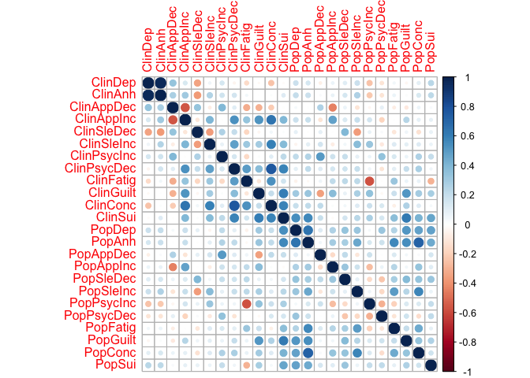

GenomicSEM of MDD symptoms
================
Mark Adams, Bradley Jermy, Jackson Thorp, Andrew Grotzinger, Michel
Nivard

# Setup

## R packages

R version

``` r
R.version
```

    ##                _                           
    ## platform       x86_64-apple-darwin17.0     
    ## arch           x86_64                      
    ## os             darwin17.0                  
    ## system         x86_64, darwin17.0          
    ## status                                     
    ## major          4                           
    ## minor          0.5                         
    ## year           2021                        
    ## month          03                          
    ## day            31                          
    ## svn rev        80133                       
    ## language       R                           
    ## version.string R version 4.0.5 (2021-03-31)
    ## nickname       Shake and Throw

Package installation

``` r
required_packages <- c('devtools', 'readr', 'tidyr', 'dplyr', 'ggplot2', 'stringr', 'corrplot')
for(pack in required_packages) if(!require(pack, character.only=TRUE)) install.packages(pack)

if(!require(GenomicSEM)) remotes::install_github("MichelNivard/GenomicSEM")

if(!require(tidySEM)) remotes::install_github("cjvanlissa/tidySEM")
```

GenomicSEM version

``` r
require(readr)
require(tidyr)
require(stringr)
require(dplyr)
require(ggplot2)
require(corrplot)
require(tidySEM)
require(GenomicSEM)

packageVersion("GenomicSEM")
```

    ## [1] '0.0.3'

# Symptom labels

MDD DSM symptoms are numbered 1-9:

``` r
# plot labels

dsm_mdd_symptoms_labels <-
read_delim("
MDD1;Mood;Mood;Dep
MDD2;Interest;Interest;Anh
MDD3;Weight⇅;Weight⇆;App
MDD3a;Weight⇊;Weight⇇;AppDec
MDD3b;Weight⇈;Weight⇉;AppInc
MDD4;Sleep⇅;Sleep⇆;Sle
MDD4a;Sleep⇊;Sleep⇇;SleDec
MDD4b;Sleep⇈;Sleep⇉;SleInc
MDD5;Motor⇅;Motor⇆;Psyc
MDD5a;Motor⇈;Motor⇉;PsycInc
MDD5b;Motor⇊;Motor⇇;PsycDec
MDD6;Fatigue;Fatigue;Fatig
MDD7;Guilt;Guilt;Guilt
MDD8;Concentrate;Concentrate;Conc
MDD9;Suicidality;Suicidality;Sui
", col_names=c('ref', 'h', 'v', 'abbv'), delim=';')

dsm_mdd_symptoms_reference <-
read_delim("
MDD1;Depressed mood most of the day, nearly every day
MDD2;Markedly diminished interest or pleasure in all, or almost all, activities most of the day, nearly every day
MDD3;Significant change in weight or appetite
MDD3a;Significant weight loss or decrease in appetite
MDD3b;Significant weight gain or increase in appetite
MDD4;Sleeping too much or not sleeping enough
MDD4a;Insomnia nearly every day
MDD4b;Hypersomnia nearly every day
MDD5;Changes in speed/amount of moving or speaking
MDD5a;Psychomotor agitation nearly every day
MDD5b;Psychomotor retardation nearly every day
MDD6;Fatigue or loss of energy nearly every day
MDD7;Feelings of worthlessness or excessive or inappropriate guilt
MDD8;Diminished ability to think or concentrate, or indecisiveness
MDD9;Recurrent thoughts of death or suicide or a suicide attempt or a specific plan for attempting suicide
", col_names=c('Reference', 'Description'), delim=';')

dsm_mdd_symptoms_reference %>%
left_join(dsm_mdd_symptoms_labels, by=c('Reference'='ref')) %>%
select(Reference, Abbreviation=abbv, Label=h, Description)
```

    ## # A tibble: 15 x 4
    ##    Reference Abbreviation Label     Description                                 
    ##    <chr>     <chr>        <chr>     <chr>                                       
    ##  1 MDD1      Dep          Mood      Depressed mood most of the day, nearly ever…
    ##  2 MDD2      Anh          Interest  Markedly diminished interest or pleasure in…
    ##  3 MDD3      App          Weight⇅   Significant change in weight or appetite    
    ##  4 MDD3a     AppDec       Weight⇊   Significant weight loss or decrease in appe…
    ##  5 MDD3b     AppInc       Weight⇈   Significant weight gain or increase in appe…
    ##  6 MDD4      Sle          Sleep⇅    Sleeping too much or not sleeping enough    
    ##  7 MDD4a     SleDec       Sleep⇊    Insomnia nearly every day                   
    ##  8 MDD4b     SleInc       Sleep⇈    Hypersomnia nearly every day                
    ##  9 MDD5      Psyc         Motor⇅    Changes in speed/amount of moving or speaki…
    ## 10 MDD5a     PsycInc      Motor⇈    Psychomotor agitation nearly every day      
    ## 11 MDD5b     PsycDec      Motor⇊    Psychomotor retardation nearly every day    
    ## 12 MDD6      Fatig        Fatigue   Fatigue or loss of energy nearly every day  
    ## 13 MDD7      Guilt        Guilt     Feelings of worthlessness or excessive or i…
    ## 14 MDD8      Conc         Concentr… Diminished ability to think or concentrate,…
    ## 15 MDD9      Sui          Suicidal… Recurrent thoughts of death or suicide or a…

# GenomicSEM covariance structure

``` r
covstruct_prefix <- 'agds_pgc.alspac_ukb'
covstruct_r <- file.path('ldsc', paste(covstruct_prefix, 'hdl.covstruct', 'deparse.R', sep='.'))
covstruct_rds <- file.path('ldsc', paste(covstruct_prefix, 'hdl.covstruct', 'rds', sep='.'))

symptoms_covstruct <- dget(covstruct_r)

sumstats_prevs <- read_tsv(file.path('ldsc', paste(covstruct_prefix, 'covstruct', 'prevs', 'txt', sep='.')))
```

    ## 
    ## ── Column specification ────────────────────────────────────────────────────────
    ## cols(
    ##   cohorts = col_character(),
    ##   symptom = col_character(),
    ##   sumstats = col_character(),
    ##   Nca = col_double(),
    ##   Nco = col_double(),
    ##   samp_prev = col_double(),
    ##   filename = col_character(),
    ##   pop_prev = col_double(),
    ##   trait_name = col_character()
    ## )

Rename samples: AGDS/PGC is the **Clin**ical sample (`Clin`) and
ALSPAC/UKB is the **Pop**ulation sample (`Pop`); and rename symptoms
numbers (`MDD1`, `MDD2`) to abbreviations (`Dep`, `Anh`)

``` r
cohorts_sample_symptoms <-
sumstats_prevs %>%
left_join(dsm_mdd_symptoms_labels, by=c('symptom'='ref')) %>%
select(cohorts, symptom, trait_name, abbv) %>%
mutate(Sample=case_when(cohorts %in% 'AGDS_PGC' ~ 'Clin',
                        cohorts %in% 'ALSPAC_UKB' ~ 'Pop',
                        TRUE ~ NA_character_)) %>%
mutate(sample_symptom=paste0(Sample, abbv))

sample_symptoms <- cohorts_sample_symptoms$sample_symptom
names(sample_symptoms) <- cohorts_sample_symptoms$trait_name

# rename traits in covstruct
dimnames(symptoms_covstruct$S)[[2]] <-
as.vector(sample_symptoms[dimnames(symptoms_covstruct$S)[[2]]])
```

# Structural models

## ADGS-PGC

### Common factor

Common factor model. Allow residual negative correlation between
directional symptoms

``` r
pgc_commonfactor.model <- "
A1 =~ NA*ClinAppDec + ClinAppInc + ClinSleDec + ClinSleInc + ClinPsycInc + ClinSui
A1 ~~ 1*A1
c3a3b > -1
ClinAppDec ~~ c3a3b*ClinAppInc
"
pgc_commonfactor.fit <- usermodel(symptoms_covstruct, estimation='DWLS', model=pgc_commonfactor.model)
```

    ## [1] "Running primary model"
    ## [1] "Calculating CFI"
    ## [1] "Calculating Standardized Results"
    ## [1] "Calculating SRMR"
    ## elapsed 
    ##   7.227 
    ## [1] "The S matrix was smoothed prior to model estimation due to a non-positive definite matrix. The largest absolute difference in a cell between the smoothed and non-smoothed matrix was  0.0413841400171649 As a result of the smoothing, the largest Z-statistic change for the genetic covariances was  1.61167313211103 . We recommend setting the smooth_check argument to true if you are going to run a multivariate GWAS."

    ## Warning in usermodel(symptoms_covstruct, estimation = "DWLS", model =
    ## pgc_commonfactor.model): A difference greater than .025 was observed pre-
    ## and post-smoothing in the genetic covariance matrix. This reflects a large
    ## difference and results should be interpreted with caution!! This can often
    ## result from including low powered traits, and you might consider removing those
    ## traits from the model. If you are going to run a multivariate GWAS we strongly
    ## recommend setting the smooth_check argument to true to check smoothing for each
    ## SNP.

    ## Warning in usermodel(symptoms_covstruct, estimation = "DWLS", model =
    ## pgc_commonfactor.model): A difference greater than .025 was observed pre- and
    ## post-smoothing for Z-statistics in the genetic covariance matrix. This reflects
    ## a large difference and results should be interpreted with caution!! This can
    ## often result from including low powered traits, and you might consider removing
    ## those traits from the model. If you are going to run a multivariate GWAS we
    ## strongly recommend setting the smooth_check argument to true to check smoothing
    ## for each SNP.

``` r
pgc_commonfactor.fit$modelfit
```

    ##       chisq df   p_chisq      AIC CFI      SRMR
    ## df 6.338686  8 0.6093507 32.33869   1 0.1104514

``` r
pgc_commonfactor.fit$results[c(1,2,3,6,7)]
```

    ##            lhs op         rhs STD_Genotype   STD_Genotype_SE
    ## 1           A1 =~  ClinAppDec   0.47271476 0.277466282981371
    ## 2           A1 =~  ClinAppInc   0.07791909  0.25184716442219
    ## 4           A1 =~  ClinSleDec   0.79084668 0.468791995580508
    ## 5           A1 =~  ClinSleInc  -0.16669965 0.292382008062987
    ## 3           A1 =~ ClinPsycInc   0.92289189 0.511222649772673
    ## 6           A1 =~     ClinSui   0.15801195 0.301647560740464
    ## 9   ClinAppDec ~~  ClinAppInc  -0.87888086 0.240238896024384
    ## 8   ClinAppDec ~~  ClinAppDec   0.77654088 0.293579323921997
    ## 10  ClinAppInc ~~  ClinAppInc   0.99392846 0.123240625374627
    ## 12  ClinSleDec ~~  ClinSleDec   0.37456199 0.745501840695423
    ## 13  ClinSleInc ~~  ClinSleInc   0.97221145 0.254603937431703
    ## 11 ClinPsycInc ~~ ClinPsycInc   0.14827057  1.01622178126558
    ## 14     ClinSui ~~     ClinSui   0.97503239 0.212245979178621
    ## 7           A1 ~~          A1   1.00000000

``` r
fit_graph <- function(results, ...) {

  results_sort <- results %>% arrange(lhs, rhs)

  node_names <- unique(c(results_sort$lhs, results_sort$rhs))
  
  node_idx <- seq_along(node_names)
  names(node_idx) <- node_names
  
  graph <- create_graph(
    nodes_df=create_node_df(n=length(node_names),
                            label=node_labels[node_names], 
                            shape='oval', width=1,
                            fillcolor=node_colors[node_names],
                            fontcolor='black'),
    edges_df=create_edge_df(from=node_idx[results_sort$lhs],
                            to=node_idx[results_sort$rhs],
                            label=round(results_sort$STD_Genotype, 2),
                            penwidth=0.3+abs(2*results_sort$STD_Genotype),
                            dir=edge_dir[results_sort$op]),
    attr_theme="tb")
  
  return(graph)

}

# render_fit <- function(results) render_graph(fit_graph(results))

# render_fit(pgc_commonfactor.fit$results)

# pgc_commonfactor.graph <- fit_graph(pgc_commonfactor.fit$results)

add_rank_same <- function(gv, top, bottom) {

  # add in block to specify node ranks
  gv.list <- str_split(gv, '\n\n')[[1]]
  
  # move the nodes/edges element to the end
  gv.list[6] <- gv.list[5]
  
  # add manually made ranks
  gv.list[5] <- paste("{rank=same",
  paste(paste0("'", top, "'"), collapse=' '),
  "}\n{rank=same",
  paste(paste0("'", bottom, "'"), collapse=' '),
  "}")
  
  rank.gv <- paste(gv.list, collapse='\n\n')

}


# pgc_commonfactor.gv <- add_rank_same(generate_dot(pgc_commonfactor.graph), 1, 2:5)
# grViz(pgc_commonfactor.gv)

# # output as a GraphViz dot file. Replace single quotes with double quotes 
# # as that's what the command line utility expects
# cat(str_replace_all(pgc_commonfactor_rank.gv, "'", '"'), file='mdd-symptom-gsem_files/pgc_commonfactor.gv')
```

## ALSPAC-UKB (Population)

### Common factor

Common factor model

``` r
pop_commonfactor.model <- "
A1 =~ NA*PopDep + PopAnh + PopAppDec + PopAppInc + PopSleDec + PopSleInc + PopFatig + PopGuilt + PopConc + PopSui
A1 ~~ 1*A1
"
pop_commonfactor.fit <- usermodel(symptoms_covstruct, estimation='DWLS', model=pop_commonfactor.model)
```

    ## [1] "Running primary model"
    ## [1] "Calculating CFI"
    ## [1] "Calculating Standardized Results"
    ## [1] "Calculating SRMR"
    ## elapsed 
    ##   1.384 
    ## [1] "The S matrix was smoothed prior to model estimation due to a non-positive definite matrix. The largest absolute difference in a cell between the smoothed and non-smoothed matrix was  0.00320242979228444 As a result of the smoothing, the largest Z-statistic change for the genetic covariances was  0.371393316703468 . We recommend setting the smooth_check argument to true if you are going to run a multivariate GWAS."

    ## Warning in usermodel(symptoms_covstruct, estimation = "DWLS", model =
    ## pop_commonfactor.model): A difference greater than .025 was observed pre- and
    ## post-smoothing for Z-statistics in the genetic covariance matrix. This reflects
    ## a large difference and results should be interpreted with caution!! This can
    ## often result from including low powered traits, and you might consider removing
    ## those traits from the model. If you are going to run a multivariate GWAS we
    ## strongly recommend setting the smooth_check argument to true to check smoothing
    ## for each SNP.

``` r
pop_commonfactor.fit$modelfit
```

    ##     chisq df      p_chisq    AIC       CFI      SRMR
    ## df 245.29 35 2.128852e-33 285.29 0.8227773 0.1111411

``` r
pop_commonfactor.fit$results[c(1, 2, 3, 6, 7)]
```

    ##          lhs op       rhs STD_Genotype    STD_Genotype_SE
    ## 5         A1 =~    PopDep   0.73459939 0.0740541788888165
    ## 1         A1 =~    PopAnh   0.95016705 0.0663930755585794
    ## 2         A1 =~ PopAppDec   0.03904363 0.0974078842155281
    ## 3         A1 =~ PopAppInc   0.41273431 0.0952632993430307
    ## 8         A1 =~ PopSleDec   0.51548333  0.117153315316936
    ## 9         A1 =~ PopSleInc   0.49496516 0.0863292719867939
    ## 6         A1 =~  PopFatig   0.61717106  0.120138231313934
    ## 7         A1 =~  PopGuilt   0.57586175 0.0850086537778342
    ## 4         A1 =~   PopConc   0.79005037   0.10343335644677
    ## 10        A1 =~    PopSui   0.41087866     0.128534540529
    ## 16    PopDep ~~    PopDep   0.46036450 0.0972048661280005
    ## 12    PopAnh ~~    PopAnh   0.09718340  0.112184217025714
    ## 13 PopAppDec ~~ PopAppDec   0.99847587  0.170918305904594
    ## 14 PopAppInc ~~ PopAppInc   0.82965050  0.148711128276946
    ## 19 PopSleDec ~~ PopSleDec   0.73427721   0.21734670420609
    ## 20 PopSleInc ~~ PopSleInc   0.75500932  0.177379711077006
    ## 17  PopFatig ~~  PopFatig   0.61910017  0.177071556987961
    ## 18  PopGuilt ~~  PopGuilt   0.66838399  0.156451870798687
    ## 15   PopConc ~~   PopConc   0.37582099  0.201340106328004
    ## 21    PopSui ~~    PopSui   0.83117828  0.174781904705795
    ## 11        A1 ~~        A1   1.00000000

Remove common variance shared between the gating items (Mood:
`UKB_CIDI1`, Interest: `UKB_CIDI2`) that is uncorrelated with the common
factor variance, to recover the genetic structure among gated items

``` r
pop_commonfactor_gating.model <- "
A1 =~ NA*PopDep + PopAnh + PopAppDec + PopAppInc + PopSleDec + PopSleInc + PopFatig + PopGuilt + PopConc + PopSui
A1 ~~ 1*A1
PopDep ~~ PopAnh
c2 > 0.001
PopAnh ~~ c2*PopAnh
"
pop_commonfactor_gating.fit <- usermodel(symptoms_covstruct, estimation='DWLS', model=pop_commonfactor_gating.model)
```

    ## [1] "Running primary model"
    ## [1] "Calculating CFI"
    ## [1] "Calculating Standardized Results"
    ## [1] "Calculating SRMR"
    ## elapsed 
    ##   5.221 
    ## [1] "The S matrix was smoothed prior to model estimation due to a non-positive definite matrix. The largest absolute difference in a cell between the smoothed and non-smoothed matrix was  0.00320242979228444 As a result of the smoothing, the largest Z-statistic change for the genetic covariances was  0.371393316703468 . We recommend setting the smooth_check argument to true if you are going to run a multivariate GWAS."

    ## Warning in usermodel(symptoms_covstruct, estimation = "DWLS", model =
    ## pop_commonfactor_gating.model): A difference greater than .025 was observed
    ## pre- and post-smoothing for Z-statistics in the genetic covariance matrix. This
    ## reflects a large difference and results should be interpreted with caution!!
    ## This can often result from including low powered traits, and you might consider
    ## removing those traits from the model. If you are going to run a multivariate
    ## GWAS we strongly recommend setting the smooth_check argument to true to check
    ## smoothing for each SNP.

``` r
pop_commonfactor_gating.fit$modelfit
```

    ##       chisq df      p_chisq      AIC       CFI      SRMR
    ## df 188.8044 34 2.292465e-23 230.8044 0.8695381 0.1106203

``` r
pop_commonfactor_gating.fit$results[c(1, 2, 3, 6, 7)]
```

    ##          lhs op       rhs  STD_Genotype    STD_Genotype_SE
    ## 5         A1 =~    PopDep  0.8110678900  0.123875437194804
    ## 1         A1 =~    PopAnh  1.0046180126  0.111460541253658
    ## 2         A1 =~ PopAppDec  0.0388258670 0.0938965696407361
    ## 3         A1 =~ PopAppInc  0.4001994714 0.0969012941296678
    ## 8         A1 =~ PopSleDec  0.4971465919  0.111028590305811
    ## 9         A1 =~ PopSleInc  0.4801488074 0.0857451843498241
    ## 6         A1 =~  PopFatig  0.5908056682   0.11675550967206
    ## 7         A1 =~  PopGuilt  0.5586482371 0.0830007707288808
    ## 4         A1 =~   PopConc  0.7551504862  0.102716102793676
    ## 10        A1 =~    PopSui  0.4128034571  0.125482229852113
    ## 16    PopDep ~~    PopAnh -0.1887563632  0.195671938875042
    ## 12    PopAnh ~~    PopAnh  0.0009996957  0.210456536543998
    ## 17    PopDep ~~    PopDep  0.3421705846  0.193305868605353
    ## 13 PopAppDec ~~ PopAppDec  0.9984925460  0.170935976545918
    ## 14 PopAppInc ~~ PopAppInc  0.8398401696  0.148311061706044
    ## 20 PopSleDec ~~ PopSleDec  0.7528437743  0.214380190035318
    ## 21 PopSleInc ~~ PopSleInc  0.7694566030  0.176723030130906
    ## 18  PopFatig ~~  PopFatig  0.6509475826  0.173088433584497
    ## 19  PopGuilt ~~  PopGuilt  0.6879117430  0.152601969375699
    ## 15   PopConc ~~   PopConc  0.4297459385  0.194173808761118
    ## 22    PopSui ~~    PopSui  0.8295932030  0.172633321635609
    ## 11        A1 ~~        A1  1.0000000000

Check if model is improved by allowing residual correlations between the
directional symptoms.

``` r
pop_commonfactor_app.model <- "
A1 =~ NA*PopDep + PopAnh + PopAppDec + PopAppInc + PopSleDec + PopSleInc + PopFatig + PopGuilt + PopConc + PopSui
A1 ~~ 1*A1
PopDep ~~ PopAnh
PopAppDec ~~ PopAppInc
c2 > 0.001
PopAnh ~~ c2*PopAnh
"
pop_commonfactor_app.fit <- usermodel(symptoms_covstruct, estimation='DWLS', model=pop_commonfactor_app.model)
```

    ## [1] "Running primary model"
    ## [1] "Calculating CFI"
    ## [1] "Calculating Standardized Results"
    ## [1] "Calculating SRMR"
    ## elapsed 
    ##   5.174 
    ## [1] "The S matrix was smoothed prior to model estimation due to a non-positive definite matrix. The largest absolute difference in a cell between the smoothed and non-smoothed matrix was  0.00320242979228444 As a result of the smoothing, the largest Z-statistic change for the genetic covariances was  0.371393316703468 . We recommend setting the smooth_check argument to true if you are going to run a multivariate GWAS."

    ## Warning in usermodel(symptoms_covstruct, estimation = "DWLS", model =
    ## pop_commonfactor_app.model): A difference greater than .025 was observed pre-
    ## and post-smoothing for Z-statistics in the genetic covariance matrix. This
    ## reflects a large difference and results should be interpreted with caution!!
    ## This can often result from including low powered traits, and you might consider
    ## removing those traits from the model. If you are going to run a multivariate
    ## GWAS we strongly recommend setting the smooth_check argument to true to check
    ## smoothing for each SNP.

``` r
pop_commonfactor_app.fit$modelfit
```

    ##       chisq df      p_chisq      AIC       CFI      SRMR
    ## df 181.7319 33 1.809454e-22 225.7319 0.8746557 0.1096971

``` r
pop_commonfactor_sle.model <- "
A1 =~ NA*PopDep + PopAnh + PopAppDec + PopAppInc + PopSleDec + PopSleInc + PopFatig + PopGuilt + PopConc + PopSui
A1 ~~ 1*A1
PopDep ~~ PopAnh
PopSleDec ~~ PopSleInc
c2 > 0.001
PopAnh ~~ c2*PopAnh
"
pop_commonfactor_sle.fit <- usermodel(symptoms_covstruct, estimation='DWLS', model=pop_commonfactor_sle.model)
```

    ## [1] "Running primary model"
    ## [1] "Calculating CFI"
    ## [1] "Calculating Standardized Results"
    ## [1] "Calculating SRMR"
    ## elapsed 
    ##   6.728 
    ## [1] "The S matrix was smoothed prior to model estimation due to a non-positive definite matrix. The largest absolute difference in a cell between the smoothed and non-smoothed matrix was  0.00320242979228444 As a result of the smoothing, the largest Z-statistic change for the genetic covariances was  0.371393316703468 . We recommend setting the smooth_check argument to true if you are going to run a multivariate GWAS."

    ## Warning in usermodel(symptoms_covstruct, estimation = "DWLS", model =
    ## pop_commonfactor_sle.model): A difference greater than .025 was observed pre-
    ## and post-smoothing for Z-statistics in the genetic covariance matrix. This
    ## reflects a large difference and results should be interpreted with caution!!
    ## This can often result from including low powered traits, and you might consider
    ## removing those traits from the model. If you are going to run a multivariate
    ## GWAS we strongly recommend setting the smooth_check argument to true to check
    ## smoothing for each SNP.

``` r
pop_commonfactor_sle.fit$modelfit
```

    ##       chisq df      p_chisq      AIC       CFI      SRMR
    ## df 174.3416 33 3.859602e-21 218.3416 0.8808838 0.1050545

``` r
pop_commonfactor_app_sle.model <- "
A1 =~ NA*PopDep + PopAnh + PopAppDec + PopAppInc + PopSleDec + PopSleInc + PopFatig + PopGuilt + PopConc + PopSui
A1 ~~ 1*A1
PopDep ~~ PopAnh
PopAppDec ~~ PopAppInc
PopSleDec ~~ PopSleInc
c2 > 0.001
PopAnh ~~ c2*PopAnh
"
pop_commonfactor_app_sle.fit <- usermodel(symptoms_covstruct, estimation='DWLS', model=pop_commonfactor_app_sle.model)
```

    ## [1] "Running primary model"
    ## [1] "Calculating CFI"
    ## [1] "Calculating Standardized Results"
    ## [1] "Calculating SRMR"
    ## elapsed 
    ##   6.752 
    ## [1] "The S matrix was smoothed prior to model estimation due to a non-positive definite matrix. The largest absolute difference in a cell between the smoothed and non-smoothed matrix was  0.00320242979228444 As a result of the smoothing, the largest Z-statistic change for the genetic covariances was  0.371393316703468 . We recommend setting the smooth_check argument to true if you are going to run a multivariate GWAS."

    ## Warning in usermodel(symptoms_covstruct, estimation = "DWLS", model =
    ## pop_commonfactor_app_sle.model): A difference greater than .025 was observed
    ## pre- and post-smoothing for Z-statistics in the genetic covariance matrix. This
    ## reflects a large difference and results should be interpreted with caution!!
    ## This can often result from including low powered traits, and you might consider
    ## removing those traits from the model. If you are going to run a multivariate
    ## GWAS we strongly recommend setting the smooth_check argument to true to check
    ## smoothing for each SNP.

``` r
pop_commonfactor_app_sle.fit$modelfit
```

    ##       chisq df      p_chisq      AIC      CFI      SRMR
    ## df 168.0813 32 2.170292e-20 214.0813 0.885317 0.1040781

### Cognitive-Mood-Neuroveg (Kendler Neale) model

``` r
pop_cog_mood_neuroveg.model <- "
A1 =~ NA*PopGuilt + PopConc + PopSui
A2 =~ NA*PopDep + PopAnh + PopGuilt
A3 =~ NA*PopSleDec + PopSleInc + PopFatig + PopAppDec + PopAppInc
A1 ~~ 1*A1
A2 ~~ 1*A2
A3 ~~ 1*A3
"
pop_cog_mood_neuroveg.fit <- usermodel(symptoms_covstruct, estimation='DWLS', model=pop_cog_mood_neuroveg.model, fix_resid=FALSE)
```

    ## [1] "Running primary model"

    ## Warning in usermodel(symptoms_covstruct, estimation = "DWLS", model =
    ## pop_cog_mood_neuroveg.model, : The model failed to converge on a solution.
    ## Please try specifying an alternative model.

    ## Warning in usermodel(symptoms_covstruct, estimation = "DWLS", model = pop_cog_mood_neuroveg.model, : Error: The primary model did not converge! Additional warnings or errors are likely being printed by lavaan. 
    ##             The model output is also printed below (without standard errors) in case this is helpful for troubleshooting. Please note
    ##             that these results should not be interpreted.

    ##          lhs op       rhs Unstandardized_Estimate
    ## 1         A1 =~  PopGuilt            68.156794071
    ## 2         A1 =~   PopConc            -0.189954611
    ## 3         A1 =~    PopSui            -0.071080330
    ## 4         A2 =~    PopDep             0.176813040
    ## 5         A2 =~    PopAnh             0.235365563
    ## 6         A2 =~  PopGuilt            68.286473057
    ## 7         A3 =~ PopSleDec             0.098152323
    ## 8         A3 =~ PopSleInc             0.117163477
    ## 9         A3 =~  PopFatig             0.137054628
    ## 10        A3 =~ PopAppDec             0.007219916
    ## 11        A3 =~ PopAppInc             0.104724821
    ## 15  PopGuilt ~~  PopGuilt            -3.092132840
    ## 16   PopConc ~~   PopConc             0.017705593
    ## 17    PopSui ~~    PopSui             0.025922648
    ## 18    PopDep ~~    PopDep             0.030126916
    ## 19    PopAnh ~~    PopAnh             0.012509036
    ## 20 PopSleDec ~~ PopSleDec             0.029722851
    ## 21 PopSleInc ~~ PopSleInc             0.043385294
    ## 22  PopFatig ~~  PopFatig             0.035084606
    ## 23 PopAppDec ~~ PopAppDec             0.035493933
    ## 24 PopAppInc ~~ PopAppInc             0.054829351
    ## 25        A1 ~~        A2            -0.999663951
    ## 26        A1 ~~        A3            -1.105362098
    ## 27        A2 ~~        A3             1.104835897

Add constraints to prevent variances from being negative and
correlations from going out of bounds.

``` r
pop_cog_mood_neuroveg_constr.model <- "
A1 =~ NA*PopGuilt + PopConc + PopSui
A2 =~ NA*PopDep + PopAnh + PopGuilt
A3 =~ NA*PopSleDec + PopSleInc + PopFatig + PopAppDec + PopAppInc
A1 ~~ 1*A1
A2 ~~ 1*A2
A3 ~~ 1*A3
a13 < 1
a13 > -1.0
A1 ~~ a13*A3
a23 < 1
A2 ~~ a23*A3
c7 > 0.001
PopGuilt ~~ c7*PopGuilt
"

pop_cog_mood_neuroveg_constr.fit <- usermodel(symptoms_covstruct, estimation='DWLS', model=pop_cog_mood_neuroveg_constr.model, fix_resid=FALSE)
```

    ## [1] "Running primary model"
    ## [1] "Calculating CFI"
    ## [1] "Calculating Standardized Results"
    ## [1] "Calculating SRMR"
    ## elapsed 
    ##  10.329 
    ## [1] "The S matrix was smoothed prior to model estimation due to a non-positive definite matrix. The largest absolute difference in a cell between the smoothed and non-smoothed matrix was  0.00320242979228444 As a result of the smoothing, the largest Z-statistic change for the genetic covariances was  0.371393316703468 . We recommend setting the smooth_check argument to true if you are going to run a multivariate GWAS."

    ## Warning in usermodel(symptoms_covstruct, estimation = "DWLS", model =
    ## pop_cog_mood_neuroveg_constr.model, : A difference greater than .025 was
    ## observed pre- and post-smoothing for Z-statistics in the genetic covariance
    ## matrix. This reflects a large difference and results should be interpreted
    ## with caution!! This can often result from including low powered traits, and you
    ## might consider removing those traits from the model. If you are going to run
    ## a multivariate GWAS we strongly recommend setting the smooth_check argument to
    ## true to check smoothing for each SNP.

``` r
pop_cog_mood_neuroveg_constr.fit$modelfit
```

    ##       chisq df      p_chisq      AIC      CFI      SRMR
    ## df 253.2524 31 1.049617e-36 301.2524 0.812696 0.1093165

``` r
pop_cog_mood_neuroveg_constr.fit$results[c(1, 2, 3, 6, 7)]
```

    ##          lhs op       rhs STD_Genotype    STD_Genotype_SE
    ## 2         A1 =~  PopGuilt   0.79426458   1.17210232398693
    ## 1         A1 =~   PopConc   0.72633692  0.175709385766923
    ## 3         A1 =~    PopSui   0.39848355  0.136843000905949
    ## 8         A2 =~    PopDep   0.71338578  0.068887246127998
    ## 7         A2 =~    PopAnh   0.90284254 0.0710265620261954
    ## 9         A2 =~  PopGuilt  -0.29597755   1.15971161430218
    ## 15        A3 =~ PopSleDec   0.53130873  0.131648752863833
    ## 16        A3 =~ PopSleInc   0.52000179  0.111109262079607
    ## 14        A3 =~  PopFatig   0.64201810  0.152199748899107
    ## 12        A3 =~ PopAppDec   0.04100644  0.100555322304331
    ## 13        A3 =~ PopAppInc   0.43492211    0.1114832392973
    ## 6         A1 ~~        A3   1.00000068  0.194507855016951
    ## 11        A2 ~~        A3   0.99999990  0.194350242781778
    ## 24  PopGuilt ~~  PopGuilt   0.84281571  0.402114750640346
    ## 21   PopConc ~~   PopConc   0.47243434  0.290811406049029
    ## 27    PopSui ~~    PopSui   0.84121060  0.179495536800677
    ## 22    PopDep ~~    PopDep   0.49108117 0.0836974257090599
    ## 18    PopAnh ~~    PopAnh   0.18487507  0.118257468928668
    ## 25 PopSleDec ~~ PopSleDec   0.71771075  0.228102079136565
    ## 26 PopSleInc ~~ PopSleInc   0.72959699  0.189786148562718
    ## 23  PopFatig ~~  PopFatig   0.58781256  0.200557621924838
    ## 19 PopAppDec ~~ PopAppDec   0.99831845  0.170851584312349
    ## 20 PopAppInc ~~ PopAppInc   0.81084173  0.162641856912014
    ## 5         A1 ~~        A2   1.19377150  0.339341496704266
    ## 4         A1 ~~        A1   1.00000000                   
    ## 10        A2 ~~        A2   1.00000000                   
    ## 17        A3 ~~        A3   1.00000000

### Two-factor models

[Elhai Psychiat Res
2012](https://www.sciencedirect.com/science/article/pii/S0165178112002685)
compared 3 two-factor models

### Psychological-Somatic (Elhai Model 2a)

[Kruse Rehab Psychol
2008](https://psycnet.apa.org/record/2008-17022-011), [Kruse Arch Psys
Med Rehab
2010](https://www.sciencedirect.com/science/article/pii/S0003999310002443):

> the 2-factor solution with 3 somatic items (sleep disturbance, poor
> energy, appetite change) was a better solution than either a
> unidimensional model or 2-factor model that included psychomotor
> retardation as a fourth somatic item

``` r
pop_psych_soma.model <- "
A1 =~ NA*PopDep + PopAnh + PopGuilt + PopConc + PopSui 
A2 =~ NA*PopAppDec + PopAppInc + PopSleDec + PopSleInc + PopFatig
A1 ~~ 1*A1
A2 ~~ 1*A2
PopDep ~~ PopAnh
c2 > 0.001
PopAnh ~~ c2*PopAnh
"
pop_psych_soma.fit <- usermodel(symptoms_covstruct, estimation='DWLS', model=pop_psych_soma.model)
```

    ## [1] "Running primary model"
    ## [1] "Calculating CFI"
    ## [1] "Calculating Standardized Results"
    ## [1] "Calculating SRMR"
    ## elapsed 
    ##   9.357 
    ## [1] "The S matrix was smoothed prior to model estimation due to a non-positive definite matrix. The largest absolute difference in a cell between the smoothed and non-smoothed matrix was  0.00320242979228444 As a result of the smoothing, the largest Z-statistic change for the genetic covariances was  0.371393316703468 . We recommend setting the smooth_check argument to true if you are going to run a multivariate GWAS."

    ## Warning in usermodel(symptoms_covstruct, estimation = "DWLS", model =
    ## pop_psych_soma.model): A difference greater than .025 was observed pre- and
    ## post-smoothing for Z-statistics in the genetic covariance matrix. This reflects
    ## a large difference and results should be interpreted with caution!! This can
    ## often result from including low powered traits, and you might consider removing
    ## those traits from the model. If you are going to run a multivariate GWAS we
    ## strongly recommend setting the smooth_check argument to true to check smoothing
    ## for each SNP.

``` r
pop_psych_soma.fit$modelfit
```

    ##       chisq df      p_chisq      AIC       CFI      SRMR
    ## df 189.9393 33 5.874201e-24 233.9393 0.8677388 0.1106088

``` r
pop_psych_soma.fit$results[c(1, 2, 3, 6, 7, 9)]
```

    ##          lhs op       rhs STD_Genotype    STD_Genotype_SE      p_value
    ## 3         A1 =~    PopDep  0.812197567  0.120119051584396 1.332634e-11
    ## 1         A1 =~    PopAnh  1.004981740  0.107798643964376 1.285554e-20
    ## 4         A1 =~  PopGuilt  0.558755177 0.0830908289099119 1.689411e-11
    ## 2         A1 =~   PopConc  0.754874743  0.102324306259034 1.442261e-13
    ## 5         A1 =~    PopSui  0.413064239  0.125528388197096 1.007294e-03
    ## 8         A2 =~ PopAppDec  0.039119140  0.094237312566533 6.779517e-01
    ## 9         A2 =~ PopAppInc  0.403628673  0.110621486773089 2.646794e-04
    ## 11        A2 =~ PopSleDec  0.500696449  0.130847923722335 1.292429e-04
    ## 12        A2 =~ PopSleInc  0.484103451   0.11216798372287 1.598583e-05
    ## 10        A2 =~  PopFatig  0.595905450   0.15267636115817 9.550284e-05
    ## 18    PopDep ~~    PopAnh -0.190187245  0.191270639458531 3.342076e-01
    ## 14    PopAnh ~~    PopAnh  0.001000601  0.203920242426442 9.418715e-01
    ## 19    PopDep ~~    PopDep  0.340335730  0.188788439263611 6.707130e-02
    ## 21  PopGuilt ~~  PopGuilt  0.687792329  0.152698493665171 7.098511e-06
    ## 17   PopConc ~~   PopConc  0.430162649  0.195557309984006 2.927226e-02
    ## 24    PopSui ~~    PopSui  0.829377934  0.172633123657772 1.574977e-06
    ## 15 PopAppDec ~~ PopAppDec  0.998469694  0.170919858030751 5.163532e-09
    ## 16 PopAppInc ~~ PopAppInc  0.837084090  0.159030774437493 1.405892e-07
    ## 22 PopSleDec ~~ PopSleDec  0.749303299   0.22527874528502 8.912650e-04
    ## 23 PopSleInc ~~ PopSleInc  0.765644092   0.18575197559287 3.728901e-05
    ## 20  PopFatig ~~  PopFatig  0.644897219  0.193542861959685 8.520188e-04
    ## 7         A1 ~~        A2  0.989038658  0.170599708401843 6.629975e-09
    ## 6         A1 ~~        A1  1.000000000                              NA
    ## 13        A2 ~~        A2  1.000000000                              NA

Bifactor model

``` r
pop_psych_soma_bif.model <- "
A1 =~ NA*PopDep + PopAnh + PopGuilt + PopConc + PopSui
A2 =~ NA*PopAppDec + PopAppInc + PopSleDec + PopSleInc + PopFatig
A  =~ NA*PopDep + PopAnh + PopGuilt + PopConc + PopSui + PopAppDec + PopAppInc + PopSleDec + PopSleInc + PopFatig
A1 ~~ 1*A1
A2 ~~ 1*A2
A  ~~ 1*A
A  ~~ 0*A1
A  ~~ 0*A2
A1 ~~ 0*A2
"
pop_psych_soma_bif.fit <- usermodel(symptoms_covstruct, estimation='DWLS', model=pop_psych_soma_bif.model)
```

    ## [1] "Running primary model"
    ## [1] "Calculating CFI"
    ## [1] "Calculating Standardized Results"
    ## [1] "Calculating SRMR"
    ## elapsed 
    ##   1.679 
    ## [1] "The S matrix was smoothed prior to model estimation due to a non-positive definite matrix. The largest absolute difference in a cell between the smoothed and non-smoothed matrix was  0.00320242979228444 As a result of the smoothing, the largest Z-statistic change for the genetic covariances was  0.371393316703468 . We recommend setting the smooth_check argument to true if you are going to run a multivariate GWAS."

    ## Warning in usermodel(symptoms_covstruct, estimation = "DWLS", model =
    ## pop_psych_soma_bif.model): A difference greater than .025 was observed pre- and
    ## post-smoothing for Z-statistics in the genetic covariance matrix. This reflects
    ## a large difference and results should be interpreted with caution!! This can
    ## often result from including low powered traits, and you might consider removing
    ## those traits from the model. If you are going to run a multivariate GWAS we
    ## strongly recommend setting the smooth_check argument to true to check smoothing
    ## for each SNP.

``` r
pop_psych_soma_bif.fit$modelfit
```

    ##       chisq df      p_chisq      AIC       CFI       SRMR
    ## df 157.3713 25 3.642399e-21 217.3713 0.8884436 0.07667286

``` r
pop_psych_soma_bif.fit$results[c(1,2,3,6,7)]
```

    ##          lhs op       rhs STD_Genotype    STD_Genotype_SE
    ## 3         A1 =~    PopDep   0.49211078  0.208349781947625
    ## 1         A1 =~    PopAnh   0.26150815  0.221700212837712
    ## 4         A1 =~  PopGuilt   0.44381967  0.156247261555027
    ## 2         A1 =~   PopConc  -0.17956274  0.250074324785046
    ## 5         A1 =~    PopSui   0.57880456  0.270044704649589
    ## 9         A2 =~ PopAppDec   0.39533203  0.225719896010101
    ## 10        A2 =~ PopAppInc   0.02374671  0.179078586955821
    ## 12        A2 =~ PopSleDec   0.73584946  0.416654332397173
    ## 13        A2 =~ PopSleInc  -0.44412029  0.270372100111193
    ## 11        A2 =~  PopFatig  -0.11999426  0.211396611373545
    ## 20         A =~    PopDep   0.63242509  0.124273508678313
    ## 16         A =~    PopAnh   0.87316185  0.111959918665058
    ## 22         A =~  PopGuilt   0.46029723  0.102009782883923
    ## 19         A =~   PopConc   0.93831706  0.125458760730763
    ## 25         A =~    PopSui   0.29160742  0.147810565942447
    ## 17         A =~ PopAppDec   0.04666501  0.109346109857196
    ## 18         A =~ PopAppInc   0.43906532  0.104845165866019
    ## 23         A =~ PopSleDec   0.58468212  0.111998773540051
    ## 24         A =~ PopSleInc   0.57527702 0.0956861213264915
    ## 21         A =~  PopFatig   0.66411825  0.132655671814305
    ## 31    PopDep ~~    PopDep   0.35786596  0.131254011246536
    ## 27    PopAnh ~~    PopAnh   0.16920218   0.11347842358566
    ## 33  PopGuilt ~~  PopGuilt   0.59115073  0.192721191785757
    ## 30   PopConc ~~   PopConc   0.08731826  0.291068307203814
    ## 36    PopSui ~~    PopSui   0.57995095  0.301353446246212
    ## 28 PopAppDec ~~ PopAppDec   0.84153456  0.218316595114773
    ## 29 PopAppInc ~~ PopAppInc   0.80665785  0.157019433276939
    ## 34 PopSleDec ~~ PopSleDec   0.11667276  0.646363682951895
    ## 35 PopSleInc ~~ PopSleInc   0.47181356  0.282623643616062
    ## 32  PopFatig ~~  PopFatig   0.54454830  0.190049247561631
    ## 7         A1 ~~        A1   1.00000000                   
    ## 15        A2 ~~        A2   1.00000000                   
    ## 26         A ~~         A   1.00000000                   
    ## 6         A1 ~~         A   0.00000000                   
    ## 14        A2 ~~         A   0.00000000                   
    ## 8         A1 ~~        A2   0.00000000

### Psychological-Neurovegetative (Elhai Model 2b)

``` r
pop_psych_veg.model <- "
A1 =~ NA*PopDep + PopAnh + PopGuilt + PopSui
A2 =~ NA*PopAppDec + PopAppInc + PopSleDec + PopSleInc + PopFatig + PopConc
A1 ~~ 1*A1
A2 ~~ 1*A2
"
pop_psych_veg.fit <- usermodel(symptoms_covstruct, estimation='DWLS', model=pop_psych_veg.model)
```

    ## [1] "Running primary model"
    ## [1] "Calculating CFI"
    ## [1] "Calculating Standardized Results"
    ## [1] "Calculating SRMR"
    ## elapsed 
    ##   1.578 
    ## [1] "The S matrix was smoothed prior to model estimation due to a non-positive definite matrix. The largest absolute difference in a cell between the smoothed and non-smoothed matrix was  0.00320242979228444 As a result of the smoothing, the largest Z-statistic change for the genetic covariances was  0.371393316703468 . We recommend setting the smooth_check argument to true if you are going to run a multivariate GWAS."

    ## Warning in usermodel(symptoms_covstruct, estimation = "DWLS", model =
    ## pop_psych_veg.model): A difference greater than .025 was observed pre- and post-
    ## smoothing for Z-statistics in the genetic covariance matrix. This reflects a
    ## large difference and results should be interpreted with caution!! This can often
    ## result from including low powered traits, and you might consider removing those
    ## traits from the model. If you are going to run a multivariate GWAS we strongly
    ## recommend setting the smooth_check argument to true to check smoothing for each
    ## SNP.

``` r
pop_psych_veg.fit$modelfit
```

    ##       chisq df      p_chisq      AIC       CFI      SRMR
    ## df 302.9293 34 6.795233e-45 344.9293 0.7733588 0.1082493

``` r
pop_psych_veg.fit$results[c(1,2,3,6,7)]
```

    ##          lhs op       rhs STD_Genotype    STD_Genotype_SE
    ## 2         A1 =~    PopDep   0.74342324 0.0711979087947631
    ## 1         A1 =~    PopAnh   0.97240731 0.0633738882504082
    ## 3         A1 =~  PopGuilt   0.58104100 0.0855757022831426
    ## 4         A1 =~    PopSui   0.42117468  0.130137125313658
    ## 7         A2 =~ PopAppDec   0.03980696   0.10280424069063
    ## 8         A2 =~ PopAppInc   0.44002696  0.105406679773286
    ## 11        A2 =~ PopSleDec   0.53937083  0.119269340471053
    ## 12        A2 =~ PopSleInc   0.52972636 0.0989504389318408
    ## 10        A2 =~  PopFatig   0.65673085  0.134932333964674
    ## 9         A2 =~   PopConc   0.85177617  0.121193391869228
    ## 18    PopDep ~~    PopDep   0.44732165 0.0928425919269107
    ## 14    PopAnh ~~    PopAnh   0.05442347  0.112953425298037
    ## 20  PopGuilt ~~  PopGuilt   0.66239133   0.15661658439155
    ## 23    PopSui ~~    PopSui   0.82261103  0.174322791002633
    ## 15 PopAppDec ~~ PopAppDec   0.99841595  0.170895673968596
    ## 16 PopAppInc ~~ PopAppInc   0.80637653  0.157289415387494
    ## 21 PopSleDec ~~ PopSleDec   0.70907848  0.219600171245435
    ## 22 PopSleInc ~~ PopSleInc   0.71938780  0.180963567842297
    ## 19  PopFatig ~~  PopFatig   0.56870365  0.190449467916519
    ## 17   PopConc ~~   PopConc   0.27447759  0.228872995452354
    ## 6         A1 ~~        A2   0.88497646  0.125331254455294
    ## 5         A1 ~~        A1   1.00000000                   
    ## 13        A2 ~~        A2   1.00000000

``` r
pop_psych_veg_bif.model <- "
A1 =~ NA*PopDep + PopAnh + PopGuilt + PopSui
A2 =~ NA*PopAppDec + PopAppInc + PopSleDec + PopSleInc + PopFatig + PopConc
A  =~ NA*PopDep + PopAnh + PopGuilt + PopSui + PopAppDec + PopAppInc + PopSleDec + PopSleInc + PopFatig + PopConc
A1 ~~ 1*A1
A2 ~~ 1*A2
A  ~~ 1*A
A ~~ 0*A1
A ~~ 0*A2
A1 ~~ 0*A2
"
pop_psych_veg_bif.fit <- usermodel(symptoms_covstruct, estimation='DWLS', model=pop_psych_veg_bif.model)
```

    ## [1] "Running primary model"
    ## [1] "Calculating CFI"
    ## [1] "Calculating Standardized Results"
    ## [1] "Calculating SRMR"
    ## elapsed 
    ##   1.588 
    ## [1] "The S matrix was smoothed prior to model estimation due to a non-positive definite matrix. The largest absolute difference in a cell between the smoothed and non-smoothed matrix was  0.00320242979228444 As a result of the smoothing, the largest Z-statistic change for the genetic covariances was  0.371393316703468 . We recommend setting the smooth_check argument to true if you are going to run a multivariate GWAS."

    ## Warning in usermodel(symptoms_covstruct, estimation = "DWLS", model =
    ## pop_psych_veg_bif.model): A difference greater than .025 was observed pre- and
    ## post-smoothing for Z-statistics in the genetic covariance matrix. This reflects
    ## a large difference and results should be interpreted with caution!! This can
    ## often result from including low powered traits, and you might consider removing
    ## those traits from the model. If you are going to run a multivariate GWAS we
    ## strongly recommend setting the smooth_check argument to true to check smoothing
    ## for each SNP.

``` r
pop_psych_veg_bif.fit$modelfit
```

    ##       chisq df      p_chisq      AIC       CFI       SRMR
    ## df 185.2048 25 2.089636e-26 245.2048 0.8649868 0.07579896

``` r
pop_psych_veg_bif.fit$results[c(1,2,3,6,7)]
```

    ##          lhs op       rhs STD_Genotype   STD_Genotype_SE
    ## 2         A1 =~    PopDep   0.51805448 0.181111321410719
    ## 1         A1 =~    PopAnh   0.31713591 0.195212216225118
    ## 3         A1 =~  PopGuilt   0.47537814 0.156612822063979
    ## 4         A1 =~    PopSui   0.60182061 0.282689357929817
    ## 8         A2 =~ PopAppDec   0.38244594 0.214728153294402
    ## 9         A2 =~ PopAppInc   0.01497302 0.182137765440783
    ## 12        A2 =~ PopSleDec   0.69327495 0.394453671945534
    ## 13        A2 =~ PopSleInc  -0.50693446 0.286420383880355
    ## 11        A2 =~  PopFatig  -0.13428788 0.213585530486942
    ## 10        A2 =~   PopConc  -0.15950868 0.233348493142716
    ## 20         A =~    PopDep   0.60403391 0.113576775223297
    ## 16         A =~    PopAnh   0.85542393 0.119451220642454
    ## 22         A =~  PopGuilt   0.43436967 0.102086421000473
    ## 25         A =~    PopSui   0.25117375 0.130258257958509
    ## 17         A =~ PopAppDec   0.06232718 0.113727135106564
    ## 18         A =~ PopAppInc   0.45026244 0.103600926190577
    ## 23         A =~ PopSleDec   0.61782263  0.11894891301482
    ## 24         A =~ PopSleInc   0.57967017  0.11003349169157
    ## 21         A =~  PopFatig   0.68000416 0.136097840942651
    ## 19         A =~   PopConc   0.87875817 0.121149015731465
    ## 31    PopDep ~~    PopDep   0.36676255 0.128681382418342
    ## 27    PopAnh ~~    PopAnh   0.16767504 0.116381722365407
    ## 33  PopGuilt ~~  PopGuilt   0.58533935 0.195382221817953
    ## 36    PopSui ~~    PopSui   0.57472321 0.322529946553126
    ## 28 PopAppDec ~~ PopAppDec   0.84984974 0.209343811479297
    ## 29 PopAppInc ~~ PopAppInc   0.79703973 0.159166476072443
    ## 34 PopSleDec ~~ PopSleDec   0.13766461  0.60316257639131
    ## 35 PopSleInc ~~ PopSleInc   0.40699999 0.316791321597887
    ## 32  PopFatig ~~  PopFatig   0.51956161  0.19175125899549
    ## 30   PopConc ~~   PopConc   0.20234092  0.23624363124074
    ## 6         A1 ~~        A1   1.00000000                  
    ## 15        A2 ~~        A2   1.00000000                  
    ## 26         A ~~         A   1.00000000                  
    ## 5         A1 ~~         A   0.00000000                  
    ## 14        A2 ~~         A   0.00000000                  
    ## 7         A1 ~~        A2   0.00000000

### Affective-Neurovegetative (Elhai Model 2c)

``` r
pop_affect_veg.model <- "
A1 =~ NA*PopDep + PopGuilt + PopSui
A2 =~ NA*PopAnh + PopAppInc + PopAppDec + PopSleInc + PopSleDec + PopFatig + PopConc
A1 ~~ 1*A1
A2 ~~ 1*A2
"
pop_affect_veg.fit <- usermodel(symptoms_covstruct, estimation='DWLS', model=pop_affect_veg.model)
```

    ## [1] "Running primary model"
    ## [1] "Calculating CFI"
    ## [1] "Calculating Standardized Results"
    ## [1] "Calculating SRMR"
    ## elapsed 
    ##   1.651 
    ## [1] "The S matrix was smoothed prior to model estimation due to a non-positive definite matrix. The largest absolute difference in a cell between the smoothed and non-smoothed matrix was  0.00320242979228444 As a result of the smoothing, the largest Z-statistic change for the genetic covariances was  0.371393316703468 . We recommend setting the smooth_check argument to true if you are going to run a multivariate GWAS."

    ## Warning in usermodel(symptoms_covstruct, estimation = "DWLS", model =
    ## pop_affect_veg.model): A difference greater than .025 was observed pre- and
    ## post-smoothing for Z-statistics in the genetic covariance matrix. This reflects
    ## a large difference and results should be interpreted with caution!! This can
    ## often result from including low powered traits, and you might consider removing
    ## those traits from the model. If you are going to run a multivariate GWAS we
    ## strongly recommend setting the smooth_check argument to true to check smoothing
    ## for each SNP.

``` r
pop_affect_veg.fit$modelfit
```

    ##       chisq df      p_chisq      AIC       CFI      SRMR
    ## df 212.5519 34 1.040678e-27 254.5519 0.8495248 0.1044869

``` r
pop_affect_veg.fit$results[c(1,2,3,6,7)]
```

    ##          lhs op       rhs STD_Genotype    STD_Genotype_SE
    ## 1         A1 =~    PopDep   0.85867542 0.0863145798213635
    ## 2         A1 =~  PopGuilt   0.63323153 0.0950077740661715
    ## 3         A1 =~    PopSui   0.47576125  0.145382907276489
    ## 6         A2 =~    PopAnh   0.98645080  0.073223789215362
    ## 8         A2 =~ PopAppInc   0.42214761 0.0969763678847308
    ## 7         A2 =~ PopAppDec   0.03705036 0.0978701957153523
    ## 12        A2 =~ PopSleInc   0.51242766  0.088326119878467
    ## 11        A2 =~ PopSleDec   0.50832807  0.117597378531202
    ## 10        A2 =~  PopFatig   0.63681014  0.122269587188202
    ## 9         A2 =~   PopConc   0.80974139  0.105242912732544
    ## 18    PopDep ~~    PopDep   0.26267614  0.136873349482703
    ## 20  PopGuilt ~~  PopGuilt   0.59901800   0.16959072990749
    ## 23    PopSui ~~    PopSui   0.77365100  0.181225351145555
    ## 14    PopAnh ~~    PopAnh   0.02691481  0.124590666252897
    ## 16 PopAppInc ~~ PopAppInc   0.82179149  0.150145626589912
    ## 15 PopAppDec ~~ PopAppDec   0.99862657  0.171007637258376
    ## 22 PopSleInc ~~ PopSleInc   0.73741898  0.178022512522675
    ## 21 PopSleDec ~~ PopSleDec   0.74160229   0.21619705766633
    ## 19  PopFatig ~~  PopFatig   0.59447320   0.18029995068395
    ## 17   PopConc ~~   PopConc   0.34431814  0.205653337345481
    ## 5         A1 ~~        A2   0.77683239 0.0589751068238246
    ## 4         A1 ~~        A1   1.00000000                   
    ## 13        A2 ~~        A2   1.00000000

Bifactor model

``` r
pop_affect_veg_bif.model <- "
A1 =~ NA*PopDep + PopGuilt + PopSui
A2 =~ NA*PopAnh + PopAppInc + PopAppDec + PopSleInc + PopSleDec + PopFatig + PopConc
A =~ NA*PopDep + PopGuilt + PopSui + PopAnh + PopAppInc + PopAppDec + PopSleInc + PopSleDec + PopFatig + PopConc
A1 ~~ 1*A1
A2 ~~ 1*A2
A  ~~ 1*A
A ~~ 0*A1
A ~~ 0*A2
A1 ~~ 0*A2
"
pop_affect_veg_bif.fit <- usermodel(symptoms_covstruct, estimation='DWLS', model=pop_affect_veg_bif.model)
```

    ## [1] "Running primary model"
    ## [1] "Calculating CFI"
    ## [1] "Calculating Standardized Results"
    ## [1] "Calculating SRMR"
    ## elapsed 
    ##   1.658 
    ## [1] "The S matrix was smoothed prior to model estimation due to a non-positive definite matrix. The largest absolute difference in a cell between the smoothed and non-smoothed matrix was  0.00320242979228444 As a result of the smoothing, the largest Z-statistic change for the genetic covariances was  0.371393316703468 . We recommend setting the smooth_check argument to true if you are going to run a multivariate GWAS."

    ## Warning in usermodel(symptoms_covstruct, estimation = "DWLS", model =
    ## pop_affect_veg_bif.model): A difference greater than .025 was observed pre- and
    ## post-smoothing for Z-statistics in the genetic covariance matrix. This reflects
    ## a large difference and results should be interpreted with caution!! This can
    ## often result from including low powered traits, and you might consider removing
    ## those traits from the model. If you are going to run a multivariate GWAS we
    ## strongly recommend setting the smooth_check argument to true to check smoothing
    ## for each SNP.

``` r
pop_affect_veg_bif.fit$modelfit
```

    ##       chisq df      p_chisq      AIC       CFI       SRMR
    ## df 61.07619 25 7.418895e-05 121.0762 0.9695967 0.06869808

``` r
pop_affect_veg_bif.fit$results[c(1,2,3,6,7)]
```

    ##          lhs op       rhs STD_Genotype    STD_Genotype_SE
    ## 1         A1 =~    PopDep   0.69574366  0.805590687939006
    ## 2         A1 =~  PopGuilt   0.20053677  0.253671901113721
    ## 3         A1 =~    PopSui   0.35692072  0.427796844377091
    ## 7         A2 =~    PopAnh   0.35475414  0.140171910876905
    ## 9         A2 =~ PopAppInc   0.08182344  0.179169920769294
    ## 8         A2 =~ PopAppDec  -0.30865414  0.207639955675216
    ## 13        A2 =~ PopSleInc   0.56418920  0.223162671387789
    ## 12        A2 =~ PopSleDec  -0.54248712  0.320230841210609
    ## 11        A2 =~  PopFatig   0.36640284  0.212965458199533
    ## 10        A2 =~   PopConc   0.38864891  0.230603303263513
    ## 20         A =~    PopDep   0.70377123 0.0882088285712728
    ## 22         A =~  PopGuilt   0.54434268  0.102323226546004
    ## 25         A =~    PopSui   0.37422215  0.125449411699404
    ## 16         A =~    PopAnh   0.90275518 0.0892916751257913
    ## 18         A =~ PopAppInc   0.41028571 0.0978852662169668
    ## 17         A =~ PopAppDec   0.13386271  0.116782439773261
    ## 24         A =~ PopSleInc   0.41203749  0.123734070311824
    ## 23         A =~ PopSleDec   0.73285768  0.154803692196419
    ## 21         A =~  PopFatig   0.56827506   0.14563668428004
    ## 19         A =~   PopConc   0.73472929  0.126063761490279
    ## 31    PopDep ~~    PopDep   0.02064676    1.1273309571286
    ## 33  PopGuilt ~~  PopGuilt   0.66347615  0.180645430520063
    ## 36    PopSui ~~    PopSui   0.73256550  0.314357657270499
    ## 27    PopAnh ~~    PopAnh   0.05918273  0.132655265003809
    ## 29 PopAppInc ~~ PopAppInc   0.82497044  0.150209298869276
    ## 28 PopAppDec ~~ PopAppDec   0.88681309  0.197888898080925
    ## 35 PopSleInc ~~ PopSleInc   0.51191552  0.251185975929673
    ## 34 PopSleDec ~~ PopSleDec   0.16862684  0.513988382945569
    ## 32  PopFatig ~~  PopFatig   0.54281247  0.190297637612833
    ## 30   PopConc ~~   PopConc   0.30912518  0.212222833590301
    ## 5         A1 ~~        A1   1.00000000                   
    ## 15        A2 ~~        A2   1.00000000                   
    ## 26         A ~~         A   1.00000000                   
    ## 4         A1 ~~         A   0.00000000                   
    ## 14        A2 ~~         A   0.00000000                   
    ## 6         A1 ~~        A2   0.00000000

### Model comparisons

``` r
model_fits <- 
data.frame(Model=c('1a', '1b', '1c', '1d', '1e',
                   '2a', '2a(ii)', '2b(i)', '2b(ii)',
                   '2c(i)', '2c(ii)',
                   '3(i)'),
       Name=c('Common',
              'Common (gating)',
              'Common (App)',
              'Common (Sle)',
              'Common(App,Sle)',
              'Psych-Somatic',
              'Psych-Somatic (BiF)',
              'Psych-Neuroveg',
              'Psych-Neuroveg (BiF)',
              'Affect-Neuroveg',
              'Affect-Neuroveg (BiF)',
              'Cog-Mood-Neuroveg'
              )) %>%
bind_cols(
bind_rows(
lapply(list(pop_commonfactor.fit,
            pop_commonfactor_gating.fit,
            pop_commonfactor_app.fit,
            pop_commonfactor_sle.fit,
            pop_commonfactor_app_sle.fit,
            pop_psych_soma.fit,
            pop_psych_soma_bif.fit,
            pop_psych_veg.fit,
            pop_psych_veg_bif.fit,
            pop_affect_veg.fit,
            pop_affect_veg_bif.fit,
            pop_cog_mood_neuroveg_constr.fit),
       function(fit) fit$modelfit)
))
rownames(model_fits) <- NULL

model_fits %>%
select(-chisq, -df) %>%
mutate(dAIC=AIC-min(AIC)) %>%
mutate_if(is.numeric, ~signif(., 4))
```

    ##     Model                  Name   p_chisq   AIC    CFI    SRMR   dAIC
    ## 1      1a                Common 2.129e-33 285.3 0.8228 0.11110 164.20
    ## 2      1b       Common (gating) 2.292e-23 230.8 0.8695 0.11060 109.70
    ## 3      1c          Common (App) 1.809e-22 225.7 0.8747 0.10970 104.70
    ## 4      1d          Common (Sle) 3.860e-21 218.3 0.8809 0.10510  97.27
    ## 5      1e       Common(App,Sle) 2.170e-20 214.1 0.8853 0.10410  93.01
    ## 6      2a         Psych-Somatic 5.874e-24 233.9 0.8677 0.11060 112.90
    ## 7  2a(ii)   Psych-Somatic (BiF) 3.643e-21 217.4 0.8884 0.07667  96.30
    ## 8   2b(i)        Psych-Neuroveg 6.791e-45 344.9 0.7734 0.10820 223.90
    ## 9  2b(ii)  Psych-Neuroveg (BiF) 2.090e-26 245.2 0.8650 0.07580 124.10
    ## 10  2c(i)       Affect-Neuroveg 1.041e-27 254.6 0.8495 0.10450 133.50
    ## 11 2c(ii) Affect-Neuroveg (BiF) 7.419e-05 121.1 0.9696 0.06870   0.00
    ## 12   3(i)     Cog-Mood-Neuroveg 1.050e-36 301.3 0.8127 0.10930 180.20

# Exploratory factor analysis

Get the genetic covariance matrix for symptoms with a positive
heritability

``` r
symptoms_cov <- symptoms_covstruct$S
k <- nrow(symptoms_cov)
symptoms_se <- matrix(0, k, k)
symptoms_se[lower.tri(symptoms_se, diag=TRUE)] <- sqrt(diag(symptoms_covstruct$V))

symptoms_se[upper.tri(symptoms_se)] <- t(symptoms_se)[upper.tri(symptoms_se)]

symptoms_cov_keep <- which(diag(symptoms_cov > 0))

symptoms_cov_pos <- symptoms_cov[symptoms_cov_keep,symptoms_cov_keep]
```

Smooth the genetic covariance matrix so that it is positive definite

``` r
# smooth the covariance matrix
symptoms_cov_pd <- as.matrix(Matrix::nearPD(symptoms_cov_pos, corr=FALSE)$mat)

corrplot(cov2cor(symptoms_cov_pd))
```

<!-- -->

## PGC/AGDS

Check eigen values of the correlation matrix

``` r
symptoms_clin_idx <- which(str_detect(dimnames(symptoms_cov_pd)[[1]], 'Clin'))

symptoms_clin_eigen <- eigen(cov2cor(symptoms_cov_pd[symptoms_clin_idx,symptoms_clin_idx])) 

plot(symptoms_clin_eigen$values, ylab='Eigenvalue')
lines(symptoms_clin_eigen$values)
abline(1, 0, col='red')
```

<!-- -->

``` r
symptoms_clin_efa <- factanal(covmat=symptoms_cov_pd[symptoms_clin_idx,symptoms_clin_idx], factors=3, rotation='varimax')
symptoms_clin_efa
```

    ## 
    ## Call:
    ## factanal(factors = 3, covmat = symptoms_cov_pd[symptoms_clin_idx,     symptoms_clin_idx], rotation = "varimax")
    ## 
    ## Uniquenesses:
    ##     ClinDep     ClinAnh  ClinAppDec  ClinAppInc  ClinSleDec  ClinSleInc 
    ##       0.005       0.005       0.005       0.189       0.642       0.570 
    ## ClinPsycInc ClinPsycDec   ClinFatig   ClinGuilt    ClinConc     ClinSui 
    ##       0.806       0.303       0.645       0.871       0.023       0.640 
    ## 
    ## Loadings:
    ##             Factor1 Factor2 Factor3
    ## ClinDep              0.982   0.150 
    ## ClinAnh      0.168   0.976   0.119 
    ## ClinAppDec           0.183   0.976 
    ## ClinAppInc   0.641   0.276  -0.569 
    ## ClinSleDec          -0.427   0.418 
    ## ClinSleInc   0.640   0.141         
    ## ClinPsycInc  0.157           0.400 
    ## ClinPsycDec  0.815           0.183 
    ## ClinFatig    0.534          -0.262 
    ## ClinGuilt    0.206          -0.293 
    ## ClinConc     0.974  -0.140         
    ## ClinSui      0.598                 
    ## 
    ##                Factor1 Factor2 Factor3
    ## SS loadings      3.189   2.261   1.849
    ## Proportion Var   0.266   0.188   0.154
    ## Cumulative Var   0.266   0.454   0.608
    ## 
    ## The degrees of freedom for the model is 33 and the fit was 6.5329

## ALSPAC/UKB

Check eigen values of the correlation matrix

``` r
symptoms_pop_idx <- which(str_detect(dimnames(symptoms_cov_pd)[[1]], 'Pop'))

symptoms_pop_eigen <- eigen(cov2cor(symptoms_cov_pd[symptoms_pop_idx,symptoms_pop_idx])) 

plot(symptoms_pop_eigen$values, ylab='Eigenvalue')
lines(symptoms_pop_eigen$values)
abline(1, 0, col='red')
```

<!-- -->

``` r
symptoms_pop_efa <- factanal(covmat=symptoms_cov_pd[symptoms_pop_idx,symptoms_pop_idx], factors=3, rotation='varimax')
symptoms_pop_efa
```

    ## 
    ## Call:
    ## factanal(factors = 3, covmat = symptoms_cov_pd[symptoms_pop_idx,     symptoms_pop_idx], rotation = "varimax")
    ## 
    ## Uniquenesses:
    ##     PopDep     PopAnh  PopAppDec  PopAppInc  PopSleDec  PopSleInc PopPsycInc 
    ##      0.469      0.092      0.963      0.786      0.696      0.667      0.005 
    ## PopPsycDec   PopFatig   PopGuilt    PopConc     PopSui 
    ##      0.005      0.503      0.667      0.347      0.733 
    ## 
    ## Loadings:
    ##            Factor1 Factor2 Factor3
    ## PopDep      0.511   0.498   0.147 
    ## PopAnh      0.806   0.437   0.258 
    ## PopAppDec                   0.187 
    ## PopAppInc   0.385   0.124  -0.226 
    ## PopSleDec   0.513  -0.139  -0.147 
    ## PopSleInc   0.569                 
    ## PopPsycInc         -0.153   0.983 
    ## PopPsycDec -0.240   0.952  -0.176 
    ## PopFatig    0.688          -0.152 
    ## PopGuilt    0.430   0.321   0.211 
    ## PopConc     0.781           0.188 
    ## PopSui      0.258   0.348   0.281 
    ## 
    ##                Factor1 Factor2 Factor3
    ## SS loadings      3.044   1.638   1.384
    ## Proportion Var   0.254   0.136   0.115
    ## Cumulative Var   0.254   0.390   0.506
    ## 
    ## The degrees of freedom for the model is 33 and the fit was 1.3684

## All symptoms

Check eigen values of the correlation matrix

``` r
symptoms_cov_pd.eigen <- eigen(cov2cor(symptoms_cov_pd))

signif(symptoms_cov_pd.eigen$values, 3)
```

    ##  [1] 5.53e+00 3.03e+00 2.61e+00 2.23e+00 2.07e+00 1.66e+00 1.50e+00 1.13e+00
    ##  [9] 1.03e+00 7.09e-01 6.19e-01 5.75e-01 4.34e-01 3.56e-01 2.99e-01 2.07e-01
    ## [17] 2.69e-07 2.33e-07 1.94e-07 1.72e-07 1.67e-07 1.12e-07 4.69e-08 3.06e-08

``` r
plot(eigen(cov2cor(symptoms_cov_pd))$values, ylab='Eigenvalue')
lines(eigen(cov2cor(symptoms_cov_pd))$values)
abline(1, 0, col='red')
```

<!-- -->

Simulate uncertainty in **S** using the **V** matrix

``` r
# replicates
m <- 100

# simulate with S as the mean and V as the variance
S_lowertri_sim = mvtnorm::rmvnorm(m,
    mean=symptoms_covstruct$S[lower.tri(symptoms_covstruct$S, diag=TRUE)],
    sigma=symptoms_covstruct$V)
    
# reshape into a 24x24xm array
S_sim <- plyr::aaply(S_lowertri_sim, 1, function(x, k=nrow(symptoms_covstruct$S)){
    S <- matrix(NA, ncol=k, nrow=k)
    S[lower.tri(S, diag=T)] <- x
    S[upper.tri(S, diag=T)] <- t(S)[upper.tri(S, diag=T)]
    return(S)
})
dimnames(S_sim) <- list(1:m, colnames(symptoms_cov), colnames(symptoms_cov))

# find which symptoms have positive variances across all replicates
sim_cov_keep <- which(colSums(plyr::aaply(S_sim, 1, diag) > 0) == m)

eigen(cov2cor(symptoms_covstruct$S[sim_cov_keep,sim_cov_keep]))$values
```

    ##  [1]  7.50270746  5.04878405  2.90863184  2.53767964  1.86541631  1.45024764
    ##  [7]  1.43524728  1.13956360  0.93519560  0.75288402  0.57618317  0.41014640
    ## [13]  0.30901028  0.25894524  0.09682190 -0.04181207 -0.43923147 -1.21302961
    ## [19] -1.52893538 -4.00445591

``` r
S_sim_pos <- S_sim[,sim_cov_keep,sim_cov_keep]

S_sim_pos_ev <- plyr::aaply(S_sim_pos, 1, function(x) eigen(cov2cor(x))$values)

summary(S_sim_pos_ev)
```

    ##        1                2               3               4        
    ##  Min.   : 6.409   Min.   :3.897   Min.   :2.894   Min.   :2.386  
    ##  1st Qu.: 7.486   1st Qu.:4.900   1st Qu.:3.348   1st Qu.:2.779  
    ##  Median : 8.166   Median :5.591   Median :3.639   Median :3.013  
    ##  Mean   : 8.371   Mean   :5.738   Mean   :3.760   Mean   :3.046  
    ##  3rd Qu.: 9.066   3rd Qu.:6.461   3rd Qu.:4.112   3rd Qu.:3.251  
    ##  Max.   :12.441   Max.   :9.862   Max.   :5.830   Max.   :4.291  
    ##        5               6               7               8         
    ##  Min.   :1.761   Min.   :1.516   Min.   :1.253   Min.   :0.9794  
    ##  1st Qu.:2.184   1st Qu.:1.791   1st Qu.:1.422   1st Qu.:1.1728  
    ##  Median :2.374   Median :1.949   Median :1.524   Median :1.2594  
    ##  Mean   :2.399   Mean   :1.961   Mean   :1.558   Mean   :1.2639  
    ##  3rd Qu.:2.566   3rd Qu.:2.159   3rd Qu.:1.647   3rd Qu.:1.3480  
    ##  Max.   :3.232   Max.   :2.561   Max.   :2.073   Max.   :1.6433  
    ##        9                10               11               12          
    ##  Min.   :0.5971   Min.   :0.4949   Min.   :0.2551   Min.   :-0.06495  
    ##  1st Qu.:0.9261   1st Qu.:0.6976   1st Qu.:0.4900   1st Qu.: 0.30010  
    ##  Median :0.9938   Median :0.7677   Median :0.5361   Median : 0.36475  
    ##  Mean   :0.9915   Mean   :0.7690   Mean   :0.5460   Mean   : 0.35386  
    ##  3rd Qu.:1.0625   3rd Qu.:0.8357   3rd Qu.:0.6166   3rd Qu.: 0.41352  
    ##  Max.   :1.3287   Max.   :1.0605   Max.   :0.7461   Max.   : 0.60311  
    ##        13                 14                 15                16         
    ##  Min.   :-0.23757   Min.   :-0.40701   Min.   :-0.9230   Min.   :-1.5359  
    ##  1st Qu.: 0.09831   1st Qu.:-0.09188   1st Qu.:-0.3712   1st Qu.:-0.6711  
    ##  Median : 0.16479   Median :-0.02601   Median :-0.2380   Median :-0.5145  
    ##  Mean   : 0.16756   Mean   :-0.02865   Mean   :-0.2648   Mean   :-0.5608  
    ##  3rd Qu.: 0.24926   3rd Qu.: 0.04588   3rd Qu.:-0.1506   3rd Qu.:-0.4326  
    ##  Max.   : 0.37242   Max.   : 0.24742   Max.   : 0.1115   Max.   :-0.2028  
    ##        17                18                19               20         
    ##  Min.   :-1.8305   Min.   :-3.1944   Min.   :-4.369   Min.   :-11.286  
    ##  1st Qu.:-1.1616   1st Qu.:-1.8591   1st Qu.:-3.008   1st Qu.: -5.369  
    ##  Median :-0.9128   Median :-1.6031   Median :-2.511   Median : -4.578  
    ##  Mean   :-0.9510   Mean   :-1.6377   Mean   :-2.607   Mean   : -4.874  
    ##  3rd Qu.:-0.7552   3rd Qu.:-1.3257   3rd Qu.:-2.114   3rd Qu.: -3.852  
    ##  Max.   :-0.3795   Max.   :-0.6497   Max.   :-1.356   Max.   : -2.852

``` r
symptoms_efa3 <- factanal(covmat=symptoms_cov_pd, factors=3, rotation='varimax')

symptoms_efa3
```

    ## 
    ## Call:
    ## factanal(factors = 3, covmat = symptoms_cov_pd, rotation = "varimax")
    ## 
    ## Uniquenesses:
    ##     ClinDep     ClinAnh  ClinAppDec  ClinAppInc  ClinSleDec  ClinSleInc 
    ##       0.005       0.005       0.868       0.494       0.857       0.567 
    ## ClinPsycInc ClinPsycDec   ClinFatig   ClinGuilt    ClinConc     ClinSui 
    ##       0.896       0.376       0.668       0.716       0.017       0.316 
    ##      PopDep      PopAnh   PopAppDec   PopAppInc   PopSleDec   PopSleInc 
    ##       0.452       0.230       0.951       0.900       0.855       0.753 
    ##  PopPsycInc  PopPsycDec    PopFatig    PopGuilt     PopConc      PopSui 
    ##       0.889       0.957       0.695       0.564       0.492       0.712 
    ## 
    ## Loadings:
    ##             Factor1 Factor2 Factor3
    ## ClinDep      0.213           0.973 
    ## ClinAnh      0.227   0.208   0.949 
    ## ClinAppDec          -0.161   0.321 
    ## ClinAppInc   0.188   0.673   0.130 
    ## ClinSleDec                  -0.373 
    ## ClinSleInc           0.647         
    ## ClinPsycInc  0.294                 
    ## ClinPsycDec  0.197   0.764         
    ## ClinFatig            0.565         
    ## ClinGuilt    0.497   0.142  -0.135 
    ## ClinConc     0.102   0.962  -0.218 
    ## ClinSui      0.644   0.500  -0.139 
    ## PopDep       0.731   0.115         
    ## PopAnh       0.869   0.116         
    ## PopAppDec            0.209         
    ## PopAppInc    0.312                 
    ## PopSleDec    0.377                 
    ## PopSleInc    0.467   0.120   0.119 
    ## PopPsycInc   0.140   0.100  -0.284 
    ## PopPsycDec   0.123          -0.153 
    ## PopFatig     0.539  -0.106         
    ## PopGuilt     0.616   0.173  -0.165 
    ## PopConc      0.709                 
    ## PopSui       0.524           0.118 
    ## 
    ##                Factor1 Factor2 Factor3
    ## SS loadings      4.173   3.195   2.389
    ## Proportion Var   0.174   0.133   0.100
    ## Cumulative Var   0.174   0.307   0.407
    ## 
    ## The degrees of freedom for the model is 207 and the fit was 114.9037

``` r
symptoms_efa4 <- factanal(covmat=symptoms_cov_pd, factors=4, rotation='varimax')

symptoms_efa4
```

    ## 
    ## Call:
    ## factanal(factors = 4, covmat = symptoms_cov_pd, rotation = "varimax")
    ## 
    ## Uniquenesses:
    ##     ClinDep     ClinAnh  ClinAppDec  ClinAppInc  ClinSleDec  ClinSleInc 
    ##       0.005       0.005       0.005       0.185       0.631       0.585 
    ## ClinPsycInc ClinPsycDec   ClinFatig   ClinGuilt    ClinConc     ClinSui 
    ##       0.735       0.319       0.638       0.604       0.005       0.295 
    ##      PopDep      PopAnh   PopAppDec   PopAppInc   PopSleDec   PopSleInc 
    ##       0.459       0.260       0.843       0.645       0.846       0.731 
    ##  PopPsycInc  PopPsycDec    PopFatig    PopGuilt     PopConc      PopSui 
    ##       0.881       0.933       0.682       0.560       0.498       0.710 
    ## 
    ## Loadings:
    ##             Factor1 Factor2 Factor3 Factor4
    ## ClinDep      0.191           0.971         
    ## ClinAnh      0.206   0.186   0.951   0.115 
    ## ClinAppDec          -0.254   0.238   0.934 
    ## ClinAppInc   0.248   0.720   0.184  -0.449 
    ## ClinSleDec                  -0.417   0.434 
    ## ClinSleInc           0.628   0.104         
    ## ClinPsycInc  0.272                   0.431 
    ## ClinPsycDec  0.201   0.728           0.326 
    ## ClinFatig            0.569          -0.173 
    ## ClinGuilt    0.554   0.156  -0.108  -0.231 
    ## ClinConc     0.108   0.966  -0.206         
    ## ClinSui      0.649   0.482  -0.134   0.183 
    ## PopDep       0.720   0.115                 
    ## PopAnh       0.849   0.111                 
    ## PopAppDec            0.172           0.349 
    ## PopAppInc    0.368                  -0.465 
    ## PopSleDec    0.381                         
    ## PopSleInc    0.472   0.111   0.144  -0.114 
    ## PopPsycInc   0.146   0.104  -0.287         
    ## PopPsycDec   0.101          -0.163   0.161 
    ## PopFatig     0.543  -0.123                 
    ## PopGuilt     0.623   0.171  -0.151         
    ## PopConc      0.697                   0.116 
    ## PopSui       0.523           0.126         
    ## 
    ##                Factor1 Factor2 Factor3 Factor4
    ## SS loadings      4.225   3.198   2.387   2.130
    ## Proportion Var   0.176   0.133   0.099   0.089
    ## Cumulative Var   0.176   0.309   0.409   0.498
    ## 
    ## The degrees of freedom for the model is 186 and the fit was 112.5211

``` r
symptoms_efa6 <- factanal(covmat=symptoms_cov_pd, factors=6, rotation='varimax')

symptoms_efa6
```

    ## 
    ## Call:
    ## factanal(factors = 6, covmat = symptoms_cov_pd, rotation = "varimax")
    ## 
    ## Uniquenesses:
    ##     ClinDep     ClinAnh  ClinAppDec  ClinAppInc  ClinSleDec  ClinSleInc 
    ##       0.005       0.005       0.264       0.005       0.671       0.335 
    ## ClinPsycInc ClinPsycDec   ClinFatig   ClinGuilt    ClinConc     ClinSui 
    ##       0.738       0.369       0.005       0.442       0.005       0.321 
    ##      PopDep      PopAnh   PopAppDec   PopAppInc   PopSleDec   PopSleInc 
    ##       0.393       0.175       0.758       0.337       0.785       0.483 
    ##  PopPsycInc  PopPsycDec    PopFatig    PopGuilt     PopConc      PopSui 
    ##       0.005       0.317       0.285       0.615       0.379       0.628 
    ## 
    ## Loadings:
    ##             Factor1 Factor2 Factor3 Factor4 Factor5 Factor6
    ## ClinDep     -0.137           0.165   0.973                 
    ## ClinAnh      0.134           0.148   0.971                 
    ## ClinAppDec  -0.194  -0.101   0.328   0.262  -0.714         
    ## ClinAppInc   0.649                   0.236   0.704   0.148 
    ## ClinSleDec          -0.243   0.313  -0.405                 
    ## ClinSleInc   0.694   0.188  -0.155   0.189  -0.167   0.247 
    ## ClinPsycInc                  0.490          -0.103         
    ## ClinPsycDec  0.767   0.123   0.136                         
    ## ClinFatig    0.582   0.283  -0.332           0.109  -0.671 
    ## ClinGuilt    0.158   0.266   0.234           0.518   0.370 
    ## ClinConc     0.970           0.164  -0.140                 
    ## ClinSui      0.534   0.385   0.464                   0.168 
    ## PopDep       0.103   0.357   0.670           0.126         
    ## PopAnh       0.139   0.626   0.626                   0.115 
    ## PopAppDec    0.247                          -0.401         
    ## PopAppInc            0.253   0.133           0.735  -0.196 
    ## PopSleDec            0.406                   0.128  -0.134 
    ## PopSleInc    0.180   0.658           0.200           0.104 
    ## PopPsycInc   0.177                  -0.183           0.956 
    ## PopPsycDec          -0.230   0.624  -0.233          -0.421 
    ## PopFatig             0.829                          -0.149 
    ## PopGuilt     0.204   0.385   0.393           0.159         
    ## PopConc      0.105   0.709   0.299                   0.126 
    ## PopSui               0.161   0.524   0.155           0.217 
    ## 
    ##                Factor1 Factor2 Factor3 Factor4 Factor5 Factor6
    ## SS loadings      3.377   3.041   2.725   2.424   2.124   1.992
    ## Proportion Var   0.141   0.127   0.114   0.101   0.088   0.083
    ## Cumulative Var   0.141   0.267   0.381   0.482   0.570   0.653
    ## 
    ## The degrees of freedom for the model is 147 and the fit was 106.2657
