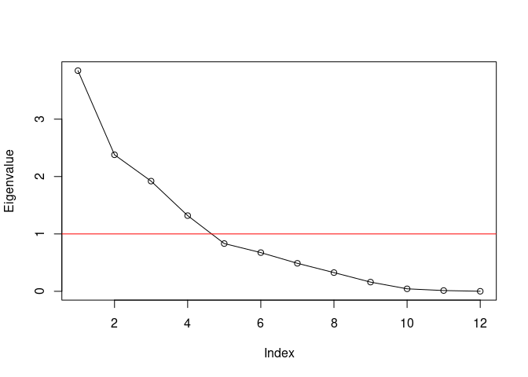
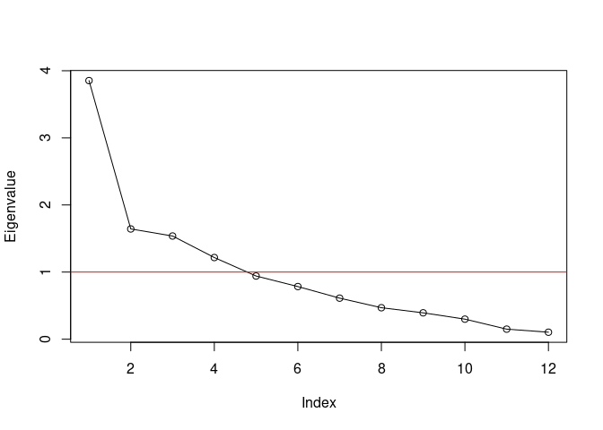
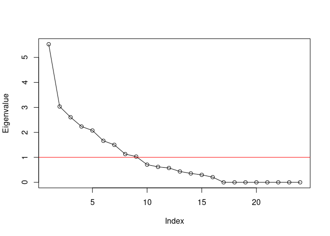

GenomicSEM of MDD symptoms
================
Mark Adams, Bradley Jermy, Jackson Thorp, Andrew Grotzinger, Michel Nivard

# Setup

## R packages

R version

``` {.r}
R.version
```

    ##                _                           
    ## platform       x86_64-pc-linux-gnu         
    ## arch           x86_64                      
    ## os             linux-gnu                   
    ## system         x86_64, linux-gnu           
    ## status                                     
    ## major          4                           
    ## minor          0.3                         
    ## year           2020                        
    ## month          10                          
    ## day            10                          
    ## svn rev        79318                       
    ## language       R                           
    ## version.string R version 4.0.3 (2020-10-10)
    ## nickname       Bunny-Wunnies Freak Out

Package installation

``` {.r}
required_packages <- c('devtools', 'readr', 'tidyr', 'dplyr', 'ggplot2', 'stringr', 'corrplot')
for(pack in required_packages) if(!require(pack, character.only=TRUE)) install.packages(pack)

if(!require(GenomicSEM)) remotes::install_github("MichelNivard/GenomicSEM")
```

GenomicSEM version

``` {.r}
require(readr)
```

    ## Loading required package: readr

``` {.r}
require(tidyr)
```

    ## Loading required package: tidyr

``` {.r}
require(stringr)
```

    ## Loading required package: stringr

``` {.r}
require(dplyr)
```

    ## Loading required package: dplyr

    ## 
    ## Attaching package: 'dplyr'

    ## The following objects are masked from 'package:stats':
    ## 
    ##     filter, lag

    ## The following objects are masked from 'package:base':
    ## 
    ##     intersect, setdiff, setequal, union

``` {.r}
require(ggplot2)
```

    ## Loading required package: ggplot2

``` {.r}
require(corrplot)
```

    ## Loading required package: corrplot

    ## corrplot 0.84 loaded

``` {.r}
require(GenomicSEM)
```

    ## Loading required package: GenomicSEM

``` {.r}
packageVersion("GenomicSEM")
```

    ## [1] '0.0.2'

# Symptom labels

MDD DSM symptoms are numbered 1-9:

``` {.r}
# plot labels

dsm_mdd_symptoms_labels <-
read_delim("
MDD1;Mood;Mood;Dep
MDD2;Interest;Interest;Anh
MDD3;Weight⇅;Weight⇆;App
MDD3a;Weight⇊;Weight⇇;AppDec
MDD3b;Weight⇈;Weight⇉;AppInc
MDD4;Sleep⇅;Sleep⇆;Sle
MDD4a;Sleep⇊;Sleep⇇;SleDec
MDD4b;Sleep⇈;Sleep⇉;SleInc
MDD5;Motor⇅;Motor⇆;Psyc
MDD5a;Motor⇈;Motor⇉;PsycInc
MDD5b;Motor⇊;Motor⇇;PsycDec
MDD6;Fatigue;Fatigue;Fatig
MDD7;Guilt;Guilt;Guilt
MDD8;Concentrate;Concentrate;Conc
MDD9;Suicidality;Suicidality;Sui
", col_names=c('ref', 'h', 'v', 'abbv'), delim=';')

dsm_mdd_symptoms_reference <-
read_delim("
MDD1;Depressed mood most of the day, nearly every day
MDD2;Markedly diminished interest or pleasure in all, or almost all, activities most of the day, nearly every day
MDD3;Significant change in weight or appetite
MDD3a;Significant weight loss or decrease in appetite
MDD3b;Significant weight gain or increase in appetite
MDD4;Sleeping too much or not sleeping enough
MDD4a;Insomnia nearly every day
MDD4b;Hypersomnia nearly every day
MDD5;Changes in speed/amount of moving or speaking
MDD5a;Psychomotor agitation nearly every day
MDD5b;Psychomotor retardation nearly every day
MDD6;Fatigue or loss of energy nearly every day
MDD7;Feelings of worthlessness or excessive or inappropriate guilt
MDD8;Diminished ability to think or concentrate, or indecisiveness
MDD9;Recurrent thoughts of death or suicide or a suicide attempt or a specific plan for attempting suicide
", col_names=c('Reference', 'Description'), delim=';')

dsm_mdd_symptoms_reference %>%
left_join(dsm_mdd_symptoms_labels, by=c('Reference'='ref')) %>%
select(Reference, Abbreviation=abbv, Label=h, Description)
```

    ## # A tibble: 15 x 4
    ##    Reference Abbreviation Label     Description                                 
    ##    <chr>     <chr>        <chr>     <chr>                                       
    ##  1 MDD1      Dep          Mood      Depressed mood most of the day, nearly ever…
    ##  2 MDD2      Anh          Interest  Markedly diminished interest or pleasure in…
    ##  3 MDD3      App          Weight⇅   Significant change in weight or appetite    
    ##  4 MDD3a     AppDec       Weight⇊   Significant weight loss or decrease in appe…
    ##  5 MDD3b     AppInc       Weight⇈   Significant weight gain or increase in appe…
    ##  6 MDD4      Sle          Sleep⇅    Sleeping too much or not sleeping enough    
    ##  7 MDD4a     SleDec       Sleep⇊    Insomnia nearly every day                   
    ##  8 MDD4b     SleInc       Sleep⇈    Hypersomnia nearly every day                
    ##  9 MDD5      Psyc         Motor⇅    Changes in speed/amount of moving or speaki…
    ## 10 MDD5a     PsycInc      Motor⇈    Psychomotor agitation nearly every day      
    ## 11 MDD5b     PsycDec      Motor⇊    Psychomotor retardation nearly every day    
    ## 12 MDD6      Fatig        Fatigue   Fatigue or loss of energy nearly every day  
    ## 13 MDD7      Guilt        Guilt     Feelings of worthlessness or excessive or i…
    ## 14 MDD8      Conc         Concentr… Diminished ability to think or concentrate,…
    ## 15 MDD9      Sui          Suicidal… Recurrent thoughts of death or suicide or a…

# GenomicSEM covariance structure

``` {.r}
covstruct_prefix <- 'agds_pgc.alspac_ukb'
covstruct_r <- file.path('ldsc', paste(covstruct_prefix, 'hdl.covstruct', 'deparse.R', sep='.'))
covstruct_rds <- file.path('ldsc', paste(covstruct_prefix, 'hdl.covstruct', 'rds', sep='.'))

symptoms_covstruct <- dget(covstruct_r)

sumstats_prevs <- read_tsv(file.path('ldsc', paste(covstruct_prefix, 'covstruct', 'prevs', 'txt', sep='.')))
```

    ## 
    ## ── Column specification ───────────────────────────────────────────────────────────
    ## cols(
    ##   cohorts = col_character(),
    ##   symptom = col_character(),
    ##   sumstats = col_character(),
    ##   Nca = col_double(),
    ##   Nco = col_double(),
    ##   samp_prev = col_double(),
    ##   filename = col_character(),
    ##   pop_prev = col_double(),
    ##   trait_name = col_character()
    ## )

Rename samples: AGDS/PGC is the **Clin**ical sample (`Clin`) and ALSPAC/UKB is the **Pop**ulation sample (`Pop`); and rename symptoms numbers (`MDD1`, `MDD2`) to abbreviations (`Dep`, `Anh`)

``` {.r}
cohorts_sample_symptoms <-
sumstats_prevs %>%
left_join(dsm_mdd_symptoms_labels, by=c('symptom'='ref')) %>%
select(cohorts, symptom, trait_name, abbv) %>%
mutate(Sample=case_when(cohorts %in% 'AGDS_PGC' ~ 'Clin',
                        cohorts %in% 'ALSPAC_UKB' ~ 'Pop',
                        TRUE ~ NA_character_)) %>%
mutate(sample_symptom=paste0(Sample, abbv))

sample_symptoms <- cohorts_sample_symptoms$sample_symptom
names(sample_symptoms) <- cohorts_sample_symptoms$trait_name

# rename traits in covstruct
dimnames(symptoms_covstruct$S)[[2]] <-
as.vector(sample_symptoms[dimnames(symptoms_covstruct$S)[[2]]])
```

# Structural models

## ADGS-PGC

### Common factor

Common factor model. Allow residual negative correlation between directional symptoms

``` {.r}
pgc_commonfactor.model <- "
A1 =~ NA*ClinAppDec + ClinAppInc + ClinSleDec + ClinSleInc + ClinPsycInc + ClinSui
A1 ~~ 1*A1
c3a3b > -1
ClinAppDec ~~ c3a3b*ClinAppInc
"
pgc_commonfactor.fit <- usermodel(symptoms_covstruct, estimation='DWLS', model=pgc_commonfactor.model)
```

    ## [1] "Running primary model"
    ## [1] "Calculating model chi-square"
    ## [1] "Calculating CFI"
    ## [1] "Calculating Standardized Results"

    ## Warning in sqrt(1/diag(V)): NaNs produced

    ## Warning in cov2cor(Sigma.hat): diag(.) had 0 or NA entries; non-finite result is
    ## doubtful

    ## Warning in sqrt(1/diag(V)): NaNs produced

    ## Warning in cov2cor(Sigma.hat): diag(.) had 0 or NA entries; non-finite result is
    ## doubtful

    ## [1] "Calculating SRMR"

    ## Warning in sqrt(1/diag(V)): NaNs produced

    ## Warning in sqrt(1/diag(V)): diag(.) had 0 or NA entries; non-finite result is
    ## doubtful

    ## Warning in usermodel(symptoms_covstruct, estimation = "DWLS", model =
    ## pgc_commonfactor.model): CFI estimates below 0 should not be trusted, and
    ## indicate that the other model fit estimates should be interpreted with caution.
    ## A negative CFI estimates typically appears due to negative residual variances.

    ## elapsed 
    ##   4.815 
    ## [1] "The S matrix was smoothed prior to model estimation due to a non-positive definite matrix. The largest absolute difference in a cell between the smoothed and non-smoothed matrix was  0.0413841400171649 As a result of the smoothing, the largest Z-statistic change for the genetic covariances was  Inf . We recommend setting the smooth_check argument to true if you are going to run a multivariate GWAS."

    ## Warning in usermodel(symptoms_covstruct, estimation = "DWLS", model =
    ## pgc_commonfactor.model): A difference greater than .025 was observed pre-
    ## and post-smoothing in the genetic covariance matrix. This reflects a large
    ## difference and results should be interpreted with caution!! This can often
    ## result from including low powered traits, and you might consider removing those
    ## traits from the model. If you are going to run a multivariate GWAS we strongly
    ## recommend setting the smooth_check argument to true to check smoothing for each
    ## SNP.

    ## Warning in usermodel(symptoms_covstruct, estimation = "DWLS", model =
    ## pgc_commonfactor.model): A difference greater than .025 was observed pre- and
    ## post-smoothing for Z-statistics in the genetic covariance matrix. This reflects
    ## a large difference and results should be interpreted with caution!! This can
    ## often result from including low powered traits, and you might consider removing
    ## those traits from the model. If you are going to run a multivariate GWAS we
    ## strongly recommend setting the smooth_check argument to true to check smoothing
    ## for each SNP.

``` {.r}
pgc_commonfactor.fit$modelfit
```

    ##       chisq df p_chisq      AIC       CFI     SRMR
    ## df 5060.763  8       0 5086.763 -344.7137 4.173172

``` {.r}
pgc_commonfactor.fit$results[c(1,2,3,6,7)]
```

    ##            lhs op         rhs STD_Genotype   STD_Genotype_SE
    ## 1           A1 =~  ClinAppDec   0.47271484 0.277466263502441
    ## 2           A1 =~  ClinAppInc   0.07791973 0.251847211537343
    ## 3           A1 =~  ClinSleDec   0.79084849 0.468792642740463
    ## 4           A1 =~  ClinSleInc  -0.16669966 0.292382046629736
    ## 5           A1 =~ ClinPsycInc   0.92289013 0.511221543230232
    ## 6           A1 =~     ClinSui   0.15801167 0.301647613223022
    ## 7           A1 ~~          A1   1.00000000                  
    ## 8   ClinAppDec ~~  ClinAppDec   0.77654047 0.293579336789171
    ## 9   ClinAppDec ~~  ClinAppInc  -0.87888180 0.240238866964962
    ## 10  ClinAppInc ~~  ClinAppInc   0.99392848 0.123240692120005
    ## 11  ClinSleDec ~~  ClinSleDec   0.37455876 0.745504502471768
    ## 12  ClinSleInc ~~  ClinSleInc   0.97221126 0.254603943881006
    ## 13 ClinPsycInc ~~ ClinPsycInc   0.14827349   1.0162181761825
    ## 14     ClinSui ~~     ClinSui   0.97503241  0.21224591024852

``` {.r}
fit_graph <- function(results, ...) {

  results_sort <- results %>% arrange(lhs, rhs)

  node_names <- unique(c(results_sort$lhs, results_sort$rhs))
  
  node_idx <- seq_along(node_names)
  names(node_idx) <- node_names
  
  graph <- create_graph(
    nodes_df=create_node_df(n=length(node_names),
                            label=node_labels[node_names], 
                            shape='oval', width=1,
                            fillcolor=node_colors[node_names],
                            fontcolor='black'),
    edges_df=create_edge_df(from=node_idx[results_sort$lhs],
                            to=node_idx[results_sort$rhs],
                            label=round(results_sort$STD_Genotype, 2),
                            penwidth=0.3+abs(2*results_sort$STD_Genotype),
                            dir=edge_dir[results_sort$op]),
    attr_theme="tb")
  
  return(graph)

}

# render_fit <- function(results) render_graph(fit_graph(results))

# render_fit(pgc_commonfactor.fit$results)

# pgc_commonfactor.graph <- fit_graph(pgc_commonfactor.fit$results)

add_rank_same <- function(gv, top, bottom) {

  # add in block to specify node ranks
  gv.list <- str_split(gv, '\n\n')[[1]]
  
  # move the nodes/edges element to the end
  gv.list[6] <- gv.list[5]
  
  # add manually made ranks
  gv.list[5] <- paste("{rank=same",
  paste(paste0("'", top, "'"), collapse=' '),
  "}\n{rank=same",
  paste(paste0("'", bottom, "'"), collapse=' '),
  "}")
  
  rank.gv <- paste(gv.list, collapse='\n\n')

}


# pgc_commonfactor.gv <- add_rank_same(generate_dot(pgc_commonfactor.graph), 1, 2:5)
# grViz(pgc_commonfactor.gv)

# # output as a GraphViz dot file. Replace single quotes with double quotes 
# # as that's what the command line utility expects
# cat(str_replace_all(pgc_commonfactor_rank.gv, "'", '"'), file='mdd-symptom-gsem_files/pgc_commonfactor.gv')
```

## ALSPAC-UKB (Population)

### Common factor

Common factor model

``` {.r}
pop_commonfactor.model <- "
A1 =~ NA*PopDep + PopAnh + PopAppDec + PopAppInc + PopSleDec + PopSleInc + PopFatig + PopGuilt + PopConc + PopSui
A1 ~~ 1*A1
"
pop_commonfactor.fit <- usermodel(symptoms_covstruct, estimation='DWLS', model=pop_commonfactor.model)
```

    ## [1] "Running primary model"
    ## [1] "Calculating model chi-square"
    ## [1] "Calculating CFI"
    ## [1] "Calculating Standardized Results"
    ## [1] "Calculating SRMR"
    ## elapsed 
    ##   1.492 
    ## [1] "The S matrix was smoothed prior to model estimation due to a non-positive definite matrix. The largest absolute difference in a cell between the smoothed and non-smoothed matrix was  0.00320242979228444 As a result of the smoothing, the largest Z-statistic change for the genetic covariances was  0.503272846601034 . We recommend setting the smooth_check argument to true if you are going to run a multivariate GWAS."

    ## Warning in usermodel(symptoms_covstruct, estimation = "DWLS", model =
    ## pop_commonfactor.model): A difference greater than .025 was observed pre- and
    ## post-smoothing for Z-statistics in the genetic covariance matrix. This reflects
    ## a large difference and results should be interpreted with caution!! This can
    ## often result from including low powered traits, and you might consider removing
    ## those traits from the model. If you are going to run a multivariate GWAS we
    ## strongly recommend setting the smooth_check argument to true to check smoothing
    ## for each SNP.

``` {.r}
pop_commonfactor.fit$modelfit
```

    ##       chisq df      p_chisq      AIC       CFI      SRMR
    ## df 245.2898 35 2.129054e-33 285.2898 0.8227775 0.1111411

``` {.r}
pop_commonfactor.fit$results[c(1, 2, 3, 6, 7)]
```

    ##          lhs op       rhs STD_Genotype    STD_Genotype_SE
    ## 1         A1 =~    PopDep   0.73460021 0.0740542039341801
    ## 2         A1 =~    PopSui   0.41087862  0.128534558295552
    ## 3         A1 =~    PopAnh   0.95016648 0.0663930478540932
    ## 4         A1 =~ PopAppDec   0.03904371 0.0974078976913486
    ## 5         A1 =~ PopAppInc   0.41273435 0.0952632970077201
    ## 6         A1 =~ PopSleDec   0.51548347  0.117153334635342
    ## 7         A1 =~ PopSleInc   0.49496506  0.086329277654511
    ## 8         A1 =~  PopFatig   0.61717068  0.120138230489785
    ## 9         A1 =~  PopGuilt   0.57586174 0.0850086552581239
    ## 10        A1 =~   PopConc   0.79005027  0.103433363509584
    ## 11        A1 ~~        A1   1.00000000                   
    ## 12    PopDep ~~    PopDep   0.46036242 0.0972049716878203
    ## 13    PopSui ~~    PopSui   0.83117988  0.174781896420657
    ## 14    PopAnh ~~    PopAnh   0.09718396  0.112184120149549
    ## 15 PopAppDec ~~ PopAppDec   0.99847568  0.170918302877543
    ## 16 PopAppInc ~~ PopAppInc   0.82965030  0.148711133820439
    ## 17 PopSleDec ~~ PopSleDec   0.73427690  0.217346735183567
    ## 18 PopSleInc ~~ PopSleInc   0.75500949   0.17737971078773
    ## 19  PopFatig ~~  PopFatig   0.61910108  0.177071518447015
    ## 20  PopGuilt ~~  PopGuilt   0.66838393  0.156451871586094
    ## 21   PopConc ~~   PopConc   0.37582075  0.201340098838106

Remove common variance shared between the gating items (Mood: `UKB_CIDI1`, Interest: `UKB_CIDI2`) that is uncorrelated with the common factor variance, to recover the genetic structure among gated items

``` {.r}
pop_commonfactor_gating.model <- "
A1 =~ NA*PopDep + PopAnh + PopAppDec + PopAppInc + PopSleDec + PopSleInc + PopFatig + PopGuilt + PopConc + PopSui
A1 ~~ 1*A1
PopDep ~~ PopAnh
c2 > 0.001
PopAnh ~~ c2*PopAnh
"
pop_commonfactor_gating.fit <- usermodel(symptoms_covstruct, estimation='DWLS', model=pop_commonfactor_gating.model)
```

    ## [1] "Running primary model"
    ## [1] "Calculating model chi-square"
    ## [1] "Calculating CFI"
    ## [1] "Calculating Standardized Results"
    ## [1] "Calculating SRMR"
    ## elapsed 
    ##    8.14 
    ## [1] "The S matrix was smoothed prior to model estimation due to a non-positive definite matrix. The largest absolute difference in a cell between the smoothed and non-smoothed matrix was  0.00320242979228444 As a result of the smoothing, the largest Z-statistic change for the genetic covariances was  0.503272846601034 . We recommend setting the smooth_check argument to true if you are going to run a multivariate GWAS."

    ## Warning in usermodel(symptoms_covstruct, estimation = "DWLS", model =
    ## pop_commonfactor_gating.model): A difference greater than .025 was observed
    ## pre- and post-smoothing for Z-statistics in the genetic covariance matrix. This
    ## reflects a large difference and results should be interpreted with caution!!
    ## This can often result from including low powered traits, and you might consider
    ## removing those traits from the model. If you are going to run a multivariate
    ## GWAS we strongly recommend setting the smooth_check argument to true to check
    ## smoothing for each SNP.

``` {.r}
pop_commonfactor_gating.fit$modelfit
```

    ##       chisq df      p_chisq      AIC       CFI      SRMR
    ## df 188.8045 34 2.292324e-23 230.8045 0.8695379 0.1106203

``` {.r}
pop_commonfactor_gating.fit$results[c(1, 2, 3, 6, 7)]
```

    ##          lhs op       rhs STD_Genotype    STD_Genotype_SE
    ## 1         A1 =~    PopDep  0.811066842  0.123875372318493
    ## 2         A1 =~    PopSui  0.412803497  0.125482235939184
    ## 3         A1 =~    PopAnh  1.004617937  0.111460513601276
    ## 4         A1 =~ PopAppDec  0.038825689 0.0938965917062236
    ## 5         A1 =~ PopAppInc  0.400199516 0.0969013153986057
    ## 6         A1 =~ PopSleDec  0.497146694  0.111028608752283
    ## 7         A1 =~ PopSleInc  0.480149241 0.0857452030915976
    ## 8         A1 =~  PopFatig  0.590805900  0.116755536418035
    ## 9         A1 =~  PopGuilt  0.558648196 0.0830007770341956
    ## 10        A1 =~   PopConc  0.755150631  0.102716104236685
    ## 11        A1 ~~        A1  1.000000000                   
    ## 12    PopDep ~~    PopDep  0.342170336  0.193305543206936
    ## 13    PopDep ~~    PopAnh -0.188755750  0.195671759398809
    ## 14    PopSui ~~    PopSui  0.829593223   0.17263333948902
    ## 15    PopAnh ~~    PopAnh  0.001000514   0.21045646705555
    ## 16 PopAppDec ~~ PopAppDec  0.998492536  0.170935981862467
    ## 17 PopAppInc ~~ PopAppInc  0.839840147  0.148311070963703
    ## 18 PopSleDec ~~ PopSleDec  0.752843845  0.214380199416821
    ## 19 PopSleInc ~~ PopSleInc  0.769456497   0.17672307052953
    ## 20  PopFatig ~~  PopFatig  0.650947794   0.17308846266628
    ## 21  PopGuilt ~~  PopGuilt  0.687911601  0.152601974646333
    ## 22   PopConc ~~   PopConc  0.429746028   0.19417383228781

Check if model is improved by allowing residual correlations between the directional symptoms.

``` {.r}
pop_commonfactor_app.model <- "
A1 =~ NA*PopDep + PopAnh + PopAppDec + PopAppInc + PopSleDec + PopSleInc + PopFatig + PopGuilt + PopConc + PopSui
A1 ~~ 1*A1
PopDep ~~ PopAnh
PopAppDec ~~ PopAppInc
c2 > 0.001
PopAnh ~~ c2*PopAnh
"
pop_commonfactor_app.fit <- usermodel(symptoms_covstruct, estimation='DWLS', model=pop_commonfactor_app.model)
```

    ## [1] "Running primary model"
    ## [1] "Calculating model chi-square"
    ## [1] "Calculating CFI"
    ## [1] "Calculating Standardized Results"
    ## [1] "Calculating SRMR"
    ## elapsed 
    ##   8.427 
    ## [1] "The S matrix was smoothed prior to model estimation due to a non-positive definite matrix. The largest absolute difference in a cell between the smoothed and non-smoothed matrix was  0.00320242979228444 As a result of the smoothing, the largest Z-statistic change for the genetic covariances was  0.503272846601034 . We recommend setting the smooth_check argument to true if you are going to run a multivariate GWAS."

    ## Warning in usermodel(symptoms_covstruct, estimation = "DWLS", model =
    ## pop_commonfactor_app.model): A difference greater than .025 was observed pre-
    ## and post-smoothing for Z-statistics in the genetic covariance matrix. This
    ## reflects a large difference and results should be interpreted with caution!!
    ## This can often result from including low powered traits, and you might consider
    ## removing those traits from the model. If you are going to run a multivariate
    ## GWAS we strongly recommend setting the smooth_check argument to true to check
    ## smoothing for each SNP.

``` {.r}
pop_commonfactor_app.fit$modelfit
```

    ##      chisq df      p_chisq     AIC       CFI      SRMR
    ## df 181.732 33 1.809393e-22 225.732 0.8746556 0.1096971

``` {.r}
pop_commonfactor_sle.model <- "
A1 =~ NA*PopDep + PopAnh + PopAppDec + PopAppInc + PopSleDec + PopSleInc + PopFatig + PopGuilt + PopConc + PopSui
A1 ~~ 1*A1
PopDep ~~ PopAnh
PopSleDec ~~ PopSleInc
c2 > 0.001
PopAnh ~~ c2*PopAnh
"
pop_commonfactor_sle.fit <- usermodel(symptoms_covstruct, estimation='DWLS', model=pop_commonfactor_sle.model)
```

    ## [1] "Running primary model"
    ## [1] "Calculating model chi-square"
    ## [1] "Calculating CFI"
    ## [1] "Calculating Standardized Results"
    ## [1] "Calculating SRMR"
    ## elapsed 
    ##  10.447 
    ## [1] "The S matrix was smoothed prior to model estimation due to a non-positive definite matrix. The largest absolute difference in a cell between the smoothed and non-smoothed matrix was  0.00320242979228444 As a result of the smoothing, the largest Z-statistic change for the genetic covariances was  0.503272846601034 . We recommend setting the smooth_check argument to true if you are going to run a multivariate GWAS."

    ## Warning in usermodel(symptoms_covstruct, estimation = "DWLS", model =
    ## pop_commonfactor_sle.model): A difference greater than .025 was observed pre-
    ## and post-smoothing for Z-statistics in the genetic covariance matrix. This
    ## reflects a large difference and results should be interpreted with caution!!
    ## This can often result from including low powered traits, and you might consider
    ## removing those traits from the model. If you are going to run a multivariate
    ## GWAS we strongly recommend setting the smooth_check argument to true to check
    ## smoothing for each SNP.

``` {.r}
pop_commonfactor_sle.fit$modelfit
```

    ##       chisq df      p_chisq      AIC      CFI      SRMR
    ## df 174.3415 33 3.859838e-21 218.3415 0.880884 0.1050545

``` {.r}
pop_commonfactor_app_sle.model <- "
A1 =~ NA*PopDep + PopAnh + PopAppDec + PopAppInc + PopSleDec + PopSleInc + PopFatig + PopGuilt + PopConc + PopSui
A1 ~~ 1*A1
PopDep ~~ PopAnh
PopAppDec ~~ PopAppInc
PopSleDec ~~ PopSleInc
c2 > 0.001
PopAnh ~~ c2*PopAnh
"
pop_commonfactor_app_sle.fit <- usermodel(symptoms_covstruct, estimation='DWLS', model=pop_commonfactor_app_sle.model)
```

    ## [1] "Running primary model"
    ## [1] "Calculating model chi-square"
    ## [1] "Calculating CFI"
    ## [1] "Calculating Standardized Results"
    ## [1] "Calculating SRMR"
    ## elapsed 
    ##  10.965 
    ## [1] "The S matrix was smoothed prior to model estimation due to a non-positive definite matrix. The largest absolute difference in a cell between the smoothed and non-smoothed matrix was  0.00320242979228444 As a result of the smoothing, the largest Z-statistic change for the genetic covariances was  0.503272846601034 . We recommend setting the smooth_check argument to true if you are going to run a multivariate GWAS."

    ## Warning in usermodel(symptoms_covstruct, estimation = "DWLS", model =
    ## pop_commonfactor_app_sle.model): A difference greater than .025 was observed
    ## pre- and post-smoothing for Z-statistics in the genetic covariance matrix. This
    ## reflects a large difference and results should be interpreted with caution!!
    ## This can often result from including low powered traits, and you might consider
    ## removing those traits from the model. If you are going to run a multivariate
    ## GWAS we strongly recommend setting the smooth_check argument to true to check
    ## smoothing for each SNP.

``` {.r}
pop_commonfactor_app_sle.fit$modelfit
```

    ##       chisq df      p_chisq      AIC       CFI      SRMR
    ## df 168.0816 32 2.170051e-20 214.0816 0.8853168 0.1040781

### Cognitive-Mood-Neuroveg (Kendler Neale) model

``` {.r}
pop_cog_mood_neuroveg.model <- "
A1 =~ NA*PopGuilt + PopConc + PopSui
A2 =~ NA*PopDep + PopAnh + PopGuilt
A3 =~ NA*PopSleDec + PopSleInc + PopFatig + PopAppDec + PopAppInc
A1 ~~ 1*A1
A2 ~~ 1*A2
A3 ~~ 1*A3
PopDep ~~ PopAnh
PopSleDec ~~ PopSleInc
PopAppDec ~~ PopAppInc
"
pop_cog_mood_neuroveg.fit <- usermodel(symptoms_covstruct, estimation='DWLS', model=pop_cog_mood_neuroveg.model)
```

    ## [1] "Running primary model"
    ## [1] "Error: The primary model produced correlations among your latent variables that are either greater than 1 or less than -1, or the latent variables have negative variances. \n              Consequently, model fit estimates could not be computed and results should likely not be interpreted. Results are provided below \n              to enable troubleshooting. A model constraint that constrains the latent correlations to be above -1, less than 1, or to have positive variances is suggested."
    ##           lhs op       rhs Unstandardized_Estimate          SE
    ## 1          A1 =~  PopGuilt             0.002554378 0.044488979
    ## 2          A1 =~   PopConc            -0.121489840 0.060372290
    ## 3          A1 =~    PopSui            -0.051530141 0.029553662
    ## 4          A2 =~    PopDep             0.220252862 0.035731040
    ## 5          A2 =~    PopAnh             0.289266640 0.036589628
    ## 6          A2 =~  PopGuilt             0.126891816 0.071048562
    ## 7          A3 =~ PopSleDec             0.115049052 0.025860795
    ## 8          A3 =~ PopSleInc             0.134802203 0.026724128
    ## 9          A3 =~  PopFatig             0.148061609 0.032913100
    ## 10         A3 =~ PopAppDec             0.009787161 0.019741769
    ## 11         A3 =~ PopAppInc             0.114204359 0.028240291
    ## 15     PopDep ~~    PopAnh            -0.023290065 0.017672076
    ## 16  PopSleDec ~~ PopSleInc            -0.014133550 0.006796112
    ## 17  PopAppDec ~~ PopAppInc            -0.004994801 0.007958542
    ## 133    PopDep ~~    PopDep             0.012878398 0.015432891
    ## 134    PopAnh ~~    PopAnh            -0.015769184 0.020887055
    ## 135 PopAppDec ~~ PopAppDec             0.035450287 0.006046625
    ## 136 PopAppInc ~~ PopAppInc             0.052753995 0.010873312
    ## 137 PopSleDec ~~ PopSleDec             0.026120441 0.009239080
    ## 138 PopSleInc ~~ PopSleInc             0.038940899 0.011066009
    ## 139  PopFatig ~~  PopFatig             0.031946309 0.010240296
    ## 140  PopGuilt ~~  PopGuilt             0.037495926 0.008292734
    ## 141   PopConc ~~   PopConc             0.039028524 0.016673048
    ## 142    PopSui ~~    PopSui             0.028319690 0.005905530
    ## 195        A1 ~~        A2            -1.317226872 0.678457363
    ## 196        A1 ~~        A3            -1.536299470 0.731959780
    ## 197        A2 ~~        A3             0.788587577 0.157746438

Add constraints to prevent variances from being negative and correlations from going out of bounds.

``` {.r}
pop_cog_mood_neuroveg_constr.model <- "
A1 =~ NA*PopGuilt + PopConc + PopSui
A2 =~ NA*PopDep + PopAnh + PopGuilt
A3 =~ NA*PopSleDec + PopSleInc + PopFatig + PopAppDec + PopAppInc
A1 ~~ 1*A1
A2 ~~ 1*A2
A3 ~~ 1*A3
PopDep ~~ PopAnh
PopSleDec ~~ PopSleInc
PopAppDec ~~ PopAppInc
c1 > 0.001
PopDep ~~ c1*PopDep
c2 > 0.001
PopAnh ~~ c2*PopAnh
c3a > 0.001
PopAppDec ~~ c3a*PopAppDec
c3b > 0.001
PopAppInc ~~ c3b*PopAppInc
c4a > 0.001
PopSleDec ~~ c4a*PopSleDec
c4b > 0.001
PopSleInc ~~ c4b*PopSleInc
c6 > 0.001
PopFatig ~~ c6*PopFatig
c7 > 0.001
PopGuilt ~~ c7*PopGuilt
c8 > 0.001
PopConc ~~ c8*PopConc
c9 > 0.001
PopSui ~~ c9*PopSui
a13 > -1.0
A1 ~~ a13*A3
"
pop_cog_mood_neuroveg_constr.fit <- usermodel(symptoms_covstruct, estimation='DWLS', model=pop_cog_mood_neuroveg_constr.model, fix_resid=FALSE)
```

    ## [1] "Running primary model"
    ## [1] "Calculating model chi-square"
    ## [1] "Calculating CFI"
    ## [1] "Calculating Standardized Results"
    ## [1] "Calculating SRMR"
    ## elapsed 
    ##  16.019 
    ## [1] "The S matrix was smoothed prior to model estimation due to a non-positive definite matrix. The largest absolute difference in a cell between the smoothed and non-smoothed matrix was  0.00320242979228444 As a result of the smoothing, the largest Z-statistic change for the genetic covariances was  0.503272846601034 . We recommend setting the smooth_check argument to true if you are going to run a multivariate GWAS."

    ## Warning in usermodel(symptoms_covstruct, estimation = "DWLS", model =
    ## pop_cog_mood_neuroveg_constr.model, : A difference greater than .025 was
    ## observed pre- and post-smoothing for Z-statistics in the genetic covariance
    ## matrix. This reflects a large difference and results should be interpreted
    ## with caution!! This can often result from including low powered traits, and you
    ## might consider removing those traits from the model. If you are going to run
    ## a multivariate GWAS we strongly recommend setting the smooth_check argument to
    ## true to check smoothing for each SNP.

``` {.r}
pop_cog_mood_neuroveg_constr.fit$modelfit
```

    ##       chisq df      p_chisq      AIC       CFI       SRMR
    ## df 218.3239 28 2.221665e-31 272.3239 0.8396038 0.09974221

``` {.r}
pop_cog_mood_neuroveg_constr.fit$results[c(1, 2, 3, 6, 7)]
```

    ##          lhs op       rhs STD_Genotype   STD_Genotype_SE
    ## 1         A1 =~    PopSui  0.298116572 0.165775507593409
    ## 2         A1 =~  PopGuilt -0.029640789 0.207877795059465
    ## 3         A1 =~   PopConc  0.533669742 0.255802806614133
    ## 4         A1 ~~        A1  1.000000000                  
    ## 5         A1 ~~        A2  1.377495066 0.680124013260674
    ## 6         A1 ~~        A3  1.516514837 0.696889379834329
    ## 7         A2 =~    PopDep  0.838211226 0.126897017082778
    ## 8         A2 =~    PopAnh  1.010559782 0.113456710734873
    ## 9         A2 =~  PopGuilt  0.601303793 0.319274217881704
    ## 10        A2 ~~        A2  1.000000000                  
    ## 11        A2 ~~        A3  0.842264128 0.151427604919671
    ## 12        A3 =~ PopAppDec  0.052474243 0.105244581978908
    ## 13        A3 =~ PopAppInc  0.443389688 0.109968225740271
    ## 14        A3 =~ PopSleDec  0.586981285 0.131165593711453
    ## 15        A3 =~ PopSleInc  0.561301366 0.111533808323672
    ## 16        A3 =~  PopFatig  0.636923894  0.14200481470741
    ## 17        A3 ~~        A3  1.000000000                  
    ## 18    PopDep ~~    PopDep  0.297402845 0.207296210341494
    ## 19    PopDep ~~    PopAnh -0.221006149 0.211648076303015
    ## 20    PopSui ~~    PopSui  0.911126452 0.190631915219373
    ## 21    PopAnh ~~    PopAnh  0.001000027 0.223778116140706
    ## 22 PopAppDec ~~ PopAppDec  0.997246464 0.170075180853537
    ## 23 PopAppDec ~~ PopAppInc -0.103435624 0.164709921819383
    ## 24 PopAppInc ~~ PopAppInc  0.803405667 0.164901410445947
    ## 25 PopSleDec ~~ PopSleDec  0.655452954 0.236035909514906
    ## 26 PopSleDec ~~ PopSleInc -0.300464735 0.142960451512499
    ## 27 PopSleInc ~~ PopSleInc  0.684940929 0.193322054679044
    ## 28  PopFatig ~~  PopFatig  0.594327913 0.189851754316611
    ## 29  PopGuilt ~~  PopGuilt  0.686657476  0.15492351254405
    ## 30   PopConc ~~   PopConc  0.715196411  0.30996441310434

### Two-factor models

[Elhai Psychiat Res 2012](https://www.sciencedirect.com/science/article/pii/S0165178112002685) compared 3 two-factor models

### Psychological-Somatic (Elhai Model 2a)

[Kruse Rehab Psychol 2008](https://psycnet.apa.org/record/2008-17022-011), [Kruse Arch Psys Med Rehab 2010](https://www.sciencedirect.com/science/article/pii/S0003999310002443):

> the 2-factor solution with 3 somatic items (sleep disturbance, poor energy, appetite change) was a better solution than either a unidimensional model or 2-factor model that included psychomotor retardation as a fourth somatic item

``` {.r}
pop_psych_soma.model <- "
A1 =~ NA*PopDep + PopAnh + PopGuilt + PopConc + PopSui 
A2 =~ NA*PopAppDec + PopAppInc + PopSleDec + PopSleInc + PopFatig
A1 ~~ 1*A1
A2 ~~ 1*A2
PopDep ~~ PopAnh
c2 > 0.001
PopAnh ~~ c2*PopAnh
"
pop_psych_soma.fit <- usermodel(symptoms_covstruct, estimation='DWLS', model=pop_psych_soma.model)
```

    ## [1] "Running primary model"
    ## [1] "Calculating model chi-square"
    ## [1] "Calculating CFI"
    ## [1] "Calculating Standardized Results"
    ## [1] "Calculating SRMR"
    ## elapsed 
    ##   8.312 
    ## [1] "The S matrix was smoothed prior to model estimation due to a non-positive definite matrix. The largest absolute difference in a cell between the smoothed and non-smoothed matrix was  0.00320242979228444 As a result of the smoothing, the largest Z-statistic change for the genetic covariances was  0.503272846601034 . We recommend setting the smooth_check argument to true if you are going to run a multivariate GWAS."

    ## Warning in usermodel(symptoms_covstruct, estimation = "DWLS", model =
    ## pop_psych_soma.model): A difference greater than .025 was observed pre- and
    ## post-smoothing for Z-statistics in the genetic covariance matrix. This reflects
    ## a large difference and results should be interpreted with caution!! This can
    ## often result from including low powered traits, and you might consider removing
    ## those traits from the model. If you are going to run a multivariate GWAS we
    ## strongly recommend setting the smooth_check argument to true to check smoothing
    ## for each SNP.

``` {.r}
pop_psych_soma.fit$model_fit
```

    ## NULL

``` {.r}
pop_psych_soma.fit$results[c(1, 2, 3, 6, 7)]
```

    ##          lhs op       rhs  STD_Genotype    STD_Genotype_SE
    ## 1         A1 =~    PopDep  0.8121982324   0.12011912655653
    ## 2         A1 =~    PopSui  0.4130642596  0.125528393301666
    ## 3         A1 =~    PopAnh  1.0049819707  0.107798702171231
    ## 4         A1 =~  PopGuilt  0.5587550728 0.0830908314289445
    ## 5         A1 =~   PopConc  0.7548743494  0.102324308041983
    ## 6         A1 ~~        A1  1.0000000000                   
    ## 7         A1 ~~        A2  0.9890376326  0.170599449266343
    ## 8         A2 =~ PopAppDec  0.0391191732 0.0942373666410064
    ## 9         A2 =~ PopAppInc  0.4036288165  0.110621495504342
    ## 10        A2 =~ PopSleDec  0.5006964781  0.130847925351322
    ## 11        A2 =~ PopSleInc  0.4841037418  0.112168002709122
    ## 12        A2 =~  PopFatig  0.5959057325  0.152676369137024
    ## 13        A2 ~~        A2  1.0000000000                   
    ## 14    PopDep ~~    PopDep  0.3403346223  0.188788690224937
    ## 15    PopDep ~~    PopAnh -0.1901880320  0.191270827251159
    ## 16    PopSui ~~    PopSui  0.8293778570  0.172633115111257
    ## 17    PopAnh ~~    PopAnh  0.0009995526  0.203920396754825
    ## 18 PopAppDec ~~ PopAppDec  0.9984696889  0.170919856912131
    ## 19 PopAppInc ~~ PopAppInc  0.8370838457  0.159030789210037
    ## 20 PopSleDec ~~ PopSleDec  0.7493029061  0.225278743673301
    ## 21 PopSleInc ~~ PopSleInc  0.7656437222  0.185752019594159
    ## 22  PopFatig ~~  PopFatig  0.6448966552  0.193542915428449
    ## 23  PopGuilt ~~  PopGuilt  0.6877923904  0.152698482430686
    ## 24   PopConc ~~   PopConc  0.4301634953  0.195557265300109

Bifactor model

``` {.r}
pop_psych_soma_bif.model <- "
A1 =~ NA*PopDep + PopAnh + PopGuilt + PopConc + PopSui
A2 =~ NA*PopAppDec + PopAppInc + PopSleDec + PopSleInc + PopFatig
A  =~ NA*PopDep + PopAnh + PopGuilt + PopConc + PopSui + PopAppDec + PopAppInc + PopSleDec + PopSleInc + PopFatig
A1 ~~ 1*A1
A2 ~~ 1*A2
A  ~~ 1*A
A  ~~ 0*A1
A  ~~ 0*A2
A1 ~~ 0*A2
"
pop_psych_soma_bif.fit <- usermodel(symptoms_covstruct, estimation='DWLS', model=pop_psych_soma_bif.model)
```

    ## [1] "Running primary model"
    ## [1] "Calculating model chi-square"
    ## [1] "Calculating CFI"
    ## [1] "Calculating Standardized Results"
    ## [1] "Calculating SRMR"
    ## elapsed 
    ##   2.001 
    ## [1] "The S matrix was smoothed prior to model estimation due to a non-positive definite matrix. The largest absolute difference in a cell between the smoothed and non-smoothed matrix was  0.00320242979228444 As a result of the smoothing, the largest Z-statistic change for the genetic covariances was  0.503272846601034 . We recommend setting the smooth_check argument to true if you are going to run a multivariate GWAS."

    ## Warning in usermodel(symptoms_covstruct, estimation = "DWLS", model =
    ## pop_psych_soma_bif.model): A difference greater than .025 was observed pre- and
    ## post-smoothing for Z-statistics in the genetic covariance matrix. This reflects
    ## a large difference and results should be interpreted with caution!! This can
    ## often result from including low powered traits, and you might consider removing
    ## those traits from the model. If you are going to run a multivariate GWAS we
    ## strongly recommend setting the smooth_check argument to true to check smoothing
    ## for each SNP.

``` {.r}
pop_psych_soma_bif.fit$model
```

    ##       chisq df     p_chisq      AIC       CFI       SRMR
    ## df 157.3714 25 3.64222e-21 217.3714 0.8884435 0.07667285

``` {.r}
pop_psych_soma_bif.fit$results[c(1,2,3,6,7)]
```

    ##          lhs op       rhs STD_Genotype    STD_Genotype_SE
    ## 1          A =~    PopDep   0.63242441  0.124273610401662
    ## 2          A =~    PopSui   0.29160640  0.147810558709788
    ## 3          A =~    PopAnh   0.87316166  0.111960030607223
    ## 4          A =~ PopAppDec   0.04666497  0.109346161356345
    ## 5          A =~ PopAppInc   0.43906503  0.104845199841333
    ## 6          A =~ PopSleDec   0.58468194   0.11199880779669
    ## 7          A =~ PopSleInc   0.57527754 0.0956861795158854
    ## 8          A =~  PopFatig   0.66411859  0.132655711646506
    ## 9          A =~  PopGuilt   0.46029660  0.102009782760464
    ## 10         A =~   PopConc   0.93831752  0.125458695880869
    ## 11         A ~~         A   1.00000000                   
    ## 12        A1 =~    PopDep   0.49211188  0.208349434179829
    ## 13        A1 =~    PopSui   0.57880521  0.270044515991739
    ## 14        A1 =~    PopAnh   0.26150952  0.221699838732939
    ## 15        A1 =~  PopGuilt   0.44381996   0.15624697397035
    ## 16        A1 =~   PopConc  -0.17956174  0.250074002911508
    ## 17        A1 ~~        A1   1.00000000                   
    ## 18        A2 =~ PopAppDec   0.39533276  0.225719969443805
    ## 19        A2 =~ PopAppInc   0.02374755  0.179078385586463
    ## 20        A2 =~ PopSleDec   0.73585148  0.416654531244761
    ## 21        A2 =~ PopSleInc  -0.44411891  0.270371011084287
    ## 22        A2 =~  PopFatig  -0.11999427  0.211396380810434
    ## 23        A2 ~~        A2   1.00000000                   
    ## 24    PopDep ~~    PopDep   0.35786506  0.131254026311042
    ## 25    PopSui ~~    PopSui   0.57995043  0.301353531021856
    ## 26    PopAnh ~~    PopAnh   0.16920175  0.113478369615701
    ## 27 PopAppDec ~~ PopAppDec   0.84153484  0.218316890351197
    ## 28 PopAppInc ~~ PopAppInc   0.80665825  0.157019450876711
    ## 29 PopSleDec ~~ PopSleDec   0.11666992  0.646365521931069
    ## 30 PopSleInc ~~ PopSleInc   0.47181438  0.282622422990679
    ## 31  PopFatig ~~  PopFatig   0.54454752  0.190049381975066
    ## 32  PopGuilt ~~  PopGuilt   0.59115019  0.192721029012243
    ## 33   PopConc ~~   PopConc   0.08731770  0.291068108292459

### Psychological-Neurovegetative (Elhai Model 2b)

``` {.r}
pop_psych_veg.model <- "
A1 =~ NA*PopDep + PopAnh + PopGuilt + PopSui
A2 =~ NA*PopAppDec + PopAppInc + PopSleDec + PopSleInc + PopFatig + PopConc
A1 ~~ 1*A1
A2 ~~ 1*A2
PopDep ~~ PopAnh
c2 > 0.001
PopAnh ~~ c2*PopAnh
"
pop_psych_veg.fit <- usermodel(symptoms_covstruct, estimation='DWLS', model=pop_psych_veg.model)
```

    ## [1] "Running primary model"
    ## [1] "Calculating model chi-square"
    ## [1] "Calculating CFI"
    ## [1] "Calculating Standardized Results"
    ## [1] "Calculating SRMR"
    ## elapsed 
    ##   9.798 
    ## [1] "The S matrix was smoothed prior to model estimation due to a non-positive definite matrix. The largest absolute difference in a cell between the smoothed and non-smoothed matrix was  0.00320242979228444 As a result of the smoothing, the largest Z-statistic change for the genetic covariances was  0.503272846601034 . We recommend setting the smooth_check argument to true if you are going to run a multivariate GWAS."

    ## Warning in usermodel(symptoms_covstruct, estimation = "DWLS", model =
    ## pop_psych_veg.model): A difference greater than .025 was observed pre- and post-
    ## smoothing for Z-statistics in the genetic covariance matrix. This reflects a
    ## large difference and results should be interpreted with caution!! This can often
    ## result from including low powered traits, and you might consider removing those
    ## traits from the model. If you are going to run a multivariate GWAS we strongly
    ## recommend setting the smooth_check argument to true to check smoothing for each
    ## SNP.

``` {.r}
pop_psych_veg.fit$modelfit
```

    ##       chisq df      p_chisq      AIC      CFI      SRMR
    ## df 228.0072 33 5.232636e-31 272.0072 0.835657 0.1050372

``` {.r}
pop_psych_veg.fit$results[c(1,2,3,6,7)]
```

    ##          lhs op       rhs STD_Genotype    STD_Genotype_SE
    ## 1         A1 =~    PopDep  0.860209282  0.125774590559705
    ## 2         A1 =~    PopSui  0.425404931  0.127419713925847
    ## 3         A1 =~    PopAnh  1.017605528  0.114886701000852
    ## 4         A1 =~  PopGuilt  0.559804836 0.0835229466091209
    ## 5         A1 ~~        A1  1.000000000                   
    ## 6         A1 ~~        A2  0.830009310  0.122581545676084
    ## 7         A2 =~ PopAppDec  0.041161562  0.103117973840855
    ## 8         A2 =~ PopAppInc  0.444557388  0.105346844403099
    ## 9         A2 =~ PopSleDec  0.538439814  0.119668023593489
    ## 10        A2 =~ PopSleInc  0.534767070 0.0995457069494672
    ## 11        A2 =~  PopFatig  0.649052868  0.133637061672706
    ## 12        A2 =~   PopConc  0.849226901  0.120907035435344
    ## 13        A2 ~~        A2  1.000000000                   
    ## 14    PopDep ~~    PopDep  0.260040614   0.20647261402124
    ## 15    PopDep ~~    PopAnh -0.249296854   0.21029927799201
    ## 16    PopSui ~~    PopSui  0.819030637  0.172700131082373
    ## 17    PopAnh ~~    PopAnh  0.000999951  0.226191100833992
    ## 18 PopAppDec ~~ PopAppDec  0.998305739  0.170847301414536
    ## 19 PopAppInc ~~ PopAppInc  0.802368617  0.157955995748618
    ## 20 PopSleDec ~~ PopSleDec  0.710082331  0.220398665308702
    ## 21 PopSleInc ~~ PopSleInc  0.714024284   0.18133221802745
    ## 22  PopFatig ~~  PopFatig  0.578730156  0.188939617157687
    ## 23  PopGuilt ~~  PopGuilt  0.686618778  0.154935314880014
    ## 24   PopConc ~~   PopConc  0.278813569  0.227578167577055

``` {.r}
pop_psych_veg_bif.model <- "
A1 =~ NA*PopDep + PopAnh + PopGuilt + PopSui
A2 =~ NA*PopAppDec + PopAppInc + PopSleDec + PopSleInc + PopFatig + PopConc
A  =~ NA*PopDep + PopAnh + PopGuilt + PopSui + PopAppDec + PopAppInc + PopSleDec + PopSleInc + PopFatig + PopConc
A1 ~~ 1*A1
A2 ~~ 1*A2
A  ~~ 1*A
A ~~ 0*A1
A ~~ 0*A2
A1 ~~ 0*A2
"
pop_psych_veg_bif.fit <- usermodel(symptoms_covstruct, estimation='DWLS', model=pop_psych_veg_bif.model)
```

    ## [1] "Running primary model"
    ## [1] "Calculating model chi-square"
    ## [1] "Calculating CFI"
    ## [1] "Calculating Standardized Results"
    ## [1] "Calculating SRMR"
    ## elapsed 
    ##   2.022 
    ## [1] "The S matrix was smoothed prior to model estimation due to a non-positive definite matrix. The largest absolute difference in a cell between the smoothed and non-smoothed matrix was  0.00320242979228444 As a result of the smoothing, the largest Z-statistic change for the genetic covariances was  0.503272846601034 . We recommend setting the smooth_check argument to true if you are going to run a multivariate GWAS."

    ## Warning in usermodel(symptoms_covstruct, estimation = "DWLS", model =
    ## pop_psych_veg_bif.model): A difference greater than .025 was observed pre- and
    ## post-smoothing for Z-statistics in the genetic covariance matrix. This reflects
    ## a large difference and results should be interpreted with caution!! This can
    ## often result from including low powered traits, and you might consider removing
    ## those traits from the model. If you are going to run a multivariate GWAS we
    ## strongly recommend setting the smooth_check argument to true to check smoothing
    ## for each SNP.

``` {.r}
pop_psych_veg_bif.fit$modelfit
```

    ##       chisq df      p_chisq      AIC       CFI       SRMR
    ## df 185.2047 25 2.089728e-26 245.2047 0.8649869 0.07579892

``` {.r}
pop_psych_veg_bif.fit$results[c(1,2,3,6,7)]
```

    ##          lhs op       rhs STD_Genotype   STD_Genotype_SE
    ## 1          A =~    PopDep   0.60403358 0.113576784583802
    ## 2          A =~    PopSui   0.25117343 0.130258237539264
    ## 3          A =~    PopAnh   0.85542440 0.119451261793837
    ## 4          A =~ PopAppDec   0.06232763 0.113727129037622
    ## 5          A =~ PopAppInc   0.45026253 0.103600932344416
    ## 6          A =~ PopSleDec   0.61782195 0.118948849050799
    ## 7          A =~ PopSleInc   0.57967024 0.110033516298227
    ## 8          A =~  PopFatig   0.68000562 0.136097900163044
    ## 9          A =~  PopGuilt   0.43436946 0.102086426390421
    ## 10         A =~   PopConc   0.87875774 0.121148970516016
    ## 11         A ~~         A   1.00000000                  
    ## 12        A1 =~    PopDep   0.51805451  0.18111114306736
    ## 13        A1 =~    PopSui   0.60182114 0.282689552434364
    ## 14        A1 =~    PopAnh   0.31713684 0.195212209185734
    ## 15        A1 =~  PopGuilt   0.47537769 0.156612643580553
    ## 16        A1 ~~        A1   1.00000000                  
    ## 17        A2 =~ PopAppDec   0.38244657 0.214728558805868
    ## 18        A2 =~ PopAppInc   0.01497228 0.182137943699189
    ## 19        A2 =~ PopSleDec   0.69327290 0.394453097697186
    ## 20        A2 =~ PopSleInc  -0.50693449 0.286420640272324
    ## 21        A2 =~  PopFatig  -0.13428859 0.213585885251407
    ## 22        A2 =~   PopConc  -0.15950806 0.233348670270023
    ## 23        A2 ~~        A2   1.00000000                  
    ## 24    PopDep ~~    PopDep   0.36676321 0.128681237227485
    ## 25    PopSui ~~    PopSui   0.57472330 0.322530436634871
    ## 26    PopAnh ~~    PopAnh   0.16767353 0.116381738604613
    ## 27 PopAppDec ~~ PopAppDec   0.84985022 0.209344127258151
    ## 28 PopAppInc ~~ PopAppInc   0.79704036 0.159166460404282
    ## 29 PopSleDec ~~ PopSleDec   0.13766778 0.603160270704521
    ## 30 PopSleInc ~~ PopSleInc   0.40699949 0.316791473820835
    ## 31  PopFatig ~~  PopFatig   0.51955972   0.1917515278729
    ## 32  PopGuilt ~~  PopGuilt   0.58533937 0.195381962559611
    ## 33   PopConc ~~   PopConc   0.20234160 0.236243374427244

### Affective-Neurovegetative (Elhai Model 2c)

``` {.r}
pop_affect_veg.model <- "
A1 =~ NA*PopDep + PopGuilt + PopSui
A2 =~ NA*PopAnh + PopAppInc + PopAppDec + PopSleInc + PopSleDec + PopFatig + PopConc
A1 ~~ 1*A1
A2 ~~ 1*A2
"
pop_affect_veg.fit <- usermodel(symptoms_covstruct, estimation='DWLS', model=pop_affect_veg.model)
```

    ## [1] "Running primary model"
    ## [1] "Calculating model chi-square"
    ## [1] "Calculating CFI"
    ## [1] "Calculating Standardized Results"
    ## [1] "Calculating SRMR"
    ## elapsed 
    ##   1.875 
    ## [1] "The S matrix was smoothed prior to model estimation due to a non-positive definite matrix. The largest absolute difference in a cell between the smoothed and non-smoothed matrix was  0.00320242979228444 As a result of the smoothing, the largest Z-statistic change for the genetic covariances was  0.503272846601034 . We recommend setting the smooth_check argument to true if you are going to run a multivariate GWAS."

    ## Warning in usermodel(symptoms_covstruct, estimation = "DWLS", model =
    ## pop_affect_veg.model): A difference greater than .025 was observed pre- and
    ## post-smoothing for Z-statistics in the genetic covariance matrix. This reflects
    ## a large difference and results should be interpreted with caution!! This can
    ## often result from including low powered traits, and you might consider removing
    ## those traits from the model. If you are going to run a multivariate GWAS we
    ## strongly recommend setting the smooth_check argument to true to check smoothing
    ## for each SNP.

``` {.r}
pop_affect_veg.fit$modelfit
```

    ##       chisq df      p_chisq      AIC       CFI      SRMR
    ## df 212.5519 34 1.040688e-27 254.5519 0.8495248 0.1044869

``` {.r}
pop_affect_veg.fit$results[c(1,2,3,6,7)]
```

    ##          lhs op       rhs STD_Genotype    STD_Genotype_SE
    ## 1         A1 =~    PopDep   0.85867613 0.0863146412946434
    ## 2         A1 =~    PopSui   0.47576131  0.145382830116123
    ## 3         A1 =~  PopGuilt   0.63323054 0.0950077193408101
    ## 4         A1 ~~        A1   1.00000000                   
    ## 5         A1 ~~        A2   0.77683286 0.0589751533905018
    ## 6         A2 =~    PopAnh   0.98645005 0.0732237310251043
    ## 7         A2 =~ PopAppDec   0.03705118 0.0978702153354257
    ## 8         A2 =~ PopAppInc   0.42214768  0.096976366422368
    ## 9         A2 =~ PopSleDec   0.50832798  0.117597382325426
    ## 10        A2 =~ PopSleInc   0.51242793 0.0883261283584641
    ## 11        A2 =~  PopFatig   0.63681023  0.122269582062303
    ## 12        A2 =~   PopConc   0.80974229  0.105242905370241
    ## 13        A2 ~~        A2   1.00000000                   
    ## 14    PopDep ~~    PopDep   0.26267575    0.1368735636345
    ## 15    PopSui ~~    PopSui   0.77365136  0.181225332673877
    ## 16    PopAnh ~~    PopAnh   0.02691648  0.124590488548716
    ## 17 PopAppDec ~~ PopAppDec   0.99862724  0.171007613183638
    ## 18 PopAppInc ~~ PopAppInc   0.82179196  0.150145642257348
    ## 19 PopSleDec ~~ PopSleDec   0.74160567  0.216197061201847
    ## 20 PopSleInc ~~ PopSleInc   0.73741777  0.178022543515969
    ## 21  PopFatig ~~  PopFatig   0.59447380  0.180299965202853
    ## 22  PopGuilt ~~  PopGuilt   0.59902002   0.16959056413185
    ## 23   PopConc ~~   PopConc   0.34431638   0.20565344102517

Bifactor model

``` {.r}
pop_affect_veg_bif.model <- "
A1 =~ NA*PopDep + PopGuilt + PopSui
A2 =~ NA*PopAnh + PopAppInc + PopAppDec + PopSleInc + PopSleDec + PopFatig + PopConc
A =~ NA*PopDep + PopGuilt + PopSui + PopAnh + PopAppInc + PopAppDec + PopSleInc + PopSleDec + PopFatig + PopConc
A1 ~~ 1*A1
A2 ~~ 1*A2
A  ~~ 1*A
A ~~ 0*A1
A ~~ 0*A2
A1 ~~ 0*A2
"
pop_affect_veg_bif.fit <- usermodel(symptoms_covstruct, estimation='DWLS', model=pop_affect_veg_bif.model)
```

    ## [1] "Running primary model"
    ## [1] "Calculating model chi-square"
    ## [1] "Calculating CFI"
    ## [1] "Calculating Standardized Results"
    ## [1] "Calculating SRMR"
    ## elapsed 
    ##     1.9 
    ## [1] "The S matrix was smoothed prior to model estimation due to a non-positive definite matrix. The largest absolute difference in a cell between the smoothed and non-smoothed matrix was  0.00320242979228444 As a result of the smoothing, the largest Z-statistic change for the genetic covariances was  0.503272846601034 . We recommend setting the smooth_check argument to true if you are going to run a multivariate GWAS."

    ## Warning in usermodel(symptoms_covstruct, estimation = "DWLS", model =
    ## pop_affect_veg_bif.model): A difference greater than .025 was observed pre- and
    ## post-smoothing for Z-statistics in the genetic covariance matrix. This reflects
    ## a large difference and results should be interpreted with caution!! This can
    ## often result from including low powered traits, and you might consider removing
    ## those traits from the model. If you are going to run a multivariate GWAS we
    ## strongly recommend setting the smooth_check argument to true to check smoothing
    ## for each SNP.

``` {.r}
pop_affect_veg_bif.fit$modelfit
```

    ##       chisq df     p_chisq      AIC       CFI       SRMR
    ## df 61.07608 25 7.41915e-05 121.0761 0.9695968 0.06869807

``` {.r}
pop_affect_veg_bif.fit$results[c(1,2,3,6,7)]
```

    ##          lhs op       rhs STD_Genotype    STD_Genotype_SE
    ## 1          A =~    PopDep   0.70377141  0.088208778996249
    ## 2          A =~    PopSui   0.37422244  0.125449380606646
    ## 3          A =~    PopAnh   0.90275546 0.0892916972285198
    ## 4          A =~ PopAppDec   0.13386263   0.11678238329341
    ## 5          A =~ PopAppInc   0.41028577 0.0978852299243985
    ## 6          A =~ PopSleDec   0.73285865  0.154803747874663
    ## 7          A =~ PopSleInc   0.41203693  0.123734056509106
    ## 8          A =~  PopFatig   0.56827496  0.145636622490822
    ## 9          A =~  PopGuilt   0.54434247   0.10232320209097
    ## 10         A =~   PopConc   0.73472954  0.126063738878139
    ## 11         A ~~         A   1.00000000                   
    ## 12        A1 =~    PopDep   0.69574378  0.805589917931264
    ## 13        A1 =~    PopSui   0.35692152  0.427797282110984
    ## 14        A1 =~  PopGuilt   0.20053655   0.25367143711592
    ## 15        A1 ~~        A1   1.00000000                   
    ## 16        A2 =~    PopAnh   0.35475408  0.140171887676837
    ## 17        A2 =~ PopAppDec  -0.30865327  0.207639790024029
    ## 18        A2 =~ PopAppInc   0.08182395  0.179169892499523
    ## 19        A2 =~ PopSleDec  -0.54248801  0.320231617369739
    ## 20        A2 =~ PopSleInc   0.56418895  0.223162642800546
    ## 21        A2 =~  PopFatig   0.36640298  0.212965494509706
    ## 22        A2 =~   PopConc   0.38864891  0.230603369166615
    ## 23        A2 ~~        A2   1.00000000                   
    ## 24    PopDep ~~    PopDep   0.02064632   1.12733011504582
    ## 25    PopSui ~~    PopSui   0.73256454   0.31435850671191
    ## 26    PopAnh ~~    PopAnh   0.05918188  0.132655309448895
    ## 27 PopAppDec ~~ PopAppDec   0.88681354  0.197888632939398
    ## 28 PopAppInc ~~ PopAppInc   0.82497044  0.150209281746549
    ## 29 PopSleDec ~~ PopSleDec   0.16862532  0.513989902811879
    ## 30 PopSleInc ~~ PopSleInc   0.51191715  0.251185890877732
    ## 31  PopFatig ~~  PopFatig   0.54281202  0.190297700876164
    ## 32  PopGuilt ~~  PopGuilt   0.66347577  0.180645236750232
    ## 33   PopConc ~~   PopConc   0.30912489  0.212222863717288

### Model comparisons

``` {.r}
model_fits <- 
data.frame(Model=c('1a', '1b', '1c', '1d', '1e',
                   '2a', '2a(ii)', '2b(i)', '2b(ii)',
                   '2c(i)', '2c(ii)',
                   '3(i)'),
       Name=c('Common',
              'Common (gating)',
              'Common (App)',
              'Common (Sle)',
              'Common(App,Sle)',
              'Psych-Somatic',
              'Psych-Somatic (BiF)',
              'Psych-Neuroveg',
              'Psych-Neuroveg (BiF)',
              'Affect-Neuroveg',
              'Affect-Neuroveg (BiF)',
              'Cog-Mood-Neuroveg'
              )) %>%
bind_cols(
bind_rows(
lapply(list(pop_commonfactor.fit,
            pop_commonfactor_gating.fit,
            pop_commonfactor_app.fit,
            pop_commonfactor_sle.fit,
            pop_commonfactor_app_sle.fit,
            pop_psych_soma.fit,
            pop_psych_soma_bif.fit,
            pop_psych_veg.fit,
            pop_psych_veg_bif.fit,
            pop_affect_veg.fit,
            pop_affect_veg_bif.fit,
            pop_cog_mood_neuroveg_constr.fit),
       function(fit) fit$modelfit)
))
rownames(model_fits) <- NULL
model_fits %>%
select(-chisq, -df) %>%
mutate(dAIC=AIC-min(AIC))
```

    ##     Model                  Name      p_chisq      AIC       CFI       SRMR
    ## 1      1a                Common 2.129054e-33 285.2898 0.8227775 0.11114109
    ## 2      1b       Common (gating) 2.292324e-23 230.8045 0.8695379 0.11062025
    ## 3      1c          Common (App) 1.809393e-22 225.7320 0.8746556 0.10969710
    ## 4      1d          Common (Sle) 3.859838e-21 218.3415 0.8808840 0.10505452
    ## 5      1e       Common(App,Sle) 2.170051e-20 214.0816 0.8853168 0.10407813
    ## 6      2a         Psych-Somatic 5.873696e-24 233.9395 0.8677387 0.11060875
    ## 7  2a(ii)   Psych-Somatic (BiF) 3.642220e-21 217.3714 0.8884435 0.07667285
    ## 8   2b(i)        Psych-Neuroveg 5.232636e-31 272.0072 0.8356570 0.10503719
    ## 9  2b(ii)  Psych-Neuroveg (BiF) 2.089728e-26 245.2047 0.8649869 0.07579892
    ## 10  2c(i)       Affect-Neuroveg 1.040688e-27 254.5519 0.8495248 0.10448691
    ## 11 2c(ii) Affect-Neuroveg (BiF) 7.419150e-05 121.0761 0.9695968 0.06869807
    ## 12   3(i)     Cog-Mood-Neuroveg 2.221665e-31 272.3239 0.8396038 0.09974221
    ##         dAIC
    ## 1  164.21374
    ## 2  109.72844
    ## 3  104.65591
    ## 4   97.26541
    ## 5   93.00548
    ## 6  112.86344
    ## 7   96.29530
    ## 8  150.93114
    ## 9  124.12862
    ## 10 133.47579
    ## 11   0.00000
    ## 12 151.24786

# Exploratory factor analysis

Get the genetic covariance matrix for symptoms with a positive heritability

``` {.r}
symptoms_cov <- symptoms_covstruct$S
k <- nrow(symptoms_cov)
symptoms_se <- matrix(0, k, k)
symptoms_se[lower.tri(symptoms_se, diag=TRUE)] <- sqrt(diag(symptoms_covstruct$V))

symptoms_se[upper.tri(symptoms_se)] <- t(symptoms_se)[upper.tri(symptoms_se)]

symptoms_cov_keep <- which(diag(symptoms_cov > 0))

symptoms_cov_pos <- symptoms_cov[symptoms_cov_keep,symptoms_cov_keep]
```

Smooth the genetic covariance matrix so that it is positive definite

``` {.r}
# smooth the covariance matrix
symptoms_cov_pd <- as.matrix(Matrix::nearPD(symptoms_cov_pos, corr=FALSE)$mat)

corrplot(cov2cor(symptoms_cov_pd))
```


## PGC/AGDS

Check eigen values of the correlation matrix

``` {.r}
symptoms_clin_idx <- which(str_detect(dimnames(symptoms_cov_pd)[[1]], 'Clin'))

symptoms_clin_eigen <- eigen(cov2cor(symptoms_cov_pd[symptoms_clin_idx,symptoms_clin_idx])) 

plot(symptoms_clin_eigen$values, ylab='Eigenvalue')
lines(symptoms_clin_eigen$values)
abline(1, 0, col='red')
```



``` {.r}
symptoms_clin_efa <- factanal(covmat=symptoms_cov_pd[symptoms_clin_idx,symptoms_clin_idx], factors=3, rotation='varimax')
symptoms_clin_efa
```

    ## 
    ## Call:
    ## factanal(factors = 3, covmat = symptoms_cov_pd[symptoms_clin_idx,     symptoms_clin_idx], rotation = "varimax")
    ## 
    ## Uniquenesses:
    ##     ClinDep     ClinAnh  ClinAppDec  ClinAppInc  ClinSleDec  ClinSleInc 
    ##       0.005       0.005       0.005       0.189       0.642       0.570 
    ## ClinPsycInc ClinPsycDec   ClinFatig   ClinGuilt    ClinConc     ClinSui 
    ##       0.806       0.303       0.645       0.871       0.023       0.640 
    ## 
    ## Loadings:
    ##             Factor1 Factor2 Factor3
    ## ClinDep              0.982   0.150 
    ## ClinAnh      0.168   0.976   0.119 
    ## ClinAppDec           0.183   0.976 
    ## ClinAppInc   0.641   0.276  -0.569 
    ## ClinSleDec          -0.427   0.418 
    ## ClinSleInc   0.640   0.141         
    ## ClinPsycInc  0.157           0.400 
    ## ClinPsycDec  0.815           0.183 
    ## ClinFatig    0.534          -0.262 
    ## ClinGuilt    0.206          -0.293 
    ## ClinConc     0.974  -0.140         
    ## ClinSui      0.598                 
    ## 
    ##                Factor1 Factor2 Factor3
    ## SS loadings      3.189   2.261   1.849
    ## Proportion Var   0.266   0.188   0.154
    ## Cumulative Var   0.266   0.454   0.608
    ## 
    ## The degrees of freedom for the model is 33 and the fit was 6.5329

## ALSPAC/UKB

Check eigen values of the correlation matrix

``` {.r}
symptoms_pop_idx <- which(str_detect(dimnames(symptoms_cov_pd)[[1]], 'Pop'))

symptoms_pop_eigen <- eigen(cov2cor(symptoms_cov_pd[symptoms_pop_idx,symptoms_pop_idx])) 

plot(symptoms_pop_eigen$values, ylab='Eigenvalue')
lines(symptoms_pop_eigen$values)
abline(1, 0, col='red')
```



``` {.r}
symptoms_pop_efa <- factanal(covmat=symptoms_cov_pd[symptoms_pop_idx,symptoms_pop_idx], factors=3, rotation='varimax')
symptoms_pop_efa
```

    ## 
    ## Call:
    ## factanal(factors = 3, covmat = symptoms_cov_pd[symptoms_pop_idx,     symptoms_pop_idx], rotation = "varimax")
    ## 
    ## Uniquenesses:
    ##     PopDep     PopAnh  PopAppDec  PopAppInc  PopSleDec  PopSleInc PopPsycInc 
    ##      0.469      0.092      0.963      0.786      0.696      0.667      0.005 
    ## PopPsycDec   PopFatig   PopGuilt    PopConc     PopSui 
    ##      0.005      0.503      0.667      0.347      0.733 
    ## 
    ## Loadings:
    ##            Factor1 Factor2 Factor3
    ## PopDep      0.511   0.498   0.147 
    ## PopAnh      0.806   0.437   0.258 
    ## PopAppDec                   0.187 
    ## PopAppInc   0.385   0.124  -0.226 
    ## PopSleDec   0.513  -0.139  -0.147 
    ## PopSleInc   0.569                 
    ## PopPsycInc         -0.153   0.983 
    ## PopPsycDec -0.240   0.952  -0.176 
    ## PopFatig    0.688          -0.152 
    ## PopGuilt    0.430   0.321   0.211 
    ## PopConc     0.781           0.188 
    ## PopSui      0.258   0.348   0.281 
    ## 
    ##                Factor1 Factor2 Factor3
    ## SS loadings      3.044   1.638   1.384
    ## Proportion Var   0.254   0.136   0.115
    ## Cumulative Var   0.254   0.390   0.506
    ## 
    ## The degrees of freedom for the model is 33 and the fit was 1.3684

## All symptoms

Check eigen values of the correlation matrix

``` {.r}
symptoms_cov_pd.eigen <- eigen(cov2cor(symptoms_cov_pd))

signif(symptoms_cov_pd.eigen$values, 3)
```

    ##  [1] 5.53e+00 3.03e+00 2.61e+00 2.23e+00 2.07e+00 1.66e+00 1.50e+00 1.13e+00
    ##  [9] 1.03e+00 7.09e-01 6.19e-01 5.75e-01 4.34e-01 3.56e-01 2.99e-01 2.07e-01
    ## [17] 2.69e-07 2.33e-07 1.94e-07 1.72e-07 1.67e-07 1.12e-07 4.69e-08 3.06e-08

``` {.r}
plot(eigen(cov2cor(symptoms_cov_pd))$values, ylab='Eigenvalue')
lines(eigen(cov2cor(symptoms_cov_pd))$values)
abline(1, 0, col='red')
```



Simulate uncertainty in \(\mathbf{S}\) using the \(\mathbf{V}\) matrix

``` {.r}
# replicates
m <- 100

# simulate with S as the mean and V as the variance
S_lowertri_sim = mvtnorm::rmvnorm(m,
    mean=symptoms_covstruct$S[lower.tri(symptoms_covstruct$S, diag=TRUE)],
    sigma=symptoms_covstruct$V)
    
# reshape into a 24x24xm array
S_sim <- plyr::aaply(S_lowertri_sim, 1, function(x, k=nrow(symptoms_covstruct$S)){
    S <- matrix(NA, ncol=k, nrow=k)
    S[lower.tri(S, diag=T)] <- x
    S[upper.tri(S, diag=T)] <- t(S)[upper.tri(S, diag=T)]
    return(S)
})
dimnames(S_sim) <- list(1:m, colnames(symptoms_cov), colnames(symptoms_cov))

# find which symptoms have positive variances across all replicates
sim_cov_keep <- which(colSums(plyr::aaply(S_sim, 1, diag) > 0) == m)

eigen(cov2cor(symptoms_covstruct$S[sim_cov_keep,sim_cov_keep]))$values
```

    ##  [1]  7.5052818  5.1712519  3.7425629  2.6386342  2.3730357  1.6913698
    ##  [7]  1.4492533  1.1899598  0.9419901  0.7532313  0.6077189  0.5502851
    ## [13]  0.4101393  0.3049773  0.2529266 -0.0350118 -0.1127862 -0.6430436
    ## [19] -1.2420131 -1.5318487 -5.0179145

``` {.r}
S_sim_pos <- S_sim[,sim_cov_keep,sim_cov_keep]

S_sim_pos_ev <- plyr::aaply(S_sim_pos, 1, function(x) eigen(cov2cor(x))$values)

summary(S_sim_pos_ev)
```

    ##        1                2               3               4        
    ##  Min.   : 5.796   Min.   :4.116   Min.   :3.196   Min.   :2.554  
    ##  1st Qu.: 7.966   1st Qu.:5.555   1st Qu.:3.955   1st Qu.:3.098  
    ##  Median : 8.572   Median :6.320   Median :4.421   Median :3.328  
    ##  Mean   : 8.975   Mean   :6.380   Mean   :4.524   Mean   :3.365  
    ##  3rd Qu.: 9.487   3rd Qu.:6.920   3rd Qu.:4.887   3rd Qu.:3.573  
    ##  Max.   :25.085   Max.   :9.379   Max.   :8.082   Max.   :4.592  
    ##        5               6               7               8        
    ##  Min.   :2.095   Min.   :1.773   Min.   :1.316   Min.   :1.018  
    ##  1st Qu.:2.551   1st Qu.:2.093   1st Qu.:1.607   1st Qu.:1.299  
    ##  Median :2.787   Median :2.236   Median :1.786   Median :1.402  
    ##  Mean   :2.775   Mean   :2.260   Mean   :1.783   Mean   :1.426  
    ##  3rd Qu.:3.003   3rd Qu.:2.374   3rd Qu.:1.950   3rd Qu.:1.555  
    ##  Max.   :3.663   Max.   :2.990   Max.   :2.291   Max.   :1.861  
    ##        9                10               11               12        
    ##  Min.   :0.8637   Min.   :0.6257   Min.   :0.3757   Min.   :0.1882  
    ##  1st Qu.:1.0180   1st Qu.:0.7990   1st Qu.:0.5678   1st Qu.:0.3772  
    ##  Median :1.0960   Median :0.8709   Median :0.6404   Median :0.4341  
    ##  Mean   :1.1196   Mean   :0.8848   Mean   :0.6552   Mean   :0.4447  
    ##  3rd Qu.:1.2178   3rd Qu.:0.9556   3rd Qu.:0.7382   3rd Qu.:0.5119  
    ##  Max.   :1.5159   Max.   :1.2422   Max.   :0.9717   Max.   :0.7088  
    ##        13                14                 15                 16          
    ##  Min.   :-0.1038   Min.   :-0.21741   Min.   :-0.69903   Min.   :-1.05271  
    ##  1st Qu.: 0.1943   1st Qu.: 0.00604   1st Qu.:-0.22742   1st Qu.:-0.57379  
    ##  Median : 0.2709   Median : 0.10193   Median :-0.13491   Median :-0.40796  
    ##  Mean   : 0.2661   Mean   : 0.07575   Mean   :-0.15176   Mean   :-0.44257  
    ##  3rd Qu.: 0.3387   3rd Qu.: 0.15360   3rd Qu.:-0.06007   3rd Qu.:-0.32850  
    ##  Max.   : 0.5543   Max.   : 0.30887   Max.   : 0.17063   Max.   :-0.05813  
    ##        17                18                19               20        
    ##  Min.   :-1.4002   Min.   :-2.5199   Min.   :-4.579   Min.   :-6.820  
    ##  1st Qu.:-0.9691   1st Qu.:-1.4507   1st Qu.:-2.204   1st Qu.:-3.558  
    ##  Median :-0.7693   Median :-1.1802   Median :-1.863   Median :-2.779  
    ##  Mean   :-0.7927   Mean   :-1.2537   Mean   :-1.930   Mean   :-3.012  
    ##  3rd Qu.:-0.6120   3rd Qu.:-0.9920   3rd Qu.:-1.602   3rd Qu.:-2.414  
    ##  Max.   :-0.2327   Max.   :-0.4849   Max.   :-1.021   Max.   :-1.376  
    ##        21         
    ##  Min.   :-21.727  
    ##  1st Qu.: -7.040  
    ##  Median : -6.017  
    ##  Mean   : -6.351  
    ##  3rd Qu.: -5.040  
    ##  Max.   : -3.161

``` {.r}
symptoms_efa3 <- factanal(covmat=symptoms_cov_pd, factors=3, rotation='varimax')

symptoms_efa3
```

    ## 
    ## Call:
    ## factanal(factors = 3, covmat = symptoms_cov_pd, rotation = "varimax")
    ## 
    ## Uniquenesses:
    ##     ClinDep     ClinAnh  ClinAppDec  ClinAppInc  ClinSleDec  ClinSleInc 
    ##       0.005       0.005       0.868       0.494       0.857       0.567 
    ## ClinPsycInc ClinPsycDec   ClinFatig   ClinGuilt    ClinConc     ClinSui 
    ##       0.896       0.376       0.668       0.716       0.017       0.316 
    ##      PopDep      PopAnh   PopAppDec   PopAppInc   PopSleDec   PopSleInc 
    ##       0.452       0.230       0.951       0.900       0.855       0.753 
    ##  PopPsycInc  PopPsycDec    PopFatig    PopGuilt     PopConc      PopSui 
    ##       0.889       0.957       0.695       0.564       0.492       0.712 
    ## 
    ## Loadings:
    ##             Factor1 Factor2 Factor3
    ## ClinDep      0.213           0.973 
    ## ClinAnh      0.227   0.208   0.949 
    ## ClinAppDec          -0.161   0.321 
    ## ClinAppInc   0.188   0.673   0.130 
    ## ClinSleDec                  -0.373 
    ## ClinSleInc           0.647         
    ## ClinPsycInc  0.294                 
    ## ClinPsycDec  0.197   0.764         
    ## ClinFatig            0.565         
    ## ClinGuilt    0.497   0.142  -0.135 
    ## ClinConc     0.102   0.962  -0.218 
    ## ClinSui      0.644   0.500  -0.139 
    ## PopDep       0.731   0.115         
    ## PopAnh       0.869   0.116         
    ## PopAppDec            0.209         
    ## PopAppInc    0.312                 
    ## PopSleDec    0.377                 
    ## PopSleInc    0.467   0.120   0.119 
    ## PopPsycInc   0.140   0.100  -0.284 
    ## PopPsycDec   0.123          -0.153 
    ## PopFatig     0.539  -0.106         
    ## PopGuilt     0.616   0.173  -0.165 
    ## PopConc      0.709                 
    ## PopSui       0.524           0.118 
    ## 
    ##                Factor1 Factor2 Factor3
    ## SS loadings      4.173   3.195   2.389
    ## Proportion Var   0.174   0.133   0.100
    ## Cumulative Var   0.174   0.307   0.407
    ## 
    ## The degrees of freedom for the model is 207 and the fit was 114.9037

``` {.r}
symptoms_efa4 <- factanal(covmat=symptoms_cov_pd, factors=4, rotation='varimax')

symptoms_efa4
```

    ## 
    ## Call:
    ## factanal(factors = 4, covmat = symptoms_cov_pd, rotation = "varimax")
    ## 
    ## Uniquenesses:
    ##     ClinDep     ClinAnh  ClinAppDec  ClinAppInc  ClinSleDec  ClinSleInc 
    ##       0.005       0.005       0.005       0.185       0.631       0.585 
    ## ClinPsycInc ClinPsycDec   ClinFatig   ClinGuilt    ClinConc     ClinSui 
    ##       0.735       0.319       0.638       0.604       0.005       0.295 
    ##      PopDep      PopAnh   PopAppDec   PopAppInc   PopSleDec   PopSleInc 
    ##       0.459       0.260       0.843       0.645       0.846       0.731 
    ##  PopPsycInc  PopPsycDec    PopFatig    PopGuilt     PopConc      PopSui 
    ##       0.881       0.933       0.682       0.560       0.498       0.710 
    ## 
    ## Loadings:
    ##             Factor1 Factor2 Factor3 Factor4
    ## ClinDep      0.191           0.971         
    ## ClinAnh      0.206   0.186   0.951   0.115 
    ## ClinAppDec          -0.254   0.238   0.934 
    ## ClinAppInc   0.248   0.720   0.184  -0.449 
    ## ClinSleDec                  -0.417   0.434 
    ## ClinSleInc           0.628   0.104         
    ## ClinPsycInc  0.272                   0.431 
    ## ClinPsycDec  0.201   0.728           0.326 
    ## ClinFatig            0.569          -0.173 
    ## ClinGuilt    0.554   0.156  -0.108  -0.231 
    ## ClinConc     0.108   0.966  -0.206         
    ## ClinSui      0.649   0.482  -0.134   0.183 
    ## PopDep       0.720   0.115                 
    ## PopAnh       0.849   0.111                 
    ## PopAppDec            0.172           0.349 
    ## PopAppInc    0.368                  -0.465 
    ## PopSleDec    0.381                         
    ## PopSleInc    0.472   0.111   0.144  -0.114 
    ## PopPsycInc   0.146   0.104  -0.287         
    ## PopPsycDec   0.101          -0.163   0.161 
    ## PopFatig     0.543  -0.123                 
    ## PopGuilt     0.623   0.171  -0.151         
    ## PopConc      0.697                   0.116 
    ## PopSui       0.523           0.126         
    ## 
    ##                Factor1 Factor2 Factor3 Factor4
    ## SS loadings      4.225   3.198   2.387   2.130
    ## Proportion Var   0.176   0.133   0.099   0.089
    ## Cumulative Var   0.176   0.309   0.409   0.498
    ## 
    ## The degrees of freedom for the model is 186 and the fit was 112.5211

``` {.r}
symptoms_efa6 <- factanal(covmat=symptoms_cov_pd, factors=6, rotation='varimax')

symptoms_efa6
```

    ## 
    ## Call:
    ## factanal(factors = 6, covmat = symptoms_cov_pd, rotation = "varimax")
    ## 
    ## Uniquenesses:
    ##     ClinDep     ClinAnh  ClinAppDec  ClinAppInc  ClinSleDec  ClinSleInc 
    ##       0.005       0.005       0.264       0.005       0.671       0.335 
    ## ClinPsycInc ClinPsycDec   ClinFatig   ClinGuilt    ClinConc     ClinSui 
    ##       0.738       0.369       0.005       0.442       0.005       0.321 
    ##      PopDep      PopAnh   PopAppDec   PopAppInc   PopSleDec   PopSleInc 
    ##       0.393       0.175       0.758       0.337       0.785       0.483 
    ##  PopPsycInc  PopPsycDec    PopFatig    PopGuilt     PopConc      PopSui 
    ##       0.005       0.317       0.285       0.615       0.379       0.628 
    ## 
    ## Loadings:
    ##             Factor1 Factor2 Factor3 Factor4 Factor5 Factor6
    ## ClinDep     -0.137           0.165   0.973                 
    ## ClinAnh      0.134           0.148   0.971                 
    ## ClinAppDec  -0.194  -0.101   0.328   0.262  -0.714         
    ## ClinAppInc   0.649                   0.236   0.704   0.148 
    ## ClinSleDec          -0.243   0.313  -0.405                 
    ## ClinSleInc   0.694   0.188  -0.155   0.189  -0.167   0.247 
    ## ClinPsycInc                  0.490          -0.103         
    ## ClinPsycDec  0.767   0.123   0.136                         
    ## ClinFatig    0.582   0.283  -0.332           0.109  -0.671 
    ## ClinGuilt    0.158   0.266   0.234           0.518   0.370 
    ## ClinConc     0.970           0.164  -0.140                 
    ## ClinSui      0.534   0.385   0.464                   0.168 
    ## PopDep       0.103   0.357   0.670           0.126         
    ## PopAnh       0.139   0.626   0.626                   0.115 
    ## PopAppDec    0.247                          -0.401         
    ## PopAppInc            0.253   0.133           0.735  -0.196 
    ## PopSleDec            0.406                   0.128  -0.134 
    ## PopSleInc    0.180   0.658           0.200           0.104 
    ## PopPsycInc   0.177                  -0.183           0.956 
    ## PopPsycDec          -0.230   0.624  -0.233          -0.421 
    ## PopFatig             0.829                          -0.149 
    ## PopGuilt     0.204   0.385   0.393           0.159         
    ## PopConc      0.105   0.709   0.299                   0.126 
    ## PopSui               0.161   0.524   0.155           0.217 
    ## 
    ##                Factor1 Factor2 Factor3 Factor4 Factor5 Factor6
    ## SS loadings      3.377   3.041   2.725   2.424   2.124   1.992
    ## Proportion Var   0.141   0.127   0.114   0.101   0.088   0.083
    ## Cumulative Var   0.141   0.267   0.381   0.482   0.570   0.653
    ## 
    ## The degrees of freedom for the model is 147 and the fit was 106.2657
