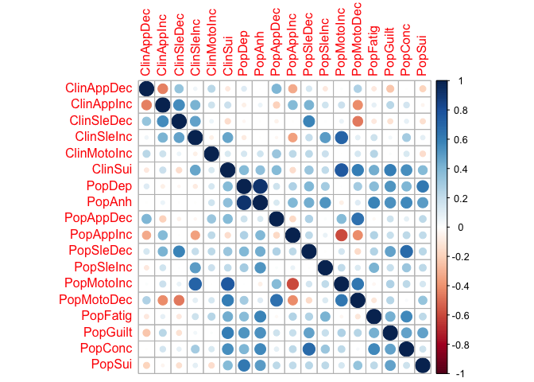
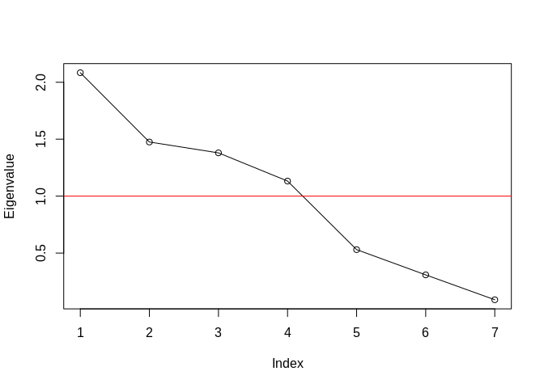
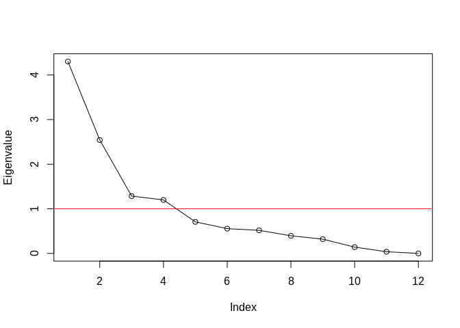
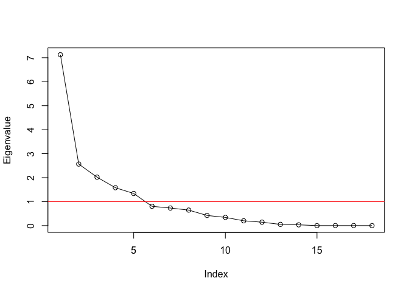

GenomicSEM of MDD symptoms
================
Mark Adams, Bradley Jermy, Jackson Thorp, Andrew Grotzinger, Michel
Nivard

# Setup

## R packages

R version

``` r
R.version
```

    ##                _                           
    ## platform       x86_64-generic-linux-gnu    
    ## arch           x86_64                      
    ## os             linux-gnu                   
    ## system         x86_64, linux-gnu           
    ## status                                     
    ## major          4                           
    ## minor          1.3                         
    ## year           2022                        
    ## month          03                          
    ## day            10                          
    ## svn rev        81868                       
    ## language       R                           
    ## version.string R version 4.1.3 (2022-03-10)
    ## nickname       One Push-Up

Package installation

``` r
required_packages <- c('devtools', 'readr', 'tidyr', 'dplyr', 'ggplot2', 'stringr', 'corrplot')
for(pack in required_packages) if(!require(pack, character.only=TRUE)) install.packages(pack)

if(!require(GenomicSEM)) remotes::install_github("MichelNivard/GenomicSEM")
```

GenomicSEM version

``` r
require(readr)
require(tidyr)
require(stringr)
require(dplyr)
require(ggplot2)
require(corrplot)
require(GenomicSEM)

packageVersion("GenomicSEM")
```

    ## [1] '0.0.5'

# Symptom labels

MDD DSM symptoms are numbered 1-9:

``` r
# plot labels

dsm_mdd_symptoms_labels <-
read_delim("
MDD1;Mood;Mood;Dep
MDD2;Interest;Interest;Anh
MDD3;Weight⇅;Weight⇆;App
MDD3a;Weight⇊;Weight⇇;AppDec
MDD3b;Weight⇈;Weight⇉;AppInc
MDD4;Sleep⇅;Sleep⇆;Sle
MDD4a;Sleep⇊;Sleep⇇;SleDec
MDD4b;Sleep⇈;Sleep⇉;SleInc
MDD5;Motor⇅;Motor⇆;Moto
MDD5a;Motor⇈;Motor⇉;MotoInc
MDD5b;Motor⇊;Motor⇇;MotoDec
MDD6;Fatigue;Fatigue;Fatig
MDD7;Guilt;Guilt;Guilt
MDD8;Concentrate;Concentrate;Conc
MDD9;Suicidality;Suicidality;Sui
", col_names=c('ref', 'h', 'v', 'abbv'), delim=';')
```

    ## Rows: 15 Columns: 4
    ## ── Column specification ───────────────────────────────────────────────────────────────
    ## Delimiter: ";"
    ## chr (4): ref, h, v, abbv
    ## 
    ## ℹ Use `spec()` to retrieve the full column specification for this data.
    ## ℹ Specify the column types or set `show_col_types = FALSE` to quiet this message.

``` r
dsm_mdd_symptoms_reference <-
read_delim("
MDD1;Depressed mood most of the day, nearly every day
MDD2;Markedly diminished interest or pleasure in all, or almost all, activities most of the day, nearly every day
MDD3;Significant change in weight or appetite
MDD3a;Significant weight loss or decrease in appetite
MDD3b;Significant weight gain or increase in appetite
MDD4;Sleeping too much or not sleeping enough
MDD4a;Insomnia nearly every day
MDD4b;Hypersomnia nearly every day
MDD5;Changes in speed/amount of moving or speaking
MDD5a;Psychomotor agitation nearly every day
MDD5b;Psychomotor slowing nearly every day
MDD6;Fatigue or loss of energy nearly every day
MDD7;Feelings of worthlessness or excessive or inappropriate guilt
MDD8;Diminished ability to think or concentrate, or indecisiveness
MDD9;Recurrent thoughts of death or suicide or a suicide attempt or a specific plan for attempting suicide
", col_names=c('Reference', 'Description'), delim=';')
```

    ## Rows: 15 Columns: 2
    ## ── Column specification ───────────────────────────────────────────────────────────────
    ## Delimiter: ";"
    ## chr (2): Reference, Description
    ## 
    ## ℹ Use `spec()` to retrieve the full column specification for this data.
    ## ℹ Specify the column types or set `show_col_types = FALSE` to quiet this message.

``` r
dsm_mdd_symptoms_reference %>%
left_join(dsm_mdd_symptoms_labels, by=c('Reference'='ref')) %>%
select(Reference, Abbreviation=abbv, Label=h, Description)
```

    ## # A tibble: 15 × 4
    ##    Reference Abbreviation Label       Description                               
    ##    <chr>     <chr>        <chr>       <chr>                                     
    ##  1 MDD1      Dep          Mood        Depressed mood most of the day, nearly ev…
    ##  2 MDD2      Anh          Interest    Markedly diminished interest or pleasure …
    ##  3 MDD3      App          Weight⇅     Significant change in weight or appetite  
    ##  4 MDD3a     AppDec       Weight⇊     Significant weight loss or decrease in ap…
    ##  5 MDD3b     AppInc       Weight⇈     Significant weight gain or increase in ap…
    ##  6 MDD4      Sle          Sleep⇅      Sleeping too much or not sleeping enough  
    ##  7 MDD4a     SleDec       Sleep⇊      Insomnia nearly every day                 
    ##  8 MDD4b     SleInc       Sleep⇈      Hypersomnia nearly every day              
    ##  9 MDD5      Moto         Motor⇅      Changes in speed/amount of moving or spea…
    ## 10 MDD5a     MotoInc      Motor⇈      Psychomotor agitation nearly every day    
    ## 11 MDD5b     MotoDec      Motor⇊      Psychomotor slowing nearly every day      
    ## 12 MDD6      Fatig        Fatigue     Fatigue or loss of energy nearly every day
    ## 13 MDD7      Guilt        Guilt       Feelings of worthlessness or excessive or…
    ## 14 MDD8      Conc         Concentrate Diminished ability to think or concentrat…
    ## 15 MDD9      Sui          Suicidality Recurrent thoughts of death or suicide or…

# GenomicSEM covariance structure

``` r
covstruct_prefix <- 'agds_pgc.alspac_ukb.covstruct'
covstruct_r <- file.path('ldsc', paste(covstruct_prefix, 'deparse.R', sep='.'))
covstruct_rds <- file.path('ldsc', paste(covstruct_prefix, 'rds', sep='.'))

symptoms_covstruct <- dget(covstruct_r)

sumstats_prevs <- read_tsv(file.path('ldsc', paste(covstruct_prefix, 'prevs', 'txt', sep='.')))
```

    ## Rows: 24 Columns: 9
    ## ── Column specification ───────────────────────────────────────────────────────────────
    ## Delimiter: "\t"
    ## chr (5): cohorts, symptom, sumstats, filename, trait_name
    ## dbl (4): Nca, Nco, samp_prev, pop_prev
    ## 
    ## ℹ Use `spec()` to retrieve the full column specification for this data.
    ## ℹ Specify the column types or set `show_col_types = FALSE` to quiet this message.

Rename samples: AGDS/PGC is the **Clin**ical sample (`Clin`) and
ALSPAC/UKB is the **Pop**ulation sample (`Pop`); and rename symptoms
numbers (`MDD1`, `MDD2`) to abbreviations (`Dep`, `Anh`)

``` r
cohorts_sample_symptoms <-
sumstats_prevs %>%
left_join(dsm_mdd_symptoms_labels, by=c('symptom'='ref')) %>%
select(cohorts, symptom, trait_name, abbv) %>%
mutate(Sample=case_when(cohorts %in% 'AGDS_PGC' ~ 'Clin',
                        cohorts %in% 'ALSPAC_UKB' ~ 'Pop',
                        TRUE ~ NA_character_)) %>%
mutate(sample_symptom=paste0(Sample, abbv))

sample_symptoms <- cohorts_sample_symptoms$sample_symptom
names(sample_symptoms) <- cohorts_sample_symptoms$trait_name

# rename traits in covstruct
dimnames(symptoms_covstruct$S)[[2]] <-
as.vector(sample_symptoms[dimnames(symptoms_covstruct$S)[[2]]])
```

# Structural models

Symptoms with positive variances

``` r
symptoms_S_var <- diag(symptoms_covstruct$S)
names(symptoms_S_var) <- dimnames(symptoms_covstruct$S)[[2]]

symptoms_S_var[which(symptoms_S_var > 0)]
```

    ##  ClinAppDec  ClinAppInc  ClinSleDec  ClinSleInc ClinMotoInc     ClinSui 
    ## 0.112544816 0.047192446 0.034299744 0.003892157 0.036548569 0.073599244 
    ##      PopDep      PopAnh   PopAppDec   PopAppInc   PopSleDec   PopSleInc 
    ## 0.080469848 0.086912880 0.034935627 0.078103966 0.039893080 0.044634027 
    ##  PopMotoInc  PopMotoDec    PopFatig    PopGuilt     PopConc      PopSui 
    ## 0.395771366 0.058092210 0.055211615 0.057321248 0.049088126 0.032192455

## Common factor

Common factor across symptoms from both cohorts

``` r
commonfactor.model <- "
A1 =~ NA*ClinAppDec + ClinAppInc + ClinSleDec + ClinSleInc + ClinMotoInc + ClinSui + PopDep + PopAnh + PopAppDec + PopAppInc + PopSleDec + PopSleInc + PopFatig + PopGuilt + PopConc + PopSui
A1 ~~ 1*A1
"

commonfactor.fit <- usermodel(symptoms_covstruct, estimation='DWLS', model=commonfactor.model)
```

    ## [1] "Running primary model"
    ## [1] "Calculating CFI"
    ## [1] "Calculating Standardized Results"
    ## [1] "Calculating SRMR"
    ## elapsed 
    ##   3.063 
    ## [1] "The S matrix was smoothed prior to model estimation due to a non-positive definite matrix. The largest absolute difference in a cell between the smoothed and non-smoothed matrix was  0.0371957759493137 As a result of the smoothing, the largest Z-statistic change for the genetic covariances was  1.36605214821313 . We recommend setting the smooth_check argument to true if you are going to run a multivariate GWAS."

    ## Warning in usermodel(symptoms_covstruct, estimation = "DWLS", model =
    ## commonfactor.model): A difference greater than .025 was observed pre- and post-
    ## smoothing in the genetic covariance matrix. This reflects a large difference
    ## and results should be interpreted with caution!! This can often result from
    ## including low powered traits, and you might consider removing those traits from
    ## the model. If you are going to run a multivariate GWAS we strongly recommend
    ## setting the smooth_check argument to true to check smoothing for each SNP.

    ## Warning in usermodel(symptoms_covstruct, estimation = "DWLS", model =
    ## commonfactor.model): A difference greater than .025 was observed pre- and post-
    ## smoothing for Z-statistics in the genetic covariance matrix. This reflects a
    ## large difference and results should be interpreted with caution!! This can often
    ## result from including low powered traits, and you might consider removing those
    ## traits from the model. If you are going to run a multivariate GWAS we strongly
    ## recommend setting the smooth_check argument to true to check smoothing for each
    ## SNP.

``` r
commonfactor.fit$modelfit
```

    ##       chisq  df      p_chisq      AIC       CFI      SRMR
    ## df 523.5677 104 3.363283e-57 587.5677 0.9532481 0.1836763

``` r
commonfactor.fit$results[c(1,2,3,6,7)]
```

    ##            lhs op         rhs STD_Genotype    STD_Genotype_SE
    ## 1           A1 =~  ClinAppDec   0.06235021 0.0854126196538146
    ## 2           A1 =~  ClinAppInc  -0.18187702  0.101563963170886
    ## 4           A1 =~  ClinSleDec  -0.04736174  0.120812396356797
    ## 5           A1 =~  ClinSleInc  -0.16862764    0.1661887062704
    ## 3           A1 =~ ClinMotoInc  -0.18573945  0.110061754314607
    ## 6           A1 =~     ClinSui  -0.64896425  0.108682004122379
    ## 11          A1 =~      PopDep  -0.83967242 0.0451478511631289
    ## 7           A1 =~      PopAnh  -0.95001597 0.0431080771318471
    ## 8           A1 =~   PopAppDec  -0.18232230 0.0806546223501291
    ## 9           A1 =~   PopAppInc  -0.38908141 0.0756533017697682
    ## 14          A1 =~   PopSleDec  -0.57102353 0.0909327735122386
    ## 15          A1 =~   PopSleInc  -0.45958899 0.0952414160627602
    ## 12          A1 =~    PopFatig  -0.65758373 0.0847854931355823
    ## 13          A1 =~    PopGuilt  -0.65220691 0.0800161047567223
    ## 10          A1 =~     PopConc  -0.69494195 0.0835055998982379
    ## 16          A1 =~      PopSui  -0.57893360 0.0929735308818551
    ## 18  ClinAppDec ~~  ClinAppDec   0.99611396  0.219932605962921
    ## 19  ClinAppInc ~~  ClinAppInc   0.96691962  0.322114277272675
    ## 21  ClinSleDec ~~  ClinSleDec   0.99776135  0.545818607829999
    ## 22  ClinSleInc ~~  ClinSleInc   0.97156966  0.842333895317954
    ## 20 ClinMotoInc ~~ ClinMotoInc   0.96550188  0.441518768528253
    ## 23     ClinSui ~~     ClinSui   0.57884564    0.3567802356662
    ## 28      PopDep ~~      PopDep   0.29494933  0.070022263741118
    ## 24      PopAnh ~~      PopAnh   0.09747049 0.0653102306319936
    ## 25   PopAppDec ~~   PopAppDec   0.96675730  0.231302015716496
    ## 26   PopAppInc ~~   PopAppInc   0.84861528  0.153935778206595
    ## 31   PopSleDec ~~   PopSleDec   0.67393197  0.307886253508288
    ## 32   PopSleInc ~~   PopSleInc   0.78877797  0.251632240695904
    ## 29    PopFatig ~~    PopFatig   0.56758503  0.275833943742082
    ## 30    PopGuilt ~~    PopGuilt   0.57462881  0.164703701013368
    ## 27     PopConc ~~     PopConc   0.51705615  0.244965979460839
    ## 33      PopSui ~~      PopSui   0.66483536  0.230285294666987
    ## 17          A1 ~~          A1   1.00000000

Correlation among directional symptoms

``` r
commonfactor_dir.model <- "
A1 =~ NA*ClinAppDec + ClinAppInc + ClinSleDec + ClinSleInc + ClinMotoInc + ClinSui + PopDep + PopAnh + PopAppDec + PopAppInc + PopSleDec + PopSleInc +  PopFatig + PopGuilt + PopConc + PopSui
A1 ~~ 1*A1
ClinAppDec ~~ ClinAppInc
ClinSleDec ~~ ClinSleInc
PopDep ~~ PopAnh
PopAppDec ~~ PopAppInc
PopSleDec ~~ PopSleInc
"

commonfactor_dir.fit <- usermodel(symptoms_covstruct, estimation='DWLS', model=commonfactor_dir.model)
```

    ## [1] "Running primary model"
    ## [1] "Calculating CFI"
    ## [1] "Calculating Standardized Results"
    ## [1] "Calculating SRMR"
    ## elapsed 
    ##   2.932 
    ## [1] "The S matrix was smoothed prior to model estimation due to a non-positive definite matrix. The largest absolute difference in a cell between the smoothed and non-smoothed matrix was  0.0371957759493137 As a result of the smoothing, the largest Z-statistic change for the genetic covariances was  1.36605214821313 . We recommend setting the smooth_check argument to true if you are going to run a multivariate GWAS."

    ## Warning in usermodel(symptoms_covstruct, estimation = "DWLS", model =
    ## commonfactor_dir.model): A difference greater than .025 was observed pre-
    ## and post-smoothing in the genetic covariance matrix. This reflects a large
    ## difference and results should be interpreted with caution!! This can often
    ## result from including low powered traits, and you might consider removing those
    ## traits from the model. If you are going to run a multivariate GWAS we strongly
    ## recommend setting the smooth_check argument to true to check smoothing for each
    ## SNP.

    ## Warning in usermodel(symptoms_covstruct, estimation = "DWLS", model =
    ## commonfactor_dir.model): A difference greater than .025 was observed pre- and
    ## post-smoothing for Z-statistics in the genetic covariance matrix. This reflects
    ## a large difference and results should be interpreted with caution!! This can
    ## often result from including low powered traits, and you might consider removing
    ## those traits from the model. If you are going to run a multivariate GWAS we
    ## strongly recommend setting the smooth_check argument to true to check smoothing
    ## for each SNP.

``` r
commonfactor_dir.fit$modelfit
```

    ##       chisq df      p_chisq      AIC       CFI      SRMR
    ## df 366.6889 99 2.174698e-32 440.6889 0.9701718 0.1676507

``` r
commonfactor_dir.fit$results[c(1,2,3,6,7,9)]
```

    ##            lhs op         rhs STD_Genotype    STD_Genotype_SE      p_value
    ## 1           A1 =~  ClinAppDec   0.07297861 0.0916897298398837 4.260697e-01
    ## 2           A1 =~  ClinAppInc  -0.21337301  0.109824795810554 5.203476e-02
    ## 4           A1 =~  ClinSleDec  -0.04746294  0.125285098422936 7.048143e-01
    ## 5           A1 =~  ClinSleInc  -0.19520115  0.176058457335407 2.675463e-01
    ## 3           A1 =~ ClinMotoInc  -0.20508141  0.118912061322736 8.459020e-02
    ## 6           A1 =~     ClinSui  -0.70847346  0.117829135736615 1.824429e-09
    ## 11          A1 =~      PopDep  -0.68153483  0.066315745405186 8.936688e-25
    ## 7           A1 =~      PopAnh  -0.80050755 0.0648225982689118 4.919160e-35
    ## 8           A1 =~   PopAppDec  -0.21688957 0.0863212735070715 1.198515e-02
    ## 9           A1 =~   PopAppInc  -0.42986244 0.0800793383070831 7.963504e-08
    ## 14          A1 =~   PopSleDec  -0.64545160 0.0972331335112583 3.175709e-11
    ## 15          A1 =~   PopSleInc  -0.50717594  0.102415474260937 7.339841e-07
    ## 12          A1 =~    PopFatig  -0.72070774 0.0898143355580739 1.020086e-15
    ## 13          A1 =~    PopGuilt  -0.71117351 0.0881806951616486 7.326341e-16
    ## 10          A1 =~     PopConc  -0.76094430 0.0890427143336014 1.276106e-17
    ## 16          A1 =~      PopSui  -0.60581604 0.0980807452059902 6.545226e-10
    ## 19  ClinAppDec ~~  ClinAppInc  -0.37159847  0.218798973096306 8.944069e-02
    ## 23  ClinSleDec ~~  ClinSleInc   0.48211115  0.505936997584641 3.406388e-01
    ## 31      PopDep ~~      PopAnh   0.35654648 0.0971526112852119 2.425800e-04
    ## 28   PopAppDec ~~   PopAppInc  -0.23096326  0.129835893303993 7.525835e-02
    ## 36   PopSleDec ~~   PopSleInc  -0.32597973  0.192127688043744 8.975693e-02
    ## 18  ClinAppDec ~~  ClinAppDec   0.99467234   0.22041785888747 6.401544e-06
    ## 20  ClinAppInc ~~  ClinAppInc   0.95447259  0.323125287753158 3.138105e-03
    ## 22  ClinSleDec ~~  ClinSleDec   0.99774973  0.545881129322733 6.758381e-02
    ## 24  ClinSleInc ~~  ClinSleInc   0.96187035  0.841547170982866 2.530342e-01
    ## 21 ClinMotoInc ~~ ClinMotoInc   0.95794328  0.442328411635001 3.033572e-02
    ## 25     ClinSui ~~     ClinSui   0.49806444  0.368726148369545 1.767659e-01
    ## 32      PopDep ~~      PopDep   0.53550937  0.108311550045072 7.646646e-07
    ## 26      PopAnh ~~      PopAnh   0.35918740  0.106215223414283 7.204338e-04
    ## 27   PopAppDec ~~   PopAppDec   0.95295900  0.230152753615651 3.464737e-05
    ## 29   PopAppInc ~~   PopAppInc   0.81521533  0.156323211030334 1.838621e-07
    ## 35   PopSleDec ~~   PopSleDec   0.58339189   0.31212290928542 6.160715e-02
    ## 37   PopSleInc ~~   PopSleInc   0.74277217   0.25077134713404 3.056999e-03
    ## 33    PopFatig ~~    PopFatig   0.48058030  0.277412468493035 8.320806e-02
    ## 34    PopGuilt ~~    PopGuilt   0.49422867  0.170875512334514 3.823650e-03
    ## 30     PopConc ~~     PopConc   0.42096384  0.248467632386181 9.021962e-02
    ## 38      PopSui ~~      PopSui   0.63298763  0.232585456233178 6.498180e-03
    ## 17          A1 ~~          A1   1.00000000                              NA

Ascertainment-specific factors

``` r
clin_pop.model <- "
A1 =~ NA*ClinAppDec + ClinAppInc + ClinSleDec + ClinSleInc + ClinMotoInc + ClinSui 
A2 =~ NA*PopDep + PopAnh + PopAppDec + PopAppInc + PopSleDec + PopSleInc +  PopFatig + PopGuilt + PopConc + PopSui
A1 ~~ 1*A1
A2 ~~ 1*A2
a12 > -1
a12 < 1
A1 ~~ a12*A2
ClinAppDec ~~ ClinAppInc
ClinSleDec ~~ ClinSleInc
PopDep ~~ PopAnh
PopAppDec ~~ PopAppInc
PopSleDec ~~ PopSleInc
"

clin_pop.fit <- usermodel(symptoms_covstruct, estimation='DWLS', model=clin_pop.model)
```

    ## [1] "Running primary model"
    ## [1] "Error: The primary model produced correlations among your latent variables that are either greater than 1 or less than -1, or the latent variables have negative variances. \n              Consequently, model fit estimates could not be computed and results should likely not be interpreted. Results are provided below \n              to enable troubleshooting. A model constraint that constrains the latent correlations to be above -1, less than 1, or to have positive variances is suggested."
    ##            lhs op         rhs Unstandardized_Estimate          SE
    ## 1           A1 =~  ClinAppDec              0.02527439 0.034007035
    ## 2           A1 =~  ClinAppInc             -0.05960106 0.038712987
    ## 3           A1 =~  ClinSleDec             -0.01269073 0.034022836
    ## 4           A1 =~  ClinSleInc             -0.03056955 0.031017980
    ## 5           A1 =~ ClinMotoInc             -0.04028103 0.030680817
    ## 6           A1 =~     ClinSui             -0.21001718 0.108096697
    ## 7           A2 =~      PopDep              0.19624624 0.019077383
    ## 8           A2 =~      PopAnh              0.23774626 0.019231016
    ## 9           A2 =~   PopAppDec              0.04247162 0.016903394
    ## 10          A2 =~   PopAppInc              0.12451383 0.023192765
    ## 11          A2 =~   PopSleDec              0.13777083 0.020753275
    ## 12          A2 =~   PopSleInc              0.11435060 0.023091180
    ## 13          A2 =~    PopFatig              0.18349087 0.022866701
    ## 14          A2 =~    PopGuilt              0.17104159 0.021208996
    ## 15          A2 =~     PopConc              0.18146219 0.021235980
    ## 16          A2 =~      PopSui              0.11334577 0.018347197
    ## 19          A1 ~~          A2             -1.00000039 0.519044716
    ## 20  ClinAppDec ~~  ClinAppInc             -0.03594796 0.021076503
    ## 21  ClinSleDec ~~  ClinSleInc              0.02018786 0.021164506
    ## 22      PopDep ~~      PopAnh              0.03049160 0.008280064
    ## 23   PopAppDec ~~   PopAppInc             -0.01310062 0.007364318
    ## 24   PopSleDec ~~   PopSleInc             -0.01568785 0.009246010
    ## 25  ClinAppDec ~~  ClinAppDec              0.11930309 0.026422951
    ## 26  ClinAppInc ~~  ClinAppInc              0.07447203 0.025109226
    ## 27  ClinSleDec ~~  ClinSleDec              0.07133448 0.039031384
    ## 28  ClinSleInc ~~  ClinSleInc              0.02359060 0.020677680
    ## 29 ClinMotoInc ~~ ClinMotoInc              0.03695605 0.017335372
    ## 30     ClinSui ~~     ClinSui              0.04376673 0.048652459
    ## 31      PopDep ~~      PopDep              0.04440140 0.008959822
    ## 32      PopAnh ~~      PopAnh              0.03168240 0.009346250
    ## 33   PopAppDec ~~   PopAppDec              0.03654223 0.008825451
    ## 34   PopAppInc ~~   PopAppInc              0.06839923 0.013116450
    ## 35   PopSleDec ~~   PopSleDec              0.02657953 0.014220364
    ## 36   PopSleInc ~~   PopSleInc              0.03775846 0.012747832
    ## 37    PopFatig ~~    PopFatig              0.03115125 0.017982045
    ## 38    PopGuilt ~~    PopGuilt              0.02858800 0.009883856
    ## 39     PopConc ~~     PopConc              0.02393923 0.014129663
    ## 40      PopSui ~~      PopSui              0.02215766 0.008142324

``` r
clin_pop.fit$modelfit
```

    ## NULL

``` r
clin_pop.fit$results[c(1,2,3,6,7,9)]
```

    ## NULL

``` r
clin_pop_bif.model <- "
A1 =~ NA*ClinAppDec + ClinAppInc + ClinSleDec + ClinSleInc + ClinMotoInc + ClinSui 
A2 =~ NA*PopDep + PopAnh + PopAppDec + PopAppInc + PopSleDec + PopSleInc +  PopFatig + PopGuilt + PopConc + PopSui
A =~ NA*ClinAppDec + ClinAppInc + ClinSleDec + ClinSleInc + ClinMotoInc + ClinSui + PopDep + PopAnh + PopAppDec + PopAppInc + PopSleDec + PopSleInc +  PopFatig + PopGuilt + PopConc + PopSui
A1 ~~ 1*A1
A2 ~~ 1*A2
A ~~ 1*A
A ~~ 0*A1 + 0*A2
A1 ~~ 0*A2
"

clin_pop_bif.fit <- usermodel(symptoms_covstruct, estimation='DWLS', model=clin_pop_bif.model)
```

    ## [1] "Running primary model"
    ## [1] "Calculating CFI"
    ## [1] "Calculating Standardized Results"
    ## [1] "Calculating SRMR"
    ## elapsed 
    ##   4.032 
    ## [1] "The S matrix was smoothed prior to model estimation due to a non-positive definite matrix. The largest absolute difference in a cell between the smoothed and non-smoothed matrix was  0.0371957759493137 As a result of the smoothing, the largest Z-statistic change for the genetic covariances was  1.36605214821313 . We recommend setting the smooth_check argument to true if you are going to run a multivariate GWAS."

    ## Warning in usermodel(symptoms_covstruct, estimation = "DWLS", model =
    ## clin_pop_bif.model): A difference greater than .025 was observed pre- and post-
    ## smoothing in the genetic covariance matrix. This reflects a large difference
    ## and results should be interpreted with caution!! This can often result from
    ## including low powered traits, and you might consider removing those traits from
    ## the model. If you are going to run a multivariate GWAS we strongly recommend
    ## setting the smooth_check argument to true to check smoothing for each SNP.

    ## Warning in usermodel(symptoms_covstruct, estimation = "DWLS", model =
    ## clin_pop_bif.model): A difference greater than .025 was observed pre- and post-
    ## smoothing for Z-statistics in the genetic covariance matrix. This reflects a
    ## large difference and results should be interpreted with caution!! This can often
    ## result from including low powered traits, and you might consider removing those
    ## traits from the model. If you are going to run a multivariate GWAS we strongly
    ## recommend setting the smooth_check argument to true to check smoothing for each
    ## SNP.

``` r
clin_pop_bif.fit$modelfit
```

    ##      chisq df      p_chisq     AIC       CFI      SRMR
    ## df 314.589 88 3.182025e-27 410.589 0.9747515 0.1550795

``` r
clin_pop_bif.fit$results[c(1,2,3,6,7,9)]
```

    ##            lhs op         rhs STD_Genotype    STD_Genotype_SE      p_value
    ## 18          A1 =~  ClinAppDec -0.189552829  0.335142258955362 5.715978e-01
    ## 19          A1 =~  ClinAppInc -0.168309014  0.330573078362042 6.105903e-01
    ## 21          A1 =~  ClinSleDec -2.674307589   4.97224627877958 5.906122e-01
    ## 22          A1 =~  ClinSleInc -0.203074924  0.418076285022313 6.270984e-01
    ## 20          A1 =~ ClinMotoInc -0.079610362  0.173575053801962 6.464385e-01
    ## 23          A1 =~     ClinSui  0.097640570  0.207016373768374 6.371273e-01
    ## 31          A2 =~      PopDep  0.917707790  0.119949556554314 1.997261e-14
    ## 27          A2 =~      PopAnh  0.734650580   0.14652784372532 5.338945e-07
    ## 28          A2 =~   PopAppDec  0.130919928  0.131944085680558 3.210862e-01
    ## 29          A2 =~   PopAppInc  0.101044441   0.12825668034057 4.307824e-01
    ## 34          A2 =~   PopSleDec  0.229779164   0.18387417155173 2.114196e-01
    ## 35          A2 =~   PopSleInc  0.281201907  0.166908333717302 9.203303e-02
    ## 32          A2 =~    PopFatig  0.170315973  0.190143041560629 3.703917e-01
    ## 33          A2 =~    PopGuilt  0.271619978  0.166921037019208 1.036874e-01
    ## 30          A2 =~     PopConc  0.234556465  0.187363486748613 2.106028e-01
    ## 36          A2 =~      PopSui  0.465277690  0.154903688077222 2.667572e-03
    ## 1            A =~  ClinAppDec  0.127360203  0.109064600288417 2.429089e-01
    ## 2            A =~  ClinAppInc -0.307212059  0.133167638533871 2.105746e-02
    ## 4            A =~  ClinSleDec -0.067888094  0.161152951093647 6.735667e-01
    ## 5            A =~  ClinSleInc -0.255577378  0.203071222020318 2.081881e-01
    ## 3            A =~ ClinMotoInc -0.260583229  0.144385837959697 7.111162e-02
    ## 6            A =~     ClinSui -0.875974135  0.186181163480716 2.539300e-06
    ## 11           A =~      PopDep -0.390038434  0.164610167438102 1.781443e-02
    ## 7            A =~      PopAnh -0.587024715  0.150379749387895 9.477048e-05
    ## 8            A =~   PopAppDec -0.118678139  0.117845781852907 3.138991e-01
    ## 9            A =~   PopAppInc -0.445788762  0.118536015115992 1.693848e-04
    ## 14           A =~   PopSleDec -0.566757337  0.164996748358204 5.926729e-04
    ## 15           A =~   PopSleInc -0.354669679   0.16039393948281 2.701916e-02
    ## 12           A =~    PopFatig -0.757257695  0.128570992800612 3.866942e-09
    ## 13           A =~    PopGuilt -0.640276610  0.122519257284152 1.732840e-07
    ## 10           A =~     PopConc -0.741638575  0.144028178127861 2.615646e-07
    ## 16           A =~      PopSui -0.347664265  0.163241666680722 3.319242e-02
    ## 39  ClinAppDec ~~  ClinAppDec  0.947846570   0.25623305531069 2.162894e-04
    ## 40  ClinAppInc ~~  ClinAppInc  0.877290216  0.363792779659844 1.588727e-02
    ## 42  ClinSleDec ~~  ClinSleDec -6.156530071   26.6156085379725 8.170441e-01
    ## 43  ClinSleInc ~~  ClinSleInc  0.893440751  0.859763597244318 2.987302e-01
    ## 41 ClinMotoInc ~~ ClinMotoInc  0.925759456   0.44511661207522 3.754298e-02
    ## 44     ClinSui ~~     ClinSui  0.223135166  0.478133353932658 6.407347e-01
    ## 49      PopDep ~~      PopDep  0.005682374  0.171374386721865 9.735658e-01
    ## 45      PopAnh ~~      PopAnh  0.115690583 0.0880126146503343 1.886830e-01
    ## 46   PopAppDec ~~   PopAppDec  0.968775352   0.23120494648992 2.788133e-05
    ## 47   PopAppInc ~~   PopAppInc  0.791062114  0.158350692027855 5.864061e-07
    ## 52   PopSleDec ~~   PopSleDec  0.625983451  0.322089168061428 5.195239e-02
    ## 53   PopSleInc ~~   PopSleInc  0.795134994  0.252611353632164 1.645814e-03
    ## 50    PopFatig ~~    PopFatig  0.397553599  0.277358573057408 1.517565e-01
    ## 51    PopGuilt ~~    PopGuilt  0.516268944  0.180065059962054 4.142436e-03
    ## 48     PopConc ~~     PopConc  0.394951462  0.268290438427736 1.409837e-01
    ## 54      PopSui ~~      PopSui  0.662647088  0.235311211818304 4.861835e-03
    ## 25          A1 ~~          A1  1.000000000                              NA
    ## 38          A2 ~~          A2  1.000000000                              NA
    ## 17           A ~~           A  1.000000000                              NA
    ## 24          A1 ~~           A  0.000000000                              NA
    ## 37          A2 ~~           A  0.000000000                              NA
    ## 26          A1 ~~          A2  0.000000000                              NA

## ADGS-PGC (Clinical)

### Common factor

Common factor model. Allow residual negative correlation between
directional symptoms

``` r
clin_commonfactor.model <- "
A1 =~ NA*ClinAppDec + ClinAppInc + ClinSleDec + ClinSleInc + ClinMotoInc + ClinSui
A1 ~~ 1*A1
"
clin_commonfactor.fit <- usermodel(symptoms_covstruct, estimation='DWLS', model=clin_commonfactor.model)
```

    ## [1] "Running primary model"

    ## Warning in usermodel(symptoms_covstruct, estimation = "DWLS", model = clin_commonfactor.model): Error: The primary model did not converge! Additional warnings or errors are likely being printed by lavaan. 
    ##             The model output is also printed below (without standard errors) in case this is helpful for troubleshooting. Please note
    ##             that these results should not be interpreted.

    ##            lhs op         rhs Unstandardized_Estimate
    ## 1           A1 =~  ClinAppDec            1.374633e+01
    ## 2           A1 =~  ClinAppInc           -2.516730e-03
    ## 3           A1 =~  ClinSleDec            3.204727e-03
    ## 4           A1 =~  ClinSleInc            1.402317e-03
    ## 5           A1 =~ ClinMotoInc            9.849919e-04
    ## 6           A1 =~     ClinSui           -4.331608e-04
    ## 8   ClinAppDec ~~  ClinAppDec           -1.888397e+02
    ## 9   ClinAppInc ~~  ClinAppInc            7.140598e-02
    ## 10  ClinSleDec ~~  ClinSleDec            7.099734e-02
    ## 11  ClinSleInc ~~  ClinSleInc            1.349074e-02
    ## 12 ClinMotoInc ~~ ClinMotoInc            3.698065e-02
    ## 13     ClinSui ~~     ClinSui            7.943268e-02

``` r
clin_commonfactor.fit$modelfit
```

    ## NULL

``` r
clin_commonfactor.fit$results[c(1,2,3,6,7, 9)]
```

    ## NULL

Add residual covariance between sleep symptoms.

``` r
clin_commonfactor_sle.model <- "
A1 =~ NA*ClinAppDec + ClinAppInc + ClinSleDec + ClinSleInc + ClinMotoInc + ClinSui
A1 ~~ 1*A1
c3a3b > -1
ClinAppDec ~~ c3a3b*ClinAppInc
"
clin_commonfactor_sle.fit <- usermodel(symptoms_covstruct, estimation='DWLS', model=clin_commonfactor_sle.model)
```

    ## [1] "Running primary model"
    ## [1] "Calculating CFI"
    ## [1] "Calculating Standardized Results"
    ## [1] "Calculating SRMR"
    ## elapsed 
    ##   6.135 
    ## [1] "The S matrix was smoothed prior to model estimation due to a non-positive definite matrix. The largest absolute difference in a cell between the smoothed and non-smoothed matrix was  0.0367078980491331 As a result of the smoothing, the largest Z-statistic change for the genetic covariances was  1.29447064580018 . We recommend setting the smooth_check argument to true if you are going to run a multivariate GWAS."

    ## Warning in usermodel(symptoms_covstruct, estimation = "DWLS", model =
    ## clin_commonfactor_sle.model): A difference greater than .025 was observed pre-
    ## and post-smoothing in the genetic covariance matrix. This reflects a large
    ## difference and results should be interpreted with caution!! This can often
    ## result from including low powered traits, and you might consider removing those
    ## traits from the model. If you are going to run a multivariate GWAS we strongly
    ## recommend setting the smooth_check argument to true to check smoothing for each
    ## SNP.

    ## Warning in usermodel(symptoms_covstruct, estimation = "DWLS", model =
    ## clin_commonfactor_sle.model): A difference greater than .025 was observed pre-
    ## and post-smoothing for Z-statistics in the genetic covariance matrix. This
    ## reflects a large difference and results should be interpreted with caution!!
    ## This can often result from including low powered traits, and you might consider
    ## removing those traits from the model. If you are going to run a multivariate
    ## GWAS we strongly recommend setting the smooth_check argument to true to check
    ## smoothing for each SNP.

``` r
clin_commonfactor_sle.fit$modelfit
```

    ##       chisq df   p_chisq      AIC CFI      SRMR
    ## df 2.604371  8 0.9566862 28.60437   1 0.1435086

``` r
clin_commonfactor_sle.fit$results[c(1,2,3,6,7, 9)]
```

    ##            lhs op         rhs STD_Genotype   STD_Genotype_SE    p_value
    ## 1           A1 =~  ClinAppDec  0.671726995    0.433105425362 0.12091657
    ## 2           A1 =~  ClinAppInc  0.729670895 0.521504444408058 0.16176786
    ## 4           A1 =~  ClinSleDec  0.746906301 0.474573261514981 0.11552771
    ## 5           A1 =~  ClinSleInc  0.612275763 0.461873619105848 0.18496312
    ## 3           A1 =~ ClinMotoInc  0.279998891  0.23717368047761 0.23777824
    ## 6           A1 =~     ClinSui  0.007294712 0.178671946715864 0.96742911
    ## 9   ClinAppDec ~~  ClinAppInc -0.861144952   0.6182645460933 0.16367832
    ## 8   ClinAppDec ~~  ClinAppDec  0.548782969 0.574059361209167 0.33913056
    ## 10  ClinAppInc ~~  ClinAppInc  0.467581888 0.791246118141878 0.55459493
    ## 12  ClinSleDec ~~  ClinSleDec  0.442128708 0.900082705615736 0.62325288
    ## 13  ClinSleInc ~~  ClinSleInc  0.625191085  1.61291824164948 0.69833329
    ## 11 ClinMotoInc ~~ ClinMotoInc  0.921603214 0.470933722825115 0.05035139
    ## 14     ClinSui ~~     ClinSui  0.999947372 0.363500563648504 0.00594352
    ## 7           A1 ~~          A1  1.000000000                           NA

### Somatic factor

``` r
clin_soma.model <- "
A1 =~ NA*ClinAppDec + ClinAppInc + ClinSleInc + ClinMotoInc
A2 =~ NA*ClinSui
A1 ~~ 1*A1
A2 ~~ 1*A2
ClinAppDec ~~ ClinAppInc
"
clin_soma.fit <- usermodel(symptoms_covstruct, estimation='DWLS', model=clin_soma.model)
```

    ## [1] "Running primary model"
    ## [1] "Calculating CFI"
    ## [1] "Calculating Standardized Results"
    ## [1] "Calculating SRMR"
    ## elapsed 
    ##   1.113 
    ## [1] "The S matrix was smoothed prior to model estimation due to a non-positive definite matrix. The largest absolute difference in a cell between the smoothed and non-smoothed matrix was  0.00212463654210518 As a result of the smoothing, the largest Z-statistic change for the genetic covariances was  0.0603600553110153 . We recommend setting the smooth_check argument to true if you are going to run a multivariate GWAS."

    ## Warning in usermodel(symptoms_covstruct, estimation = "DWLS", model =
    ## clin_soma.model): A difference greater than .025 was observed pre- and post-
    ## smoothing for Z-statistics in the genetic covariance matrix. This reflects a
    ## large difference and results should be interpreted with caution!! This can often
    ## result from including low powered traits, and you might consider removing those
    ## traits from the model. If you are going to run a multivariate GWAS we strongly
    ## recommend setting the smooth_check argument to true to check smoothing for each
    ## SNP.

``` r
clin_soma.fit$modelfit
```

    ##       chisq df   p_chisq      AIC CFI      SRMR
    ## df 2.304069  4 0.6800284 24.30407   1 0.2451901

``` r
clin_soma.fit$results[c(1,2,3,6,7, 9)]
```

    ##            lhs op         rhs STD_Genotype   STD_Genotype_SE      p_value
    ## 1           A1 =~  ClinAppDec    0.4055290 0.754148621286318 5.907635e-01
    ## 2           A1 =~  ClinAppInc    1.2736188  2.01125942984506 5.265749e-01
    ## 4           A1 =~  ClinSleInc    0.1380496 0.559641512969124 8.051605e-01
    ## 3           A1 =~ ClinMotoInc    0.3561673 0.567724766675575 5.304247e-01
    ## 7           A2 =~     ClinSui    1.0000000 0.195283553435711 3.043088e-07
    ## 10  ClinAppDec ~~  ClinAppInc   -1.1884363  1.62290567974997 4.639934e-01
    ## 9   ClinAppDec ~~  ClinAppDec    0.8355463 0.634157372521562 1.876489e-01
    ## 11  ClinAppInc ~~  ClinAppInc   -0.6221047  5.15487319600046 9.039421e-01
    ## 13  ClinSleInc ~~  ClinSleInc    0.9809420  3.41377343721767 7.738452e-01
    ## 12 ClinMotoInc ~~ ClinMotoInc    0.8731448 0.601775907556811 1.467943e-01
    ## 6           A1 ~~          A2    0.2828813 0.442178236769625 5.223393e-01
    ## 5           A1 ~~          A1    1.0000000                             NA
    ## 8           A2 ~~          A2    1.0000000                             NA
    ## 14     ClinSui ~~     ClinSui    0.0000000                             NA

## ALSPAC-UKB (Population)

### Common factor

Common factor model

``` r
pop_commonfactor.model <- "
A1 =~ NA*PopDep + PopAnh + PopAppDec + PopAppInc + PopSleDec + PopSleInc + PopFatig + PopGuilt + PopConc + PopSui
A1 ~~ 1*A1
"
pop_commonfactor.fit <- usermodel(symptoms_covstruct, estimation='DWLS', model=pop_commonfactor.model)
```

    ## [1] "Running primary model"
    ## [1] "Calculating CFI"
    ## [1] "Calculating Standardized Results"
    ## [1] "Calculating SRMR"
    ## elapsed 
    ##   1.597 
    ## [1] "The S matrix was smoothed prior to model estimation due to a non-positive definite matrix. The largest absolute difference in a cell between the smoothed and non-smoothed matrix was  0.00241743805150266 As a result of the smoothing, the largest Z-statistic change for the genetic covariances was  0.215273668975607 . We recommend setting the smooth_check argument to true if you are going to run a multivariate GWAS."

    ## Warning in usermodel(symptoms_covstruct, estimation = "DWLS", model =
    ## pop_commonfactor.model): A difference greater than .025 was observed pre- and
    ## post-smoothing for Z-statistics in the genetic covariance matrix. This reflects
    ## a large difference and results should be interpreted with caution!! This can
    ## often result from including low powered traits, and you might consider removing
    ## those traits from the model. If you are going to run a multivariate GWAS we
    ## strongly recommend setting the smooth_check argument to true to check smoothing
    ## for each SNP.

``` r
pop_commonfactor.fit$modelfit
```

    ##       chisq df     p_chisq      AIC       CFI      SRMR
    ## df 59.80875 35 0.005594967 99.80875 0.9928165 0.1257256

``` r
pop_commonfactor.fit$results[c(1, 2, 3, 6, 7)]
```

    ##          lhs op       rhs STD_Genotype    STD_Genotype_SE
    ## 5         A1 =~    PopDep   0.86302758 0.0466869423188895
    ## 1         A1 =~    PopAnh   0.99707952 0.0429873302660015
    ## 2         A1 =~ PopAppDec   0.17061418 0.0881755804155243
    ## 3         A1 =~ PopAppInc   0.40619378 0.0809099038333851
    ## 8         A1 =~ PopSleDec   0.57632446 0.0948331691360471
    ## 9         A1 =~ PopSleInc   0.52022007  0.101746593406507
    ## 6         A1 =~  PopFatig   0.67199535 0.0937553478821959
    ## 7         A1 =~  PopGuilt   0.62768566 0.0801781504431618
    ## 4         A1 =~   PopConc   0.70163978  0.090361121117305
    ## 10        A1 =~    PopSui   0.58716232 0.0983552072249635
    ## 16    PopDep ~~    PopDep   0.25518298 0.0738079091843437
    ## 12    PopAnh ~~    PopAnh   0.00583183 0.0676894778042805
    ## 13 PopAppDec ~~ PopAppDec   0.97089128  0.251433696769554
    ## 14 PopAppInc ~~ PopAppInc   0.83500651  0.166782794848207
    ## 19 PopSleDec ~~ PopSleDec   0.66785177  0.331077725469581
    ## 20 PopSleInc ~~ PopSleInc   0.72936865  0.284423005895405
    ## 17  PopFatig ~~  PopFatig   0.54842296  0.322517150649478
    ## 18  PopGuilt ~~  PopGuilt   0.60601068  0.166002072893602
    ## 15   PopConc ~~   PopConc   0.50770129  0.268448846854777
    ## 21    PopSui ~~    PopSui   0.65524003  0.253105388878838
    ## 11        A1 ~~        A1   1.00000000

Remove common variance shared between the gating items (Mood:
`UKB_CIDI1`, Interest: `UKB_CIDI2`) that is uncorrelated with the common
factor variance, to recover the genetic structure among gated items

``` r
pop_commonfactor_gating.model <- "
A1 =~ NA*PopDep + PopAnh + PopAppDec + PopAppInc + PopSleDec + PopSleInc + PopFatig + PopGuilt + PopConc + PopSui
A1 ~~ 1*A1
PopDep ~~ PopAnh
"
pop_commonfactor_gating.fit <- usermodel(symptoms_covstruct, estimation='DWLS', model=pop_commonfactor_gating.model)
```

    ## [1] "Running primary model"
    ## [1] "Calculating CFI"
    ## [1] "Calculating Standardized Results"
    ## [1] "Calculating SRMR"
    ## elapsed 
    ##   1.447 
    ## [1] "The S matrix was smoothed prior to model estimation due to a non-positive definite matrix. The largest absolute difference in a cell between the smoothed and non-smoothed matrix was  0.00241743805150266 As a result of the smoothing, the largest Z-statistic change for the genetic covariances was  0.215273668975607 . We recommend setting the smooth_check argument to true if you are going to run a multivariate GWAS."

    ## Warning in usermodel(symptoms_covstruct, estimation = "DWLS", model =
    ## pop_commonfactor_gating.model): A difference greater than .025 was observed
    ## pre- and post-smoothing for Z-statistics in the genetic covariance matrix. This
    ## reflects a large difference and results should be interpreted with caution!!
    ## This can often result from including low powered traits, and you might consider
    ## removing those traits from the model. If you are going to run a multivariate
    ## GWAS we strongly recommend setting the smooth_check argument to true to check
    ## smoothing for each SNP.

``` r
pop_commonfactor_gating.fit$modelfit
```

    ##       chisq df  p_chisq      AIC       CFI     SRMR
    ## df 40.57809 34 0.202952 82.57809 0.9980953 0.117905

``` r
pop_commonfactor_gating.fit$results[c(1, 2, 3, 6, 7)]
```

    ##          lhs op       rhs STD_Genotype    STD_Genotype_SE
    ## 5         A1 =~    PopDep    0.7357950 0.0783402055164463
    ## 1         A1 =~    PopAnh    0.8736866   0.07343774915587
    ## 2         A1 =~ PopAppDec    0.1846453 0.0936391312341568
    ## 3         A1 =~ PopAppInc    0.4363186 0.0877965311929762
    ## 8         A1 =~ PopSleDec    0.6278678  0.103964412847204
    ## 9         A1 =~ PopSleInc    0.5482409  0.109301866858395
    ## 6         A1 =~  PopFatig    0.7276567  0.101483918810274
    ## 7         A1 =~  PopGuilt    0.6808367 0.0887935189708528
    ## 4         A1 =~   PopConc    0.7679950  0.098528852121358
    ## 10        A1 =~    PopSui    0.6213229  0.105725469648116
    ## 16    PopDep ~~    PopAnh    0.2809443  0.119165985744086
    ## 17    PopDep ~~    PopDep    0.4586061  0.130383037889089
    ## 12    PopAnh ~~    PopAnh    0.2366716  0.130111227092906
    ## 13 PopAppDec ~~ PopAppDec    0.9659046  0.251348400712656
    ## 14 PopAppInc ~~ PopAppInc    0.8096264  0.171640389390408
    ## 20 PopSleDec ~~ PopSleDec    0.6057816  0.333924086088178
    ## 21 PopSleInc ~~ PopSleInc    0.6994335  0.285330006251452
    ## 18  PopFatig ~~  PopFatig    0.4705159   0.32439154618309
    ## 19  PopGuilt ~~  PopGuilt    0.5364618  0.171168790297934
    ## 15   PopConc ~~   PopConc    0.4101823  0.270813260515256
    ## 22    PopSui ~~    PopSui    0.6139586  0.258378911612358
    ## 11        A1 ~~        A1    1.0000000

Check if model is improved by allowing residual correlations between the
directional symptoms.

``` r
pop_commonfactor_app.model <- "
A1 =~ NA*PopDep + PopAnh + PopAppDec + PopAppInc + PopSleDec + PopSleInc + PopFatig + PopGuilt + PopConc + PopSui
A1 ~~ 1*A1
PopDep ~~ PopAnh
PopAppDec ~~ PopAppInc
"
pop_commonfactor_app.fit <- usermodel(symptoms_covstruct, estimation='DWLS', model=pop_commonfactor_app.model)
```

    ## [1] "Running primary model"
    ## [1] "Calculating CFI"
    ## [1] "Calculating Standardized Results"
    ## [1] "Calculating SRMR"
    ## elapsed 
    ##   1.548 
    ## [1] "The S matrix was smoothed prior to model estimation due to a non-positive definite matrix. The largest absolute difference in a cell between the smoothed and non-smoothed matrix was  0.00241743805150266 As a result of the smoothing, the largest Z-statistic change for the genetic covariances was  0.215273668975607 . We recommend setting the smooth_check argument to true if you are going to run a multivariate GWAS."

    ## Warning in usermodel(symptoms_covstruct, estimation = "DWLS", model =
    ## pop_commonfactor_app.model): A difference greater than .025 was observed pre-
    ## and post-smoothing for Z-statistics in the genetic covariance matrix. This
    ## reflects a large difference and results should be interpreted with caution!!
    ## This can often result from including low powered traits, and you might consider
    ## removing those traits from the model. If you are going to run a multivariate
    ## GWAS we strongly recommend setting the smooth_check argument to true to check
    ## smoothing for each SNP.

``` r
pop_commonfactor_app.fit$modelfit
```

    ##       chisq df   p_chisq      AIC       CFI      SRMR
    ## df 39.86281 33 0.1912613 83.86281 0.9980128 0.1155375

``` r
pop_commonfactor_sle.model <- "
A1 =~ NA*PopDep + PopAnh + PopAppDec + PopAppInc + PopSleDec + PopSleInc + PopFatig + PopGuilt + PopConc + PopSui
A1 ~~ 1*A1
PopDep ~~ PopAnh
PopSleDec ~~ PopSleInc
"
pop_commonfactor_sle.fit <- usermodel(symptoms_covstruct, estimation='DWLS', model=pop_commonfactor_sle.model)
```

    ## [1] "Running primary model"
    ## [1] "Calculating CFI"
    ## [1] "Calculating Standardized Results"
    ## [1] "Calculating SRMR"
    ## elapsed 
    ##   1.459 
    ## [1] "The S matrix was smoothed prior to model estimation due to a non-positive definite matrix. The largest absolute difference in a cell between the smoothed and non-smoothed matrix was  0.00241743805150266 As a result of the smoothing, the largest Z-statistic change for the genetic covariances was  0.215273668975607 . We recommend setting the smooth_check argument to true if you are going to run a multivariate GWAS."

    ## Warning in usermodel(symptoms_covstruct, estimation = "DWLS", model =
    ## pop_commonfactor_sle.model): A difference greater than .025 was observed pre-
    ## and post-smoothing for Z-statistics in the genetic covariance matrix. This
    ## reflects a large difference and results should be interpreted with caution!!
    ## This can often result from including low powered traits, and you might consider
    ## removing those traits from the model. If you are going to run a multivariate
    ## GWAS we strongly recommend setting the smooth_check argument to true to check
    ## smoothing for each SNP.

``` r
pop_commonfactor_sle.fit$modelfit
```

    ##       chisq df   p_chisq      AIC       CFI      SRMR
    ## df 38.33264 33 0.2403506 82.33264 0.9984559 0.1063218

``` r
pop_commonfactor_app_sle.model <- "
A1 =~ NA*PopDep + PopAnh + PopAppDec + PopAppInc + PopSleDec + PopSleInc + PopFatig + PopGuilt + PopConc + PopSui
A1 ~~ 1*A1
PopDep ~~ PopAnh
PopAppDec ~~ PopAppInc
PopSleDec ~~ PopSleInc
c2 > 0.001
PopAnh ~~ c2*PopAnh
"
pop_commonfactor_app_sle.fit <- usermodel(symptoms_covstruct, estimation='DWLS', model=pop_commonfactor_app_sle.model)
```

    ## [1] "Running primary model"
    ## [1] "Calculating CFI"
    ## [1] "Calculating Standardized Results"
    ## [1] "Calculating SRMR"
    ## elapsed 
    ##   9.417 
    ## [1] "The S matrix was smoothed prior to model estimation due to a non-positive definite matrix. The largest absolute difference in a cell between the smoothed and non-smoothed matrix was  0.00241743805150266 As a result of the smoothing, the largest Z-statistic change for the genetic covariances was  0.215273668975607 . We recommend setting the smooth_check argument to true if you are going to run a multivariate GWAS."

    ## Warning in usermodel(symptoms_covstruct, estimation = "DWLS", model =
    ## pop_commonfactor_app_sle.model): A difference greater than .025 was observed
    ## pre- and post-smoothing for Z-statistics in the genetic covariance matrix. This
    ## reflects a large difference and results should be interpreted with caution!!
    ## This can often result from including low powered traits, and you might consider
    ## removing those traits from the model. If you are going to run a multivariate
    ## GWAS we strongly recommend setting the smooth_check argument to true to check
    ## smoothing for each SNP.

``` r
pop_commonfactor_app_sle.fit$modelfit
```

    ##       chisq df   p_chisq      AIC       CFI      SRMR
    ## df 38.15577 32 0.2097694 84.15577 0.9982176 0.1036837

### Cognitive-Mood-Neuroveg (Kendler Neale) model

``` r
pop_cog_mood_neuroveg.model <- "
A1 =~ NA*PopGuilt + PopConc + PopSui
A2 =~ NA*PopDep + PopAnh + PopGuilt
A3 =~ NA*PopSleDec + PopSleInc + PopFatig + PopAppDec + PopAppInc
A1 ~~ 1*A1
A2 ~~ 1*A2
A3 ~~ 1*A3
PopDep ~~ PopAnh
PopSleDec ~~ PopSleInc
"
pop_cog_mood_neuroveg.fit <- usermodel(symptoms_covstruct, estimation='DWLS', model=pop_cog_mood_neuroveg.model)
```

    ## [1] "Running primary model"

    ## Warning in usermodel(symptoms_covstruct, estimation = "DWLS", model = pop_cog_mood_neuroveg.model): Error: The primary model did not converge! Additional warnings or errors are likely being printed by lavaan. 
    ##             The model output is also printed below (without standard errors) in case this is helpful for troubleshooting. Please note
    ##             that these results should not be interpreted.

    ##          lhs op       rhs Unstandardized_Estimate
    ## 1         A1 =~  PopGuilt            1.587337e-01
    ## 2         A1 =~   PopConc            1.687508e-01
    ## 3         A1 =~    PopSui            1.074149e-01
    ## 4         A2 =~    PopDep            3.272958e+00
    ## 5         A2 =~    PopAnh            4.034723e+00
    ## 6         A2 =~  PopGuilt           -2.608985e-04
    ## 7         A3 =~ PopSleDec            1.300047e-01
    ## 8         A3 =~ PopSleInc            1.177593e-01
    ## 9         A3 =~  PopFatig            1.657070e-01
    ## 10        A3 =~ PopAppDec            3.368885e-02
    ## 11        A3 =~ PopAppInc            1.183733e-01
    ## 15    PopDep ~~    PopAnh           -1.312821e+01
    ## 16 PopSleDec ~~ PopSleInc           -1.589249e-02
    ## 17  PopGuilt ~~  PopGuilt            3.214535e-02
    ## 18   PopConc ~~   PopConc            2.302874e-02
    ## 19    PopSui ~~    PopSui            2.078427e-02
    ## 20    PopDep ~~    PopDep           -1.063176e+01
    ## 21    PopAnh ~~    PopAnh           -1.619207e+01
    ## 22 PopSleDec ~~ PopSleDec            2.510722e-02
    ## 23 PopSleInc ~~ PopSleInc            3.099806e-02
    ## 24  PopFatig ~~  PopFatig            2.807102e-02
    ## 25 PopAppDec ~~ PopAppDec            3.404485e-02
    ## 26 PopAppInc ~~ PopAppInc            6.413940e-02
    ## 27        A1 ~~        A2            6.597980e-02
    ## 28        A1 ~~        A3            1.116619e+00
    ## 29        A2 ~~        A3            6.529655e-02

Add constraints to prevent variances from being negative and
correlations from going out of bounds.

``` r
pop_cog_mood_neuroveg_constr.model <- "
A1 =~ NA*PopGuilt + PopConc + PopSui
A2 =~ NA*PopDep + PopAnh + PopGuilt
A3 =~ NA*PopSleDec + PopSleInc + PopFatig + PopAppDec + PopAppInc
A1 ~~ 1*A1
A2 ~~ 1*A2
A3 ~~ 1*A3
PopDep ~~ PopAnh
PopSleDec ~~ PopSleInc
c2 > 0.001
PopAnh ~~ c2*PopAnh
a13 > -1.0
A1 ~~ a13*A3
"
pop_cog_mood_neuroveg_constr.fit <- usermodel(symptoms_covstruct, estimation='DWLS', model=pop_cog_mood_neuroveg_constr.model, fix_resid=FALSE)
```

    ## [1] "Running primary model"
    ## [1] "Error: The primary model produced correlations among your latent variables that are either greater than 1 or less than -1, or the latent variables have negative variances. \n              Consequently, model fit estimates could not be computed and results should likely not be interpreted. Results are provided below \n              to enable troubleshooting. A model constraint that constrains the latent correlations to be above -1, less than 1, or to have positive variances is suggested."
    ##          lhs op       rhs Unstandardized_Estimate          SE
    ## 1         A1 =~  PopGuilt             -0.01766934 0.050709898
    ## 2         A1 =~   PopConc              0.11413459 0.057050903
    ## 3         A1 =~    PopSui              0.07335574 0.037405888
    ## 4         A2 =~    PopDep              0.20702596 0.023941261
    ## 5         A2 =~    PopAnh              0.25512935 0.025307907
    ## 6         A2 =~  PopGuilt              0.18864661 0.071049232
    ## 7         A3 =~ PopSleDec              0.12975869 0.025081029
    ## 8         A3 =~ PopSleInc              0.11800581 0.025157856
    ## 9         A3 =~  PopFatig              0.16516540 0.029441001
    ## 10        A3 =~ PopAppDec              0.03355738 0.017206467
    ## 11        A3 =~ PopAppInc              0.11887951 0.027011789
    ## 15    PopDep ~~    PopAnh              0.02445370 0.011416900
    ## 16 PopSleDec ~~ PopSleInc             -0.01589550 0.009423030
    ## 17    PopAnh ~~    PopAnh              0.02182721 0.013375804
    ## 18        A1 ~~        A3              1.74388495 0.802544497
    ## 19  PopGuilt ~~  PopGuilt              0.03168679 0.010475340
    ## 20   PopConc ~~   PopConc              0.03847886 0.016947831
    ## 21    PopSui ~~    PopSui              0.02694117 0.009524751
    ## 22    PopDep ~~    PopDep              0.03763737 0.011401999
    ## 23 PopSleDec ~~ PopSleDec              0.02517112 0.013872450
    ## 24 PopSleInc ~~ PopSleInc              0.03093994 0.012939483
    ## 25  PopFatig ~~  PopFatig              0.02825020 0.017860917
    ## 26 PopAppDec ~~ PopAppDec              0.03405369 0.008836591
    ## 27 PopAppInc ~~ PopAppInc              0.06401931 0.013391863
    ## 28        A1 ~~        A2              1.53756457 0.735620336
    ## 29        A2 ~~        A3              1.03312310 0.167529939

``` r
pop_cog_mood_neuroveg_constr.fit$modelfit
```

    ## NULL

``` r
pop_cog_mood_neuroveg_constr.fit$results[c(1, 2, 3, 6, 7)]
```

    ## NULL

### Two-factor models

[Elhai Psychiat Res
2012](https://www.sciencedirect.com/science/article/pii/S0165178112002685)
compared 3 two-factor models

### Psychological-Somatic (Elhai Model 2a)

[Krause Rehab Psychol
2008](https://psycnet.apa.org/record/2008-17022-011), [Krause Arch Psys
Med Rehab
2010](https://www.sciencedirect.com/science/article/pii/S0003999310002443):

> the 2-factor solution with 3 somatic items (sleep disturbance, poor
> energy, appetite change) was a better solution than either a
> unidimensional model or 2-factor model that included psychomotor
> slowing as a fourth somatic item

``` r
pop_psych_soma.model <- "
A1 =~ NA*PopDep + PopAnh + PopGuilt + PopConc + PopSui 
A2 =~ NA*PopAppDec + PopAppInc + PopSleDec + PopSleInc + PopFatig
A1 ~~ 1*A1
A2 ~~ 1*A2
PopDep ~~ PopAnh
"
pop_psych_soma.fit <- usermodel(symptoms_covstruct, estimation='DWLS', model=pop_psych_soma.model)
```

    ## [1] "Running primary model"
    ## [1] "Error: The primary model produced correlations among your latent variables that are either greater than 1 or less than -1, or the latent variables have negative variances. \n              Consequently, model fit estimates could not be computed and results should likely not be interpreted. Results are provided below \n              to enable troubleshooting. A model constraint that constrains the latent correlations to be above -1, less than 1, or to have positive variances is suggested."
    ##          lhs op       rhs Unstandardized_Estimate          SE
    ## 1         A1 =~    PopDep              0.20414190 0.021805620
    ## 2         A1 =~    PopAnh              0.25222891 0.021822441
    ## 3         A1 =~  PopGuilt              0.16343159 0.021214808
    ## 4         A1 =~   PopConc              0.17576041 0.022291015
    ## 5         A1 =~    PopSui              0.11160297 0.018944333
    ## 6         A2 =~ PopAppDec              0.03170028 0.016348277
    ## 7         A2 =~ PopAppInc              0.11236670 0.027040806
    ## 8         A2 =~ PopSleDec              0.11837469 0.025122226
    ## 9         A2 =~ PopSleInc              0.10665436 0.024434682
    ## 10        A2 =~  PopFatig              0.15586227 0.030523346
    ## 13    PopDep ~~    PopAnh              0.02578163 0.009731854
    ## 14    PopDep ~~    PopDep              0.03882320 0.010197942
    ## 15    PopAnh ~~    PopAnh              0.02329877 0.011290949
    ## 16  PopGuilt ~~  PopGuilt              0.03062644 0.009824874
    ## 17   PopConc ~~   PopConc              0.02061386 0.013897763
    ## 18    PopSui ~~    PopSui              0.01986704 0.008349317
    ## 19 PopAppDec ~~ PopAppDec              0.03417490 0.008844264
    ## 20 PopAppInc ~~ PopAppInc              0.06552539 0.013258849
    ## 21 PopSleDec ~~ PopSleDec              0.02799584 0.013850274
    ## 22 PopSleInc ~~ PopSleInc              0.03349013 0.013092088
    ## 23  PopFatig ~~  PopFatig              0.03123677 0.017848819
    ## 24        A1 ~~        A2              1.13705682 0.181375881

``` r
pop_psych_soma_constr.model <- "
A1 =~ NA*PopDep + PopAnh + PopGuilt + PopConc + PopSui 
A2 =~ NA*PopAppDec + PopAppInc + PopSleDec + PopSleInc + PopFatig
A1 ~~ 1*A1
A2 ~~ 1*A2
PopDep ~~ PopAnh
a12 < 1
A1 ~~ a12*A2
"
pop_psych_soma_constr.fit <- usermodel(symptoms_covstruct, estimation='DWLS', model=pop_psych_soma_constr.model)
```

    ## [1] "Running primary model"
    ## [1] "Calculating CFI"
    ## [1] "Calculating Standardized Results"
    ## [1] "Calculating SRMR"
    ## elapsed 
    ##  11.526 
    ## [1] "The S matrix was smoothed prior to model estimation due to a non-positive definite matrix. The largest absolute difference in a cell between the smoothed and non-smoothed matrix was  0.00241743805150266 As a result of the smoothing, the largest Z-statistic change for the genetic covariances was  0.215273668975607 . We recommend setting the smooth_check argument to true if you are going to run a multivariate GWAS."

    ## Warning in usermodel(symptoms_covstruct, estimation = "DWLS", model =
    ## pop_psych_soma_constr.model): A difference greater than .025 was observed pre-
    ## and post-smoothing for Z-statistics in the genetic covariance matrix. This
    ## reflects a large difference and results should be interpreted with caution!!
    ## This can often result from including low powered traits, and you might consider
    ## removing those traits from the model. If you are going to run a multivariate
    ## GWAS we strongly recommend setting the smooth_check argument to true to check
    ## smoothing for each SNP.

``` r
pop_psych_soma_constr.fit$modelfit
```

    ##       chisq df   p_chisq      AIC       CFI     SRMR
    ## df 40.57811 33 0.1709599 84.57811 0.9978057 0.117905

``` r
pop_psych_soma_constr.fit$results[c(1,2,3,6,7)]
```

    ##          lhs op       rhs STD_Genotype    STD_Genotype_SE
    ## 3         A1 =~    PopDep    0.7357951 0.0792508420757885
    ## 1         A1 =~    PopAnh    0.8736867 0.0765156827769526
    ## 4         A1 =~  PopGuilt    0.6808361 0.0890119873488626
    ## 2         A1 =~   PopConc    0.7679944 0.0986678404231931
    ## 5         A1 =~    PopSui    0.6213223  0.105717660752717
    ## 8         A2 =~ PopAppDec    0.1846453 0.0939232886166153
    ## 9         A2 =~ PopAppInc    0.4363188 0.0977850790173198
    ## 11        A2 =~ PopSleDec    0.6278685  0.122381899392664
    ## 12        A2 =~ PopSleInc    0.5482417  0.117355804044549
    ## 10        A2 =~  PopFatig    0.7276582  0.126881612355869
    ## 18    PopDep ~~    PopAnh    0.2809438  0.121956953800856
    ## 7         A1 ~~        A2    1.0000000  0.141132422696373
    ## 19    PopDep ~~    PopDep    0.4586057  0.131677984778726
    ## 14    PopAnh ~~    PopAnh    0.2366708  0.136399198838514
    ## 21  PopGuilt ~~  PopGuilt    0.5364627  0.171536358152189
    ## 17   PopConc ~~   PopConc    0.4101867  0.270222451692753
    ## 24    PopSui ~~    PopSui    0.6139589  0.258567178984096
    ## 15 PopAppDec ~~ PopAppDec    0.9659055  0.251477286301998
    ## 16 PopAppInc ~~ PopAppInc    0.8096257  0.172906314785892
    ## 22 PopSleDec ~~ PopSleDec    0.6057716   0.33012357963681
    ## 23 PopSleInc ~~ PopSleInc    0.6994246   0.29286439080995
    ## 20  PopFatig ~~  PopFatig    0.4704992  0.323305888058694
    ## 6         A1 ~~        A1    1.0000000                   
    ## 13        A2 ~~        A2    1.0000000

Bifactor model

``` r
pop_psych_soma_bif.model <- "
A1 =~ NA*PopDep + PopAnh + PopGuilt + PopConc + PopSui
A2 =~ NA*PopAppDec + PopAppInc + PopSleDec + PopSleInc + PopFatig
A  =~ NA*PopDep + PopAnh + PopGuilt + PopConc + PopSui + PopAppDec + PopAppInc + PopSleDec + PopSleInc + PopFatig
A1 ~~ 1*A1
A2 ~~ 1*A2
A  ~~ 1*A
A  ~~ 0*A1
A  ~~ 0*A2
A1 ~~ 0*A2
PopDep ~~ PopAnh
"
pop_psych_soma_bif.fit <- usermodel(symptoms_covstruct, estimation='DWLS', model=pop_psych_soma_bif.model)
```

    ## [1] "Running primary model"
    ## [1] "Calculating CFI"
    ## [1] "Calculating Standardized Results"
    ## [1] "Calculating SRMR"
    ## elapsed 
    ##   1.955 
    ## [1] "The S matrix was smoothed prior to model estimation due to a non-positive definite matrix. The largest absolute difference in a cell between the smoothed and non-smoothed matrix was  0.00241743805150266 As a result of the smoothing, the largest Z-statistic change for the genetic covariances was  0.215273668975607 . We recommend setting the smooth_check argument to true if you are going to run a multivariate GWAS."

    ## Warning in usermodel(symptoms_covstruct, estimation = "DWLS", model =
    ## pop_psych_soma_bif.model): A difference greater than .025 was observed pre- and
    ## post-smoothing for Z-statistics in the genetic covariance matrix. This reflects
    ## a large difference and results should be interpreted with caution!! This can
    ## often result from including low powered traits, and you might consider removing
    ## those traits from the model. If you are going to run a multivariate GWAS we
    ## strongly recommend setting the smooth_check argument to true to check smoothing
    ## for each SNP.

``` r
pop_psych_soma_bif.fit$model
```

    ##       chisq df   p_chisq      AIC CFI       SRMR
    ## df 19.30105 24 0.7357496 81.30105   1 0.06566411

``` r
pop_psych_soma_bif.fit$results[c(1,2,3,6,7)]
```

    ##          lhs op       rhs STD_Genotype    STD_Genotype_SE
    ## 14        A1 =~    PopDep   0.40288496  0.206116949298029
    ## 12        A1 =~    PopAnh   0.14774057  0.171426620745519
    ## 15        A1 =~  PopGuilt   0.26332139  0.180894648912625
    ## 13        A1 =~   PopConc  -0.29736093  0.230311607506979
    ## 16        A1 =~    PopSui   0.75735772  0.370827685484518
    ## 20        A2 =~ PopAppDec   0.11914883   0.20002743805642
    ## 21        A2 =~ PopAppInc   0.17686468  0.175194273479484
    ## 23        A2 =~ PopSleDec   0.69647511  0.358318007464045
    ## 24        A2 =~ PopSleInc  -0.63559194  0.305039295404027
    ## 22        A2 =~  PopFatig  -0.36873915  0.232125586412131
    ## 5          A =~    PopDep   0.65273504 0.0879947096701551
    ## 1          A =~    PopAnh   0.82379082 0.0707052675970514
    ## 7          A =~  PopGuilt   0.63722311  0.101702283390694
    ## 4          A =~   PopConc   0.90658869  0.119618505451404
    ## 10         A =~    PopSui   0.48424456  0.145463057796085
    ## 2          A =~ PopAppDec   0.19156943 0.0967300822645345
    ## 3          A =~ PopAppInc   0.45823818 0.0910152585295319
    ## 8          A =~ PopSleDec   0.70126720  0.110643446333536
    ## 9          A =~ PopSleInc   0.59392048  0.113075740488918
    ## 6          A =~  PopFatig   0.77320644  0.108032658407599
    ## 31    PopDep ~~    PopAnh   0.32655881  0.122413582376424
    ## 32    PopDep ~~    PopDep   0.41162061  0.181202354281628
    ## 27    PopAnh ~~    PopAnh   0.29954160  0.117151218354276
    ## 34  PopGuilt ~~  PopGuilt   0.52460839  0.176553599451364
    ## 30   PopConc ~~   PopConc   0.08967500  0.332437835546458
    ## 37    PopSui ~~    PopSui   0.19191681  0.571442985597338
    ## 28 PopAppDec ~~ PopAppDec   0.94910400  0.251104076822007
    ## 29 PopAppInc ~~ PopAppInc   0.75873668  0.195977466390719
    ## 35 PopSleDec ~~ PopSleDec   0.02314605  0.602650591303113
    ## 36 PopSleInc ~~ PopSleInc   0.24328116  0.467301280464277
    ## 33  PopFatig ~~  PopFatig   0.26618413  0.359908666264752
    ## 18        A1 ~~        A1   1.00000000                   
    ## 26        A2 ~~        A2   1.00000000                   
    ## 11         A ~~         A   1.00000000                   
    ## 17        A1 ~~         A   0.00000000                   
    ## 25        A2 ~~         A   0.00000000                   
    ## 19        A1 ~~        A2   0.00000000

### Psychological-Neurovegetative (Elhai Model 2b)

``` r
pop_psych_veg.model <- "
A1 =~ NA*PopDep + PopAnh + PopGuilt + PopSui
A2 =~ NA*PopAppDec + PopAppInc + PopSleDec + PopSleInc + PopFatig + PopConc
A1 ~~ 1*A1
A2 ~~ 1*A2
PopDep ~~ PopAnh
"
pop_psych_veg.fit <- usermodel(symptoms_covstruct, estimation='DWLS', model=pop_psych_veg.model)
```

    ## [1] "Running primary model"
    ## [1] "Calculating CFI"
    ## [1] "Calculating Standardized Results"
    ## [1] "Calculating SRMR"
    ## elapsed 
    ##   1.644 
    ## [1] "The S matrix was smoothed prior to model estimation due to a non-positive definite matrix. The largest absolute difference in a cell between the smoothed and non-smoothed matrix was  0.00241743805150266 As a result of the smoothing, the largest Z-statistic change for the genetic covariances was  0.215273668975607 . We recommend setting the smooth_check argument to true if you are going to run a multivariate GWAS."

    ## Warning in usermodel(symptoms_covstruct, estimation = "DWLS", model =
    ## pop_psych_veg.model): A difference greater than .025 was observed pre- and post-
    ## smoothing for Z-statistics in the genetic covariance matrix. This reflects a
    ## large difference and results should be interpreted with caution!! This can often
    ## result from including low powered traits, and you might consider removing those
    ## traits from the model. If you are going to run a multivariate GWAS we strongly
    ## recommend setting the smooth_check argument to true to check smoothing for each
    ## SNP.

``` r
pop_psych_veg.fit$modelfit
```

    ##       chisq df   p_chisq      AIC       CFI      SRMR
    ## df 41.47245 33 0.1478819 85.47245 0.9975468 0.1149995

``` r
pop_psych_veg.fit$results[c(1,2,3,6,7)]
```

    ##          lhs op       rhs STD_Genotype    STD_Genotype_SE
    ## 2         A1 =~    PopDep    0.7649524 0.0877459944867033
    ## 1         A1 =~    PopAnh    0.9061496 0.0904406172992931
    ## 3         A1 =~  PopGuilt    0.6746060 0.0894315250017236
    ## 4         A1 =~    PopSui    0.6202713  0.106120529312292
    ## 7         A2 =~ PopAppDec    0.1909809 0.0970905646165908
    ## 8         A2 =~ PopAppInc    0.4556838 0.0946454958262503
    ## 11        A2 =~ PopSleDec    0.6552295  0.113786093357188
    ## 12        A2 =~ PopSleInc    0.5689441   0.11477507370985
    ## 10        A2 =~  PopFatig    0.7614472  0.113328485451696
    ## 9         A2 =~   PopConc    0.8091796  0.108009766926452
    ## 18    PopDep ~~    PopAnh    0.2306371  0.147433729877746
    ## 19    PopDep ~~    PopDep    0.4148477  0.150292475555531
    ## 14    PopAnh ~~    PopAnh    0.1788934  0.168660935799161
    ## 21  PopGuilt ~~  PopGuilt    0.5449090  0.172137852276328
    ## 24    PopSui ~~    PopSui    0.6152646  0.258901774655051
    ## 15 PopAppDec ~~ PopAppDec    0.9635272  0.251249718530325
    ## 16 PopAppInc ~~ PopAppInc    0.7923520  0.174299658453115
    ## 22 PopSleDec ~~ PopSleDec    0.5706745  0.332694033025105
    ## 23 PopSleInc ~~ PopSleInc    0.6763051  0.287503372559643
    ## 20  PopFatig ~~  PopFatig    0.4201988  0.320052579961826
    ## 17   PopConc ~~   PopConc    0.3452282  0.277230094127984
    ## 6         A1 ~~        A2    0.9053697   0.10797314218852
    ## 5         A1 ~~        A1    1.0000000                   
    ## 13        A2 ~~        A2    1.0000000

``` r
pop_psych_veg_bif.model <- "
A1 =~ NA*PopDep + PopAnh + PopGuilt + PopSui
A2 =~ NA*PopAppDec + PopAppInc + PopSleDec + PopSleInc + PopFatig + PopConc
A  =~ NA*PopDep + PopAnh + PopGuilt + PopSui + PopAppDec + PopAppInc + PopSleDec + PopSleInc + PopFatig + PopConc
A1 ~~ 1*A1
A2 ~~ 1*A2
A  ~~ 1*A
A ~~ 0*A1
A ~~ 0*A2
A1 ~~ 0*A2
PopDep ~~ PopAnh
PopSleDec ~~ PopSleInc
"
pop_psych_veg_bif.fit <- usermodel(symptoms_covstruct, estimation='DWLS', model=pop_psych_veg_bif.model)
```

    ## [1] "Running primary model"
    ## [1] "Calculating CFI"
    ## [1] "Calculating Standardized Results"
    ## [1] "Calculating SRMR"
    ## elapsed 
    ##   1.816 
    ## [1] "The S matrix was smoothed prior to model estimation due to a non-positive definite matrix. The largest absolute difference in a cell between the smoothed and non-smoothed matrix was  0.00241743805150266 As a result of the smoothing, the largest Z-statistic change for the genetic covariances was  0.215273668975607 . We recommend setting the smooth_check argument to true if you are going to run a multivariate GWAS."

    ## Warning in usermodel(symptoms_covstruct, estimation = "DWLS", model =
    ## pop_psych_veg_bif.model): A difference greater than .025 was observed pre- and
    ## post-smoothing for Z-statistics in the genetic covariance matrix. This reflects
    ## a large difference and results should be interpreted with caution!! This can
    ## often result from including low powered traits, and you might consider removing
    ## those traits from the model. If you are going to run a multivariate GWAS we
    ## strongly recommend setting the smooth_check argument to true to check smoothing
    ## for each SNP.

``` r
pop_psych_veg_bif.fit$modelfit
```

    ##       chisq df   p_chisq      AIC CFI       SRMR
    ## df 16.23926 23 0.8448367 80.23926   1 0.07370003

``` r
pop_psych_veg_bif.fit$results[c(1,2,3,6,7)]
```

    ##          lhs op       rhs STD_Genotype    STD_Genotype_SE
    ## 13        A1 =~    PopDep    0.4780922   0.22271903859896
    ## 12        A1 =~    PopAnh    0.2018480   0.18233793751546
    ## 14        A1 =~  PopGuilt    0.3399823  0.175771966136148
    ## 15        A1 =~    PopSui    0.7683686  0.367447068441728
    ## 19        A2 =~ PopAppDec   -0.1397065  0.204427000722774
    ## 20        A2 =~ PopAppInc    0.5471587  0.349724553525172
    ## 23        A2 =~ PopSleDec    0.2431083  0.252899683688969
    ## 24        A2 =~ PopSleInc   -0.3203945  0.231981553544035
    ## 22        A2 =~  PopFatig   -0.4029897  0.318446863634056
    ## 21        A2 =~   PopConc    0.2683295  0.237398361888894
    ## 5          A =~    PopDep    0.6044214 0.0927993800756799
    ## 1          A =~    PopAnh    0.8108809  0.083327134816243
    ## 7          A =~  PopGuilt    0.6028374  0.105367030976851
    ## 10         A =~    PopSui    0.4222852  0.143066444021198
    ## 2          A =~ PopAppDec    0.1984550 0.0999354785442709
    ## 3          A =~ PopAppInc    0.4775928   0.10154872150229
    ## 8          A =~ PopSleDec    0.6960469  0.115740443394113
    ## 9          A =~ PopSleInc    0.6418012  0.121180946904194
    ## 6          A =~  PopFatig    0.8235212  0.122275976463664
    ## 4          A =~   PopConc    0.8399459  0.108928720226973
    ## 31    PopDep ~~    PopAnh    0.3371827   0.12384302944018
    ## 36 PopSleDec ~~ PopSleInc   -0.3822674  0.245234473270261
    ## 32    PopDep ~~    PopDep    0.4061026  0.201642443517384
    ## 27    PopAnh ~~    PopAnh    0.3017296  0.121030604168684
    ## 34  PopGuilt ~~  PopGuilt    0.5209991  0.180172898034534
    ## 38    PopSui ~~    PopSui    0.2312851  0.565284868487245
    ## 28 PopAppDec ~~ PopAppDec    0.9410980  0.252177717620094
    ## 29 PopAppInc ~~ PopAppInc    0.4725222  0.429665302786787
    ## 35 PopSleDec ~~ PopSleDec    0.4564166  0.343348479096636
    ## 37 PopSleInc ~~ PopSleInc    0.4854381  0.329096313481865
    ## 33  PopFatig ~~  PopFatig    0.1594121  0.438514742014159
    ## 30   PopConc ~~   PopConc    0.2224893  0.319717691561182
    ## 17        A1 ~~        A1    1.0000000                   
    ## 26        A2 ~~        A2    1.0000000                   
    ## 11         A ~~         A    1.0000000                   
    ## 16        A1 ~~         A    0.0000000                   
    ## 25        A2 ~~         A    0.0000000                   
    ## 18        A1 ~~        A2    0.0000000

### Affective-Neurovegetative (Elhai Model 2c)

``` r
pop_affect_veg.model <- "
A1 =~ NA*PopDep + PopGuilt + PopSui
A2 =~ NA*PopAnh + PopAppInc + PopAppDec + PopSleInc + PopSleDec + PopFatig + PopConc
A1 ~~ 1*A1
A2 ~~ 1*A2
PopDep ~~ PopAnh
"
pop_affect_veg.fit <- usermodel(symptoms_covstruct, estimation='DWLS', model=pop_affect_veg.model)
```

    ## [1] "Running primary model"
    ## [1] "Calculating CFI"
    ## [1] "Calculating Standardized Results"
    ## [1] "Calculating SRMR"
    ## elapsed 
    ##   1.555 
    ## [1] "The S matrix was smoothed prior to model estimation due to a non-positive definite matrix. The largest absolute difference in a cell between the smoothed and non-smoothed matrix was  0.00241743805150266 As a result of the smoothing, the largest Z-statistic change for the genetic covariances was  0.215273668975607 . We recommend setting the smooth_check argument to true if you are going to run a multivariate GWAS."

    ## Warning in usermodel(symptoms_covstruct, estimation = "DWLS", model =
    ## pop_affect_veg.model): A difference greater than .025 was observed pre- and
    ## post-smoothing for Z-statistics in the genetic covariance matrix. This reflects
    ## a large difference and results should be interpreted with caution!! This can
    ## often result from including low powered traits, and you might consider removing
    ## those traits from the model. If you are going to run a multivariate GWAS we
    ## strongly recommend setting the smooth_check argument to true to check smoothing
    ## for each SNP.

``` r
pop_affect_veg.fit$modelfit
```

    ##       chisq df  p_chisq      AIC CFI      SRMR
    ## df 30.35261 33 0.599588 74.35261   1 0.1123386

``` r
pop_affect_veg.fit$results[c(1,2,3,6,7)]
```

    ##          lhs op       rhs STD_Genotype    STD_Genotype_SE
    ## 1         A1 =~    PopDep    0.7816755 0.0817349474520934
    ## 2         A1 =~  PopGuilt    0.7371765 0.0983352075306104
    ## 3         A1 =~    PopSui    0.6837611  0.116024391806889
    ## 6         A2 =~    PopAnh    0.8801197 0.0732212062132598
    ## 8         A2 =~ PopAppInc    0.4522550  0.090247568981791
    ## 7         A2 =~ PopAppDec    0.1885547 0.0966207078742548
    ## 12        A2 =~ PopSleInc    0.5659892  0.111444719525513
    ## 11        A2 =~ PopSleDec    0.6438611  0.107671170294578
    ## 10        A2 =~  PopFatig    0.7562461  0.104205012063736
    ## 9         A2 =~   PopConc    0.7982991  0.100661106751702
    ## 18    PopDep ~~    PopAnh    0.3535100  0.108409798163146
    ## 19    PopDep ~~    PopDep    0.3889835  0.143675486177435
    ## 21  PopGuilt ~~  PopGuilt    0.4565711  0.182906239666075
    ## 24    PopSui ~~    PopSui    0.5324704  0.265339088349504
    ## 14    PopAnh ~~    PopAnh    0.2253898  0.130825469414706
    ## 16 PopAppInc ~~ PopAppInc    0.7954664  0.173231659240733
    ## 15 PopAppDec ~~ PopAppDec    0.9644478  0.251317567373072
    ## 23 PopSleInc ~~ PopSleInc    0.6796565  0.285924221814993
    ## 22 PopSleDec ~~ PopSleDec    0.5854421  0.332410763872747
    ## 20  PopFatig ~~  PopFatig    0.4280928  0.321064642558181
    ## 17   PopConc ~~   PopConc    0.3627187  0.269143534307852
    ## 5         A1 ~~        A2    0.8289468 0.0648763623352984
    ## 4         A1 ~~        A1    1.0000000                   
    ## 13        A2 ~~        A2    1.0000000

Bifactor model

``` r
pop_affect_veg_bif.model <- "
A1 =~ NA*PopDep + PopGuilt + PopSui
A2 =~ NA*PopAnh + PopAppInc + PopAppDec + PopSleInc + PopSleDec + PopFatig + PopConc
A =~ NA*PopDep + PopGuilt + PopSui + PopAnh + PopAppInc + PopAppDec + PopSleInc + PopSleDec + PopFatig + PopConc
A1 ~~ 1*A1
A2 ~~ 1*A2
A  ~~ 1*A
A ~~ 0*A1
A ~~ 0*A2
A1 ~~ 0*A2
PopDep ~~ PopAnh
"
pop_affect_veg_bif.fit <- usermodel(symptoms_covstruct, estimation='DWLS', model=pop_affect_veg_bif.model)
```

    ## [1] "Running primary model"
    ## [1] "Calculating CFI"
    ## [1] "Calculating Standardized Results"
    ## [1] "Calculating SRMR"
    ## elapsed 
    ##   1.908 
    ## [1] "The S matrix was smoothed prior to model estimation due to a non-positive definite matrix. The largest absolute difference in a cell between the smoothed and non-smoothed matrix was  0.00241743805150266 As a result of the smoothing, the largest Z-statistic change for the genetic covariances was  0.215273668975607 . We recommend setting the smooth_check argument to true if you are going to run a multivariate GWAS."

    ## Warning in usermodel(symptoms_covstruct, estimation = "DWLS", model =
    ## pop_affect_veg_bif.model): A difference greater than .025 was observed pre- and
    ## post-smoothing for Z-statistics in the genetic covariance matrix. This reflects
    ## a large difference and results should be interpreted with caution!! This can
    ## often result from including low powered traits, and you might consider removing
    ## those traits from the model. If you are going to run a multivariate GWAS we
    ## strongly recommend setting the smooth_check argument to true to check smoothing
    ## for each SNP.

``` r
pop_affect_veg_bif_constr.model <- "
a2 < 1
A1 =~ NA*PopDep + PopGuilt + PopSui
A2 =~ NA*PopAnh + PopAppInc + PopAppDec + PopSleInc + PopSleDec + PopFatig + PopConc
A =~ NA*PopDep + PopGuilt + PopSui + a2*PopAnh + PopAppInc + PopAppDec + PopSleInc + PopSleDec + PopFatig + PopConc
A1 ~~ 1*A1
A2 ~~ 1*A2
A  ~~ 1*A
A ~~ 0*A1
A ~~ 0*A2
A1 ~~ 0*A2
PopDep ~~ PopAnh
c4a > 0.001
PopSleDec ~~ c4a*PopSleDec
c4b > 0.001
PopSleInc ~~ c4b*PopSleInc
"
pop_affect_veg_bif_constr.fit <- usermodel(symptoms_covstruct, estimation='DWLS', model=pop_affect_veg_bif_constr.model, fix_resid=FALSE)
```

    ## [1] "Running primary model"
    ## [1] "Calculating CFI"
    ## [1] "Calculating Standardized Results"
    ## [1] "Calculating SRMR"
    ## elapsed 
    ##  16.897 
    ## [1] "The S matrix was smoothed prior to model estimation due to a non-positive definite matrix. The largest absolute difference in a cell between the smoothed and non-smoothed matrix was  0.00241743805150266 As a result of the smoothing, the largest Z-statistic change for the genetic covariances was  0.215273668975607 . We recommend setting the smooth_check argument to true if you are going to run a multivariate GWAS."

    ## Warning in usermodel(symptoms_covstruct, estimation = "DWLS", model =
    ## pop_affect_veg_bif_constr.model, : A difference greater than .025 was observed
    ## pre- and post-smoothing for Z-statistics in the genetic covariance matrix. This
    ## reflects a large difference and results should be interpreted with caution!!
    ## This can often result from including low powered traits, and you might consider
    ## removing those traits from the model. If you are going to run a multivariate
    ## GWAS we strongly recommend setting the smooth_check argument to true to check
    ## smoothing for each SNP.

``` r
pop_affect_veg_bif_constr.fit$modelfit
```

    ##       chisq df   p_chisq      AIC CFI       SRMR
    ## df 17.14816 24 0.8422746 79.14816   1 0.06815125

``` r
pop_affect_veg_bif_constr.fit$results[c(1,2,3,6,7)]
```

    ##          lhs op       rhs STD_Genotype    STD_Genotype_SE
    ## 12        A1 =~    PopDep  0.451178260  0.265063641432059
    ## 13        A1 =~  PopGuilt  0.283690914  0.165843699257419
    ## 14        A1 =~    PopSui  0.663759004  0.367884812781091
    ## 18        A2 =~    PopAnh  0.210042907  0.111698046328444
    ## 20        A2 =~ PopAppInc -0.112423957   0.17524926536373
    ## 19        A2 =~ PopAppDec -0.122775395  0.191515935226069
    ## 24        A2 =~ PopSleInc  0.642252066  0.256241436089139
    ## 23        A2 =~ PopSleDec -0.692902008  0.348172986828896
    ## 22        A2 =~  PopFatig  0.378444793  0.224544893388619
    ## 21        A2 =~   PopConc -0.083852597  0.190901175836456
    ## 5          A =~    PopDep  0.627332639 0.0863700104022178
    ## 7          A =~  PopGuilt  0.641209237 0.0944832792023502
    ## 10         A =~    PopSui  0.510751886  0.108481021153079
    ## 1          A =~    PopAnh  0.856559679 0.0813452869912691
    ## 3          A =~ PopAppInc  0.467004917 0.0914895940355795
    ## 2          A =~ PopAppDec  0.203986120 0.0994410118792434
    ## 9          A =~ PopSleInc  0.534946376   0.12727133475095
    ## 8          A =~ PopSleDec  0.764568341  0.125881628364871
    ## 6          A =~  PopFatig  0.738520999  0.112053912122459
    ## 4          A =~   PopConc  0.823003692  0.105970196011528
    ## 31    PopDep ~~    PopAnh  0.386450581  0.111718557591559
    ## 35 PopSleDec ~~ PopSleDec  0.001000219   0.59797851125424
    ## 36 PopSleInc ~~ PopSleInc  0.301344717    0.3874209639329
    ## 32    PopDep ~~    PopDep  0.402891777  0.227471438547765
    ## 34  PopGuilt ~~  PopGuilt  0.508370241  0.178850561733995
    ## 37    PopSui ~~    PopSui  0.298556591  0.514633477181232
    ## 27    PopAnh ~~    PopAnh  0.222187729  0.140481092372009
    ## 29 PopAppInc ~~ PopAppInc  0.769267193   0.19003524601057
    ## 28 PopAppDec ~~ PopAppDec  0.943314839  0.250727968639927
    ## 33  PopFatig ~~  PopFatig  0.311365707  0.340687478082012
    ## 30   PopConc ~~   PopConc  0.315633971  0.276353136867754
    ## 16        A1 ~~        A1  1.000000000                   
    ## 26        A2 ~~        A2  1.000000000                   
    ## 11         A ~~         A  1.000000000                   
    ## 15        A1 ~~         A  0.000000000                   
    ## 25        A2 ~~         A  0.000000000                   
    ## 17        A1 ~~        A2  0.000000000

### Model comparisons

``` r
pop_model_list=
list("1a"=list(name="Common", model=pop_commonfactor.fit),
     "1b"=list(name="Common (gating)", model=pop_commonfactor_gating.fit),
     "1c"=list(name="Common (App)", model=pop_commonfactor_app.fit),
     "1d"=list(name="Common (Sle)", model=pop_commonfactor_sle.fit),
     "1er"=list(name="Common (App,Sle)", model=pop_commonfactor_app_sle.fit),
     "2a(i)"=list(name="Psych-Somatic", model=pop_psych_soma_constr.fit),
     "2a(ii)"=list(name="Psych-Somatic (BiF)", model=pop_psych_soma_bif.fit),
     "2b(i)"=list(name="Psych-Neuroveg", model=pop_psych_veg.fit),
     "2b(ii)"=list(name="Psych-Neuroveg (BiF)", model=pop_psych_veg_bif.fit),
     "2c(i)"=list(name="Affect-Neuroveg", model=pop_affect_veg.fit),
     "2c(ii)"=list(name="Affect-Neuroveg (BiF)", model=pop_affect_veg_bif_constr.fit)
     )

pop_model_fits <- 
data.frame(Model=names(pop_model_list),
           Name=sapply(pop_model_list, function(m) m$name)) %>%
bind_cols(
bind_rows(
lapply(pop_model_list, function(m) m$model$modelfit)
))
rownames(pop_model_fits) <- NULL

knitr::kable(
pop_model_fits %>%
mutate(dAIC=AIC-min(AIC)) %>%
mutate_if(is.numeric, ~signif(., 3))
)
```

| Model  | Name                  | chisq |  df | p_chisq |  AIC |   CFI |   SRMR |  dAIC |
|:-------|:----------------------|------:|----:|--------:|-----:|------:|-------:|------:|
| 1a     | Common                |  59.8 |  35 | 0.00559 | 99.8 | 0.993 | 0.1260 | 25.50 |
| 1b     | Common (gating)       |  40.6 |  34 | 0.20300 | 82.6 | 0.998 | 0.1180 |  8.23 |
| 1c     | Common (App)          |  39.9 |  33 | 0.19100 | 83.9 | 0.998 | 0.1160 |  9.51 |
| 1d     | Common (Sle)          |  38.3 |  33 | 0.24000 | 82.3 | 0.998 | 0.1060 |  7.98 |
| 1er    | Common (App,Sle)      |  38.2 |  32 | 0.21000 | 84.2 | 0.998 | 0.1040 |  9.80 |
| 2a(i)  | Psych-Somatic         |  40.6 |  33 | 0.17100 | 84.6 | 0.998 | 0.1180 | 10.20 |
| 2a(ii) | Psych-Somatic (BiF)   |  19.3 |  24 | 0.73600 | 81.3 | 1.000 | 0.0657 |  6.95 |
| 2b(i)  | Psych-Neuroveg        |  41.5 |  33 | 0.14800 | 85.5 | 0.998 | 0.1150 | 11.10 |
| 2b(ii) | Psych-Neuroveg (BiF)  |  16.2 |  23 | 0.84500 | 80.2 | 1.000 | 0.0737 |  5.89 |
| 2c(i)  | Affect-Neuroveg       |  30.4 |  33 | 0.60000 | 74.4 | 1.000 | 0.1120 |  0.00 |
| 2c(ii) | Affect-Neuroveg (BiF) |  17.1 |  24 | 0.84200 | 79.1 | 1.000 | 0.0682 |  4.80 |

# Clinical and population factors

``` r
clin_pop_affect_veg.model <- "
Soma =~ NA*ClinAppInc + ClinSleDec + ClinSleInc + ClinMotoInc
Soma ~~ 1*Soma
Affect =~ NA*PopDep + PopGuilt + PopSui
Veg =~ NA*PopAnh + PopAppInc + PopAppDec + PopSleInc + PopSleDec + PopFatig + PopConc
Affect ~~ 1*Affect
Veg ~~ 1*Veg
PopDep ~~ PopAnh
ClinSui ~~ Soma + Affect + Veg
"
clin_pop_affect_veg.fit <- usermodel(symptoms_covstruct, estimation='DWLS', model=clin_pop_affect_veg.model)
```

    ## [1] "Running primary model"
    ## [1] "Calculating CFI"
    ## [1] "Calculating Standardized Results"
    ## [1] "Calculating SRMR"
    ## elapsed 
    ##   3.244 
    ## [1] "The S matrix was smoothed prior to model estimation due to a non-positive definite matrix. The largest absolute difference in a cell between the smoothed and non-smoothed matrix was  0.0289190810466147 As a result of the smoothing, the largest Z-statistic change for the genetic covariances was  1.11962312826327 . We recommend setting the smooth_check argument to true if you are going to run a multivariate GWAS."

    ## Warning in usermodel(symptoms_covstruct, estimation = "DWLS", model =
    ## clin_pop_affect_veg.model): A difference greater than .025 was observed pre-
    ## and post-smoothing in the genetic covariance matrix. This reflects a large
    ## difference and results should be interpreted with caution!! This can often
    ## result from including low powered traits, and you might consider removing those
    ## traits from the model. If you are going to run a multivariate GWAS we strongly
    ## recommend setting the smooth_check argument to true to check smoothing for each
    ## SNP.

    ## Warning in usermodel(symptoms_covstruct, estimation = "DWLS", model =
    ## clin_pop_affect_veg.model): A difference greater than .025 was observed pre- and
    ## post-smoothing for Z-statistics in the genetic covariance matrix. This reflects
    ## a large difference and results should be interpreted with caution!! This can
    ## often result from including low powered traits, and you might consider removing
    ## those traits from the model. If you are going to run a multivariate GWAS we
    ## strongly recommend setting the smooth_check argument to true to check smoothing
    ## for each SNP.

``` r
clin_pop_affect_veg.fit$modelfit
```

    ##       chisq df      p_chisq      AIC       CFI      SRMR
    ## df 166.5296 84 2.179944e-07 238.5296 0.9895636 0.1492129

``` r
clin_pop_affect_veg.fit$results[c(1,2,3,6,7,9)]
```

    ##            lhs op         rhs STD_Genotype    STD_Genotype_SE      p_value
    ## 23        Soma =~  ClinAppInc   0.63311669  0.249315964519474 1.110365e-02
    ## 25        Soma =~  ClinSleDec   0.39997011   0.28514891712595 1.607154e-01
    ## 26        Soma =~  ClinSleInc   0.52502307  0.323796141121132 1.049171e-01
    ## 24        Soma =~ ClinMotoInc   0.55124682  0.251746458408468 2.854692e-02
    ## 1       Affect =~      PopDep   0.74223676 0.0711883555737006 1.878873e-25
    ## 2       Affect =~    PopGuilt   0.75641804 0.0966276584783362 4.949722e-15
    ## 3       Affect =~      PopSui   0.67514483  0.108369010956029 4.662394e-10
    ## 31         Veg =~      PopAnh   0.81262245 0.0662731036391431 1.453602e-34
    ## 33         Veg =~   PopAppInc   0.42848190 0.0822715940548369 1.907343e-07
    ## 32         Veg =~   PopAppDec   0.20059537 0.0874704946013163 2.183090e-02
    ## 37         Veg =~   PopSleInc   0.49739241  0.103163472766324 1.425548e-06
    ## 36         Veg =~   PopSleDec   0.63042200 0.0996274695455038 2.486953e-10
    ## 35         Veg =~    PopFatig   0.74024906 0.0930793821924999 1.822183e-15
    ## 34         Veg =~     PopConc   0.79221142 0.0918017359133481 6.156526e-18
    ## 16      PopDep ~~      PopAnh   0.40446825 0.0925563300545167 1.242493e-05
    ## 28        Soma ~~     ClinSui   0.12275706  0.255142309699296 6.304175e-01
    ## 5       Affect ~~     ClinSui   0.73338255  0.135314986147493 5.966039e-08
    ## 38         Veg ~~     ClinSui   0.65747729  0.132218363326851 6.603942e-07
    ## 7   ClinAppInc ~~  ClinAppInc   0.59916677  0.444388081648982 1.775708e-01
    ## 9   ClinSleDec ~~  ClinSleDec   0.84003033  0.628750873516746 1.815425e-01
    ## 10  ClinSleInc ~~  ClinSleInc   0.72434295  0.882588601524488 4.118153e-01
    ## 8  ClinMotoInc ~~ ClinMotoInc   0.69613007  0.544701812792699 2.012485e-01
    ## 17      PopDep ~~      PopDep   0.44908399  0.124940164766246 3.251601e-04
    ## 19    PopGuilt ~~    PopGuilt   0.42783289  0.180789594345285 1.795971e-02
    ## 22      PopSui ~~      PopSui   0.54418281  0.241437218582964 2.420197e-02
    ## 12      PopAnh ~~      PopAnh   0.33964474  0.111071711534965 2.229031e-03
    ## 14   PopAppInc ~~   PopAppInc   0.81640359  0.154946833406543 1.372303e-07
    ## 13   PopAppDec ~~   PopAppDec   0.95975934  0.231342547177405 3.344219e-05
    ## 21   PopSleInc ~~   PopSleInc   0.75260306  0.252689112396914 2.897886e-03
    ## 20   PopSleDec ~~   PopSleDec   0.60256881  0.295152478043392 4.119623e-02
    ## 18    PopFatig ~~    PopFatig   0.45202976  0.275301216035341 1.006004e-01
    ## 15     PopConc ~~     PopConc   0.37239827  0.251346509715038 1.384421e-01
    ## 11     ClinSui ~~     ClinSui   1.00000043  0.328014352733035 2.298751e-03
    ## 27        Soma ~~      Affect   0.08783379  0.138186258889442 5.250331e-01
    ## 30        Soma ~~         Veg   0.46797492  0.180711881874105 9.608200e-03
    ## 6       Affect ~~         Veg   0.82831046 0.0664911442651032 1.273671e-35
    ## 29        Soma ~~        Soma   1.00000000                              NA
    ## 4       Affect ~~      Affect   1.00000000                              NA
    ## 39         Veg ~~         Veg   1.00000000                              NA

# Exploratory factor analysis

Get the genetic covariance matrix for symptoms with a positive
heritability

``` r
symptoms_cov <- symptoms_covstruct$S
k <- nrow(symptoms_cov)
symptoms_se <- matrix(0, k, k)
symptoms_se[lower.tri(symptoms_se, diag=TRUE)] <- sqrt(diag(symptoms_covstruct$V))

symptoms_se[upper.tri(symptoms_se)] <- t(symptoms_se)[upper.tri(symptoms_se)]

symptoms_cov_keep <- which(diag(symptoms_cov > 0))

symptoms_cov_pos <- symptoms_cov[symptoms_cov_keep,symptoms_cov_keep]
```

Smooth the genetic covariance matrix so that it is positive definite

``` r
# smooth the covariance matrix
symptoms_cov_pd <- as.matrix(Matrix::nearPD(symptoms_cov_pos, corr=FALSE)$mat)

corrplot(cov2cor(symptoms_cov_pd))
```

<!-- -->

## PGC/AGDS

Check eigen values of the correlation matrix

``` r
symptoms_clin_idx <- which(str_detect(dimnames(symptoms_cov_pd)[[1]], 'Clin'))

symptoms_clin_eigen <- eigen(cov2cor(symptoms_cov_pd[symptoms_clin_idx,symptoms_clin_idx])) 

plot(symptoms_clin_eigen$values, ylab='Eigenvalue')
lines(symptoms_clin_eigen$values)
abline(1, 0, col='red')
```

<!-- -->

``` r
symptoms_clin_efa <- factanal(covmat=symptoms_cov_pd[symptoms_clin_idx,symptoms_clin_idx], factors=3, rotation='varimax')
symptoms_clin_efa
```

    ## 
    ## Call:
    ## factanal(factors = 3, covmat = symptoms_cov_pd[symptoms_clin_idx,     symptoms_clin_idx], rotation = "varimax")
    ## 
    ## Uniquenesses:
    ##  ClinAppDec  ClinAppInc  ClinSleDec  ClinSleInc ClinMotoInc     ClinSui 
    ##       0.005       0.173       0.005       0.470       0.918       0.005 
    ## 
    ## Loadings:
    ##             Factor1 Factor2 Factor3
    ## ClinAppDec           0.989  -0.130 
    ## ClinAppInc   0.767  -0.450   0.191 
    ## ClinSleDec   0.940   0.285  -0.174 
    ## ClinSleInc   0.556   0.104   0.459 
    ## ClinMotoInc          0.253   0.130 
    ## ClinSui                      0.997 
    ## 
    ##                Factor1 Factor2 Factor3
    ## SS loadings      1.782   1.337   1.305
    ## Proportion Var   0.297   0.223   0.217
    ## Cumulative Var   0.297   0.520   0.737
    ## 
    ## The degrees of freedom for the model is 0 and the fit was 0.582

## ALSPAC/UKB

Check eigen values of the correlation matrix

``` r
symptoms_pop_idx <- which(str_detect(dimnames(symptoms_cov_pd)[[1]], 'Pop'))

symptoms_pop_eigen <- eigen(cov2cor(symptoms_cov_pd[symptoms_pop_idx,symptoms_pop_idx])) 

plot(symptoms_pop_eigen$values, ylab='Eigenvalue')
lines(symptoms_pop_eigen$values)
abline(1, 0, col='red')
```

<!-- -->

``` r
symptoms_pop_efa <- factanal(covmat=symptoms_cov_pd[symptoms_pop_idx,symptoms_pop_idx], factors=3, rotation='varimax')
symptoms_pop_efa
```

    ## 
    ## Call:
    ## factanal(factors = 3, covmat = symptoms_cov_pd[symptoms_pop_idx,     symptoms_pop_idx], rotation = "varimax")
    ## 
    ## Uniquenesses:
    ##     PopDep     PopAnh  PopAppDec  PopAppInc  PopSleDec  PopSleInc PopMotoInc 
    ##      0.005      0.005      0.811      0.490      0.773      0.437      0.005 
    ## PopMotoDec   PopFatig   PopGuilt    PopConc     PopSui 
    ##      0.416      0.507      0.614      0.497      0.571 
    ## 
    ## Loadings:
    ##            Factor1 Factor2 Factor3
    ## PopDep      0.944   0.320         
    ## PopAnh      0.746   0.639  -0.173 
    ## PopAppDec   0.170   0.104   0.386 
    ## PopAppInc   0.194   0.216  -0.652 
    ## PopSleDec   0.297   0.361         
    ## PopSleInc           0.745         
    ## PopMotoInc          0.208   0.975 
    ## PopMotoDec  0.354           0.675 
    ## PopFatig    0.175   0.658  -0.171 
    ## PopGuilt    0.421   0.408   0.204 
    ## PopConc     0.208   0.672         
    ## PopSui      0.629           0.161 
    ## 
    ##                Factor1 Factor2 Factor3
    ## SS loadings      2.381   2.359   2.128
    ## Proportion Var   0.198   0.197   0.177
    ## Cumulative Var   0.198   0.395   0.572
    ## 
    ## The degrees of freedom for the model is 33 and the fit was 8.1788

## All symptoms

Check eigen values of the correlation matrix

``` r
symptoms_cov_pd.eigen <- eigen(cov2cor(symptoms_cov_pd))

signif(symptoms_cov_pd.eigen$values, 3)
```

    ##  [1] 4.98e+00 3.14e+00 2.60e+00 1.90e+00 1.33e+00 1.21e+00 9.80e-01 4.83e-01
    ##  [9] 4.58e-01 3.89e-01 2.73e-01 2.58e-01 1.27e-07 1.24e-07 8.63e-08 7.59e-08
    ## [17] 6.21e-08 3.37e-08

``` r
plot(eigen(cov2cor(symptoms_cov_pd))$values, ylab='Eigenvalue')
lines(eigen(cov2cor(symptoms_cov_pd))$values)
abline(1, 0, col='red')
```

<!-- -->

Simulate uncertainty in

using the

matrix

``` r
# replicates
m <- 100

# simulate with S as the mean and V as the variance
S_lowertri_sim = mvtnorm::rmvnorm(m,
    mean=symptoms_covstruct$S[lower.tri(symptoms_covstruct$S, diag=TRUE)],
    sigma=symptoms_covstruct$V)
    
# reshape into a 24x24xm array
S_sim <- plyr::aaply(S_lowertri_sim, 1, function(x, k=nrow(symptoms_covstruct$S)){
    S <- matrix(NA, ncol=k, nrow=k)
    S[lower.tri(S, diag=T)] <- x
    S[upper.tri(S, diag=T)] <- t(S)[upper.tri(S, diag=T)]
    return(S)
})
dimnames(S_sim) <- list(1:m, colnames(symptoms_cov), colnames(symptoms_cov))

# find which symptoms have positive variances across all replicates
sim_cov_keep <- which(colSums(plyr::aaply(S_sim, 1, diag) > 0) == m)

eigen(cov2cor(symptoms_covstruct$S[sim_cov_keep,sim_cov_keep]))$values
```

    ##  [1]  4.907381636  1.881604206  1.269198342  1.158661924  0.760141713
    ##  [6]  0.616356487  0.366499746  0.328974364  0.050927988  0.006062865
    ## [11] -0.345809271

``` r
S_sim_pos <- S_sim[,sim_cov_keep,sim_cov_keep]

S_sim_pos_ev <- plyr::aaply(S_sim_pos, 1, function(x) eigen(cov2cor(x))$values)

summary(S_sim_pos_ev)
```

    ##        1               2               3               4         
    ##  Min.   :4.092   Min.   :1.549   Min.   :1.151   Min.   :0.9363  
    ##  1st Qu.:4.914   1st Qu.:1.974   1st Qu.:1.446   1st Qu.:1.0921  
    ##  Median :5.190   Median :2.079   Median :1.579   Median :1.1821  
    ##  Mean   :5.232   Mean   :2.120   Mean   :1.554   Mean   :1.1933  
    ##  3rd Qu.:5.513   3rd Qu.:2.221   3rd Qu.:1.659   3rd Qu.:1.2929  
    ##  Max.   :7.204   Max.   :3.257   Max.   :1.919   Max.   :1.5151  
    ##        5                6                7                8           
    ##  Min.   :0.6177   Min.   :0.2775   Min.   :0.1545   Min.   :-0.05802  
    ##  1st Qu.:0.8139   1st Qu.:0.5738   1st Qu.:0.3033   1st Qu.: 0.06609  
    ##  Median :0.8772   Median :0.6256   Median :0.3844   Median : 0.14127  
    ##  Mean   :0.8853   Mean   :0.6410   Mean   :0.3851   Mean   : 0.14538  
    ##  3rd Qu.:0.9572   3rd Qu.:0.7007   3rd Qu.:0.4569   3rd Qu.: 0.21434  
    ##  Max.   :1.1820   Max.   :0.9671   Max.   :0.6577   Max.   : 0.37706  
    ##        9                   10                 11         
    ##  Min.   :-0.373278   Min.   :-0.70088   Min.   :-2.6925  
    ##  1st Qu.:-0.101195   1st Qu.:-0.32700   1st Qu.:-1.0316  
    ##  Median :-0.019232   Median :-0.22947   Median :-0.7430  
    ##  Mean   :-0.045437   Mean   :-0.25037   Mean   :-0.8608  
    ##  3rd Qu.: 0.007751   3rd Qu.:-0.12999   3rd Qu.:-0.5719  
    ##  Max.   : 0.105673   Max.   : 0.02099   Max.   :-0.2837

``` r
symptoms_efa3 <- factanal(covmat=symptoms_cov_pd, factors=3, rotation='varimax')

symptoms_efa3
```

    ## 
    ## Call:
    ## factanal(factors = 3, covmat = symptoms_cov_pd, rotation = "varimax")
    ## 
    ## Uniquenesses:
    ##  ClinAppDec  ClinAppInc  ClinSleDec  ClinSleInc ClinMotoInc     ClinSui 
    ##       0.895       0.438       0.545       0.271       0.950       0.226 
    ##      PopDep      PopAnh   PopAppDec   PopAppInc   PopSleDec   PopSleInc 
    ##       0.114       0.016       0.567       0.494       0.581       0.673 
    ##  PopMotoInc  PopMotoDec    PopFatig    PopGuilt     PopConc      PopSui 
    ##       0.005       0.005       0.609       0.600       0.527       0.661 
    ## 
    ## Loadings:
    ##             Factor1 Factor2 Factor3
    ## ClinAppDec                  -0.323 
    ## ClinAppInc   0.140   0.152   0.720 
    ## ClinSleDec                   0.671 
    ## ClinSleInc   0.128   0.690   0.486 
    ## ClinMotoInc  0.163          -0.154 
    ## ClinSui      0.491   0.726         
    ## PopDep       0.903          -0.253 
    ## PopAnh       0.977  -0.161         
    ## PopAppDec    0.169   0.390  -0.503 
    ## PopAppInc    0.316  -0.630         
    ## PopSleDec    0.495           0.405 
    ## PopSleInc    0.537   0.165   0.106 
    ## PopMotoInc           0.993         
    ## PopMotoDec   0.178   0.637  -0.747 
    ## PopFatig     0.586           0.196 
    ## PopGuilt     0.596   0.211         
    ## PopConc      0.622   0.157   0.247 
    ## PopSui       0.526   0.107  -0.228 
    ## 
    ##                Factor1 Factor2 Factor3
    ## SS loadings      4.142   3.128   2.553
    ## Proportion Var   0.230   0.174   0.142
    ## Cumulative Var   0.230   0.404   0.546
    ## 
    ## The degrees of freedom for the model is 102 and the fit was 87.385

``` r
symptoms_efa4 <- factanal(covmat=symptoms_cov_pd, factors=4, rotation='varimax')

symptoms_efa4
```

    ## 
    ## Call:
    ## factanal(factors = 4, covmat = symptoms_cov_pd, rotation = "varimax")
    ## 
    ## Uniquenesses:
    ##  ClinAppDec  ClinAppInc  ClinSleDec  ClinSleInc ClinMotoInc     ClinSui 
    ##       0.328       0.413       0.005       0.253       0.901       0.157 
    ##      PopDep      PopAnh   PopAppDec   PopAppInc   PopSleDec   PopSleInc 
    ##       0.088       0.047       0.451       0.467       0.408       0.713 
    ##  PopMotoInc  PopMotoDec    PopFatig    PopGuilt     PopConc      PopSui 
    ##       0.005       0.005       0.494       0.506       0.497       0.629 
    ## 
    ## Loadings:
    ##             Factor1 Factor2 Factor3 Factor4
    ## ClinAppDec  -0.233           0.121   0.777 
    ## ClinAppInc   0.144           0.681  -0.310 
    ## ClinSleDec  -0.148           0.958   0.230 
    ## ClinSleInc   0.106   0.634   0.567  -0.108 
    ## ClinMotoInc  0.103                   0.297 
    ## ClinSui      0.586   0.707                 
    ## PopDep       0.829  -0.126           0.456 
    ## PopAnh       0.915  -0.215           0.253 
    ## PopAppDec            0.396  -0.173   0.596 
    ## PopAppInc    0.326  -0.649                 
    ## PopSleDec    0.409           0.621   0.198 
    ## PopSleInc    0.507   0.138                 
    ## PopMotoInc   0.137   0.978   0.138         
    ## PopMotoDec   0.194   0.678  -0.531   0.464 
    ## PopFatig     0.654  -0.126          -0.243 
    ## PopGuilt     0.677   0.182                 
    ## PopConc      0.655   0.106   0.225  -0.110 
    ## PopSui       0.548          -0.107   0.229 
    ## 
    ##                Factor1 Factor2 Factor3 Factor4
    ## SS loadings      4.196   3.055   2.516   1.867
    ## Proportion Var   0.233   0.170   0.140   0.104
    ## Cumulative Var   0.233   0.403   0.543   0.646
    ## 
    ## The degrees of freedom for the model is 87 and the fit was 84.9414

``` r
symptoms_efa6 <- factanal(covmat=symptoms_cov_pd, factors=6, rotation='varimax')

symptoms_efa6
```

    ## 
    ## Call:
    ## factanal(factors = 6, covmat = symptoms_cov_pd, rotation = "varimax")
    ## 
    ## Uniquenesses:
    ##  ClinAppDec  ClinAppInc  ClinSleDec  ClinSleInc ClinMotoInc     ClinSui 
    ##       0.005       0.176       0.005       0.005       0.865       0.005 
    ##      PopDep      PopAnh   PopAppDec   PopAppInc   PopSleDec   PopSleInc 
    ##       0.090       0.005       0.388       0.474       0.246       0.177 
    ##  PopMotoInc  PopMotoDec    PopFatig    PopGuilt     PopConc      PopSui 
    ##       0.052       0.005       0.163       0.408       0.357       0.574 
    ## 
    ## Loadings:
    ##             Factor1 Factor2 Factor3 Factor4 Factor5 Factor6
    ## ClinAppDec          -0.104                   0.986         
    ## ClinAppInc                   0.752          -0.493         
    ## ClinSleDec          -0.108   0.935           0.262   0.154 
    ## ClinSleInc   0.556  -0.183   0.470   0.213           0.620 
    ## ClinMotoInc          0.149           0.105   0.262  -0.165 
    ## ClinSui      0.779   0.304           0.532                 
    ## PopDep               0.888           0.262   0.226         
    ## PopAnh      -0.141   0.865           0.422   0.111   0.181 
    ## PopAppDec    0.496   0.305          -0.130   0.418  -0.277 
    ## PopAppInc   -0.516   0.340           0.205  -0.251  -0.176 
    ## PopSleDec            0.328   0.683   0.317   0.167  -0.224 
    ## PopSleInc            0.375           0.171           0.799 
    ## PopMotoInc   0.943           0.168                   0.155 
    ## PopMotoDec   0.776   0.313  -0.458           0.273         
    ## PopFatig    -0.101   0.201           0.872           0.159 
    ## PopGuilt     0.250   0.518           0.425  -0.176  -0.210 
    ## PopConc      0.112   0.290   0.185   0.710                 
    ## PopSui       0.225   0.585                  -0.129   0.109 
    ## 
    ##                Factor1 Factor2 Factor3 Factor4 Factor5 Factor6
    ## SS loadings      3.104   3.001   2.435   2.253   1.824   1.385
    ## Proportion Var   0.172   0.167   0.135   0.125   0.101   0.077
    ## Cumulative Var   0.172   0.339   0.474   0.600   0.701   0.778
    ## 
    ## The degrees of freedom for the model is 60 and the fit was 79.9357
