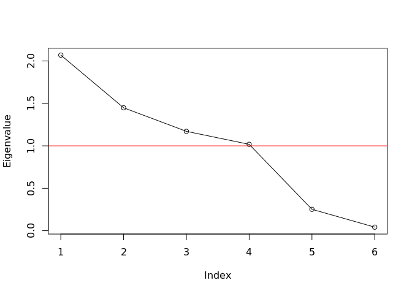
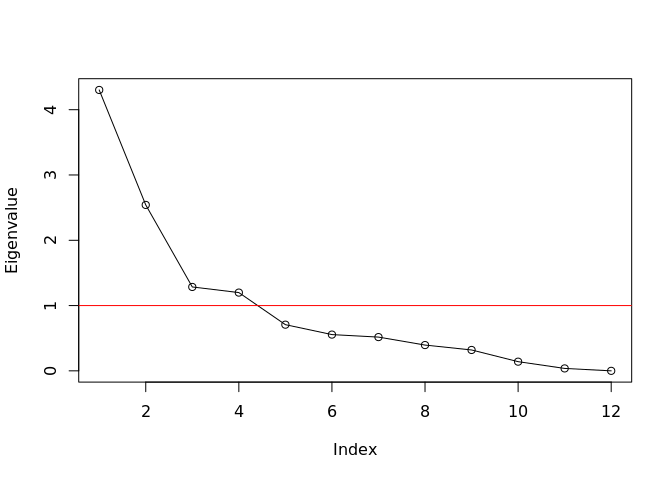

GenomicSEM of MDD symptoms
================
Mark Adams, Bradley Jermy, Jackson Thorp, Andrew Grotzinger, Michel
Nivard

# Setup

## R packages

R version

``` r
R.version
```

    ##                _                           
    ## platform       x86_64-conda-linux-gnu      
    ## arch           x86_64                      
    ## os             linux-gnu                   
    ## system         x86_64, linux-gnu           
    ## status                                     
    ## major          4                           
    ## minor          0.3                         
    ## year           2020                        
    ## month          10                          
    ## day            10                          
    ## svn rev        79318                       
    ## language       R                           
    ## version.string R version 4.0.3 (2020-10-10)
    ## nickname       Bunny-Wunnies Freak Out

Package installation

``` r
required_packages <- c('devtools', 'readr', 'tidyr', 'dplyr', 'ggplot2', 'stringr', 'corrplot')
for(pack in required_packages) if(!require(pack, character.only=TRUE)) install.packages(pack)

if(!require(GenomicSEM)) remotes::install_github("MichelNivard/GenomicSEM")

if(!require(tidySEM)) remotes::install_github("cjvanlissa/tidySEM")
```

GenomicSEM version

``` r
require(readr)
require(tidyr)
require(stringr)
require(dplyr)
require(ggplot2)
require(corrplot)
require(tidySEM)
require(GenomicSEM)

packageVersion("GenomicSEM")
```

    ## [1] '0.0.2'

# Symptom labels

MDD DSM symptoms are numbered 1-9:

``` r
# plot labels

dsm_mdd_symptoms_labels <-
read_delim("
MDD1;Mood;Mood;Dep
MDD2;Interest;Interest;Anh
MDD3;Weight⇅;Weight⇆;App
MDD3a;Weight⇊;Weight⇇;AppDec
MDD3b;Weight⇈;Weight⇉;AppInc
MDD4;Sleep⇅;Sleep⇆;Sle
MDD4a;Sleep⇊;Sleep⇇;SleDec
MDD4b;Sleep⇈;Sleep⇉;SleInc
MDD5;Motor⇅;Motor⇆;Psyc
MDD5a;Motor⇈;Motor⇉;PsycInc
MDD5b;Motor⇊;Motor⇇;PsycDec
MDD6;Fatigue;Fatigue;Fatig
MDD7;Guilt;Guilt;Guilt
MDD8;Concentrate;Concentrate;Conc
MDD9;Suicidality;Suicidality;Sui
", col_names=c('ref', 'h', 'v', 'abbv'), delim=';')

dsm_mdd_symptoms_reference <-
read_delim("
MDD1;Depressed mood most of the day, nearly every day
MDD2;Markedly diminished interest or pleasure in all, or almost all, activities most of the day, nearly every day
MDD3;Significant change in weight or appetite
MDD3a;Significant weight loss or decrease in appetite
MDD3b;Significant weight gain or increase in appetite
MDD4;Sleeping too much or not sleeping enough
MDD4a;Insomnia nearly every day
MDD4b;Hypersomnia nearly every day
MDD5;Changes in speed/amount of moving or speaking
MDD5a;Psychomotor agitation nearly every day
MDD5b;Psychomotor retardation nearly every day
MDD6;Fatigue or loss of energy nearly every day
MDD7;Feelings of worthlessness or excessive or inappropriate guilt
MDD8;Diminished ability to think or concentrate, or indecisiveness
MDD9;Recurrent thoughts of death or suicide or a suicide attempt or a specific plan for attempting suicide
", col_names=c('Reference', 'Description'), delim=';')

dsm_mdd_symptoms_reference %>%
left_join(dsm_mdd_symptoms_labels, by=c('Reference'='ref')) %>%
select(Reference, Abbreviation=abbv, Label=h, Description)
```

    ## # A tibble: 15 x 4
    ##    Reference Abbreviation Label     Description                                 
    ##    <chr>     <chr>        <chr>     <chr>                                       
    ##  1 MDD1      Dep          Mood      Depressed mood most of the day, nearly ever…
    ##  2 MDD2      Anh          Interest  Markedly diminished interest or pleasure in…
    ##  3 MDD3      App          Weight⇅   Significant change in weight or appetite    
    ##  4 MDD3a     AppDec       Weight⇊   Significant weight loss or decrease in appe…
    ##  5 MDD3b     AppInc       Weight⇈   Significant weight gain or increase in appe…
    ##  6 MDD4      Sle          Sleep⇅    Sleeping too much or not sleeping enough    
    ##  7 MDD4a     SleDec       Sleep⇊    Insomnia nearly every day                   
    ##  8 MDD4b     SleInc       Sleep⇈    Hypersomnia nearly every day                
    ##  9 MDD5      Psyc         Motor⇅    Changes in speed/amount of moving or speaki…
    ## 10 MDD5a     PsycInc      Motor⇈    Psychomotor agitation nearly every day      
    ## 11 MDD5b     PsycDec      Motor⇊    Psychomotor retardation nearly every day    
    ## 12 MDD6      Fatig        Fatigue   Fatigue or loss of energy nearly every day  
    ## 13 MDD7      Guilt        Guilt     Feelings of worthlessness or excessive or i…
    ## 14 MDD8      Conc         Concentr… Diminished ability to think or concentrate,…
    ## 15 MDD9      Sui          Suicidal… Recurrent thoughts of death or suicide or a…

# GenomicSEM covariance structure

``` r
covstruct_prefix <- 'agds_pgc.alspac_ukb.covstruct'
covstruct_r <- file.path('ldsc', paste(covstruct_prefix, 'deparse.R', sep='.'))
covstruct_rds <- file.path('ldsc', paste(covstruct_prefix, 'rds', sep='.'))

symptoms_covstruct <- dget(covstruct_r)

sumstats_prevs <- read_tsv(file.path('ldsc', paste(covstruct_prefix, 'prevs', 'txt', sep='.')))
```

    ## 
    ## ── Column specification ──────────────────────────────────────────────────────────────────────────────────────────────────────────
    ## cols(
    ##   cohorts = col_character(),
    ##   symptom = col_character(),
    ##   sumstats = col_character(),
    ##   Nca = col_double(),
    ##   Nco = col_double(),
    ##   samp_prev = col_double(),
    ##   filename = col_character(),
    ##   pop_prev = col_double(),
    ##   trait_name = col_character()
    ## )

Rename samples: AGDS/PGC is the **Clin**ical sample (`Clin`) and
ALSPAC/UKB is the **Pop**ulation sample (`Pop`); and rename symptoms
numbers (`MDD1`, `MDD2`) to abbreviations (`Dep`, `Anh`)

``` r
cohorts_sample_symptoms <-
sumstats_prevs %>%
left_join(dsm_mdd_symptoms_labels, by=c('symptom'='ref')) %>%
select(cohorts, symptom, trait_name, abbv) %>%
mutate(Sample=case_when(cohorts %in% 'AGDS_PGC' ~ 'Clin',
                        cohorts %in% 'ALSPAC_UKB' ~ 'Pop',
                        TRUE ~ NA_character_)) %>%
mutate(sample_symptom=paste0(Sample, abbv))

sample_symptoms <- cohorts_sample_symptoms$sample_symptom
names(sample_symptoms) <- cohorts_sample_symptoms$trait_name

# rename traits in covstruct
dimnames(symptoms_covstruct$S)[[2]] <-
as.vector(sample_symptoms[dimnames(symptoms_covstruct$S)[[2]]])
```

# Structural models

``` r
# trait_symptom_labels <- 
# tibble(trait=colnames(symptoms_covstruct$S)) %>%
# mutate(symptom_ref=str_extract(trait, '[:digit:][ab]?'),
#       study=str_extract(trait, '[A-Z_]+')) %>%
# mutate(ref=paste0('MDD', symptom_ref)) %>%
# left_join(dsm_mdd_symptoms_labels, by='ref') %>%
# mutate(color=recode(study, PGC='#7570b3', UKB_CIDI='#1b9e77', UKB_PHQ='#d95f02'))

# node_labels <- c(trait_symptom_labels$h, paste0('A', 1:3), 'S1')
# names(node_labels) <- c(trait_symptom_labels$trait, paste0('A', 1:3), 'S1')

# node_colors <- c(trait_symptom_labels$color, rep('white', times=3), 'grey')
# names(node_colors) <- c(trait_symptom_labels$trait, paste0('A', 1:3), 'S1')

# edge_dir <- c('forward', 'back', 'both')
# names(edge_dir) <- c('=~', '~', '~~')
```

## ADGS-PGC

### Common factor

Common factor model. Allow residual negative correlation between
directional symptoms

``` r
pgc_commonfactor.model <- "
A1 =~ NA*ClinAppDec + ClinAppInc + ClinSleDec + ClinSleInc + ClinPsycInc + ClinSui
A1 ~~ 1*A1
c3a3b > -1
ClinAppDec ~~ c3a3b*ClinAppInc
"
pgc_commonfactor.fit <- usermodel(symptoms_covstruct, estimation='DWLS', model=pgc_commonfactor.model)
```

    ## [1] "Running primary model"
    ## [1] "Calculating model chi-square"
    ## [1] "Calculating CFI"
    ## [1] "Calculating Standardized Results"
    ## [1] "Calculating SRMR"
    ## elapsed 
    ##   3.111 
    ## [1] "The S matrix was smoothed prior to model estimation due to a non-positive definite matrix. The largest absolute difference in a cell between the smoothed and non-smoothed matrix was  0.0367078980491331 As a result of the smoothing, the largest Z-statistic change for the genetic covariances was  Inf . We recommend setting the smooth_check argument to true if you are going to run a multivariate GWAS."

    ## Warning in usermodel(symptoms_covstruct, estimation = "DWLS", model =
    ## pgc_commonfactor.model): A difference greater than .025 was observed pre-
    ## and post-smoothing in the genetic covariance matrix. This reflects a large
    ## difference and results should be interpreted with caution!! This can often
    ## result from including low powered traits, and you might consider removing those
    ## traits from the model. If you are going to run a multivariate GWAS we strongly
    ## recommend setting the smooth_check argument to true to check smoothing for each
    ## SNP.

    ## Warning in usermodel(symptoms_covstruct, estimation = "DWLS", model =
    ## pgc_commonfactor.model): A difference greater than .025 was observed pre- and
    ## post-smoothing for Z-statistics in the genetic covariance matrix. This reflects
    ## a large difference and results should be interpreted with caution!! This can
    ## often result from including low powered traits, and you might consider removing
    ## those traits from the model. If you are going to run a multivariate GWAS we
    ## strongly recommend setting the smooth_check argument to true to check smoothing
    ## for each SNP.

``` r
pgc_commonfactor.fit$modelfit
```

    ##       chisq df   p_chisq      AIC CFI      SRMR
    ## df 2.604373  8 0.9566861 28.60437   1 0.1435089

``` r
pgc_commonfactor.fit$results[c(1,2,3,6,7)]
```

    ##            lhs op         rhs STD_Genotype   STD_Genotype_SE
    ## 1           A1 =~  ClinAppDec  0.671742966 0.433122026645965
    ## 2           A1 =~  ClinAppInc  0.729689563 0.521524441752345
    ## 3           A1 =~  ClinSleDec  0.746888149 0.474570264504223
    ## 4           A1 =~  ClinSleInc  0.612271642 0.461874360406521
    ## 5           A1 =~ ClinPsycInc  0.279997292 0.237173888205013
    ## 6           A1 =~     ClinSui  0.007296054 0.178669809982275
    ## 7           A1 ~~          A1  1.000000000                  
    ## 8   ClinAppDec ~~  ClinAppDec  0.548761368 0.574094487130573
    ## 9   ClinAppDec ~~  ClinAppInc -0.861169631 0.618301627013953
    ## 10  ClinAppInc ~~  ClinAppInc  0.467553163  0.79129051639139
    ## 11  ClinSleDec ~~  ClinSleDec  0.442157966 0.900065138452166
    ## 12  ClinSleInc ~~  ClinSleInc  0.625124988  1.61291792720481
    ## 13 ClinPsycInc ~~ ClinPsycInc  0.921601537 0.470933828537936
    ## 14     ClinSui ~~     ClinSui  0.999946802 0.363500519041763

``` r
fit_graph <- function(results, ...) {

  results_sort <- results %>% arrange(lhs, rhs)

  node_names <- unique(c(results_sort$lhs, results_sort$rhs))
  
  node_idx <- seq_along(node_names)
  names(node_idx) <- node_names
  
  graph <- create_graph(
    nodes_df=create_node_df(n=length(node_names),
                            label=node_labels[node_names], 
                            shape='oval', width=1,
                            fillcolor=node_colors[node_names],
                            fontcolor='black'),
    edges_df=create_edge_df(from=node_idx[results_sort$lhs],
                            to=node_idx[results_sort$rhs],
                            label=round(results_sort$STD_Genotype, 2),
                            penwidth=0.3+abs(2*results_sort$STD_Genotype),
                            dir=edge_dir[results_sort$op]),
    attr_theme="tb")
  
  return(graph)

}

# render_fit <- function(results) render_graph(fit_graph(results))

# render_fit(pgc_commonfactor.fit$results)

# pgc_commonfactor.graph <- fit_graph(pgc_commonfactor.fit$results)

add_rank_same <- function(gv, top, bottom) {

  # add in block to specify node ranks
  gv.list <- str_split(gv, '\n\n')[[1]]
  
  # move the nodes/edges element to the end
  gv.list[6] <- gv.list[5]
  
  # add manually made ranks
  gv.list[5] <- paste("{rank=same",
  paste(paste0("'", top, "'"), collapse=' '),
  "}\n{rank=same",
  paste(paste0("'", bottom, "'"), collapse=' '),
  "}")
  
  rank.gv <- paste(gv.list, collapse='\n\n')

}


# pgc_commonfactor.gv <- add_rank_same(generate_dot(pgc_commonfactor.graph), 1, 2:5)
# grViz(pgc_commonfactor.gv)

# # output as a GraphViz dot file. Replace single quotes with double quotes 
# # as that's what the command line utility expects
# cat(str_replace_all(pgc_commonfactor_rank.gv, "'", '"'), file='mdd-symptom-gsem_files/pgc_commonfactor.gv')
```

## ALSPAC-UKB (Population)

### Common factor

Common factor model. (can also consider removing) common variance shared
between the gating items (Mood: `UKB_CIDI1`, Interest: `UKB_CIDI2`) that
is uncorrelated with the common factor variance, to recover the genetic
structure among gated items)

``` r
pop_commonfactor.model <- "
A1 =~ NA*PopDep + PopAnh + PopAppDec + PopAppInc + PopSleDec + PopSleInc + PopFatig + PopGuilt + PopConc + PopSui
A1 ~~ 1*A1
PopAppDec ~~ PopAppInc
PopSleDec ~~ PopSleInc
"
pop_commonfactor.fit <- usermodel(symptoms_covstruct, estimation='DWLS', model=pop_commonfactor.model)
```

    ## [1] "Running primary model"
    ## [1] "Calculating model chi-square"
    ## [1] "Calculating CFI"
    ## [1] "Calculating Standardized Results"
    ## [1] "Calculating SRMR"
    ## elapsed 
    ##   0.992 
    ## [1] "The S matrix was smoothed prior to model estimation due to a non-positive definite matrix. The largest absolute difference in a cell between the smoothed and non-smoothed matrix was  0.00241743805150267 As a result of the smoothing, the largest Z-statistic change for the genetic covariances was  0.215273668975606 . We recommend setting the smooth_check argument to true if you are going to run a multivariate GWAS."

    ## Warning in usermodel(symptoms_covstruct, estimation = "DWLS", model =
    ## pop_commonfactor.model): A difference greater than .025 was observed pre- and
    ## post-smoothing for Z-statistics in the genetic covariance matrix. This reflects
    ## a large difference and results should be interpreted with caution!! This can
    ## often result from including low powered traits, and you might consider removing
    ## those traits from the model. If you are going to run a multivariate GWAS we
    ## strongly recommend setting the smooth_check argument to true to check smoothing
    ## for each SNP.

``` r
pop_commonfactor.fit$modelfit
```

    ##       chisq df     p_chisq      AIC       CFI      SRMR
    ## df 61.30386 33 0.001975283 105.3039 0.9918045 0.1147905

``` r
pop_commonfactor.fit$results[c(1, 2, 3, 6, 7)]
```

    ##          lhs op       rhs STD_Genotype    STD_Genotype_SE
    ## 1         A1 =~    PopDep    0.8607640 0.0466906101795276
    ## 2         A1 =~    PopSui    0.5869717 0.0983517943709417
    ## 3         A1 =~    PopAnh    0.9920183 0.0430337978866186
    ## 4         A1 =~ PopAppDec    0.1833142 0.0894139625344312
    ## 5         A1 =~ PopAppInc    0.4102110 0.0805622852724597
    ## 6         A1 =~ PopSleDec    0.5959608 0.0937668177610635
    ## 7         A1 =~ PopSleInc    0.5412317  0.102203925548916
    ## 8         A1 =~  PopFatig    0.6726953 0.0937812042741225
    ## 9         A1 =~  PopGuilt    0.6276465 0.0800933702538616
    ## 10        A1 =~   PopConc    0.7028475 0.0903103532806574
    ## 11        A1 ~~        A1    1.0000000                   
    ## 12    PopDep ~~    PopDep    0.2590854 0.0734986748136311
    ## 13    PopSui ~~    PopSui    0.6554639  0.253091999036472
    ## 14    PopAnh ~~    PopAnh    0.0158997   0.06720345272206
    ## 15 PopAppDec ~~ PopAppDec    0.9663962  0.250347667091377
    ## 16 PopAppDec ~~ PopAppInc   -0.1514390  0.141684492913494
    ## 17 PopAppInc ~~ PopAppInc    0.8317261  0.166123963868204
    ## 18 PopSleDec ~~ PopSleDec    0.6448284    0.3318270801128
    ## 19 PopSleDec ~~ PopSleInc   -0.3359880  0.212587725438762
    ## 20 PopSleInc ~~ PopSleInc    0.7070673  0.282532187235908
    ## 21  PopFatig ~~  PopFatig    0.5474803  0.322349579364671
    ## 22  PopGuilt ~~  PopGuilt    0.6060609  0.165904819996606
    ## 23   PopConc ~~   PopConc    0.5060052  0.268317184474372

``` r
# render_fit(ukb_cidi_commonfactor.fit$results)

# ukb_cidi_common.graph <- fit_graph(ukb_cidi_commonfactor.fit$results)
# ukb_cidi_common.gv <- add_rank_same(generate_dot(ukb_cidi_common.graph), 1:2, 3:12)
# grViz(ukb_cidi_common.gv)

# cat(str_replace_all(ukb_cidi_common.gv, "'", '"'), file='mdd-symptom-gsem_files/ukb_cidi_commonfactor.gv')
```

### Kendler Neale model

``` r
pop_kendler_neale.model <- "
A1 =~ NA*PopGuilt + PopConc + PopSui
A2 =~ NA*PopDep + PopAnh + PopGuilt
A3 =~ NA*PopSleDec + PopSleInc + PopFatig + PopAppDec + PopAppInc
A1 ~~ 1*A1
A2 ~~ 1*A2
A3 ~~ 1*A3
PopSleDec ~~ PopSleInc
PopAppDec ~~ PopAppInc
"
pop_kendler_neale.fit <- usermodel(symptoms_covstruct, estimation='DWLS', model=pop_kendler_neale.model)
```

    ## [1] "Running primary model"
    ## [1] "Error: The primary model produced correlations among your latent variables that are either greater than 1 or less than -1, or the latent variables have negative variances. \n              Consequently, model fit estimates could not be computed and results should likely not be interpreted. Results are provided below \n              to enable troubleshooting. A model constraint that constrains the latent correlations to be above -1, less than 1, or to have positive variances is suggested."
    ##           lhs op       rhs Unstandardized_Estimate          SE
    ## 1          A1 =~  PopGuilt            -0.151017914 0.090296804
    ## 2          A1 =~   PopConc            -0.169863019 0.026254637
    ## 3          A1 =~    PopSui            -0.107797121 0.020886408
    ## 4          A2 =~    PopDep             0.250328495 0.013235530
    ## 5          A2 =~    PopAnh             0.308642148 0.013818100
    ## 6          A2 =~  PopGuilt             0.005669144 0.091933152
    ## 7          A3 =~ PopSleDec             0.132038400 0.024862694
    ## 8          A3 =~ PopSleInc             0.119452057 0.024833130
    ## 9          A3 =~  PopFatig             0.167959780 0.029178919
    ## 10         A3 =~ PopAppDec             0.036957752 0.017667799
    ## 11         A3 =~ PopAppInc             0.121325342 0.026665762
    ## 15  PopSleDec ~~ PopSleInc            -0.016355507 0.009419855
    ## 16  PopAppDec ~~ PopAppInc            -0.008481646 0.007389486
    ## 132    PopDep ~~    PopDep             0.017832767 0.005778684
    ## 133    PopAnh ~~    PopAnh            -0.008341766 0.006606115
    ## 134 PopAppDec ~~ PopAppDec             0.033813894 0.008781665
    ## 135 PopAppInc ~~ PopAppInc             0.063431836 0.013279514
    ## 136 PopSleDec ~~ PopSleDec             0.024574392 0.013856600
    ## 137 PopSleInc ~~ PopSleInc             0.030596493 0.012904046
    ## 138  PopFatig ~~  PopFatig             0.027319398 0.017844746
    ## 139  PopGuilt ~~  PopGuilt             0.033036046 0.010696124
    ## 140   PopConc ~~   PopConc             0.022652083 0.015145812
    ## 141    PopSui ~~    PopSui             0.020702113 0.008703802
    ## 195        A1 ~~        A2            -0.853680641 0.136183243
    ## 196        A1 ~~        A3            -1.105749087 0.173890752
    ## 197        A2 ~~        A3             0.837612888 0.130914858

Add constraints to prevent variances from being negative and
correlations from going out of bounds.

``` r
pop_kendler_neale_constr.model <- "
A1 =~ NA*PopGuilt + PopConc + PopSui
A2 =~ NA*PopDep + PopAnh + PopGuilt
A3 =~ NA*PopSleDec + PopSleInc + PopFatig + PopAppDec + PopAppInc
A1 ~~ 1*A1
A2 ~~ 1*A2
A3 ~~ 1*A3
PopSleDec ~~ PopSleInc
PopAppDec ~~ PopAppInc
c2 > 0.001
PopAnh ~~ c2*PopAnh
a13 > -1.0
a13 < 1.0
A1 ~~ a13*A3
"
pop_kendler_neale_constr.fit <- usermodel(symptoms_covstruct, estimation='DWLS', model=pop_kendler_neale_constr.model)
```

    ## [1] "Running primary model"
    ## [1] "Calculating model chi-square"
    ## [1] "Calculating CFI"
    ## [1] "Calculating Standardized Results"
    ## [1] "Calculating SRMR"
    ## elapsed 
    ##  12.378 
    ## [1] "The S matrix was smoothed prior to model estimation due to a non-positive definite matrix. The largest absolute difference in a cell between the smoothed and non-smoothed matrix was  0.00241743805150267 As a result of the smoothing, the largest Z-statistic change for the genetic covariances was  0.215273668975606 . We recommend setting the smooth_check argument to true if you are going to run a multivariate GWAS."

    ## Warning in usermodel(symptoms_covstruct, estimation = "DWLS", model =
    ## pop_kendler_neale_constr.model): A difference greater than .025 was observed
    ## pre- and post-smoothing for Z-statistics in the genetic covariance matrix. This
    ## reflects a large difference and results should be interpreted with caution!!
    ## This can often result from including low powered traits, and you might consider
    ## removing those traits from the model. If you are going to run a multivariate
    ## GWAS we strongly recommend setting the smooth_check argument to true to check
    ## smoothing for each SNP.

``` r
pop_kendler_neale_constr.fit$modelfit
```

    ##       chisq df    p_chisq      AIC       CFI      SRMR
    ## df 47.01332 29 0.01855915 99.01332 0.9947841 0.1038528

``` r
pop_kendler_neale_constr.fit$results[c(1, 2, 3, 6, 7)]
```

    ##          lhs op       rhs STD_Genotype    STD_Genotype_SE
    ## 1         A1 =~    PopSui  0.615841480  0.116050596952903
    ## 2         A1 =~  PopGuilt  0.741131473  0.502859745799917
    ## 3         A1 =~   PopConc  0.759792393  0.114919648417116
    ## 4         A1 ~~        A1  1.000000000                   
    ## 5         A1 ~~        A2  0.853508230  0.132246006211706
    ## 6         A1 ~~        A3  1.000000018  0.149558677472263
    ## 7         A2 =~    PopDep  0.894673245  0.047185948888422
    ## 8         A2 =~    PopAnh  1.010984704  0.045754643052853
    ## 9         A2 =~  PopGuilt -0.065862055  0.508576038587863
    ## 10        A2 ~~        A2  1.000000000                   
    ## 11        A2 ~~        A3  0.825249163  0.124475276813336
    ## 12        A3 =~ PopAppDec  0.204170130  0.096696273003479
    ## 13        A3 =~ PopAppInc  0.444276268 0.0958682917190764
    ## 14        A3 =~ PopSleDec  0.664905828  0.121843961855603
    ## 15        A3 =~ PopSleInc  0.583288164  0.118768550634728
    ## 16        A3 =~  PopFatig  0.734167099  0.123436401509738
    ## 17        A3 ~~        A3  1.000000000                   
    ## 18    PopDep ~~    PopDep  0.199559514   0.07198120965374
    ## 19    PopSui ~~    PopSui  0.620737178  0.269867107279647
    ## 20    PopAnh ~~    PopAnh  0.001000495 0.0701145399923851
    ## 21 PopAppDec ~~ PopAppDec  0.958314271  0.249627813115527
    ## 22 PopAppDec ~~ PopAppInc -0.166950078   0.14135068683921
    ## 23 PopAppInc ~~ PopAppInc  0.802618460  0.171082422628684
    ## 24 PopSleDec ~~ PopSleDec  0.557897024  0.330867425907087
    ## 25 PopSleDec ~~ PopSleInc -0.401267454  0.217564154239465
    ## 26 PopSleInc ~~ PopSleInc  0.659772707  0.288482622239565
    ## 27  PopFatig ~~  PopFatig  0.460995251  0.322314590385343
    ## 28  PopGuilt ~~  PopGuilt  0.529708188  0.213292173371276
    ## 29   PopConc ~~   PopConc  0.422713786  0.290756280003534

``` r
#render_fit(ukb_cidi_kendler_neale_constr.fit$results)
#
#
#ukb_cidi_kendler_neale_constr.graph <- fit_graph(ukb_cidi_kendler_neale_constr.fit$results)
#ukb_cidi_kendler_neale_constr.gv <- add_rank_same(generate_dot(ukb_cidi_kendler_neale_constr.graph), 1:3, 4:13)
#grViz(ukb_cidi_kendler_neale_constr.gv)
#
#
#cat(str_replace_all(ukb_cidi_kendler_neale_constr.gv, "'", '"'), file='mdd-symptom-gsem_files/ukb_cidi_kendler_neale_constr.gv')
#
```

Check that an orthogonal model has poor fit.

``` r
pop_kendler_neale_orth.model <- "
A1 =~ NA*PopGuilt + PopConc + PopSui
A2 =~ NA*PopDep + PopAnh + PopGuilt
A3 =~ NA*PopSleDec + PopSleInc + PopFatig + PopAppDec + PopAppInc
A1 ~~ 1*A1
A2 ~~ 1*A2
A3 ~~ 1*A3
PopSleDec ~~ PopSleInc
PopAppDec ~~ PopAppInc
A1 ~~ 0*A2
A1 ~~ 0*A3
A2 ~~ 0*A3
a7 > 0.001
PopGuilt ~~ a7*PopGuilt
"
pop_kendler_neale_orth.fit <- usermodel(symptoms_covstruct, estimation='DWLS', model=pop_kendler_neale_orth.model)
```

    ## [1] "Running primary model"
    ## [1] "Calculating model chi-square"
    ## [1] "Calculating CFI"
    ## [1] "Calculating Standardized Results"

    ## Warning in sqrt(1/diag(V)): NaNs produced

    ## Warning in cov2cor(Sigma.hat): diag(.) had 0 or NA entries; non-finite result is
    ## doubtful

    ## Warning in sqrt(1/diag(V)): NaNs produced

    ## Warning in cov2cor(Sigma.hat): diag(.) had 0 or NA entries; non-finite result is
    ## doubtful

    ## [1] "Calculating SRMR"

    ## Warning in sqrt(1/diag(V)): NaNs produced

    ## Warning in sqrt(1/diag(V)): diag(.) had 0 or NA entries; non-finite result is
    ## doubtful

    ## Warning in usermodel(symptoms_covstruct, estimation = "DWLS", model =
    ## pop_kendler_neale_orth.model): CFI estimates below 0 should not be trusted, and
    ## indicate that the other model fit estimates should be interpreted with caution.
    ## A negative CFI estimates typically appears due to negative residual variances.

    ## elapsed 
    ##   3.864 
    ## [1] "The S matrix was smoothed prior to model estimation due to a non-positive definite matrix. The largest absolute difference in a cell between the smoothed and non-smoothed matrix was  0.00241743805150267 As a result of the smoothing, the largest Z-statistic change for the genetic covariances was  0.215273668975606 . We recommend setting the smooth_check argument to true if you are going to run a multivariate GWAS."

    ## Warning in usermodel(symptoms_covstruct, estimation = "DWLS", model =
    ## pop_kendler_neale_orth.model): A difference greater than .025 was observed
    ## pre- and post-smoothing for Z-statistics in the genetic covariance matrix. This
    ## reflects a large difference and results should be interpreted with caution!!
    ## This can often result from including low powered traits, and you might consider
    ## removing those traits from the model. If you are going to run a multivariate
    ## GWAS we strongly recommend setting the smooth_check argument to true to check
    ## smoothing for each SNP.

``` r
pop_kendler_neale_orth.fit$modelfit
```

    ##     chisq df p_chisq    AIC       CFI     SRMR
    ## df 593087 32       0 593133 -170.7224 2.717298

``` r
pop_kendler_neale_orth.fit$results[c(1, 2, 3, 6, 7)]
```

    ##          lhs op       rhs  STD_Genotype    STD_Genotype_SE
    ## 1         A1 =~    PopSui  0.5490704821  0.219387073147351
    ## 2         A1 =~  PopGuilt  0.8515298336  0.338496101780977
    ## 3         A1 =~   PopConc  0.5752709219  0.225885972443487
    ## 4         A1 ~~        A1  1.0000000000                   
    ## 5         A2 =~    PopDep  0.9454725166 0.0634537516933097
    ## 6         A2 =~    PopAnh  0.9787819190 0.0691237139695385
    ## 7         A2 =~  PopGuilt  0.5556673019 0.0862446018788801
    ## 8         A2 ~~        A2  1.0000000000                   
    ## 9         A3 =~ PopAppDec  0.2916992125  0.193645897895122
    ## 10        A3 =~ PopAppInc  0.3410007972  0.173828325491957
    ## 11        A3 =~ PopSleDec  0.7871347700   0.36316774104684
    ## 12        A3 =~ PopSleInc  0.6901432356  0.328511357868429
    ## 13        A3 =~  PopFatig  0.6225961511   0.19902598092816
    ## 14        A3 ~~        A3  1.0000000000                   
    ## 15    PopDep ~~    PopDep  0.1060817142  0.119538416687375
    ## 16    PopSui ~~    PopSui  0.6985135073  0.330025166904163
    ## 17    PopAnh ~~    PopAnh  0.0419862115  0.122471177277283
    ## 18 PopAppDec ~~ PopAppDec  0.9149112680  0.266631181710529
    ## 19 PopAppDec ~~ PopAppInc -0.1757118115  0.155248151479042
    ## 20 PopAppInc ~~ PopAppInc  0.8837185902  0.179986237934699
    ## 21 PopSleDec ~~ PopSleDec  0.3804171547  0.626904056589484
    ## 22 PopSleDec ~~ PopSleInc -0.5566705669  0.428187091041918
    ## 23 PopSleInc ~~ PopSleInc  0.5237020640  0.480650812737121
    ## 24  PopFatig ~~  PopFatig  0.6123743267  0.366599839987456
    ## 25  PopGuilt ~~  PopGuilt  0.0009998038  0.602677130790204
    ## 26   PopConc ~~   PopConc  0.6690350826  0.351843310160493

``` r
# render_fit(ukb_cidi_kendler_neale_orth.fit$results)

# ukb_cidi_kendler_neale_orth.graph <- fit_graph(ukb_cidi_kendler_neale_orth.fit$results)
# ukb_cidi_kendler_neale_orth.gv <- add_rank_same(generate_dot(ukb_cidi_kendler_neale_orth.graph), 1:3, 4:13)
# grViz(ukb_cidi_kendler_neale_orth.gv)

# ukb_cidi_kendler_neale_orth.gv <- generate_dot(fit_graph(ukb_cidi_kendler_neale_orth.fit$results))
# cat(str_replace_all(ukb_cidi_kendler_neale_orth.gv, "'", '"'), file='mdd-symptom-gsem_files/ukb_cidi_kendler_neale_orth.gv')
```

### Two-factor models

[Elhai Psychiat Res
2012](https://www.sciencedirect.com/science/article/pii/S0165178112002685)
compared 3 two-factor models

### Psychological-Somatic (Elhai Model 2a)

[Kruse Rehab Psychol
2008](https://psycnet.apa.org/record/2008-17022-011), [Kruse Arch Psys
Med Rehab
2010](https://www.sciencedirect.com/science/article/pii/S0003999310002443):

> the 2-factor solution with 3 somatic items (sleep disturbance, poor
> energy, appetite change) was a better solution than either a
> unidimensional model or 2-factor model that included psychomotor
> retardation as a fourth somatic item

``` r
pop_psych_soma.model <- "
A1 =~ NA*PopDep + PopAnh + PopGuilt + PopConc + PopSui 
A2 =~ NA*PopAppDec + PopAppInc + PopSleDec + PopSleInc + PopFatig
A1 ~~ 1*A1
A2 ~~ 1*A2
PopAppDec ~~ PopAppInc
PopSleDec ~~ PopSleInc
"
pop_psych_soma.fit <- usermodel(symptoms_covstruct, estimation='DWLS', model=pop_psych_soma.model)
```

    ## [1] "Running primary model"
    ## [1] "Calculating model chi-square"
    ## [1] "Calculating CFI"
    ## [1] "Calculating Standardized Results"
    ## [1] "Calculating SRMR"
    ## elapsed 
    ##   1.451 
    ## [1] "The S matrix was smoothed prior to model estimation due to a non-positive definite matrix. The largest absolute difference in a cell between the smoothed and non-smoothed matrix was  0.00241743805150267 As a result of the smoothing, the largest Z-statistic change for the genetic covariances was  0.215273668975606 . We recommend setting the smooth_check argument to true if you are going to run a multivariate GWAS."

    ## Warning in usermodel(symptoms_covstruct, estimation = "DWLS", model =
    ## pop_psych_soma.model): A difference greater than .025 was observed pre- and
    ## post-smoothing for Z-statistics in the genetic covariance matrix. This reflects
    ## a large difference and results should be interpreted with caution!! This can
    ## often result from including low powered traits, and you might consider removing
    ## those traits from the model. If you are going to run a multivariate GWAS we
    ## strongly recommend setting the smooth_check argument to true to check smoothing
    ## for each SNP.

``` r
pop_psych_soma.fit$modelfit
```

    ##       chisq df     p_chisq      AIC      CFI      SRMR
    ## df 60.27433 32 0.001811367 106.2743 0.991813 0.1143236

``` r
pop_psych_soma.fit$results[c(1,2,3,6,7)]
```

    ##          lhs op       rhs STD_Genotype    STD_Genotype_SE
    ## 1         A1 =~    PopDep  0.863064672 0.0464584973359136
    ## 2         A1 =~    PopSui  0.587384310 0.0984774458483339
    ## 3         A1 =~    PopAnh  0.995688899 0.0436161690304708
    ## 4         A1 =~  PopGuilt  0.627695097 0.0800942742653383
    ## 5         A1 =~   PopConc  0.701682078 0.0903393509000064
    ## 6         A1 ~~        A1  1.000000000                   
    ## 7         A1 ~~        A2  0.926575263  0.130043953527102
    ## 8         A2 =~ PopAppDec  0.196240130 0.0952263875946543
    ## 9         A2 =~ PopAppInc  0.432571747 0.0959699155487942
    ## 10        A2 =~ PopSleDec  0.634269003  0.120330191588086
    ## 11        A2 =~ PopSleInc  0.576228852  0.118679536522362
    ## 12        A2 =~  PopFatig  0.714329598   0.12596469640337
    ## 13        A2 ~~        A2  1.000000000                   
    ## 14    PopDep ~~    PopDep  0.255118892 0.0730130082440066
    ## 15    PopSui ~~    PopSui  0.654979419   0.25308071949663
    ## 16    PopAnh ~~    PopAnh  0.008603817 0.0690449504147907
    ## 17 PopAppDec ~~ PopAppDec  0.961491346  0.250052814493002
    ## 18 PopAppDec ~~ PopAppInc -0.161130744   0.14090551960826
    ## 19 PopAppInc ~~ PopAppInc  0.812880681   0.17057838499162
    ## 20 PopSleDec ~~ PopSleDec  0.597702706  0.329374197298671
    ## 21 PopSleDec ~~ PopSleInc -0.378918611  0.217203093565859
    ## 22 PopSleInc ~~ PopSleInc  0.667961069  0.288909375049068
    ## 23  PopFatig ~~  PopFatig  0.489732425  0.322204096220427
    ## 24  PopGuilt ~~  PopGuilt  0.605999344  0.165876610034016
    ## 25   PopConc ~~   PopConc  0.507642389  0.268420759238863

Bifactor model

``` r
pop_psych_soma_bif.model <- "
A1 =~ NA*PopDep + PopAnh + PopGuilt + PopConc + PopSui
A2 =~ NA*PopAppDec + PopAppInc + PopSleDec + PopSleInc + PopFatig
A  =~ NA*PopDep + PopAnh + PopGuilt + PopConc + PopSui + PopAppDec + PopAppInc + PopSleDec + PopSleInc + PopFatig
A1 ~~ 1*A1
A2 ~~ 1*A2
A  ~~ 1*A
A  ~~ 0*A1
A  ~~ 0*A2
A1 ~~ 0*A2
PopAppDec ~~ PopAppInc
PopSleDec ~~ PopSleInc
"
pop_psych_soma_bif.fit <- usermodel(symptoms_covstruct, estimation='DWLS', model=pop_psych_soma_bif.model)
```

    ## [1] "Running primary model"
    ## [1] "Calculating model chi-square"
    ## [1] "Calculating CFI"
    ## [1] "Calculating Standardized Results"
    ## [1] "Calculating SRMR"

    ## Warning in usermodel(symptoms_covstruct, estimation = "DWLS", model =
    ## pop_psych_soma_bif.model): CFI estimates below 0 should not be trusted, and
    ## indicate that the other model fit estimates should be interpreted with caution.
    ## A negative CFI estimates typically appears due to negative residual variances.

    ## elapsed 
    ##   1.259 
    ## [1] "The S matrix was smoothed prior to model estimation due to a non-positive definite matrix. The largest absolute difference in a cell between the smoothed and non-smoothed matrix was  0.00241743805150267 As a result of the smoothing, the largest Z-statistic change for the genetic covariances was  0.215273668975606 . We recommend setting the smooth_check argument to true if you are going to run a multivariate GWAS."

    ## Warning in usermodel(symptoms_covstruct, estimation = "DWLS", model =
    ## pop_psych_soma_bif.model): A difference greater than .025 was observed pre- and
    ## post-smoothing for Z-statistics in the genetic covariance matrix. This reflects
    ## a large difference and results should be interpreted with caution!! This can
    ## often result from including low powered traits, and you might consider removing
    ## those traits from the model. If you are going to run a multivariate GWAS we
    ## strongly recommend setting the smooth_check argument to true to check smoothing
    ## for each SNP.

``` r
pop_psych_soma_bif.fit$model
```

    ##       chisq df p_chisq      AIC       CFI       SRMR
    ## df 485502.6 23       0 485566.6 -139.5734 0.06729105

``` r
pop_psych_soma_bif.fit$results[c(1,2,3,6,7)]
```

    ##          lhs op       rhs STD_Genotype    STD_Genotype_SE
    ## 1          A =~    PopDep   0.64917096  0.107092905998155
    ## 2          A =~    PopSui   0.45629577    0.1298262189653
    ## 3          A =~    PopAnh   0.82272521 0.0805038009168207
    ## 4          A =~ PopAppDec   0.21837393 0.0995621785055131
    ## 5          A =~ PopAppInc   0.47085224 0.0921815994250373
    ## 6          A =~ PopSleDec   0.69768431  0.115406726164414
    ## 7          A =~ PopSleInc   0.60169271  0.114187201718315
    ## 8          A =~  PopFatig   0.78089610  0.114299390127445
    ## 9          A =~  PopGuilt   0.61613397  0.104211783453717
    ## 10         A =~   PopConc   0.90083618   0.12201710883133
    ## 11         A ~~         A   1.00000000                   
    ## 12        A1 =~    PopDep   0.89201252  0.221103701454368
    ## 13        A1 =~    PopSui   0.36951161  0.197887204915754
    ## 14        A1 =~    PopAnh   0.42987565  0.140309010511112
    ## 15        A1 =~  PopGuilt   0.15552736  0.145277654999182
    ## 16        A1 =~   PopConc  -0.14439324  0.190532194449646
    ## 17        A1 ~~        A1   1.00000000                   
    ## 18        A2 =~ PopAppDec   0.20011193  0.233574387115506
    ## 19        A2 =~ PopAppInc   0.23894629  0.251319017840937
    ## 20        A2 =~ PopSleDec   0.61375265  0.620528556913506
    ## 21        A2 =~ PopSleInc  -0.57941347  0.484387153376134
    ## 22        A2 =~  PopFatig  -0.39168634  0.328909439605664
    ## 23        A2 ~~        A2   1.00000000                   
    ## 24    PopDep ~~    PopDep  -0.21710924  0.356047779078905
    ## 25    PopSui ~~    PopSui   0.65525301  0.255883600116542
    ## 26    PopAnh ~~    PopAnh   0.13833046  0.101120832980849
    ## 27 PopAppDec ~~ PopAppDec   0.91226801  0.250724185051713
    ## 28 PopAppDec ~~ PopAppInc  -0.22687969  0.159900567180304
    ## 29 PopAppInc ~~ PopAppInc   0.72120217  0.224530476944691
    ## 30 PopSleDec ~~ PopSleDec   0.13654318  0.799878623655981
    ## 31 PopSleDec ~~ PopSleInc  -0.07760873  0.617014313797065
    ## 32 PopSleInc ~~ PopSleInc   0.30224622  0.637675680680915
    ## 33  PopFatig ~~  PopFatig   0.23678280  0.427605949685846
    ## 34  PopGuilt ~~  PopGuilt   0.59619049  0.171112153440509
    ## 35   PopConc ~~   PopConc   0.16764380  0.312128013483498

Add constraints for negative variances

``` r
pop_psych_soma_bif_constr.model <- "
A1 =~ NA*PopDep + PopAnh + PopGuilt + PopConc + PopSui
A2 =~ NA*PopAppDec + PopAppInc + PopSleDec + PopSleInc + PopFatig
A  =~ NA*PopDep + PopAnh + PopGuilt + PopConc + PopSui + PopAppDec + PopAppInc + PopSleDec + PopSleInc + PopFatig
A1 ~~ 1*A1
A2 ~~ 1*A2
A  ~~ 1*A
A  ~~ 0*A1
A  ~~ 0*A2
A1 ~~ 0*A2
PopAppDec ~~ PopAppInc
PopSleDec ~~ PopSleInc
c1 > 0.001
PopDep ~~ c1*PopDep
"
pop_psych_soma_bif_constr.fit <- usermodel(symptoms_covstruct, estimation='DWLS', model=pop_psych_soma_bif_constr.model)
```

    ## [1] "Running primary model"
    ## [1] "Calculating model chi-square"
    ## [1] "Calculating CFI"
    ## [1] "Calculating Standardized Results"
    ## [1] "Calculating SRMR"
    ## elapsed 
    ##   9.371 
    ## [1] "The S matrix was smoothed prior to model estimation due to a non-positive definite matrix. The largest absolute difference in a cell between the smoothed and non-smoothed matrix was  0.00241743805150267 As a result of the smoothing, the largest Z-statistic change for the genetic covariances was  0.215273668975606 . We recommend setting the smooth_check argument to true if you are going to run a multivariate GWAS."

    ## Warning in usermodel(symptoms_covstruct, estimation = "DWLS", model =
    ## pop_psych_soma_bif_constr.model): A difference greater than .025 was observed
    ## pre- and post-smoothing for Z-statistics in the genetic covariance matrix. This
    ## reflects a large difference and results should be interpreted with caution!!
    ## This can often result from including low powered traits, and you might consider
    ## removing those traits from the model. If you are going to run a multivariate
    ## GWAS we strongly recommend setting the smooth_check argument to true to check
    ## smoothing for each SNP.

``` r
pop_psych_soma_bif_constr.fit$model
```

    ##       chisq df   p_chisq      AIC CFI       SRMR
    ## df 19.67502 23 0.6614279 83.67502   1 0.06643595

``` r
pop_psych_soma_bif_constr.fit$results[c(1,2,3,6,7)]
```

    ##          lhs op       rhs  STD_Genotype    STD_Genotype_SE
    ## 1          A =~    PopDep  0.6676335780  0.111763300987794
    ## 2          A =~    PopSui  0.4457621095  0.131024633329786
    ## 3          A =~    PopAnh  0.8324925451 0.0861602539545531
    ## 4          A =~ PopAppDec  0.2143193375 0.0986669104881877
    ## 5          A =~ PopAppInc  0.4657863469 0.0920787679251481
    ## 6          A =~ PopSleDec  0.6900256850   0.11667360390346
    ## 7          A =~ PopSleInc  0.5954949600  0.113463386324774
    ## 8          A =~  PopFatig  0.7703137219  0.114895023472772
    ## 9          A =~  PopGuilt  0.6094743386  0.105476199638746
    ## 10         A =~   PopConc  0.9317227415  0.130526010702643
    ## 11         A ~~         A  1.0000000000                   
    ## 12        A1 =~    PopDep  0.7483454090  0.169746728646174
    ## 13        A1 =~    PopSui  0.4125166426  0.199413703450941
    ## 14        A1 =~    PopAnh  0.4699036286  0.135642196425763
    ## 15        A1 =~  PopGuilt  0.1692507066  0.162023478332564
    ## 16        A1 =~   PopConc -0.2189427068  0.256179935416009
    ## 17        A1 ~~        A1  1.0000000000                   
    ## 18        A2 =~ PopAppDec  0.1966937512  0.233133442438127
    ## 19        A2 =~ PopAppInc  0.2219037756  0.251886095744553
    ## 20        A2 =~ PopSleDec  0.6550197913  0.709328112002848
    ## 21        A2 =~ PopSleInc -0.6164099048  0.560521521401701
    ## 22        A2 =~  PopFatig -0.3650572525  0.332724568947311
    ## 23        A2 ~~        A2  1.0000000000                   
    ## 24    PopDep ~~    PopDep  0.0009998845  0.181274949289361
    ## 25    PopSui ~~    PopSui  0.6311244817  0.259807767876265
    ## 26    PopAnh ~~    PopAnh  0.0861463334 0.0866024530355007
    ## 27 PopAppDec ~~ PopAppDec  0.9153786465  0.250924432594799
    ## 28 PopAppDec ~~ PopAppInc -0.2197160754  0.159765697511866
    ## 29 PopAppInc ~~ PopAppInc  0.7338021263  0.218190546103378
    ## 30 PopSleDec ~~ PopSleDec  0.0948137503  0.954775718435947
    ## 31 PopSleDec ~~ PopSleInc -0.0205799052  0.755794920715914
    ## 32 PopSleInc ~~ PopSleInc  0.2654253910   0.75326063723276
    ## 33  PopFatig ~~  PopFatig  0.2733511777  0.420205574122971
    ## 34  PopGuilt ~~  PopGuilt  0.5998956952  0.169585145672037
    ## 35   PopConc ~~   PopConc  0.0839522288  0.362766888539619

### Psychological-Neurovegetative (Elhai Model 2b)

``` r
pop_psych_veg.model <- "
A1 =~ NA*PopDep + PopAnh + PopGuilt + PopSui
A2 =~ NA*PopAppDec + PopAppInc + PopSleDec + PopSleInc + PopFatig + PopConc
A1 ~~ 1*A1
A2 ~~ 1*A2
PopAppDec ~~ PopAppInc
PopSleDec ~~ PopSleInc
"
pop_psych_veg.fit <- usermodel(symptoms_covstruct, estimation='DWLS', model=pop_psych_veg.model)
```

    ## [1] "Running primary model"
    ## [1] "Calculating model chi-square"
    ## [1] "Calculating CFI"
    ## [1] "Calculating Standardized Results"
    ## [1] "Calculating SRMR"

    ## Warning in usermodel(symptoms_covstruct, estimation = "DWLS", model =
    ## pop_psych_veg.model): CFI estimates below 0 should not be trusted, and indicate
    ## that the other model fit estimates should be interpreted with caution. A
    ## negative CFI estimates typically appears due to negative residual variances.

    ## elapsed 
    ##   1.332 
    ## [1] "The S matrix was smoothed prior to model estimation due to a non-positive definite matrix. The largest absolute difference in a cell between the smoothed and non-smoothed matrix was  0.00241743805150267 As a result of the smoothing, the largest Z-statistic change for the genetic covariances was  0.215273668975606 . We recommend setting the smooth_check argument to true if you are going to run a multivariate GWAS."

    ## Warning in usermodel(symptoms_covstruct, estimation = "DWLS", model =
    ## pop_psych_veg.model): A difference greater than .025 was observed pre- and post-
    ## smoothing for Z-statistics in the genetic covariance matrix. This reflects a
    ## large difference and results should be interpreted with caution!! This can often
    ## result from including low powered traits, and you might consider removing those
    ## traits from the model. If you are going to run a multivariate GWAS we strongly
    ## recommend setting the smooth_check argument to true to check smoothing for each
    ## SNP.

``` r
pop_psych_veg.fit$modelfit
```

    ##       chisq df p_chisq      AIC       CFI      SRMR
    ## df 479737.9 32       0 479783.9 -137.9015 0.1001125

``` r
pop_psych_veg.fit$results[c(1,2,3,6,7)]
```

    ##          lhs op       rhs STD_Genotype    STD_Genotype_SE
    ## 1         A1 =~    PopDep   0.87459978  0.045966537484283
    ## 2         A1 =~    PopSui   0.58969669 0.0987995393857968
    ## 3         A1 =~    PopAnh   1.01598268 0.0444470291276587
    ## 4         A1 =~  PopGuilt   0.62688212 0.0804109169532958
    ## 5         A1 ~~        A1   1.00000000                   
    ## 6         A1 ~~        A2   0.79395479 0.0787259776436713
    ## 7         A2 =~ PopAppDec   0.21254099   0.10154345785987
    ## 8         A2 =~ PopAppInc   0.46925035 0.0945397788155768
    ## 9         A2 =~ PopSleDec   0.69960430  0.114160136422767
    ## 10        A2 =~ PopSleInc   0.62199039  0.118409822670746
    ## 11        A2 =~  PopFatig   0.77313750  0.112989574411566
    ## 12        A2 =~   PopConc   0.82446852  0.107423828910382
    ## 13        A2 ~~        A2   1.00000000                   
    ## 14    PopDep ~~    PopDep   0.23507504 0.0729563067620555
    ## 15    PopSui ~~    PopSui   0.65225872  0.253044508907762
    ## 16    PopAnh ~~    PopAnh  -0.03222148 0.0727160103402794
    ## 17 PopAppDec ~~ PopAppDec   0.95482639  0.249651694868224
    ## 18 PopAppDec ~~ PopAppInc  -0.17597743  0.142593079292234
    ## 19 PopAppInc ~~ PopAppInc   0.77980426  0.174267455042839
    ## 20 PopSleDec ~~ PopSleDec   0.51055123  0.334282887228188
    ## 21 PopSleDec ~~ PopSleInc  -0.44858103  0.214304976606198
    ## 22 PopSleInc ~~ PopSleInc   0.61312782   0.28620861967373
    ## 23  PopFatig ~~  PopFatig   0.40225749  0.320661538163167
    ## 24  PopGuilt ~~  PopGuilt   0.60702000  0.166029314274131
    ## 25   PopConc ~~   PopConc   0.32025084  0.277041234575549

``` r
pop_psych_veg_const.model <- "
A1 =~ NA*PopDep + PopAnh + PopGuilt + PopSui
A2 =~ NA*PopAppDec + PopAppInc + PopSleDec + PopSleInc + PopFatig + PopConc
A1 ~~ 1*A1
A2 ~~ 1*A2
PopAppDec ~~ PopAppInc
PopSleDec ~~ PopSleInc
c2 > 0.001
PopAnh ~~ c2*PopAnh
"
pop_psych_veg_const.fit <- usermodel(symptoms_covstruct, estimation='DWLS', model=pop_psych_veg_const.model)
```

    ## [1] "Running primary model"
    ## [1] "Calculating model chi-square"
    ## [1] "Calculating CFI"
    ## [1] "Calculating Standardized Results"
    ## [1] "Calculating SRMR"
    ## elapsed 
    ##     5.2 
    ## [1] "The S matrix was smoothed prior to model estimation due to a non-positive definite matrix. The largest absolute difference in a cell between the smoothed and non-smoothed matrix was  0.00241743805150267 As a result of the smoothing, the largest Z-statistic change for the genetic covariances was  0.215273668975606 . We recommend setting the smooth_check argument to true if you are going to run a multivariate GWAS."

    ## Warning in usermodel(symptoms_covstruct, estimation = "DWLS", model =
    ## pop_psych_veg_const.model): A difference greater than .025 was observed pre- and
    ## post-smoothing for Z-statistics in the genetic covariance matrix. This reflects
    ## a large difference and results should be interpreted with caution!! This can
    ## often result from including low powered traits, and you might consider removing
    ## those traits from the model. If you are going to run a multivariate GWAS we
    ## strongly recommend setting the smooth_check argument to true to check smoothing
    ## for each SNP.

``` r
pop_psych_veg_const.fit$modelfit
```

    ##       chisq df     p_chisq      AIC       CFI       SRMR
    ## df 55.12347 32 0.006734974 101.1235 0.9933045 0.09996144

``` r
pop_psych_veg_const.fit$results[c(1,2,3,6,7)]
```

    ##          lhs op       rhs STD_Genotype    STD_Genotype_SE
    ## 1         A1 =~    PopDep  0.878400385 0.0461853279894843
    ## 2         A1 =~    PopSui  0.592034940 0.0990942853983336
    ## 3         A1 =~    PopAnh  1.004031815 0.0442012060946676
    ## 4         A1 =~  PopGuilt  0.629012048 0.0806399618859646
    ## 5         A1 ~~        A1  1.000000000                   
    ## 6         A1 ~~        A2  0.796957513  0.078992941149967
    ## 7         A2 =~ PopAppDec  0.212722030  0.101536482016702
    ## 8         A2 =~ PopAppInc  0.469113076 0.0945707667865009
    ## 9         A2 =~ PopSleDec  0.700384420  0.114211585836254
    ## 10        A2 =~ PopSleInc  0.621762648  0.118465804398949
    ## 11        A2 =~  PopFatig  0.772779909  0.113004292532094
    ## 12        A2 =~   PopConc  0.824617477  0.107452449414359
    ## 13        A2 ~~        A2  1.000000000                   
    ## 14    PopDep ~~    PopDep  0.228412450 0.0733725773201968
    ## 15    PopSui ~~    PopSui  0.649486112  0.253174249347659
    ## 16    PopAnh ~~    PopAnh  0.001000063 0.0711897502903704
    ## 17 PopAppDec ~~ PopAppDec  0.954749160  0.249649445803563
    ## 18 PopAppDec ~~ PopAppInc -0.176032919  0.142598974927183
    ## 19 PopAppInc ~~ PopAppInc  0.779933102  0.174294276010303
    ## 20 PopSleDec ~~ PopSleDec  0.509453189  0.334444946312341
    ## 21 PopSleDec ~~ PopSleInc -0.448907521  0.214328641585292
    ## 22 PopSleInc ~~ PopSleInc  0.613412725  0.286225084564254
    ## 23  PopFatig ~~  PopFatig  0.402815964  0.320741764019486
    ## 24  PopGuilt ~~  PopGuilt  0.604342110   0.16616046692378
    ## 25   PopConc ~~   PopConc  0.320005540  0.277147389328428

``` r
pop_psych_veg_bif.model <- "
A1 =~ NA*PopDep + PopAnh + PopGuilt + PopSui
A2 =~ NA*PopAppDec + PopAppInc + PopSleDec + PopSleInc + PopFatig + PopConc
A  =~ NA*PopDep + PopAnh + PopGuilt + PopSui + PopAppDec + PopAppInc + PopSleDec + PopSleInc + PopFatig + PopConc
A1 ~~ 1*A1
A2 ~~ 1*A2
A  ~~ 1*A
A ~~ 0*A1
A ~~ 0*A2
A1 ~~ 0*A2
PopAppDec ~~ PopAppInc
PopSleDec ~~ PopSleInc
"
pop_psych_veg_bif.fit <- usermodel(symptoms_covstruct, estimation='DWLS', model=pop_psych_veg_bif.model)
```

    ## [1] "Running primary model"
    ## [1] "Calculating model chi-square"
    ## [1] "Calculating CFI"
    ## [1] "Calculating Standardized Results"
    ## [1] "Calculating SRMR"

    ## Warning in usermodel(symptoms_covstruct, estimation = "DWLS", model =
    ## pop_psych_veg_bif.model): CFI estimates below 0 should not be trusted, and
    ## indicate that the other model fit estimates should be interpreted with caution.
    ## A negative CFI estimates typically appears due to negative residual variances.

    ## elapsed 
    ##   1.433 
    ## [1] "The S matrix was smoothed prior to model estimation due to a non-positive definite matrix. The largest absolute difference in a cell between the smoothed and non-smoothed matrix was  0.00241743805150267 As a result of the smoothing, the largest Z-statistic change for the genetic covariances was  0.215273668975606 . We recommend setting the smooth_check argument to true if you are going to run a multivariate GWAS."

    ## Warning in usermodel(symptoms_covstruct, estimation = "DWLS", model =
    ## pop_psych_veg_bif.model): A difference greater than .025 was observed pre- and
    ## post-smoothing for Z-statistics in the genetic covariance matrix. This reflects
    ## a large difference and results should be interpreted with caution!! This can
    ## often result from including low powered traits, and you might consider removing
    ## those traits from the model. If you are going to run a multivariate GWAS we
    ## strongly recommend setting the smooth_check argument to true to check smoothing
    ## for each SNP.

``` r
pop_psych_veg_bif.fit$modelfit
```

    ##       chisq df p_chisq      AIC       CFI       SRMR
    ## df 490106.1 23       0 490170.1 -140.9063 0.06656973

``` r
pop_psych_veg_bif.fit$results[c(1,2,3,6,7)]
```

    ##          lhs op       rhs STD_Genotype    STD_Genotype_SE
    ## 1          A =~    PopDep    0.6044557  0.092041501653454
    ## 2          A =~    PopSui    0.4589216  0.141060043820136
    ## 3          A =~    PopAnh    0.8087342 0.0826889257251434
    ## 4          A =~ PopAppDec    0.2181156  0.102408256389839
    ## 5          A =~ PopAppInc    0.4717514  0.096087714671629
    ## 6          A =~ PopSleDec    0.6938742  0.119812026375258
    ## 7          A =~ PopSleInc    0.6373248  0.120607807778284
    ## 8          A =~  PopFatig    0.8197886  0.125364419721638
    ## 9          A =~  PopGuilt    0.6140445   0.10619412218942
    ## 10         A =~   PopConc    0.8364829  0.105906590675604
    ## 11         A ~~         A    1.0000000                   
    ## 12        A1 =~    PopDep    1.0083420  0.311796567582867
    ## 13        A1 =~    PopSui    0.3461383  0.214032491307196
    ## 14        A1 =~    PopAnh    0.4277235  0.177176471695424
    ## 15        A1 =~  PopGuilt    0.1664313   0.14259776855054
    ## 16        A1 ~~        A1    1.0000000                   
    ## 17        A2 =~ PopAppDec    0.1815949  0.224215231097346
    ## 18        A2 =~ PopAppInc    0.3024923  0.251296759792826
    ## 19        A2 =~ PopSleDec    0.5926815  0.474540234108456
    ## 20        A2 =~ PopSleInc   -0.4956837  0.355465792843963
    ## 21        A2 =~  PopFatig   -0.3973376  0.334195860539478
    ## 22        A2 =~   PopConc    0.2210417  0.195252087546072
    ## 23        A2 ~~        A2    1.0000000                   
    ## 24    PopDep ~~    PopDep   -0.3821203  0.630290264287142
    ## 25    PopSui ~~    PopSui    0.6695800  0.253818028067509
    ## 26    PopAnh ~~    PopAnh    0.1630017  0.115821596448017
    ## 27 PopAppDec ~~ PopAppDec    0.9194496  0.245926994552368
    ## 28 PopAppDec ~~ PopAppInc   -0.2340699  0.157937681155278
    ## 29 PopAppInc ~~ PopAppInc    0.6859489  0.242404337796954
    ## 30 PopSleDec ~~ PopSleDec    0.1672677  0.593871243667151
    ## 31 PopSleDec ~~ PopSleInc   -0.1618743  0.444025004691834
    ## 32 PopSleInc ~~ PopSleInc    0.3481150  0.469266909767025
    ## 33  PopFatig ~~  PopFatig    0.1700691  0.471810224216652
    ## 34  PopGuilt ~~  PopGuilt    0.5952502  0.172606269117778
    ## 35   PopConc ~~   PopConc    0.2514361  0.296003314921411

``` r
pop_psych_veg_bif_constr.model <- "
A1 =~ NA*PopDep + PopAnh + PopGuilt + PopSui
A2 =~ NA*PopAppDec + PopAppInc + PopSleDec + PopSleInc + PopFatig + PopConc
A  =~ NA*PopDep + PopAnh + PopGuilt + PopSui + PopAppDec + PopAppInc + PopSleDec + PopSleInc + PopFatig + PopConc
A1 ~~ 1*A1
A2 ~~ 1*A2
A  ~~ 1*A
A ~~ 0*A1
A ~~ 0*A2
A1 ~~ 0*A2
PopAppDec ~~ PopAppInc
PopSleDec ~~ PopSleInc
c1 > 0.001
PopDep ~~ c1*PopDep
"
pop_psych_veg_bif_constr.fit <- usermodel(symptoms_covstruct, estimation='DWLS', model=pop_psych_veg_bif_constr.model)
```

    ## [1] "Running primary model"
    ## [1] "Calculating model chi-square"
    ## [1] "Calculating CFI"
    ## [1] "Calculating Standardized Results"
    ## [1] "Calculating SRMR"
    ## elapsed 
    ##   7.896 
    ## [1] "The S matrix was smoothed prior to model estimation due to a non-positive definite matrix. The largest absolute difference in a cell between the smoothed and non-smoothed matrix was  0.00241743805150267 As a result of the smoothing, the largest Z-statistic change for the genetic covariances was  0.215273668975606 . We recommend setting the smooth_check argument to true if you are going to run a multivariate GWAS."

    ## Warning in usermodel(symptoms_covstruct, estimation = "DWLS", model =
    ## pop_psych_veg_bif_constr.model): A difference greater than .025 was observed
    ## pre- and post-smoothing for Z-statistics in the genetic covariance matrix. This
    ## reflects a large difference and results should be interpreted with caution!!
    ## This can often result from including low powered traits, and you might consider
    ## removing those traits from the model. If you are going to run a multivariate
    ## GWAS we strongly recommend setting the smooth_check argument to true to check
    ## smoothing for each SNP.

``` r
pop_psych_veg_bif_constr.fit$modelfit
```

    ##       chisq df   p_chisq      AIC CFI       SRMR
    ## df 18.61609 23 0.7232681 82.61609   1 0.06666637

``` r
pop_psych_veg_bif_constr.fit$results[c(1,2,3,6,7)]
```

    ##          lhs op       rhs STD_Genotype    STD_Genotype_SE
    ## 1          A =~    PopDep  0.609002278  0.091580205400402
    ## 2          A =~    PopSui  0.427437515  0.141433235636829
    ## 3          A =~    PopAnh  0.797935606 0.0829693868052522
    ## 4          A =~ PopAppDec  0.219702918  0.102995854303073
    ## 5          A =~ PopAppInc  0.475419363 0.0970455439244419
    ## 6          A =~ PopSleDec  0.699903130  0.121507360650327
    ## 7          A =~ PopSleInc  0.641284860  0.121779256447642
    ## 8          A =~  PopFatig  0.826668335  0.126754295057983
    ## 9          A =~  PopGuilt  0.595256964  0.111856944771487
    ## 10         A =~   PopConc  0.843562401  0.106963635965607
    ## 11         A ~~         A  1.000000000                   
    ## 12        A1 =~    PopDep  0.798818956  0.152049524843496
    ## 13        A1 =~    PopSui  0.421749532  0.199217216853427
    ## 14        A1 =~    PopAnh  0.527071815  0.137543255257288
    ## 15        A1 =~  PopGuilt  0.211543218  0.155454396837176
    ## 16        A1 ~~        A1  1.000000000                   
    ## 17        A2 =~ PopAppDec  0.177377200  0.226164726734008
    ## 18        A2 =~ PopAppInc  0.311624587  0.250806076665366
    ## 19        A2 =~ PopSleDec  0.568618194   0.44867836849798
    ## 20        A2 =~ PopSleInc -0.486064633  0.339897433431728
    ## 21        A2 =~  PopFatig -0.416135564  0.342278259964816
    ## 22        A2 =~   PopConc  0.222854314  0.196118045056334
    ## 23        A2 ~~        A2  1.000000000                   
    ## 24    PopDep ~~    PopDep  0.001000173  0.211722685264051
    ## 25    PopSui ~~    PopSui  0.639422803  0.257615900093583
    ## 26    PopAnh ~~    PopAnh  0.085493784 0.0950328498414865
    ## 27 PopAppDec ~~ PopAppDec  0.920267936  0.246275045229308
    ## 28 PopAppDec ~~ PopAppInc -0.235968385  0.158405431855745
    ## 29 PopAppInc ~~ PopAppInc  0.676866448  0.246481760661282
    ## 30 PopSleDec ~~ PopSleDec  0.186810706   0.55170683985908
    ## 31 PopSleDec ~~ PopSleInc -0.185886935  0.416409875293986
    ## 32 PopSleInc ~~ PopSleInc  0.352495992  0.452979826972307
    ## 33  PopFatig ~~  PopFatig  0.143451219  0.485129098082666
    ## 34  PopGuilt ~~  PopGuilt  0.600918715  0.170337650140682
    ## 35   PopConc ~~   PopConc  0.238738369  0.298097730494008

### Affective-Neurovegetative (Elhai Model 2c)

``` r
pop_affect_veg.model <- "
A1 =~ NA*PopDep + PopGuilt + PopSui
A2 =~ NA*PopAnh + PopAppInc + PopAppDec + PopSleInc + PopSleDec + PopFatig + PopConc
A1 ~~ 1*A1
A2 ~~ 1*A2
PopAppInc ~~ PopAppDec
PopSleInc ~~ PopSleDec
"
pop_affect_veg.fit <- usermodel(symptoms_covstruct, estimation='DWLS', model=pop_affect_veg.model)
```

    ## [1] "Running primary model"
    ## [1] "Calculating model chi-square"
    ## [1] "Calculating CFI"
    ## [1] "Calculating Standardized Results"
    ## [1] "Calculating SRMR"
    ## elapsed 
    ##   1.645 
    ## [1] "The S matrix was smoothed prior to model estimation due to a non-positive definite matrix. The largest absolute difference in a cell between the smoothed and non-smoothed matrix was  0.00241743805150267 As a result of the smoothing, the largest Z-statistic change for the genetic covariances was  0.215273668975606 . We recommend setting the smooth_check argument to true if you are going to run a multivariate GWAS."

    ## Warning in usermodel(symptoms_covstruct, estimation = "DWLS", model =
    ## pop_affect_veg.model): A difference greater than .025 was observed pre- and
    ## post-smoothing for Z-statistics in the genetic covariance matrix. This reflects
    ## a large difference and results should be interpreted with caution!! This can
    ## often result from including low powered traits, and you might consider removing
    ## those traits from the model. If you are going to run a multivariate GWAS we
    ## strongly recommend setting the smooth_check argument to true to check smoothing
    ## for each SNP.

``` r
pop_affect_veg.fit$modelfit
```

    ##                                              chisq df  AIC
    ## df The follow-up chi-square model did not converge 32 <NA>
    ##                                                                         CFI
    ## df Either the chi-square or null (i.e. independence) model did not converge
    ##                 SRMR
    ## df 0.112833076708596

``` r
pop_affect_veg.fit$results
```

    ##          lhs op       rhs  Unstand_Est          Unstand_SE STD_Genotype
    ## 1         A1 =~    PopDep  0.258783853  0.0166026261656101   0.91211012
    ## 2         A1 =~    PopSui  0.109576782  0.0183749243278817   0.60949219
    ## 3         A1 =~  PopGuilt  0.153731983  0.0197899169859094   0.64202152
    ## 4         A1 ~~        A1  1.000000000                       1.00000000
    ## 5         A1 ~~        A2  0.910455571   0.066462261925497   0.91045516
    ## 6         A2 =~    PopAnh  0.299530829  0.0147303192421221   1.01598217
    ## 7         A2 =~ PopAppDec  0.034450976  0.0169092289920516   0.18367753
    ## 8         A2 =~ PopAppInc  0.115604156  0.0226555389055093   0.41352745
    ## 9         A2 =~ PopSleDec  0.122330924  0.0193601414536147   0.59685415
    ## 10        A2 =~ PopSleInc  0.115728772  0.0217267410904868   0.54636904
    ## 11        A2 =~  PopFatig  0.159790909  0.0222729627903957   0.67809269
    ## 12        A2 =~   PopConc  0.160484814  0.0206275649188492   0.70714207
    ## 13        A2 ~~        A2  1.000000000                       1.00000000
    ## 14    PopDep ~~    PopDep  0.013527992 0.00904177930575726   0.16805526
    ## 15    PopSui ~~    PopSui  0.020315152 0.00820770402056188   0.62851842
    ## 16    PopAnh ~~    PopAnh -0.002800609 0.00793963061274553  -0.03222026
    ## 17 PopAppDec ~~ PopAppDec  0.033992932 0.00880639727492701   0.96626383
    ## 18 PopAppInc ~~ PopAppDec -0.007980399 0.00743820330296119  -0.15219749
    ## 19 PopAppInc ~~ PopAppInc  0.064787316  0.0129874876071403   0.82899512
    ## 20 PopSleDec ~~ PopSleDec  0.027043601  0.0139076475245693   0.64375860
    ## 21 PopSleInc ~~ PopSleDec -0.014740426 0.00923637408876773  -0.33953827
    ## 22 PopSleInc ~~ PopSleInc  0.031472223  0.0126819430255489   0.70148445
    ## 23  PopFatig ~~  PopFatig  0.029996651  0.0178452141403562   0.54018754
    ## 24  PopGuilt ~~  PopGuilt  0.033702814 0.00968514188557904   0.58780929
    ## 25   PopConc ~~   PopConc  0.025750092  0.0137848446355205   0.49994956
    ##       STD_Genotype_SE     STD_All      p_value
    ## 1  0.0585176172125825  0.91211006 8.933427e-55
    ## 2   0.102205635796504  0.60949245 2.470625e-09
    ## 3  0.0826473621609597  0.64202122 7.961089e-15
    ## 4                      1.00000000           NA
    ## 5  0.0664621947726547  0.91045516 1.031660e-42
    ## 6  0.0499639437073279  1.01598242 6.393678e-92
    ## 7  0.0901523744483277  0.18367741 4.160931e-02
    ## 8  0.0810411037515727  0.41352743 3.348621e-07
    ## 9  0.0944583250415696  0.59685610 2.637729e-10
    ## 10  0.102574463773352  0.54636807 1.000907e-07
    ## 11 0.0945180597250968  0.67809363 7.272600e-13
    ## 12 0.0908910014531159  0.70714226 7.245903e-15
    ## 13                     1.00000000           NA
    ## 14  0.112324299532864  0.16805524 1.346107e-01
    ## 15  0.253933651905749  0.62851896 1.331869e-02
    ## 16 0.0913459695776288 -0.03222028 7.242849e-01
    ## 17  0.250325446263875  0.96626261 1.133745e-04
    ## 18  0.141857513545566 -0.17005274 2.833189e-01
    ## 19  0.166183166491317  0.82899506 6.086849e-07
    ## 20    0.3310679293229  0.64376280 5.183362e-02
    ## 21  0.212754076463034 -0.50526380 1.105088e-01
    ## 22  0.282667000116309  0.70148194 1.307734e-02
    ## 23  0.321362631426115  0.54018903 9.277547e-02
    ## 24  0.168918056866347  0.58780875 5.016998e-04
    ## 25   0.26763796561333  0.49994982 6.176205e-02

``` r
pop_affect_veg_constr.model <- "
A1 =~ NA*PopDep + PopGuilt + PopSui
A2 =~ NA*PopAnh + PopAppInc + PopAppDec + PopSleInc + PopSleDec + PopFatig + PopConc
A1 ~~ 1*A1
A2 ~~ 1*A2
PopAppInc ~~ PopAppDec
PopSleInc ~~ PopSleDec
c2 > 0.001
PopAnh ~~ c2*PopAnh
"
pop_affect_veg_constr.fit <- usermodel(symptoms_covstruct, estimation='DWLS', model=pop_affect_veg_constr.model)
```

    ## [1] "Running primary model"
    ## [1] "Calculating model chi-square"
    ## [1] "Calculating CFI"
    ## [1] "Calculating Standardized Results"
    ## [1] "Calculating SRMR"
    ## elapsed 
    ##   4.888 
    ## [1] "The S matrix was smoothed prior to model estimation due to a non-positive definite matrix. The largest absolute difference in a cell between the smoothed and non-smoothed matrix was  0.00241743805150267 As a result of the smoothing, the largest Z-statistic change for the genetic covariances was  0.215273668975606 . We recommend setting the smooth_check argument to true if you are going to run a multivariate GWAS."

    ## Warning in usermodel(symptoms_covstruct, estimation = "DWLS", model =
    ## pop_affect_veg_constr.model): A difference greater than .025 was observed pre-
    ## and post-smoothing for Z-statistics in the genetic covariance matrix. This
    ## reflects a large difference and results should be interpreted with caution!!
    ## This can often result from including low powered traits, and you might consider
    ## removing those traits from the model. If you are going to run a multivariate
    ## GWAS we strongly recommend setting the smooth_check argument to true to check
    ## smoothing for each SNP.

``` r
pop_affect_veg_constr.fit$modelfit
```

    ##                                              chisq df  AIC
    ## df The follow-up chi-square model did not converge 32 <NA>
    ##                                                                         CFI
    ## df Either the chi-square or null (i.e. independence) model did not converge
    ##                 SRMR
    ## df 0.112259520243918

``` r
pop_affect_veg_constr.fit$results[c(1,2,3,6,7)]
```

    ##          lhs op       rhs STD_Genotype    STD_Genotype_SE
    ## 1         A1 =~    PopDep  0.911274195 0.0586753734383197
    ## 2         A1 =~    PopSui  0.609717693  0.102246313936411
    ## 3         A1 =~  PopGuilt  0.642682225 0.0826785519206147
    ## 4         A1 ~~        A1  1.000000000                   
    ## 5         A1 ~~        A2  0.916297350 0.0669407511858263
    ## 6         A2 =~    PopAnh  1.003751197 0.0495795764515073
    ## 7         A2 =~ PopAppDec  0.184451571 0.0903837796590026
    ## 8         A2 =~ PopAppInc  0.414555242 0.0812705762912933
    ## 9         A2 =~ PopSleDec  0.599618198 0.0947420627722884
    ## 10        A2 =~ PopSleInc  0.547675573  0.102885707488235
    ## 11        A2 =~  PopFatig  0.679735670 0.0947649984848669
    ## 12        A2 =~   PopConc  0.709615704 0.0910904171877945
    ## 13        A2 ~~        A2  1.000000000                   
    ## 14    PopDep ~~    PopDep  0.169579362  0.112605756500996
    ## 15    PopSui ~~    PopSui  0.628244256  0.253968671285993
    ## 16    PopAnh ~~    PopAnh  0.001000055 0.0893570781306992
    ## 17 PopAppDec ~~ PopAppDec  0.965977222  0.250313335664486
    ## 18 PopAppInc ~~ PopAppDec -0.152707707  0.141892845449579
    ## 19 PopAppInc ~~ PopAppInc  0.828143763  0.166303834771491
    ## 20 PopSleDec ~~ PopSleDec  0.640447677  0.331181725236963
    ## 21 PopSleInc ~~ PopSleDec -0.341832549  0.212764312514457
    ## 22 PopSleInc ~~ PopSleInc  0.700048527  0.282738779802197
    ## 23  PopFatig ~~  PopFatig  0.537953335  0.321423533848209
    ## 24  PopGuilt ~~  PopGuilt  0.586959364  0.168940108772964
    ## 25   PopConc ~~   PopConc  0.496438043  0.267684937945286

Bifactor model

``` r
pop_affect_veg_bif.model <- "
A1 =~ NA*PopDep + PopGuilt + PopSui
A2 =~ NA*PopAnh + PopAppInc + PopAppDec + PopSleInc + PopSleDec + PopFatig + PopConc
A =~ NA*PopDep + PopGuilt + PopSui + PopAnh + PopAppInc + PopAppDec + PopSleInc + PopSleDec + PopFatig + PopConc
A1 ~~ 1*A1
A2 ~~ 1*A2
A  ~~ 1*A
A ~~ 0*A1
A ~~ 0*A2
A1 ~~ 0*A2
PopAppInc ~~ PopAppDec
PopSleInc ~~ PopSleDec
"
pop_affect_veg_bif.fit <- usermodel(symptoms_covstruct, estimation='DWLS', model=pop_affect_veg_bif.model)
```

    ## [1] "Running primary model"
    ## [1] "Calculating model chi-square"
    ## [1] "Calculating CFI"
    ## [1] "Calculating Standardized Results"
    ## [1] "Calculating SRMR"
    ## elapsed 
    ##   1.839 
    ## [1] "The S matrix was smoothed prior to model estimation due to a non-positive definite matrix. The largest absolute difference in a cell between the smoothed and non-smoothed matrix was  0.00241743805150267 As a result of the smoothing, the largest Z-statistic change for the genetic covariances was  0.215273668975606 . We recommend setting the smooth_check argument to true if you are going to run a multivariate GWAS."

    ## Warning in usermodel(symptoms_covstruct, estimation = "DWLS", model =
    ## pop_affect_veg_bif.model): A difference greater than .025 was observed pre- and
    ## post-smoothing for Z-statistics in the genetic covariance matrix. This reflects
    ## a large difference and results should be interpreted with caution!! This can
    ## often result from including low powered traits, and you might consider removing
    ## those traits from the model. If you are going to run a multivariate GWAS we
    ## strongly recommend setting the smooth_check argument to true to check smoothing
    ## for each SNP.

``` r
pop_affect_veg_bif.fit$modelfit
```

    ##                                              chisq df  AIC
    ## df The follow-up chi-square model did not converge 23 <NA>
    ##                                                                         CFI
    ## df Either the chi-square or null (i.e. independence) model did not converge
    ##                 SRMR
    ## df 0.087000523410607

``` r
pop_affect_veg_bif.fit$results
```

    ##          lhs op       rhs   Unstand_Est          Unstand_SE STD_Genotype
    ## 1          A =~    PopDep  0.2219861342  0.0203957613750558  0.782412231
    ## 2          A =~    PopSui  0.0828217702  0.0175872405382438  0.460673734
    ## 3          A =~    PopAnh  0.3312107003  0.0265290341834428  1.123437931
    ## 4          A =~ PopAppDec  0.0359205112  0.0187408554034238  0.191512315
    ## 5          A =~ PopAppInc  0.1166193945  0.0229076091544329  0.417159527
    ## 6          A =~ PopSleDec  0.1321957713  0.0268569911139766  0.644985393
    ## 7          A =~ PopSleInc  0.1122821141  0.0220053937546063  0.530096732
    ## 8          A =~  PopFatig  0.1557443625  0.0217803737829026  0.660919852
    ## 9          A =~  PopGuilt  0.1347374210    0.02074147338522  0.562695060
    ## 10         A =~   PopConc  0.1657041101  0.0249208645641857  0.730140935
    ## 11         A ~~         A  1.0000000000                      1.000000000
    ## 12        A1 =~    PopDep  0.0855837055  0.0555623254318759  0.301649999
    ## 13        A1 =~    PopSui  0.1546320466   0.082283157772782  0.860097818
    ## 14        A1 =~  PopGuilt  0.0714322166  0.0464725749560769  0.298316431
    ## 15        A1 ~~        A1  1.0000000000                      1.000000000
    ## 16        A2 =~    PopAnh -0.0964880745   0.082826861421613 -0.327281494
    ## 17        A2 =~ PopAppDec  0.0406016152  0.0341955786837944  0.216469737
    ## 18        A2 =~ PopAppInc  0.0630729400  0.0470892658078952  0.225616718
    ## 19        A2 =~ PopSleDec  0.1470113604     0.0748467817975  0.717266569
    ## 20        A2 =~ PopSleInc -0.0005576958   0.050080251720726 -0.002634463
    ## 21        A2 =~  PopFatig  0.0144026359  0.0392959307867893  0.061119406
    ## 22        A2 =~   PopConc  0.1056496454  0.0408610569630986  0.465522192
    ## 23        A2 ~~        A2  1.0000000000                      1.000000000
    ## 24    PopDep ~~    PopDep  0.0238947324 0.00914644330534871  0.296838254
    ## 25    PopSui ~~    PopSui  0.0015516870  0.0263914755829273  0.048011587
    ## 26    PopAnh ~~    PopAnh -0.0320922607  0.0303418198136947 -0.369225948
    ## 27 PopAppDec ~~ PopAppDec  0.0322410150 0.00883361454312995  0.916463898
    ## 28 PopAppInc ~~ PopAppDec -0.0107475867 0.00766818674087922 -0.204972866
    ## 29 PopAppInc ~~ PopAppInc  0.0605733591  0.0144554125201623  0.775074822
    ## 30 PopSleDec ~~ PopSleDec  0.0029203846  0.0236354863730644  0.069523433
    ## 31 PopSleInc ~~ PopSleDec -0.0153444782  0.0116106927722188 -0.353449882
    ## 32 PopSleInc ~~ PopSleInc  0.0322577104  0.0127164084779302  0.718990893
    ## 33  PopFatig ~~  PopFatig  0.0310660563  0.0177398375010429  0.559448921
    ## 34  PopGuilt ~~  PopGuilt  0.0340796070  0.0105000654789097  0.594382048
    ## 35   PopConc ~~   PopConc  0.0128858338  0.0166319006669711  0.250183773
    ##       STD_Genotype_SE      STD_All      p_value
    ## 1  0.0718869897302604  0.782412280 1.374969e-27
    ## 2   0.097824339499689  0.460673704 2.486953e-06
    ## 3  0.0899843204644348  1.123437923 9.032673e-36
    ## 4  0.0999178816062087  0.191512314 5.527664e-02
    ## 5  0.0819427826238781  0.417159569 3.564461e-07
    ## 6   0.131035531326298  0.644985096 8.557197e-07
    ## 7   0.103890100428519  0.530096631 3.352286e-07
    ## 8  0.0924276984042551  0.660920000 8.635256e-13
    ## 9   0.086621289007761  0.562694928 8.246226e-11
    ## 10  0.109808627854724  0.730140764 2.946664e-11
    ## 11                     1.000000000           NA
    ## 12  0.195836073541838  0.301650018 1.234826e-01
    ## 13  0.457677852821312  0.860097761 6.020801e-02
    ## 14  0.194079937719709  0.298316360 1.242729e-01
    ## 15                     1.000000000           NA
    ## 16  0.280943424012681 -0.327281491 2.440445e-01
    ## 17  0.182315321769022  0.216469735 2.350954e-01
    ## 18  0.168442965862226  0.225616741 1.804296e-01
    ## 19   0.36517737389201  0.717266238 4.951107e-02
    ## 20   0.23643439276517 -0.002634463 9.911149e-01
    ## 21  0.166757112755992  0.061119420 7.139792e-01
    ## 22  0.180045811292699  0.465522083 9.721452e-03
    ## 23                     1.000000000           NA
    ## 24  0.113625386163927  0.296838291 8.989278e-03
    ## 25  0.816509101242327  0.048011581 9.531154e-01
    ## 26    0.3490875504679 -0.369225942 2.901965e-01
    ## 27   0.25109914281354  0.916463887 2.624343e-04
    ## 28  0.146243572918481 -0.243201852 1.610403e-01
    ## 29  0.184966119170781  0.775074980 2.785142e-05
    ## 30  0.562633842511911  0.069523369 9.016642e-01
    ## 31  0.267444598303555 -1.580885952 1.863075e-01
    ## 32  0.283435199588802  0.718990621 1.119029e-02
    ## 33  0.319464948016897  0.559449171 7.991095e-02
    ## 34  0.183130716461328  0.594381768 1.171801e-03
    ## 35   0.32291456175576  0.250183656 4.384778e-01

``` r
pop_affect_veg_bif_constr.model <- "
a2 < 1
A1 =~ NA*PopDep + PopGuilt + PopSui
A2 =~ NA*PopAnh + PopAppInc + PopAppDec + PopSleInc + PopSleDec + PopFatig + PopConc
A =~ NA*PopDep + PopGuilt + PopSui + a2*PopAnh + PopAppInc + PopAppDec + PopSleInc + PopSleDec + PopFatig + PopConc
A1 ~~ 1*A1
A2 ~~ 1*A2
A  ~~ 1*A
A ~~ 0*A1
A ~~ 0*A2
A1 ~~ 0*A2
PopAppInc ~~ PopAppDec
PopSleInc ~~ PopSleDec
c1 > 0.001
PopDep ~~ c1*PopDep
c2 > 0.001
PopAnh ~~ c2*PopAnh
c4a > 0.001
PopSleDec ~~ c4a*PopSleDec
c8 > 0.001
PopConc ~~ c8*PopConc
c9 > 0.001
PopSui ~~ c9*PopSui
"
pop_affect_veg_bif_constr.fit <- usermodel(symptoms_covstruct, estimation='DWLS', model=pop_affect_veg_bif_constr.model, fix_resid=FALSE)
```

    ## [1] "Running primary model"
    ## [1] "Calculating model chi-square"
    ## [1] "Calculating CFI"
    ## [1] "Calculating Standardized Results"
    ## [1] "Calculating SRMR"
    ## elapsed 
    ##   7.147 
    ## [1] "The S matrix was smoothed prior to model estimation due to a non-positive definite matrix. The largest absolute difference in a cell between the smoothed and non-smoothed matrix was  0.00241743805150267 As a result of the smoothing, the largest Z-statistic change for the genetic covariances was  0.215273668975606 . We recommend setting the smooth_check argument to true if you are going to run a multivariate GWAS."

    ## Warning in usermodel(symptoms_covstruct, estimation = "DWLS", model =
    ## pop_affect_veg_bif_constr.model, : A difference greater than .025 was observed
    ## pre- and post-smoothing for Z-statistics in the genetic covariance matrix. This
    ## reflects a large difference and results should be interpreted with caution!!
    ## This can often result from including low powered traits, and you might consider
    ## removing those traits from the model. If you are going to run a multivariate
    ## GWAS we strongly recommend setting the smooth_check argument to true to check
    ## smoothing for each SNP.

``` r
pop_affect_veg_bif_constr.fit$modelfit
```

    ##                                              chisq df  AIC
    ## df The follow-up chi-square model did not converge 23 <NA>
    ##                                                                         CFI
    ## df Either the chi-square or null (i.e. independence) model did not converge
    ##                  SRMR
    ## df 0.0850577852384081

``` r
pop_affect_veg_bif_constr.fit$results[c(1,2,3,6,7)]
```

    ##          lhs op       rhs  STD_Genotype    STD_Genotype_SE
    ## 1          A =~    PopDep  0.8601226055 0.0742444046508805
    ## 2          A =~    PopSui  0.5205297189  0.105920933051897
    ## 3          A =~    PopAnh  0.9999990946 0.0747149245355665
    ## 4          A =~ PopAppDec  0.1683035845 0.0956773296806435
    ## 5          A =~ PopAppInc  0.3733920148 0.0883643950062609
    ## 6          A =~ PopSleDec  0.5444450000  0.111948061054065
    ## 7          A =~ PopSleInc  0.5407804915  0.105364608868619
    ## 8          A =~  PopFatig  0.6628397542  0.096601965314665
    ## 9          A =~  PopGuilt  0.6074075957 0.0982646361940935
    ## 10         A =~   PopConc  0.6465433875  0.116432782205292
    ## 11         A ~~         A  1.0000000000                   
    ## 12        A1 =~    PopDep  0.1847399905  0.270071334153183
    ## 13        A1 =~    PopSui  0.8619625216   1.03686729252325
    ## 14        A1 =~  PopGuilt  0.2037882334  0.310348570671363
    ## 15        A1 ~~        A1  1.0000000000                   
    ## 16        A2 =~    PopAnh  0.0105879573  0.158918757223673
    ## 17        A2 =~ PopAppDec  0.1437932895  0.213837007062051
    ## 18        A2 =~ PopAppInc  0.3587440389  0.224340218511424
    ## 19        A2 =~ PopSleDec  0.5502736679  0.328575392552417
    ## 20        A2 =~ PopSleInc  0.0691631685  0.234189766453874
    ## 21        A2 =~  PopFatig  0.1516260968  0.191704577035064
    ## 22        A2 =~   PopConc  0.7757167550  0.337458451373633
    ## 23        A2 ~~        A2  1.0000000000                   
    ## 24    PopDep ~~    PopDep  0.2260602804  0.103621048348599
    ## 25    PopSui ~~    PopSui  0.0010000040   1.81067092176941
    ## 26    PopAnh ~~    PopAnh  0.0009995395  0.137649241726395
    ## 27 PopAppDec ~~ PopAppDec  0.9509975096  0.248920279454319
    ## 28 PopAppInc ~~ PopAppDec -0.1906702793  0.151063409489289
    ## 29 PopAppInc ~~ PopAppInc  0.7318816776  0.212206650259593
    ## 30 PopSleDec ~~ PopSleDec  0.4007824320   0.41951464780838
    ## 31 PopSleInc ~~ PopSleDec -0.3459186040  0.230815328740321
    ## 32 PopSleInc ~~ PopSleInc  0.7027726265  0.283402253010247
    ## 33  PopFatig ~~  PopFatig  0.5376525702  0.318272697105429
    ## 34  PopGuilt ~~  PopGuilt  0.5895265050  0.183274878409191
    ## 35   PopConc ~~   PopConc  0.0009999968  0.546772808453152

### Model comparisons

``` r
data.frame(Model=c('1', '2a(i)', '2a(ii)', '2b(i)', '2b(ii)', '3'),
       Name=c('Common',
              'Psych-Somatic',
              'Psych-Somatic (BiF)',
              'Psych-Neuroveg',
              'Psych-Neuroveg (BiF)',
              'Cog-Mood-Neuroveg')) %>%
bind_cols(
bind_rows(
lapply(list(pop_commonfactor.fit,
            pop_psych_soma.fit,
            pop_psych_soma_bif_constr.fit,
            pop_psych_veg_const.fit,
            pop_psych_veg_bif_constr.fit,
            pop_kendler_neale_constr.fit),
       function(fit) signif(bind_cols(fit$modelfit, fit$results %>%
                     filter(lhs == 'A1' & rhs == 'A2') %>%
                     summarize(A1A2cor=mean(STD_Genotype), A1A2se=mean(as.numeric(STD_Genotype_SE)))), 3))
))
```

    ##         Model                 Name chisq df p_chisq   AIC   CFI   SRMR A1A2cor
    ## df...1      1               Common  61.3 33 0.00198 105.0 0.992 0.1150     NaN
    ## df...2  2a(i)        Psych-Somatic  60.3 32 0.00181 106.0 0.992 0.1140   0.927
    ## df...3 2a(ii)  Psych-Somatic (BiF)  19.7 23 0.66100  83.7 1.000 0.0664     NaN
    ## df...4  2b(i)       Psych-Neuroveg  55.1 32 0.00673 101.0 0.993 0.1000   0.797
    ## df...5 2b(ii) Psych-Neuroveg (BiF)  18.6 23 0.72300  82.6 1.000 0.0667     NaN
    ## df...6      3    Cog-Mood-Neuroveg  47.0 29 0.01860  99.0 0.995 0.1040   0.854
    ##        A1A2se
    ## df...1    NaN
    ## df...2  0.130
    ## df...3    NaN
    ## df...4  0.079
    ## df...5    NaN
    ## df...6  0.132

# Exploratory factor analysis

Get the genetic covariance matrix for symptoms with a positive
heritability

``` r
symptoms_cov <- symptoms_covstruct$S
k <- nrow(symptoms_cov)
symptoms_se <- matrix(0, k, k)
symptoms_se[lower.tri(symptoms_se, diag=TRUE)] <- sqrt(diag(symptoms_covstruct$V))

symptoms_se[upper.tri(symptoms_se)] <- t(symptoms_se)[upper.tri(symptoms_se)]

symptoms_cov_keep <- which(diag(symptoms_cov > 0))

symptoms_cov_pos <- symptoms_cov[symptoms_cov_keep,symptoms_cov_keep]
```

Smooth the genetic covariance matrix so that it is positive definite

``` r
# smooth the covariance matrix
symptoms_cov_pd <- as.matrix(Matrix::nearPD(symptoms_cov_pos, corr=FALSE)$mat)

corrplot(cov2cor(symptoms_cov_pd))
```

<!-- -->

## PGC

Check eigen values of the correlation matrix

``` r
symptoms_pgc_idx <- which(str_detect(dimnames(symptoms_cov_pd)[[1]], 'Clin'))

symptoms_pgc_eigen <- eigen(cov2cor(symptoms_cov_pd[symptoms_pgc_idx,symptoms_pgc_idx])) 

plot(symptoms_pgc_eigen$values, ylab='Eigenvalue')
lines(symptoms_pgc_eigen$values)
abline(1, 0, col='red')
```

<!-- -->

## UKB CIDI

Check eigen values of the correlation matrix

``` r
symptoms_ukb_cidi_idx <- which(str_detect(dimnames(symptoms_cov_pd)[[1]], 'Pop'))

symptoms_ukb_cidi_eigen <- eigen(cov2cor(symptoms_cov_pd[symptoms_ukb_cidi_idx,symptoms_ukb_cidi_idx])) 

plot(symptoms_ukb_cidi_eigen$values, ylab='Eigenvalue')
lines(symptoms_ukb_cidi_eigen$values)
abline(1, 0, col='red')
```

<!-- -->

``` r
symptoms_ukb_cidi_efa <- factanal(covmat=symptoms_cov_pd[symptoms_ukb_cidi_idx,symptoms_ukb_cidi_idx], factors=3, rotation='promax')
symptoms_ukb_cidi_efa
```

    ## 
    ## Call:
    ## factanal(factors = 3, covmat = symptoms_cov_pd[symptoms_ukb_cidi_idx,     symptoms_ukb_cidi_idx], rotation = "promax")
    ## 
    ## Uniquenesses:
    ##     PopDep     PopAnh  PopAppDec  PopAppInc  PopSleDec  PopSleInc PopPsycInc 
    ##      0.005      0.005      0.811      0.490      0.773      0.437      0.005 
    ## PopPsycDec   PopFatig   PopGuilt    PopConc     PopSui 
    ##      0.416      0.507      0.614      0.497      0.571 
    ## 
    ## Loadings:
    ##            Factor1 Factor2 Factor3
    ## PopDep      0.996  -0.153         
    ## PopAnh      0.701  -0.198   0.480 
    ## PopAppDec   0.118   0.381         
    ## PopAppInc   0.245  -0.662   0.201 
    ## PopSleDec   0.231   0.108   0.302 
    ## PopSleInc  -0.133   0.205   0.794 
    ## PopPsycInc -0.226   1.047   0.207 
    ## PopPsycDec  0.335   0.607  -0.193 
    ## PopFatig                    0.674 
    ## PopGuilt    0.346   0.206   0.311 
    ## PopConc             0.187   0.671 
    ## PopSui      0.674                 
    ## 
    ##                Factor1 Factor2 Factor3
    ## SS loadings      2.371   2.249   2.090
    ## Proportion Var   0.198   0.187   0.174
    ## Cumulative Var   0.198   0.385   0.559
    ## 
    ## Factor Correlations:
    ##         Factor1 Factor2 Factor3
    ## Factor1   1.000  0.2697  0.4426
    ## Factor2   0.270  1.0000 -0.0581
    ## Factor3   0.443 -0.0581  1.0000
    ## 
    ## The degrees of freedom for the model is 33 and the fit was 8.1788

## All symptoms

Check eigen values of the correlation matrix

``` r
symptoms_cov_pd.eigen <- eigen(cov2cor(symptoms_cov_pd))

signif(symptoms_cov_pd.eigen$values, 3)
```

    ##  [1] 4.98e+00 3.14e+00 2.60e+00 1.90e+00 1.33e+00 1.21e+00 9.80e-01 4.83e-01
    ##  [9] 4.58e-01 3.89e-01 2.73e-01 2.58e-01 1.27e-07 1.24e-07 8.63e-08 7.59e-08
    ## [17] 6.21e-08 3.37e-08

``` r
plot(eigen(cov2cor(symptoms_cov_pd))$values, ylab='Eigenvalue')
lines(eigen(cov2cor(symptoms_cov_pd))$values)
abline(1, 0, col='red')
```

<!-- -->

Simulate uncertainty in **S** using the **V** matrix

``` r
# replicates
m <- 100

# simulate with S as the mean and V as the variance
S_lowertri_sim = mvtnorm::rmvnorm(m,
    mean=symptoms_covstruct$S[lower.tri(symptoms_covstruct$S, diag=TRUE)],
    sigma=symptoms_covstruct$V)
    
# reshape into a 24x24xm array
S_sim <- plyr::aaply(S_lowertri_sim, 1, function(x, k=nrow(symptoms_covstruct$S)){
    S <- matrix(NA, ncol=k, nrow=k)
    S[lower.tri(S, diag=T)] <- x
    S[upper.tri(S, diag=T)] <- t(S)[upper.tri(S, diag=T)]
    return(S)
})
dimnames(S_sim) <- list(1:m, colnames(symptoms_cov), colnames(symptoms_cov))

# find which symptoms have positive variances across all replicates
sim_cov_keep <- which(colSums(plyr::aaply(S_sim, 1, diag) > 0) == m)

eigen(cov2cor(symptoms_covstruct$S[sim_cov_keep,sim_cov_keep]))$values
```

    ##  [1]  5.20475971  1.84711796  1.36892577  1.12015975  0.75844269  0.66281195
    ##  [7]  0.45651455  0.05562459  0.03175904 -0.08509190 -0.42102411

``` r
S_sim_pos <- S_sim[,sim_cov_keep,sim_cov_keep]

S_sim_pos_ev <- plyr::aaply(S_sim_pos, 1, function(x) eigen(cov2cor(x))$values)

summary(S_sim_pos_ev)
```

    ##        1               2               3               4         
    ##  Min.   :4.595   Min.   :1.668   Min.   :1.167   Min.   :0.8411  
    ##  1st Qu.:5.116   1st Qu.:1.960   1st Qu.:1.463   1st Qu.:1.1320  
    ##  Median :5.444   Median :2.103   Median :1.589   Median :1.2047  
    ##  Mean   :5.562   Mean   :2.144   Mean   :1.599   Mean   :1.2099  
    ##  3rd Qu.:5.874   3rd Qu.:2.261   3rd Qu.:1.718   3rd Qu.:1.2980  
    ##  Max.   :8.752   Max.   :3.797   Max.   :2.063   Max.   :1.5754  
    ##        5                6                7                 8           
    ##  Min.   :0.5724   Min.   :0.1163   Min.   :0.06434   Min.   :-0.12540  
    ##  1st Qu.:0.7747   1st Qu.:0.5273   1st Qu.:0.27934   1st Qu.: 0.04756  
    ##  Median :0.8652   Median :0.6131   Median :0.36505   Median : 0.09282  
    ##  Mean   :0.8591   Mean   :0.6013   Mean   :0.36320   Mean   : 0.10151  
    ##  3rd Qu.:0.9171   3rd Qu.:0.6617   3rd Qu.:0.43621   3rd Qu.: 0.15338  
    ##  Max.   :1.1042   Max.   :0.8289   Max.   :0.60619   Max.   : 0.40725  
    ##        9                  10                  11         
    ##  Min.   :-0.42490   Min.   :-1.333061   Min.   :-4.5867  
    ##  1st Qu.:-0.12226   1st Qu.:-0.472493   1st Qu.:-1.2141  
    ##  Median :-0.03326   Median :-0.362273   Median :-0.8750  
    ##  Mean   :-0.06785   Mean   :-0.362863   Mean   :-1.0097  
    ##  3rd Qu.: 0.01317   3rd Qu.:-0.196272   3rd Qu.:-0.6534  
    ##  Max.   : 0.13258   Max.   : 0.009436   Max.   :-0.1773

``` r
symptoms_efa2 <- factanal(covmat=symptoms_cov_pd, factors=2, rotation='promax')

symptoms_efa2
```

    ## 
    ## Call:
    ## factanal(factors = 2, covmat = symptoms_cov_pd, rotation = "promax")
    ## 
    ## Uniquenesses:
    ##  ClinAppDec  ClinAppInc  ClinSleDec  ClinSleInc ClinPsycInc     ClinSui 
    ##       0.931       0.814       0.786       0.989       0.957       0.540 
    ##      PopDep      PopAnh   PopAppDec   PopAppInc   PopSleDec   PopSleInc 
    ##       0.125       0.005       0.564       0.629       0.767       0.730 
    ##  PopPsycInc  PopPsycDec    PopFatig    PopGuilt     PopConc      PopSui 
    ##       0.582       0.005       0.635       0.673       0.674       0.672 
    ## 
    ## Loadings:
    ##             Factor1 Factor2
    ## ClinAppDec           0.264 
    ## ClinAppInc          -0.428 
    ## ClinSleDec          -0.463 
    ## ClinSleInc           0.104 
    ## ClinPsycInc  0.160   0.121 
    ## ClinSui      0.345   0.565 
    ## PopDep       0.909   0.173 
    ## PopAnh       0.999         
    ## PopAppDec    0.111   0.644 
    ## PopAppInc    0.412  -0.473 
    ## PopSleDec    0.445  -0.213 
    ## PopSleInc    0.514         
    ## PopPsycInc           0.646 
    ## PopPsycDec           0.990 
    ## PopFatig     0.586  -0.184 
    ## PopGuilt     0.537   0.169 
    ## PopConc      0.571         
    ## PopSui       0.492   0.266 
    ## 
    ##                Factor1 Factor2
    ## SS loadings      3.835   3.061
    ## Proportion Var   0.213   0.170
    ## Cumulative Var   0.213   0.383
    ## 
    ## Factor Correlations:
    ##         Factor1 Factor2
    ## Factor1  1.0000  0.0573
    ## Factor2  0.0573  1.0000
    ## 
    ## The degrees of freedom for the model is 118 and the fit was 91.5104

``` r
symptoms_efa4 <- factanal(covmat=symptoms_cov_pd, factors=4, rotation='promax')

symptoms_efa4
```

    ## 
    ## Call:
    ## factanal(factors = 4, covmat = symptoms_cov_pd, rotation = "promax")
    ## 
    ## Uniquenesses:
    ##  ClinAppDec  ClinAppInc  ClinSleDec  ClinSleInc ClinPsycInc     ClinSui 
    ##       0.328       0.413       0.005       0.253       0.902       0.157 
    ##      PopDep      PopAnh   PopAppDec   PopAppInc   PopSleDec   PopSleInc 
    ##       0.088       0.047       0.451       0.467       0.408       0.712 
    ##  PopPsycInc  PopPsycDec    PopFatig    PopGuilt     PopConc      PopSui 
    ##       0.005       0.005       0.494       0.506       0.497       0.629 
    ## 
    ## Loadings:
    ##             Factor1 Factor2 Factor3 Factor4
    ## ClinAppDec                   0.385   0.893 
    ## ClinAppInc           0.146   0.591  -0.284 
    ## ClinSleDec                   1.082   0.379 
    ## ClinSleInc  -0.106   0.692   0.513         
    ## ClinPsycInc  0.199                   0.309 
    ## ClinSui      0.373   0.741  -0.138         
    ## PopDep       0.981  -0.154           0.373 
    ## PopAnh       1.025  -0.222           0.151 
    ## PopAppDec    0.155   0.353           0.614 
    ## PopAppInc    0.473  -0.658          -0.111 
    ## PopSleDec    0.456           0.649   0.224 
    ## PopSleInc    0.442   0.160          -0.105 
    ## PopPsycInc  -0.127   1.018                 
    ## PopPsycDec   0.148   0.642  -0.469   0.411 
    ## PopFatig     0.592                  -0.353 
    ## PopGuilt     0.593   0.205  -0.117  -0.148 
    ## PopConc      0.571   0.142   0.111  -0.193 
    ## PopSui       0.579          -0.118   0.155 
    ## 
    ##                Factor1 Factor2 Factor3 Factor4
    ## SS loadings      4.259   3.236   2.659   2.122
    ## Proportion Var   0.237   0.180   0.148   0.118
    ## Cumulative Var   0.237   0.416   0.564   0.682
    ## 
    ## Factor Correlations:
    ##         Factor1 Factor2 Factor3 Factor4
    ## Factor1  1.0000  0.0155  0.0346  0.2563
    ## Factor2  0.0155  1.0000 -0.3893  0.0915
    ## Factor3  0.0346 -0.3893  1.0000 -0.1798
    ## Factor4  0.2563  0.0915 -0.1798  1.0000
    ## 
    ## The degrees of freedom for the model is 87 and the fit was 84.9414

``` r
symptoms_efa6 <- factanal(covmat=symptoms_cov_pd, factors=6, rotation='promax')

symptoms_efa6
```

    ## 
    ## Call:
    ## factanal(factors = 6, covmat = symptoms_cov_pd, rotation = "promax")
    ## 
    ## Uniquenesses:
    ##  ClinAppDec  ClinAppInc  ClinSleDec  ClinSleInc ClinPsycInc     ClinSui 
    ##       0.005       0.176       0.005       0.005       0.864       0.005 
    ##      PopDep      PopAnh   PopAppDec   PopAppInc   PopSleDec   PopSleInc 
    ##       0.090       0.005       0.388       0.473       0.246       0.177 
    ##  PopPsycInc  PopPsycDec    PopFatig    PopGuilt     PopConc      PopSui 
    ##       0.052       0.005       0.163       0.408       0.357       0.575 
    ## 
    ## Loadings:
    ##             Factor1 Factor2 Factor3 Factor4 Factor5 Factor6
    ## ClinAppDec                   0.186   0.111   1.058         
    ## ClinAppInc           0.125   0.729  -0.161  -0.509         
    ## ClinSleDec          -0.142   1.056  -0.215   0.329   0.116 
    ## ClinSleInc  -0.211   0.578   0.407   0.183           0.590 
    ## ClinPsycInc  0.135                           0.245  -0.173 
    ## ClinSui              0.839  -0.117   0.448  -0.123         
    ## PopDep       1.022                           0.124   0.152 
    ## PopAnh       1.007  -0.203           0.195           0.290 
    ## PopAppDec    0.267   0.468          -0.241   0.295  -0.237 
    ## PopAppInc    0.373  -0.519                  -0.275  -0.149 
    ## PopSleDec    0.289           0.694   0.139   0.154  -0.250 
    ## PopSleInc    0.590                                   0.906 
    ## PopPsycInc  -0.193   0.999   0.125          -0.101   0.158 
    ## PopPsycDec   0.215   0.773  -0.430  -0.169   0.142         
    ## PopFatig                    -0.253   1.004   0.107   0.100 
    ## PopGuilt     0.332   0.283           0.254  -0.255  -0.182 
    ## PopConc      0.149   0.116           0.718   0.112         
    ## PopSui       0.620   0.221          -0.195  -0.241   0.219 
    ## 
    ##                Factor1 Factor2 Factor3 Factor4 Factor5 Factor6
    ## SS loadings      3.380   3.361   2.630   2.115   1.953   1.587
    ## Proportion Var   0.188   0.187   0.146   0.118   0.108   0.088
    ## Cumulative Var   0.188   0.375   0.521   0.638   0.747   0.835
    ## 
    ## Factor Correlations:
    ##         Factor1  Factor2 Factor3  Factor4  Factor5  Factor6
    ## Factor1  1.0000 -0.04643  0.1127  0.30688 -0.07023 -0.14245
    ## Factor2 -0.0464  1.00000  0.2165  0.00369 -0.06621  0.40362
    ## Factor3  0.1127  0.21652  1.0000 -0.09293 -0.04951  0.37428
    ## Factor4  0.3069  0.00369 -0.0929  1.00000 -0.36527 -0.43054
    ## Factor5 -0.0702 -0.06621 -0.0495 -0.36527  1.00000  0.00447
    ## Factor6 -0.1425  0.40362  0.3743 -0.43054  0.00447  1.00000
    ## 
    ## The degrees of freedom for the model is 60 and the fit was 79.9357
