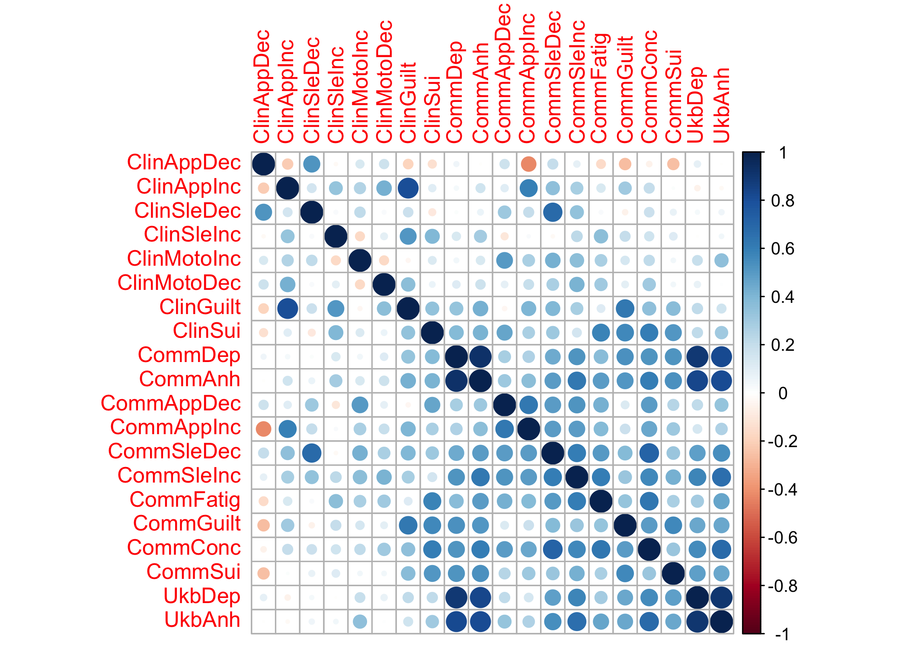

GenomicSEM of MDD symptoms
================
Mark Adams, Bradley Jermy, Jackson Thorp, Andrew Grotzinger, Michel
Nivard

# Setup

## R packages

R version

``` r
R.version
```

    ##                _                           
    ## platform       aarch64-apple-darwin20      
    ## arch           aarch64                     
    ## os             darwin20                    
    ## system         aarch64, darwin20           
    ## status                                     
    ## major          4                           
    ## minor          1.0                         
    ## year           2021                        
    ## month          05                          
    ## day            18                          
    ## svn rev        80317                       
    ## language       R                           
    ## version.string R version 4.1.0 (2021-05-18)
    ## nickname       Camp Pontanezen

Package installation

``` r
required_packages <- c('devtools', 'readr', 'tidyr', 'dplyr', 'ggplot2', 'stringr', 'corrplot')
for(pack in required_packages) if(!require(pack, character.only=TRUE)) install.packages(pack)

if(!require(GenomicSEM)) remotes::install_github("MichelNivard/GenomicSEM")
```

GenomicSEM version

``` r
require(readr)
require(tidyr)
require(stringr)
require(dplyr)
require(ggplot2)
require(corrplot)
require(GenomicSEM)

packageVersion("GenomicSEM")
```

    ## [1] '0.0.3'

# Symptom labels

MDD DSM symptoms are numbered 1-9:

``` r
# plot labels

dsm_mdd_symptoms_labels <-
read_delim("
MDD1;Mood;Mood;Dep
MDD2;Interest;Interest;Anh
MDD3;Weight⇅;Weight⇆;App
MDD3a;Weight⇊;Weight⇇;AppDec
MDD3b;Weight⇈;Weight⇉;AppInc
MDD4;Sleep⇅;Sleep⇆;Sle
MDD4a;Sleep⇊;Sleep⇇;SleDec
MDD4b;Sleep⇈;Sleep⇉;SleInc
MDD5;Motor⇅;Motor⇆;Moto
MDD5a;Motor⇈;Motor⇉;MotoInc
MDD5b;Motor⇊;Motor⇇;MotoDec
MDD6;Fatigue;Fatigue;Fatig
MDD7;Guilt;Guilt;Guilt
MDD8;Concentrate;Concentrate;Conc
MDD9;Suicidality;Suicidality;Sui
", col_names=c('ref', 'h', 'v', 'abbv'), delim=';')
```

    ## Rows: 15 Columns: 4
    ## ── Column specification ────────────────────────────────────────────────────────────────────────
    ## Delimiter: ";"
    ## chr (4): ref, h, v, abbv
    ## 
    ## ℹ Use `spec()` to retrieve the full column specification for this data.
    ## ℹ Specify the column types or set `show_col_types = FALSE` to quiet this message.

``` r
dsm_mdd_symptoms_reference <-
read_delim("
MDD1;Depressed mood most of the day, nearly every day
MDD2;Markedly diminished interest or pleasure in all, or almost all, activities most of the day, nearly every day
MDD3;Significant change in weight or appetite
MDD3a;Significant weight loss or decrease in appetite
MDD3b;Significant weight gain or increase in appetite
MDD4;Sleeping too much or not sleeping enough
MDD4a;Insomnia nearly every day
MDD4b;Hypersomnia nearly every day
MDD5;Changes in speed/amount of moving or speaking
MDD5a;Psychomotor agitation nearly every day
MDD5b;Psychomotor slowing nearly every day
MDD6;Fatigue or loss of energy nearly every day
MDD7;Feelings of worthlessness or excessive or inappropriate guilt
MDD8;Diminished ability to think or concentrate, or indecisiveness
MDD9;Recurrent thoughts of death or suicide or a suicide attempt or a specific plan for attempting suicide
", col_names=c('Reference', 'Description'), delim=';')
```

    ## Rows: 15 Columns: 2
    ## ── Column specification ────────────────────────────────────────────────────────────────────────
    ## Delimiter: ";"
    ## chr (2): Reference, Description
    ## 
    ## ℹ Use `spec()` to retrieve the full column specification for this data.
    ## ℹ Specify the column types or set `show_col_types = FALSE` to quiet this message.

``` r
dsm_mdd_symptoms_reference %>%
left_join(dsm_mdd_symptoms_labels, by=c('Reference'='ref')) %>%
select(Reference, Abbreviation=abbv, Label=h, Description)
```

    ## # A tibble: 15 × 4
    ##    Reference Abbreviation Label       Description                               
    ##    <chr>     <chr>        <chr>       <chr>                                     
    ##  1 MDD1      Dep          Mood        Depressed mood most of the day, nearly ev…
    ##  2 MDD2      Anh          Interest    Markedly diminished interest or pleasure …
    ##  3 MDD3      App          Weight⇅     Significant change in weight or appetite  
    ##  4 MDD3a     AppDec       Weight⇊     Significant weight loss or decrease in ap…
    ##  5 MDD3b     AppInc       Weight⇈     Significant weight gain or increase in ap…
    ##  6 MDD4      Sle          Sleep⇅      Sleeping too much or not sleeping enough  
    ##  7 MDD4a     SleDec       Sleep⇊      Insomnia nearly every day                 
    ##  8 MDD4b     SleInc       Sleep⇈      Hypersomnia nearly every day              
    ##  9 MDD5      Moto         Motor⇅      Changes in speed/amount of moving or spea…
    ## 10 MDD5a     MotoInc      Motor⇈      Psychomotor agitation nearly every day    
    ## 11 MDD5b     MotoDec      Motor⇊      Psychomotor slowing nearly every day      
    ## 12 MDD6      Fatig        Fatigue     Fatigue or loss of energy nearly every day
    ## 13 MDD7      Guilt        Guilt       Feelings of worthlessness or excessive or…
    ## 14 MDD8      Conc         Concentrate Diminished ability to think or concentrat…
    ## 15 MDD9      Sui          Suicidality Recurrent thoughts of death or suicide or…

# GenomicSEM covariance structure

``` r
covstruct_prefix <- 'agds_pgc.alspac_ukb.covstruct'
covstruct_r <- file.path('ldsc', paste(covstruct_prefix, 'deparse.R', sep='.'))
covstruct_rds <- file.path('ldsc', paste(covstruct_prefix, 'rds', sep='.'))

symptoms_covstruct <- dget(covstruct_r)

sumstats_prevs <- read_tsv(file.path('ldsc', paste(covstruct_prefix, 'prevs', 'txt', sep='.')))
```

    ## Rows: 24 Columns: 9
    ## ── Column specification ────────────────────────────────────────────────────────────────────────
    ## Delimiter: "\t"
    ## chr (5): cohorts, symptom, sumstats, filename, trait_name
    ## dbl (4): Nca, Nco, samp_prev, pop_prev
    ## 
    ## ℹ Use `spec()` to retrieve the full column specification for this data.
    ## ℹ Specify the column types or set `show_col_types = FALSE` to quiet this message.

Rename samples: AGDS/PGC is the **Clin**ical sample (`Clin`) and
ALSPAC/UKB is the **Pop**ulation sample (`Pop`); and rename symptoms
numbers (`MDD1`, `MDD2`) to abbreviations (`Dep`, `Anh`)

``` r
cohorts_sample_symptoms <-
sumstats_prevs %>%
left_join(dsm_mdd_symptoms_labels, by=c('symptom'='ref')) %>%
select(cohorts, symptom, trait_name, abbv) %>%
mutate(Sample=case_when(cohorts %in% 'AGDS_PGC' ~ 'Clin',
                        cohorts %in% 'ALSPAC_UKB' ~ 'Pop',
                        TRUE ~ NA_character_)) %>%
mutate(sample_symptom=paste0(Sample, abbv))

sample_symptoms <- cohorts_sample_symptoms$sample_symptom
names(sample_symptoms) <- cohorts_sample_symptoms$trait_name

# rename traits in covstruct
dimnames(symptoms_covstruct$S)[[2]] <-
as.vector(sample_symptoms[dimnames(symptoms_covstruct$S)[[2]]])
```

# Structural models

Symptoms with positive variances

``` r
symptoms_S_var <- diag(symptoms_covstruct$S)
names(symptoms_S_var) <- dimnames(symptoms_covstruct$S)[[2]]

symptoms_S_var[which(symptoms_S_var > 0)]
```

    ##  ClinAppDec  ClinAppInc  ClinSleDec  ClinSleInc ClinMotoInc     ClinSui 
    ## 0.107310576 0.042492134 0.025429781 0.003850035 0.036308706 0.103892914 
    ##      PopDep      PopAnh   PopAppDec   PopAppInc   PopSleDec   PopSleInc 
    ## 0.082198484 0.087343514 0.033528770 0.054402455 0.032178877 0.024556756 
    ##  PopMotoInc  PopMotoDec    PopFatig    PopGuilt     PopConc      PopSui 
    ## 0.052444420 0.019177797 0.057539570 0.060012455 0.056887041 0.033166683

## Common factor

Common factor across symptoms from both cohorts

``` r
commonfactor.model <- "
A1 =~ NA*ClinAppDec + ClinAppInc + ClinSleDec + ClinSleInc + ClinMotoInc + ClinSui + PopDep + PopAnh + PopAppDec + PopAppInc + PopSleDec + PopSleInc + PopFatig + PopGuilt + PopConc + PopSui
A1 ~~ 1*A1
"

commonfactor.fit <- usermodel(symptoms_covstruct, estimation='DWLS', model=commonfactor.model)
```

    ## [1] "Running primary model"
    ## [1] "Calculating CFI"
    ## [1] "Calculating Standardized Results"
    ## [1] "Calculating SRMR"
    ## elapsed 
    ##   0.526 
    ## [1] "The S matrix was smoothed prior to model estimation due to a non-positive definite matrix. The largest absolute difference in a cell between the smoothed and non-smoothed matrix was  0.0313666288930831 As a result of the smoothing, the largest Z-statistic change for the genetic covariances was  1.49543224219421 . We recommend setting the smooth_check argument to true if you are going to run a multivariate GWAS."

    ## Warning in usermodel(symptoms_covstruct, estimation = "DWLS", model =
    ## commonfactor.model): A difference greater than .025 was observed pre- and post-
    ## smoothing in the genetic covariance matrix. This reflects a large difference
    ## and results should be interpreted with caution!! This can often result from
    ## including low powered traits, and you might consider removing those traits from
    ## the model. If you are going to run a multivariate GWAS we strongly recommend
    ## setting the smooth_check argument to true to check smoothing for each SNP.

    ## Warning in usermodel(symptoms_covstruct, estimation = "DWLS", model =
    ## commonfactor.model): A difference greater than .025 was observed pre- and post-
    ## smoothing for Z-statistics in the genetic covariance matrix. This reflects a
    ## large difference and results should be interpreted with caution!! This can often
    ## result from including low powered traits, and you might consider removing those
    ## traits from the model. If you are going to run a multivariate GWAS we strongly
    ## recommend setting the smooth_check argument to true to check smoothing for each
    ## SNP.

``` r
commonfactor.fit$modelfit
```

    ##       chisq  df     p_chisq      AIC       CFI      SRMR
    ## df 306.5241 104 7.57386e-22 370.5241 0.9546511 0.1814247

``` r
commonfactor.fit$results[c(1,2,3,6,7)]
```

    ##            lhs op         rhs STD_Genotype    STD_Genotype_SE
    ## 1           A1 =~  ClinAppDec   0.08104669 0.0886922566565203
    ## 2           A1 =~  ClinAppInc  -0.19252246  0.110239143496706
    ## 4           A1 =~  ClinSleDec  -0.05910390  0.124424047835129
    ## 5           A1 =~  ClinSleInc  -0.14288769   0.16545139056711
    ## 3           A1 =~ ClinMotoInc  -0.18967182  0.115683975951175
    ## 6           A1 =~     ClinSui  -0.58557524 0.0972352454842631
    ## 11          A1 =~      PopDep  -0.83414954 0.0503724822462711
    ## 7           A1 =~      PopAnh  -0.94786092 0.0445806615019224
    ## 8           A1 =~   PopAppDec  -0.17469343 0.0816360755606421
    ## 9           A1 =~   PopAppInc  -0.39226945 0.0737935205466078
    ## 14          A1 =~   PopSleDec  -0.57641901 0.0938473771327907
    ## 15          A1 =~   PopSleInc  -0.45708426 0.0981954902075895
    ## 12          A1 =~    PopFatig  -0.66597063 0.0912349181246352
    ## 13          A1 =~    PopGuilt  -0.64621353 0.0776426234947704
    ## 10          A1 =~     PopConc  -0.70369473 0.0923057386327641
    ## 16          A1 =~      PopSui  -0.58272279 0.0955634246666639
    ## 18  ClinAppDec ~~  ClinAppDec   0.99343312  0.225297846481438
    ## 19  ClinAppInc ~~  ClinAppInc   0.96293250  0.328829327767194
    ## 21  ClinSleDec ~~  ClinSleDec   0.99650371  0.493519572907337
    ## 22  ClinSleInc ~~  ClinSleInc   0.97956052  0.845479581366364
    ## 20 ClinMotoInc ~~ ClinMotoInc   0.96402295  0.432698455991006
    ## 23     ClinSui ~~     ClinSui   0.65710095  0.306087517169914
    ## 28      PopDep ~~      PopDep   0.30419487 0.0746603554721312
    ## 24      PopAnh ~~      PopAnh   0.10155897 0.0623210508557823
    ## 25   PopAppDec ~~   PopAppDec   0.96948350  0.222924875823223
    ## 26   PopAppInc ~~   PopAppInc   0.84612550  0.146051589306626
    ## 31   PopSleDec ~~   PopSleDec   0.66774025  0.287954827140161
    ## 32   PopSleInc ~~   PopSleInc   0.79106875   0.25271446517319
    ## 29    PopFatig ~~    PopFatig   0.55648340  0.308678014930077
    ## 30    PopGuilt ~~    PopGuilt   0.58240651  0.159257042072324
    ## 27     PopConc ~~     PopConc   0.50481511   0.24574581850075
    ## 33      PopSui ~~      PopSui   0.66043310  0.237317281355982
    ## 17          A1 ~~          A1   1.00000000

Correlation among directional symptoms

``` r
commonfactor_dir.model <- "
A1 =~ NA*ClinAppDec + ClinAppInc + ClinSleDec + ClinSleInc + ClinMotoInc + ClinSui + PopDep + PopAnh + PopAppDec + PopAppInc + PopSleDec + PopSleInc +  PopFatig + PopGuilt + PopConc + PopSui
A1 ~~ 1*A1
ClinAppDec ~~ ClinAppInc
ClinSleDec ~~ ClinSleInc
PopDep ~~ PopAnh
PopAppDec ~~ PopAppInc
PopSleDec ~~ PopSleInc
"

commonfactor_dir.fit <- usermodel(symptoms_covstruct, estimation='DWLS', model=commonfactor_dir.model)
```

    ## [1] "Running primary model"
    ## [1] "Calculating CFI"
    ## [1] "Calculating Standardized Results"
    ## [1] "Calculating SRMR"
    ## elapsed 
    ##   0.384 
    ## [1] "The S matrix was smoothed prior to model estimation due to a non-positive definite matrix. The largest absolute difference in a cell between the smoothed and non-smoothed matrix was  0.0313666288930831 As a result of the smoothing, the largest Z-statistic change for the genetic covariances was  1.49543224219421 . We recommend setting the smooth_check argument to true if you are going to run a multivariate GWAS."

    ## Warning in usermodel(symptoms_covstruct, estimation = "DWLS", model =
    ## commonfactor_dir.model): A difference greater than .025 was observed pre-
    ## and post-smoothing in the genetic covariance matrix. This reflects a large
    ## difference and results should be interpreted with caution!! This can often
    ## result from including low powered traits, and you might consider removing those
    ## traits from the model. If you are going to run a multivariate GWAS we strongly
    ## recommend setting the smooth_check argument to true to check smoothing for each
    ## SNP.

    ## Warning in usermodel(symptoms_covstruct, estimation = "DWLS", model =
    ## commonfactor_dir.model): A difference greater than .025 was observed pre- and
    ## post-smoothing for Z-statistics in the genetic covariance matrix. This reflects
    ## a large difference and results should be interpreted with caution!! This can
    ## often result from including low powered traits, and you might consider removing
    ## those traits from the model. If you are going to run a multivariate GWAS we
    ## strongly recommend setting the smooth_check argument to true to check smoothing
    ## for each SNP.

``` r
commonfactor_dir.fit$modelfit
```

    ##      chisq df      p_chisq     AIC       CFI      SRMR
    ## df 216.872 99 8.449537e-11 290.872 0.9736063 0.1659054

``` r
commonfactor_dir.fit$results[c(1,2,3,6,7,9)]
```

    ##            lhs op         rhs STD_Genotype    STD_Genotype_SE      p_value
    ## 1           A1 =~  ClinAppDec   0.09265454 0.0948395328152752 3.285888e-01
    ## 2           A1 =~  ClinAppInc  -0.22677683   0.11769076802978 5.399351e-02
    ## 4           A1 =~  ClinSleDec  -0.06057619  0.130203753541249 6.417609e-01
    ## 5           A1 =~  ClinSleInc  -0.16774807  0.176913842508722 3.430341e-01
    ## 3           A1 =~ ClinMotoInc  -0.20997830  0.124342135808522 9.127476e-02
    ## 6           A1 =~     ClinSui  -0.64306000  0.105472338773805 1.081101e-09
    ## 11          A1 =~      PopDep  -0.67325982 0.0687442541984827 1.198437e-22
    ## 7           A1 =~      PopAnh  -0.79701839  0.063201114283628 1.840485e-36
    ## 8           A1 =~   PopAppDec  -0.21022580 0.0880189808286661 1.692108e-02
    ## 9           A1 =~   PopAppInc  -0.43634476 0.0795718865718477 4.166142e-08
    ## 14          A1 =~   PopSleDec  -0.65125732  0.104208831187012 4.116695e-10
    ## 15          A1 =~   PopSleInc  -0.50348948   0.10545561049874 1.802301e-06
    ## 12          A1 =~    PopFatig  -0.72860552 0.0970127705282889 5.894356e-14
    ## 13          A1 =~    PopGuilt  -0.70134977 0.0836225184568579 4.982971e-17
    ## 10          A1 =~     PopConc  -0.77030805 0.0991520230487115 7.913442e-15
    ## 16          A1 =~      PopSui  -0.61151914  0.101883885413575 1.947601e-09
    ## 19  ClinAppDec ~~  ClinAppInc  -0.38012841  0.212408295464701 7.351603e-02
    ## 23  ClinSleDec ~~  ClinSleInc   0.47376696  0.475346748967056 3.189214e-01
    ## 31      PopDep ~~      PopAnh   0.37004083 0.0903453762453984 4.206240e-05
    ## 28   PopAppDec ~~   PopAppInc  -0.23925516  0.127118166487942 5.981562e-02
    ## 36   PopSleDec ~~   PopSleInc  -0.30564259  0.197904872332364 1.224940e-01
    ## 18  ClinAppDec ~~  ClinAppDec   0.99141662  0.225845329969864 1.134577e-05
    ## 20  ClinAppInc ~~  ClinAppInc   0.94857252  0.330168144707311 4.065983e-03
    ## 22  ClinSleDec ~~  ClinSleDec   0.99633076   0.49341247919274 4.345968e-02
    ## 24  ClinSleInc ~~  ClinSleInc   0.97185771  0.845483317874478 2.503607e-01
    ## 21 ClinMotoInc ~~ ClinMotoInc   0.95590927  0.432530905655529 2.710254e-02
    ## 25     ClinSui ~~     ClinSui   0.58647352  0.314618070631333 6.230947e-02
    ## 32      PopDep ~~      PopDep   0.54672108  0.107892453543334 4.035401e-07
    ## 26      PopAnh ~~      PopAnh   0.36476172 0.0959196267145961 1.430786e-04
    ## 27   PopAppDec ~~   PopAppDec   0.95580294  0.221809603534035 1.639023e-05
    ## 29   PopAppInc ~~   PopAppInc   0.80960186   0.14762762853983 4.156108e-08
    ## 35   PopSleDec ~~   PopSleDec   0.57586408  0.291035207960761 4.785253e-02
    ## 37   PopSleInc ~~   PopSleInc   0.74649969  0.251514376520659 2.997269e-03
    ## 33    PopFatig ~~    PopFatig   0.46913381  0.313326320671577 1.343231e-01
    ## 34    PopGuilt ~~    PopGuilt   0.50811009  0.164432246708516 2.001070e-03
    ## 30     PopConc ~~     PopConc   0.40662644  0.247681698578782 1.006464e-01
    ## 38      PopSui ~~      PopSui   0.62604460  0.240365292942319 9.199385e-03
    ## 17          A1 ~~          A1   1.00000000                              NA

Ascertainment-specific factors

``` r
clin_pop.model <- "
A1 =~ NA*ClinAppDec + ClinAppInc + ClinSleDec + ClinSleInc + ClinMotoInc + ClinSui 
A2 =~ NA*PopDep + PopAnh + PopAppDec + PopAppInc + PopSleDec + PopSleInc +  PopFatig + PopGuilt + PopConc + PopSui
A1 ~~ 1*A1
A2 ~~ 1*A2
a12 > -1
a12 < 1
A1 ~~ a12*A2
ClinAppDec ~~ ClinAppInc
ClinSleDec ~~ ClinSleInc
PopDep ~~ PopAnh
PopAppDec ~~ PopAppInc
PopSleDec ~~ PopSleInc
"

clin_pop.fit <- usermodel(symptoms_covstruct, estimation='DWLS', model=clin_pop.model)
```

    ## [1] "Running primary model"
    ## [1] "Error: The primary model produced correlations among your latent variables that are either greater than 1 or less than -1, or the latent variables have negative variances. \n              Consequently, model fit estimates could not be computed and results should likely not be interpreted. Results are provided below \n              to enable troubleshooting. A model constraint that constrains the latent correlations to be above -1, less than 1, or to have positive variances is suggested."
    ##            lhs op         rhs Unstandardized_Estimate          SE
    ## 1           A1 =~  ClinAppDec              0.03121902 0.034606249
    ## 2           A1 =~  ClinAppInc             -0.05949861 0.042159692
    ## 3           A1 =~  ClinSleDec             -0.01443643 0.031448314
    ## 4           A1 =~  ClinSleInc             -0.02560027 0.029425417
    ## 5           A1 =~ ClinMotoInc             -0.04115132 0.030102028
    ## 6           A1 =~     ClinSui             -0.21414131 0.115454706
    ## 7           A2 =~      PopDep              0.19504058 0.020012709
    ## 8           A2 =~      PopAnh              0.23696294 0.018875800
    ## 9           A2 =~   PopAppDec              0.04030722 0.016876080
    ## 10          A2 =~   PopAppInc              0.10647489 0.019416394
    ## 11          A2 =~   PopSleDec              0.12566959 0.020107594
    ## 12          A2 =~   PopSleInc              0.08547670 0.017903221
    ## 13          A2 =~    PopFatig              0.18364888 0.024453087
    ## 14          A2 =~    PopGuilt              0.17238408 0.020551493
    ## 15          A2 =~     PopConc              0.19381784 0.024946164
    ## 16          A2 =~      PopSui              0.11610901 0.019343881
    ## 19          A1 ~~          A2             -1.00000022 0.555106652
    ## 20  ClinAppDec ~~  ClinAppInc             -0.03360411 0.018816184
    ## 21  ClinSleDec ~~  ClinSleInc              0.01723112 0.017261898
    ## 22      PopDep ~~      PopAnh              0.03187169 0.007797374
    ## 23   PopAppDec ~~   PopAppInc             -0.01119371 0.005947319
    ## 24   PopSleDec ~~   PopSleInc             -0.01001263 0.006483151
    ## 25  ClinAppDec ~~  ClinAppDec              0.11255455 0.025649326
    ## 26  ClinAppInc ~~  ClinAppInc              0.06529586 0.022841906
    ## 27  ClinSleDec ~~  ClinSleDec              0.05658800 0.028034334
    ## 28  ClinSleInc ~~  ClinSleInc              0.02263501 0.019696214
    ## 29 ClinMotoInc ~~ ClinMotoInc              0.03671441 0.016602446
    ## 30     ClinSui ~~     ClinSui              0.06503423 0.055841267
    ## 31      PopDep ~~      PopDep              0.04588293 0.009068574
    ## 32      PopAnh ~~      PopAnh              0.03224289 0.008486011
    ## 33   PopAppDec ~~   PopAppDec              0.03513673 0.008154027
    ## 34   PopAppInc ~~   PopAppInc              0.04820655 0.008790334
    ## 35   PopSleDec ~~   PopSleDec              0.02144251 0.010836463
    ## 36   PopSleInc ~~   PopSleInc              0.02151518 0.007249024
    ## 37    PopFatig ~~    PopFatig              0.02980495 0.019906352
    ## 38    PopGuilt ~~    PopGuilt              0.03069588 0.009931404
    ## 39     PopConc ~~     PopConc              0.02574266 0.015680155
    ## 40      PopSui ~~      PopSui              0.02256924 0.008665397

``` r
clin_pop.fit$modelfit
```

    ## NULL

``` r
clin_pop.fit$results[c(1,2,3,6,7,9)]
```

    ## NULL

``` r
clin_pop_bif.model <- "
A1 =~ NA*ClinAppDec + ClinAppInc + ClinSleDec + ClinSleInc + ClinMotoInc + ClinSui 
A2 =~ NA*PopDep + PopAnh + PopAppDec + PopAppInc + PopSleDec + PopSleInc +  PopFatig + PopGuilt + PopConc + PopSui
A =~ NA*ClinAppDec + ClinAppInc + ClinSleDec + ClinSleInc + ClinMotoInc + ClinSui + PopDep + PopAnh + PopAppDec + PopAppInc + PopSleDec + PopSleInc +  PopFatig + PopGuilt + PopConc + PopSui
A1 ~~ 1*A1
A2 ~~ 1*A2
A ~~ 1*A
A ~~ 0*A1 + 0*A2
A1 ~~ 0*A2
"

clin_pop_bif.fit <- usermodel(symptoms_covstruct, estimation='DWLS', model=clin_pop_bif.model)
```

    ## [1] "Running primary model"

    ## Warning in usermodel(symptoms_covstruct, estimation = "DWLS", model = clin_pop_bif.model): Error: The primary model did not converge! Additional warnings or errors are likely being printed by lavaan. 
    ##             The model output is also printed below (without standard errors) in case this is helpful for troubleshooting. Please note
    ##             that these results should not be interpreted.

    ##            lhs op         rhs Unstandardized_Estimate
    ## 1           A1 =~  ClinAppDec           -3.475747e-03
    ## 2           A1 =~  ClinAppInc           -2.304798e-03
    ## 3           A1 =~  ClinSleDec           -1.199765e+01
    ## 4           A1 =~  ClinSleInc           -1.405032e-03
    ## 5           A1 =~ ClinMotoInc           -6.134539e-04
    ## 6           A1 =~     ClinSui            1.625904e-03
    ## 7           A2 =~      PopDep            2.521484e-01
    ## 8           A2 =~      PopAnh            2.412525e-01
    ## 9           A2 =~   PopAppDec            2.524663e-02
    ## 10          A2 =~   PopAppInc            2.420390e-02
    ## 11          A2 =~   PopSleDec            4.382202e-02
    ## 12          A2 =~   PopSleInc            5.697083e-02
    ## 13          A2 =~    PopFatig            6.318495e-02
    ## 14          A2 =~    PopGuilt            6.750255e-02
    ## 15          A2 =~     PopConc            7.159628e-02
    ## 16          A2 =~      PopSui            8.203905e-02
    ## 17           A =~  ClinAppDec            5.649867e-02
    ## 18           A =~  ClinAppInc           -9.159869e-02
    ## 19           A =~  ClinSleDec           -2.197151e-02
    ## 20           A =~  ClinSleInc           -3.412301e-02
    ## 21           A =~ ClinMotoInc           -5.198977e-02
    ## 22           A =~     ClinSui           -2.722052e-01
    ## 23           A =~      PopDep           -1.096021e-01
    ## 24           A =~      PopAnh           -1.599337e-01
    ## 25           A =~   PopAppDec           -2.006016e-02
    ## 26           A =~   PopAppInc           -1.151747e-01
    ## 27           A =~   PopSleDec           -1.134207e-01
    ## 28           A =~   PopSleInc           -5.065109e-02
    ## 29           A =~    PopFatig           -1.749080e-01
    ## 30           A =~    PopGuilt           -1.567092e-01
    ## 31           A =~     PopConc           -1.795750e-01
    ## 32           A =~      PopSui           -7.195756e-02
    ## 39  ClinAppDec ~~  ClinAppDec            1.103250e-01
    ## 40  ClinAppInc ~~  ClinAppInc            6.044032e-02
    ## 41  ClinSleDec ~~  ClinSleDec           -1.438874e+02
    ## 42  ClinSleInc ~~  ClinSleInc            2.212403e-02
    ## 43 ClinMotoInc ~~ ClinMotoInc            3.570454e-02
    ## 44     ClinSui ~~     ClinSui            3.679278e-02
    ## 45      PopDep ~~      PopDep            8.332309e-03
    ## 46      PopAnh ~~      PopAnh            4.612798e-03
    ## 47   PopAppDec ~~   PopAppDec            3.572160e-02
    ## 48   PopAppInc ~~   PopAppInc            4.569243e-02
    ## 49   PopSleDec ~~   PopSleDec            2.245074e-02
    ## 50   PopSleInc ~~   PopSleInc            2.301024e-02
    ## 51    PopFatig ~~    PopFatig            2.894671e-02
    ## 52    PopGuilt ~~    PopGuilt            3.129780e-02
    ## 53     PopConc ~~     PopConc            2.593481e-02
    ## 54      PopSui ~~      PopSui            2.414224e-02

``` r
clin_pop_bif.fit$modelfit
```

    ## NULL

``` r
clin_pop_bif.fit$results[c(1,2,3,6,7,9)]
```

    ## NULL

## ADGS-PGC (Clinical)

### Common factor

Common factor model. Allow residual negative correlation between
directional symptoms

``` r
clin_commonfactor.model <- "
A1 =~ NA*ClinAppDec + ClinAppInc + ClinSleDec + ClinSleInc + ClinMotoInc + ClinSui
A1 ~~ 1*A1
"
clin_commonfactor.fit <- usermodel(symptoms_covstruct, estimation='DWLS', model=clin_commonfactor.model)
```

    ## [1] "Running primary model"

    ## Warning in usermodel(symptoms_covstruct, estimation = "DWLS", model = clin_commonfactor.model): Error: The primary model did not converge! Additional warnings or errors are likely being printed by lavaan. 
    ##             The model output is also printed below (without standard errors) in case this is helpful for troubleshooting. Please note
    ##             that these results should not be interpreted.

    ##            lhs op         rhs Unstandardized_Estimate
    ## 1           A1 =~  ClinAppDec            1.809671e+01
    ## 2           A1 =~  ClinAppInc           -1.865281e-03
    ## 3           A1 =~  ClinSleDec            2.061336e-03
    ## 4           A1 =~  ClinSleInc            9.616710e-04
    ## 5           A1 =~ ClinMotoInc            7.300566e-04
    ## 6           A1 =~     ClinSui           -1.331448e-04
    ## 8   ClinAppDec ~~  ClinAppDec           -3.273762e+02
    ## 9   ClinAppInc ~~  ClinAppInc            6.245044e-02
    ## 10  ClinSleDec ~~  ClinSleDec            5.662163e-02
    ## 11  ClinSleInc ~~  ClinSleInc            1.211923e-02
    ## 12 ClinMotoInc ~~ ClinMotoInc            3.680369e-02
    ## 13     ClinSui ~~     ClinSui            1.069365e-01

``` r
clin_commonfactor.fit$modelfit
```

    ## NULL

``` r
clin_commonfactor.fit$results[c(1,2,3,6,7, 9)]
```

    ## NULL

Add residual covariance between appetite symptoms.

``` r
clin_commonfactor_app.model <- "
A1 =~ NA*ClinAppDec + ClinAppInc + ClinSleDec + ClinSleInc + ClinMotoInc + ClinSui
A1 ~~ 1*A1
c3a3b > -1
ClinAppDec ~~ c3a3b*ClinAppInc
"
clin_commonfactor_app.fit <- usermodel(symptoms_covstruct, estimation='DWLS', model=clin_commonfactor_app.model)
```

    ## [1] "Running primary model"
    ## [1] "Calculating CFI"
    ## [1] "Calculating Standardized Results"
    ## [1] "Calculating SRMR"
    ## elapsed 
    ##   0.811 
    ## [1] "The S matrix was smoothed prior to model estimation due to a non-positive definite matrix. The largest absolute difference in a cell between the smoothed and non-smoothed matrix was  0.0311960347054174 As a result of the smoothing, the largest Z-statistic change for the genetic covariances was  1.41818584418939 . We recommend setting the smooth_check argument to true if you are going to run a multivariate GWAS."

    ## Warning in usermodel(symptoms_covstruct, estimation = "DWLS", model =
    ## clin_commonfactor_app.model): A difference greater than .025 was observed pre-
    ## and post-smoothing in the genetic covariance matrix. This reflects a large
    ## difference and results should be interpreted with caution!! This can often
    ## result from including low powered traits, and you might consider removing those
    ## traits from the model. If you are going to run a multivariate GWAS we strongly
    ## recommend setting the smooth_check argument to true to check smoothing for each
    ## SNP.

    ## Warning in usermodel(symptoms_covstruct, estimation = "DWLS", model =
    ## clin_commonfactor_app.model): A difference greater than .025 was observed pre-
    ## and post-smoothing for Z-statistics in the genetic covariance matrix. This
    ## reflects a large difference and results should be interpreted with caution!!
    ## This can often result from including low powered traits, and you might consider
    ## removing those traits from the model. If you are going to run a multivariate
    ## GWAS we strongly recommend setting the smooth_check argument to true to check
    ## smoothing for each SNP.

``` r
clin_commonfactor_app.fit$modelfit
```

    ##       chisq df   p_chisq      AIC CFI      SRMR
    ## df 2.325305  8 0.9693801 28.32531   1 0.1438518

``` r
clin_commonfactor_app.fit$results[c(1,2,3,6,7, 9)]
```

    ##            lhs op         rhs STD_Genotype   STD_Genotype_SE     p_value
    ## 1           A1 =~  ClinAppDec    0.6634310 0.428690400644662 0.121725888
    ## 2           A1 =~  ClinAppInc    0.7278282 0.484179869694427 0.132784610
    ## 4           A1 =~  ClinSleDec    0.7267902 0.431683423039735 0.092257501
    ## 5           A1 =~  ClinSleInc    0.6208064 0.487198098422708 0.202581095
    ## 3           A1 =~ ClinMotoInc    0.2864365  0.23363640265699 0.220202308
    ## 6           A1 =~     ClinSui    0.0334615  0.17827678796196 0.851114382
    ## 9   ClinAppDec ~~  ClinAppInc   -0.8815747 0.559955621489321 0.115406962
    ## 8   ClinAppDec ~~  ClinAppDec    0.5598592 0.567696048004262 0.324052438
    ## 10  ClinAppInc ~~  ClinAppInc    0.4702662 0.752007458365772 0.531756151
    ## 12  ClinSleDec ~~  ClinSleDec    0.4717756 0.795763911922933 0.553266114
    ## 13  ClinSleInc ~~  ClinSleInc    0.6145997  1.71866384681241 0.720638660
    ## 11 ClinMotoInc ~~ ClinMotoInc    0.9179545 0.460047958933582 0.046005368
    ## 14     ClinSui ~~     ClinSui    0.9988805 0.298668758746582 0.000824483
    ## 7           A1 ~~          A1    1.0000000                            NA

Add residual covariance between sleep symptoms.

``` r
clin_commonfactor_sle.model <- "
A1 =~ NA*ClinAppDec + ClinAppInc + ClinSleDec + ClinSleInc + ClinMotoInc + ClinSui
A1 ~~ 1*A1
ClinSleDec ~~ c3a3b*ClinSleInc
"
clin_commonfactor_sle.fit <- usermodel(symptoms_covstruct, estimation='DWLS', model=clin_commonfactor_sle.model)
```

    ## [1] "Running primary model"

    ## Warning in usermodel(symptoms_covstruct, estimation = "DWLS", model = clin_commonfactor_sle.model): Error: The primary model did not converge! Additional warnings or errors are likely being printed by lavaan. 
    ##             The model output is also printed below (without standard errors) in case this is helpful for troubleshooting. Please note
    ##             that these results should not be interpreted.

    ##            lhs op         rhs Unstandardized_Estimate
    ## 1           A1 =~  ClinAppDec            1.786143e+01
    ## 2           A1 =~  ClinAppInc           -1.889728e-03
    ## 3           A1 =~  ClinSleDec            2.088418e-03
    ## 4           A1 =~  ClinSleInc            9.742174e-04
    ## 5           A1 =~ ClinMotoInc            7.396929e-04
    ## 6           A1 =~     ClinSui           -1.348924e-04
    ## 8   ClinSleDec ~~  ClinSleInc            1.884325e-02
    ## 9   ClinAppDec ~~  ClinAppDec           -3.189160e+02
    ## 10  ClinAppInc ~~  ClinAppInc            6.245039e-02
    ## 11  ClinSleDec ~~  ClinSleDec            5.662153e-02
    ## 12  ClinSleInc ~~  ClinSleInc            1.211845e-02
    ## 13 ClinMotoInc ~~ ClinMotoInc            3.680489e-02
    ## 14     ClinSui ~~     ClinSui            1.069373e-01

``` r
clin_commonfactor_sle.fit$modelfit
```

    ## NULL

``` r
clin_commonfactor_sle.fit$results[c(1,2,3,6,7, 9)]
```

    ## NULL

### Somatic factor

``` r
clin_soma.model <- "
A1 =~ NA*ClinAppDec + ClinAppInc + ClinSleDec + ClinSleInc + ClinMotoInc
A2 =~ ClinSui
A1 ~~ 1*A1
ClinAppDec ~~ ClinAppInc
ClinSui ~~ 0*ClinSui
"
clin_soma.fit <- usermodel(symptoms_covstruct, estimation='DWLS', model=clin_soma.model)
```

    ## [1] "Running primary model"
    ## [1] "Calculating CFI"
    ## [1] "Calculating Standardized Results"
    ## [1] "Calculating SRMR"
    ## elapsed 
    ##   0.153 
    ## [1] "The S matrix was smoothed prior to model estimation due to a non-positive definite matrix. The largest absolute difference in a cell between the smoothed and non-smoothed matrix was  0.0311960347054174 As a result of the smoothing, the largest Z-statistic change for the genetic covariances was  1.41818584418939 . We recommend setting the smooth_check argument to true if you are going to run a multivariate GWAS."

    ## Warning in usermodel(symptoms_covstruct, estimation = "DWLS", model =
    ## clin_soma.model): A difference greater than .025 was observed pre- and post-
    ## smoothing in the genetic covariance matrix. This reflects a large difference
    ## and results should be interpreted with caution!! This can often result from
    ## including low powered traits, and you might consider removing those traits from
    ## the model. If you are going to run a multivariate GWAS we strongly recommend
    ## setting the smooth_check argument to true to check smoothing for each SNP.

    ## Warning in usermodel(symptoms_covstruct, estimation = "DWLS", model =
    ## clin_soma.model): A difference greater than .025 was observed pre- and post-
    ## smoothing for Z-statistics in the genetic covariance matrix. This reflects a
    ## large difference and results should be interpreted with caution!! This can often
    ## result from including low powered traits, and you might consider removing those
    ## traits from the model. If you are going to run a multivariate GWAS we strongly
    ## recommend setting the smooth_check argument to true to check smoothing for each
    ## SNP.

``` r
clin_soma.fit$modelfit
```

    ##       chisq df p_chisq      AIC CFI      SRMR
    ## df 2.325307  8 0.96938 28.32531   1 0.1438516

``` r
clin_soma.fit$results[c(1,2,3,6,7, 9)]
```

    ##            lhs op         rhs STD_Genotype   STD_Genotype_SE      p_value
    ## 1           A1 =~  ClinAppDec   0.66343100 0.428690348129596 0.1217242425
    ## 2           A1 =~  ClinAppInc   0.72782809 0.484179818864063 0.1327824813
    ## 4           A1 =~  ClinSleDec   0.72679013 0.431683341319103 0.0922552892
    ## 5           A1 =~  ClinSleInc   0.62080645 0.487198132037538 0.2025786753
    ## 3           A1 =~ ClinMotoInc   0.28643659 0.233636432496519 0.2202002892
    ## 11  ClinAppDec ~~  ClinAppInc  -0.88157467 0.559955481732305 0.1154030513
    ## 10  ClinAppDec ~~  ClinAppDec   0.55985943 0.567695949545369 0.3240382605
    ## 12  ClinAppInc ~~  ClinAppInc   0.47026617 0.752007319664474 0.5317463160
    ## 14  ClinSleDec ~~  ClinSleDec   0.47177613 0.795763739738201 0.5532714767
    ## 15  ClinSleInc ~~  ClinSleInc   0.61459918  1.71866387203324 0.7206414568
    ## 13 ClinMotoInc ~~ ClinMotoInc   0.91795401 0.460047975966116 0.0460056420
    ## 9           A2 ~~          A2   1.00000000 0.298426084011083 0.0008054545
    ## 7           A1 ~~          A2   0.03346141 0.178276802750801 0.8511189551
    ## 8           A2 =~     ClinSui   1.00000000                             NA
    ## 6           A1 ~~          A1   1.00000000                             NA
    ## 16     ClinSui ~~     ClinSui   0.00000000                             NA

``` r
clin_soma_app.model <- "
A1 =~ NA*ClinAppInc + ClinSleDec + ClinSleInc + ClinMotoInc
A2 =~ ClinAppDec
A3 =~ ClinSui
A1 ~~ 1*A1
ClinAppDec ~~ ClinAppInc
ClinAppDec ~~ 0*ClinAppDec
ClinSui ~~ 0*ClinSui
c4a > 0.001
ClinSleDec ~~ c4a*ClinSleDec
"

clin_soma_app.fit <- usermodel(symptoms_covstruct, estimation='DWLS', model=clin_soma_app.model)
```

    ## [1] "Running primary model"
    ## [1] "Calculating CFI"
    ## [1] "Calculating Standardized Results"
    ## [1] "Calculating SRMR"
    ## elapsed 
    ##   0.872 
    ## [1] "The S matrix was smoothed prior to model estimation due to a non-positive definite matrix. The largest absolute difference in a cell between the smoothed and non-smoothed matrix was  0.0311960347054174 As a result of the smoothing, the largest Z-statistic change for the genetic covariances was  1.41818584418939 . We recommend setting the smooth_check argument to true if you are going to run a multivariate GWAS."

    ## Warning in usermodel(symptoms_covstruct, estimation = "DWLS", model =
    ## clin_soma_app.model): A difference greater than .025 was observed pre- and post-
    ## smoothing in the genetic covariance matrix. This reflects a large difference
    ## and results should be interpreted with caution!! This can often result from
    ## including low powered traits, and you might consider removing those traits from
    ## the model. If you are going to run a multivariate GWAS we strongly recommend
    ## setting the smooth_check argument to true to check smoothing for each SNP.

    ## Warning in usermodel(symptoms_covstruct, estimation = "DWLS", model =
    ## clin_soma_app.model): A difference greater than .025 was observed pre- and post-
    ## smoothing for Z-statistics in the genetic covariance matrix. This reflects a
    ## large difference and results should be interpreted with caution!! This can often
    ## result from including low powered traits, and you might consider removing those
    ## traits from the model. If you are going to run a multivariate GWAS we strongly
    ## recommend setting the smooth_check argument to true to check smoothing for each
    ## SNP.

``` r
clin_soma_app.fit$modelfit
```

    ##       chisq df   p_chisq      AIC CFI      SRMR
    ## df 2.313668  7 0.9404629 30.31367   1 0.1485743

``` r
clin_soma_app.fit$results[c(1,2,3,6,7, 9)]
```

    ##            lhs op         rhs STD_Genotype   STD_Genotype_SE      p_value
    ## 1           A1 =~  ClinAppInc   0.85629294 0.619378484978701 1.668175e-01
    ## 3           A1 =~  ClinSleDec   0.61593755 0.416067244728193 1.387722e-01
    ## 4           A1 =~  ClinSleInc   0.56104071 0.479390846897818 2.418726e-01
    ## 2           A1 =~ ClinMotoInc   0.27125530 0.233721508225008 2.458082e-01
    ## 14  ClinAppInc ~~  ClinAppDec  -1.05527303 0.835551112138863 2.066015e-01
    ## 17  ClinSleDec ~~  ClinSleDec   0.62062217 0.699745346532364 3.751196e-01
    ## 15  ClinAppInc ~~  ClinAppInc   0.26676201  1.08509983928277 8.058049e-01
    ## 18  ClinSleInc ~~  ClinSleInc   0.68523356  1.69476885259179 6.859753e-01
    ## 16 ClinMotoInc ~~ ClinMotoInc   0.92642119  0.45911651674238 4.360875e-02
    ## 9           A2 ~~          A2   1.00000000 0.221957242592725 6.625669e-06
    ## 12          A3 ~~          A3   1.00000000 0.298426084011083 8.054545e-04
    ## 6           A1 ~~          A2   0.76674986 0.543575799748172 1.583726e-01
    ## 7           A1 ~~          A3   0.10837347 0.232770979274413 6.415161e-01
    ## 10          A2 ~~          A3  -0.02172102 0.183395936615606 9.057213e-01
    ## 8           A2 =~  ClinAppDec   1.00000000                             NA
    ## 11          A3 =~     ClinSui   1.00000000                             NA
    ## 5           A1 ~~          A1   1.00000000                             NA
    ## 13  ClinAppDec ~~  ClinAppDec   0.00000000                             NA
    ## 19     ClinSui ~~     ClinSui   0.00000000                             NA

## ALSPAC-UKB (Population)

### Common factor

Common factor model

``` r
pop_commonfactor.model <- "
A1 =~ NA*PopDep + PopAnh + PopAppDec + PopAppInc + PopSleDec + PopSleInc + PopFatig + PopGuilt + PopConc + PopSui
A1 ~~ 1*A1
"
pop_commonfactor.fit <- usermodel(symptoms_covstruct, estimation='DWLS', model=pop_commonfactor.model)
```

    ## [1] "Running primary model"
    ## [1] "Calculating CFI"
    ## [1] "Calculating Standardized Results"
    ## [1] "Calculating SRMR"
    ## elapsed 
    ##   0.188 
    ## [1] "The S matrix was smoothed prior to model estimation due to a non-positive definite matrix. The largest absolute difference in a cell between the smoothed and non-smoothed matrix was  0.00191526237877711 As a result of the smoothing, the largest Z-statistic change for the genetic covariances was  0.179489390573752 . We recommend setting the smooth_check argument to true if you are going to run a multivariate GWAS."

    ## Warning in usermodel(symptoms_covstruct, estimation = "DWLS", model =
    ## pop_commonfactor.model): A difference greater than .025 was observed pre- and
    ## post-smoothing for Z-statistics in the genetic covariance matrix. This reflects
    ## a large difference and results should be interpreted with caution!! This can
    ## often result from including low powered traits, and you might consider removing
    ## those traits from the model. If you are going to run a multivariate GWAS we
    ## strongly recommend setting the smooth_check argument to true to check smoothing
    ## for each SNP.

``` r
pop_commonfactor.fit$modelfit
```

    ##       chisq df     p_chisq      AIC       CFI      SRMR
    ## df 63.07789 35 0.002499044 103.0779 0.9900159 0.1237608

``` r
pop_commonfactor.fit$results[c(1, 2, 3, 6, 7)]
```

    ##          lhs op       rhs STD_Genotype    STD_Genotype_SE
    ## 5         A1 =~    PopDep  0.863093526 0.0513537429137306
    ## 1         A1 =~    PopAnh  0.996351120  0.045143331511283
    ## 2         A1 =~ PopAppDec  0.168551694 0.0875737215244801
    ## 3         A1 =~ PopAppInc  0.403901792 0.0779505460154102
    ## 8         A1 =~ PopSleDec  0.580605068  0.097676101382582
    ## 9         A1 =~ PopSleInc  0.516377956  0.105929022429129
    ## 6         A1 =~  PopFatig  0.664989934 0.0963644775795219
    ## 7         A1 =~  PopGuilt  0.611506224 0.0780285220737289
    ## 4         A1 =~   PopConc  0.707478496 0.0970336138660059
    ## 10        A1 =~    PopSui  0.589830386 0.0997714881590227
    ## 16    PopDep ~~    PopDep  0.255069170 0.0792683056177704
    ## 12    PopAnh ~~    PopAnh  0.007284054 0.0659433606869416
    ## 13 PopAppDec ~~ PopAppDec  0.971590824  0.242915351472826
    ## 14 PopAppInc ~~ PopAppInc  0.836863445  0.160437762656457
    ## 19 PopSleDec ~~ PopSleDec  0.662899286  0.314160408130139
    ## 20 PopSleInc ~~ PopSleInc  0.733353922  0.294455468907881
    ## 17  PopFatig ~~  PopFatig  0.557788608   0.33748358054045
    ## 18  PopGuilt ~~  PopGuilt  0.626060735  0.158630271934434
    ## 15   PopConc ~~   PopConc  0.499474088   0.26312544548066
    ## 21    PopSui ~~    PopSui  0.652098387  0.257140069016017
    ## 11        A1 ~~        A1  1.000000000

Remove common variance shared between the gating items (Mood:
`UKB_CIDI1`, Interest: `UKB_CIDI2`) that is uncorrelated with the common
factor variance, to recover the genetic structure among gated items

``` r
pop_commonfactor_gating.model <- "
A1 =~ NA*PopDep + PopAnh + PopAppDec + PopAppInc + PopSleDec + PopSleInc + PopFatig + PopGuilt + PopConc + PopSui
A1 ~~ 1*A1
PopDep ~~ PopAnh
"
pop_commonfactor_gating.fit <- usermodel(symptoms_covstruct, estimation='DWLS', model=pop_commonfactor_gating.model)
```

    ## [1] "Running primary model"
    ## [1] "Calculating CFI"
    ## [1] "Calculating Standardized Results"
    ## [1] "Calculating SRMR"
    ## elapsed 
    ##   0.197 
    ## [1] "The S matrix was smoothed prior to model estimation due to a non-positive definite matrix. The largest absolute difference in a cell between the smoothed and non-smoothed matrix was  0.00191526237877711 As a result of the smoothing, the largest Z-statistic change for the genetic covariances was  0.179489390573752 . We recommend setting the smooth_check argument to true if you are going to run a multivariate GWAS."

    ## Warning in usermodel(symptoms_covstruct, estimation = "DWLS", model =
    ## pop_commonfactor_gating.model): A difference greater than .025 was observed
    ## pre- and post-smoothing for Z-statistics in the genetic covariance matrix. This
    ## reflects a large difference and results should be interpreted with caution!!
    ## This can often result from including low powered traits, and you might consider
    ## removing those traits from the model. If you are going to run a multivariate
    ## GWAS we strongly recommend setting the smooth_check argument to true to check
    ## smoothing for each SNP.

``` r
pop_commonfactor_gating.fit$modelfit
```

    ##      chisq df   p_chisq     AIC       CFI      SRMR
    ## df 40.7478 34 0.1978365 82.7478 0.9976006 0.1166996

``` r
pop_commonfactor_gating.fit$results[c(1, 2, 3, 6, 7)]
```

    ##          lhs op       rhs STD_Genotype    STD_Genotype_SE
    ## 5         A1 =~    PopDep    0.7402648 0.0832123814995503
    ## 1         A1 =~    PopAnh    0.8769945 0.0754743520568615
    ## 2         A1 =~ PopAppDec    0.1816943 0.0931950070744468
    ## 3         A1 =~ PopAppInc    0.4348114 0.0855283304448071
    ## 8         A1 =~ PopSleDec    0.6317037  0.107984866770227
    ## 9         A1 =~ PopSleInc    0.5440749  0.114016138470669
    ## 6         A1 =~  PopFatig    0.7183800  0.103746999563708
    ## 7         A1 =~  PopGuilt    0.6597230 0.0852246337180168
    ## 4         A1 =~   PopConc    0.7733652  0.107707393597524
    ## 10        A1 =~    PopSui    0.6237434   0.10817778609134
    ## 16    PopDep ~~    PopAnh    0.2741921  0.117955504530435
    ## 17    PopDep ~~    PopDep    0.4520081  0.135668162778018
    ## 12    PopAnh ~~    PopAnh    0.2308803  0.123780025140979
    ## 13 PopAppDec ~~ PopAppDec    0.9669844  0.242561086380079
    ## 14 PopAppInc ~~ PopAppInc    0.8109383  0.163479374823314
    ## 20 PopSleDec ~~ PopSleDec    0.6009503  0.316643324981277
    ## 21 PopSleInc ~~ PopSleInc    0.7039812  0.295645166009126
    ## 18  PopFatig ~~  PopFatig    0.4839314  0.340028515613839
    ## 19  PopGuilt ~~  PopGuilt    0.5647655  0.162219102692732
    ## 15   PopConc ~~   PopConc    0.4019080  0.264330305642409
    ## 22    PopSui ~~    PopSui    0.6109441  0.261434581321074
    ## 11        A1 ~~        A1    1.0000000

Check if model is improved by allowing residual correlations between the
directional symptoms.

``` r
pop_commonfactor_app.model <- "
A1 =~ NA*PopDep + PopAnh + PopAppDec + PopAppInc + PopSleDec + PopSleInc + PopFatig + PopGuilt + PopConc + PopSui
A1 ~~ 1*A1
PopDep ~~ PopAnh
PopAppDec ~~ PopAppInc
"
pop_commonfactor_app.fit <- usermodel(symptoms_covstruct, estimation='DWLS', model=pop_commonfactor_app.model)
```

    ## [1] "Running primary model"
    ## [1] "Calculating CFI"
    ## [1] "Calculating Standardized Results"
    ## [1] "Calculating SRMR"
    ## elapsed 
    ##   0.197 
    ## [1] "The S matrix was smoothed prior to model estimation due to a non-positive definite matrix. The largest absolute difference in a cell between the smoothed and non-smoothed matrix was  0.00191526237877711 As a result of the smoothing, the largest Z-statistic change for the genetic covariances was  0.179489390573752 . We recommend setting the smooth_check argument to true if you are going to run a multivariate GWAS."

    ## Warning in usermodel(symptoms_covstruct, estimation = "DWLS", model =
    ## pop_commonfactor_app.model): A difference greater than .025 was observed pre-
    ## and post-smoothing for Z-statistics in the genetic covariance matrix. This
    ## reflects a large difference and results should be interpreted with caution!!
    ## This can often result from including low powered traits, and you might consider
    ## removing those traits from the model. If you are going to run a multivariate
    ## GWAS we strongly recommend setting the smooth_check argument to true to check
    ## smoothing for each SNP.

``` r
pop_commonfactor_app.fit$modelfit
```

    ##       chisq df   p_chisq      AIC       CFI      SRMR
    ## df 39.46923 33 0.2031463 83.46923 0.9976996 0.1143656

``` r
pop_commonfactor_sle.model <- "
A1 =~ NA*PopDep + PopAnh + PopAppDec + PopAppInc + PopSleDec + PopSleInc + PopFatig + PopGuilt + PopConc + PopSui
A1 ~~ 1*A1
PopDep ~~ PopAnh
PopSleDec ~~ PopSleInc
"
pop_commonfactor_sle.fit <- usermodel(symptoms_covstruct, estimation='DWLS', model=pop_commonfactor_sle.model)
```

    ## [1] "Running primary model"
    ## [1] "Calculating CFI"
    ## [1] "Calculating Standardized Results"
    ## [1] "Calculating SRMR"
    ## elapsed 
    ##   0.198 
    ## [1] "The S matrix was smoothed prior to model estimation due to a non-positive definite matrix. The largest absolute difference in a cell between the smoothed and non-smoothed matrix was  0.00191526237877711 As a result of the smoothing, the largest Z-statistic change for the genetic covariances was  0.179489390573752 . We recommend setting the smooth_check argument to true if you are going to run a multivariate GWAS."

    ## Warning in usermodel(symptoms_covstruct, estimation = "DWLS", model =
    ## pop_commonfactor_sle.model): A difference greater than .025 was observed pre-
    ## and post-smoothing for Z-statistics in the genetic covariance matrix. This
    ## reflects a large difference and results should be interpreted with caution!!
    ## This can often result from including low powered traits, and you might consider
    ## removing those traits from the model. If you are going to run a multivariate
    ## GWAS we strongly recommend setting the smooth_check argument to true to check
    ## smoothing for each SNP.

``` r
pop_commonfactor_sle.fit$modelfit
```

    ##       chisq df   p_chisq      AIC       CFI      SRMR
    ## df 38.41268 33 0.2375901 82.41268 0.9980753 0.1057011

``` r
pop_commonfactor_app_sle.model <- "
A1 =~ NA*PopDep + PopAnh + PopAppDec + PopAppInc + PopSleDec + PopSleInc + PopFatig + PopGuilt + PopConc + PopSui
A1 ~~ 1*A1
PopDep ~~ PopAnh
PopAppDec ~~ PopAppInc
PopSleDec ~~ PopSleInc
c2 > 0.001
PopAnh ~~ c2*PopAnh
"
pop_commonfactor_app_sle.fit <- usermodel(symptoms_covstruct, estimation='DWLS', model=pop_commonfactor_app_sle.model)
```

    ## [1] "Running primary model"
    ## [1] "Calculating CFI"
    ## [1] "Calculating Standardized Results"
    ## [1] "Calculating SRMR"
    ## elapsed 
    ##   1.322 
    ## [1] "The S matrix was smoothed prior to model estimation due to a non-positive definite matrix. The largest absolute difference in a cell between the smoothed and non-smoothed matrix was  0.00191526237877711 As a result of the smoothing, the largest Z-statistic change for the genetic covariances was  0.179489390573752 . We recommend setting the smooth_check argument to true if you are going to run a multivariate GWAS."

    ## Warning in usermodel(symptoms_covstruct, estimation = "DWLS", model =
    ## pop_commonfactor_app_sle.model): A difference greater than .025 was observed
    ## pre- and post-smoothing for Z-statistics in the genetic covariance matrix. This
    ## reflects a large difference and results should be interpreted with caution!!
    ## This can often result from including low powered traits, and you might consider
    ## removing those traits from the model. If you are going to run a multivariate
    ## GWAS we strongly recommend setting the smooth_check argument to true to check
    ## smoothing for each SNP.

``` r
pop_commonfactor_app_sle.fit$modelfit
```

    ##       chisq df   p_chisq      AIC      CFI      SRMR
    ## df 36.84266 32 0.2547247 82.84266 0.998278 0.1031014

### Cognitive-Mood-Neuroveg (Kendler Neale) model

``` r
pop_cog_mood_neuroveg.model <- "
A1 =~ NA*PopGuilt + PopConc + PopSui
A2 =~ NA*PopDep + PopAnh + PopGuilt
A3 =~ NA*PopSleDec + PopSleInc + PopFatig + PopAppDec + PopAppInc
A1 ~~ 1*A1
A2 ~~ 1*A2
A3 ~~ 1*A3
"
pop_cog_mood_neuroveg.fit <- usermodel(symptoms_covstruct, estimation='DWLS', model=pop_cog_mood_neuroveg.model)
```

    ## [1] "Running primary model"
    ## [1] "Error: The primary model produced correlations among your latent variables that are either greater than 1 or less than -1, or the latent variables have negative variances. \n              Consequently, model fit estimates could not be computed and results should likely not be interpreted. Results are provided below \n              to enable troubleshooting. A model constraint that constrains the latent correlations to be above -1, less than 1, or to have positive variances is suggested."
    ##          lhs op       rhs Unstandardized_Estimate          SE
    ## 1         A1 =~  PopGuilt             0.134134822 0.089424397
    ## 2         A1 =~   PopConc             0.181601738 0.032239930
    ## 3         A1 =~    PopSui             0.108931328 0.022362567
    ## 4         A2 =~    PopDep             0.252969609 0.014461092
    ## 5         A2 =~    PopAnh             0.309200430 0.014241942
    ## 6         A2 =~  PopGuilt             0.019722375 0.090678246
    ## 7         A3 =~ PopSleDec             0.107609085 0.022370430
    ## 8         A3 =~ PopSleInc             0.078738999 0.019146113
    ## 9         A3 =~  PopFatig             0.157627857 0.030546432
    ## 10        A3 =~ PopAppDec             0.030563129 0.015888155
    ## 11        A3 =~ PopAppInc             0.093801727 0.022703477
    ## 15  PopGuilt ~~  PopGuilt             0.037080298 0.010415152
    ## 16   PopConc ~~   PopConc             0.025481664 0.016826616
    ## 17    PopSui ~~    PopSui             0.021382278 0.008720042
    ## 18    PopDep ~~    PopDep             0.018240848 0.006203011
    ## 19    PopAnh ~~    PopAnh            -0.008236752 0.006941124
    ## 20 PopSleDec ~~ PopSleDec             0.022514447 0.010881373
    ## 21 PopSleInc ~~ PopSleInc             0.018614105 0.007573041
    ## 22  PopFatig ~~  PopFatig             0.032875543 0.020288416
    ## 23 PopAppDec ~~ PopAppDec             0.032784151 0.008188596
    ## 24 PopAppInc ~~ PopAppInc             0.045648724 0.009203127
    ## 25        A1 ~~        A2             0.862048195 0.146616778
    ## 26        A1 ~~        A3             1.234817710 0.248065245
    ## 27        A2 ~~        A3             0.918301539 0.157289918

Add constraints to prevent variances from being negative and
correlations from going out of bounds.

``` r
pop_cog_mood_neuroveg_constr.model <- "
A1 =~ NA*PopGuilt + PopConc + PopSui
A2 =~ NA*PopDep + PopAnh + PopGuilt
A3 =~ NA*PopSleDec + PopSleInc + PopFatig + PopAppDec + PopAppInc
A1 ~~ 1*A1
A2 ~~ 1*A2
A3 ~~ 1*A3
c2 > 0.001
PopAnh ~~ c2*PopAnh
a13 < 0.99
A1 ~~ a13*A3
"
pop_cog_mood_neuroveg_constr.fit <- usermodel(symptoms_covstruct, estimation='DWLS', model=pop_cog_mood_neuroveg_constr.model, fix_resid=FALSE)
```

    ## [1] "Running primary model"
    ## [1] "Calculating CFI"
    ## [1] "Calculating Standardized Results"
    ## [1] "Calculating SRMR"
    ## elapsed 
    ##   3.573 
    ## [1] "The S matrix was smoothed prior to model estimation due to a non-positive definite matrix. The largest absolute difference in a cell between the smoothed and non-smoothed matrix was  0.00191526237877711 As a result of the smoothing, the largest Z-statistic change for the genetic covariances was  0.179489390573752 . We recommend setting the smooth_check argument to true if you are going to run a multivariate GWAS."

    ## Warning in usermodel(symptoms_covstruct, estimation = "DWLS", model =
    ## pop_cog_mood_neuroveg_constr.model, : A difference greater than .025 was
    ## observed pre- and post-smoothing for Z-statistics in the genetic covariance
    ## matrix. This reflects a large difference and results should be interpreted
    ## with caution!! This can often result from including low powered traits, and you
    ## might consider removing those traits from the model. If you are going to run
    ## a multivariate GWAS we strongly recommend setting the smooth_check argument to
    ## true to check smoothing for each SNP.

``` r
pop_cog_mood_neuroveg_constr.fit$modelfit
```

    ##      chisq df   p_chisq     AIC       CFI      SRMR
    ## df 48.6031 31 0.0230152 96.6031 0.9937406 0.1172712

``` r
pop_cog_mood_neuroveg_constr.fit$results[c(1, 2, 3, 6, 7)]
```

    ##          lhs op       rhs  STD_Genotype    STD_Genotype_SE
    ## 2         A1 =~  PopGuilt  0.7697527937  0.625774088941889
    ## 1         A1 =~   PopConc  0.7738815974   0.13276656951642
    ## 3         A1 =~    PopSui  0.6293400364  0.124925213100803
    ## 8         A2 =~    PopDep  0.8939502535 0.0508618552323668
    ## 7         A2 =~    PopAnh  1.0101277823 0.0471688902933117
    ## 9         A2 =~  PopGuilt -0.0970625503  0.623583239742704
    ## 15        A3 =~ PopSleDec  0.6233362637  0.121020470064557
    ## 16        A3 =~ PopSleInc  0.5367745056  0.124184675553481
    ## 14        A3 =~  PopFatig  0.7073242845  0.125069394853359
    ## 12        A3 =~ PopAppDec  0.1795026473  0.091784812811494
    ## 13        A3 =~ PopAppInc  0.4276564997 0.0976183577850787
    ## 18    PopAnh ~~    PopAnh  0.0009999201 0.0733397857090592
    ## 6         A1 ~~        A3  0.9899999742  0.171448673199079
    ## 24  PopGuilt ~~  PopGuilt  0.5246273725  0.242233762244442
    ## 21   PopConc ~~   PopConc  0.4011075572  0.282143658610579
    ## 27    PopSui ~~    PopSui  0.6039302865  0.268747052121451
    ## 22    PopDep ~~    PopDep  0.2008527312 0.0757173224135004
    ## 25 PopSleDec ~~ PopSleDec  0.6114523100  0.320679492164476
    ## 26 PopSleInc ~~ PopSleInc  0.7118727258  0.306971492150694
    ## 23  PopFatig ~~  PopFatig  0.4996934783  0.354142815219172
    ## 19 PopAppDec ~~ PopAppDec  0.9677786330  0.242807523666392
    ## 20 PopAppInc ~~ PopAppInc  0.8171096021  0.170658687910743
    ## 5         A1 ~~        A2  0.8470235091   0.14013014065692
    ## 11        A2 ~~        A3  0.8699832209  0.135188490431368
    ## 4         A1 ~~        A1  1.0000000000                   
    ## 10        A2 ~~        A2  1.0000000000                   
    ## 17        A3 ~~        A3  1.0000000000

### Two-factor models

[Elhai Psychiat Res
2012](https://www.sciencedirect.com/science/article/pii/S0165178112002685)
compared 3 two-factor models

### Psychological-Somatic (Elhai Model 2a)

[Krause Rehab Psychol
2008](https://psycnet.apa.org/record/2008-17022-011), [Krause Arch Psys
Med Rehab
2010](https://www.sciencedirect.com/science/article/pii/S0003999310002443):

> the 2-factor solution with 3 somatic items (sleep disturbance, poor
> energy, appetite change) was a better solution than either a
> unidimensional model or 2-factor model that included psychomotor
> slowing as a fourth somatic item

``` r
pop_psych_soma.model <- "
A1 =~ NA*PopDep + PopAnh + PopGuilt + PopConc + PopSui 
A2 =~ NA*PopAppDec + PopAppInc + PopSleDec + PopSleInc + PopFatig
A1 ~~ 1*A1
A2 ~~ 1*A2
PopDep ~~ PopAnh
"
pop_psych_soma.fit <- usermodel(symptoms_covstruct, estimation='DWLS', model=pop_psych_soma.model)
```

    ## [1] "Running primary model"
    ## [1] "Error: The primary model produced correlations among your latent variables that are either greater than 1 or less than -1, or the latent variables have negative variances. \n              Consequently, model fit estimates could not be computed and results should likely not be interpreted. Results are provided below \n              to enable troubleshooting. A model constraint that constrains the latent correlations to be above -1, less than 1, or to have positive variances is suggested."
    ##          lhs op       rhs Unstandardized_Estimate          SE
    ## 1         A1 =~    PopDep              0.20764190 0.023107667
    ## 2         A1 =~    PopAnh              0.25423885 0.021637041
    ## 3         A1 =~  PopGuilt              0.16196621 0.020788342
    ## 4         A1 =~   PopConc              0.18859561 0.025914407
    ## 5         A1 =~    PopSui              0.11370078 0.019688930
    ## 6         A2 =~ PopAppDec              0.03059591 0.015890465
    ## 7         A2 =~ PopAppInc              0.09361836 0.022671950
    ## 8         A2 =~ PopSleDec              0.10739820 0.022342449
    ## 9         A2 =~ PopSleInc              0.07897107 0.019174033
    ## 10        A2 =~  PopFatig              0.15783667 0.030562443
    ## 13    PopDep ~~    PopAnh              0.02547914 0.009594245
    ## 14    PopDep ~~    PopDep              0.03911933 0.010820920
    ## 15    PopAnh ~~    PopAnh              0.02273076 0.010376351
    ## 16  PopGuilt ~~  PopGuilt              0.03378935 0.009721816
    ## 17   PopConc ~~   PopConc              0.02289254 0.015355124
    ## 18    PopSui ~~    PopSui              0.02032047 0.008683486
    ## 19 PopAppDec ~~ PopAppDec              0.03278216 0.008190261
    ## 20 PopAppInc ~~ PopAppInc              0.04568306 0.009200785
    ## 21 PopSleDec ~~ PopSleDec              0.02255982 0.010882201
    ## 22 PopSleInc ~~ PopSleInc              0.01857753 0.007579743
    ## 23  PopFatig ~~  PopFatig              0.03280993 0.020291598
    ## 24        A1 ~~        A2              1.13026806 0.170835463

``` r
pop_psych_soma_constr.model <- "
A1 =~ NA*PopDep + PopAnh + PopGuilt + PopConc + PopSui 
A2 =~ NA*PopAppDec + PopAppInc + PopSleDec + PopSleInc + PopFatig
A1 ~~ 1*A1
A2 ~~ 1*A2
PopDep ~~ PopAnh
a12 < 1
A1 ~~ a12*A2
"
pop_psych_soma_constr.fit <- usermodel(symptoms_covstruct, estimation='DWLS', model=pop_psych_soma_constr.model)
```

    ## [1] "Running primary model"
    ## [1] "Calculating CFI"
    ## [1] "Calculating Standardized Results"
    ## [1] "Calculating SRMR"
    ## elapsed 
    ##   1.658 
    ## [1] "The S matrix was smoothed prior to model estimation due to a non-positive definite matrix. The largest absolute difference in a cell between the smoothed and non-smoothed matrix was  0.00191526237877711 As a result of the smoothing, the largest Z-statistic change for the genetic covariances was  0.179489390573752 . We recommend setting the smooth_check argument to true if you are going to run a multivariate GWAS."

    ## Warning in usermodel(symptoms_covstruct, estimation = "DWLS", model =
    ## pop_psych_soma_constr.model): A difference greater than .025 was observed pre-
    ## and post-smoothing for Z-statistics in the genetic covariance matrix. This
    ## reflects a large difference and results should be interpreted with caution!!
    ## This can often result from including low powered traits, and you might consider
    ## removing those traits from the model. If you are going to run a multivariate
    ## GWAS we strongly recommend setting the smooth_check argument to true to check
    ## smoothing for each SNP.

``` r
pop_psych_soma_constr.fit$modelfit
```

    ##      chisq df   p_chisq     AIC      CFI      SRMR
    ## df 40.7478 33 0.1663865 84.7478 0.997245 0.1166996

``` r
pop_psych_soma_constr.fit$results[c(1,2,3,6,7)]
```

    ##          lhs op       rhs STD_Genotype    STD_Genotype_SE
    ## 3         A1 =~    PopDep    0.7402658 0.0829133068021036
    ## 1         A1 =~    PopAnh    0.8769949 0.0754767590972222
    ## 4         A1 =~  PopGuilt    0.6597223 0.0851875828901679
    ## 2         A1 =~   PopConc    0.7733648  0.107640262993727
    ## 5         A1 =~    PopSui    0.6237430  0.108201012474931
    ## 8         A2 =~ PopAppDec    0.1816942 0.0928542859319667
    ## 9         A2 =~ PopAppInc    0.4348107 0.0979114576167769
    ## 11        A2 =~ PopSleDec    0.6317042  0.121145690678368
    ## 12        A2 =~ PopSleInc    0.5440753  0.124593402958553
    ## 10        A2 =~  PopFatig    0.7183807  0.124508645622712
    ## 18    PopDep ~~    PopAnh    0.2741910  0.118477735357501
    ## 7         A1 ~~        A2    0.9999995  0.133347935504256
    ## 19    PopDep ~~    PopDep    0.4520067  0.136589690381757
    ## 14    PopAnh ~~    PopAnh    0.2308797  0.124506781504492
    ## 21  PopGuilt ~~  PopGuilt    0.5647662  0.161926536037718
    ## 17   PopConc ~~   PopConc    0.4019091     0.263084646234
    ## 24    PopSui ~~    PopSui    0.6109451  0.261229339761995
    ## 15 PopAppDec ~~ PopAppDec    0.9669869  0.242738715219802
    ## 16 PopAppInc ~~ PopAppInc    0.8109385  0.171091199075917
    ## 22 PopSleDec ~~ PopSleDec    0.6009408  0.320757331557319
    ## 23 PopSleInc ~~ PopSleInc    0.7039765  0.307187837490594
    ## 20  PopFatig ~~  PopFatig    0.4839152  0.354353093512321
    ## 6         A1 ~~        A1    1.0000000                   
    ## 13        A2 ~~        A2    1.0000000

Bifactor model

``` r
pop_psych_soma_bif.model <- "
A1 =~ NA*PopDep + PopAnh + PopGuilt + PopConc + PopSui
A2 =~ NA*PopAppDec + PopAppInc + PopSleDec + PopSleInc + PopFatig
A  =~ NA*PopDep + PopAnh + PopGuilt + PopConc + PopSui + PopAppDec + PopAppInc + PopSleDec + PopSleInc + PopFatig
A1 ~~ 1*A1
A2 ~~ 1*A2
A  ~~ 1*A
A  ~~ 0*A1
A  ~~ 0*A2
A1 ~~ 0*A2
PopDep ~~ PopAnh
"
pop_psych_soma_bif.fit <- usermodel(symptoms_covstruct, estimation='DWLS', model=pop_psych_soma_bif.model)
```

    ## [1] "Running primary model"
    ## [1] "Calculating CFI"
    ## [1] "Calculating Standardized Results"
    ## [1] "Calculating SRMR"
    ## elapsed 
    ##   0.234 
    ## [1] "The S matrix was smoothed prior to model estimation due to a non-positive definite matrix. The largest absolute difference in a cell between the smoothed and non-smoothed matrix was  0.00191526237877711 As a result of the smoothing, the largest Z-statistic change for the genetic covariances was  0.179489390573752 . We recommend setting the smooth_check argument to true if you are going to run a multivariate GWAS."

    ## Warning in usermodel(symptoms_covstruct, estimation = "DWLS", model =
    ## pop_psych_soma_bif.model): A difference greater than .025 was observed pre- and
    ## post-smoothing for Z-statistics in the genetic covariance matrix. This reflects
    ## a large difference and results should be interpreted with caution!! This can
    ## often result from including low powered traits, and you might consider removing
    ## those traits from the model. If you are going to run a multivariate GWAS we
    ## strongly recommend setting the smooth_check argument to true to check smoothing
    ## for each SNP.

``` r
pop_psych_soma_bif.fit$model
```

    ##       chisq df  p_chisq      AIC CFI       SRMR
    ## df 21.38632 24 0.615844 83.38632   1 0.06558991

``` r
pop_psych_soma_bif.fit$results[c(1,2,3,6,7)]
```

    ##          lhs op       rhs STD_Genotype    STD_Genotype_SE
    ## 14        A1 =~    PopDep   0.40458812  0.189102175447534
    ## 12        A1 =~    PopAnh   0.15021980  0.155710848556865
    ## 15        A1 =~  PopGuilt   0.29655644  0.181017955003774
    ## 13        A1 =~   PopConc  -0.29818200  0.261424342533893
    ## 16        A1 =~    PopSui   0.74594753  0.347298583756945
    ## 20        A2 =~ PopAppDec   0.11795426  0.202197301068659
    ## 21        A2 =~ PopAppInc   0.17708609  0.169668398314123
    ## 23        A2 =~ PopSleDec   0.70473550  0.409346819925129
    ## 24        A2 =~ PopSleInc  -0.61383273   0.30975673399602
    ## 22        A2 =~  PopFatig  -0.37436989  0.250197845327814
    ## 5          A =~    PopDep   0.65557088 0.0922828488037208
    ## 1          A =~    PopAnh   0.82655874 0.0743470363602109
    ## 7          A =~  PopGuilt   0.60812411 0.0978404196626341
    ## 4          A =~   PopConc   0.92169208   0.12599324503774
    ## 10         A =~    PopSui   0.48553441  0.144288683723167
    ## 2          A =~ PopAppDec   0.18762814 0.0964816247418703
    ## 3          A =~ PopAppInc   0.45855117 0.0901358703880464
    ## 8          A =~ PopSleDec   0.70165833  0.119571986913299
    ## 9          A =~ PopSleInc   0.59030485  0.118916773046263
    ## 6          A =~  PopFatig   0.76663623  0.109345604714044
    ## 31    PopDep ~~    PopAnh   0.32075513  0.120624063389188
    ## 32    PopDep ~~    PopDep   0.40653567  0.181070769665225
    ## 27    PopAnh ~~    PopAnh   0.29423435  0.113034165661516
    ## 34  PopGuilt ~~  PopGuilt   0.54223928  0.173087874466743
    ## 30   PopConc ~~   PopConc   0.06157141  0.337189649838295
    ## 37    PopSui ~~    PopSui   0.20781834  0.528498378577059
    ## 28 PopAppDec ~~ PopAppDec   0.95088163   0.24083394550344
    ## 29 PopAppInc ~~ PopAppInc   0.75837120  0.186748762144555
    ## 35 PopSleDec ~~ PopSleDec   0.01102419   0.69599396295669
    ## 36 PopSleInc ~~ PopSleInc   0.27474890  0.478763119489596
    ## 33  PopFatig ~~  PopFatig   0.27211792  0.363309995043312
    ## 18        A1 ~~        A1   1.00000000                   
    ## 26        A2 ~~        A2   1.00000000                   
    ## 11         A ~~         A   1.00000000                   
    ## 17        A1 ~~         A   0.00000000                   
    ## 25        A2 ~~         A   0.00000000                   
    ## 19        A1 ~~        A2   0.00000000

### Psychological-Neurovegetative (Elhai Model 2b)

``` r
pop_psych_veg.model <- "
A1 =~ NA*PopDep + PopAnh + PopGuilt + PopSui
A2 =~ NA*PopAppDec + PopAppInc + PopSleDec + PopSleInc + PopFatig + PopConc
A1 ~~ 1*A1
A2 ~~ 1*A2
PopDep ~~ PopAnh
"
pop_psych_veg.fit <- usermodel(symptoms_covstruct, estimation='DWLS', model=pop_psych_veg.model)
```

    ## [1] "Running primary model"
    ## [1] "Calculating CFI"
    ## [1] "Calculating Standardized Results"
    ## [1] "Calculating SRMR"
    ## elapsed 
    ##   0.221 
    ## [1] "The S matrix was smoothed prior to model estimation due to a non-positive definite matrix. The largest absolute difference in a cell between the smoothed and non-smoothed matrix was  0.00191526237877711 As a result of the smoothing, the largest Z-statistic change for the genetic covariances was  0.179489390573752 . We recommend setting the smooth_check argument to true if you are going to run a multivariate GWAS."

    ## Warning in usermodel(symptoms_covstruct, estimation = "DWLS", model =
    ## pop_psych_veg.model): A difference greater than .025 was observed pre- and post-
    ## smoothing for Z-statistics in the genetic covariance matrix. This reflects a
    ## large difference and results should be interpreted with caution!! This can often
    ## result from including low powered traits, and you might consider removing those
    ## traits from the model. If you are going to run a multivariate GWAS we strongly
    ## recommend setting the smooth_check argument to true to check smoothing for each
    ## SNP.

``` r
pop_psych_veg.fit$modelfit
```

    ##       chisq df   p_chisq      AIC       CFI      SRMR
    ## df 40.91465 33 0.1619795 84.91465 0.9971857 0.1136105

``` r
pop_psych_veg.fit$results[c(1,2,3,6,7)]
```

    ##          lhs op       rhs STD_Genotype    STD_Genotype_SE
    ## 2         A1 =~    PopDep    0.7751677 0.0917873493797395
    ## 1         A1 =~    PopAnh    0.9135854 0.0887692241518667
    ## 3         A1 =~  PopGuilt    0.6528597 0.0856905972912975
    ## 4         A1 =~    PopSui    0.6217293  0.108225022860154
    ## 7         A2 =~ PopAppDec    0.1890142  0.097251110454455
    ## 8         A2 =~ PopAppInc    0.4576341 0.0930447857369436
    ## 11        A2 =~ PopSleDec    0.6646065  0.115795099315394
    ## 12        A2 =~ PopSleInc    0.5678768  0.122491604053633
    ## 10        A2 =~  PopFatig    0.7566586  0.114516499943622
    ## 9         A2 =~   PopConc    0.8219150  0.115476668079074
    ## 18    PopDep ~~    PopAnh    0.2152187  0.140046835310527
    ## 19    PopDep ~~    PopDep    0.3991155  0.152718248451764
    ## 14    PopAnh ~~    PopAnh    0.1653618  0.152066564447264
    ## 21  PopGuilt ~~  PopGuilt    0.5737749  0.161629174870489
    ## 24    PopSui ~~    PopSui    0.6134539  0.260608791517335
    ## 15 PopAppDec ~~ PopAppDec    0.9642734  0.242529162990523
    ## 16 PopAppInc ~~ PopAppInc    0.7905711  0.168178076974408
    ## 22 PopSleDec ~~ PopSleDec    0.5582988   0.32137624816437
    ## 23 PopSleInc ~~ PopSleInc    0.6775179  0.301244483279238
    ## 20  PopFatig ~~  PopFatig    0.4274689  0.342516786393114
    ## 17   PopConc ~~   PopConc    0.3244554   0.27020396925778
    ## 6         A1 ~~        A2    0.8917916  0.099662047381915
    ## 5         A1 ~~        A1    1.0000000                   
    ## 13        A2 ~~        A2    1.0000000

``` r
pop_psych_veg_bif.model <- "
A1 =~ NA*PopDep + PopAnh + PopGuilt + PopSui
A2 =~ NA*PopAppDec + PopAppInc + PopSleDec + PopSleInc + PopFatig + PopConc
A  =~ NA*PopDep + PopAnh + PopGuilt + PopSui + PopAppDec + PopAppInc + PopSleDec + PopSleInc + PopFatig + PopConc
A1 ~~ 1*A1
A2 ~~ 1*A2
A  ~~ 1*A
A ~~ 0*A1
A ~~ 0*A2
A1 ~~ 0*A2
PopDep ~~ PopAnh
PopSleDec ~~ PopSleInc
"
pop_psych_veg_bif.fit <- usermodel(symptoms_covstruct, estimation='DWLS', model=pop_psych_veg_bif.model)
```

    ## [1] "Running primary model"
    ## [1] "Calculating CFI"
    ## [1] "Calculating Standardized Results"
    ## [1] "Calculating SRMR"
    ## elapsed 
    ##   0.239 
    ## [1] "The S matrix was smoothed prior to model estimation due to a non-positive definite matrix. The largest absolute difference in a cell between the smoothed and non-smoothed matrix was  0.00191526237877711 As a result of the smoothing, the largest Z-statistic change for the genetic covariances was  0.179489390573752 . We recommend setting the smooth_check argument to true if you are going to run a multivariate GWAS."

    ## Warning in usermodel(symptoms_covstruct, estimation = "DWLS", model =
    ## pop_psych_veg_bif.model): A difference greater than .025 was observed pre- and
    ## post-smoothing for Z-statistics in the genetic covariance matrix. This reflects
    ## a large difference and results should be interpreted with caution!! This can
    ## often result from including low powered traits, and you might consider removing
    ## those traits from the model. If you are going to run a multivariate GWAS we
    ## strongly recommend setting the smooth_check argument to true to check smoothing
    ## for each SNP.

``` r
pop_psych_veg_bif.fit$modelfit
```

    ##       chisq df   p_chisq      AIC CFI       SRMR
    ## df 15.50072 23 0.8757949 79.50072   1 0.07257442

``` r
pop_psych_veg_bif.fit$results[c(1,2,3,6,7)]
```

    ##          lhs op       rhs STD_Genotype    STD_Genotype_SE
    ## 13        A1 =~    PopDep    0.4753894  0.205240346849884
    ## 12        A1 =~    PopAnh    0.1981545   0.16489810243887
    ## 14        A1 =~  PopGuilt    0.3641352  0.170861245440045
    ## 15        A1 =~    PopSui    0.7583570   0.34393399817436
    ## 19        A2 =~ PopAppDec   -0.1527297  0.192653734582991
    ## 20        A2 =~ PopAppInc    0.5533866  0.313254600766519
    ## 23        A2 =~ PopSleDec    0.2301991  0.243942540921619
    ## 24        A2 =~ PopSleInc   -0.3071509  0.262611885936005
    ## 22        A2 =~  PopFatig   -0.3836750  0.304147338756499
    ## 21        A2 =~   PopConc    0.3122732  0.241961619212192
    ## 5          A =~    PopDep    0.6112869 0.0925636309367548
    ## 1          A =~    PopAnh    0.8181285 0.0846501478689582
    ## 7          A =~  PopGuilt    0.5745891 0.0996923525780659
    ## 10         A =~    PopSui    0.4271878  0.139825944526754
    ## 2          A =~ PopAppDec    0.1983106  0.100301824566655
    ## 3          A =~ PopAppInc    0.4723537 0.0996314991789483
    ## 8          A =~ PopSleDec    0.6983005    0.1221361518031
    ## 9          A =~ PopSleInc    0.6401273  0.128484577086229
    ## 6          A =~  PopFatig    0.8145768  0.119423727023203
    ## 4          A =~   PopConc    0.8401019  0.118856740364003
    ## 31    PopDep ~~    PopAnh    0.3290888  0.118125682577358
    ## 36 PopSleDec ~~ PopSleInc   -0.3815444  0.255965714135002
    ## 32    PopDep ~~    PopDep    0.4003335  0.194858502692286
    ## 27    PopAnh ~~    PopAnh    0.2914006  0.115790772780248
    ## 34  PopGuilt ~~  PopGuilt    0.5372526  0.177721763809271
    ## 38    PopSui ~~    PopSui    0.2424054  0.512184977842879
    ## 28 PopAppDec ~~ PopAppDec    0.9373450  0.249524993059566
    ## 29 PopAppInc ~~ PopAppInc    0.4706446  0.367302366475327
    ## 35 PopSleDec ~~ PopSleDec    0.4593841  0.342290294898116
    ## 37 PopSleInc ~~ PopSleInc    0.4958952  0.362130767820443
    ## 33  PopFatig ~~  PopFatig    0.1892588  0.431633576264688
    ## 30   PopConc ~~   PopConc    0.1967126  0.314290744081906
    ## 17        A1 ~~        A1    1.0000000                   
    ## 26        A2 ~~        A2    1.0000000                   
    ## 11         A ~~         A    1.0000000                   
    ## 16        A1 ~~         A    0.0000000                   
    ## 25        A2 ~~         A    0.0000000                   
    ## 18        A1 ~~        A2    0.0000000

### Affective-Neurovegetative (Elhai Model 2c)

``` r
pop_affect_veg.model <- "
A1 =~ NA*PopDep + PopGuilt + PopSui
A2 =~ NA*PopAnh + PopAppInc + PopAppDec + PopSleInc + PopSleDec + PopFatig + PopConc
A1 ~~ 1*A1
A2 ~~ 1*A2
PopDep ~~ PopAnh
"
pop_affect_veg.fit <- usermodel(symptoms_covstruct, estimation='DWLS', model=pop_affect_veg.model)
```

    ## [1] "Running primary model"
    ## [1] "Calculating CFI"
    ## [1] "Calculating Standardized Results"
    ## [1] "Calculating SRMR"
    ## elapsed 
    ##   0.228 
    ## [1] "The S matrix was smoothed prior to model estimation due to a non-positive definite matrix. The largest absolute difference in a cell between the smoothed and non-smoothed matrix was  0.00191526237877711 As a result of the smoothing, the largest Z-statistic change for the genetic covariances was  0.179489390573752 . We recommend setting the smooth_check argument to true if you are going to run a multivariate GWAS."

    ## Warning in usermodel(symptoms_covstruct, estimation = "DWLS", model =
    ## pop_affect_veg.model): A difference greater than .025 was observed pre- and
    ## post-smoothing for Z-statistics in the genetic covariance matrix. This reflects
    ## a large difference and results should be interpreted with caution!! This can
    ## often result from including low powered traits, and you might consider removing
    ## those traits from the model. If you are going to run a multivariate GWAS we
    ## strongly recommend setting the smooth_check argument to true to check smoothing
    ## for each SNP.

``` r
pop_affect_veg.fit$modelfit
```

    ##      chisq df   p_chisq     AIC CFI      SRMR
    ## df 31.6321 33 0.5351804 75.6321   1 0.1104974

``` r
pop_affect_veg.fit$results[c(1,2,3,6,7)]
```

    ##          lhs op       rhs STD_Genotype    STD_Genotype_SE
    ## 1         A1 =~    PopDep    0.7951436 0.0874243873742713
    ## 2         A1 =~  PopGuilt    0.7215656 0.0943260550441661
    ## 3         A1 =~    PopSui    0.6895697   0.11944598423552
    ## 6         A2 =~    PopAnh    0.8847304 0.0757044303850298
    ## 8         A2 =~ PopAppInc    0.4527022 0.0883425846819755
    ## 7         A2 =~ PopAppDec    0.1857302 0.0960461566006132
    ## 12        A2 =~ PopSleInc    0.5627518   0.11712800022211
    ## 11        A2 =~ PopSleDec    0.6505323  0.111558728814732
    ## 10        A2 =~  PopFatig    0.7464879  0.106410444940958
    ## 9         A2 =~   PopConc    0.8068758  0.109697986876534
    ## 18    PopDep ~~    PopAnh    0.3484041   0.11093686827993
    ## 19    PopDep ~~    PopDep    0.3677469  0.149453880283701
    ## 21  PopGuilt ~~  PopGuilt    0.4793437  0.177586936009694
    ## 24    PopSui ~~    PopSui    0.5244939   0.27251010841529
    ## 14    PopAnh ~~    PopAnh    0.2172521  0.125548062317408
    ## 16 PopAppInc ~~ PopAppInc    0.7950607  0.165072926383374
    ## 15 PopAppDec ~~ PopAppDec    0.9655045  0.242420488393309
    ## 23 PopSleInc ~~ PopSleInc    0.6833089  0.297427083971786
    ## 22 PopSleDec ~~ PopSleDec    0.5768077  0.317224830556624
    ## 20  PopFatig ~~  PopFatig    0.4427557  0.338290780837648
    ## 17   PopConc ~~   PopConc    0.3489517  0.265110220554266
    ## 5         A1 ~~        A2    0.8173500 0.0615618350221827
    ## 4         A1 ~~        A1    1.0000000                   
    ## 13        A2 ~~        A2    1.0000000

Bifactor model

``` r
pop_affect_veg_bif.model <- "
A1 =~ NA*PopDep + PopGuilt + PopSui
A2 =~ NA*PopAnh + PopAppInc + PopAppDec + PopSleInc + PopSleDec + PopFatig + PopConc
A =~ NA*PopDep + PopGuilt + PopSui + PopAnh + PopAppInc + PopAppDec + PopSleInc + PopSleDec + PopFatig + PopConc
A1 ~~ 1*A1
A2 ~~ 1*A2
A  ~~ 1*A
A ~~ 0*A1
A ~~ 0*A2
A1 ~~ 0*A2
PopDep ~~ PopAnh
"
pop_affect_veg_bif.fit <- usermodel(symptoms_covstruct, estimation='DWLS', model=pop_affect_veg_bif.model)
```

    ## [1] "Running primary model"
    ## [1] "Calculating CFI"
    ## [1] "Calculating Standardized Results"
    ## [1] "Calculating SRMR"
    ## elapsed 
    ##   0.248 
    ## [1] "The S matrix was smoothed prior to model estimation due to a non-positive definite matrix. The largest absolute difference in a cell between the smoothed and non-smoothed matrix was  0.00191526237877711 As a result of the smoothing, the largest Z-statistic change for the genetic covariances was  0.179489390573752 . We recommend setting the smooth_check argument to true if you are going to run a multivariate GWAS."

    ## Warning in usermodel(symptoms_covstruct, estimation = "DWLS", model =
    ## pop_affect_veg_bif.model): A difference greater than .025 was observed pre- and
    ## post-smoothing for Z-statistics in the genetic covariance matrix. This reflects
    ## a large difference and results should be interpreted with caution!! This can
    ## often result from including low powered traits, and you might consider removing
    ## those traits from the model. If you are going to run a multivariate GWAS we
    ## strongly recommend setting the smooth_check argument to true to check smoothing
    ## for each SNP.

``` r
pop_affect_veg_bif_constr.model <- "
a2 < 1
A1 =~ NA*PopDep + PopGuilt + PopSui
A2 =~ NA*PopAnh + PopAppInc + PopAppDec + PopSleInc + PopSleDec + PopFatig + PopConc
A =~ NA*PopDep + PopGuilt + PopSui + a2*PopAnh + PopAppInc + PopAppDec + PopSleInc + PopSleDec + PopFatig + PopConc
A1 ~~ 1*A1
A2 ~~ 1*A2
A  ~~ 1*A
A ~~ 0*A1
A ~~ 0*A2
A1 ~~ 0*A2
PopDep ~~ PopAnh
c4a > 0.001
PopSleDec ~~ c4a*PopSleDec
c4b > 0.001
PopSleInc ~~ c4b*PopSleInc
"
pop_affect_veg_bif_constr.fit <- usermodel(symptoms_covstruct, estimation='DWLS', model=pop_affect_veg_bif_constr.model, fix_resid=FALSE)
```

    ## [1] "Running primary model"
    ## [1] "Calculating CFI"
    ## [1] "Calculating Standardized Results"
    ## [1] "Calculating SRMR"
    ## elapsed 
    ##   2.554 
    ## [1] "The S matrix was smoothed prior to model estimation due to a non-positive definite matrix. The largest absolute difference in a cell between the smoothed and non-smoothed matrix was  0.00191526237877711 As a result of the smoothing, the largest Z-statistic change for the genetic covariances was  0.179489390573752 . We recommend setting the smooth_check argument to true if you are going to run a multivariate GWAS."

    ## Warning in usermodel(symptoms_covstruct, estimation = "DWLS", model =
    ## pop_affect_veg_bif_constr.model, : A difference greater than .025 was observed
    ## pre- and post-smoothing for Z-statistics in the genetic covariance matrix. This
    ## reflects a large difference and results should be interpreted with caution!!
    ## This can often result from including low powered traits, and you might consider
    ## removing those traits from the model. If you are going to run a multivariate
    ## GWAS we strongly recommend setting the smooth_check argument to true to check
    ## smoothing for each SNP.

``` r
pop_affect_veg_bif_constr.fit$modelfit
```

    ##       chisq df   p_chisq      AIC CFI       SRMR
    ## df 17.49647 24 0.8267297 79.49647   1 0.06727486

``` r
pop_affect_veg_bif_constr.fit$results[c(1,2,3,6,7)]
```

    ##          lhs op       rhs  STD_Genotype    STD_Genotype_SE
    ## 12        A1 =~    PopDep  0.4436191405  0.219857532437812
    ## 13        A1 =~  PopGuilt  0.3141493364  0.159461457782362
    ## 14        A1 =~    PopSui  0.6673938443  0.324377940148518
    ## 18        A2 =~    PopAnh  0.1927859564  0.110445900270902
    ## 20        A2 =~ PopAppInc -0.1391026029  0.164993744943836
    ## 19        A2 =~ PopAppDec -0.1144693596  0.190024784262642
    ## 24        A2 =~ PopSleInc  0.6008598968  0.253114951164165
    ## 23        A2 =~ PopSleDec -0.7103468434  0.362934857001685
    ## 22        A2 =~  PopFatig  0.3615239411  0.235748144254169
    ## 21        A2 =~   PopConc -0.1522737521  0.200916133879663
    ## 5          A =~    PopDep  0.6339636361 0.0859258753841161
    ## 7          A =~  PopGuilt  0.6107978659 0.0899310255161962
    ## 10         A =~    PopSui  0.5107087013   0.11121632579713
    ## 1          A =~    PopAnh  0.8749007877 0.0838738663053899
    ## 3          A =~ PopAppInc  0.4653731471 0.0908424698962025
    ## 2          A =~ PopAppDec  0.1954145236 0.0973131574765717
    ## 9          A =~ PopSleInc  0.5460138555  0.130226209386934
    ## 8          A =~ PopSleDec  0.7431758392  0.134937539866349
    ## 6          A =~  PopFatig  0.7322237218  0.111853323700592
    ## 4          A =~   PopConc  0.8281960136  0.113368821905766
    ## 31    PopDep ~~    PopAnh  0.3687453449  0.113565009414508
    ## 35 PopSleDec ~~ PopSleDec  0.0009998562  0.650087606490365
    ## 36 PopSleInc ~~ PopSleInc  0.3408353172  0.394106599310916
    ## 32    PopDep ~~    PopDep  0.4012925345  0.204782756348428
    ## 34  PopGuilt ~~  PopGuilt  0.5282361201  0.178156462817599
    ## 37    PopSui ~~    PopSui  0.2937622666  0.451186184644286
    ## 27    PopAnh ~~    PopAnh  0.1973821454  0.142560303286526
    ## 29 PopAppInc ~~ PopAppInc  0.7640781882   0.18293805805983
    ## 28 PopAppDec ~~ PopAppDec  0.9487094588  0.240071621645883
    ## 33  PopFatig ~~  PopFatig  0.3331491000  0.349329570310842
    ## 30   PopConc ~~   PopConc  0.2909043480  0.273873597877688
    ## 16        A1 ~~        A1  1.0000000000                   
    ## 26        A2 ~~        A2  1.0000000000                   
    ## 11         A ~~         A  1.0000000000                   
    ## 15        A1 ~~         A  0.0000000000                   
    ## 25        A2 ~~         A  0.0000000000                   
    ## 17        A1 ~~        A2  0.0000000000

### Model comparisons

``` r
pop_model_list=
list("1a"=list(name="Common", model=pop_commonfactor.fit),
     "1b"=list(name="Common (gating)", model=pop_commonfactor_gating.fit),
     "1c"=list(name="Common (App)", model=pop_commonfactor_app.fit),
     "1d"=list(name="Common (Sle)", model=pop_commonfactor_sle.fit),
     "1er"=list(name="Common (App,Sle)", model=pop_commonfactor_app_sle.fit),
     "2a(i)"=list(name="Psych-Somatic", model=pop_psych_soma_constr.fit),
     "2a(ii)"=list(name="Psych-Somatic (BiF)", model=pop_psych_soma_bif.fit),
     "2b(i)"=list(name="Psych-Neuroveg", model=pop_psych_veg.fit),
     "2b(ii)"=list(name="Psych-Neuroveg (BiF)", model=pop_psych_veg_bif.fit),
     "2c(i)"=list(name="Affect-Neuroveg", model=pop_affect_veg.fit),
     "2c(ii)"=list(name="Affect-Neuroveg (BiF)", model=pop_affect_veg_bif_constr.fit),
     "3"=list(name="Cog-Mood-Neuroveg", model=pop_cog_mood_neuroveg_constr.fit)
     )

pop_model_fits <- 
data.frame(Model=names(pop_model_list),
           Name=sapply(pop_model_list, function(m) m$name)) %>%
bind_cols(
bind_rows(
lapply(pop_model_list, function(m) m$model$modelfit)
))
rownames(pop_model_fits) <- NULL

knitr::kable(
pop_model_fits %>%
mutate(dAIC=AIC-min(AIC)) %>%
mutate_if(is.numeric, ~signif(., 3))
)
```

| Model  | Name                  | chisq |  df | p\_chisq |   AIC |   CFI |   SRMR |  dAIC |
|:-------|:----------------------|------:|----:|---------:|------:|------:|-------:|------:|
| 1a     | Common                |  63.1 |  35 |   0.0025 | 103.0 | 0.990 | 0.1240 | 27.40 |
| 1b     | Common (gating)       |  40.7 |  34 |   0.1980 |  82.7 | 0.998 | 0.1170 |  7.12 |
| 1c     | Common (App)          |  39.5 |  33 |   0.2030 |  83.5 | 0.998 | 0.1140 |  7.84 |
| 1d     | Common (Sle)          |  38.4 |  33 |   0.2380 |  82.4 | 0.998 | 0.1060 |  6.78 |
| 1er    | Common (App,Sle)      |  36.8 |  32 |   0.2550 |  82.8 | 0.998 | 0.1030 |  7.21 |
| 2a(i)  | Psych-Somatic         |  40.7 |  33 |   0.1660 |  84.7 | 0.997 | 0.1170 |  9.12 |
| 2a(ii) | Psych-Somatic (BiF)   |  21.4 |  24 |   0.6160 |  83.4 | 1.000 | 0.0656 |  7.75 |
| 2b(i)  | Psych-Neuroveg        |  40.9 |  33 |   0.1620 |  84.9 | 0.997 | 0.1140 |  9.28 |
| 2b(ii) | Psych-Neuroveg (BiF)  |  15.5 |  23 |   0.8760 |  79.5 | 1.000 | 0.0726 |  3.87 |
| 2c(i)  | Affect-Neuroveg       |  31.6 |  33 |   0.5350 |  75.6 | 1.000 | 0.1100 |  0.00 |
| 2c(ii) | Affect-Neuroveg (BiF) |  17.5 |  24 |   0.8270 |  79.5 | 1.000 | 0.0673 |  3.86 |
| 3      | Cog-Mood-Neuroveg     |  48.6 |  31 |   0.0230 |  96.6 | 0.994 | 0.1170 | 21.00 |

# Clinical and population factors

``` r
clin_pop_affect_veg.model <- "
ClinSOMA =~ NA*ClinAppInc + ClinSleDec + ClinSleInc + ClinMotoInc
ClinAPPDEC =~ ClinAppDec
ClinSUI =~ ClinSui
PopAFFECT =~ NA*PopDep + PopGuilt + PopSui
PopNEUROVEG =~ NA*PopAnh + PopAppInc + PopAppDec + PopSleInc + PopSleDec + PopFatig + PopConc
ClinSOMA ~~ 1*ClinSOMA
PopAFFECT ~~ 1*PopAFFECT
PopNEUROVEG ~~ 1*PopNEUROVEG
PopDep ~~ PopAnh
ClinAppDec ~~ ClinAppInc
ClinAppDec ~~ 0*ClinAppDec
ClinSui ~~ 0*ClinSui
"

clin_pop_affect_veg.fit <- usermodel(symptoms_covstruct, estimation='DWLS', model=clin_pop_affect_veg.model)
```

    ## [1] "Running primary model"
    ## [1] "Calculating CFI"
    ## [1] "Calculating Standardized Results"
    ## [1] "Calculating SRMR"
    ## elapsed 
    ##   0.602 
    ## [1] "The S matrix was smoothed prior to model estimation due to a non-positive definite matrix. The largest absolute difference in a cell between the smoothed and non-smoothed matrix was  0.0313666288930831 As a result of the smoothing, the largest Z-statistic change for the genetic covariances was  1.49543224219421 . We recommend setting the smooth_check argument to true if you are going to run a multivariate GWAS."

    ## Warning in usermodel(symptoms_covstruct, estimation = "DWLS", model =
    ## clin_pop_affect_veg.model): A difference greater than .025 was observed pre-
    ## and post-smoothing in the genetic covariance matrix. This reflects a large
    ## difference and results should be interpreted with caution!! This can often
    ## result from including low powered traits, and you might consider removing those
    ## traits from the model. If you are going to run a multivariate GWAS we strongly
    ## recommend setting the smooth_check argument to true to check smoothing for each
    ## SNP.

    ## Warning in usermodel(symptoms_covstruct, estimation = "DWLS", model =
    ## clin_pop_affect_veg.model): A difference greater than .025 was observed pre- and
    ## post-smoothing for Z-statistics in the genetic covariance matrix. This reflects
    ## a large difference and results should be interpreted with caution!! This can
    ## often result from including low powered traits, and you might consider removing
    ## those traits from the model. If you are going to run a multivariate GWAS we
    ## strongly recommend setting the smooth_check argument to true to check smoothing
    ## for each SNP.

``` r
clin_pop_affect_veg.fit$modelfit
```

    ##      chisq df      p_chisq     AIC       CFI      SRMR
    ## df 176.887 94 5.062225e-07 260.887 0.9814401 0.1535288

``` r
clin_pop_affect_veg.fit$results[c(1,2,3,6,7,9)]
```

    ##            lhs op         rhs STD_Genotype    STD_Genotype_SE      p_value
    ## 12    ClinSOMA =~  ClinAppInc   0.65009389    0.2563918628176 1.122669e-02
    ## 14    ClinSOMA =~  ClinSleDec   0.47030640  0.229438293851223 4.038138e-02
    ## 15    ClinSOMA =~  ClinSleInc   0.45808267      0.28236580571 1.047362e-01
    ## 13    ClinSOMA =~ ClinMotoInc   0.48655965  0.211191393444047 2.122864e-02
    ## 26   PopAFFECT =~      PopDep   0.72854299 0.0744481791643147 1.294059e-22
    ## 27   PopAFFECT =~    PopGuilt   0.77133437 0.0934025106874181 1.479084e-16
    ## 28   PopAFFECT =~      PopSui   0.68298415  0.111130768019169 7.957540e-10
    ## 39 PopNEUROVEG =~      PopAnh   0.81386024 0.0651826662320174 8.920098e-36
    ## 41 PopNEUROVEG =~   PopAppInc   0.45779861 0.0823074754322116 2.666196e-08
    ## 40 PopNEUROVEG =~   PopAppDec   0.18256193 0.0894094238391214 4.116469e-02
    ## 45 PopNEUROVEG =~   PopSleInc   0.50026401  0.107834742910002 3.498109e-06
    ## 44 PopNEUROVEG =~   PopSleDec   0.65740043  0.106028465075812 5.638340e-10
    ## 43 PopNEUROVEG =~    PopFatig   0.75145946 0.0995915313030471 4.508712e-14
    ## 42 PopNEUROVEG =~     PopConc   0.79775303  0.101101111880081 3.006263e-15
    ## 35      PopDep ~~      PopAnh   0.42945395  0.086768780482949 7.444188e-07
    ## 7   ClinAppInc ~~  ClinAppDec  -0.81797467  0.357592223775239 2.216901e-02
    ## 8   ClinAppInc ~~  ClinAppInc   0.57737749  0.448240144411695 1.977166e-01
    ## 10  ClinSleDec ~~  ClinSleDec   0.77881358  0.516801795901298 1.318166e-01
    ## 11  ClinSleInc ~~  ClinSleInc   0.79015827  0.870926242560257 3.642732e-01
    ## 9  ClinMotoInc ~~ ClinMotoInc   0.76325836  0.467601352647441 1.026222e-01
    ## 36      PopDep ~~      PopDep   0.46922548  0.121027015878077 1.057570e-04
    ## 38    PopGuilt ~~    PopGuilt   0.40504301  0.184090519995803 2.779054e-02
    ## 49      PopSui ~~      PopSui   0.53353296  0.249924359915239 3.277944e-02
    ## 31      PopAnh ~~      PopAnh   0.33763227  0.100356259762997 7.673314e-04
    ## 33   PopAppInc ~~   PopAppInc   0.79042175  0.150168577922057 1.412990e-07
    ## 32   PopAppDec ~~   PopAppDec   0.96667203  0.222495775859729 1.394851e-05
    ## 48   PopSleInc ~~   PopSleInc   0.74973560  0.255109248450861 3.293964e-03
    ## 47   PopSleDec ~~   PopSleDec   0.56782447   0.29245919722313 5.219107e-02
    ## 37    PopFatig ~~    PopFatig   0.43530859  0.311259513188425 1.619494e-01
    ## 34     PopConc ~~     PopConc   0.36359065  0.247775221478325 1.422634e-01
    ## 3   ClinAPPDEC ~~  ClinAPPDEC   1.00000000   0.22444905317841 8.375486e-06
    ## 23     ClinSUI ~~     ClinSUI   1.00000000   0.28778357857873 5.111707e-04
    ## 16    ClinSOMA ~~  ClinAPPDEC   0.64119216  0.397836969465782 1.070280e-01
    ## 18    ClinSOMA ~~     ClinSUI   0.10313319    0.2537920356087 6.844736e-01
    ## 19    ClinSOMA ~~   PopAFFECT   0.09299871  0.144532443134052 5.199368e-01
    ## 20    ClinSOMA ~~ PopNEUROVEG   0.45264558  0.183230600444888 1.349744e-02
    ## 4   ClinAPPDEC ~~     ClinSUI  -0.02413193  0.181104212348419 8.939695e-01
    ## 5   ClinAPPDEC ~~   PopAFFECT  -0.10829522  0.104739940213908 3.011671e-01
    ## 6   ClinAPPDEC ~~ PopNEUROVEG  -0.10044531  0.108469850129455 3.544365e-01
    ## 24     ClinSUI ~~   PopAFFECT   0.69330977  0.121935397048577 1.301353e-08
    ## 25     ClinSUI ~~ PopNEUROVEG   0.57253622  0.113837601124502 4.919935e-07
    ## 30   PopAFFECT ~~ PopNEUROVEG   0.80479374 0.0626473462738997 9.009549e-38
    ## 1   ClinAPPDEC =~  ClinAppDec   1.00000000                              NA
    ## 21     ClinSUI =~     ClinSui   1.00000000                              NA
    ## 17    ClinSOMA ~~    ClinSOMA   1.00000000                              NA
    ## 29   PopAFFECT ~~   PopAFFECT   1.00000000                              NA
    ## 46 PopNEUROVEG ~~ PopNEUROVEG   1.00000000                              NA
    ## 2   ClinAppDec ~~  ClinAppDec   0.00000000                              NA
    ## 22     ClinSui ~~     ClinSui   0.00000000                              NA

# Exploratory factor analysis

Get the genetic covariance matrix for symptoms with a positive
heritability

``` r
symptoms_cov <- symptoms_covstruct$S
k <- nrow(symptoms_cov)
symptoms_se <- matrix(0, k, k)
symptoms_se[lower.tri(symptoms_se, diag=TRUE)] <- sqrt(diag(symptoms_covstruct$V))

symptoms_se[upper.tri(symptoms_se)] <- t(symptoms_se)[upper.tri(symptoms_se)]

symptoms_cov_keep <- which(diag(symptoms_cov > 0))

symptoms_cov_pos <- symptoms_cov[symptoms_cov_keep,symptoms_cov_keep]
```

Smooth the genetic covariance matrix so that it is positive definite

``` r
# smooth the covariance matrix
symptoms_cov_pd <- as.matrix(Matrix::nearPD(symptoms_cov_pos, corr=FALSE)$mat)

corrplot(cov2cor(symptoms_cov_pd))
```

<!-- -->

## PGC/AGDS

Check eigen values of the correlation matrix

``` r
symptoms_clin_idx <- which(str_detect(dimnames(symptoms_cov_pd)[[1]], 'Clin'))

symptoms_clin_eigen <- eigen(cov2cor(symptoms_cov_pd[symptoms_clin_idx,symptoms_clin_idx])) 

plot(symptoms_clin_eigen$values, ylab='Eigenvalue')
lines(symptoms_clin_eigen$values)
abline(1, 0, col='red')
```

<!-- -->

``` r
symptoms_clin_efa <- factanal(covmat=symptoms_cov_pd[symptoms_clin_idx,symptoms_clin_idx], factors=3, rotation='varimax')
symptoms_clin_efa
```

    ## 
    ## Call:
    ## factanal(factors = 3, covmat = symptoms_cov_pd[symptoms_clin_idx,     symptoms_clin_idx], rotation = "varimax")
    ## 
    ## Uniquenesses:
    ##  ClinAppDec  ClinAppInc  ClinSleDec  ClinSleInc ClinMotoInc     ClinSui 
    ##       0.005       0.005       0.005       0.771       0.648       0.714 
    ## 
    ## Loadings:
    ##             Factor1 Factor2 Factor3
    ## ClinAppDec   0.271   0.951   0.132 
    ## ClinAppInc   0.651  -0.681   0.326 
    ## ClinSleDec   0.982   0.161         
    ## ClinSleInc   0.478                 
    ## ClinMotoInc  0.148   0.103   0.565 
    ## ClinSui     -0.130           0.513 
    ## 
    ##                Factor1 Factor2 Factor3
    ## SS loadings      1.728   1.412   0.712
    ## Proportion Var   0.288   0.235   0.119
    ## Cumulative Var   0.288   0.523   0.642
    ## 
    ## The degrees of freedom for the model is 0 and the fit was 0.3701

## ALSPAC/UKB

Check eigen values of the correlation matrix

``` r
symptoms_pop_idx <- which(str_detect(dimnames(symptoms_cov_pd)[[1]], 'Pop'))

symptoms_pop_eigen <- eigen(cov2cor(symptoms_cov_pd[symptoms_pop_idx,symptoms_pop_idx])) 

plot(symptoms_pop_eigen$values, ylab='Eigenvalue')
lines(symptoms_pop_eigen$values)
abline(1, 0, col='red')
```

<!-- -->

``` r
symptoms_pop_efa <- factanal(covmat=symptoms_cov_pd[symptoms_pop_idx,symptoms_pop_idx], factors=3, rotation='varimax')
symptoms_pop_efa
```

    ## 
    ## Call:
    ## factanal(factors = 3, covmat = symptoms_cov_pd[symptoms_pop_idx,     symptoms_pop_idx], rotation = "varimax")
    ## 
    ## Uniquenesses:
    ##     PopDep     PopAnh  PopAppDec  PopAppInc  PopSleDec  PopSleInc PopMotoInc 
    ##      0.005      0.005      0.557      0.702      0.707      0.432      0.789 
    ## PopMotoDec   PopFatig   PopGuilt    PopConc     PopSui 
    ##      0.005      0.520      0.693      0.554      0.584 
    ## 
    ## Loadings:
    ##            Factor1 Factor2 Factor3
    ## PopDep      0.945   0.315         
    ## PopAnh      0.750   0.655         
    ## PopAppDec   0.102   0.136   0.643 
    ## PopAppInc   0.155   0.378  -0.362 
    ## PopSleDec   0.386   0.241  -0.294 
    ## PopSleInc           0.741   0.118 
    ## PopMotoInc                  0.457 
    ## PopMotoDec  0.328  -0.104   0.936 
    ## PopFatig    0.213   0.655         
    ## PopGuilt    0.437   0.322   0.113 
    ## PopConc     0.303   0.593         
    ## PopSui      0.627           0.144 
    ## 
    ##                Factor1 Factor2 Factor3
    ## SS loadings      2.475   2.195   1.776
    ## Proportion Var   0.206   0.183   0.148
    ## Cumulative Var   0.206   0.389   0.537
    ## 
    ## The degrees of freedom for the model is 33 and the fit was 8.8788

## All symptoms
