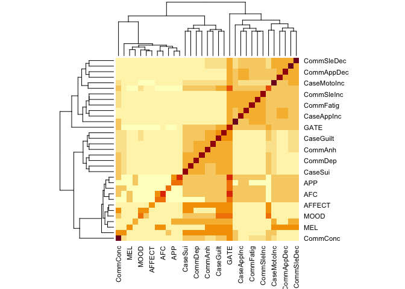
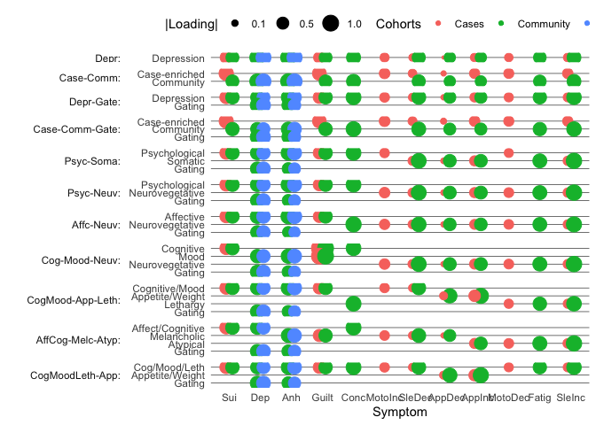

GenomicSEM of MDD symptoms
================
Mark Adams, Bradley Jermy, Jackson Thorp, Andrew Grotzinger, Michel
Nivard

# Setup

## R packages

R version

``` r
R.version
```

    ##                _                           
    ## platform       aarch64-apple-darwin20      
    ## arch           aarch64                     
    ## os             darwin20                    
    ## system         aarch64, darwin20           
    ## status                                     
    ## major          4                           
    ## minor          3.2                         
    ## year           2023                        
    ## month          10                          
    ## day            31                          
    ## svn rev        85441                       
    ## language       R                           
    ## version.string R version 4.3.2 (2023-10-31)
    ## nickname       Eye Holes

Package installation

``` r
required_packages <- c('devtools', 'readr', 'tidyr', 'dplyr', 'ggplot2', 'stringr', 'corrplot')
for(pack in required_packages) if(!require(pack, character.only=TRUE)) install.packages(pack)

if(!require(GenomicSEM)) remotes::install_github("MichelNivard/GenomicSEM")
```

GenomicSEM version

``` r
require(readr)
require(tidyr)
require(stringr)
require(dplyr)
require(ggplot2)
require(corrplot)
require(GenomicSEM)

packageVersion("GenomicSEM")
```

    ## [1] '0.0.5'

# Symptom labels

MDD DSM symptoms are numbered 1-9:

``` r
# plot labels

dsm_mdd_symptoms_labels <-
read_delim("
MDD1;Mood;Mood;Dep
MDD2;Interest;Interest;Anh
MDD3;Weight⇅;Weight⇆;App
MDD3a;Weight⇊;Weight⇇;AppDec
MDD3b;Weight⇈;Weight⇉;AppInc
MDD4;Sleep⇅;Sleep⇆;Sle
MDD4a;Sleep⇊;Sleep⇇;SleDec
MDD4b;Sleep⇈;Sleep⇉;SleInc
MDD5;Motor⇅;Motor⇆;Moto
MDD5a;Motor⇈;Motor⇉;MotoInc
MDD5b;Motor⇊;Motor⇇;MotoDec
MDD6;Fatigue;Fatigue;Fatig
MDD7;Guilt;Guilt;Guilt
MDD8;Concentrate;Concentrate;Conc
MDD9;Suicidality;Suicidality;Sui
", col_names=c('ref', 'h', 'v', 'abbv'), delim=';')
```

    ## Rows: 15 Columns: 4
    ## ── Column specification ───────────────────────────────────────────────────────────────────────────────────────────────────────────────────────────────────────
    ## Delimiter: ";"
    ## chr (4): ref, h, v, abbv
    ## 
    ## ℹ Use `spec()` to retrieve the full column specification for this data.
    ## ℹ Specify the column types or set `show_col_types = FALSE` to quiet this message.

``` r
dsm_mdd_symptoms_reference <-
read_delim("
MDD1;Depressed mood most of the day, nearly every day
MDD2;Markedly diminished interest or pleasure in all, or almost all, activities most of the day, nearly every day
MDD3;Significant change in weight or appetite
MDD3a;Significant weight loss or decrease in appetite
MDD3b;Significant weight gain or increase in appetite
MDD4;Sleeping too much or not sleeping enough
MDD4a;Insomnia nearly every day
MDD4b;Hypersomnia nearly every day
MDD5;Changes in speed/amount of moving or speaking
MDD5a;Psychomotor agitation nearly every day
MDD5b;Psychomotor slowing nearly every day
MDD6;Fatigue or loss of energy nearly every day
MDD7;Feelings of worthlessness or excessive or inappropriate guilt
MDD8;Diminished ability to think or concentrate, or indecisiveness
MDD9;Recurrent thoughts of death or suicide or a suicide attempt or a specific plan for attempting suicide
", col_names=c('Reference', 'Description'), delim=';')
```

    ## Rows: 15 Columns: 2
    ## ── Column specification ───────────────────────────────────────────────────────────────────────────────────────────────────────────────────────────────────────
    ## Delimiter: ";"
    ## chr (2): Reference, Description
    ## 
    ## ℹ Use `spec()` to retrieve the full column specification for this data.
    ## ℹ Specify the column types or set `show_col_types = FALSE` to quiet this message.

``` r
dsm_mdd_symptoms_reference %>%
left_join(dsm_mdd_symptoms_labels, by=c('Reference'='ref')) %>%
select(Reference, Abbreviation=abbv, Label=h, Description)
```

    ## # A tibble: 15 × 4
    ##    Reference Abbreviation Label       Description                               
    ##    <chr>     <chr>        <chr>       <chr>                                     
    ##  1 MDD1      Dep          Mood        Depressed mood most of the day, nearly ev…
    ##  2 MDD2      Anh          Interest    Markedly diminished interest or pleasure …
    ##  3 MDD3      App          Weight⇅     Significant change in weight or appetite  
    ##  4 MDD3a     AppDec       Weight⇊     Significant weight loss or decrease in ap…
    ##  5 MDD3b     AppInc       Weight⇈     Significant weight gain or increase in ap…
    ##  6 MDD4      Sle          Sleep⇅      Sleeping too much or not sleeping enough  
    ##  7 MDD4a     SleDec       Sleep⇊      Insomnia nearly every day                 
    ##  8 MDD4b     SleInc       Sleep⇈      Hypersomnia nearly every day              
    ##  9 MDD5      Moto         Motor⇅      Changes in speed/amount of moving or spea…
    ## 10 MDD5a     MotoInc      Motor⇈      Psychomotor agitation nearly every day    
    ## 11 MDD5b     MotoDec      Motor⇊      Psychomotor slowing nearly every day      
    ## 12 MDD6      Fatig        Fatigue     Fatigue or loss of energy nearly every day
    ## 13 MDD7      Guilt        Guilt       Feelings of worthlessness or excessive or…
    ## 14 MDD8      Conc         Concentrate Diminished ability to think or concentrat…
    ## 15 MDD9      Sui          Suicidality Recurrent thoughts of death or suicide or…

# GenomicSEM covariance structure

``` r
covstruct_prefix <- 'clin.comm.covstruct'
covstruct_r <- file.path('ldsc', paste(covstruct_prefix, 'deparse.R', sep='.'))
covstruct_rds <- file.path('ldsc', paste(covstruct_prefix, 'rds', sep='.'))

symptoms_covstruct <- dget(covstruct_r)

sumstats_prevs <- read_tsv(file.path('ldsc', paste(covstruct_prefix, 'prevs', 'txt', sep='.')))
```

    ## Rows: 26 Columns: 9
    ## ── Column specification ───────────────────────────────────────────────────────────────────────────────────────────────────────────────────────────────────────
    ## Delimiter: "\t"
    ## chr (5): cohorts, symptom, sumstats, filename, trait_name
    ## dbl (4): Nca, Nco, samp_prev, pop_prev
    ## 
    ## ℹ Use `spec()` to retrieve the full column specification for this data.
    ## ℹ Specify the column types or set `show_col_types = FALSE` to quiet this message.

Rename samples: AGDS/GS/PGC is the Case-only **Clin**incal meta-analysis
sample (`Clin`) and ALSPAC/EstBB/UKB is the **Comm**unity meta-analysis
sample (`Comm`); and rename symptoms numbers (`MDD1`, `MDD2`) to
abbreviations (`Dep`, `Anh`). There are also extra measures of `MDD1`
and `MDD2` from **UKB** Baseline data.

``` r
cohorts_sample_symptoms <-
sumstats_prevs %>%
left_join(dsm_mdd_symptoms_labels, by=c('symptom'='ref')) %>%
select(cohorts, symptom, trait_name, abbv) %>%
mutate(Sample=case_when(cohorts %in% 'Clin' ~ 'Clin',
                        cohorts %in% 'Comm' ~ 'Comm',
                        cohorts %in% 'UKBt' ~ 'Ukb',
                        TRUE ~ NA_character_)) %>%
mutate(sample_symptom=paste0(Sample, abbv))

sample_symptoms <- cohorts_sample_symptoms$sample_symptom
names(sample_symptoms) <- cohorts_sample_symptoms$trait_name

# rename traits in covstruct
dimnames(symptoms_covstruct$S)[[2]] <-
as.vector(sample_symptoms[dimnames(symptoms_covstruct$S)[[2]]])
```

# Structural models

Symptoms with positive variances

``` r
symptoms_S_var <- diag(symptoms_covstruct$S)
names(symptoms_S_var) <- dimnames(symptoms_covstruct$S)[[2]]

symptoms_S_var[which(symptoms_S_var > 0)]
```

    ##  ClinAppDec  ClinAppInc  ClinSleDec  ClinSleInc ClinMotoInc ClinMotoDec 
    ##  0.09257086  0.12274945  0.07289299  0.05265282  0.03653919  0.00105577 
    ##   ClinGuilt     ClinSui     CommDep     CommAnh  CommAppDec  CommAppInc 
    ##  0.02345170  0.06410331  0.08366350  0.08445228  0.04481289  0.12878752 
    ##  CommSleDec  CommSleInc   CommFatig   CommGuilt    CommConc     CommSui 
    ##  0.05793853  0.08948925  0.06275359  0.06263088  0.04880229  0.03213463 
    ##      UkbDep      UkbAnh 
    ##  0.04246339  0.04703149

## Common factor

Common factor across symptoms from both cohorts, as a general MDD factor

``` r
commonfactor.model <- "
MDD =~ NA*ClinAppDec + ClinAppInc + ClinSleDec + ClinSleInc + ClinMotoInc + ClinMotoDec + ClinGuilt + ClinSui + CommDep + CommAnh + CommAppDec + CommAppInc + CommSleDec + CommSleInc + CommFatig + CommGuilt + CommConc + CommSui + UkbDep + UkbAnh

MDD ~~ 1*MDD
"

commonfactor.fit <- usermodel(symptoms_covstruct, estimation='DWLS', model=commonfactor.model, imp_cov=TRUE)
```

    ## [1] "Running primary model"
    ## [1] "Calculating CFI"
    ## [1] "Calculating Standardized Results"
    ## [1] "Calculating SRMR"
    ## elapsed 
    ##   0.974 
    ## [1] "The S matrix was smoothed prior to model estimation due to a non-positive definite matrix. The largest absolute difference in a cell between the smoothed and non-smoothed matrix was  0.0503268938714835 As a result of the smoothing, the largest Z-statistic change for the genetic covariances was  1.09016893592689 . We recommend setting the smooth_check argument to true if you are going to run a multivariate GWAS."

    ## Warning in usermodel(symptoms_covstruct, estimation = "DWLS", model =
    ## commonfactor.model, : A difference greater than .025 was observed pre- and
    ## post-smoothing in the genetic covariance matrix. This reflects a large
    ## difference and results should be interpreted with caution!! This can often
    ## result from including low powered traits, and you might consider removing those
    ## traits from the model. If you are going to run a multivariate GWAS we strongly
    ## recommend setting the smooth_check argument to true to check smoothing for each
    ## SNP.

    ## Warning in usermodel(symptoms_covstruct, estimation = "DWLS", model =
    ## commonfactor.model, : A difference greater than .025 was observed pre- and
    ## post-smoothing for Z-statistics in the genetic covariance matrix. This reflects
    ## a large difference and results should be interpreted with caution!! This can
    ## often result from including low powered traits, and you might consider removing
    ## those traits from the model. If you are going to run a multivariate GWAS we
    ## strongly recommend setting the smooth_check argument to true to check smoothing
    ## for each SNP.

``` r
commonfactor.fit$modelfit
```

    ##       chisq  df p_chisq      AIC      CFI      SRMR
    ## df 5275.393 170       0 5355.393 0.932235 0.1687414

``` r
commonfactor.fit$results[c(1,2,3,6,7)] %>%
     filter(lhs == 'MDD') %>%
     mutate(STD_Genotype_SE=as.numeric(STD_Genotype_SE)) %>%
     print(digits=2)
```

    ##    lhs op         rhs STD_Genotype STD_Genotype_SE
    ## 1  MDD =~  ClinAppDec        0.037           0.086
    ## 2  MDD =~  ClinAppInc       -0.201           0.079
    ## 3  MDD =~  ClinSleDec       -0.138           0.095
    ## 4  MDD =~  ClinSleInc       -0.214           0.104
    ## 5  MDD =~ ClinMotoInc       -0.239           0.107
    ## 6  MDD =~ ClinMotoDec       -0.200           0.142
    ## 7  MDD =~   ClinGuilt       -0.448           0.133
    ## 8  MDD =~     ClinSui       -0.506           0.101
    ## 9  MDD =~     CommDep       -0.866           0.036
    ## 10 MDD =~     CommAnh       -0.924           0.033
    ## 11 MDD =~  CommAppDec       -0.427           0.066
    ## 12 MDD =~  CommAppInc       -0.422           0.051
    ## 13 MDD =~  CommSleDec       -0.625           0.063
    ## 14 MDD =~  CommSleInc       -0.708           0.065
    ## 15 MDD =~   CommFatig       -0.562           0.073
    ## 16 MDD =~   CommGuilt       -0.586           0.051
    ## 17 MDD =~    CommConc       -0.732           0.069
    ## 18 MDD =~     CommSui       -0.598           0.067
    ## 19 MDD =~      UkbDep       -0.863           0.055
    ## 20 MDD =~      UkbAnh       -0.884           0.053
    ## 21 MDD ~~         MDD        1.000              NA

## Directional symptoms

Common factor with residual correlations among paired directional
symptoms.

``` r
common_dir.model <- "
MDD =~ NA*ClinAppDec + ClinAppInc + ClinSleDec + ClinSleInc + ClinMotoInc + ClinMotoDec + ClinGuilt + ClinSui + CommDep + CommAnh + CommAppDec + CommAppInc + CommSleDec + CommSleInc + CommFatig + CommGuilt + CommConc + CommSui + UkbDep + UkbAnh

ClinAppDec ~~ ClinAppInc
ClinSleDec ~~ ClinSleInc
ClinMotoInc ~~ ClinMotoDec
CommAppDec ~~ CommAppInc
CommSleDec ~~ CommSleInc

MDD ~~ 1*MDD
"

common_dir.fit <- usermodel(symptoms_covstruct, estimation='DWLS', model=common_dir.model, imp_cov=TRUE)
```

    ## [1] "Running primary model"
    ## [1] "Calculating CFI"
    ## [1] "Calculating Standardized Results"
    ## [1] "Calculating SRMR"
    ## elapsed 
    ##   0.929 
    ## [1] "The S matrix was smoothed prior to model estimation due to a non-positive definite matrix. The largest absolute difference in a cell between the smoothed and non-smoothed matrix was  0.0503268938714835 As a result of the smoothing, the largest Z-statistic change for the genetic covariances was  1.09016893592689 . We recommend setting the smooth_check argument to true if you are going to run a multivariate GWAS."

    ## Warning in usermodel(symptoms_covstruct, estimation = "DWLS", model =
    ## common_dir.model, : A difference greater than .025 was observed pre- and
    ## post-smoothing in the genetic covariance matrix. This reflects a large
    ## difference and results should be interpreted with caution!! This can often
    ## result from including low powered traits, and you might consider removing those
    ## traits from the model. If you are going to run a multivariate GWAS we strongly
    ## recommend setting the smooth_check argument to true to check smoothing for each
    ## SNP.

    ## Warning in usermodel(symptoms_covstruct, estimation = "DWLS", model =
    ## common_dir.model, : A difference greater than .025 was observed pre- and
    ## post-smoothing for Z-statistics in the genetic covariance matrix. This reflects
    ## a large difference and results should be interpreted with caution!! This can
    ## often result from including low powered traits, and you might consider removing
    ## those traits from the model. If you are going to run a multivariate GWAS we
    ## strongly recommend setting the smooth_check argument to true to check smoothing
    ## for each SNP.

``` r
common_dir.fit$modelfit
```

    ##       chisq  df p_chisq      AIC       CFI      SRMR
    ## df 4768.034 165       0 4858.034 0.9389029 0.1650853

``` r
common_dir.fit$results[c(1,2,3,6,7)] %>%
     filter(lhs == 'MDD' | (lhs != 'MDD' & lhs != rhs)) %>%
     mutate(STD_Genotype_SE=as.numeric(STD_Genotype_SE)) %>%
     print(digits=2)
```

    ##            lhs op         rhs STD_Genotype STD_Genotype_SE
    ## 1          MDD =~  ClinAppDec      0.03424           0.085
    ## 2          MDD =~  ClinAppInc     -0.19850           0.079
    ## 3          MDD =~  ClinSleDec     -0.13649           0.094
    ## 4          MDD =~  ClinSleInc     -0.21514           0.104
    ## 5          MDD =~ ClinMotoInc     -0.23774           0.107
    ## 6          MDD =~ ClinMotoDec     -0.20115           0.142
    ## 7          MDD =~   ClinGuilt     -0.44735           0.132
    ## 8          MDD =~     ClinSui     -0.50593           0.101
    ## 9          MDD =~     CommDep     -0.87025           0.036
    ## 10         MDD =~     CommAnh     -0.92802           0.033
    ## 11         MDD =~  CommAppDec     -0.40038           0.066
    ## 12         MDD =~  CommAppInc     -0.40676           0.050
    ## 13         MDD =~  CommSleDec     -0.61513           0.063
    ## 14         MDD =~  CommSleInc     -0.69955           0.065
    ## 15         MDD =~   CommFatig     -0.56107           0.073
    ## 16         MDD =~   CommGuilt     -0.58697           0.051
    ## 17         MDD =~    CommConc     -0.73114           0.069
    ## 18         MDD =~     CommSui     -0.59835           0.067
    ## 19         MDD =~      UkbDep     -0.86550           0.055
    ## 20         MDD =~      UkbAnh     -0.88533           0.053
    ## 21  ClinAppDec ~~  ClinAppInc     -0.20586           0.186
    ## 22  ClinSleDec ~~  ClinSleInc      0.00046           0.309
    ## 23 ClinMotoInc ~~ ClinMotoDec     -0.21217           0.399
    ## 24  CommAppDec ~~  CommAppInc      0.46313           0.102
    ## 25  CommSleDec ~~  CommSleInc      0.17751           0.145
    ## 26         MDD ~~         MDD      1.00000              NA

## Ascertainment-specific factors

### Clinical-Community

Symptoms were assessed in Clinical and Community samples. Make factors
representing sample type.

``` r
clin_comm.model <- "
CLIN =~ NA*ClinAppDec + ClinAppInc + ClinSleDec + ClinSleInc + ClinMotoInc + ClinMotoDec + ClinGuilt + ClinSui
COMM =~ NA*CommDep + CommAnh + CommAppDec + CommAppInc + CommSleDec + CommSleInc + CommFatig + CommGuilt + CommConc + CommSui + UkbDep + UkbAnh

CLIN ~~ 1*CLIN
COMM ~~ 1*COMM

"

clin_comm.fit <- usermodel(symptoms_covstruct, estimation='DWLS', model=clin_comm.model, imp_cov=TRUE)
```

    ## [1] "Running primary model"
    ## [1] "Calculating CFI"
    ## [1] "Calculating Standardized Results"
    ## [1] "Calculating SRMR"
    ## elapsed 
    ##   1.004 
    ## [1] "The S matrix was smoothed prior to model estimation due to a non-positive definite matrix. The largest absolute difference in a cell between the smoothed and non-smoothed matrix was  0.0503268938714835 As a result of the smoothing, the largest Z-statistic change for the genetic covariances was  1.09016893592689 . We recommend setting the smooth_check argument to true if you are going to run a multivariate GWAS."

    ## Warning in usermodel(symptoms_covstruct, estimation = "DWLS", model =
    ## clin_comm.model, : A difference greater than .025 was observed pre- and
    ## post-smoothing in the genetic covariance matrix. This reflects a large
    ## difference and results should be interpreted with caution!! This can often
    ## result from including low powered traits, and you might consider removing those
    ## traits from the model. If you are going to run a multivariate GWAS we strongly
    ## recommend setting the smooth_check argument to true to check smoothing for each
    ## SNP.

    ## Warning in usermodel(symptoms_covstruct, estimation = "DWLS", model =
    ## clin_comm.model, : A difference greater than .025 was observed pre- and
    ## post-smoothing for Z-statistics in the genetic covariance matrix. This reflects
    ## a large difference and results should be interpreted with caution!! This can
    ## often result from including low powered traits, and you might consider removing
    ## those traits from the model. If you are going to run a multivariate GWAS we
    ## strongly recommend setting the smooth_check argument to true to check smoothing
    ## for each SNP.

``` r
clin_comm.fit$modelfit
```

    ##      chisq  df p_chisq     AIC       CFI      SRMR
    ## df 5286.61 169       0 5368.61 0.9320729 0.1653806

``` r
clin_comm.fit$results[c(1,2,3,6,7,9)] %>%
     filter(lhs %in% c('CLIN', 'COMM'), rhs %in% c('CLIN', 'COMM'), lhs != rhs) %>%
     mutate(STD_Genotype_SE=as.numeric(STD_Genotype_SE)) %>%
     print(digits=2)
```

    ##    lhs op  rhs STD_Genotype STD_Genotype_SE p_value
    ## 1 CLIN ~~ COMM        -0.63            0.14 1.3e-05

### Gating symptoms

Then consider the community cardinal symptoms (Depression and
Anhedonia), which are gating items to the rest of the community-sample
symptoms.

``` r
gate.model <- "
MDD =~ NA*ClinAppDec + ClinAppInc + ClinSleDec + ClinSleInc + ClinMotoInc + ClinMotoDec + ClinGuilt + ClinSui + CommDep + CommAnh + CommAppDec + CommAppInc + CommSleDec + CommSleInc + CommFatig + CommGuilt + CommConc + CommSui + UkbDep + UkbAnh
GATE =~ NA*CommDep + CommAnh + UkbDep + UkbAnh

MDD ~~ 1*MDD
GATE ~~ 1*GATE
MDD ~~ 0*GATE
"

gate.fit <- usermodel(symptoms_covstruct, estimation='DWLS', model=gate.model, imp_cov=TRUE)
```

    ## [1] "Running primary model"
    ## [1] "Calculating CFI"
    ## [1] "Calculating Standardized Results"
    ## [1] "Calculating SRMR"
    ## elapsed 
    ##   0.951 
    ## [1] "The S matrix was smoothed prior to model estimation due to a non-positive definite matrix. The largest absolute difference in a cell between the smoothed and non-smoothed matrix was  0.0503268938714835 As a result of the smoothing, the largest Z-statistic change for the genetic covariances was  1.09016893592689 . We recommend setting the smooth_check argument to true if you are going to run a multivariate GWAS."

    ## Warning in usermodel(symptoms_covstruct, estimation = "DWLS", model =
    ## gate.model, : A difference greater than .025 was observed pre- and
    ## post-smoothing in the genetic covariance matrix. This reflects a large
    ## difference and results should be interpreted with caution!! This can often
    ## result from including low powered traits, and you might consider removing those
    ## traits from the model. If you are going to run a multivariate GWAS we strongly
    ## recommend setting the smooth_check argument to true to check smoothing for each
    ## SNP.

    ## Warning in usermodel(symptoms_covstruct, estimation = "DWLS", model =
    ## gate.model, : A difference greater than .025 was observed pre- and
    ## post-smoothing for Z-statistics in the genetic covariance matrix. This reflects
    ## a large difference and results should be interpreted with caution!! This can
    ## often result from including low powered traits, and you might consider removing
    ## those traits from the model. If you are going to run a multivariate GWAS we
    ## strongly recommend setting the smooth_check argument to true to check smoothing
    ## for each SNP.

``` r
gate.fit$modelfit
```

    ##       chisq  df p_chisq      AIC       CFI      SRMR
    ## df 3228.658 166       0 3316.658 0.9593487 0.1508317

``` r
gate.fit$results[c(1,2,3,6,7)] %>%
     filter(lhs %in% c('GATE')) %>%
     mutate(STD_Genotype_SE=as.numeric(STD_Genotype_SE)) %>%
     print(digits=2)
```

    ##    lhs op     rhs STD_Genotype STD_Genotype_SE
    ## 1 GATE =~ CommDep         0.74           0.060
    ## 2 GATE =~ CommAnh         0.59           0.055
    ## 3 GATE =~  UkbDep         0.72           0.094
    ## 4 GATE =~  UkbAnh         0.54           0.096
    ## 5 GATE ~~    GATE         1.00              NA

### Gate-Community-Clinical (Spectrum)

Comparison of ascertainment and measurement. Gating symptoms from
community sample (distinguish controls from subthreshold), symptoms from
community sample symptoms (subthreshold from cases), and clinical cohort
symptoms (distinguish cases from each other)

``` r
measure.model <- "
CLIN =~ NA*ClinAppDec + ClinAppInc + ClinSleDec + ClinSleInc + ClinMotoInc + ClinMotoDec + ClinGuilt + ClinSui
COMM =~ NA*CommDep + CommAnh + UkbDep + UkbAnh + CommAppDec + CommAppInc + CommSleDec + CommSleInc + CommFatig + CommGuilt + CommConc + CommSui
GATE =~ NA*CommDep + CommAnh + UkbDep + UkbAnh

CLIN ~~ 1*CLIN
GATE ~~ 1*GATE
COMM ~~ 1*COMM
GATE ~~ 0*COMM + 0*CLIN
"

measure.fit <- usermodel(symptoms_covstruct, estimation='DWLS', model=measure.model, imp_cov=TRUE)
```

    ## [1] "Running primary model"
    ## [1] "Calculating CFI"
    ## [1] "Calculating Standardized Results"
    ## [1] "Calculating SRMR"
    ## elapsed 
    ##   1.065 
    ## [1] "The S matrix was smoothed prior to model estimation due to a non-positive definite matrix. The largest absolute difference in a cell between the smoothed and non-smoothed matrix was  0.0503268938714835 As a result of the smoothing, the largest Z-statistic change for the genetic covariances was  1.09016893592689 . We recommend setting the smooth_check argument to true if you are going to run a multivariate GWAS."

    ## Warning in usermodel(symptoms_covstruct, estimation = "DWLS", model =
    ## measure.model, : A difference greater than .025 was observed pre- and
    ## post-smoothing in the genetic covariance matrix. This reflects a large
    ## difference and results should be interpreted with caution!! This can often
    ## result from including low powered traits, and you might consider removing those
    ## traits from the model. If you are going to run a multivariate GWAS we strongly
    ## recommend setting the smooth_check argument to true to check smoothing for each
    ## SNP.

    ## Warning in usermodel(symptoms_covstruct, estimation = "DWLS", model =
    ## measure.model, : A difference greater than .025 was observed pre- and
    ## post-smoothing for Z-statistics in the genetic covariance matrix. This reflects
    ## a large difference and results should be interpreted with caution!! This can
    ## often result from including low powered traits, and you might consider removing
    ## those traits from the model. If you are going to run a multivariate GWAS we
    ## strongly recommend setting the smooth_check argument to true to check smoothing
    ## for each SNP.

``` r
measure.fit$modelfit
```

    ##      chisq  df p_chisq     AIC       CFI      SRMR
    ## df 3284.96 165       0 3374.96 0.9585881 0.1490734

``` r
measure.fit$results[c(1,2,3,6,7, 9)] %>%
     filter(lhs %in% c('CLIN', 'COMM', 'GATE'), rhs %in% c('CLIN', 'COMM', 'GATE'), lhs != rhs) %>%
     mutate(STD_Genotype_SE=as.numeric(STD_Genotype_SE)) %>%
     print(digits=2)
```

    ##    lhs op  rhs STD_Genotype STD_Genotype_SE p_value
    ## 1 CLIN ~~ COMM        -0.75            0.17 6.9e-06
    ## 2 COMM ~~ GATE         0.00              NA      NA
    ## 3 CLIN ~~ GATE         0.00              NA      NA

Pathway from Gating factor to Community factor

``` r
measure_dep.model <- "
CLIN =~ NA*ClinAppDec + ClinAppInc + ClinSleDec + ClinSleInc + ClinMotoInc + ClinMotoDec + ClinGuilt + ClinSui
CIDI =~ NA*CommDep + CommAnh + UkbDep + UkbAnh + CommAppDec + CommAppInc + CommSleDec + CommSleInc + CommFatig + CommGuilt + CommConc + CommSui
GATE =~ NA*CommDep + CommAnh + UkbDep + UkbAnh
CIDI ~ GATE

CLIN ~~ 1*CLIN
GATE ~~ 1*GATE

uk1 > 0.001
UkbDep ~~ uk1*UkbDep
"

measure_dep.fit <- usermodel(symptoms_covstruct, estimation='DWLS', model=measure_dep.model, imp_cov=TRUE)

measure_dep.fit$modelfit
measure_dep.fit$results[c(1,2,3,6,7, 9)] %>%
     filter(lhs %in% c('CLIN', 'COMM', 'GATE'), rhs %in% c('CLIN', 'COMM', 'GATE'), lhs != rhs) %>%
     mutate(STD_Genotype_SE=as.numeric(STD_Genotype_SE)) %>%
     print(digits=2)
```

### MDD Subtypes

Group symptoms from the clinical cohorts (that had positive genetic
variance) together with the same symptoms from the community cohorts (to
create a dimension of MDD subtypes), then a separate factor for all
other community cohort symptoms (that separates cases from controls)

``` r
subtype.model <- "
SUBTYPE =~ NA*ClinAppDec + ClinAppInc + ClinSleDec + ClinSleInc + ClinMotoInc + ClinMotoDec + ClinGuilt + ClinSui + CommAppDec + CommAppInc + CommSleDec + CommSleInc + CommSui
MDD =~ NA*CommDep + CommAnh + UkbDep + UkbAnh + CommFatig + CommGuilt + CommConc 

SUBTYPE ~~ 1*SUBTYPE
MDD ~~ 1*MDD
"

subtype.fit <- usermodel(symptoms_covstruct, estimation='DWLS', model=subtype.model, imp_cov=TRUE)
```

    ## [1] "Running primary model"
    ## [1] "Calculating CFI"
    ## [1] "Calculating Standardized Results"
    ## [1] "Calculating SRMR"
    ## elapsed 
    ##   1.041 
    ## [1] "The S matrix was smoothed prior to model estimation due to a non-positive definite matrix. The largest absolute difference in a cell between the smoothed and non-smoothed matrix was  0.0503268938714835 As a result of the smoothing, the largest Z-statistic change for the genetic covariances was  1.09016893592689 . We recommend setting the smooth_check argument to true if you are going to run a multivariate GWAS."

    ## Warning in usermodel(symptoms_covstruct, estimation = "DWLS", model =
    ## subtype.model, : A difference greater than .025 was observed pre- and
    ## post-smoothing in the genetic covariance matrix. This reflects a large
    ## difference and results should be interpreted with caution!! This can often
    ## result from including low powered traits, and you might consider removing those
    ## traits from the model. If you are going to run a multivariate GWAS we strongly
    ## recommend setting the smooth_check argument to true to check smoothing for each
    ## SNP.

    ## Warning in usermodel(symptoms_covstruct, estimation = "DWLS", model =
    ## subtype.model, : A difference greater than .025 was observed pre- and
    ## post-smoothing for Z-statistics in the genetic covariance matrix. This reflects
    ## a large difference and results should be interpreted with caution!! This can
    ## often result from including low powered traits, and you might consider removing
    ## those traits from the model. If you are going to run a multivariate GWAS we
    ## strongly recommend setting the smooth_check argument to true to check smoothing
    ## for each SNP.

``` r
subtype.fit$modelfit
```

    ##       chisq  df p_chisq      AIC       CFI      SRMR
    ## df 5225.169 169       0 5307.169 0.9328884 0.1605923

``` r
subtype.fit$results[c(1,2,3,6,7)] %>%
     filter(lhs %in% c('SUBTYPE', 'MDD'), rhs %in% c('SUBTYPE', 'MDD'), lhs != rhs) %>%
     mutate(STD_Genotype_SE=as.numeric(STD_Genotype_SE)) %>%
     print(digits=2)
```

    ##       lhs op rhs STD_Genotype STD_Genotype_SE
    ## 1 SUBTYPE ~~ MDD        -0.73           0.055

## Two-factor models

[Elhai Psychiat Res
2012](https://www.sciencedirect.com/science/article/pii/S0165178112002685)
compared 3 two-factor models

### Psychological-Somatic (Elhai Model 2a)

[Krause Rehab Psychol
2008](https://psycnet.apa.org/record/2008-17022-011), [Krause Arch Psys
Med Rehab
2010](https://www.sciencedirect.com/science/article/pii/S0003999310002443):

> the 2-factor solution with 3 somatic items (sleep disturbance, poor
> energy, appetite change) was a better solution than either a
> unidimensional model or 2-factor model that included psychomotor
> slowing as a fourth somatic item

``` r
psych_soma.model <- "
PSYCH =~ NA*ClinMotoInc + ClinMotoDec + ClinGuilt + ClinSui + CommDep + CommAnh + CommGuilt + CommConc + CommSui + UkbDep + UkbAnh
SOMA =~ NA*ClinAppDec + ClinAppInc + ClinSleDec + ClinSleInc + CommAppDec + CommAppInc + CommSleDec + CommSleInc + CommFatig

GATE =~ NA*CommDep + CommAnh + UkbDep + UkbAnh

PSYCH ~~ 1*PSYCH
SOMA ~~ 1*SOMA
GATE ~~ 1*GATE
GATE ~~ 0*PSYCH + 0*SOMA
"

psych_soma.fit <- usermodel(symptoms_covstruct, estimation='DWLS', model=psych_soma.model, imp_cov=TRUE)
```

    ## [1] "Running primary model"
    ## [1] "Calculating CFI"
    ## [1] "Calculating Standardized Results"
    ## [1] "Calculating SRMR"
    ## elapsed 
    ##   1.063 
    ## [1] "The S matrix was smoothed prior to model estimation due to a non-positive definite matrix. The largest absolute difference in a cell between the smoothed and non-smoothed matrix was  0.0503268938714835 As a result of the smoothing, the largest Z-statistic change for the genetic covariances was  1.09016893592689 . We recommend setting the smooth_check argument to true if you are going to run a multivariate GWAS."

    ## Warning in usermodel(symptoms_covstruct, estimation = "DWLS", model =
    ## psych_soma.model, : A difference greater than .025 was observed pre- and
    ## post-smoothing in the genetic covariance matrix. This reflects a large
    ## difference and results should be interpreted with caution!! This can often
    ## result from including low powered traits, and you might consider removing those
    ## traits from the model. If you are going to run a multivariate GWAS we strongly
    ## recommend setting the smooth_check argument to true to check smoothing for each
    ## SNP.

    ## Warning in usermodel(symptoms_covstruct, estimation = "DWLS", model =
    ## psych_soma.model, : A difference greater than .025 was observed pre- and
    ## post-smoothing for Z-statistics in the genetic covariance matrix. This reflects
    ## a large difference and results should be interpreted with caution!! This can
    ## often result from including low powered traits, and you might consider removing
    ## those traits from the model. If you are going to run a multivariate GWAS we
    ## strongly recommend setting the smooth_check argument to true to check smoothing
    ## for each SNP.

``` r
psych_soma.fit$modelfit
```

    ##       chisq  df p_chisq      AIC      CFI      SRMR
    ## df 3628.966 165       0 3718.966 0.954022 0.1482829

``` r
psych_soma.fit$results[c(1,2,3,6,7)] %>%
     filter(lhs %in% c('PSYCH', 'SOMA'), rhs %in% c('PSYCH', 'SOMA'), lhs != rhs) %>%
     mutate(STD_Genotype_SE=as.numeric(STD_Genotype_SE)) %>%
     print(digits=2)
```

    ##     lhs op  rhs STD_Genotype STD_Genotype_SE
    ## 1 PSYCH ~~ SOMA        -0.75           0.056

### Psychological-Neurovegetative (Elhai Model 2b)

``` r
psych_veg.model <- "
PSYCH =~ NA*ClinGuilt + ClinSui + CommDep + CommAnh + CommGuilt + CommConc + CommSui + UkbDep + UkbAnh
VEG =~ NA*ClinAppDec + ClinAppInc + ClinSleDec + ClinSleInc + ClinMotoInc + ClinMotoDec + CommAppDec + CommAppInc + CommSleDec + CommSleInc + CommFatig

GATE =~ NA*CommDep + CommAnh + UkbDep + UkbAnh

PSYCH ~~ 1*PSYCH
VEG ~~ 1*VEG
GATE ~~ 1*GATE
GATE ~~ 0*PSYCH + 0*VEG
"
psych_veg.fit <- usermodel(symptoms_covstruct, estimation='DWLS', model=psych_veg.model, imp_cov=TRUE)
```

    ## [1] "Running primary model"
    ## [1] "Calculating CFI"
    ## [1] "Calculating Standardized Results"
    ## [1] "Calculating SRMR"
    ## elapsed 
    ##   1.038 
    ## [1] "The S matrix was smoothed prior to model estimation due to a non-positive definite matrix. The largest absolute difference in a cell between the smoothed and non-smoothed matrix was  0.0503268938714835 As a result of the smoothing, the largest Z-statistic change for the genetic covariances was  1.09016893592689 . We recommend setting the smooth_check argument to true if you are going to run a multivariate GWAS."

    ## Warning in usermodel(symptoms_covstruct, estimation = "DWLS", model =
    ## psych_veg.model, : A difference greater than .025 was observed pre- and
    ## post-smoothing in the genetic covariance matrix. This reflects a large
    ## difference and results should be interpreted with caution!! This can often
    ## result from including low powered traits, and you might consider removing those
    ## traits from the model. If you are going to run a multivariate GWAS we strongly
    ## recommend setting the smooth_check argument to true to check smoothing for each
    ## SNP.

    ## Warning in usermodel(symptoms_covstruct, estimation = "DWLS", model =
    ## psych_veg.model, : A difference greater than .025 was observed pre- and
    ## post-smoothing for Z-statistics in the genetic covariance matrix. This reflects
    ## a large difference and results should be interpreted with caution!! This can
    ## often result from including low powered traits, and you might consider removing
    ## those traits from the model. If you are going to run a multivariate GWAS we
    ## strongly recommend setting the smooth_check argument to true to check smoothing
    ## for each SNP.

``` r
psych_veg.fit$modelfit
```

    ##       chisq  df p_chisq      AIC       CFI      SRMR
    ## df 3709.728 165       0 3799.728 0.9529501 0.1440514

``` r
psych_veg.fit$results[c(1,2,3,6,7)] %>%
     filter(lhs %in% c('PSYCH', 'VEG'), rhs %in% c('PSYCH', 'VEG'), lhs != rhs) %>%
     mutate(STD_Genotype_SE=as.numeric(STD_Genotype_SE)) %>%
     print(digits=2)
```

    ##     lhs op rhs STD_Genotype STD_Genotype_SE
    ## 1 PSYCH ~~ VEG        -0.73           0.054

### Affective-Neurovegetative (Elhai Model 2c)

``` r
affect_neuroveg.model <- "
AFFECT =~ NA*ClinGuilt + ClinSui + CommDep + CommAnh + CommGuilt + CommSui + UkbDep + UkbAnh
NEUROVEG =~ NA*ClinAppDec + ClinAppInc + ClinSleDec + ClinSleInc + ClinMotoInc + ClinMotoDec + CommAppDec + CommAppInc + CommSleDec + CommSleInc + CommFatig + CommConc

GATE =~ NA*CommDep + CommAnh + UkbDep + UkbAnh

AFFECT ~~ 1*AFFECT
NEUROVEG ~~ 1*NEUROVEG
GATE ~~ 1*GATE
GATE ~~ 0*AFFECT + 0*NEUROVEG
"
affect_neuroveg.fit <- usermodel(symptoms_covstruct, estimation='DWLS', model=affect_neuroveg.model, imp_cov=TRUE)
```

    ## [1] "Running primary model"
    ## [1] "Calculating CFI"
    ## [1] "Calculating Standardized Results"
    ## [1] "Calculating SRMR"
    ## elapsed 
    ##   1.097 
    ## [1] "The S matrix was smoothed prior to model estimation due to a non-positive definite matrix. The largest absolute difference in a cell between the smoothed and non-smoothed matrix was  0.0503268938714835 As a result of the smoothing, the largest Z-statistic change for the genetic covariances was  1.09016893592689 . We recommend setting the smooth_check argument to true if you are going to run a multivariate GWAS."

    ## Warning in usermodel(symptoms_covstruct, estimation = "DWLS", model =
    ## affect_neuroveg.model, : A difference greater than .025 was observed pre- and
    ## post-smoothing in the genetic covariance matrix. This reflects a large
    ## difference and results should be interpreted with caution!! This can often
    ## result from including low powered traits, and you might consider removing those
    ## traits from the model. If you are going to run a multivariate GWAS we strongly
    ## recommend setting the smooth_check argument to true to check smoothing for each
    ## SNP.

    ## Warning in usermodel(symptoms_covstruct, estimation = "DWLS", model =
    ## affect_neuroveg.model, : A difference greater than .025 was observed pre- and
    ## post-smoothing for Z-statistics in the genetic covariance matrix. This reflects
    ## a large difference and results should be interpreted with caution!! This can
    ## often result from including low powered traits, and you might consider removing
    ## those traits from the model. If you are going to run a multivariate GWAS we
    ## strongly recommend setting the smooth_check argument to true to check smoothing
    ## for each SNP.

``` r
affect_neuroveg.fit$modelfit
```

    ##       chisq  df p_chisq      AIC       CFI      SRMR
    ## df 3332.607 165       0 3422.607 0.9579557 0.1448636

``` r
affect_neuroveg.fit$results[c(1,2,3,6,7)] %>%
     filter(lhs %in% c('AFFECT', 'NEUROVEG'), rhs %in% c('AFFECT', 'NEUROVEG'), lhs != rhs) %>%
     mutate(STD_Genotype_SE=as.numeric(STD_Genotype_SE)) %>%
     print(digits=2)
```

    ##      lhs op      rhs STD_Genotype STD_Genotype_SE
    ## 1 AFFECT ~~ NEUROVEG        -0.74           0.061

## Three factor models

### Cognitive-Mood-Neuroveg (Kendler Neale) model

``` r
cog_mood_neuroveg.model <- "
COG =~ NA*ClinGuilt + ClinSui + CommGuilt + CommConc + CommSui
MOOD =~ NA*ClinGuilt + CommDep + CommAnh + CommGuilt + UkbDep + UkbAnh
VEG =~ NA*ClinAppDec + ClinAppInc + ClinSleDec + ClinSleInc + ClinMotoInc + ClinMotoDec + CommAppDec + CommAppInc + CommSleDec + CommSleInc + CommFatig

GATE =~ NA*CommDep + CommAnh + UkbDep + UkbAnh

COG ~~ 1*COG
MOOD ~~ 1*MOOD
VEG ~~ 1*VEG
GATE ~~ 1*GATE
GATE ~~ 0*COG + 0*MOOD + 0*VEG
"
cog_mood_neuroveg.fit <- usermodel(symptoms_covstruct, estimation='DWLS', model=cog_mood_neuroveg.model, imp_cov=TRUE)
```

    ## [1] "Running primary model"
    ## [1] "Calculating CFI"
    ## [1] "Calculating Standardized Results"
    ## [1] "Calculating SRMR"
    ## elapsed 
    ##   2.559 
    ## [1] "The S matrix was smoothed prior to model estimation due to a non-positive definite matrix. The largest absolute difference in a cell between the smoothed and non-smoothed matrix was  0.0503268938714834 As a result of the smoothing, the largest Z-statistic change for the genetic covariances was  1.09016893592689 . We recommend setting the smooth_check argument to true if you are going to run a multivariate GWAS."

    ## Warning in usermodel(symptoms_covstruct, estimation = "DWLS", model =
    ## cog_mood_neuroveg.model, : A difference greater than .025 was observed pre- and
    ## post-smoothing in the genetic covariance matrix. This reflects a large
    ## difference and results should be interpreted with caution!! This can often
    ## result from including low powered traits, and you might consider removing those
    ## traits from the model. If you are going to run a multivariate GWAS we strongly
    ## recommend setting the smooth_check argument to true to check smoothing for each
    ## SNP.

    ## Warning in usermodel(symptoms_covstruct, estimation = "DWLS", model =
    ## cog_mood_neuroveg.model, : A difference greater than .025 was observed pre- and
    ## post-smoothing for Z-statistics in the genetic covariance matrix. This reflects
    ## a large difference and results should be interpreted with caution!! This can
    ## often result from including low powered traits, and you might consider removing
    ## those traits from the model. If you are going to run a multivariate GWAS we
    ## strongly recommend setting the smooth_check argument to true to check smoothing
    ## for each SNP.

    ## Warning in usermodel(symptoms_covstruct, estimation = "DWLS", model = cog_mood_neuroveg.model, : The standardized model produced the following warning: lavaan WARNING: covariance matrix of latent variables
    ##                 is not positive definite;
    ##                 use lavInspect(fit, "cov.lv") to investigate.

``` r
cog_mood_neuroveg.fit$modelfit
```

    ##      chisq  df p_chisq     AIC       CFI      SRMR
    ## df 3902.94 161       0 4000.94 0.9503324 0.1435788

``` r
cog_mood_neuroveg.fit$results[c(1,2,3,6,7)] %>%
     filter(lhs %in% c('COG', 'MOOD', 'VEG'), rhs %in% c('COG', 'MOOD', 'VEG'), lhs != rhs) %>%
     mutate(STD_Genotype_SE=as.numeric(STD_Genotype_SE)) %>%
     print(digits=2)
```

    ##    lhs op  rhs STD_Genotype STD_Genotype_SE
    ## 1  COG ~~ MOOD         1.00           0.013
    ## 2  COG ~~  VEG        -0.78           0.061
    ## 3 MOOD ~~  VEG        -0.76           0.061

### Cognitive-Appetite-Vegetative (van Loo)

``` r
cog_app_veg.model <- "
COGMOOD =~ NA*CommDep + CommAnh + UkbDep + UkbAnh + ClinSleDec + CommSleDec + ClinMotoInc + ClinGuilt + CommGuilt + ClinSui + CommSui
APP =~ NA*ClinAppInc + ClinAppDec + CommAppDec + CommAppInc
VEG =~ NA*ClinSleInc + CommSleInc + ClinMotoDec + CommFatig + CommConc
GATE =~ NA*CommDep + CommAnh + UkbDep + UkbAnh

COGMOOD ~~ 1*COGMOOD
APP ~~ 1*APP
VEG ~~ 1*VEG
GATE ~~ 1*GATE
GATE ~~ 0*COGMOOD + 0*APP + 0*VEG
"
cog_app_veg.fit <- usermodel(symptoms_covstruct, estimation='DWLS', model=cog_app_veg.model, imp_cov=TRUE)
```

    ## [1] "Running primary model"
    ## [1] "Calculating CFI"
    ## [1] "Calculating Standardized Results"
    ## [1] "Calculating SRMR"
    ## elapsed 
    ##    2.48 
    ## [1] "The S matrix was smoothed prior to model estimation due to a non-positive definite matrix. The largest absolute difference in a cell between the smoothed and non-smoothed matrix was  0.0503268938714834 As a result of the smoothing, the largest Z-statistic change for the genetic covariances was  1.09016893592689 . We recommend setting the smooth_check argument to true if you are going to run a multivariate GWAS."

    ## Warning in usermodel(symptoms_covstruct, estimation = "DWLS", model =
    ## cog_app_veg.model, : A difference greater than .025 was observed pre- and
    ## post-smoothing in the genetic covariance matrix. This reflects a large
    ## difference and results should be interpreted with caution!! This can often
    ## result from including low powered traits, and you might consider removing those
    ## traits from the model. If you are going to run a multivariate GWAS we strongly
    ## recommend setting the smooth_check argument to true to check smoothing for each
    ## SNP.

    ## Warning in usermodel(symptoms_covstruct, estimation = "DWLS", model =
    ## cog_app_veg.model, : A difference greater than .025 was observed pre- and
    ## post-smoothing for Z-statistics in the genetic covariance matrix. This reflects
    ## a large difference and results should be interpreted with caution!! This can
    ## often result from including low powered traits, and you might consider removing
    ## those traits from the model. If you are going to run a multivariate GWAS we
    ## strongly recommend setting the smooth_check argument to true to check smoothing
    ## for each SNP.

``` r
cog_app_veg.fit$modelfit
```

    ##       chisq  df p_chisq      AIC       CFI      SRMR
    ## df 2919.594 163       0 3013.594 0.9634111 0.1470383

``` r
cog_app_veg.fit$results[c(1,2,3,6,7, 9)] %>%
     filter(lhs %in% c('COGMOOD', 'APP', 'VEG'), rhs %in% c('COGMOOD', 'APP', 'VEG'), lhs != rhs) %>%
     mutate(STD_Genotype_SE=as.numeric(STD_Genotype_SE)) %>%
     print(digits=2)
```

    ##       lhs op rhs STD_Genotype STD_Genotype_SE p_value
    ## 1 COGMOOD ~~ APP         0.48           0.066 3.4e-13
    ## 2 COGMOOD ~~ VEG         0.91           0.069 7.8e-40
    ## 3     APP ~~ VEG         0.66           0.094 1.4e-12

## Melancholic and atypical

Account for directionality of symptoms using melancholic and atypical
classifications, plus remaining affective/cognitive symptoms

``` r
mel_aty_afc.model <- "
MEL =~ NA*CommAnh + UkbAnh + ClinSleDec + CommSleDec + ClinMotoInc + ClinAppDec + CommAppDec + ClinGuilt + CommGuilt
ATY =~ NA*ClinAppInc + CommAppInc + ClinSleInc + ClinMotoDec + CommSleInc + CommFatig
AFC =~ NA*CommDep + UkbDep + ClinSui + CommConc + CommSui 
GATE =~ NA*CommDep + CommAnh + UkbDep + UkbAnh

MEL ~~ 1*MEL
ATY ~~ 1*ATY
AFC ~~ 1*AFC
GATE ~~ 1*GATE
GATE ~~ 0*AFC + 0*MEL + 0*ATY

mat < 0.99
maf < 0.99
MEL ~~ mat*ATY
MEL ~~ maf*AFC
"

mel_aty_afc.fit <- usermodel(symptoms_covstruct, estimation='DWLS', model=mel_aty_afc.model, imp_cov=TRUE)
```

    ## [1] "Running primary model"
    ## [1] "Calculating CFI"
    ## [1] "Calculating Standardized Results"
    ## [1] "Calculating SRMR"
    ## elapsed 
    ##   5.339 
    ## [1] "The S matrix was smoothed prior to model estimation due to a non-positive definite matrix. The largest absolute difference in a cell between the smoothed and non-smoothed matrix was  0.0503268938714835 As a result of the smoothing, the largest Z-statistic change for the genetic covariances was  1.09016893592689 . We recommend setting the smooth_check argument to true if you are going to run a multivariate GWAS."

    ## Warning in usermodel(symptoms_covstruct, estimation = "DWLS", model =
    ## mel_aty_afc.model, : A difference greater than .025 was observed pre- and
    ## post-smoothing in the genetic covariance matrix. This reflects a large
    ## difference and results should be interpreted with caution!! This can often
    ## result from including low powered traits, and you might consider removing those
    ## traits from the model. If you are going to run a multivariate GWAS we strongly
    ## recommend setting the smooth_check argument to true to check smoothing for each
    ## SNP.

    ## Warning in usermodel(symptoms_covstruct, estimation = "DWLS", model =
    ## mel_aty_afc.model, : A difference greater than .025 was observed pre- and
    ## post-smoothing for Z-statistics in the genetic covariance matrix. This reflects
    ## a large difference and results should be interpreted with caution!! This can
    ## often result from including low powered traits, and you might consider removing
    ## those traits from the model. If you are going to run a multivariate GWAS we
    ## strongly recommend setting the smooth_check argument to true to check smoothing
    ## for each SNP.

``` r
mel_aty_afc.fit$modelfit
```

    ##       chisq  df p_chisq      AIC       CFI      SRMR
    ## df 3557.395 163       0 3651.395 0.9549455 0.1481511

``` r
mel_aty_afc.fit$results[c(1,2,3,6,7,9)] %>%
     filter(rhs %in% c('MEL', 'ATY', 'AFC'), lhs != rhs) %>%
     mutate(STD_Genotype_SE=as.numeric(STD_Genotype_SE)) %>%
     print(digits=2)
```

    ##   lhs op rhs STD_Genotype STD_Genotype_SE  p_value
    ## 1 MEL ~~ ATY         0.88           0.051  2.2e-68
    ## 2 MEL ~~ AFC         0.99           0.030 1.6e-237
    ## 3 ATY ~~ AFC         0.73           0.065  2.0e-29

### Model comparisons

``` r
model_list=
list("A"=list(name="Common", model=commonfactor.fit),
     "B"=list(name="Case-Community", model=clin_comm.fit),
     "C"=list(name="Common-Gating", model=gate.fit),
     "D"=list(name="Case-Community-Gating", model=measure.fit),
     "E"=list(name="Psych-Somatic", model=psych_soma.fit),
     "F"=list(name="Psych-Neuroveg", model=psych_veg.fit),
     "G"=list(name="Affect-Neuroveg", model=affect_neuroveg.fit),
     "H"=list(name="Cog-Mood-Neuroveg", model=cog_mood_neuroveg.fit),
     "I"=list(name="Appetite-Vegetative-Cog/Mood", model=cog_app_veg.fit),
     "J"=list(name="Depression-Melancholic-Atypical", model=mel_aty_afc.fit)
     )

model_fits <- 
data.frame(Model=names(model_list),
           Name=sapply(model_list, function(m) m$name)) %>%
bind_cols(
bind_rows(
lapply(model_list, function(m) m$model$modelfit)
))
rownames(model_fits) <- NULL

knitr::kable(
model_fits %>%
mutate(dAIC=AIC-min(AIC)) %>%
mutate_if(is.numeric, ~signif(., 3))
)
```

| Model | Name                            | chisq |  df | p_chisq |  AIC |   CFI |  SRMR | dAIC |
|:------|:--------------------------------|------:|----:|--------:|-----:|------:|------:|-----:|
| A     | Common                          |  5280 | 170 |       0 | 5360 | 0.932 | 0.169 | 2340 |
| B     | Case-Community                  |  5290 | 169 |       0 | 5370 | 0.932 | 0.165 | 2360 |
| C     | Common-Gating                   |  3230 | 166 |       0 | 3320 | 0.959 | 0.151 |  303 |
| D     | Case-Community-Gating           |  3280 | 165 |       0 | 3370 | 0.959 | 0.149 |  361 |
| E     | Psych-Somatic                   |  3630 | 165 |       0 | 3720 | 0.954 | 0.148 |  705 |
| F     | Psych-Neuroveg                  |  3710 | 165 |       0 | 3800 | 0.953 | 0.144 |  786 |
| G     | Affect-Neuroveg                 |  3330 | 165 |       0 | 3420 | 0.958 | 0.145 |  409 |
| H     | Cog-Mood-Neuroveg               |  3900 | 161 |       0 | 4000 | 0.950 | 0.144 |  987 |
| I     | Appetite-Vegetative-Cog/Mood    |  2920 | 163 |       0 | 3010 | 0.963 | 0.147 |    0 |
| J     | Depression-Melancholic-Atypical |  3560 | 163 |       0 | 3650 | 0.955 | 0.148 |  638 |

The Mood-Appetite-Vegetative model is the best, SRMR is high across all
the models, indicating that there are high residual correlations.

## Modifications

Add residual correlations between same-item symptoms across cohorts.

``` r
cog_app_veg_mod.model <- "
COG =~ NA*CommDep + CommAnh + UkbDep + UkbAnh + ClinSleDec + CommSleDec + ClinMotoInc + ClinGuilt + CommGuilt + ClinSui + CommSui
APP =~ NA*ClinAppDec + ClinAppInc + CommAppDec + CommAppInc
VEG =~ NA*ClinSleInc + ClinMotoDec + CommSleInc + CommFatig + CommConc
GATE =~ NA*CommDep + CommAnh + UkbDep + UkbAnh

COG ~~ 1*COG
APP ~~ 1*APP
VEG ~~ 1*VEG
GATE ~~ 1*GATE
GATE ~~ 0*COG + 0*APP + 0*VEG

ClinAppDec ~~ CommAppDec
ClinAppInc ~~ CommAppInc
ClinSleDec ~~ CommSleDec
ClinSleInc ~~ CommSleInc
ClinSui ~~ CommSui
"

cog_app_veg_mod.fit <- usermodel(symptoms_covstruct, estimation='DWLS', model=cog_app_veg_mod.model, imp_cov=TRUE)
```

    ## [1] "Running primary model"
    ## [1] "Calculating CFI"
    ## [1] "Calculating Standardized Results"
    ## [1] "Calculating SRMR"
    ## elapsed 
    ##   1.147 
    ## [1] "The S matrix was smoothed prior to model estimation due to a non-positive definite matrix. The largest absolute difference in a cell between the smoothed and non-smoothed matrix was  0.0503268938714835 As a result of the smoothing, the largest Z-statistic change for the genetic covariances was  1.09016893592689 . We recommend setting the smooth_check argument to true if you are going to run a multivariate GWAS."

    ## Warning in usermodel(symptoms_covstruct, estimation = "DWLS", model =
    ## cog_app_veg_mod.model, : A difference greater than .025 was observed pre- and
    ## post-smoothing in the genetic covariance matrix. This reflects a large
    ## difference and results should be interpreted with caution!! This can often
    ## result from including low powered traits, and you might consider removing those
    ## traits from the model. If you are going to run a multivariate GWAS we strongly
    ## recommend setting the smooth_check argument to true to check smoothing for each
    ## SNP.

    ## Warning in usermodel(symptoms_covstruct, estimation = "DWLS", model =
    ## cog_app_veg_mod.model, : A difference greater than .025 was observed pre- and
    ## post-smoothing for Z-statistics in the genetic covariance matrix. This reflects
    ## a large difference and results should be interpreted with caution!! This can
    ## often result from including low powered traits, and you might consider removing
    ## those traits from the model. If you are going to run a multivariate GWAS we
    ## strongly recommend setting the smooth_check argument to true to check smoothing
    ## for each SNP.

``` r
cog_app_veg_mod.fit$modelfit
```

    ##       chisq  df p_chisq      AIC       CFI      SRMR
    ## df 2386.592 158       0 2490.592 0.9704194 0.1397304

``` r
cog_app_veg_mod.fit$results[c(1,2,3,6,7,9)] %>%
     filter(rhs %in% c('COG', 'APP', 'VEG'), lhs != rhs) %>%
     mutate(STD_Genotype_SE=as.numeric(STD_Genotype_SE)) %>%
     print(digits=2)
```

    ##   lhs op rhs STD_Genotype STD_Genotype_SE p_value
    ## 1 COG ~~ APP        -0.51           0.068 1.0e-13
    ## 2 COG ~~ VEG         0.91           0.069 3.2e-40
    ## 3 APP ~~ VEG        -0.70           0.100 1.9e-12

#### Model coefficients

Add modified model to list

``` r
mod_list <- model_list
mod_list[["M"]] <- list(name="Modified", model=cog_app_veg_mod.fit)
```

Check that all symptoms have been included in each model

``` r
sapply(mod_list, function(m) all(names(symptoms_S_var) %in% m$model$results$rhs))
```

    ##    A    B    C    D    E    F    G    H    I    J    M 
    ## TRUE TRUE TRUE TRUE TRUE TRUE TRUE TRUE TRUE TRUE TRUE

Refine naming scheme for publication.

``` r
model_coefs <- as_tibble(bind_rows(lapply(mod_list, function(m) m$model$results), .id='model')) |>
  mutate(lhs = case_when(str_detect(lhs, "Clin") ~ str_replace(lhs, "Clin", "Case"),
                         lhs == "CLIN" ~ "CASE",
                         .default = lhs),
        rhs = case_when(str_detect(rhs, "Clin") ~ str_replace(rhs, "Clin", "Case"),
                        rhs == "CLIN" ~ "CASE",
                        .default = rhs))

write_csv(model_coefs, "mdd-symptom-gsem-model_files/model_coefs.csv")
```

#### Coefficient plots

Heatmap of how often symptoms load on the same factor in symptoms models

``` r
symptom_model_connectivity <- model_coefs |>
  filter(! lhs %in% c('MDD', 'CASE', 'COMM', 'GATE'), model != "M") |>
  transmute(factor=str_c(model, lhs, sep = "_"), rhs, value = 1) |>
  pivot_wider(names_from = factor, values_from = value, values_fill = 0)

symptom_model_connectivity_matrix <- as.matrix(symptom_model_connectivity[,-1])
rownames(symptom_model_connectivity_matrix) <- symptom_model_connectivity$rhs

heatmap(symptom_model_connectivity_matrix %*% t(symptom_model_connectivity_matrix))
```

<!-- -->

Plot structure of symptom-focused models

``` r
symptom_model_structure <- model_coefs |>
  filter(op == "=~", model != "M") |>
  mutate(cohort = case_when(str_detect(rhs, "Case") ~ "Case-only",
                            str_detect(rhs, "Comm") ~ "Community",
                            str_detect(rhs, "Ukb") ~ "UKB Touchscreen"),
         symptom = str_remove(rhs, "(Case|Comm|Ukb)"),
         loading = if_else(abs(STD_Genotype) > 1, true = 1 * sign(STD_Genotype), false = STD_Genotype),
         Model = str_c("Model ", model, ":"),
         Factor = case_match(lhs,
                            "MDD" ~ "MDD",
                            "CASE" ~ "Case-only",
                            "COMM" ~ "Community",
                            "GATE" ~ "Gating",
                            "PSYCH" ~ "Psychological",
                            "SOMA" ~ "Somatic",
                            "VEG" ~ "Vegetative",
                            "AFFECT" ~ "Affective",
                            "NEUROVEG" ~ "Neurovegetative",
                            "COG" ~ "Cognitive",
                            "MOOD" ~ "Mood", 
                            "COGMOOD" ~ "Cognitive/Mood",
                            "APP" ~ "Appetite/Weight",
                            "MEL" ~ "Melancholic",
                            "ATY" ~ "Atypical",
                            "AFC" ~ "Affective/Cognitive")) |>
  mutate(Factor_levels = factor(Factor, levels =
    c("Gating", "Affective/Cognitive", "Atypical", "Melancholic", 
    "Appetite/Weight", "Cognitive/Mood", "Mood",
    "Cognitive", "Neurovegetative", "Affective",
    "Vegetative", "Somatic", "Psychological",
    "Community", "Case-only", "MDD")))
         
ggplot(symptom_model_structure, aes(x = symptom, y = Factor_levels, colour = cohort, group = cohort, size = abs(loading))) +
  geom_point(position = position_dodge(width = 0.4)) +
  facet_grid(rows = vars(Model), scales = "free", space = "free", switch = "y") +
  scale_x_discrete("Symptom", limits = c("Sui", "Dep", "Anh", "Guilt", "Conc",
                                         "MotoInc", "SleDec", "AppDec", "AppInc",
                                         "MotoDec", "Fatig", "SleInc")) +
  scale_y_discrete('') +
  scale_size("|Loading|", breaks = c(0.1, 0.5, 1)) +
  scale_colour_discrete("Cohorts") +
  theme_minimal() +
  theme(strip.placement = "outside",
        strip.text.y.left = element_text(angle = 0),
        legend.position = "top",
        legend.spacing.x = unit(1, "pt"),
        panel.grid.major.x = element_blank(),
        panel.grid.major.y = element_line(colour = 'black', linewidth=0.2))
```

<!-- -->

``` r
ggsave("mdd-symptom-gsem-model_files/model_loadings.png", width=8, height=7, dpi=300)
ggsave("mdd-symptom-gsem-model_files/model_loadings.pdf", width=8, height=7)
```

#### Model Implied and residual genetic correlations

Plot the implied genetic and residual correlations, but scaled by the
total genetic correlation.

``` r
fit_cor <- function(fit) {
    # get the implied and residual covariances
    cov_imp <-fit$resid_cov$`Model Implied Covariance Matrix`
    cov_res <- fit$resid_cov$`Residual Covariance Matrix: Calculated as Observed Cov - Model Implied Cov`
    
    # get the residual variances from the model
    symp <- fit$results %>% filter(lhs == rhs) %>% pull(lhs)
    res <- fit$results %>% filter(lhs == rhs) %>% pull(Unstand_Est)
    names(res) <- symp
    
    # convert the implied covariance matrix to a correlation matrix
    cor_imp_var <- cov2cor(cov_imp)
    
    # subtract proportion of residual variance from the
    # correlation matrix
    highpass1 <- function(x) if_else(x > 1, true=1, false=x)
    cov_var <- diag(cov_imp)
    diag(cor_imp_var) <- highpass1((cov_var - res[names(cov_var)]) / cov_var)
    
    # do same for residual matrix
    cov_res_var <- cov_res
    diag(cov_res_var) <- diag(cov_imp)
    
    # convert to correlation matrix
    cor_res_var <- cov2cor(cov_res_var)
    
    # replace diagonals
    diag(cor_res_var) <- res[names(cov_var)] / cov_var
    
    return(list(imp_cor=cor_imp_var, res_cor=cor_res_var))
}
```

``` r
d_fit_cor <- fit_cor(measure.fit)

corrplot(d_fit_cor$imp_cor, is.corr=FALSE, col.lim=c(-1, 1))
```

<!-- -->

``` r
corrplot(d_fit_cor$res_cor, is.corr=FALSE, col.lim=c(-1, 1))
```

<!-- -->

``` r
i_fit_cor <- fit_cor(cog_app_veg.fit)

corrplot(i_fit_cor$imp_cor, is.corr=FALSE, col.lim=c(-1, 1))
```

<!-- -->

``` r
corrplot(i_fit_cor$res_cor, is.corr=FALSE, col.lim=c(-1, 1))
```

<!-- -->

# Exploratory factor analysis

Get the genetic covariance matrix for symptoms with a positive
heritability

``` r
symptoms_cov <- symptoms_covstruct$S
k <- nrow(symptoms_cov)
symptoms_se <- matrix(0, k, k)
symptoms_se[lower.tri(symptoms_se, diag=TRUE)] <- sqrt(diag(symptoms_covstruct$V))

symptoms_se[upper.tri(symptoms_se)] <- t(symptoms_se)[upper.tri(symptoms_se)]

symptoms_cov_keep <- which(diag(symptoms_cov > 0))

symptoms_cov_pos <- symptoms_cov[symptoms_cov_keep,symptoms_cov_keep]
```

Smooth the genetic covariance matrix so that it is positive definite

``` r
# smooth the covariance matrix
symptoms_cov_pd <- as.matrix(Matrix::nearPD(symptoms_covstruct$S, corr=FALSE)$mat)

corrplot(cov2cor(symptoms_cov_pd))
```

<!-- -->

Check eigen values of the correlation matrix

``` r
symptoms_eigen <- eigen(cov2cor(symptoms_cov_pd)) 

plot(symptoms_eigen$values, ylab='Eigenvalue')
lines(symptoms_eigen$values)
abline(1, 0, col='red')
```

<!-- -->

``` r
symptoms_efa <- factanal(covmat=symptoms_cov_pd, factors=3, rotation='varimax')
print(symptoms_efa, cut=0.4)
```

    ## 
    ## Call:
    ## factanal(factors = 3, covmat = symptoms_cov_pd, rotation = "varimax")
    ## 
    ## Uniquenesses:
    ##  ClinAppDec  ClinAppInc  ClinSleDec  ClinSleInc ClinMotoInc ClinMotoDec 
    ##       0.954       0.183       0.800       0.729       0.640       0.819 
    ##   ClinGuilt     ClinSui     CommDep     CommAnh  CommAppDec  CommAppInc 
    ##       0.005       0.756       0.100       0.124       0.357       0.422 
    ##  CommSleDec  CommSleInc   CommFatig   CommGuilt    CommConc     CommSui 
    ##       0.344       0.348       0.556       0.472       0.372       0.651 
    ##      UkbDep      UkbAnh 
    ##       0.086       0.115 
    ## 
    ## Loadings:
    ##             Factor1 Factor2 Factor3
    ## ClinAppDec                         
    ## ClinAppInc                   0.836 
    ## ClinSleDec           0.418         
    ## ClinSleInc                   0.503 
    ## ClinMotoInc          0.587         
    ## ClinMotoDec                        
    ## ClinGuilt                    0.953 
    ## ClinSui                            
    ## CommDep      0.941                 
    ## CommAnh      0.895                 
    ## CommAppDec           0.771         
    ## CommAppInc           0.672         
    ## CommSleDec   0.406   0.660         
    ## CommSleInc   0.516   0.614         
    ## CommFatig            0.576         
    ## CommGuilt    0.528           0.492 
    ## CommConc     0.540   0.557         
    ## CommSui      0.537                 
    ## UkbDep       0.947                 
    ## UkbAnh       0.878                 
    ## 
    ##                Factor1 Factor2 Factor3
    ## SS loadings      5.011   3.477   2.679
    ## Proportion Var   0.251   0.174   0.134
    ## Cumulative Var   0.251   0.424   0.558
    ## 
    ## The degrees of freedom for the model is 133 and the fit was 77.926
