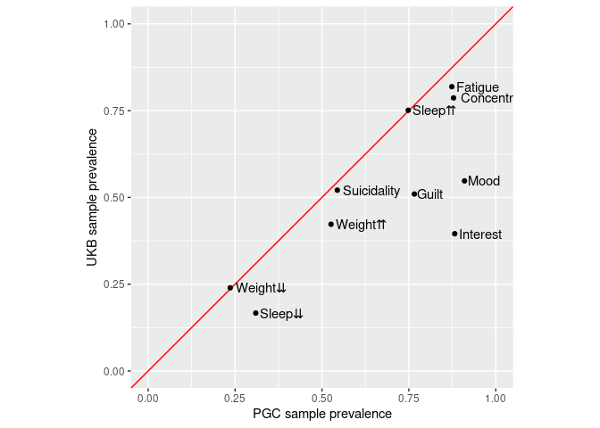
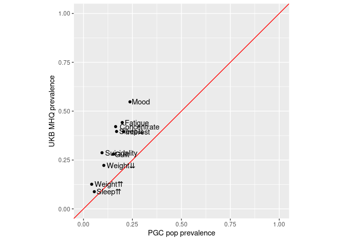
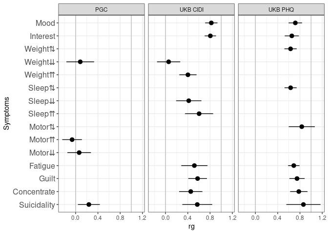
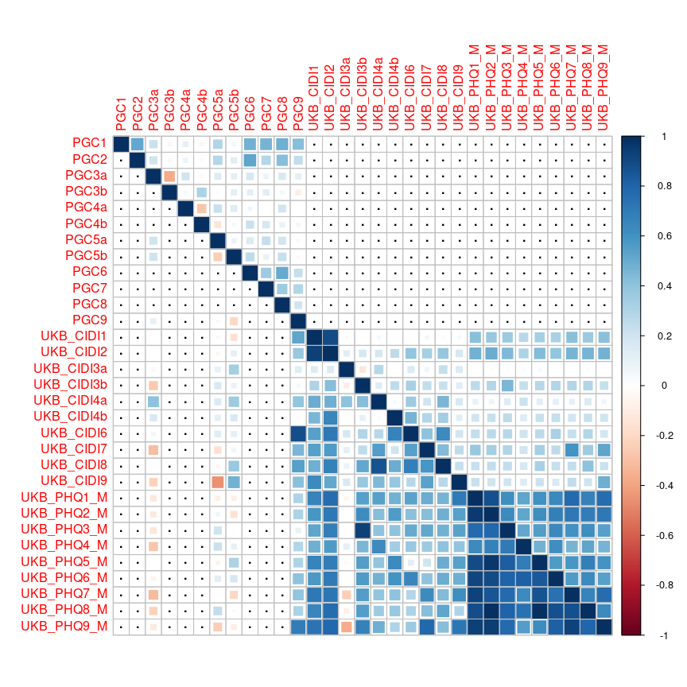
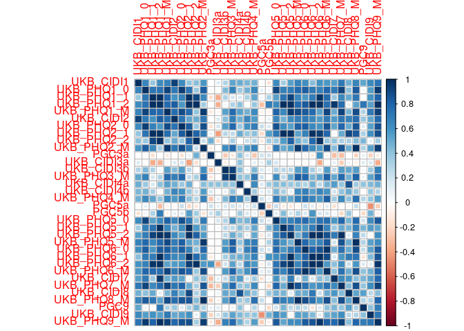
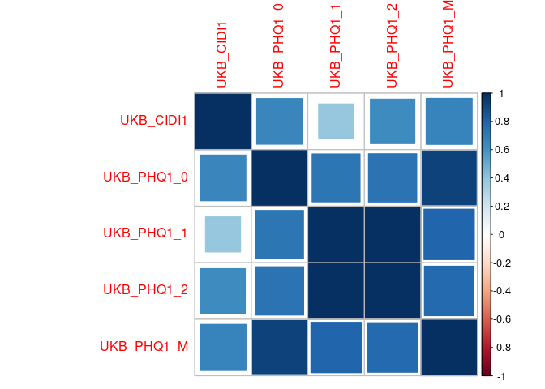
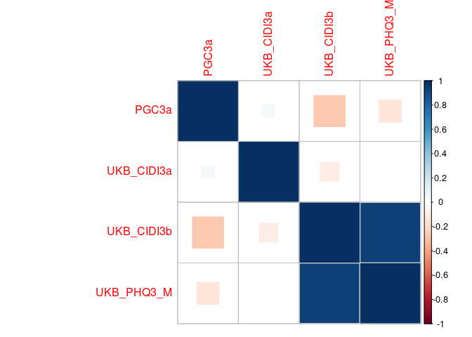
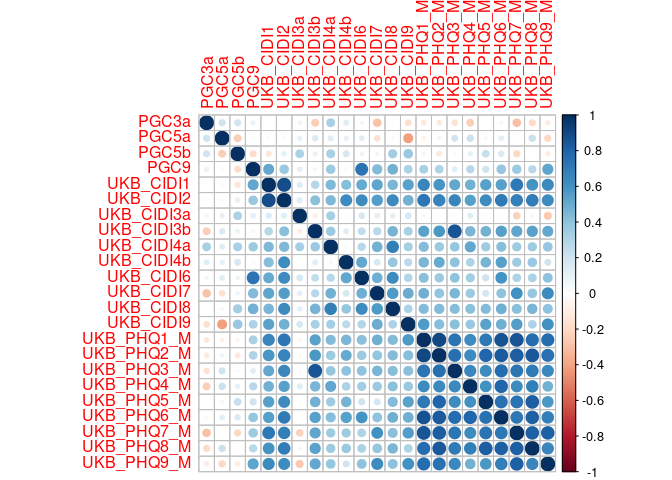
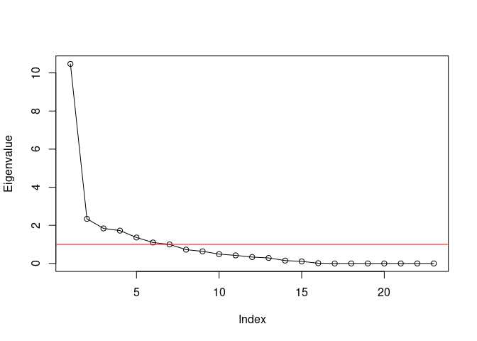
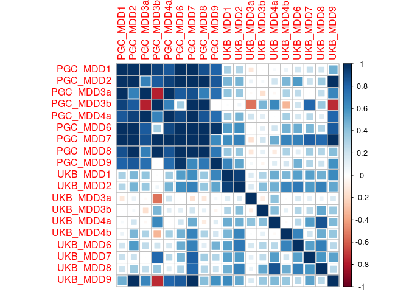

# Setup

## R packages

R version


```r
R.version
```

```
##                _                           
## platform       x86_64-redhat-linux-gnu     
## arch           x86_64                      
## os             linux-gnu                   
## system         x86_64, linux-gnu           
## status                                     
## major          3                           
## minor          6.0                         
## year           2019                        
## month          04                          
## day            26                          
## svn rev        76424                       
## language       R                           
## version.string R version 3.6.0 (2019-04-26)
## nickname       Planting of a Tree
```

Package installation


```r
required_packages <- c('devtools', 'readr', 'tidyr', 'dplyr', 'ggplot2', 'stringr', 'corrplot')
for(pack in required_packages) if(!require(pack, character.only=TRUE)) install.packages(pack)

library(devtools)

if(!require(GenomicSEM)) install_github("MichelNivard/GenomicSEM")

if(!require(DiagrammeR)) install_github('rich-iannone/DiagrammeR')
```

GenomicSEM version

```r
require(readr)
require(tidyr)
require(stringr)
require(dplyr)
require(ggplot2)
require(corrplot)
require(DiagrammeR)
require(GenomicSEM)

packageVersion("GenomicSEM")
```

```
## [1] '0.0.2'
```

## LD Score files

The LDSC support files first need to be downloaded and unpacked


```bash
# LD Score reference files
mkdir -p sumstats/reference
curl https://data.broadinstitute.org/alkesgroup/LDSCORE/eur_w_ld_chr.tar.bz2 > sumstats/reference/eur_w_ld_chr.tar.bz2
curl https://data.broadinstitute.org/alkesgroup/LDSCORE/w_hm3.snplist.bz2 > sumstats/reference/w_hm3.snplist.bz2

tar -xjf sumstats/reference/eur_w_ld_chr.tar.bz2 -C sumstats/reference
rm sumstats/reference/eur_w_ld_chr.tar.bz2
bunzip2 sumstats/reference/w_hm3.snplist.bz2
```

# Symptom labels

MDD DSM symptoms are numbered 1-9:


```r
# plot labels

dsm_mdd_symptoms_labels <-
read_delim("
MDD1;Mood;Mood
MDD2;Interest;Interest
MDD3;Weight⇅;Weight⇆
MDD3a;Weight⇊;Weight⇇
MDD3b;Weight⇈;Weight⇉
MDD4;Sleep⇅;Sleep⇆
MDD4a;Sleep⇊;Sleep⇇
MDD4b;Sleep⇈;Sleep⇉
MDD5;Motor⇅;Motor⇆
MDD5a;Motor⇈;Motor⇉
MDD5b;Motor⇊;Motor⇇
MDD6;Fatigue;Fatigue
MDD7;Guilt;Guilt
MDD8;Concentrate;Concentrate
MDD9;Suicidality;Suicidality
", col_names=c('ref', 'h', 'v'), delim=';')

dsm_mdd_symptoms_reference <-
read_delim("
MDD1;Depressed mood most of the day, nearly every day
MDD2;Markedly diminished interest or pleasure in all, or almost all, activities most of the day, nearly every day
MDD3;Significant change in weight or appetite
MDD3a;Significant weight loss or decrease in appetite
MDD3b;Significant weight gain or increase in appetite
MDD4;Sleeping too much or not sleeping enough
MDD4a;Insomnia nearly every day
MDD4b;Hypersomnia nearly every day
MDD5;Changes in speed/amount of moving or speaking
MDD5a;Psychomotor agitation nearly every day
MDD5b;Psychomotor retardation nearly every day
MDD6;Fatigue or loss of energy nearly every day
MDD7;Feelings of worthlessness or excessive or inappropriate guilt
MDD8;Diminished ability to think or concentrate, or indecisiveness
MDD9;Recurrent thoughts of death or suicide or a suicide attempt or a specific plan for attempting suicide
", col_names=c('Reference', 'Description'), delim=';')

dsm_mdd_symptoms_reference %>%
left_join(dsm_mdd_symptoms_labels, by=c('Reference'='ref')) %>%
select(Reference, Label=h, Description)
```

<div class="kable-table">

Reference   Label         Description                                                                                                  
----------  ------------  -------------------------------------------------------------------------------------------------------------
MDD1        Mood          Depressed mood most of the day, nearly every day                                                             
MDD2        Interest      Markedly diminished interest or pleasure in all, or almost all, activities most of the day, nearly every day 
MDD3        Weight⇅       Significant change in weight or appetite                                                                     
MDD3a       Weight⇊       Significant weight loss or decrease in appetite                                                              
MDD3b       Weight⇈       Significant weight gain or increase in appetite                                                              
MDD4        Sleep⇅        Sleeping too much or not sleeping enough                                                                     
MDD4a       Sleep⇊        Insomnia nearly every day                                                                                    
MDD4b       Sleep⇈        Hypersomnia nearly every day                                                                                 
MDD5        Motor⇅        Changes in speed/amount of moving or speaking                                                                
MDD5a       Motor⇈        Psychomotor agitation nearly every day                                                                       
MDD5b       Motor⇊        Psychomotor retardation nearly every day                                                                     
MDD6        Fatigue       Fatigue or loss of energy nearly every day                                                                   
MDD7        Guilt         Feelings of worthlessness or excessive or inappropriate guilt                                                
MDD8        Concentrate   Diminished ability to think or concentrate, or indecisiveness                                                
MDD9        Suicidality   Recurrent thoughts of death or suicide or a suicide attempt or a specific plan for attempting suicide        

</div>


# Sumstats munging

## PGC

PGC sumstats are output in the Ricopoli [daner](https://docs.google.com/document/d/1TWIhr8-qpCXB13WCXcU1_HDio8lC_MeWoAg2jlggrtU/edit) ("**D**osage **An**alyz**er**) format. These can be munged with `munge_sumstats.py` from the [ldsc](https://github.com/bulik/ldsc) program. We find all daner files in the PGC directory and loop them through the munge step.


```bash
# Munge sumstats for all cohorts symptom GWASs

for sumstats in $(ls sumstats/PGC/CasesAllCohorts/daner_MDD*.meta.gz); do

        prefix=$(basename $sumstats .gz)

        munge_sumstats.py --daner-n \
        --sumstats $sumstats \
        --merge-alleles sumstats/reference/w_hm3.snplist \
        --out sumstats/PGC/CasesAllCohorts/${prefix}.ldsc

done

```

## UKB

### CIDI

UKB CIDI sumstats are in a format easily digestible by `munge_sumstats.py`.


```bash

# Munge sumstats for UKB CIDI

for sumstats in $(ls sumstats/UKB/CIDI/UKB_CIDI_MDD*.gz); do

        prefix=$(basename $sumstats .gz)

        munge_sumstats.py \
        --sumstats $sumstats \
        --N-cas-col Nca \
        --N-con-col Nco \
        --signed-sumstats OR,1 \
        --p P \
        --merge-alleles sumstats/reference/w_hm3.snplist \
        --out sumstats/UKB/CIDI/${prefix}.ldsc

done

```

### PHQ

The PHQ9 and PHQ-like items were assessed at 4 timepoints: 0 = initial assessment, 1 = repeate assessment, 2 = imaging assessment, M = Mental Health Questionnaire online followup


```bash

for sumstats in $(ls sumstats/UKB/PHQ/UKB_PHQ_MDD*.gz); do

        prefix=$(basename $sumstats .gz)

        munge_sumstats.py \
        --sumstats $sumstats \
        --a1 a_1 \
        --a2 a_0 \
        --signed-sumstats beta,0 \
        --N-col N \
        --p p \
        --info info \
        --frq af \
        --snp rsid \
        --merge-alleles sumstats/reference/w_hm3.snplist \
        --out sumstats/UKB/PHQ/${prefix}.ldsc

done

```


# Symptom prevalences

Running [multivariable LDSC](https://github.com/MichelNivard/GenomicSEM/wiki/3.-Models-without-Individual-SNP-effects) requires knowing the sample prevalences and population prevalences of each symptom. Sample prevalences can be calculated from the GWAS summary statistics output put population prevalences have to be estimated.

## Population prevalences

We include a table of counts of symptom presence and absence for PGC cohorts


```r
pgc_symptom_counts <- read_table2('sumstats/PGC/CasesAllCohorts/pgc_dsm_symptom_counts.txt')

pgc_symptom_counts %>%
  spread(Status, N) %>%
  unite(AbsentPresent, Absent, Present, sep=':') %>%
  mutate(MDD_counts=paste(MDD, '(absent:present)')) %>%
  select(-MDD) %>%
  spread(MDD_counts, AbsentPresent)
```

<div class="kable-table">

Symptom   Case (absent:present)   Control (absent:present) 
--------  ----------------------  -------------------------
MDD1      914:12689               2809:364                 
MDD2      1451:11671              2591:234                 
MDD3a     6370:7060               2742:83                  
MDD3b     9421:2930               2804:21                  
MDD4a     3340:10209              2639:186                 
MDD4b     7859:3440               2793:32                  
MDD5a     5533:5510               2738:87                  
MDD5b     6405:5815               2756:69                  
MDD6      1736:11833              2602:223                 
MDD7      3072:10113              2703:122                 
MDD8      1501:11209              2719:106                 
MDD9      6194:7221               2779:46                  

</div>

```r
pgc_symptom_counts %>% 
spread(Status, N) %>%
mutate(Total=Absent+Present) %>%
filter(MDD == 'Case') %>%
arrange(Total)
```

<div class="kable-table">

MDD    Symptom    Absent   Present   Total
-----  --------  -------  --------  ------
Case   MDD5a        5533      5510   11043
Case   MDD4b        7859      3440   11299
Case   MDD5b        6405      5815   12220
Case   MDD3b        9421      2930   12351
Case   MDD8         1501     11209   12710
Case   MDD2         1451     11671   13122
Case   MDD7         3072     10113   13185
Case   MDD9         6194      7221   13415
Case   MDD3a        6370      7060   13430
Case   MDD4a        3340     10209   13549
Case   MDD6         1736     11833   13569
Case   MDD1          914     12689   13603

</div>

Calculate symptom prevalences separately for cases and controls:


```r
pgc_symptom_prevalences <- 
pgc_symptom_counts %>%
  spread(Status, N) %>%
  mutate(prev=Present / (Present + Absent)) %>%
  select(-Absent, -Present) %>%
  spread(MDD, prev)

pgc_symptom_prevalences %>%
  left_join(dsm_mdd_symptoms_labels, by=c('Symptom'='ref')) %>%
  select(Symptom=h, Case, Control)
```

<div class="kable-table">

Symptom             Case     Control
------------  ----------  ----------
Mood           0.9328089   0.1147179
Interest       0.8894223   0.0828319
Weight⇊        0.5256888   0.0293805
Weight⇈        0.2372278   0.0074336
Sleep⇊         0.7534873   0.0658407
Sleep⇈         0.3044517   0.0113274
Motor⇈         0.4989586   0.0307965
Motor⇊         0.4758592   0.0244248
Fatigue        0.8720613   0.0789381
Guilt          0.7670080   0.0431858
Concentrate    0.8819040   0.0375221
Suicidality    0.5382780   0.0162832

</div>

```r
pgc_symptom_sample_sizes <- 
pgc_symptom_counts %>%
group_by(Symptom) %>%
summarize(Ntotal=sum(N))
```

Estimation of population prevalence based on average case/control estimates depends on the prevalence of MDD (e.g., [15% in high income countries](https://www.annualreviews.org/doi/10.1146/annurev-publhealth-031912-114409))


```r
pgc_symptom_prev_size <- pgc_symptom_prevalences %>% 
  left_join(pgc_symptom_sample_sizes, by='Symptom')

case_control_prev_lm <- 
lm(Case ~ Control, data=pgc_symptom_prev_size, weights=Ntotal)

summary(case_control_prev_lm)
```

```
## 
## Call:
## lm(formula = Case ~ Control, data = pgc_symptom_prev_size, weights = Ntotal)
## 
## Weighted Residuals:
##     Min      1Q  Median      3Q     Max 
## -21.833  -8.900  -2.081   4.932  35.727 
## 
## Coefficients:
##             Estimate Std. Error t value Pr(>|t|)    
## (Intercept)  0.36979    0.06711   5.510 0.000258 ***
## Control      6.00913    1.18889   5.054 0.000496 ***
## ---
## Signif. codes:  0 '***' 0.001 '**' 0.01 '*' 0.05 '.' 0.1 ' ' 1
## 
## Residual standard error: 16.6 on 10 degrees of freedom
## Multiple R-squared:  0.7187,	Adjusted R-squared:  0.6906 
## F-statistic: 25.55 on 1 and 10 DF,  p-value: 0.000496
```

```r
ggplot(pgc_symptom_prev_size %>% left_join(dsm_mdd_symptoms_labels, by=c('Symptom'='ref')), aes(x=Control, y=Case, weight=Ntotal)) +
  geom_point() +
  stat_smooth(method='lm', fullrange=TRUE) +
  geom_text(hjust=-0.1, aes(label=h)) +
  scale_x_continuous('Sympotom prevalence among contols', limits=c(0, 0.15)) +
  scale_y_continuous('Symptom prevalence among cases') +
  coord_cartesian(xlim=c(0, 0.13), ylim=c(0, 1))
```

<!-- -->

Symptoms are are more likely to be present in MDD cases also have higher prevalence in MDD controls. Calculate symptom population prevalences weighted by MDD prevalence: $k_{\mathrm{MDD}N} = k_\mathrm{MDD} * k_{\mathrm{MDD}N,\mathrm{cases}} + (1 - k_\mathrm{MDD}) * k_{\mathrm{MDD}N,\mathrm{controls}}$.


```r
k <- 0.15
pgc_symptoms_pop_prev <- 
pgc_symptom_prevalences %>%
  transmute(Symptom, pop_prev=k*Case + (1-k)*Control)
 
pgc_symptoms_pop_prev %>%
  left_join(dsm_mdd_symptoms_labels, by=c('Symptom'='ref')) %>%
  select(Symptom=h, pop_prev)
```

<div class="kable-table">

Symptom         pop_prev
------------  ----------
Mood           0.2374316
Interest       0.2038204
Weight⇊        0.1038268
Weight⇈        0.0419027
Sleep⇊         0.1689877
Sleep⇈         0.0552961
Motor⇈         0.1010208
Motor⇊         0.0921399
Fatigue        0.1979065
Guilt          0.1517592
Concentrate    0.1641794
Suicidality    0.0945824

</div>

## PGC sample prevalences

Read in headers from PGC daner files. The daner format contains headers for the frequency of the referenec allele in cases (A=Affected) and controls (U=Unaffected) where the column name includes the sample size (`FRQ_A_NNNN`, `FRQ_U_MMMM`)


```r
# list daner files
pgc_daner_meta_gz <- list.files('sumstats/PGC/CasesAllCohorts', pattern='meta.gz', full.names=TRUE)

# pull out which symptom 'x' this is from the filename (daner_MDDx_*)
names(pgc_daner_meta_gz) <- str_extract(pgc_daner_meta_gz, 'MDD[:digit:](a|b)?')

# read in header and pull out 6th and 7th columns
pgc_daner_meta_frq_cols <- 
bind_rows(
lapply(pgc_daner_meta_gz, function(daner) {
        daner_header <-read.table(daner, nrows=1, stringsAsFactors=F)
        return(data.frame(frq_a_col=daner_header$V6, frq_u_col=daner_header$V7))
}), .id='Symptom')

# shape and unshape and extract N from column names
pgc_symptoms_sample_prev <-
pgc_daner_meta_frq_cols %>%
gather(key='col', value='frq', frq_a_col:frq_u_col) %>%
select(-col) %>%
separate(frq, into=c('frq', 'status', 'Count')) %>%
mutate(presence=recode(status, 'A'='Present', 'U'='Absent'),
       N=as.integer(Count)) %>%
select(-frq, -status, -Count) %>%
spread(presence, N) %>%
mutate(samp_prev=Present / (Present + Absent))

pgc_symptoms_sample_prev %>%
  left_join(dsm_mdd_symptoms_labels, by=c('Symptom'='ref')) %>%
  select(Symptom=h, Absent, Present, `Sample prevalence`=samp_prev)
```

<div class="kable-table">

Symptom        Absent   Present   Sample prevalence
------------  -------  --------  ------------------
Mood             1152     11669           0.9101474
Interest         1456     10887           0.8820384
Weight⇊          5873      6520           0.5261034
Weight⇈          8688      2684           0.2360183
Sleep⇊           3141      9332           0.7481761
Sleep⇈           7163      3210           0.3094572
Motor⇈           5032      5072           0.5019794
Motor⇊           5911      5295           0.4725147
Fatigue          1579     10913           0.8735991
Guilt            2862      9363           0.7658896
Concentrate      1421     10281           0.8785678
Suicidality      5631      6721           0.5441224

</div>

## UKB CIDI sample prevalences

Symptom prevalences in the UKB CIDI assessment were calculated for the present/absent reponses and in reference to the whole MHQ sample (assuming particpants who were screened out do not have any symptoms)


```r
# read this in as a table.
# TODO: incorporate the code for this, but need to pull in code
# from a separate repository

ukb_cidi_prevalences <- read_tsv('sumstats/UKB/CIDI/ukb_cidi_symptoms_prev.txt')
```


```r
pgc_ukb_symptoms_prev <- 
pgc_symptoms_sample_prev %>%
full_join(pgc_symptoms_pop_prev, by='Symptom') %>%
full_join(ukb_cidi_prevalences, by=c('Symptom'='reference')) %>%
left_join(dsm_mdd_symptoms_labels, by=c('Symptom'='ref'))

ggplot(pgc_ukb_symptoms_prev, aes(x=samp_prev, y=cidi_sample)) +
geom_abline(col='red') +
geom_point() +
geom_text(aes(label=h), hjust=-0.1) +
scale_x_continuous('PGC sample prevalence', breaks=c(0, 0.25, 0.5, 0.75, 1), limits=c(0, 1)) +
scale_y_continuous('UKB sample prevalence', breaks=c(0, 0.25, 0.5, 0.75, 1), limits=c(0, 1)) +
coord_fixed(clip='off') +
theme_bw() +
theme(plot.margin=unit(c(1, 1, 1, 1), 'cm'))
```

<!-- -->

```r
ggsave('mdd-symptom-gsem_files/pgc_ukb_symptoms_prev.png', width=5.5, height=5.5)

ggplot(pgc_ukb_symptoms_prev, aes(x=pop_prev, y=mhq_sample)) +
geom_abline(col='red') +
geom_point() +
geom_text(aes(label=h), hjust=-0.1) +
scale_x_continuous('PGC pop prevalence', limits=c(0, 1)) +
scale_y_continuous('UKB MHQ prevalence', limits=c(0, 1)) +
coord_fixed() 
```

<!-- -->

Correlation (Spearman's rho) between sample prevalences in UKB CIDI and PGC DSM:


```r
with(pgc_ukb_symptoms_prev, cor.test(samp_prev, cidi_sample, method='spearman', use='pair'))
```

```
## 
## 	Spearman's rank correlation rho
## 
## data:  samp_prev and cidi_sample
## S = 72, p-value = 0.09579
## alternative hypothesis: true rho is not equal to 0
## sample estimates:
##       rho 
## 0.5636364
```


# Multivariable LDSC estimation

We list out the munged sumstats for PGC and UKB and unify them with sample and population prevalences, using the symptom reference from the sumstats filename. We then calculate the multivariable LDSC genomic covariance matrix and write it out as deparsed R code. We use deparsed code instead of R data object serialization (`save()` or `saveRDS()`) so that the data can be inspected with a text editor to check that it does not contain individual-level data before being committed to the version control system. A simple caching strategy is employed to check whether the covariance structure already exists and, if so, to parse it rather than re-running the LD score calculation.


```r
pgc_ukb_covstruct_r <- 'ldsc/pgc_dsm.ukb_cidi.ukb_phq.covstruct.deparse.R'
pgc_ukb_covstruct_rds <- 'ldsc/pgc_dsm.ukb_cidi.ukb_phq.covstruct.rds'

# list sumstats files
pgc_sumstats_gz <- list.files('sumstats/PGC/CasesAllCohorts', pattern='ldsc.sumstats.gz$', full.names=TRUE)

ukb_cidi_sumstats_gz <- list.files('sumstats/UKB/CIDI', pattern='ldsc.sumstats.gz$', full.names=TRUE)

ukb_phq_sumstats_gz <- list.files('sumstats/UKB/PHQ', pattern='ldsc.sumstats.gz$', full.names=TRUE)

# pull out which symptom 'x' this is from the filename (daner_MDDx_*)
names(pgc_sumstats_gz) <- str_extract(pgc_sumstats_gz, 'MDD[:digit:](a|b)?')

names(ukb_cidi_sumstats_gz) <- str_extract(ukb_cidi_sumstats_gz, 'MDD[:digit:](a|b)?')

names(ukb_phq_sumstats_gz) <- str_extract(ukb_phq_sumstats_gz, 'MDD[:digit:]_[:alnum:]')

pgc_sumstats_prevs <- 
tibble(Symptom=names(pgc_sumstats_gz),
       filename=pgc_sumstats_gz,
       study='PGC') %>%
left_join(pgc_ukb_symptoms_prev, by='Symptom') %>%
mutate(trait_name=paste0(study, str_replace(Symptom, 'MDD', ''))) %>%
select(trait_name, filename, samp_prev, pop_prev)

ukb_cidi_sumstats_prevs <- 
tibble(Symptom=names(ukb_cidi_sumstats_gz), 
       filename=ukb_cidi_sumstats_gz,
       study='UKB_CIDI') %>%
left_join(pgc_ukb_symptoms_prev, by='Symptom') %>%
mutate(trait_name=paste0(study, str_replace(Symptom, 'MDD', ''))) %>%
select(trait_name, filename, samp_prev=cidi_sample, pop_prev)

ukb_phq_sumstats_prevs <- tibble(Symptom=names(ukb_phq_sumstats_gz),
       filename=ukb_phq_sumstats_gz,
       study='UKB_PHQ') %>%
mutate(trait_name=paste0(study, str_replace(Symptom, 'MDD', ''))) %>%
select(trait_name, filename)

sumstats_prevs <- bind_rows(pgc_sumstats_prevs, ukb_cidi_sumstats_prevs, ukb_phq_sumstats_prevs)

if(!file.exists(pgc_ukb_covstruct_r)) {


  symptoms_covstruct <- ldsc(traits=sumstats_prevs$filename,
                             sample.prev=sumstats_prevs$samp_prev,
                             population.prev=sumstats_prevs$pop_prev,
                             ld='sumstats/reference/eur_w_ld_chr/',
                             wld='sumstats/reference/eur_w_ld_chr/',
                             trait.names=sumstats_prevs$trait_name)


  dput(symptoms_covstruct, pgc_ukb_covstruct_r, control=c('all', 'digits17'))
  saveRDS(symptoms_covstruct, pgc_ukb_covstruct_rds)
  
  # check for exact match of deparsed object
  identical(dget(pgc_ukb_covstruct_r), symptoms_covstruct)

} else {

  symptoms_covstruct <- dget(pgc_ukb_covstruct_r)

}
```

## Heritabilities

Run LDSC, using sumstats filenames and estimated prevalences to construct command line arguments for `ldsc.py`. Symptoms with negative heritabilities in PGC cohorts are plotted in a separate facet with its own scale.


```r
sumstats_h2 <- plyr::adply(sumstats_prevs, 1, function(x) {
  
  filename <- x$filename
  samp_prev <- x$samp_prev
  pop_prev <- x$pop_prev
  outname <- paste(filename, 'h2', sep='.')
  logfile <- paste(outname, 'log', sep='.')


  if(!file.exists(logfile)) {
  if(!is.na(samp_prev)) {
     ldsc_command <- paste('ldsc.py --h2', filename, '--ref-ld-chr sumstats/reference/eur_w_ld_chr/ --w-ld-chr sumstats/reference/eur_w_ld_chr/ --out', outname, '--samp-prev', samp_prev, '--pop-prev', pop_prev)
  } else {
     ldsc_command <- paste('ldsc.py --h2', filename, '--ref-ld-chr sumstats/reference/eur_w_ld_chr/ --w-ld-chr sumstats/reference/eur_w_ld_chr/ --out', outname)
  }
  system(ldsc_command)
  }

  h2_log <- read.table(logfile, sep='\t', stringsAsFactors=F)

  h2_row <- h2_log$V1[str_detect(h2_log$V1, 'h2:')]

  h2_est_str <- str_extract_all(str_split(h2_row, ':')[[1]][2], '[0-9.\\-]+')[[1]]

  h2 <- as.numeric(h2_est_str[1])
  se <- as.numeric(h2_est_str[2])

  return(data.frame(h2, se))

})
```


```r
sumstats_h2_labels <-
as_tibble(sumstats_h2) %>%
mutate(ref=paste0('MDD', str_extract(trait_name, '[:digit:](a|b)?')),
       study=str_replace(str_extract(trait_name, '[A-Z_]+'), '_', ' '),
       sub_study=str_extract(trait_name, '_[012M]$')) %>%
# split negative estimates into their own facet
mutate(study_est=case_when(study == 'PGC' & h2 > 0 ~ 'PGC (+)',
                           study == 'PGC' & h2 <= 0 ~ 'PGC (-)',
                           TRUE ~ study)) %>%
filter(is.na(sub_study) | sub_study == '_M') %>%
left_join(dsm_mdd_symptoms_labels, by='ref') %>%
mutate(a=1) %>%
# insert invisible placeholder estimates so that the positive estimates are
# all plotted on common scale even though the facet has `scale='free'`
bind_rows(tibble(study_est=rep(c('PGC (-)', 'PGC (+)', 'UKB CIDI', 'UKB PHQ'), times=2),
                 h='Mood',
                 a=0,
                 h2=rep(c(0, 0.26), each=4),
                 se=0.0))

ggplot(sumstats_h2_labels, aes(x=h, y=h2, ymin=h2+se*qnorm(0.025), ymax=h2+se*qnorm(0.975))) +
geom_hline(yintercept=0, col='grey') +
geom_pointrange(aes(alpha=a)) + 
facet_grid(cols=vars(study_est), scale='free') +
scale_x_discrete('Symptom', limits=rev(dsm_mdd_symptoms_labels$h)) +
scale_y_continuous(expression(h[SNP]^2)) +
scale_alpha_identity() +
coord_flip() +
theme_bw() + 
theme(axis.text.y=element_text(size=12))
```

<!-- -->

```r
ggsave('mdd-symptom-gsem_files/symptoms_h2_snp.png', width=10, height=4)
```

## Genetic correlation with MDD

Examine how each symptom genetically correlates with MDD case/control status. Positive correlation may suggest the presence of a symptom is a more extreme form of caseness while a negative or zero correlation suggests it is a primary feature of caseness. Use sumstast from PGC cohorts so that phenotype is diagnosed depression. 


```bash
# Munge sumstats for other MDD sumstats

for sumstats in $(ls sumstats/PGC/OtherMDD/daner_*.gz); do

        prefix=$(basename $sumstats .gz)

        munge_sumstats.py --daner-n \
        --sumstats $sumstats \
        --merge-alleles sumstats/reference/w_hm3.snplist \
        --out sumstats/PGC/OtherMDD/${prefix}.ldsc

done

```


```r
other_mdd_gz <- list.files('sumstats/PGC/OtherMDD', pattern='daner_.+sumstats.gz$', full.names=TRUE)

names(other_mdd_gz) <- sapply(str_split(sapply(str_split(other_mdd_gz, '/'), last), '\\.'), first)

other_mdd_rg <-
plyr::adply(other_mdd_gz, 1, function(gz) {
  
  filename_gz <- str_replace(gz, 'ldsc.sumstats.gz', 'gz') 
  outname <- paste(gz, 'rg', sep='.')
  logfile <- paste(outname, 'log', sep='.')


  if(!file.exists(logfile)) {

    # get sample prevalence
    sumstats_gz <- read_tsv(filename_gz, n_max=1)

    # calculate sample prevalences from daner columns
    sumstats_frq <- sumstats_gz %>% select(starts_with('FRQ_A'), starts_with('FRQ_U'))

    frq_a_col <- names(sumstats_frq)[1]
    frq_u_col <- names(sumstats_frq)[2]

    frq_a <- as.numeric(str_extract(frq_a_col, '[:digit:]+'))
    frq_u <- as.numeric(str_extract(frq_u_col, '[:digit:]+'))

    samp_prev <- frq_a / (frq_a + frq_u)

    # string together rg and prevalence arguments, separated by commas
    rg_arg <- paste(c(gz, sumstats_prevs$filename), collapse=',')
    samp_prev_list <- c(samp_prev, sumstats_prevs$samp_prev)
    # use 'nan' for prevalences of quantitative traits 
    samp_prev_arg <- paste(ifelse(is.na(samp_prev_list), yes='nan', no=as.character(samp_prev_list)), collapse=',')
    pop_prev_list <- c(0.15, sumstats_prevs$pop_prev)
    pop_prev_arg <- paste(ifelse(is.na(pop_prev_list), yes='nan', no=as.character(pop_prev_list)), collapse=',')

    ldsc_command <- paste('ldsc.py --rg', rg_arg, '--ref-ld-chr sumstats/reference/eur_w_ld_chr/ --w-ld-chr sumstats/reference/eur_w_ld_chr/ --out', outname, '--samp-prev', samp_prev_arg, '--pop-prev', pop_prev_arg)

    system(ldsc_command)

  }

  rg_log <- read.table(logfile, sep='\t', stringsAsFactors=F)

  start_of_results <- which(str_detect(rg_log[,1], 'Summary of Genetic Correlation Results')) + 1
  end_of_results <- which(str_detect(rg_log[,1], 'Analysis finished at'))-1

  rg_results <- rg_log[start_of_results:end_of_results,1]

  rgs <- read_table2(paste(rg_results, collapse='\n'))

  return(rgs)

})
```


```r
other_mdd_rg_refs <- 
as_tibble(other_mdd_rg) %>%
left_join(sumstats_prevs, by=c('p2'='filename')) %>%
mutate(ref=paste0('MDD', str_extract(trait_name, '[:digit:](a|b)?')),
       study=str_replace(str_extract(trait_name, '[A-Z_]+'), '_', ' '),
       sub_study=str_extract(trait_name, '_[012M]$')) %>%
filter(is.na(sub_study) | sub_study == '_M') %>%
left_join(dsm_mdd_symptoms_labels, by='ref')

ggplot(other_mdd_rg_refs %>% filter(X1 == 'daner_pgc_mdd_meta_no23andMe_noUKBB'),
      aes(x=h, y=rg, ymin=rg+se*qnorm(0.025), ymax=rg+se*qnorm(0.975))) +
geom_hline(yintercept=0, col='grey') +
geom_hline(yintercept=1, col='grey') +
geom_pointrange() +
facet_grid(cols=vars(study)) +
scale_x_discrete('Symptoms', limits=c(rev(dsm_mdd_symptoms_labels$h))) +
coord_flip() +
theme_bw() + 
theme(axis.text.y=element_text(size=12))
```

```
## Warning: Removed 8 rows containing missing values (geom_pointrange).
```

<!-- -->

```r
ggsave('mdd-symptom-gsem_files/symptoms_mdd_rg_snp.png', width=10, height=4)
```

```
## Warning: Removed 8 rows containing missing values (geom_pointrange).
```

## Correlation matrix

Load phenotypic correlations 


```r
ukb_cidi_phq_cor <- dget('sumstats/UKB/ukb_cidi_phq_mixed_cor.deparse.R')

pgc_dsm_cor <- dget('sumstats/PGC/CasesAllCohorts/pgc_cases_tetra_cor.deprase.R')


symptoms_pgc_cidi_phqm <- 
c("PGC1", "PGC2", "PGC3a", "PGC3b", "PGC4a", "PGC4b", "PGC5a", 
"PGC5b", "PGC6", "PGC7", "PGC8", "PGC9", "UKB_CIDI1", "UKB_CIDI2", 
"UKB_CIDI3a", "UKB_CIDI3b", "UKB_CIDI4a", "UKB_CIDI4b", "UKB_CIDI6", 
"UKB_CIDI7", "UKB_CIDI8", "UKB_CIDI9",  "UKB_PHQ1_M", "UKB_PHQ2_M", "UKB_PHQ3_M", 
"UKB_PHQ4_M", "UKB_PHQ5_M",  "UKB_PHQ6_M", "UKB_PHQ7_M", "UKB_PHQ8_M", "UKB_PHQ9_M")

pheno_cor <- matrix(NA, nrow=length(symptoms_pgc_cidi_phqm), ncol=length(symptoms_pgc_cidi_phqm), dimnames=list(symptoms_pgc_cidi_phqm, symptoms_pgc_cidi_phqm))


pheno_cor[13:31,13:31] <- ukb_cidi_phq_cor$rho[c(-3,-6), c(-3, -6)]

pheno_cor[1:12,1:12] <- pgc_dsm_cor$rho
```


```r
symptoms_cor <- cov2cor(symptoms_covstruct$S)
```

```
## Warning in sqrt(1/diag(V)): NaNs produced
```

```
## Warning in cov2cor(symptoms_covstruct$S): diag(.) had 0 or NA entries; non-
## finite result is doubtful
```

```r
symptoms_cor[which(symptoms_cor > 1)] <- 1
rownames(symptoms_cor) <- colnames(symptoms_cor)

symptoms_pgc_cidi_phqm_cor <- symptoms_cor[symptoms_pgc_cidi_phqm,symptoms_pgc_cidi_phqm]

# phenotypic correlations in upper diagonal

symptoms_pgc_cidi_phqm_cor[upper.tri(symptoms_pgc_cidi_phqm_cor)] <- pheno_cor[upper.tri(pheno_cor)]

corrplot(symptoms_pgc_cidi_phqm_cor, 'square', na.label='.')
```

<!-- -->

```r
# output for presentation
dsm_horizontal_labels <- dsm_mdd_symptoms_labels$h
dsm_vertical_labels <- dsm_mdd_symptoms_labels$v
names(dsm_horizontal_labels) <- names(dsm_vertical_labels) <- dsm_mdd_symptoms_labels$ref

symptoms_pgc_cidi_phqm_cor_refs <- paste0('MDD', str_extract(colnames(symptoms_pgc_cidi_phqm_cor), '[:digit:](a|b)?'))

symptoms_pgc_cidi_phqm_cor_present <- symptoms_pgc_cidi_phqm_cor

rownames(symptoms_pgc_cidi_phqm_cor_present) <- dsm_horizontal_labels[symptoms_pgc_cidi_phqm_cor_refs]
colnames(symptoms_pgc_cidi_phqm_cor_present) <- dsm_vertical_labels[symptoms_pgc_cidi_phqm_cor_refs]

png('mdd-symptom-gsem_files/symptoms_pgc_cidi_phqm_cor.png', width=3000, height=3000, pointsize=60)
corrplot(symptoms_pgc_cidi_phqm_cor_present, 'square', na.label='.')
dev.off()
```

```
## png 
##   2
```


```r
c('UKB_CIDI1', 'UKB_PHQ1_M', 'UKB_CIDI2', 'UKB_PHQ2_M',     'PGC3a', 'UKB_CIDI3a', 'UKB_CIDI3b', 'UKB_PHQ3_M', 'UKB_CIDI4a', 'UKB_CIDI4b', 'UKB_PHQ4_M', 'PGC5a', 'PGC5b', 'UKB_PHQ5_M', 'UKB_PHQ6_M', 'UKB_CIDI7', 'UKB_PHQ7_M', 'UKB_CIDI8','UKB_PHQ8_M','UKB_CIDI9', 'UKB_PHQ9_M')                                               
```

```
##  [1] "UKB_CIDI1"  "UKB_PHQ1_M" "UKB_CIDI2"  "UKB_PHQ2_M" "PGC3a"     
##  [6] "UKB_CIDI3a" "UKB_CIDI3b" "UKB_PHQ3_M" "UKB_CIDI4a" "UKB_CIDI4b"
## [11] "UKB_PHQ4_M" "PGC5a"      "PGC5b"      "UKB_PHQ5_M" "UKB_PHQ6_M"
## [16] "UKB_CIDI7"  "UKB_PHQ7_M" "UKB_CIDI8"  "UKB_PHQ8_M" "UKB_CIDI9" 
## [21] "UKB_PHQ9_M"
```


```r
mdd1 <- c('UKB_CIDI1', 'UKB_PHQ1_0', 'UKB_PHQ1_1', 'UKB_PHQ1_2', 'UKB_PHQ1_M')
mdd2 <- c('UKB_CIDI2', 'UKB_PHQ2_0', 'UKB_PHQ2_1', 'UKB_PHQ2_2', 'UKB_PHQ2_M')
mdd3 <- c('PGC3a', 'UKB_CIDI3a', 'UKB_CIDI3b', 'UKB_PHQ3_M')
mdd4 <- c('UKB_CIDI4a', 'UKB_CIDI4b', 'UKB_PHQ4_M')
mdd5 <- c('PGC5a', 'PGC5b', 'UKB_PHQ5_0', 'UKB_PHQ5_1', 'UKB_PHQ5_2', 'UKB_PHQ5_M')
mdd6 <- c('UKB_PHQ6_0', 'UKB_PHQ6_1', 'UKB_PHQ6_2', 'UKB_PHQ6_M')
mdd7 <- c('UKB_CIDI7', 'UKB_PHQ7_M')
mdd8 <- c('UKB_CIDI8', 'UKB_PHQ8_M')
mdd9 <- c('PGC9', 'UKB_CIDI9', 'UKB_PHQ9_M')

corrplot(symptoms_cor[c(mdd1, mdd2, mdd3, mdd4, mdd5, mdd6, mdd7, mdd8, mdd9),
                      c(mdd1, mdd2, mdd3, mdd4, mdd5, mdd6, mdd7, mdd8, mdd9)],
                      'square')
```

<!-- -->

```r
corrplot(symptoms_cor[mdd1,mdd1], 'square')
```

<!-- -->

```r
corrplot(symptoms_cor[mdd3,mdd3], 'square')
```

<!-- -->

# Structural models


```r
trait_symptom_labels <- 
tibble(trait=colnames(symptoms_covstruct$S)) %>%
mutate(symptom_ref=str_extract(trait, '[:digit:][ab]?'),
      study=str_extract(trait, '[A-Z_]+')) %>%
mutate(ref=paste0('MDD', symptom_ref)) %>%
left_join(dsm_mdd_symptoms_labels, by='ref') %>%
mutate(color=recode(study, PGC='#7570b3', UKB_CIDI='#1b9e77', UKB_PHQ='#d95f02'))

node_labels <- c(trait_symptom_labels$h, paste0('A', 1:3), 'S1')
names(node_labels) <- c(trait_symptom_labels$trait, paste0('A', 1:3), 'S1')

node_colors <- c(trait_symptom_labels$color, rep('white', times=3), 'grey')
names(node_colors) <- c(trait_symptom_labels$trait, paste0('A', 1:3), 'S1')

edge_dir <- c('forward', 'back', 'both')
names(edge_dir) <- c('=~', '~', '~~')
```


## PGC

### Common factor

Common factor model


```r
pgc_commonfactor.model <- "
F_PGC =~ NA*PGC3a + PGC5a + PGC5b + PGC9
F_PGC ~~ 1*F_PGC
"

pgc_commonfactor.fit <- usermodel(symptoms_covstruct, estimation='DWLS', model=pgc_commonfactor.model)
```

```
## [1] "Running primary model"
```

```
## Warning in if (class(bread2$value) != "matrix") {: the condition has length
## > 1 and only the first element will be used
```

```
## [1] "Error: The primary model did not converge! Additional warnings or errors are likely being printed by lavaan. \n            The model output is also printed below (without standard errors) in case this is helpful for troubleshooting. Please note\n            that these results should not be interpreted."
##      lhs op   rhs Unstandardized_Estimate
## 1  F_PGC =~ PGC3a            2.439406e-03
## 2  F_PGC =~ PGC5a            1.050354e+01
## 3  F_PGC =~ PGC5b           -3.354751e-03
## 4  F_PGC =~  PGC9            4.361013e-04
## 24 PGC3a ~~ PGC3a            9.562556e-02
## 25 PGC5a ~~ PGC5a           -1.101598e+02
## 26 PGC5b ~~ PGC5b            1.272708e-01
## 27  PGC9 ~~  PGC9            1.200222e-01
```

```
## Warning in if (class(bread2$value) == "matrix") {: the condition has length
## > 1 and only the first element will be used
```

```
## Warning in if (class(bread2$value) == "matrix" & check == 2) {: the
## condition has length > 1 and only the first element will be used
```


```r
pgc_commonfactor_constr.model <- "
A1 =~ NA*PGC3a + PGC5a + PGC9
A1 ~~ 1*A1
"
pgc_commonfactor_constr.fit <- usermodel(symptoms_covstruct, estimation='DWLS', model=pgc_commonfactor_constr.model)
```

```
## [1] "Running primary model"
## [1] "Calculating model chi-square"
## [1] "Calculating CFI"
## [1] "Calculating Standardized Results"
## [1] "Calculating SRMR"
## elapsed 
##   0.657
```

```r
pgc_commonfactor_constr.fit$modelfit
```

<div class="kable-table">

     chisq    df  p_chisq   AIC    CFI   SRMR
---  ------  ---  --------  ----  ----  -----
df   NA        0  NA        NA       1      0

</div>

```r
pgc_commonfactor_constr.fit$results[c(1, 2, 3, 6, 7)]
```

<div class="kable-table">

lhs     op   rhs      STD_Genotype  STD_Genotype_SE   
------  ---  ------  -------------  ------------------
A1      =~   PGC3a       0.8178062  3.31868323673634  
A1      =~   PGC5a       0.2498389  1.04289399886056  
A1      =~   PGC9        0.1300049  0.575322423772372 
A1      ~~   A1          1.0000000                    
PGC3a   ~~   PGC3a       0.3311929  5.43124953771812  
PGC5a   ~~   PGC5a       0.9375805  0.579010344657521 
PGC9    ~~   PGC9        0.9830987  0.390501757325279 

</div>

```r
fit_graph <- function(results, ...) {

  results_sort <- results %>% arrange(lhs, rhs)

  node_names <- unique(c(results_sort$lhs, results_sort$rhs))
  
  node_idx <- seq_along(node_names)
  names(node_idx) <- node_names
  
  graph <- create_graph(
    nodes_df=create_node_df(n=length(node_names),
                            label=node_labels[node_names], 
                            shape='oval', width=1,
                            fillcolor=node_colors[node_names],
                            fontcolor='black'),
    edges_df=create_edge_df(from=node_idx[results_sort$lhs],
                            to=node_idx[results_sort$rhs],
                            label=round(results_sort$STD_Genotype, 2),
                            penwidth=abs(3*results_sort$STD_Genotype),
                            dir=edge_dir[results_sort$op]),
    attr_theme="tb")
  
  return(graph)

}

render_fit <- function(results) render_graph(fit_graph(results))

render_fit(pgc_commonfactor_constr.fit$results)
```

<!--html_preserve--><div id="htmlwidget-de11100a2a317ff69878" style="width:672px;height:480px;" class="grViz html-widget"></div>
<script type="application/json" data-for="htmlwidget-de11100a2a317ff69878">{"x":{"diagram":"digraph {\n\ngraph [layout = \"dot\",\n       rankdir = \"TB\",\n       outputorder = \"edgesfirst\",\n       bgcolor = \"white\"]\n\nnode [fontname = \"Helvetica\",\n      fontsize = \"10\",\n      shape = \"circle\",\n      fixedsize = \"true\",\n      width = \"0.5\",\n      style = \"filled\",\n      fillcolor = \"aliceblue\",\n      color = \"gray70\",\n      fontcolor = \"gray50\"]\n\nedge [fontname = \"Helvetica\",\n     fontsize = \"8\",\n     len = \"1.5\",\n     color = \"gray80\",\n     arrowsize = \"0.5\"]\n\n  \"1\" [label = \"A1\", shape = \"oval\", width = \"1\", fontcolor = \"black\", fillcolor = \"#FFFFFF\"] \n  \"2\" [label = \"Weight⇊\", shape = \"oval\", width = \"1\", fontcolor = \"black\", fillcolor = \"#7570b3\"] \n  \"3\" [label = \"Motor⇈\", shape = \"oval\", width = \"1\", fontcolor = \"black\", fillcolor = \"#7570b3\"] \n  \"4\" [label = \"Suicidality\", shape = \"oval\", width = \"1\", fontcolor = \"black\", fillcolor = \"#7570b3\"] \n\"1\"->\"1\" [label = \"1\", penwidth = \"3\", dir = \"both\"] \n\"1\"->\"2\" [label = \"0.82\", penwidth = \"2.45341874946995\", dir = \"forward\"] \n\"1\"->\"3\" [label = \"0.25\", penwidth = \"0.749516591454706\", dir = \"forward\"] \n\"1\"->\"4\" [label = \"0.13\", penwidth = \"0.390014569360628\", dir = \"forward\"] \n\"2\"->\"2\" [label = \"0.33\", penwidth = \"0.993578803453168\", dir = \"both\"] \n\"3\"->\"3\" [label = \"0.94\", penwidth = \"2.81274163173063\", dir = \"both\"] \n\"4\"->\"4\" [label = \"0.98\", penwidth = \"2.94929620878518\", dir = \"both\"] \n}","config":{"engine":"dot","options":null}},"evals":[],"jsHooks":[]}</script><!--/html_preserve-->

```r
pgc_commonfactor_constr.gv <- generate_dot(fit_graph(pgc_commonfactor_constr.fit$results))

# output as a GraphViz dot file. Replace single quotes with double quotes 
# as that's what the command line utility expects
cat(str_replace_all(pgc_commonfactor_constr.gv, "'", '"'), file='mdd-symptom-gsem_files/pgc_commonfactor_constr.gv')
```


## UKB CIDI

### Common factor

Common factor model. Remove common variance shared between the gating items (Mood: `UKB_CIDI1`, Interest: `UKB_CIDI2`) that is uncorrelated with the common factor variance, to recover the genetic structure among gated items.


```r
ukb_cidi_commonfactor.model <- "
A1 =~ NA*UKB_CIDI1 + UKB_CIDI2 + UKB_CIDI3a + UKB_CIDI3b + UKB_CIDI4a + UKB_CIDI4b + UKB_CIDI6 + UKB_CIDI7 + UKB_CIDI8 + UKB_CIDI9
S1 =~ sc1*UKB_CIDI1 + sc1*UKB_CIDI2
A1 ~~ 1*A1
A1 ~~ 0*S1
c2 > 0.001
UKB_CIDI2 ~~ c2*UKB_CIDI2
"
ukb_cidi_commonfactor.fit <- usermodel(symptoms_covstruct, estimation='DWLS', model=ukb_cidi_commonfactor.model)
```

```
## [1] "Running primary model"
## [1] "Calculating model chi-square"
## [1] "Calculating CFI"
## [1] "Calculating Standardized Results"
## [1] "Calculating SRMR"
## elapsed 
##   3.885 
## [1] "The S matrix was smoothed prior to model estimation due to a non-positive definite matrix. The largest\n                  difference in a cell between the smoothed and non-smoothed matrix was 0.00210653588796324"
## [1] "Please note that when equality constraints are used in the current version of Genomic SEM that\n            the standardized output will also impose the same constraint."
```

```r
ukb_cidi_commonfactor.fit$modelfit
```

<div class="kable-table">

         chisq   df    p_chisq        AIC         CFI        SRMR
---  ---------  ---  ---------  ---------  ----------  ----------
df    52.25627   34   0.023487   94.25627   0.9929656   0.1164807

</div>

```r
ukb_cidi_commonfactor.fit$results[c(1, 2, 3, 6, 7)]
```

<div class="kable-table">

lhs          op   rhs           STD_Genotype  STD_Genotype_SE    
-----------  ---  -----------  -------------  -------------------
A1           =~   UKB_CIDI1        0.7578601  0.0900993615212484 
A1           =~   UKB_CIDI9        0.6444958  0.116093206766738  
A1           =~   UKB_CIDI2        0.8665722  0.0740657168508157 
A1           =~   UKB_CIDI3a       0.1780675  0.105871822239598  
A1           =~   UKB_CIDI3b       0.4565478  0.0897167947174869 
A1           =~   UKB_CIDI4a       0.6196343  0.110722978889933  
A1           =~   UKB_CIDI4b       0.5732473  0.118233776041022  
A1           =~   UKB_CIDI6        0.7645569  0.108683000810272  
A1           =~   UKB_CIDI7        0.6806983  0.0826291233660147 
A1           =~   UKB_CIDI8        0.7649294  0.102296360749648  
A1           ~~   A1               1.0000000                     
S1           =~   UKB_CIDI1        1.0000000                     
S1           =~   UKB_CIDI2        1.0000000                     
S1           ~~   S1               0.2584080  0.116839720531971  
UKB_CIDI1    ~~   UKB_CIDI1        0.1672399  0.0664373923799151 
UKB_CIDI9    ~~   UKB_CIDI9        0.5846202  0.25673461256609   
UKB_CIDI2    ~~   UKB_CIDI2        0.0010004  0.0568436023031496 
UKB_CIDI3a   ~~   UKB_CIDI3a       0.9682917  0.288329459120184  
UKB_CIDI3b   ~~   UKB_CIDI3b       0.7915644  0.158567790326609  
UKB_CIDI4a   ~~   UKB_CIDI4a       0.6160443  0.306731708712364  
UKB_CIDI4b   ~~   UKB_CIDI4b       0.6713893  0.263639481017155  
UKB_CIDI6    ~~   UKB_CIDI6        0.4154544  0.345583876649429  
UKB_CIDI7    ~~   UKB_CIDI7        0.5366493  0.155074942179858  
UKB_CIDI8    ~~   UKB_CIDI8        0.4148819  0.213015542843444  

</div>

```r
render_fit(ukb_cidi_commonfactor.fit$results)
```

<!--html_preserve--><div id="htmlwidget-32e3e5096c094af99708" style="width:672px;height:480px;" class="grViz html-widget"></div>
<script type="application/json" data-for="htmlwidget-32e3e5096c094af99708">{"x":{"diagram":"digraph {\n\ngraph [layout = \"dot\",\n       rankdir = \"TB\",\n       outputorder = \"edgesfirst\",\n       bgcolor = \"white\"]\n\nnode [fontname = \"Helvetica\",\n      fontsize = \"10\",\n      shape = \"circle\",\n      fixedsize = \"true\",\n      width = \"0.5\",\n      style = \"filled\",\n      fillcolor = \"aliceblue\",\n      color = \"gray70\",\n      fontcolor = \"gray50\"]\n\nedge [fontname = \"Helvetica\",\n     fontsize = \"8\",\n     len = \"1.5\",\n     color = \"gray80\",\n     arrowsize = \"0.5\"]\n\n  \"1\" [label = \"A1\", shape = \"oval\", width = \"1\", fontcolor = \"black\", fillcolor = \"#FFFFFF\"] \n  \"2\" [label = \"S1\", shape = \"oval\", width = \"1\", fontcolor = \"black\", fillcolor = \"#C0C0C0\"] \n  \"3\" [label = \"Mood\", shape = \"oval\", width = \"1\", fontcolor = \"black\", fillcolor = \"#1b9e77\"] \n  \"4\" [label = \"Interest\", shape = \"oval\", width = \"1\", fontcolor = \"black\", fillcolor = \"#1b9e77\"] \n  \"5\" [label = \"Weight⇊\", shape = \"oval\", width = \"1\", fontcolor = \"black\", fillcolor = \"#1b9e77\"] \n  \"6\" [label = \"Weight⇈\", shape = \"oval\", width = \"1\", fontcolor = \"black\", fillcolor = \"#1b9e77\"] \n  \"7\" [label = \"Sleep⇊\", shape = \"oval\", width = \"1\", fontcolor = \"black\", fillcolor = \"#1b9e77\"] \n  \"8\" [label = \"Sleep⇈\", shape = \"oval\", width = \"1\", fontcolor = \"black\", fillcolor = \"#1b9e77\"] \n  \"9\" [label = \"Fatigue\", shape = \"oval\", width = \"1\", fontcolor = \"black\", fillcolor = \"#1b9e77\"] \n  \"10\" [label = \"Guilt\", shape = \"oval\", width = \"1\", fontcolor = \"black\", fillcolor = \"#1b9e77\"] \n  \"11\" [label = \"Concentrate\", shape = \"oval\", width = \"1\", fontcolor = \"black\", fillcolor = \"#1b9e77\"] \n  \"12\" [label = \"Suicidality\", shape = \"oval\", width = \"1\", fontcolor = \"black\", fillcolor = \"#1b9e77\"] \n\"1\"->\"1\" [label = \"1\", penwidth = \"3\", dir = \"both\"] \n\"1\"->\"3\" [label = \"0.76\", penwidth = \"2.27358024598545\", dir = \"forward\"] \n\"1\"->\"4\" [label = \"0.87\", penwidth = \"2.59971665960552\", dir = \"forward\"] \n\"1\"->\"5\" [label = \"0.18\", penwidth = \"0.534202383755795\", dir = \"forward\"] \n\"1\"->\"6\" [label = \"0.46\", penwidth = \"1.36964330970695\", dir = \"forward\"] \n\"1\"->\"7\" [label = \"0.62\", penwidth = \"1.85890299780663\", dir = \"forward\"] \n\"1\"->\"8\" [label = \"0.57\", penwidth = \"1.71974200316354\", dir = \"forward\"] \n\"1\"->\"9\" [label = \"0.76\", penwidth = \"2.29367055937047\", dir = \"forward\"] \n\"1\"->\"10\" [label = \"0.68\", penwidth = \"2.04209482675688\", dir = \"forward\"] \n\"1\"->\"11\" [label = \"0.76\", penwidth = \"2.29478831762078\", dir = \"forward\"] \n\"1\"->\"12\" [label = \"0.64\", penwidth = \"1.93348728662594\", dir = \"forward\"] \n\"2\"->\"2\" [label = \"0.26\", penwidth = \"0.775223925513722\", dir = \"both\"] \n\"2\"->\"3\" [label = \"1\", penwidth = \"3\", dir = \"forward\"] \n\"2\"->\"4\" [label = \"1\", penwidth = \"3\", dir = \"forward\"] \n\"3\"->\"3\" [label = \"0.17\", penwidth = \"0.50171960932473\", dir = \"both\"] \n\"4\"->\"4\" [label = \"0\", penwidth = \"0.0030012026796101\", dir = \"both\"] \n\"5\"->\"5\" [label = \"0.97\", penwidth = \"2.90487503854937\", dir = \"both\"] \n\"6\"->\"6\" [label = \"0.79\", penwidth = \"2.37469310323469\", dir = \"both\"] \n\"7\"->\"7\" [label = \"0.62\", penwidth = \"1.84813294650782\", dir = \"both\"] \n\"8\"->\"8\" [label = \"0.67\", penwidth = \"2.01416792499206\", dir = \"both\"] \n\"9\"->\"9\" [label = \"0.42\", penwidth = \"1.24636328648197\", dir = \"both\"] \n\"10\"->\"10\" [label = \"0.54\", penwidth = \"1.60994795294331\", dir = \"both\"] \n\"11\"->\"11\" [label = \"0.41\", penwidth = \"1.24464555443488\", dir = \"both\"] \n\"12\"->\"12\" [label = \"0.58\", penwidth = \"1.75386051421905\", dir = \"both\"] \n}","config":{"engine":"dot","options":null}},"evals":[],"jsHooks":[]}</script><!--/html_preserve-->

```r
ukb_cidi_commonfactor.gv <- generate_dot(fit_graph(ukb_cidi_commonfactor.fit$results))
cat(str_replace_all(ukb_cidi_commonfactor.gv, "'", '"'), file='mdd-symptom-gsem_files/ukb_cidi_commonfactor.gv')
```

### Kendler Neale model


```r
ukb_cidi_kendler_neale.model <- "
A1 =~ NA*UKB_CIDI7 + UKB_CIDI8 + UKB_CIDI9
A2 =~ NA*UKB_CIDI1 + UKB_CIDI2 + UKB_CIDI7
A3 =~ NA*UKB_CIDI4b + UKB_CIDI6 + UKB_CIDI3b
A1 ~~ 1*A1
A2 ~~ 1*A2
A3 ~~ 1*A3"
ukb_cidi_kendler_neale.fit <- usermodel(symptoms_covstruct, estimation='DWLS', model=ukb_cidi_kendler_neale.model)
```

```
## [1] "Running primary model"
## [1] "The model as initially specified failed to converge. A lower bound of 0 on residual variances has been automatically added to try and troubleshoot this."
## [1] "Calculating model chi-square"
## [1] "Calculating CFI"
## [1] "Calculating Standardized Results"
## [1] "Calculating SRMR"
## elapsed 
##   4.705 
## [1] "The S matrix was smoothed prior to model estimation due to a non-positive definite matrix. The largest\n                  difference in a cell between the smoothed and non-smoothed matrix was 0.00022213202890202"
```

```r
ukb_cidi_kendler_neale.fit$modelfit
```

<div class="kable-table">

         chisq   df     p_chisq        AIC         CFI        SRMR
---  ---------  ---  ----------  ---------  ----------  ----------
df    34.47754   16   0.0046824   74.47754   0.9919566   0.0965179

</div>

```r
ukb_cidi_kendler_neale.fit$results[c(1,2,3,6,7)]
```

<div class="kable-table">

lhs          op   rhs           STD_Genotype  STD_Genotype_SE    
-----------  ---  -----------  -------------  -------------------
A1           =~   UKB_CIDI7        0.8735100  0.880174390828624  
A1           =~   UKB_CIDI8        0.7488516  0.141081729992726  
A1           =~   UKB_CIDI9        0.6509178  0.139382860734067  
A1           ~~   A1               1.0000000                     
A1           ~~   A2               0.8577131  0.148118335037063  
A1           ~~   A3               0.9551833  0.166822183974794  
A2           =~   UKB_CIDI1        0.8937243  0.0567872610556046 
A2           =~   UKB_CIDI2        1.0106957  0.0534145543062442 
A2           =~   UKB_CIDI7       -0.1795812  0.869328853492586  
A2           ~~   A2               1.0000000                     
A2           ~~   A3               0.9158477  0.168730500634498  
A3           =~   UKB_CIDI3b       0.4333132  0.103755361040968  
A3           =~   UKB_CIDI4b       0.6046097  0.146509568076983  
A3           =~   UKB_CIDI6        0.7497038  0.140790105961394  
A3           ~~   A3               1.0000000                     
UKB_CIDI1    ~~   UKB_CIDI1        0.2012565  0.0877538197904724 
UKB_CIDI2    ~~   UKB_CIDI2        0.0010003  0.0828667798701586 
UKB_CIDI3b   ~~   UKB_CIDI3b       0.8122398  0.158187782041239  
UKB_CIDI4b   ~~   UKB_CIDI4b       0.6344479  0.265478959728263  
UKB_CIDI6    ~~   UKB_CIDI6        0.4379447  0.400290959992422  
UKB_CIDI7    ~~   UKB_CIDI7        0.4738226  0.284179325500644  
UKB_CIDI8    ~~   UKB_CIDI8        0.4392225  0.238993564544708  
UKB_CIDI9    ~~   UKB_CIDI9        0.5763049  0.271514616206492  

</div>

```r
#render_fit(ukb_cidi_kendler_neale.fit$results)
# cat(generate_dot(fit_graph(ukb_cidi_kendler_neale.fit$results)))

ukb_cidi_kendler_neale.gv = "digraph {
graph [layout = 'dot',
       outputorder = 'edgesfirst',
       bgcolor = 'white']
node [fontname = 'Helvetica',
      fontsize = '10',
      shape = 'circle',
      fixedsize = 'true',
      width = '0.5',
      style = 'filled',
      fillcolor = 'aliceblue',
      color = 'gray70',
      fontcolor = 'gray50']
edge [fontname = 'Helvetica',
     fontsize = '8',
     len = '1.5',
     color = 'gray80',
     arrowsize = '0.5']
   {rank=same '1' '2' '3'}
   {rank=same '4' '5' '6' '7' '8' '9' '10' '11'}
  '1' [label = 'A1', shape = 'oval', width = '1', fillcolor = 'white', fontcolor = 'black'] 
  '2' [label = 'A2', shape = 'oval', width = '1', fillcolor = 'white', fontcolor = 'black'] 
  '3' [label = 'A3', shape = 'oval', width = '1', fillcolor = 'white', fontcolor = 'black'] 
  '4' [label = 'Mood', shape = 'oval', width = '1', fillcolor = '#1b9e77', fontcolor = 'black'] 
  '5' [label = 'Interest', shape = 'oval', width = '1', fillcolor = '#1b9e77', fontcolor = 'black'] 
  '6' [label = 'Weight⇈', shape = 'oval', width = '1', fillcolor = '#1b9e77', fontcolor = 'black'] 
  '7' [label = 'Sleep⇈', shape = 'oval', width = '1', fillcolor = '#1b9e77', fontcolor = 'black'] 
  '8' [label = 'Fatigue', shape = 'oval', width = '1', fillcolor = '#1b9e77', fontcolor = 'black'] 
  '9' [label = 'Guilt', shape = 'oval', width = '1', fillcolor = '#1b9e77', fontcolor = 'black'] 
  '10' [label = 'Concentrate', shape = 'oval', width = '1', fillcolor = '#1b9e77', fontcolor = 'black'] 
  '11' [label = 'Suicidality', shape = 'oval', width = '1', fillcolor = '#1b9e77', fontcolor = 'black'] 
'1'->'1' [label = '1', penwidth = '3', dir = 'both'] 
'1'->'2' [label = '0.86', penwidth = '2.57313926883652', dir = 'both'] 
'1'->'3' [label = '0.96', penwidth = '2.86555000253985', dir = 'both'] 
'1'->'9' [label = '0.87', penwidth = '2.62053014038791', dir = 'forward'] 
'1'->'10' [label = '0.75', penwidth = '2.24655479397468', dir = 'forward'] 
'1'->'11' [label = '0.65', penwidth = '1.9527533612875', dir = 'forward'] 
'2'->'2' [label = '1', penwidth = '3', dir = 'both'] 
'2'->'3' [label = '0.92', penwidth = '2.7475431120308', dir = 'both'] 
'2'->'4' [label = '0.89', penwidth = '2.6811728629236', dir = 'forward'] 
'2'->'5' [label = '1.01', penwidth = '3.0320871595494', dir = 'forward'] 
'2'->'9' [label = '-0.18', penwidth = '0.53874357120299', dir = 'forward'] 
'3'->'3' [label = '1', penwidth = '3', dir = 'both'] 
'3'->'6' [label = '0.43', penwidth = '1.29993955197882', dir = 'forward'] 
'3'->'7' [label = '0.6', penwidth = '1.81382901038483', dir = 'forward'] 
'3'->'8' [label = '0.75', penwidth = '2.24911126852839', dir = 'forward'] 
'4'->'4' [label = '0.2', penwidth = '0.603769543318233', dir = 'both'] 
'5'->'5' [label = '0', penwidth = '0.00300095489528763', dir = 'both'] 
'6'->'6' [label = '0.81', penwidth = '2.43671933713735', dir = 'both'] 
'7'->'7' [label = '0.63', penwidth = '1.90334363858575', dir = 'both'] 
'8'->'8' [label = '0.44', penwidth = '1.31383408561682', dir = 'both'] 
'9'->'9' [label = '0.47', penwidth = '1.42146789832965', dir = 'both'] 
'10'->'10' [label = '0.44', penwidth = '1.31766748689992', dir = 'both'] 
'11'->'11' [label = '0.58', penwidth = '1.72891475448148', dir = 'both'] 
 }"

grViz(ukb_cidi_kendler_neale.gv)
```

<!--html_preserve--><div id="htmlwidget-d924ac5ea2adf7429b24" style="width:672px;height:480px;" class="grViz html-widget"></div>
<script type="application/json" data-for="htmlwidget-d924ac5ea2adf7429b24">{"x":{"diagram":"digraph {\ngraph [layout = \"dot\",\n       outputorder = \"edgesfirst\",\n       bgcolor = \"white\"]\nnode [fontname = \"Helvetica\",\n      fontsize = \"10\",\n      shape = \"circle\",\n      fixedsize = \"true\",\n      width = \"0.5\",\n      style = \"filled\",\n      fillcolor = \"aliceblue\",\n      color = \"gray70\",\n      fontcolor = \"gray50\"]\nedge [fontname = \"Helvetica\",\n     fontsize = \"8\",\n     len = \"1.5\",\n     color = \"gray80\",\n     arrowsize = \"0.5\"]\n   {rank=same \"1\" \"2\" \"3\"}\n   {rank=same \"4\" \"5\" \"6\" \"7\" \"8\" \"9\" \"10\" \"11\"}\n  \"1\" [label = \"A1\", shape = \"oval\", width = \"1\", fillcolor = \"white\", fontcolor = \"black\"] \n  \"2\" [label = \"A2\", shape = \"oval\", width = \"1\", fillcolor = \"white\", fontcolor = \"black\"] \n  \"3\" [label = \"A3\", shape = \"oval\", width = \"1\", fillcolor = \"white\", fontcolor = \"black\"] \n  \"4\" [label = \"Mood\", shape = \"oval\", width = \"1\", fillcolor = \"#1b9e77\", fontcolor = \"black\"] \n  \"5\" [label = \"Interest\", shape = \"oval\", width = \"1\", fillcolor = \"#1b9e77\", fontcolor = \"black\"] \n  \"6\" [label = \"Weight⇈\", shape = \"oval\", width = \"1\", fillcolor = \"#1b9e77\", fontcolor = \"black\"] \n  \"7\" [label = \"Sleep⇈\", shape = \"oval\", width = \"1\", fillcolor = \"#1b9e77\", fontcolor = \"black\"] \n  \"8\" [label = \"Fatigue\", shape = \"oval\", width = \"1\", fillcolor = \"#1b9e77\", fontcolor = \"black\"] \n  \"9\" [label = \"Guilt\", shape = \"oval\", width = \"1\", fillcolor = \"#1b9e77\", fontcolor = \"black\"] \n  \"10\" [label = \"Concentrate\", shape = \"oval\", width = \"1\", fillcolor = \"#1b9e77\", fontcolor = \"black\"] \n  \"11\" [label = \"Suicidality\", shape = \"oval\", width = \"1\", fillcolor = \"#1b9e77\", fontcolor = \"black\"] \n\"1\"->\"1\" [label = \"1\", penwidth = \"3\", dir = \"both\"] \n\"1\"->\"2\" [label = \"0.86\", penwidth = \"2.57313926883652\", dir = \"both\"] \n\"1\"->\"3\" [label = \"0.96\", penwidth = \"2.86555000253985\", dir = \"both\"] \n\"1\"->\"9\" [label = \"0.87\", penwidth = \"2.62053014038791\", dir = \"forward\"] \n\"1\"->\"10\" [label = \"0.75\", penwidth = \"2.24655479397468\", dir = \"forward\"] \n\"1\"->\"11\" [label = \"0.65\", penwidth = \"1.9527533612875\", dir = \"forward\"] \n\"2\"->\"2\" [label = \"1\", penwidth = \"3\", dir = \"both\"] \n\"2\"->\"3\" [label = \"0.92\", penwidth = \"2.7475431120308\", dir = \"both\"] \n\"2\"->\"4\" [label = \"0.89\", penwidth = \"2.6811728629236\", dir = \"forward\"] \n\"2\"->\"5\" [label = \"1.01\", penwidth = \"3.0320871595494\", dir = \"forward\"] \n\"2\"->\"9\" [label = \"-0.18\", penwidth = \"0.53874357120299\", dir = \"forward\"] \n\"3\"->\"3\" [label = \"1\", penwidth = \"3\", dir = \"both\"] \n\"3\"->\"6\" [label = \"0.43\", penwidth = \"1.29993955197882\", dir = \"forward\"] \n\"3\"->\"7\" [label = \"0.6\", penwidth = \"1.81382901038483\", dir = \"forward\"] \n\"3\"->\"8\" [label = \"0.75\", penwidth = \"2.24911126852839\", dir = \"forward\"] \n\"4\"->\"4\" [label = \"0.2\", penwidth = \"0.603769543318233\", dir = \"both\"] \n\"5\"->\"5\" [label = \"0\", penwidth = \"0.00300095489528763\", dir = \"both\"] \n\"6\"->\"6\" [label = \"0.81\", penwidth = \"2.43671933713735\", dir = \"both\"] \n\"7\"->\"7\" [label = \"0.63\", penwidth = \"1.90334363858575\", dir = \"both\"] \n\"8\"->\"8\" [label = \"0.44\", penwidth = \"1.31383408561682\", dir = \"both\"] \n\"9\"->\"9\" [label = \"0.47\", penwidth = \"1.42146789832965\", dir = \"both\"] \n\"10\"->\"10\" [label = \"0.44\", penwidth = \"1.31766748689992\", dir = \"both\"] \n\"11\"->\"11\" [label = \"0.58\", penwidth = \"1.72891475448148\", dir = \"both\"] \n }","config":{"engine":"dot","options":null}},"evals":[],"jsHooks":[]}</script><!--/html_preserve-->

```r
cat(str_replace_all(ukb_cidi_kendler_neale.gv, "'", '"'), file='mdd-symptom-gsem_files/ukb_cidi_kendler_neale.gv')
```


```r
ukb_cidi_kendler_neale_orth.model <- "
A1 =~ NA*UKB_CIDI7 + UKB_CIDI8 + UKB_CIDI9
A2 =~ NA*UKB_CIDI1 + UKB_CIDI2 + UKB_CIDI7
A3 =~ NA*UKB_CIDI4b + UKB_CIDI6 + UKB_CIDI3b
A1 ~~ 1*A1
A2 ~~ 1*A2
A3 ~~ 1*A3
A1 ~~ 0*A2 + 0*A3
A2 ~~ 0*A3
c6 > 0.001
c7 > 0.001
UKB_CIDI6 ~~ c6*UKB_CIDI6
UKB_CIDI7 ~~ c7*UKB_CIDI7
"
ukb_cidi_kendler_neale_orth.fit <- usermodel(symptoms_covstruct, estimation='DWLS', model=ukb_cidi_kendler_neale_orth.model)
```

```
## [1] "Running primary model"
## [1] "Calculating model chi-square"
## [1] "Calculating CFI"
## [1] "Calculating Standardized Results"
## [1] "Calculating SRMR"
## elapsed 
##   3.261 
## [1] "The S matrix was smoothed prior to model estimation due to a non-positive definite matrix. The largest\n                  difference in a cell between the smoothed and non-smoothed matrix was 0.00022213202890202"
```

```r
ukb_cidi_kendler_neale_orth.fit$modelfit
```

<div class="kable-table">

         chisq   df   p_chisq        AIC         CFI        SRMR
---  ---------  ---  --------  ---------  ----------  ----------
df    247.6764   19         0   281.6764   0.9004559   0.3661284

</div>

```r
ukb_cidi_kendler_neale_orth.fit$results[c(1,2,3,6,7)]
```

<div class="kable-table">

lhs          op   rhs           STD_Genotype  STD_Genotype_SE    
-----------  ---  -----------  -------------  -------------------
A1           =~   UKB_CIDI7        0.8452126  0.248509909627164  
A1           =~   UKB_CIDI8        0.6483455  0.207793386391245  
A1           =~   UKB_CIDI9        0.5699512  0.201367697514899  
A1           ~~   A1               1.0000000                     
A2           =~   UKB_CIDI1        0.9535986  0.0748451770189896 
A2           =~   UKB_CIDI2        0.9736163  0.0669539952644244 
A2           =~   UKB_CIDI7        0.5684532  0.0794489600473408 
A2           ~~   A2               1.0000000                     
A3           =~   UKB_CIDI3b       0.2546259  0.166167664668762  
A3           =~   UKB_CIDI4b       0.6260953  0.383483907075251  
A3           =~   UKB_CIDI6        1.0208174  0.541013077597159  
A3           ~~   A3               1.0000000                     
UKB_CIDI1    ~~   UKB_CIDI1        0.0906503  0.128978426669033  
UKB_CIDI2    ~~   UKB_CIDI2        0.0520716  0.124730073725171  
UKB_CIDI3b   ~~   UKB_CIDI3b       0.9351684  0.162164492651298  
UKB_CIDI4b   ~~   UKB_CIDI4b       0.6079912  0.488043268527906  
UKB_CIDI6    ~~   UKB_CIDI6        0.0010009  1.14661629062681   
UKB_CIDI7    ~~   UKB_CIDI7        0.0010002  0.437712585329919  
UKB_CIDI8    ~~   UKB_CIDI8        0.5796384  0.294142571829342  
UKB_CIDI9    ~~   UKB_CIDI9        0.6751568  0.307981650140958  

</div>

```r
render_fit(ukb_cidi_kendler_neale_orth.fit$results)
```

<!--html_preserve--><div id="htmlwidget-cfc145c7a774413e6719" style="width:672px;height:480px;" class="grViz html-widget"></div>
<script type="application/json" data-for="htmlwidget-cfc145c7a774413e6719">{"x":{"diagram":"digraph {\n\ngraph [layout = \"dot\",\n       rankdir = \"TB\",\n       outputorder = \"edgesfirst\",\n       bgcolor = \"white\"]\n\nnode [fontname = \"Helvetica\",\n      fontsize = \"10\",\n      shape = \"circle\",\n      fixedsize = \"true\",\n      width = \"0.5\",\n      style = \"filled\",\n      fillcolor = \"aliceblue\",\n      color = \"gray70\",\n      fontcolor = \"gray50\"]\n\nedge [fontname = \"Helvetica\",\n     fontsize = \"8\",\n     len = \"1.5\",\n     color = \"gray80\",\n     arrowsize = \"0.5\"]\n\n  \"1\" [label = \"A1\", shape = \"oval\", width = \"1\", fontcolor = \"black\", fillcolor = \"#FFFFFF\"] \n  \"2\" [label = \"A2\", shape = \"oval\", width = \"1\", fontcolor = \"black\", fillcolor = \"#FFFFFF\"] \n  \"3\" [label = \"A3\", shape = \"oval\", width = \"1\", fontcolor = \"black\", fillcolor = \"#FFFFFF\"] \n  \"4\" [label = \"Mood\", shape = \"oval\", width = \"1\", fontcolor = \"black\", fillcolor = \"#1b9e77\"] \n  \"5\" [label = \"Interest\", shape = \"oval\", width = \"1\", fontcolor = \"black\", fillcolor = \"#1b9e77\"] \n  \"6\" [label = \"Weight⇈\", shape = \"oval\", width = \"1\", fontcolor = \"black\", fillcolor = \"#1b9e77\"] \n  \"7\" [label = \"Sleep⇈\", shape = \"oval\", width = \"1\", fontcolor = \"black\", fillcolor = \"#1b9e77\"] \n  \"8\" [label = \"Fatigue\", shape = \"oval\", width = \"1\", fontcolor = \"black\", fillcolor = \"#1b9e77\"] \n  \"9\" [label = \"Guilt\", shape = \"oval\", width = \"1\", fontcolor = \"black\", fillcolor = \"#1b9e77\"] \n  \"10\" [label = \"Concentrate\", shape = \"oval\", width = \"1\", fontcolor = \"black\", fillcolor = \"#1b9e77\"] \n  \"11\" [label = \"Suicidality\", shape = \"oval\", width = \"1\", fontcolor = \"black\", fillcolor = \"#1b9e77\"] \n\"1\"->\"1\" [label = \"1\", penwidth = \"3\", dir = \"both\"] \n\"1\"->\"9\" [label = \"0.85\", penwidth = \"2.53563788781856\", dir = \"forward\"] \n\"1\"->\"10\" [label = \"0.65\", penwidth = \"1.94503644397938\", dir = \"forward\"] \n\"1\"->\"11\" [label = \"0.57\", penwidth = \"1.70985358573493\", dir = \"forward\"] \n\"2\"->\"2\" [label = \"1\", penwidth = \"3\", dir = \"both\"] \n\"2\"->\"4\" [label = \"0.95\", penwidth = \"2.86079578445163\", dir = \"forward\"] \n\"2\"->\"5\" [label = \"0.97\", penwidth = \"2.92084894954738\", dir = \"forward\"] \n\"2\"->\"9\" [label = \"0.57\", penwidth = \"1.70535947365613\", dir = \"forward\"] \n\"3\"->\"3\" [label = \"1\", penwidth = \"3\", dir = \"both\"] \n\"3\"->\"6\" [label = \"0.25\", penwidth = \"0.763877789421455\", dir = \"forward\"] \n\"3\"->\"7\" [label = \"0.63\", penwidth = \"1.87828603424745\", dir = \"forward\"] \n\"3\"->\"8\" [label = \"1.02\", penwidth = \"3.06245211331807\", dir = \"forward\"] \n\"4\"->\"4\" [label = \"0.09\", penwidth = \"0.271950819115332\", dir = \"both\"] \n\"5\"->\"5\" [label = \"0.05\", penwidth = \"0.156214887022649\", dir = \"both\"] \n\"6\"->\"6\" [label = \"0.94\", penwidth = \"2.8055051549425\", dir = \"both\"] \n\"7\"->\"7\" [label = \"0.61\", penwidth = \"1.82397358176609\", dir = \"both\"] \n\"8\"->\"8\" [label = \"0\", penwidth = \"0.00300278495315029\", dir = \"both\"] \n\"9\"->\"9\" [label = \"0\", penwidth = \"0.00300061899314795\", dir = \"both\"] \n\"10\"->\"10\" [label = \"0.58\", penwidth = \"1.7389153079133\", dir = \"both\"] \n\"11\"->\"11\" [label = \"0.68\", penwidth = \"2.02547028350552\", dir = \"both\"] \n}","config":{"engine":"dot","options":null}},"evals":[],"jsHooks":[]}</script><!--/html_preserve-->

```r
ukb_cidi_kendler_neale_orth.gv <- generate_dot(fit_graph(ukb_cidi_kendler_neale_orth.fit$results))
cat(str_replace_all(ukb_cidi_kendler_neale_orth.gv, "'", '"'), file='mdd-symptom-gsem_files/ukb_cidi_kendler_neale_orth.gv')
```


## UKB PHQ

### Common factor (MHQ)

Common factor model at MHQ assessment


```r
ukb_phq_m_commonfactor.model <- "
A1 =~ NA*UKB_PHQ1_M + UKB_PHQ2_M + UKB_PHQ3_M + UKB_PHQ5_M + UKB_PHQ6_M + UKB_PHQ7_M + UKB_PHQ8_M + UKB_PHQ9_M
A1 ~~ 1*A1
"

ukb_phq_m_commonfactor.fit <- usermodel(symptoms_covstruct, estimation='DWLS', model=ukb_phq_m_commonfactor.model)
```

```
## [1] "Running primary model"
## [1] "Calculating model chi-square"
## [1] "Calculating CFI"
## [1] "Calculating Standardized Results"
## [1] "Calculating SRMR"
## elapsed 
##   0.886 
## [1] "The S matrix was smoothed prior to model estimation due to a non-positive definite matrix. The largest\n                  difference in a cell between the smoothed and non-smoothed matrix was 0.00107494949801306"
```

```r
ukb_phq_m_commonfactor.fit$modelfit
```

<div class="kable-table">

         chisq   df     p_chisq        AIC         CFI        SRMR
---  ---------  ---  ----------  ---------  ----------  ----------
df    36.03128   20   0.0152514   68.03128   0.9957031   0.0433932

</div>

```r
ukb_phq_m_commonfactor.fit$results[c(1, 2, 3, 6, 7)]
```

<div class="kable-table">

lhs          op   rhs           STD_Genotype  STD_Genotype_SE    
-----------  ---  -----------  -------------  -------------------
A1           =~   UKB_PHQ1_M       0.9697603  0.057006787982467  
A1           =~   UKB_PHQ2_M       0.9737592  0.054609223322085  
A1           =~   UKB_PHQ3_M       0.8414785  0.0595036926129076 
A1           =~   UKB_PHQ5_M       0.9170546  0.0940149397296949 
A1           =~   UKB_PHQ6_M       0.9078230  0.0515780981418909 
A1           =~   UKB_PHQ7_M       0.8956600  0.0566974330876182 
A1           =~   UKB_PHQ8_M       0.9540304  0.0682940049588863 
A1           =~   UKB_PHQ9_M       0.8724061  0.094062870273096  
A1           ~~   A1               1.0000000                     
UKB_PHQ1_M   ~~   UKB_PHQ1_M       0.0595649  0.0441530236515604 
UKB_PHQ2_M   ~~   UKB_PHQ2_M       0.0517932  0.0437309841388319 
UKB_PHQ3_M   ~~   UKB_PHQ3_M       0.2919139  0.0614476188621677 
UKB_PHQ5_M   ~~   UKB_PHQ5_M       0.1590106  0.1417137595344    
UKB_PHQ6_M   ~~   UKB_PHQ6_M       0.1758577  0.0522221880907813 
UKB_PHQ7_M   ~~   UKB_PHQ7_M       0.1977933  0.0587159130428195 
UKB_PHQ8_M   ~~   UKB_PHQ8_M       0.0898261  0.0760620276738579 
UKB_PHQ9_M   ~~   UKB_PHQ9_M       0.2389079  0.196953967058746  

</div>

```r
render_fit(ukb_phq_m_commonfactor.fit$results)
```

<!--html_preserve--><div id="htmlwidget-f474d6d97ca048d1f26e" style="width:672px;height:480px;" class="grViz html-widget"></div>
<script type="application/json" data-for="htmlwidget-f474d6d97ca048d1f26e">{"x":{"diagram":"digraph {\n\ngraph [layout = \"dot\",\n       rankdir = \"TB\",\n       outputorder = \"edgesfirst\",\n       bgcolor = \"white\"]\n\nnode [fontname = \"Helvetica\",\n      fontsize = \"10\",\n      shape = \"circle\",\n      fixedsize = \"true\",\n      width = \"0.5\",\n      style = \"filled\",\n      fillcolor = \"aliceblue\",\n      color = \"gray70\",\n      fontcolor = \"gray50\"]\n\nedge [fontname = \"Helvetica\",\n     fontsize = \"8\",\n     len = \"1.5\",\n     color = \"gray80\",\n     arrowsize = \"0.5\"]\n\n  \"1\" [label = \"A1\", shape = \"oval\", width = \"1\", fontcolor = \"black\", fillcolor = \"#FFFFFF\"] \n  \"2\" [label = \"Mood\", shape = \"oval\", width = \"1\", fontcolor = \"black\", fillcolor = \"#d95f02\"] \n  \"3\" [label = \"Interest\", shape = \"oval\", width = \"1\", fontcolor = \"black\", fillcolor = \"#d95f02\"] \n  \"4\" [label = \"Weight⇅\", shape = \"oval\", width = \"1\", fontcolor = \"black\", fillcolor = \"#d95f02\"] \n  \"5\" [label = \"Motor⇅\", shape = \"oval\", width = \"1\", fontcolor = \"black\", fillcolor = \"#d95f02\"] \n  \"6\" [label = \"Fatigue\", shape = \"oval\", width = \"1\", fontcolor = \"black\", fillcolor = \"#d95f02\"] \n  \"7\" [label = \"Guilt\", shape = \"oval\", width = \"1\", fontcolor = \"black\", fillcolor = \"#d95f02\"] \n  \"8\" [label = \"Concentrate\", shape = \"oval\", width = \"1\", fontcolor = \"black\", fillcolor = \"#d95f02\"] \n  \"9\" [label = \"Suicidality\", shape = \"oval\", width = \"1\", fontcolor = \"black\", fillcolor = \"#d95f02\"] \n\"1\"->\"1\" [label = \"1\", penwidth = \"3\", dir = \"both\"] \n\"1\"->\"2\" [label = \"0.97\", penwidth = \"2.9092808901666\", dir = \"forward\"] \n\"1\"->\"3\" [label = \"0.97\", penwidth = \"2.92127763375998\", dir = \"forward\"] \n\"1\"->\"4\" [label = \"0.84\", penwidth = \"2.5244354239918\", dir = \"forward\"] \n\"1\"->\"5\" [label = \"0.92\", penwidth = \"2.75116371972891\", dir = \"forward\"] \n\"1\"->\"6\" [label = \"0.91\", penwidth = \"2.72346889876166\", dir = \"forward\"] \n\"1\"->\"7\" [label = \"0.9\", penwidth = \"2.68698010616003\", dir = \"forward\"] \n\"1\"->\"8\" [label = \"0.95\", penwidth = \"2.86209130504019\", dir = \"forward\"] \n\"1\"->\"9\" [label = \"0.87\", penwidth = \"2.61721815953266\", dir = \"forward\"] \n\"2\"->\"2\" [label = \"0.06\", penwidth = \"0.178694779899995\", dir = \"both\"] \n\"3\"->\"3\" [label = \"0.05\", penwidth = \"0.155379735983715\", dir = \"both\"] \n\"4\"->\"4\" [label = \"0.29\", penwidth = \"0.875741621880832\", dir = \"both\"] \n\"5\"->\"5\" [label = \"0.16\", penwidth = \"0.477031753460664\", dir = \"both\"] \n\"6\"->\"6\" [label = \"0.18\", penwidth = \"0.527573117844097\", dir = \"both\"] \n\"7\"->\"7\" [label = \"0.2\", penwidth = \"0.593379767384402\", dir = \"both\"] \n\"8\"->\"8\" [label = \"0.09\", penwidth = \"0.269478266432161\", dir = \"both\"] \n\"9\"->\"9\" [label = \"0.24\", penwidth = \"0.716723610078435\", dir = \"both\"] \n}","config":{"engine":"dot","options":null}},"evals":[],"jsHooks":[]}</script><!--/html_preserve-->

```r
ukb_phq_m_commonfactor.gv <- generate_dot(fit_graph(ukb_phq_m_commonfactor.fit$results))

cat(str_replace_all(ukb_phq_m_commonfactor.gv, "'", '"'), file='mdd-symptom-gsem_files/ukb_phq_m_commonfactor.gv')
```

### Kendler Neale model


```r
ukb_phq_kendler_neale.model <- "
A1 =~ NA*UKB_PHQ5_M + UKB_PHQ7_M + UKB_PHQ8_M + UKB_PHQ9_M
A2 =~ NA*UKB_PHQ1_M + UKB_PHQ2_M + UKB_PHQ7_M
A3 =~ NA*UKB_PHQ4_M + UKB_PHQ6_M + UKB_PHQ3_M
A1 ~~ 1*A1
A2 ~~ 1*A2
A3 ~~ 1*A3"
ukb_phq_kendler_neale.fit <- usermodel(symptoms_covstruct, estimation='DWLS', model=ukb_phq_kendler_neale.model)
```

```
## [1] "Running primary model"
## [1] "The model as initially specified failed to converge. A lower bound of 0 on residual variances has been automatically added to try and troubleshoot this."
## [1] "Error: The primary model produced correlations among your latent variables that are either greater than 1 or less than -1. \n              Consquently, model fit estimates could not be computed and results should likely not be interpreted. Results are provided below \n              to enable troubleshooting. A model constraint that constrains the latent correlations to be above -1 or less than 1 is suggested."
##            lhs op        rhs Unstandardized_Estimate          SE
## 1           A1 =~ UKB_PHQ5_M             0.127575624 0.013629750
## 2           A1 =~ UKB_PHQ7_M            -0.090950375 0.237502507
## 3           A1 =~ UKB_PHQ8_M             0.174806423 0.014134027
## 4           A1 =~ UKB_PHQ9_M             0.101312712 0.011308085
## 5           A2 =~ UKB_PHQ1_M             0.194361529 0.011538895
## 6           A2 =~ UKB_PHQ2_M             0.199639450 0.011303434
## 7           A2 =~ UKB_PHQ7_M             0.267678622 0.241022849
## 8           A3 =~ UKB_PHQ4_M             0.172299134 0.012771888
## 9           A3 =~ UKB_PHQ6_M             0.241319743 0.012573285
## 10          A3 =~ UKB_PHQ3_M             0.200065257 0.013220031
## 113 UKB_PHQ1_M ~~ UKB_PHQ1_M             0.002643438 0.001734217
## 114 UKB_PHQ2_M ~~ UKB_PHQ2_M             0.001605094 0.001956643
## 115 UKB_PHQ3_M ~~ UKB_PHQ3_M             0.010879575 0.003104207
## 116 UKB_PHQ4_M ~~ UKB_PHQ4_M             0.019178914 0.003409095
## 117 UKB_PHQ5_M ~~ UKB_PHQ5_M             0.003516448 0.002786983
## 118 UKB_PHQ6_M ~~ UKB_PHQ6_M             0.003131400 0.003154925
## 119 UKB_PHQ7_M ~~ UKB_PHQ7_M             0.007007541 0.002694794
## 120 UKB_PHQ8_M ~~ UKB_PHQ8_M             0.003418700 0.002758272
## 121 UKB_PHQ9_M ~~ UKB_PHQ9_M             0.004065826 0.002953121
## 167         A1 ~~         A2             1.015258384 0.031720602
## 168         A1 ~~         A3             0.948431586 0.047268240
## 169         A2 ~~         A3             0.906765986 0.028106559
```

```r
ukb_phq_kendler_neale.fit$modelfit
```

```
## NULL
```

```r
ukb_phq_kendler_neale.fit$results[c(1,2,3,6,7)]
```

```
## NULL
```


```r
ukb_phq_kendler_neale_constr.model <- "
A1 =~ NA*UKB_PHQ5_M + UKB_PHQ7_M + UKB_PHQ8_M + UKB_PHQ9_M
A2 =~ NA*UKB_PHQ1_M + UKB_PHQ2_M + UKB_PHQ7_M
A3 =~ NA*UKB_PHQ4_M + UKB_PHQ6_M + UKB_PHQ3_M
A1 ~~ 1*A1
A2 ~~ 1*A2
A3 ~~ 1*A3
ca12 < 1
ca12 > -1
A1 ~~ ca12*A2
c1 > 0.001
UKB_PHQ1_M ~~ c1*UKB_PHQ1_M
c2 > 0.001
UKB_PHQ2_M ~~ c2*UKB_PHQ2_M
c3 > 0.001
UKB_PHQ3_M ~~ c3*UKB_PHQ3_M
c4 > 0.001
UKB_PHQ4_M ~~ c4*UKB_PHQ4_M
c5 > 0.001
UKB_PHQ5_M ~~ c5*UKB_PHQ5_M
c6 > 0.001
UKB_PHQ6_M ~~ c6*UKB_PHQ6_M
c7 > 0.001
UKB_PHQ7_M ~~ c7*UKB_PHQ7_M
c8 > 0.001
UKB_PHQ8_M ~~ c8*UKB_PHQ8_M
c9 > 0.001
UKB_PHQ9_M ~~ c9*UKB_PHQ9_M
"
ukb_phq_kendler_neale_constr.fit <- usermodel(symptoms_covstruct, estimation='DWLS', model=ukb_phq_kendler_neale_constr.model)
```

```
## [1] "Running primary model"
## [1] "Calculating model chi-square"
## [1] "Calculating CFI"
## [1] "Calculating Standardized Results"
```

```
## Warning in lav_object_post_check(object): lavaan WARNING: covariance matrix of latent variables
##                 is not positive definite;
##                 use lavInspect(fit, "cov.lv") to investigate.
```

```
## [1] "Calculating SRMR"
## elapsed 
##  11.535 
## [1] "The S matrix was smoothed prior to model estimation due to a non-positive definite matrix. The largest\n                  difference in a cell between the smoothed and non-smoothed matrix was 0.00110427527212622"
```

```r
ukb_phq_kendler_neale_constr.fit$modelfit
```

<div class="kable-table">

         chisq   df     p_chisq        AIC         CFI        SRMR
---  ---------  ---  ----------  ---------  ----------  ----------
df    54.83104   23   0.0002057   98.83104   0.9928025   0.0421241

</div>

```r
ukb_phq_kendler_neale_constr.fit$results[c(1,2,3,6,7)]
```

<div class="kable-table">

lhs          op   rhs           STD_Genotype  STD_Genotype_SE    
-----------  ---  -----------  -------------  -------------------
A1           =~   UKB_PHQ5_M       0.9162787  0.096253903671435  
A1           =~   UKB_PHQ7_M      -0.8105016  2.34459780085582   
A1           =~   UKB_PHQ8_M       0.9590082  0.0749693461001077 
A1           =~   UKB_PHQ9_M       0.8536930  0.0943355356404081 
A1           ~~   A1               1.0000000                     
A1           ~~   A2               0.9999996  0.0200521729532533 
A1           ~~   A3               0.9383832  0.0450051797430297 
A2           =~   UKB_PHQ1_M       0.9659540  0.0579780836675552 
A2           =~   UKB_PHQ2_M       0.9793057  0.0557167629070285 
A2           =~   UKB_PHQ7_M       1.7253972  2.35559820018406   
A2           ~~   A2               1.0000000                     
A2           ~~   A3               0.9084865  0.029852080941025  
A3           =~   UKB_PHQ3_M       0.8866842  0.0585918004394335 
A3           =~   UKB_PHQ4_M       0.7794272  0.057776586716439  
A3           =~   UKB_PHQ6_M       0.9742011  0.0507439456265393 
A3           ~~   A3               1.0000000                     
UKB_PHQ1_M   ~~   UKB_PHQ1_M       0.0669330  0.0447987484785612 
UKB_PHQ2_M   ~~   UKB_PHQ2_M       0.0409605  0.0456827830537356 
UKB_PHQ3_M   ~~   UKB_PHQ3_M       0.2137911  0.0609748519377269 
UKB_PHQ4_M   ~~   UKB_PHQ4_M       0.3924932  0.0697631914530952 
UKB_PHQ5_M   ~~   UKB_PHQ5_M       0.1604319  0.14112444299186   
UKB_PHQ6_M   ~~   UKB_PHQ6_M       0.0509321  0.0513904822577897 
UKB_PHQ7_M   ~~   UKB_PHQ7_M       0.1629646  0.0827530997861663 
UKB_PHQ8_M   ~~   UKB_PHQ8_M       0.0803025  0.0804081736676185 
UKB_PHQ9_M   ~~   UKB_PHQ9_M       0.2712059  0.204579888532634  

</div>

```r
#render_fit(ukb_phq_kendler_neale_constr.fit$results)
#cat(generate_dot(fit_graph(ukb_phq_kendler_neale_constr.fit$results)))

ukb_phq_kendler_neale_constr.gv <- "digraph {
graph [layout = 'dot',
       rankdir = 'TB',
       outputorder = 'edgesfirst',
       bgcolor = 'white']
node [fontname = 'Helvetica',
      fontsize = '10',
      shape = 'circle',
      fixedsize = 'true',
      width = '0.5',
      style = 'filled',
      fillcolor = 'aliceblue',
      color = 'gray70',
      fontcolor = 'gray50']
edge [fontname = 'Helvetica',
     fontsize = '8',
     len = '1.5',
     color = 'gray80',
     arrowsize = '0.5']
   {rank=same '1' '2' '3'}
   {rank=same '4' '5' '6' '7' '8' '9' '10' '11' '12'}
  '1' [label = 'A1', shape = 'oval', width = '1', fillcolor = 'white', fontcolor = 'black'] 
  '2' [label = 'A2', shape = 'oval', width = '1', fillcolor = 'white', fontcolor = 'black'] 
  '3' [label = 'A3', shape = 'oval', width = '1', fillcolor = 'white', fontcolor = 'black'] 
  '4' [label = 'Mood', shape = 'oval', width = '1', fillcolor = '#d95f02', fontcolor = 'black'] 
  '5' [label = 'Interest', shape = 'oval', width = '1', fillcolor = '#d95f02', fontcolor = 'black'] 
  '6' [label = 'Weight⇅', shape = 'oval', width = '1', fillcolor = '#d95f02', fontcolor = 'black'] 
  '7' [label = 'Sleep⇅', shape = 'oval', width = '1', fillcolor = '#d95f02', fontcolor = 'black'] 
  '8' [label = 'Motor⇅', shape = 'oval', width = '1', fillcolor = '#d95f02', fontcolor = 'black'] 
  '9' [label = 'Fatigue', shape = 'oval', width = '1', fillcolor = '#d95f02', fontcolor = 'black'] 
  '10' [label = 'Guilt', shape = 'oval', width = '1', fillcolor = '#d95f02', fontcolor = 'black'] 
  '11' [label = 'Concentrate', shape = 'oval', width = '1', fillcolor = '#d95f02', fontcolor = 'black'] 
  '12' [label = 'Suicidality', shape = 'oval', width = '1', fillcolor = '#d95f02', fontcolor = 'black'] 
'1'->'1' [label = '1', penwidth = '3', dir = 'both'] 
'1'->'2' [label = '1', penwidth = '2.99999893624105', dir = 'both'] 
'1'->'3' [label = '0.94', penwidth = '2.81514948902217', dir = 'both'] 
'1'->'8' [label = '0.92', penwidth = '2.74883598824507', dir = 'forward'] 
'1'->'10' [label = '-0.81', penwidth = '2.43150481798024', dir = 'forward'] 
'1'->'11' [label = '0.96', penwidth = '2.87702465245791', dir = 'forward'] 
'1'->'12' [label = '0.85', penwidth = '2.56107899510458', dir = 'forward'] 
'2'->'2' [label = '1', penwidth = '3', dir = 'both'] 
'2'->'3' [label = '0.91', penwidth = '2.72545942132963', dir = 'both'] 
'2'->'4' [label = '0.97', penwidth = '2.89786200288234', dir = 'forward'] 
'2'->'5' [label = '0.98', penwidth = '2.93791705880638', dir = 'forward'] 
'2'->'10' [label = '1.73', penwidth = '5.17619146332342', dir = 'forward'] 
'3'->'3' [label = '1', penwidth = '3', dir = 'both'] 
'3'->'6' [label = '0.89', penwidth = '2.66005248283014', dir = 'forward'] 
'3'->'7' [label = '0.78', penwidth = '2.33828161316177', dir = 'forward'] 
'3'->'9' [label = '0.97', penwidth = '2.92260342501939', dir = 'forward'] 
'4'->'4' [label = '0.07', penwidth = '0.200798897912759', dir = 'both'] 
'5'->'5' [label = '0.04', penwidth = '0.122881480927526', dir = 'both'] 
'6'->'6' [label = '0.21', penwidth = '0.641373287143108', dir = 'both'] 
'7'->'7' [label = '0.39', penwidth = '1.17747950435927', dir = 'both'] 
'8'->'8' [label = '0.16', penwidth = '0.481295815280143', dir = 'both'] 
'9'->'9' [label = '0.05', penwidth = '0.152796365234247', dir = 'both'] 
'10'->'10' [label = '0.16', penwidth = '0.488893810833311', dir = 'both'] 
'11'->'11' [label = '0.08', penwidth = '0.240907469405615', dir = 'both'] 
'12'->'12' [label = '0.27', penwidth = '0.813617617865407', dir = 'both'] 
}"

grViz(ukb_phq_kendler_neale_constr.gv)
```

<!--html_preserve--><div id="htmlwidget-978f49a5570eba1bd8eb" style="width:672px;height:480px;" class="grViz html-widget"></div>
<script type="application/json" data-for="htmlwidget-978f49a5570eba1bd8eb">{"x":{"diagram":"digraph {\ngraph [layout = \"dot\",\n       rankdir = \"TB\",\n       outputorder = \"edgesfirst\",\n       bgcolor = \"white\"]\nnode [fontname = \"Helvetica\",\n      fontsize = \"10\",\n      shape = \"circle\",\n      fixedsize = \"true\",\n      width = \"0.5\",\n      style = \"filled\",\n      fillcolor = \"aliceblue\",\n      color = \"gray70\",\n      fontcolor = \"gray50\"]\nedge [fontname = \"Helvetica\",\n     fontsize = \"8\",\n     len = \"1.5\",\n     color = \"gray80\",\n     arrowsize = \"0.5\"]\n   {rank=same \"1\" \"2\" \"3\"}\n   {rank=same \"4\" \"5\" \"6\" \"7\" \"8\" \"9\" \"10\" \"11\" \"12\"}\n  \"1\" [label = \"A1\", shape = \"oval\", width = \"1\", fillcolor = \"white\", fontcolor = \"black\"] \n  \"2\" [label = \"A2\", shape = \"oval\", width = \"1\", fillcolor = \"white\", fontcolor = \"black\"] \n  \"3\" [label = \"A3\", shape = \"oval\", width = \"1\", fillcolor = \"white\", fontcolor = \"black\"] \n  \"4\" [label = \"Mood\", shape = \"oval\", width = \"1\", fillcolor = \"#d95f02\", fontcolor = \"black\"] \n  \"5\" [label = \"Interest\", shape = \"oval\", width = \"1\", fillcolor = \"#d95f02\", fontcolor = \"black\"] \n  \"6\" [label = \"Weight⇅\", shape = \"oval\", width = \"1\", fillcolor = \"#d95f02\", fontcolor = \"black\"] \n  \"7\" [label = \"Sleep⇅\", shape = \"oval\", width = \"1\", fillcolor = \"#d95f02\", fontcolor = \"black\"] \n  \"8\" [label = \"Motor⇅\", shape = \"oval\", width = \"1\", fillcolor = \"#d95f02\", fontcolor = \"black\"] \n  \"9\" [label = \"Fatigue\", shape = \"oval\", width = \"1\", fillcolor = \"#d95f02\", fontcolor = \"black\"] \n  \"10\" [label = \"Guilt\", shape = \"oval\", width = \"1\", fillcolor = \"#d95f02\", fontcolor = \"black\"] \n  \"11\" [label = \"Concentrate\", shape = \"oval\", width = \"1\", fillcolor = \"#d95f02\", fontcolor = \"black\"] \n  \"12\" [label = \"Suicidality\", shape = \"oval\", width = \"1\", fillcolor = \"#d95f02\", fontcolor = \"black\"] \n\"1\"->\"1\" [label = \"1\", penwidth = \"3\", dir = \"both\"] \n\"1\"->\"2\" [label = \"1\", penwidth = \"2.99999893624105\", dir = \"both\"] \n\"1\"->\"3\" [label = \"0.94\", penwidth = \"2.81514948902217\", dir = \"both\"] \n\"1\"->\"8\" [label = \"0.92\", penwidth = \"2.74883598824507\", dir = \"forward\"] \n\"1\"->\"10\" [label = \"-0.81\", penwidth = \"2.43150481798024\", dir = \"forward\"] \n\"1\"->\"11\" [label = \"0.96\", penwidth = \"2.87702465245791\", dir = \"forward\"] \n\"1\"->\"12\" [label = \"0.85\", penwidth = \"2.56107899510458\", dir = \"forward\"] \n\"2\"->\"2\" [label = \"1\", penwidth = \"3\", dir = \"both\"] \n\"2\"->\"3\" [label = \"0.91\", penwidth = \"2.72545942132963\", dir = \"both\"] \n\"2\"->\"4\" [label = \"0.97\", penwidth = \"2.89786200288234\", dir = \"forward\"] \n\"2\"->\"5\" [label = \"0.98\", penwidth = \"2.93791705880638\", dir = \"forward\"] \n\"2\"->\"10\" [label = \"1.73\", penwidth = \"5.17619146332342\", dir = \"forward\"] \n\"3\"->\"3\" [label = \"1\", penwidth = \"3\", dir = \"both\"] \n\"3\"->\"6\" [label = \"0.89\", penwidth = \"2.66005248283014\", dir = \"forward\"] \n\"3\"->\"7\" [label = \"0.78\", penwidth = \"2.33828161316177\", dir = \"forward\"] \n\"3\"->\"9\" [label = \"0.97\", penwidth = \"2.92260342501939\", dir = \"forward\"] \n\"4\"->\"4\" [label = \"0.07\", penwidth = \"0.200798897912759\", dir = \"both\"] \n\"5\"->\"5\" [label = \"0.04\", penwidth = \"0.122881480927526\", dir = \"both\"] \n\"6\"->\"6\" [label = \"0.21\", penwidth = \"0.641373287143108\", dir = \"both\"] \n\"7\"->\"7\" [label = \"0.39\", penwidth = \"1.17747950435927\", dir = \"both\"] \n\"8\"->\"8\" [label = \"0.16\", penwidth = \"0.481295815280143\", dir = \"both\"] \n\"9\"->\"9\" [label = \"0.05\", penwidth = \"0.152796365234247\", dir = \"both\"] \n\"10\"->\"10\" [label = \"0.16\", penwidth = \"0.488893810833311\", dir = \"both\"] \n\"11\"->\"11\" [label = \"0.08\", penwidth = \"0.240907469405615\", dir = \"both\"] \n\"12\"->\"12\" [label = \"0.27\", penwidth = \"0.813617617865407\", dir = \"both\"] \n}","config":{"engine":"dot","options":null}},"evals":[],"jsHooks":[]}</script><!--/html_preserve-->

```r
cat(str_replace_all(ukb_phq_kendler_neale_constr.gv, "'", '"'), file='mdd-symptom-gsem_files/ukb_phq_kendler_neale_constr.gv')
```


```r
ukb_phq_kendler_neale_ortho.model <- "
A1 =~ NA*UKB_PHQ5_M + UKB_PHQ7_M + UKB_PHQ8_M + UKB_PHQ9_M
A2 =~ NA*UKB_PHQ1_M + UKB_PHQ2_M + UKB_PHQ7_M
A3 =~ NA*UKB_PHQ4_M + UKB_PHQ6_M + UKB_PHQ3_M
A1 ~~ 1*A1
A2 ~~ 1*A2
A3 ~~ 1*A3
A1 ~~ 0*A2 + 0*A3
A2 ~~ 0*A3"
ukb_phq_kendler_neale_ortho.fit <- usermodel(symptoms_covstruct, estimation='DWLS', model=ukb_phq_kendler_neale_ortho.model)
```

```
## [1] "Running primary model"
## [1] "The model as initially specified failed to converge. A lower bound of 0 on residual variances has been automatically added to try and troubleshoot this."
## [1] "Calculating model chi-square"
## [1] "Calculating CFI"
## [1] "Calculating Standardized Results"
## [1] "Calculating SRMR"
## elapsed 
##   2.268 
## [1] "The S matrix was smoothed prior to model estimation due to a non-positive definite matrix. The largest\n                  difference in a cell between the smoothed and non-smoothed matrix was 0.00110427527212622"
```

```r
ukb_phq_kendler_neale_ortho.fit$modelfit
```

<div class="kable-table">

         chisq   df   p_chisq        AIC         CFI        SRMR
---  ---------  ---  --------  ---------  ----------  ----------
df    3497.808   26         0   3535.808   0.2149642   0.5846889

</div>

```r
ukb_phq_kendler_neale_ortho.fit$results[c(1,2,3,6,7)]
```

<div class="kable-table">

lhs          op   rhs           STD_Genotype  STD_Genotype_SE    
-----------  ---  -----------  -------------  -------------------
A1           =~   UKB_PHQ5_M       0.9632201  0.113582216567121  
A1           =~   UKB_PHQ7_M       0.7600303  0.0739509917808485 
A1           =~   UKB_PHQ8_M       1.0095007  0.0865026224861048 
A1           =~   UKB_PHQ9_M       0.8462050  0.109600861265973  
A1           ~~   A1               1.0000000                     
A2           =~   UKB_PHQ1_M       1.0122192  0.0601238750000697 
A2           =~   UKB_PHQ2_M       1.0009887  0.0619338121770366 
A2           =~   UKB_PHQ7_M       0.7783011  0.0605484234860655 
A2           ~~   A2               1.0000000                     
A3           =~   UKB_PHQ3_M       0.8359525  0.0584279397744037 
A3           =~   UKB_PHQ4_M       0.8461570  0.0596463545264564 
A3           =~   UKB_PHQ6_M       0.9663396  0.0572498332356932 
A3           ~~   A3               1.0000000                     
UKB_PHQ1_M   ~~   UKB_PHQ1_M       0.0009999  0.0506793046252111 
UKB_PHQ2_M   ~~   UKB_PHQ2_M       0.0010000  0.059311933697394  
UKB_PHQ3_M   ~~   UKB_PHQ3_M       0.3011835  0.0673323241887039 
UKB_PHQ4_M   ~~   UKB_PHQ4_M       0.2840183  0.0723842640855544 
UKB_PHQ5_M   ~~   UKB_PHQ5_M       0.0721600  0.16346904117722   
UKB_PHQ6_M   ~~   UKB_PHQ6_M       0.0661880  0.0640428837788284 
UKB_PHQ7_M   ~~   UKB_PHQ7_M       0.0010002  0.114466069511504  
UKB_PHQ8_M   ~~   UKB_PHQ8_M       0.0010000  0.119293040790217  
UKB_PHQ9_M   ~~   UKB_PHQ9_M       0.2838702  0.21199910104614   

</div>

```r
render_fit(ukb_phq_kendler_neale_ortho.fit$results)
```

<!--html_preserve--><div id="htmlwidget-c9a2501c108e49ce2bbc" style="width:672px;height:480px;" class="grViz html-widget"></div>
<script type="application/json" data-for="htmlwidget-c9a2501c108e49ce2bbc">{"x":{"diagram":"digraph {\n\ngraph [layout = \"dot\",\n       rankdir = \"TB\",\n       outputorder = \"edgesfirst\",\n       bgcolor = \"white\"]\n\nnode [fontname = \"Helvetica\",\n      fontsize = \"10\",\n      shape = \"circle\",\n      fixedsize = \"true\",\n      width = \"0.5\",\n      style = \"filled\",\n      fillcolor = \"aliceblue\",\n      color = \"gray70\",\n      fontcolor = \"gray50\"]\n\nedge [fontname = \"Helvetica\",\n     fontsize = \"8\",\n     len = \"1.5\",\n     color = \"gray80\",\n     arrowsize = \"0.5\"]\n\n  \"1\" [label = \"A1\", shape = \"oval\", width = \"1\", fontcolor = \"black\", fillcolor = \"#FFFFFF\"] \n  \"2\" [label = \"A2\", shape = \"oval\", width = \"1\", fontcolor = \"black\", fillcolor = \"#FFFFFF\"] \n  \"3\" [label = \"A3\", shape = \"oval\", width = \"1\", fontcolor = \"black\", fillcolor = \"#FFFFFF\"] \n  \"4\" [label = \"Mood\", shape = \"oval\", width = \"1\", fontcolor = \"black\", fillcolor = \"#d95f02\"] \n  \"5\" [label = \"Interest\", shape = \"oval\", width = \"1\", fontcolor = \"black\", fillcolor = \"#d95f02\"] \n  \"6\" [label = \"Weight⇅\", shape = \"oval\", width = \"1\", fontcolor = \"black\", fillcolor = \"#d95f02\"] \n  \"7\" [label = \"Sleep⇅\", shape = \"oval\", width = \"1\", fontcolor = \"black\", fillcolor = \"#d95f02\"] \n  \"8\" [label = \"Motor⇅\", shape = \"oval\", width = \"1\", fontcolor = \"black\", fillcolor = \"#d95f02\"] \n  \"9\" [label = \"Fatigue\", shape = \"oval\", width = \"1\", fontcolor = \"black\", fillcolor = \"#d95f02\"] \n  \"10\" [label = \"Guilt\", shape = \"oval\", width = \"1\", fontcolor = \"black\", fillcolor = \"#d95f02\"] \n  \"11\" [label = \"Concentrate\", shape = \"oval\", width = \"1\", fontcolor = \"black\", fillcolor = \"#d95f02\"] \n  \"12\" [label = \"Suicidality\", shape = \"oval\", width = \"1\", fontcolor = \"black\", fillcolor = \"#d95f02\"] \n\"1\"->\"1\" [label = \"1\", penwidth = \"3\", dir = \"both\"] \n\"1\"->\"8\" [label = \"0.96\", penwidth = \"2.88966041010033\", dir = \"forward\"] \n\"1\"->\"10\" [label = \"0.76\", penwidth = \"2.28009103450177\", dir = \"forward\"] \n\"1\"->\"11\" [label = \"1.01\", penwidth = \"3.02850209143341\", dir = \"forward\"] \n\"1\"->\"12\" [label = \"0.85\", penwidth = \"2.5386149763316\", dir = \"forward\"] \n\"2\"->\"2\" [label = \"1\", penwidth = \"3\", dir = \"both\"] \n\"2\"->\"4\" [label = \"1.01\", penwidth = \"3.03665758458884\", dir = \"forward\"] \n\"2\"->\"5\" [label = \"1\", penwidth = \"3.00296613316754\", dir = \"forward\"] \n\"2\"->\"10\" [label = \"0.78\", penwidth = \"2.33490327103825\", dir = \"forward\"] \n\"3\"->\"3\" [label = \"1\", penwidth = \"3\", dir = \"both\"] \n\"3\"->\"6\" [label = \"0.84\", penwidth = \"2.5078573862287\", dir = \"forward\"] \n\"3\"->\"7\" [label = \"0.85\", penwidth = \"2.53847101901262\", dir = \"forward\"] \n\"3\"->\"9\" [label = \"0.97\", penwidth = \"2.89901866291597\", dir = \"forward\"] \n\"4\"->\"4\" [label = \"0\", penwidth = \"0.00299962881162719\", dir = \"both\"] \n\"5\"->\"5\" [label = \"0\", penwidth = \"0.00300013081773586\", dir = \"both\"] \n\"6\"->\"6\" [label = \"0.3\", penwidth = \"0.903550558942395\", dir = \"both\"] \n\"7\"->\"7\" [label = \"0.28\", penwidth = \"0.852054820702531\", dir = \"both\"] \n\"8\"->\"8\" [label = \"0.07\", penwidth = \"0.216479885908376\", dir = \"both\"] \n\"9\"->\"9\" [label = \"0.07\", penwidth = \"0.198564056373477\", dir = \"both\"] \n\"10\"->\"10\" [label = \"0\", penwidth = \"0.00300049768051055\", dir = \"both\"] \n\"11\"->\"11\" [label = \"0\", penwidth = \"0.00300013190606675\", dir = \"both\"] \n\"12\"->\"12\" [label = \"0.28\", penwidth = \"0.85161055749192\", dir = \"both\"] \n}","config":{"engine":"dot","options":null}},"evals":[],"jsHooks":[]}</script><!--/html_preserve-->

```r
ukb_phq_kendler_neale_ortho.gv <- generate_dot(fit_graph(ukb_phq_kendler_neale_ortho.fit$results))
cat(str_replace_all(ukb_phq_kendler_neale_ortho.gv, "'", '"'), file='mdd-symptom-gsem_files/ukb_phq_kendler_neale_ortho.gv')
```

## Symptom factors


```r
pgc_ukb_cidi_phq_symptom.model <- "
A1  =~ NA*UKB_CIDI1 + UKB_PHQ1_M
A2  =~ NA*UKB_CIDI2 + UKB_PHQ1_M
A3a =~ NA*PGC3a + UKB_CIDI3a + UKB_PHQ3_M
A3b =~ NA*UKB_CIDI3b + UKB_PHQ3_M
A4a =~ NA*UKB_CIDI4a + UKB_PHQ4_M
A4b =~ NA*UKB_CIDI4b + UKB_PHQ4_M
A5a =~ NA*PGC5a + UKB_PHQ5_M
A5b =~ NA*PGC5b + UKB_PHQ5_M
A6  =~ NA*UKB_CIDI6 + UKB_PHQ6_M
A7  =~ NA*UKB_CIDI7 + UKB_PHQ7_M
A8  =~ NA*UKB_CIDI8 + UKB_PHQ8_M
A9  =~ NA*PGC9 + UKB_CIDI9 + UKB_PHQ9_M
A1  ~~ 1*A1
A2  ~~ 1*A2
A3a ~~ 1*A3a
A3b ~~ 1*A3b
A4a ~~ 1*A4a
A4b ~~ 1*A4b
A5a ~~ 1*A5a
A5b ~~ 1*A5b
A6  ~~ 1*A6
A7  ~~ 1*A7
A8  ~~ 1*A8
A9  ~~ 1*A9
"
pgc_ukb_cidi_phq_symptom.fit <- usermodel(symptoms_covstruct, estimation='DWLS', model=pgc_ukb_cidi_phq_symptom.model) 
```

```
## [1] "Running primary model"
## [1] "The model as initially specified failed to converge. A lower bound of 0 on residual variances has been automatically added to try and troubleshoot this."
```

```
## Warning in if (class(bread2$value) != "matrix") {: the condition has length
## > 1 and only the first element will be used
```

```
## [1] "Error: The primary model did not converge! Additional warnings or errors are likely being printed by lavaan. \n            The model output is also printed below (without standard errors) in case this is helpful for troubleshooting. Please note\n            that these results should not be interpreted."
##             lhs op        rhs Unstandardized_Estimate
## 1            A1 =~  UKB_CIDI1            2.770827e-01
## 2            A1 =~ UKB_PHQ1_M           -2.741186e-01
## 3            A2 =~  UKB_CIDI2            2.715662e-01
## 4            A2 =~ UKB_PHQ1_M            4.277450e-01
## 5           A3a =~      PGC3a            1.470265e-01
## 6           A3a =~ UKB_CIDI3a            4.525576e-02
## 7           A3a =~ UKB_PHQ3_M            4.450027e-02
## 8           A3b =~ UKB_CIDI3b            1.989946e-01
## 9           A3b =~ UKB_PHQ3_M            2.570371e-01
## 10          A4a =~ UKB_CIDI4a            1.424816e-01
## 11          A4a =~ UKB_PHQ4_M            1.767691e-01
## 12          A4b =~ UKB_CIDI4b            2.173248e-01
## 13          A4b =~ UKB_PHQ4_M            3.556451e-02
## 14          A5a =~      PGC5a            3.023686e-03
## 15          A5a =~ UKB_PHQ5_M           -1.381113e-02
## 16          A5b =~      PGC5b            2.633989e-02
## 17          A5b =~ UKB_PHQ5_M            2.232863e-01
## 18           A6 =~  UKB_CIDI6            1.523645e-01
## 19           A6 =~ UKB_PHQ6_M            2.436353e-01
## 20           A7 =~  UKB_CIDI7            1.494314e-01
## 21           A7 =~ UKB_PHQ7_M            1.872124e-01
## 22           A8 =~  UKB_CIDI8            1.446024e-01
## 23           A8 =~ UKB_PHQ8_M            1.533519e-01
## 24           A9 =~       PGC9            1.767653e-01
## 25           A9 =~  UKB_CIDI9            1.188383e-01
## 26           A9 =~ UKB_PHQ9_M            1.240047e-01
## 820       PGC3a ~~      PGC3a            7.578793e-02
## 821       PGC5a ~~      PGC5a            1.648417e-01
## 822       PGC5b ~~      PGC5b            1.284282e-01
## 823        PGC9 ~~       PGC9            9.425855e-02
## 824   UKB_CIDI1 ~~  UKB_CIDI1            9.999828e-04
## 825   UKB_CIDI2 ~~  UKB_CIDI2            1.439352e-02
## 826  UKB_CIDI3a ~~ UKB_CIDI3a            2.846281e-02
## 827  UKB_CIDI3b ~~ UKB_CIDI3b            2.501102e-02
## 828  UKB_CIDI4a ~~ UKB_CIDI4a            2.994713e-02
## 829  UKB_CIDI4b ~~ UKB_CIDI4b            1.000002e-03
## 830   UKB_CIDI6 ~~  UKB_CIDI6            3.938969e-02
## 831   UKB_CIDI7 ~~  UKB_CIDI7            3.393169e-02
## 832   UKB_CIDI8 ~~  UKB_CIDI8            4.281337e-02
## 833   UKB_CIDI9 ~~  UKB_CIDI9            1.720030e-02
## 834  UKB_PHQ1_M ~~ UKB_PHQ1_M            1.066677e-02
## 835  UKB_PHQ3_M ~~ UKB_PHQ3_M            1.000000e-03
## 836  UKB_PHQ4_M ~~ UKB_PHQ4_M            1.597575e-02
## 837  UKB_PHQ5_M ~~ UKB_PHQ5_M            9.999890e-04
## 838  UKB_PHQ6_M ~~ UKB_PHQ6_M            3.279307e-03
## 839  UKB_PHQ7_M ~~ UKB_PHQ7_M            3.690480e-03
## 840  UKB_PHQ8_M ~~ UKB_PHQ8_M            1.350015e-02
## 841  UKB_PHQ9_M ~~ UKB_PHQ9_M            1.694895e-03
## 1095         A1 ~~         A2            9.626419e-01
## 1096         A1 ~~        A3a            2.525271e-01
## 1097         A1 ~~        A3b            4.200701e-01
## 1098         A1 ~~        A4a            5.378759e-01
## 1099         A1 ~~        A4b            4.854579e-01
## 1100         A1 ~~        A5a           -1.731556e+00
## 1101         A1 ~~        A5b            2.689702e-01
## 1102         A1 ~~         A6            6.016447e-01
## 1103         A1 ~~         A7            7.423040e-01
## 1104         A1 ~~         A8            8.069778e-01
## 1105         A1 ~~         A9            7.304882e-01
## 1106         A2 ~~        A3a            9.473561e-02
## 1107         A2 ~~        A3b            6.080489e-01
## 1108         A2 ~~        A4a            6.721775e-01
## 1109         A2 ~~        A4b            5.625756e-01
## 1110         A2 ~~        A5a           -5.752456e+00
## 1111         A2 ~~        A5b            1.229661e-01
## 1112         A2 ~~         A6            8.071730e-01
## 1113         A2 ~~         A7            8.816669e-01
## 1114         A2 ~~         A8            9.735007e-01
## 1115         A2 ~~         A9            8.328365e-01
## 1116        A3a ~~        A3b           -4.923778e-01
## 1117        A3a ~~        A4a            3.800392e-02
## 1118        A3a ~~        A4b            1.802431e-01
## 1119        A3a ~~        A5a            6.785673e+01
## 1120        A3a ~~        A5b            4.172712e+00
## 1121        A3a ~~         A6           -1.816646e-02
## 1122        A3a ~~         A7           -5.774896e-01
## 1123        A3a ~~         A8           -3.561817e-01
## 1124        A3a ~~         A9           -2.678484e-01
## 1125        A3b ~~        A4a            6.558110e-01
## 1126        A3b ~~        A4b            3.038769e-01
## 1127        A3b ~~        A5a            1.086521e+01
## 1128        A3b ~~        A5b            1.076864e+00
## 1129        A3b ~~         A6            7.005867e-01
## 1130        A3b ~~         A7            7.539116e-01
## 1131        A3b ~~         A8            8.514936e-01
## 1132        A3b ~~         A9            6.043553e-01
## 1133        A4a ~~        A4b            1.630371e-01
## 1134        A4a ~~        A5a            3.316203e+01
## 1135        A4a ~~        A5b            2.497362e+00
## 1136        A4a ~~         A6            8.214831e-01
## 1137        A4a ~~         A7            7.281408e-01
## 1138        A4a ~~         A8            9.576206e-01
## 1139        A4a ~~         A9            6.497765e-01
## 1140        A4b ~~        A5a            1.747298e+01
## 1141        A4b ~~        A5b            1.407162e+00
## 1142        A4b ~~         A6            6.006140e-01
## 1143        A4b ~~         A7            3.581954e-01
## 1144        A4b ~~         A8            4.991952e-01
## 1145        A4b ~~         A9            2.195698e-01
## 1146        A5a ~~        A5b            4.366540e+00
## 1147        A5a ~~         A6            2.057393e+01
## 1148        A5a ~~         A7           -1.668606e+01
## 1149        A5a ~~         A8            2.362495e+01
## 1150        A5a ~~         A9           -3.175583e+01
## 1151        A5b ~~         A6            1.767600e+00
## 1152        A5b ~~         A7           -5.850893e-01
## 1153        A5b ~~         A8            2.117815e+00
## 1154        A5b ~~         A9           -1.517994e+00
## 1155         A6 ~~         A7            7.413591e-01
## 1156         A6 ~~         A8            9.880761e-01
## 1157         A6 ~~         A9            7.741927e-01
## 1158         A7 ~~         A8            9.874008e-01
## 1159         A7 ~~         A9            9.460454e-01
## 1160         A8 ~~         A9            7.834128e-01
```

```
## Warning in if (class(bread2$value) == "matrix") {: the condition has length
## > 1 and only the first element will be used
```

```
## Warning in if (class(bread2$value) == "matrix" & check == 2) {: the
## condition has length > 1 and only the first element will be used
```

```r
pgc_ukb_cidi_phq_symptom.fit$modelfit
```

```
## NULL
```

```r
pgc_ukb_cidi_phq_symptom.fit$results[c(1, 2, 3, 6, 7)]
```

```
## NULL
```


# Exploratory factor analysis

Get the genetic covariance matrix for symptoms with a positive heritability


```r
symptoms_cov <- symptoms_covstruct$S
k <- nrow(symptoms_cov)
symptoms_se <- matrix(0, k, k)
symptoms_se[lower.tri(symptoms_se, diag=TRUE)] <- sqrt(diag(symptoms_covstruct$V))

symptoms_se[upper.tri(symptoms_se)] <- t(symptoms_se)[upper.tri(symptoms_se)]


symptoms_cov_keep <- which(diag(symptoms_cov > 0) & colnames(symptoms_cov) %in% symptoms_pgc_cidi_phqm)

symptoms_cov_pos <- symptoms_cov[symptoms_cov_keep,symptoms_cov_keep]
```

Smooth the genetic covariance matrix so that it is positive definite

```r
# smooth the covariance matrix
symptoms_cov_pd <- as.matrix(Matrix::nearPD(symptoms_cov_pos, corr=FALSE)$mat)

corrplot(cov2cor(symptoms_cov_pd))
```

<!-- -->

Check eigen values of the correlation matrix

```r
plot(eigen(cov2cor(symptoms_cov_pd))$values, ylab='Eigenvalue')
lines(eigen(cov2cor(symptoms_cov_pd))$values)
abline(1, 0, col='red')
```

<!-- -->


```r
symptoms_efa <- factanal(covmat=symptoms_cov_pd, factors=2, rotation='promax')

symptoms_efa
```

```
## 
## Call:
## factanal(factors = 2, covmat = symptoms_cov_pd, rotation = "promax")
## 
## Uniquenesses:
##      PGC3a      PGC5a      PGC5b       PGC9  UKB_CIDI1  UKB_CIDI2 
##      0.825      0.974      0.718      0.834      0.462      0.349 
## UKB_CIDI3a UKB_CIDI3b UKB_CIDI4a UKB_CIDI4b  UKB_CIDI6  UKB_CIDI7 
##      0.800      0.636      0.724      0.664      0.604      0.641 
##  UKB_CIDI8  UKB_CIDI9 UKB_PHQ1_M UKB_PHQ2_M UKB_PHQ3_M UKB_PHQ4_M 
##      0.640      0.669      0.145      0.177      0.332      0.416 
## UKB_PHQ5_M UKB_PHQ6_M UKB_PHQ7_M UKB_PHQ8_M UKB_PHQ9_M 
##      0.340      0.094      0.005      0.228      0.315 
## 
## Loadings:
##            Factor1 Factor2
## PGC3a      -0.242   0.412 
## PGC5a               0.156 
## PGC5b      -0.108   0.550 
## PGC9        0.406         
## UKB_CIDI1   0.761  -0.172 
## UKB_CIDI2   0.780         
## UKB_CIDI3a -0.152   0.464 
## UKB_CIDI3b  0.596         
## UKB_CIDI4a  0.434   0.201 
## UKB_CIDI4b  0.450   0.265 
## UKB_CIDI6   0.421   0.367 
## UKB_CIDI7   0.615  -0.251 
## UKB_CIDI8   0.510   0.208 
## UKB_CIDI9   0.594         
## UKB_PHQ1_M  0.944         
## UKB_PHQ2_M  0.918         
## UKB_PHQ3_M  0.813         
## UKB_PHQ4_M  0.720   0.127 
## UKB_PHQ5_M  0.815         
## UKB_PHQ6_M  0.855   0.247 
## UKB_PHQ7_M  1.017  -0.461 
## UKB_PHQ8_M  0.895         
## UKB_PHQ9_M  0.859  -0.255 
## 
##                Factor1 Factor2
## SS loadings     10.241   1.479
## Proportion Var   0.445   0.064
## Cumulative Var   0.445   0.510
## 
## Factor Correlations:
##         Factor1 Factor2
## Factor1   1.000  -0.268
## Factor2  -0.268   1.000
## 
## The degrees of freedom for the model is 208 and the fit was 105.3971
```

```r
node_names <- c('A1', 'A2', rownames(symptoms_efa$loadings))
node_idx <- seq_along(node_names)

highpass <- function(x, a=0.4) ifelse(abs(x) >= a, yes=abs(x), no=0)

symptoms_efa.graph <-
create_graph(nodes_df=create_node_df(n=length(node_names), 
                                     label=node_labels[node_names],
                                     width=1,
                                     fontcolor='black',
                                     fillcolor=node_colors[node_names]),
             edges_df=create_edge_df(from=c(rep(c(1, 2), each=nrow(symptoms_efa$loadings)), 1),
                                     to=c(rep(node_idx[c(-1, -2)], times=2), 2),
                                     label=round(c(symptoms_efa$loadings[,1],
                                                   symptoms_efa$loadings[,2],
                                                -0.268), 2),
                                     penwidth=highpass(c(symptoms_efa$loadings[,1],
                                                symptoms_efa$loadings[,2], -0.268),
                                                       a=0.15)) %>%
                      filter(penwidth > 0) %>% mutate(penwidth=4*penwidth),
            attr_theme='tb')
#render_graph(symptoms_efa.graph)

# cat(generate_dot(symptoms_efa.graph))

symptoms_efa.gv <- 
"
digraph {
graph [layout = 'dot',
       rankdir = 'TB',
       outputorder = 'edgesfirst',
       bgcolor = 'white']
node [fontname = 'Helvetica',
      fontsize = '10',
      shape = 'circle',
      fixedsize = 'true',
      width = '0.5',
      style = 'filled',
      fillcolor = 'aliceblue',
      color = 'gray70',
      fontcolor = 'gray50']
edge [fontname = 'Helvetica',
     fontsize = '8',
     len = '1.5',
     color = 'gray80',
     arrowsize = '0.5']

   {rank=same '1' '2'}
  '1' [label = 'A1', width = '1', fontcolor = 'black', fillcolor = 'white'] 
  '2' [label = 'A2', width = '1', fontcolor = 'black', fillcolor = 'white'] 
  '3' [label = 'Weight⇊', width = '1', fontcolor = 'black', fillcolor = '#7570b3'] 
  '4' [label = 'Motor⇈', width = '1', fontcolor = 'black', fillcolor = '#7570b3'] 
  '5' [label = 'Motor⇊', width = '1', fontcolor = 'black', fillcolor = '#7570b3'] 
  '6' [label = 'Suicidality', width = '1', fontcolor = 'black', fillcolor = '#7570b3'] 
  '7' [label = 'Mood', width = '1', fontcolor = 'black', fillcolor = '#1b9e77'] 
  '8' [label = 'Interest', width = '1', fontcolor = 'black', fillcolor = '#1b9e77'] 
  '9' [label = 'Weight⇊', width = '1', fontcolor = 'black', fillcolor = '#1b9e77'] 
  '10' [label = 'Weight⇈', width = '1', fontcolor = 'black', fillcolor = '#1b9e77'] 
  '11' [label = 'Sleep⇊', width = '1', fontcolor = 'black', fillcolor = '#1b9e77'] 
  '12' [label = 'Sleep⇈', width = '1', fontcolor = 'black', fillcolor = '#1b9e77'] 
  '13' [label = 'Fatigue', width = '1', fontcolor = 'black', fillcolor = '#1b9e77'] 
  '14' [label = 'Guilt', width = '1', fontcolor = 'black', fillcolor = '#1b9e77'] 
  '15' [label = 'Concentrate', width = '1', fontcolor = 'black', fillcolor = '#1b9e77'] 
  '16' [label = 'Suicidality', width = '1', fontcolor = 'black', fillcolor = '#1b9e77'] 
  '17' [label = 'Mood', width = '1', fontcolor = 'black', fillcolor = '#d95f02'] 
  '18' [label = 'Interest', width = '1', fontcolor = 'black', fillcolor = '#d95f02'] 
  '19' [label = 'Weight⇅', width = '1', fontcolor = 'black', fillcolor = '#d95f02'] 
  '20' [label = 'Sleep⇅', width = '1', fontcolor = 'black', fillcolor = '#d95f02'] 
  '21' [label = 'Motor⇅', width = '1', fontcolor = 'black', fillcolor = '#d95f02'] 
  '22' [label = 'Fatigue', width = '1', fontcolor = 'black', fillcolor = '#d95f02'] 
  '23' [label = 'Guilt', width = '1', fontcolor = 'black', fillcolor = '#d95f02'] 
  '24' [label = 'Concentrate', width = '1', fontcolor = 'black', fillcolor = '#d95f02'] 
  '25' [label = 'Suicidality', width = '1', fontcolor = 'black', fillcolor = '#d95f02'] 

'1'->'3' [label = '-0.24', penwidth = '0.966609884185723'] 
'1'->'6' [label = '0.41', penwidth = '1.62244268872947'] 
'1'->'7' [label = '0.76', penwidth = '3.04353567041099'] 
'1'->'8' [label = '0.78', penwidth = '3.11897772798293'] 
'1'->'9' [label = '-0.15', penwidth = '0.609562716468333'] 
'1'->'10' [label = '0.6', penwidth = '2.38498843016525'] 
'1'->'11' [label = '0.43', penwidth = '1.73732679672606'] 
'1'->'12' [label = '0.45', penwidth = '1.79914820763346'] 
'1'->'13' [label = '0.42', penwidth = '1.68578337306743'] 
'1'->'14' [label = '0.62', penwidth = '2.46081098202301'] 
'1'->'15' [label = '0.51', penwidth = '2.04050907681188'] 
'1'->'16' [label = '0.59', penwidth = '2.375933221593'] 
'1'->'17' [label = '0.94', penwidth = '3.77519287148625'] 
'1'->'18' [label = '0.92', penwidth = '3.67095912919635'] 
'1'->'19' [label = '0.81', penwidth = '3.25052189556413'] 
'1'->'20' [label = '0.72', penwidth = '2.88092886952725'] 
'1'->'21' [label = '0.81', penwidth = '3.2597817199889'] 
'1'->'22' [label = '0.86', penwidth = '3.42170369313828'] 
'1'->'23' [label = '1.02', penwidth = '4.0665015034711'] 
'1'->'24' [label = '0.9', penwidth = '3.58185570115017'] 
'1'->'25' [label = '0.86', penwidth = '3.43422503039626'] 
'2'->'3' [label = '0.41', penwidth = '1.6482052872024'] 
'2'->'4' [label = '0.16', penwidth = '0.62432594718815'] 
'2'->'5' [label = '0.55', penwidth = '2.19857048814461'] 
'2'->'7' [label = '-0.17', penwidth = '0.687682717740456'] 
'2'->'9' [label = '0.46', penwidth = '1.85510815263036'] 
'2'->'11' [label = '0.2', penwidth = '0.802075683333857'] 
'2'->'12' [label = '0.27', penwidth = '1.0603063625551'] 
'2'->'13' [label = '0.37', penwidth = '1.46994787473968'] 
'2'->'14' [label = '-0.25', penwidth = '1.00255587573466'] 
'2'->'15' [label = '0.21', penwidth = '0.830362100257246'] 
'2'->'22' [label = '0.25', penwidth = '0.98699974805709'] 
'2'->'23' [label = '-0.46', penwidth = '1.84304958050374'] 
'2'->'25' [label = '-0.26', penwidth = '1.02168689057729'] 
'1'->'2' [label = '-0.27', penwidth = '1.072'] 
}
"
grViz(symptoms_efa.gv)
```

<!--html_preserve--><div id="htmlwidget-b4cfeed37634e0694d3c" style="width:672px;height:480px;" class="grViz html-widget"></div>
<script type="application/json" data-for="htmlwidget-b4cfeed37634e0694d3c">{"x":{"diagram":"\ndigraph {\ngraph [layout = \"dot\",\n       rankdir = \"TB\",\n       outputorder = \"edgesfirst\",\n       bgcolor = \"white\"]\nnode [fontname = \"Helvetica\",\n      fontsize = \"10\",\n      shape = \"circle\",\n      fixedsize = \"true\",\n      width = \"0.5\",\n      style = \"filled\",\n      fillcolor = \"aliceblue\",\n      color = \"gray70\",\n      fontcolor = \"gray50\"]\nedge [fontname = \"Helvetica\",\n     fontsize = \"8\",\n     len = \"1.5\",\n     color = \"gray80\",\n     arrowsize = \"0.5\"]\n\n   {rank=same \"1\" \"2\"}\n  \"1\" [label = \"A1\", width = \"1\", fontcolor = \"black\", fillcolor = \"white\"] \n  \"2\" [label = \"A2\", width = \"1\", fontcolor = \"black\", fillcolor = \"white\"] \n  \"3\" [label = \"Weight⇊\", width = \"1\", fontcolor = \"black\", fillcolor = \"#7570b3\"] \n  \"4\" [label = \"Motor⇈\", width = \"1\", fontcolor = \"black\", fillcolor = \"#7570b3\"] \n  \"5\" [label = \"Motor⇊\", width = \"1\", fontcolor = \"black\", fillcolor = \"#7570b3\"] \n  \"6\" [label = \"Suicidality\", width = \"1\", fontcolor = \"black\", fillcolor = \"#7570b3\"] \n  \"7\" [label = \"Mood\", width = \"1\", fontcolor = \"black\", fillcolor = \"#1b9e77\"] \n  \"8\" [label = \"Interest\", width = \"1\", fontcolor = \"black\", fillcolor = \"#1b9e77\"] \n  \"9\" [label = \"Weight⇊\", width = \"1\", fontcolor = \"black\", fillcolor = \"#1b9e77\"] \n  \"10\" [label = \"Weight⇈\", width = \"1\", fontcolor = \"black\", fillcolor = \"#1b9e77\"] \n  \"11\" [label = \"Sleep⇊\", width = \"1\", fontcolor = \"black\", fillcolor = \"#1b9e77\"] \n  \"12\" [label = \"Sleep⇈\", width = \"1\", fontcolor = \"black\", fillcolor = \"#1b9e77\"] \n  \"13\" [label = \"Fatigue\", width = \"1\", fontcolor = \"black\", fillcolor = \"#1b9e77\"] \n  \"14\" [label = \"Guilt\", width = \"1\", fontcolor = \"black\", fillcolor = \"#1b9e77\"] \n  \"15\" [label = \"Concentrate\", width = \"1\", fontcolor = \"black\", fillcolor = \"#1b9e77\"] \n  \"16\" [label = \"Suicidality\", width = \"1\", fontcolor = \"black\", fillcolor = \"#1b9e77\"] \n  \"17\" [label = \"Mood\", width = \"1\", fontcolor = \"black\", fillcolor = \"#d95f02\"] \n  \"18\" [label = \"Interest\", width = \"1\", fontcolor = \"black\", fillcolor = \"#d95f02\"] \n  \"19\" [label = \"Weight⇅\", width = \"1\", fontcolor = \"black\", fillcolor = \"#d95f02\"] \n  \"20\" [label = \"Sleep⇅\", width = \"1\", fontcolor = \"black\", fillcolor = \"#d95f02\"] \n  \"21\" [label = \"Motor⇅\", width = \"1\", fontcolor = \"black\", fillcolor = \"#d95f02\"] \n  \"22\" [label = \"Fatigue\", width = \"1\", fontcolor = \"black\", fillcolor = \"#d95f02\"] \n  \"23\" [label = \"Guilt\", width = \"1\", fontcolor = \"black\", fillcolor = \"#d95f02\"] \n  \"24\" [label = \"Concentrate\", width = \"1\", fontcolor = \"black\", fillcolor = \"#d95f02\"] \n  \"25\" [label = \"Suicidality\", width = \"1\", fontcolor = \"black\", fillcolor = \"#d95f02\"] \n\n\"1\"->\"3\" [label = \"-0.24\", penwidth = \"0.966609884185723\"] \n\"1\"->\"6\" [label = \"0.41\", penwidth = \"1.62244268872947\"] \n\"1\"->\"7\" [label = \"0.76\", penwidth = \"3.04353567041099\"] \n\"1\"->\"8\" [label = \"0.78\", penwidth = \"3.11897772798293\"] \n\"1\"->\"9\" [label = \"-0.15\", penwidth = \"0.609562716468333\"] \n\"1\"->\"10\" [label = \"0.6\", penwidth = \"2.38498843016525\"] \n\"1\"->\"11\" [label = \"0.43\", penwidth = \"1.73732679672606\"] \n\"1\"->\"12\" [label = \"0.45\", penwidth = \"1.79914820763346\"] \n\"1\"->\"13\" [label = \"0.42\", penwidth = \"1.68578337306743\"] \n\"1\"->\"14\" [label = \"0.62\", penwidth = \"2.46081098202301\"] \n\"1\"->\"15\" [label = \"0.51\", penwidth = \"2.04050907681188\"] \n\"1\"->\"16\" [label = \"0.59\", penwidth = \"2.375933221593\"] \n\"1\"->\"17\" [label = \"0.94\", penwidth = \"3.77519287148625\"] \n\"1\"->\"18\" [label = \"0.92\", penwidth = \"3.67095912919635\"] \n\"1\"->\"19\" [label = \"0.81\", penwidth = \"3.25052189556413\"] \n\"1\"->\"20\" [label = \"0.72\", penwidth = \"2.88092886952725\"] \n\"1\"->\"21\" [label = \"0.81\", penwidth = \"3.2597817199889\"] \n\"1\"->\"22\" [label = \"0.86\", penwidth = \"3.42170369313828\"] \n\"1\"->\"23\" [label = \"1.02\", penwidth = \"4.0665015034711\"] \n\"1\"->\"24\" [label = \"0.9\", penwidth = \"3.58185570115017\"] \n\"1\"->\"25\" [label = \"0.86\", penwidth = \"3.43422503039626\"] \n\"2\"->\"3\" [label = \"0.41\", penwidth = \"1.6482052872024\"] \n\"2\"->\"4\" [label = \"0.16\", penwidth = \"0.62432594718815\"] \n\"2\"->\"5\" [label = \"0.55\", penwidth = \"2.19857048814461\"] \n\"2\"->\"7\" [label = \"-0.17\", penwidth = \"0.687682717740456\"] \n\"2\"->\"9\" [label = \"0.46\", penwidth = \"1.85510815263036\"] \n\"2\"->\"11\" [label = \"0.2\", penwidth = \"0.802075683333857\"] \n\"2\"->\"12\" [label = \"0.27\", penwidth = \"1.0603063625551\"] \n\"2\"->\"13\" [label = \"0.37\", penwidth = \"1.46994787473968\"] \n\"2\"->\"14\" [label = \"-0.25\", penwidth = \"1.00255587573466\"] \n\"2\"->\"15\" [label = \"0.21\", penwidth = \"0.830362100257246\"] \n\"2\"->\"22\" [label = \"0.25\", penwidth = \"0.98699974805709\"] \n\"2\"->\"23\" [label = \"-0.46\", penwidth = \"1.84304958050374\"] \n\"2\"->\"25\" [label = \"-0.26\", penwidth = \"1.02168689057729\"] \n\"1\"->\"2\" [label = \"-0.27\", penwidth = \"1.072\"] \n}\n","config":{"engine":"dot","options":null}},"evals":[],"jsHooks":[]}</script><!--/html_preserve-->

```r
cat(str_replace_all(symptoms_efa.gv, "'", '"'), file='mdd-symptom-gsem_files/symptoms_efa.gv')
```

### Graphviz

Render SEM plots out to PDF


```bash

for gv in $(ls mdd-symptom-gsem_files/*.gv); do
        out=$(dirname $gv)/$(basename $gv .gv)
        dot -Tpdf -o${out}.pdf $gv
done

```

## Multivariable LDSC Estimation - Using Case/Control Datasets

To see the impact of conditioning on MDD cases the correlation matrix was created using the PGC datasets that have symptom level information on cases and controls. Correlation between symptoms is increased substantially. 


```r
pgc_dsm_ukb_cidi_covstruct_r_casecontrol <- 'ldsc/PGC_Case_Control_CovarianceMatrix_wUKB.RData'
load(pgc_dsm_ukb_cidi_covstruct_r_casecontrol) #saved as symptoms_covstruct

variance_is_positive <- diag(symptoms_covstruct$S) > 0

symptoms_cor <- cov2cor(symptoms_covstruct$S[variance_is_positive,variance_is_positive])
symptoms_cor[which(symptoms_cor > 1)] <- 1
rownames(symptoms_cor) <- colnames(symptoms_cor)


corrplot(symptoms_cor, 'square')
```

<!-- -->
