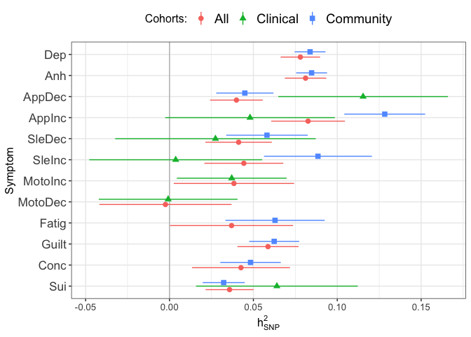

# Setup

## R packages

R version

``` r
R.version
```

    ##                _                           
    ## platform       aarch64-apple-darwin20      
    ## arch           aarch64                     
    ## os             darwin20                    
    ## system         aarch64, darwin20           
    ## status                                     
    ## major          4                           
    ## minor          2.2                         
    ## year           2022                        
    ## month          10                          
    ## day            31                          
    ## svn rev        83211                       
    ## language       R                           
    ## version.string R version 4.2.2 (2022-10-31)
    ## nickname       Innocent and Trusting

Package installation

``` r
required_packages <- c('devtools', 'readr', 'tidyr', 'dplyr', 'ggplot2', 'stringr', 'corrplot')
for(pack in required_packages) if(!require(pack, character.only=TRUE)) install.packages(pack)

library(devtools)

if(!require(GenomicSEM)) install_github("MichelNivard/GenomicSEM")
```

GenomicSEM version

``` r
require(readr)
require(tidyr)
require(stringr)
require(dplyr)
require(ggplot2)
require(corrplot)
require(GenomicSEM)

packageVersion("GenomicSEM")
```

    ## [1] '0.0.5'

## LD Score files

The LDSC support files first need to be downloaded and unpacked

``` bash
# LD Score reference files
mkdir -p sumstats/reference
curl -L https://data.broadinstitute.org/alkesgroup/LDSCORE/eur_w_ld_chr.tar.bz2 > sumstats/reference/eur_w_ld_chr.tar.bz2
curl -L https://data.broadinstitute.org/alkesgroup/LDSCORE/w_hm3.snplist.bz2 > sumstats/reference/w_hm3.snplist.bz2


tar -xjf sumstats/reference/eur_w_ld_chr.tar.bz2 -C sumstats/reference
rm sumstats/reference/eur_w_ld_chr.tar.bz2
bunzip2 sumstats/reference/w_hm3.snplist.bz2
```

# Symptom labels

MDD DSM symptoms are numbered 1-9:

``` r
# plot labels

dsm_mdd_symptoms_labels <-
read_delim("
MDD1;Mood;Mood;Dep
MDD2;Interest;Interest;Anh
MDD3;Weight⇅;Weight⇆;App
MDD3a;Weight⇊;Weight⇇;AppDec
MDD3b;Weight⇈;Weight⇉;AppInc
MDD4;Sleep⇅;Sleep⇆;Sle
MDD4a;Sleep⇊;Sleep⇇;SleDec
MDD4b;Sleep⇈;Sleep⇉;SleInc
MDD5;Motor⇅;Motor⇆;Moto
MDD5a;Motor⇈;Motor⇉;MotoInc
MDD5b;Motor⇊;Motor⇇;MotoDec
MDD6;Fatigue;Fatigue;Fatig
MDD7;Guilt;Guilt;Guilt
MDD8;Concentrate;Concentrate;Conc
MDD9;Suicidality;Suicidality;Sui
", col_names=c('ref', 'h', 'v', 'abbv'), delim=';')
```

    ## Rows: 15 Columns: 4
    ## ── Column specification ───────────────────────────────────────────────────────────────────────────────────────────────────────────
    ## Delimiter: ";"
    ## chr (4): ref, h, v, abbv
    ## 
    ## ℹ Use `spec()` to retrieve the full column specification for this data.
    ## ℹ Specify the column types or set `show_col_types = FALSE` to quiet this message.

``` r
dsm_mdd_symptoms_reference <-
read_delim("
MDD1;Depressed mood most of the day, nearly every day
MDD2;Markedly diminished interest or pleasure in all, or almost all, activities most of the day, nearly every day
MDD3;Significant change in weight or appetite
MDD3a;Significant weight loss or decrease in appetite
MDD3b;Significant weight gain or increase in appetite
MDD4;Sleeping too much or not sleeping enough
MDD4a;Insomnia nearly every day
MDD4b;Hypersomnia nearly every day
MDD5;Changes in speed/amount of moving or speaking
MDD5a;Psychomotor agitation nearly every day
MDD5b;Psychomotor slowing nearly every day
MDD6;Fatigue or loss of energy nearly every day
MDD7;Feelings of worthlessness or excessive or inappropriate guilt
MDD8;Diminished ability to think or concentrate, or indecisiveness
MDD9;Recurrent thoughts of death or suicide or a suicide attempt or a specific plan for attempting suicide
", col_names=c('Reference', 'Description'), delim=';')
```

    ## Rows: 15 Columns: 2
    ## ── Column specification ───────────────────────────────────────────────────────────────────────────────────────────────────────────
    ## Delimiter: ";"
    ## chr (2): Reference, Description
    ## 
    ## ℹ Use `spec()` to retrieve the full column specification for this data.
    ## ℹ Specify the column types or set `show_col_types = FALSE` to quiet this message.

``` r
dsm_mdd_symptoms_reference %>%
left_join(dsm_mdd_symptoms_labels, by=c('Reference'='ref')) %>%
select(Reference, Abbreviation=abbv, Label=h, Description)
```

    ## # A tibble: 15 × 4
    ##    Reference Abbreviation Label       Description                               
    ##    <chr>     <chr>        <chr>       <chr>                                     
    ##  1 MDD1      Dep          Mood        Depressed mood most of the day, nearly ev…
    ##  2 MDD2      Anh          Interest    Markedly diminished interest or pleasure …
    ##  3 MDD3      App          Weight⇅     Significant change in weight or appetite  
    ##  4 MDD3a     AppDec       Weight⇊     Significant weight loss or decrease in ap…
    ##  5 MDD3b     AppInc       Weight⇈     Significant weight gain or increase in ap…
    ##  6 MDD4      Sle          Sleep⇅      Sleeping too much or not sleeping enough  
    ##  7 MDD4a     SleDec       Sleep⇊      Insomnia nearly every day                 
    ##  8 MDD4b     SleInc       Sleep⇈      Hypersomnia nearly every day              
    ##  9 MDD5      Moto         Motor⇅      Changes in speed/amount of moving or spea…
    ## 10 MDD5a     MotoInc      Motor⇈      Psychomotor agitation nearly every day    
    ## 11 MDD5b     MotoDec      Motor⇊      Psychomotor slowing nearly every day      
    ## 12 MDD6      Fatig        Fatigue     Fatigue or loss of energy nearly every day
    ## 13 MDD7      Guilt        Guilt       Feelings of worthlessness or excessive or…
    ## 14 MDD8      Conc         Concentrate Diminished ability to think or concentrat…
    ## 15 MDD9      Sui          Suicidality Recurrent thoughts of death or suicide or…

# Sumstats munging

GWAS of MDD symptoms for two cohorts were meta-analyzed:

-   Population samples: ALSPAC + UK Biobankc
-   Case-enriched samples: AGDS + PGC

Meta-analysis was conducted using the Ricopoli
[daner](https://docs.google.com/document/d/1TWIhr8-qpCXB13WCXcU1_HDio8lC_MeWoAg2jlggrtU/edit)
so the summary statistics are in the (“**D**osage **An**alyz**er**)
format. These can be munged with `munge_sumstats.py` from the
[ldsc](https://github.com/bulik/ldsc) program.

First we need to prepare files for the MDD5 symptoms for the population
samples as these were only available in one cohorts (ALSPAC) and
therefore not meta-analyzed. These just need to be copied with the
correct names and have sample size columns added.

``` bash

mkdir -p meta/distribution/ALSPAC_UKB.MDD5a_psychomotorFast
mkdir -p meta/distribution/ALSPAC_UKB.MDD5b_psychomotorSlow

gunzip -c sumstats/aligned/daner_MDD5a_ALSPAC_CISR.txt.aligned.gz | awk 'BEGIN {OFS="\t"}; {if(NR == 1) {print "CHR", "SNP", "BP", "A1", "A2", "FRQ_A_113", "FRQ_U_3181", "INFO", "OR", "SE", "P", "Nca", "Nco", "Neff_half"} else {print $0, 113, 3181, 218.247}}' | gzip -c > meta/distribution/ALSPAC_UKB.MDD5a_psychomotorFast/daner_ALSPAC_UKB.MDD5a_psychomotorFast.gz

gunzip -c sumstats/aligned/daner_MDD5b_ALSPAC_CISR.txt.aligned.gz | awk 'BEGIN {OFS="\t"}; {if(NR == 1) {print "CHR", "SNP", "BP", "A1", "A2", "FRQ_A_299", "FRQ_U_2995", "INFO", "OR", "SE", "P", "Nca", "Nco", "Neff_half"} else {print $0, 299, 2995, 425.468}}' | gzip -c > meta/distribution/ALSPAC_UKB.MDD5b_psychomotorSlow/daner_ALSPAC_UKB.MDD5b_psychomotorSlow.gz
```

We find all daner files in the meta-analysis directory and loop them
through the munge step.

``` r
# Munge sumstats for all cohorts symptom GWASs

# find meta-analysed daner sumstats files for format daner_[COHORTS].MDD[N]_[SYMPTOM].gz
meta_daner_files <- list.files("meta/distribution", pattern="^daner_[A-Z_]+\\.MDD[1-9][a-z]*_[A-Za-z]+\\.gz$", full.name=TRUE, recursive=TRUE)

# non-meta-analysed files
other_daner_files <- list.files("sumstats/UKB/Touchscreen", pattern="^daner_[A-Za-z_]+\\.MDD[1-9][a-z]*_[A-Za-z]+\\.gz$", full.name=TRUE, recursive=TRUE)

daner_files <- c(meta_daner_files, other_daner_files)

# snp list reference file
hm3_file <- "sumstats/reference/w_hm3.snplist"

trait_names <- names(daner_files)

dir.create(file.path("meta", "munged"), showWarnings=FALSE)
dir.create(file.path("meta", "txt"), showWarnings=FALSE)

for(daner in daner_files) {

  # get traitname from daner filename
  daner_basename <- str_remove(basename(daner), '.gz')
  trait_name <- str_remove(daner_basename, 'daner_')
  
  sumstats_gz <- paste(trait_name, 'sumstats.gz', sep='.')
  munge_log <- paste(trait_name, 'munge.log', sep='_')
  
  if(!file.exists(file.path('meta', 'munged', sumstats_gz))) {
    # calculate effective sample size
    txt <- file.path('meta', 'txt', paste(trait_name, 'txt.gz', sep='.'))
    if(!file.exists(txt)) {
    
      daner_sumstats <- read_tsv(daner)
      txt_sumstats <- daner_sumstats %>%
        select(SNP, A1, A2, FRQ=starts_with('FRQ_A'), OR, SE, P, Neff_half) %>%
        transmute(SNP, A1, A2, FRQ, OR, SE, P, N=2*Neff_half)
    
      write_tsv(txt_sumstats, txt)
    }

    # munge daner sumstats with hm3
    munge(files=txt, hm3=hm3_file, trait.names=trait_name, info.filter=0.9, maf.filter=0.01)
    # move munged files
    file.rename(sumstats_gz, file.path('meta', 'munged', sumstats_gz))
    file.rename(munge_log, file.path('meta', 'munged', munge_log))
  }

}
```

# Symptom prevalences

Running [multivariable
LDSC](https://github.com/MichelNivard/GenomicSEM/wiki/3.-Models-without-Individual-SNP-effects)
requires knowing the sample prevalences and population prevalences of
each symptom. Sample prevalences can be calculated from the GWAS summary
statistics output but population prevalences have to be estimated.

## Population prevalences

We include a table of counts of symptom presence and absence for PGC
cohorts

``` r
pgc_symptom_counts <- read_table2('sumstats/PGC/CasesAllCohorts/pgc_dsm_symptom_counts.txt')

pgc_symptom_counts %>%
  spread(Status, N) %>%
  unite(AbsentPresent, Absent, Present, sep=':') %>%
  mutate(MDD_counts=paste(MDD, '(absent:present)')) %>%
  select(-MDD) %>%
  spread(MDD_counts, AbsentPresent)
```

    ## # A tibble: 12 × 3
    ##    Symptom `Case (absent:present)` `Control (absent:present)`
    ##    <chr>   <chr>                   <chr>                     
    ##  1 MDD1    914:12689               2809:364                  
    ##  2 MDD2    1451:11671              2591:234                  
    ##  3 MDD3a   6370:7060               2742:83                   
    ##  4 MDD3b   9421:2930               2804:21                   
    ##  5 MDD4a   3340:10209              2639:186                  
    ##  6 MDD4b   7859:3440               2793:32                   
    ##  7 MDD5a   5533:5510               2738:87                   
    ##  8 MDD5b   6405:5815               2756:69                   
    ##  9 MDD6    1736:11833              2602:223                  
    ## 10 MDD7    3072:10113              2703:122                  
    ## 11 MDD8    1501:11209              2719:106                  
    ## 12 MDD9    6194:7221               2779:46

``` r
pgc_symptom_counts %>% 
spread(Status, N) %>%
mutate(Total=Absent+Present) %>%
filter(MDD == 'Case') %>%
arrange(Total)
```

    ## # A tibble: 12 × 5
    ##    MDD   Symptom Absent Present Total
    ##    <chr> <chr>    <dbl>   <dbl> <dbl>
    ##  1 Case  MDD5a     5533    5510 11043
    ##  2 Case  MDD4b     7859    3440 11299
    ##  3 Case  MDD5b     6405    5815 12220
    ##  4 Case  MDD3b     9421    2930 12351
    ##  5 Case  MDD8      1501   11209 12710
    ##  6 Case  MDD2      1451   11671 13122
    ##  7 Case  MDD7      3072   10113 13185
    ##  8 Case  MDD9      6194    7221 13415
    ##  9 Case  MDD3a     6370    7060 13430
    ## 10 Case  MDD4a     3340   10209 13549
    ## 11 Case  MDD6      1736   11833 13569
    ## 12 Case  MDD1       914   12689 13603

Calculate symptom prevalences separately for cases and controls:

``` r
pgc_symptom_prevalences <- 
pgc_symptom_counts %>%
  spread(Status, N) %>%
  mutate(prev=Present / (Present + Absent)) %>%
  select(-Absent, -Present) %>%
  spread(MDD, prev)

pgc_symptom_prevalences %>%
  left_join(dsm_mdd_symptoms_labels, by=c('Symptom'='ref')) %>%
  select(Symptom=h, Case, Control)
```

    ## # A tibble: 12 × 3
    ##    Symptom      Case Control
    ##    <chr>       <dbl>   <dbl>
    ##  1 Mood        0.933 0.115  
    ##  2 Interest    0.889 0.0828 
    ##  3 Weight⇊     0.526 0.0294 
    ##  4 Weight⇈     0.237 0.00743
    ##  5 Sleep⇊      0.753 0.0658 
    ##  6 Sleep⇈      0.304 0.0113 
    ##  7 Motor⇈      0.499 0.0308 
    ##  8 Motor⇊      0.476 0.0244 
    ##  9 Fatigue     0.872 0.0789 
    ## 10 Guilt       0.767 0.0432 
    ## 11 Concentrate 0.882 0.0375 
    ## 12 Suicidality 0.538 0.0163

``` r
pgc_symptom_sample_sizes <- 
pgc_symptom_counts %>%
group_by(Symptom) %>%
summarize(Ntotal=sum(N))
```

Estimation of population prevalence based on average case/control
estimates depends on the prevalence of MDD (e.g., [15% in high income
countries](https://www.annualreviews.org/doi/10.1146/annurev-publhealth-031912-114409))

``` r
pgc_symptom_prev_size <- pgc_symptom_prevalences %>% 
  left_join(pgc_symptom_sample_sizes, by='Symptom')

case_control_prev_lm <- 
lm(Case ~ Control, data=pgc_symptom_prev_size, weights=Ntotal)

summary(case_control_prev_lm)
```

    ## 
    ## Call:
    ## lm(formula = Case ~ Control, data = pgc_symptom_prev_size, weights = Ntotal)
    ## 
    ## Weighted Residuals:
    ##     Min      1Q  Median      3Q     Max 
    ## -21.833  -8.900  -2.081   4.932  35.727 
    ## 
    ## Coefficients:
    ##             Estimate Std. Error t value Pr(>|t|)    
    ## (Intercept)  0.36979    0.06711   5.510 0.000258 ***
    ## Control      6.00913    1.18889   5.054 0.000496 ***
    ## ---
    ## Signif. codes:  0 '***' 0.001 '**' 0.01 '*' 0.05 '.' 0.1 ' ' 1
    ## 
    ## Residual standard error: 16.6 on 10 degrees of freedom
    ## Multiple R-squared:  0.7187, Adjusted R-squared:  0.6906 
    ## F-statistic: 25.55 on 1 and 10 DF,  p-value: 0.000496

``` r
ggplot(pgc_symptom_prev_size %>% left_join(dsm_mdd_symptoms_labels, by=c('Symptom'='ref')), aes(x=Control, y=Case, weight=Ntotal)) +
  geom_point() +
  stat_smooth(method='lm', fullrange=TRUE) +
  geom_text(hjust=-0.1, aes(label=h)) +
  scale_x_continuous('Sympotom prevalence among contols', limits=c(0, 0.15)) +
  scale_y_continuous('Symptom prevalence among cases') +
  coord_cartesian(xlim=c(0, 0.13), ylim=c(0, 1))
```

    ## `geom_smooth()` using formula = 'y ~ x'


Symptoms are are more likely to be present in MDD cases also have higher
prevalence in MDD controls. Calculate symptom population prevalences
weighted by MDD prevalence:
*k*<sub>MDD*N*</sub> = *k*<sub>MDD</sub> \* *k*<sub>MDD*N*, cases</sub> + (1−*k*<sub>MDD</sub>) \* *k*<sub>MDD*N*, controls</sub>.

``` r
k <- 0.15
pgc_symptoms_pop_prev <- 
pgc_symptom_prevalences %>%
  transmute(Symptom, pop_prev=k*Case + (1-k)*Control)
 
pgc_symptoms_pop_prev %>%
  left_join(dsm_mdd_symptoms_labels, by=c('Symptom'='ref')) %>%
  select(Symptom=h, pop_prev)
```

    ## # A tibble: 12 × 2
    ##    Symptom     pop_prev
    ##    <chr>          <dbl>
    ##  1 Mood          0.237 
    ##  2 Interest      0.204 
    ##  3 Weight⇊       0.104 
    ##  4 Weight⇈       0.0419
    ##  5 Sleep⇊        0.169 
    ##  6 Sleep⇈        0.0553
    ##  7 Motor⇈        0.101 
    ##  8 Motor⇊        0.0921
    ##  9 Fatigue       0.198 
    ## 10 Guilt         0.152 
    ## 11 Concentrate   0.164 
    ## 12 Suicidality   0.0946

## Cohort sample prevalences

Read in headers from the daner files. The daner format contains headers
for the frequency of the referenec allele in cases (A=Affected) and
controls (U=Unaffected) where the column name includes the sample size
(`FRQ_A_NNNN`, `FRQ_U_MMMM`)

``` r
symptoms_sample_prev_file <- 'meta/symptoms_prev.txt'

if(!file.exists(symptoms_sample_prev_file)) {
  
  # pull out which cohorts and symptom 'x' this is from the filename (COHORTS_MDDx_*)
  cohorts_symptoms <- str_match(basename(daner_files), 'daner_([A-Za-z_]+).(MDD[:digit:](a|b)?)')[,2:3]
  colnames(cohorts_symptoms) <- c('cohorts', 'symptom')
  
  names(daner_files) <- str_remove_all(basename(daner_files), '(daner_|.gz)')
  
  # read in header and pull out 6th and 7th columns
  daner_nca_nco <- 
  bind_rows(lapply(daner_files, function(daner) {
      # # get sample size columns from file header
      print(daner)
      daner_header <- read.table(daner, nrows=1)
      frq_a_col <- daner_header$V6
      frq_u_col <- daner_header$V7
      # extract sample size information for cases and controls
      nca <- as.integer(str_split(frq_a_col, pattern="_")[[1]][3])
      nco <- as.integer(str_split(frq_u_col, pattern="_")[[1]][3])
      return(data.frame(Nca=nca, Nco=nco))
  }), .id='sumstats')
  
  # merge and calculate sample prevalence
  symptoms_sample_prev <-
  cbind(cohorts_symptoms, daner_nca_nco) %>%
  mutate(samp_prev=Nca/(Nca+Nco))

  write_tsv(symptoms_sample_prev, symptoms_sample_prev_file)

} else {
  symptoms_sample_prev <- read_tsv(symptoms_sample_prev_file)
}
```

    ## Rows: 38 Columns: 6
    ## ── Column specification ───────────────────────────────────────────────────────────────────────────────────────────────────────────
    ## Delimiter: "\t"
    ## chr (3): cohorts, symptom, sumstats
    ## dbl (3): Nca, Nco, samp_prev
    ## 
    ## ℹ Use `spec()` to retrieve the full column specification for this data.
    ## ℹ Specify the column types or set `show_col_types = FALSE` to quiet this message.

``` r
symptoms_sample_prev %>%
  left_join(dsm_mdd_symptoms_labels, by=c('symptom'='ref')) %>%
  select(Cohorts=cohorts, Ref=symptom, Symptom=h, Cases=Nca, Controls=Nco, `Sample prevalence`=samp_prev)
```

    ## # A tibble: 38 × 6
    ##    Cohorts  Ref   Symptom  Cases Controls `Sample prevalence`
    ##    <chr>    <chr> <chr>    <dbl>    <dbl>               <dbl>
    ##  1 AGDS_PGC MDD1  Mood     25820     1623               0.941
    ##  2 AGDS_PGC MDD2  Interest 24488     2421               0.910
    ##  3 AGDS_PGC MDD3a Weight⇊   9007    13960               0.392
    ##  4 AGDS_PGC MDD3b Weight⇈   7510    14436               0.342
    ##  5 AGDS_PGC MDD4a Sleep⇊   19368     6310               0.754
    ##  6 AGDS_PGC MDD4b Sleep⇈   10559    13011               0.448
    ##  7 AGDS_PGC MDD5a Motor⇈   10686    12570               0.459
    ##  8 AGDS_PGC MDD5b Motor⇊   12511    11838               0.514
    ##  9 AGDS_PGC MDD6  Fatigue  23523     2179               0.915
    ## 10 AGDS_PGC MDD7  Guilt    21633     3727               0.853
    ## # … with 28 more rows

``` r
cohorts_sample_prev <-
symptoms_sample_prev %>%
  left_join(dsm_mdd_symptoms_labels, by=c('symptom'='ref')) %>%
  select(cohorts, samp_prev, h) %>%
  pivot_wider(names_from=cohorts, values_from=samp_prev)

ggplot(cohorts_sample_prev, aes(x=AGDS_PGC, y=ALSPAC_UKB)) +
geom_abline(col='red') +
geom_point() +
geom_text(aes(label=h), hjust=-0.1) +
scale_x_continuous('AGDS/PGC sample prevalence', breaks=c(0, 0.25, 0.5, 0.75, 1), limits=c(0, 1)) +
scale_y_continuous('ALSPAC/UKB sample prevalence', breaks=c(0, 0.25, 0.5, 0.75, 1), limits=c(0, 1)) +
coord_fixed(clip='off') +
theme_bw() +
theme(plot.margin=unit(c(1, 1, 1, 1), 'cm'))
```


``` r
ggsave('mdd-symptom-gsem_files/cohorts_symptoms_prev.png', width=5.5, height=5.5)
```

Correlation (Spearman’s rho) between sample prevalences in UKB CIDI and
PGC DSM:

``` r
with(cohorts_sample_prev, cor.test(AGDS_PGC, ALSPAC_UKB, method='spearman', use='pair'))
```

    ## 
    ##  Spearman's rank correlation rho
    ## 
    ## data:  AGDS_PGC and ALSPAC_UKB
    ## S = 86, p-value = 0.01454
    ## alternative hypothesis: true rho is not equal to 0
    ## sample estimates:
    ##       rho 
    ## 0.6993007

## Population prevalences

Combine the sample prevalences weighted by assuming 15% population
prevalence of MDD and 57% of UKB participants screening positively for
mood or anhedonia.

``` r
pop_prevs_w <-
symptoms_sample_prev %>%
filter(cohorts %in% c('AGDS_PGC', 'ALSPAC_UKB')) |>
mutate(w=case_when(cohorts == 'AGDS_PGC' ~ 0.15,
                   symptom %in% c('MDD1', 'MDD2') ~ 1.0,
                   TRUE ~ 0.57)) %>%
mutate(pop_prev=samp_prev*w) %>%
select(symptom, cohorts, pop_prev) %>%
pivot_wider(names_from=cohorts, values_from=pop_prev) %>%
group_by(symptom) %>%
mutate(pop_prev=mean(c(AGDS_PGC, ALSPAC_UKB))) %>%
select(symptom, pop_prev)

pop_prevs_w
```

    ## # A tibble: 12 × 2
    ## # Groups:   symptom [12]
    ##    symptom pop_prev
    ##    <chr>      <dbl>
    ##  1 MDD1      0.339 
    ##  2 MDD2      0.263 
    ##  3 MDD3a     0.143 
    ##  4 MDD3b     0.0897
    ##  5 MDD4a     0.262 
    ##  6 MDD4b     0.0805
    ##  7 MDD5a     0.0442
    ##  8 MDD5b     0.0644
    ##  9 MDD6      0.295 
    ## 10 MDD7      0.204 
    ## 11 MDD8      0.283 
    ## 12 MDD9      0.193

# Multivariable LDSC estimation

We list out the munged sumstats for AGDS/PGC and ALSPAC/UKB and unify
them with sample and population prevalences, using the symptom reference
from the sumstats filename. Sumstats were munged using effective sample
size, so we substitute `0.5` as the sample prevalences. We then
calculate the multivariable LDSC genomic covariance matrix and write it
out as deparsed R code. We use deparsed code instead of R data object
serialization (`save()` or `saveRDS()`) so that the data can be
inspected with a text editor to check that it does not contain
individual-level data before being committed to the version control
system. A simple caching strategy is employed to check whether the
covariance structure already exists and, if so, to parse it rather than
re-running the LD score calculation.

AGDS+PGC and ALSPAC+UKB sumstats

``` r
covstruct_prefix <- 'agds_pgc.alspac_ukb.covstruct'
covstruct_r <- file.path('ldsc', paste(covstruct_prefix, 'deparse.R', sep='.'))
covstruct_rds <- file.path('ldsc', paste(covstruct_prefix, 'rds', sep='.'))

if(!file.exists(covstruct_r)) {

  # list sumstats distribution directories
  sumstats_files <- list.files(file.path('meta', 'munged'), '.+sumstats\\.gz$', full.names=TRUE)

  # pull out which cohorts and symptom 'x' this is from the filename (COHORTS_MDDx_*)
  cohorts_symptoms <- str_match(basename(sumstats_files), '([A-Z_]+).(MDD[:digit:](a|b)?)')[,1]

  sumstats_paths <- data.frame(filename=sumstats_files, sumstats=str_remove(basename(sumstats_files), '.sumstats.gz'))

  sumstats_prevs <- 
    symptoms_sample_prev %>%
    inner_join(sumstats_paths, by='sumstats') %>%
    left_join(pop_prevs_w, by='symptom') %>%
    mutate(trait_name=paste(cohorts, symptom, sep='.')) |>
    mutate(pop_prev=if_else(cohorts=='UKBt', true=samp_prev, false=pop_prev))
    
  sumstats_prevs_keep <- sumstats_prevs |>
    filter(cohorts %in% c('AGDS_PGC', 'ALSPAC_UKB', 'UKBt')) |>
    filter(!sumstats %in% c("AGDS_PGC.MDD1_depressed", "AGDS_PGC.MDD2_anhedonia", "AGDS_PGC.MDD6_fatigue", 
    "AGDS_PGC.MDD7_worthless", "AGDS_PGC.MDD8_concentration", "ALSPAC_UKB.MDD5a_psychomotorFast", "ALSPAC_UKB.MDD5b_psychomotorSlow"))

  write_tsv(sumstats_prevs, file.path('ldsc', paste(covstruct_prefix, 'prevs', 'txt', sep='.')))

  symptoms_covstruct <- ldsc(traits=sumstats_prevs_keep$filename,
                             sample.prev=rep(0.5, times=length(sumstats_prevs_keep$samp_prev)),
                             population.prev=sumstats_prevs_keep$pop_prev,
                             ld='sumstats/reference/eur_w_ld_chr/',
                             wld='sumstats/reference/eur_w_ld_chr/',
                             trait.names=sumstats_prevs_keep$trait_name)

  dput(symptoms_covstruct, covstruct_r, control=c('exact'))
  saveRDS(symptoms_covstruct, covstruct_rds)
  
  # check for exact match of deparsed object
  identical(dget(covstruct_r), symptoms_covstruct)

} else {

  symptoms_covstruct <- dget(covstruct_r)

  sumstats_prevs <- read_tsv(file.path('ldsc', paste(covstruct_prefix, 'prevs', 'txt', sep='.')))

}
```

    ## Rows: 38 Columns: 9
    ## ── Column specification ───────────────────────────────────────────────────────────────────────────────────────────────────────────
    ## Delimiter: "\t"
    ## chr (5): cohorts, symptom, sumstats, filename, trait_name
    ## dbl (4): Nca, Nco, samp_prev, pop_prev
    ## 
    ## ℹ Use `spec()` to retrieve the full column specification for this data.
    ## ℹ Specify the column types or set `show_col_types = FALSE` to quiet this message.

## Heritabilities

Run LDSC, using sumstats filenames and estimated prevalences to
construct command line arguments for `ldsc.py`. Symptoms with negative
heritabilities in PGC cohorts are plotted in a separate facet with its
own scale.

``` r
sumstats_h2_txt <- 'ldsc/symptoms.h2.txt'

if(!file.exists(sumstats_h2_txt)) {

  sumstats_h2 <- plyr::adply(sumstats_prevs, 1, function(x) {
    
    filename <- x$filename
    samp_prev <- 0.5
    pop_prev <- x$pop_prev
    outname <- paste(filename, 'h2', sep='.')
    logfile <- paste(outname, 'log', sep='.')

    print(filename)
  
  
    if(!file.exists(logfile)) {
        if(!is.na(samp_prev)) {
           ldsc_command <- paste('ldsc.py --h2', filename, '--ref-ld-chr sumstats/reference/eur_w_ld_chr/ --w-ld-chr sumstats/reference/eur_w_ld_chr/ --out', outname, '--samp-prev', samp_prev, '--pop-prev', pop_prev)
        } else {
           ldsc_command <- paste('ldsc.py --h2', filename, '--ref-ld-chr sumstats/reference/eur_w_ld_chr/ --w-ld-chr sumstats/reference/eur_w_ld_chr/ --out', outname)
        }
        system(ldsc_command)
    }
  
    h2_log <- read.table(logfile, sep='\t', stringsAsFactors=F)
  
    h2_row <- h2_log$V1[str_detect(h2_log$V1, 'h2:')]
    h2_est_str <- str_extract_all(str_split(h2_row, ':')[[1]][2], '[0-9.\\-]+')[[1]]
    h2 <- as.numeric(h2_est_str[1])
    se <- as.numeric(h2_est_str[2])

    lambda_row <- h2_log$V1[str_detect(h2_log$V1, 'Lambda GC:')]
    lambda_est_str <- str_extract_all(str_split(lambda_row, ':')[[1]][2], '[0-9.\\-]+')[[1]]
    LambdaGC <- as.numeric(lambda_est_str)
  
    meanchisq_row <- h2_log$V1[str_detect(h2_log$V1, 'Mean Chi\\^2:')]
    meanchisq_est_str <- str_extract_all(str_split(meanchisq_row, ':')[[1]][2], '[0-9.\\-]+')[[1]]
    MeanChiSq <- as.numeric(meanchisq_est_str)

    intercept_row <- h2_log$V1[str_detect(h2_log$V1, 'Intercept:')]
    intercept_est_str <- str_extract_all(str_split(intercept_row, ':')[[1]][2], '[0-9.\\-]+')[[1]]
    Intercept <- as.numeric(intercept_est_str[1])
    InterceptSE <- as.numeric(intercept_est_str[2])

    return(data.frame(h2, se, LambdaGC, MeanChiSq, Intercept, InterceptSE))
  
  })
  
  sumstats_h2_table <-
  sumstats_h2 %>%
  left_join(dsm_mdd_symptoms_labels, by=c('symptom'='ref')) %>%
  mutate(sample=case_when(cohorts == 'AGDS_PGC' ~ 'Clin',
                        cohorts == 'ALSPAC_UKB' ~ 'Comm',
                        cohorts == 'UKBt' ~ 'Ukb',
                        cohorts == 'ALL' ~ 'All',
                        TRUE ~ NA_character_),
      Sample=case_when(cohorts == 'AGDS_PGC' ~ 'Clinical',
                       cohorts == 'ALSPAC_UKB' ~ 'Community',
                       cohorts == 'UKBt' ~ 'UK Biobank',
                       cohorts == 'ALL' ~ 'All',
                       TRUE ~ NA_character_)) %>%
  mutate(sample_symptom=paste0(sample, abbv)) %>%
  select(Sample, sample_symptom, ref=symptom,
       h2, se, LambdaGC, MeanChiSq, Intercept, InterceptSE,
       Nca, Nco, samp_prev, pop_prev,
       cohorts, abbv, sumstats, filename)

  write_tsv(sumstats_h2_table, sumstats_h2_txt)

} else {

  sumstats_h2_table <- read_tsv(sumstats_h2_txt)

}
```

    ## Rows: 38 Columns: 17
    ## ── Column specification ───────────────────────────────────────────────────────────────────────────────────────────────────────────
    ## Delimiter: "\t"
    ## chr  (7): Sample, sample_symptom, ref, cohorts, abbv, sumstats, filename
    ## dbl (10): h2, se, LambdaGC, MeanChiSq, Intercept, InterceptSE, Nca, Nco, sam...
    ## 
    ## ℹ Use `spec()` to retrieve the full column specification for this data.
    ## ℹ Specify the column types or set `show_col_types = FALSE` to quiet this message.

``` r
mdd_symptom_gsem_h2.gg <-
ggplot(sumstats_h2_table  %>% filter(4*Nca*Nco/(Nca+Nco) > 5000, h2 > 0),
        aes(x=abbv,
            y=h2,
            ymin=h2+se*qnorm(0.025),
            ymax=h2+se*qnorm(0.975),
            colour=Sample, shape=Sample)) +
geom_hline(yintercept=0, col='grey') +
geom_pointrange(position=position_dodge(width=0.5)) + 
scale_x_discrete('Symptom', limits=rev(unique(sumstats_h2_table$abbv))) +
scale_y_continuous(expression(h[SNP]^2)) +
theme_bw() + 
theme(axis.text.y=element_text(size=13),
      axis.text.x=element_text(size=10),
      axis.title=element_text(size=12),
      legend.title=element_text(size=12),
      legend.text=element_text(size=14),
      legend.position='top') +
 labs(color  = "Cohorts:", shape = "Cohorts:")

mdd_symptom_gsem_h2.gg + coord_flip() +
scale_y_continuous(expression(h[SNP]^2))
```

    ## Scale for y is already present.
    ## Adding another scale for y, which will replace the existing scale.



``` r
ggsave('mdd-symptom-gsem_files/symptoms_h2_snp.png', width=7, height=5)
```
