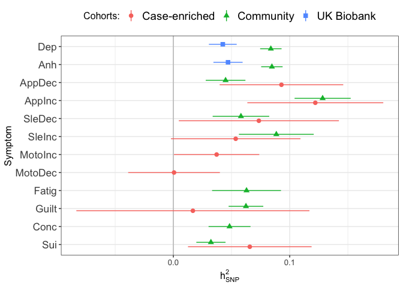

# Setup

## R packages

R version


```r
R.version
```

```
##                _                           
## platform       x86_64-redhat-linux-gnu     
## arch           x86_64                      
## os             linux-gnu                   
## system         x86_64, linux-gnu           
## status                                     
## major          3                           
## minor          6.0                         
## year           2019                        
## month          04                          
## day            26                          
## svn rev        76424                       
## language       R                           
## version.string R version 3.6.0 (2019-04-26)
## nickname       Planting of a Tree
```

Package installation


```r
required_packages <- c('devtools', 'readr', 'tidyr', 'dplyr', 'ggplot2', 'stringr', 'corrplot')
for(pack in required_packages) if(!require(pack, character.only=TRUE)) install.packages(pack)

library(devtools)

if(!require(GenomicSEM)) install_github("MichelNivard/GenomicSEM")
```

GenomicSEM version

```r
require(readr)
require(tidyr)
require(stringr)
require(dplyr)
require(ggplot2)
require(corrplot)
require(GenomicSEM)

packageVersion("GenomicSEM")
```

```
## [1] '0.0.2'
```

## LD Score files

The LDSC support files first need to be downloaded and unpacked


```bash
# LD Score reference files
mkdir -p sumstats/reference
curl https://data.broadinstitute.org/alkesgroup/LDSCORE/eur_w_ld_chr.tar.bz2 > sumstats/reference/eur_w_ld_chr.tar.bz2
curl https://data.broadinstitute.org/alkesgroup/LDSCORE/w_hm3.snplist.bz2 > sumstats/reference/w_hm3.snplist.bz2

tar -xjf sumstats/reference/eur_w_ld_chr.tar.bz2 -C sumstats/reference
rm sumstats/reference/eur_w_ld_chr.tar.bz2
bunzip2 sumstats/reference/w_hm3.snplist.bz2
```

# Symptom labels

MDD DSM symptoms are numbered 1-9:


```r
# plot labels

dsm_mdd_symptoms_labels <-
read_delim("
MDD1;Mood;Mood
MDD2;Interest;Interest
MDD3;Weight⇅;Weight⇆
MDD3a;Weight⇈;Weight⇉
MDD3b;Weight⇊;Weight⇇
MDD4;Sleep⇅;Sleep⇆
MDD4a;Sleep⇊;Sleep⇇
MDD4b;Sleep⇈;Sleep⇉
MDD5;Motor⇅;Motor⇆
MDD5a;Motor⇈;Motor⇉
MDD5b;Motor⇊;Motor⇇
MDD6;Fatigue;Fatigue
MDD7;Guilt;Guilt
MDD8;Concentrate;Concentrate
MDD9;Suicidality;Suicidality
", col_names=c('ref', 'h', 'v'), delim=';')

dsm_mdd_symptoms_reference <-
read_delim("
MDD1;Depressed mood most of the day, nearly every day
MDD2;Markedly diminished interest or pleasure in all, or almost all, activities most of the day, nearly every day
MDD3;Significant change in weight or appetite
MDD3a;Significant weight loss or decrease in appetite
MDD3b;Significant weight gain or increase in appetite
MDD4;Sleeping too much or not sleeping enough
MDD4a;Insomnia nearly every day
MDD4b;Hypersomnia nearly every day
MDD5;Changes in speed/amount of moving or speaking
MDD5a;Psychomotor agitation nearly every day
MDD5b;Psychomotor retardation nearly every day
MDD6;Fatigue or loss of energy nearly every day
MDD7;Feelings of worthlessness or excessive or inappropriate guilt
MDD8;Diminished ability to think or concentrate, or indecisiveness
MDD9;Recurrent thoughts of death or suicide or a suicide attempt or a specific plan for attempting suicide
", col_names=c('Reference', 'Description'), delim=';')

dsm_mdd_symptoms_reference %>%
left_join(dsm_mdd_symptoms_labels, by=c('Reference'='ref')) %>%
select(Reference, Label=h, Description)
```

<div class="kable-table">

Reference   Label         Description                                                                                                  
----------  ------------  -------------------------------------------------------------------------------------------------------------
MDD1        Mood          Depressed mood most of the day, nearly every day                                                             
MDD2        Interest      Markedly diminished interest or pleasure in all, or almost all, activities most of the day, nearly every day 
MDD3        Weight⇅       Significant change in weight or appetite                                                                     
MDD3a       Weight⇈       Significant weight loss or decrease in appetite                                                              
MDD3b       Weight⇊       Significant weight gain or increase in appetite                                                              
MDD4        Sleep⇅        Sleeping too much or not sleeping enough                                                                     
MDD4a       Sleep⇊        Insomnia nearly every day                                                                                    
MDD4b       Sleep⇈        Hypersomnia nearly every day                                                                                 
MDD5        Motor⇅        Changes in speed/amount of moving or speaking                                                                
MDD5a       Motor⇈        Psychomotor agitation nearly every day                                                                       
MDD5b       Motor⇊        Psychomotor retardation nearly every day                                                                     
MDD6        Fatigue       Fatigue or loss of energy nearly every day                                                                   
MDD7        Guilt         Feelings of worthlessness or excessive or inappropriate guilt                                                
MDD8        Concentrate   Diminished ability to think or concentrate, or indecisiveness                                                
MDD9        Suicidality   Recurrent thoughts of death or suicide or a suicide attempt or a specific plan for attempting suicide        

</div>


# Sumstats munging

## PGC

PGC sumstats are output in the Ricopoli [daner](https://docs.google.com/document/d/1TWIhr8-qpCXB13WCXcU1_HDio8lC_MeWoAg2jlggrtU/edit) ("**D**osage **An**alyz**er**) format. These can be munged with `munge_sumstats.py` from the [ldsc](https://github.com/bulik/ldsc) program. We find all daner files in the PGC directory and loop them through the munge step.


```bash
# Munge sumstats for all cohorts symptom GWASs

for sumstats in $(ls sumstats/PGC/CasesAllCohorts/daner_MDD*.meta.gz); do

        prefix=$(basename $sumstats .gz)

        munge_sumstats.py --daner-n \
        --sumstats $sumstats \
        --merge-alleles sumstats/reference/w_hm3.snplist \
        --out sumstats/PGC/CasesAllCohorts/${prefix}.ldsc

done

```

## UKB

### CIDI

UKB CIDI sumstats are in a format easily digestible by `munge_sumstats.py`.


```bash

# Munge sumstats for UKB CIDI

for sumstats in $(ls sumstats/UKB/CIDI/UKB_CIDI_MDD*.gz); do

        prefix=$(basename $sumstats .gz)

        munge_sumstats.py \
        --sumstats $sumstats \
        --N-cas-col Nca \
        --N-con-col Nco \
        --signed-sumstats OR,1 \
        --p P \
        --merge-alleles sumstats/reference/w_hm3.snplist \
        --out sumstats/UKB/CIDI/${prefix}.ldsc

done

```

### PHQ

The PHQ9 and PHQ-like items were assessed at 4 timepoints: 0 = initial assessment, 1 = repeate assessment, 2 = imaging assessment, M = Mental Health Questionnaire online followup


```bash

for sumstats in $(ls sumstats/UKB/PHQ/UKB_PHQ_MDD*.gz); do

        prefix=$(basename $sumstats .gz)

        munge_sumstats.py \
        --sumstats $sumstats \
        --a1 a_1 \
        --a2 a_0 \
        --signed-sumstats beta,0 \
        --N-col N \
        --p p \
        --info info \
        --frq af \
        --snp rsid \
        --merge-alleles sumstats/reference/w_hm3.snplist \
        --out sumstats/UKB/PHQ/${prefix}.ldsc

done

```


# Symptom prevalences

Running [multivariable LDSC](https://github.com/MichelNivard/GenomicSEM/wiki/3.-Models-without-Individual-SNP-effects) requires knowing the sample prevalences and population prevalences of each symptom. Sample prevalences can be calculated from the GWAS summary statistics output put population prevalences have to be estimated.

## Population prevalences

We include a table of counts of symptom presence and absence for PGC cohorts


```r
pgc_symptom_counts <- read_table2('sumstats/PGC/CasesAllCohorts/pgc_dsm_symptom_counts.txt')

pgc_symptom_counts %>%
  spread(Status, N) %>%
  unite(AbsentPresent, Absent, Present, sep=':') %>%
  mutate(MDD_counts=paste(MDD, '(absent:present)')) %>%
  select(-MDD) %>%
  spread(MDD_counts, AbsentPresent)
```

<div class="kable-table">

Symptom   Case (absent:present)   Control (absent:present) 
--------  ----------------------  -------------------------
MDD1      914:12689               2809:364                 
MDD2      1451:11671              2591:234                 
MDD3a     6370:7060               2742:83                  
MDD3b     9421:2930               2804:21                  
MDD4a     3340:10209              2639:186                 
MDD4b     7859:3440               2793:32                  
MDD5a     5533:5510               2738:87                  
MDD5b     6405:5815               2756:69                  
MDD6      1736:11833              2602:223                 
MDD7      3072:10113              2703:122                 
MDD8      1501:11209              2719:106                 
MDD9      6194:7221               2779:46                  

</div>

Calculate symptom prevalences separately for cases and controls:


```r
pgc_symptom_prevalences <- 
pgc_symptom_counts %>%
  spread(Status, N) %>%
  mutate(prev=Present / (Present + Absent)) %>%
  select(-Absent, -Present) %>%
  spread(MDD, prev)

pgc_symptom_prevalences %>%
  left_join(dsm_mdd_symptoms_labels, by=c('Symptom'='ref')) %>%
  select(Symptom=h, Case, Control)
```

<div class="kable-table">

Symptom             Case     Control
------------  ----------  ----------
Mood           0.9328089   0.1147179
Interest       0.8894223   0.0828319
Weight⇈        0.5256888   0.0293805
Weight⇊        0.2372278   0.0074336
Sleep⇊         0.7534873   0.0658407
Sleep⇈         0.3044517   0.0113274
Motor⇈         0.4989586   0.0307965
Motor⇊         0.4758592   0.0244248
Fatigue        0.8720613   0.0789381
Guilt          0.7670080   0.0431858
Concentrate    0.8819040   0.0375221
Suicidality    0.5382780   0.0162832

</div>

```r
pgc_symptom_sample_sizes <- 
pgc_symptom_counts %>%
group_by(Symptom) %>%
summarize(Ntotal=sum(N))
```

Estimation of population prevalence based on average case/control estimates depends on the prevalence of MDD (e.g., [15% in high income countries](https://www.annualreviews.org/doi/10.1146/annurev-publhealth-031912-114409))


```r
pgc_symptom_prev_size <- pgc_symptom_prevalences %>% 
  left_join(pgc_symptom_sample_sizes, by='Symptom')

case_control_prev_lm <- 
lm(Case ~ Control, data=pgc_symptom_prev_size, weights=Ntotal)

summary(case_control_prev_lm)
```

```
## 
## Call:
## lm(formula = Case ~ Control, data = pgc_symptom_prev_size, weights = Ntotal)
## 
## Weighted Residuals:
##     Min      1Q  Median      3Q     Max 
## -21.833  -8.900  -2.081   4.932  35.727 
## 
## Coefficients:
##             Estimate Std. Error t value Pr(>|t|)    
## (Intercept)  0.36979    0.06711   5.510 0.000258 ***
## Control      6.00913    1.18889   5.054 0.000496 ***
## ---
## Signif. codes:  0 '***' 0.001 '**' 0.01 '*' 0.05 '.' 0.1 ' ' 1
## 
## Residual standard error: 16.6 on 10 degrees of freedom
## Multiple R-squared:  0.7187,	Adjusted R-squared:  0.6906 
## F-statistic: 25.55 on 1 and 10 DF,  p-value: 0.000496
```

```r
ggplot(pgc_symptom_prev_size %>% left_join(dsm_mdd_symptoms_labels, by=c('Symptom'='ref')), aes(x=Control, y=Case, weight=Ntotal)) +
  geom_point() +
  stat_smooth(method='lm', fullrange=TRUE) +
  geom_text(hjust=-0.1, aes(label=h)) +
  scale_x_continuous('Sympotom prevalence among contols', limits=c(0, 0.15)) +
  scale_y_continuous('Symptom prevalence among cases') +
  coord_cartesian(xlim=c(0, 0.13), ylim=c(0, 1))
```

<!-- -->

Symptoms are are more likely to be present in MDD cases also have higher prevalence in MDD controls. Calculate symptom population prevalences weighted by MDD prevalence: $k_{\mathrm{MDD}N} = k_\mathrm{MDD} * k_{\mathrm{MDD}N,\mathrm{cases}} + (1 - k_\mathrm{MDD}) * k_{\mathrm{MDD}N,\mathrm{controls}}$.


```r
k <- 0.15
pgc_symptoms_pop_prev <- 
pgc_symptom_prevalences %>%
  transmute(Symptom, pop_prev=k*Case + (1-k)*Control)
 
pgc_symptoms_pop_prev %>%
  left_join(dsm_mdd_symptoms_labels, by=c('Symptom'='ref')) %>%
  select(Symptom=h, pop_prev)
```

<div class="kable-table">

Symptom         pop_prev
------------  ----------
Mood           0.2374316
Interest       0.2038204
Weight⇈        0.1038268
Weight⇊        0.0419027
Sleep⇊         0.1689877
Sleep⇈         0.0552961
Motor⇈         0.1010208
Motor⇊         0.0921399
Fatigue        0.1979065
Guilt          0.1517592
Concentrate    0.1641794
Suicidality    0.0945824

</div>

## PGC sample prevalences

Read in headers from PGC daner files. The daner format contains headers for the frequency of the referenec allele in cases (A=Affected) and controls (U=Unaffected) where the column name includes the sample size (`FRQ_A_NNNN`, `FRQ_U_MMMM`)


```r
# list daner files
pgc_daner_meta_gz <- list.files('sumstats/PGC/CasesAllCohorts', pattern='meta.gz', full.names=TRUE)

# pull out which symptom 'x' this is from the filename (daner_MDDx_*)
names(pgc_daner_meta_gz) <- str_extract(pgc_daner_meta_gz, 'MDD[:digit:](a|b)?')

# read in header and pull out 6th and 7th columns
pgc_daner_meta_frq_cols <- 
bind_rows(
lapply(pgc_daner_meta_gz, function(daner) {
        daner_header <-read.table(daner, nrows=1, stringsAsFactors=F)
        return(data.frame(frq_a_col=daner_header$V6, frq_u_col=daner_header$V7))
}), .id='Symptom')

# shape and unshape and extract N from column names
pgc_symptoms_sample_prev <-
pgc_daner_meta_frq_cols %>%
gather(key='col', value='frq', frq_a_col:frq_u_col) %>%
select(-col) %>%
separate(frq, into=c('frq', 'status', 'Count')) %>%
mutate(presence=recode(status, 'A'='Present', 'U'='Absent'),
       N=as.integer(Count)) %>%
select(-frq, -status, -Count) %>%
spread(presence, N) %>%
mutate(samp_prev=Present / (Present + Absent))

pgc_symptoms_sample_prev %>%
  left_join(dsm_mdd_symptoms_labels, by=c('Symptom'='ref')) %>%
  select(Symptom=h, Absent, Present, `Sample prevalence`=samp_prev)
```

<div class="kable-table">

Symptom        Absent   Present   Sample prevalence
------------  -------  --------  ------------------
Mood             1152     11669           0.9101474
Interest         1456     10887           0.8820384
Weight⇈          5873      6520           0.5261034
Weight⇊          8688      2684           0.2360183
Sleep⇊           3141      9332           0.7481761
Sleep⇈           7163      3210           0.3094572
Motor⇈           5032      5072           0.5019794
Motor⇊           5911      5295           0.4725147
Fatigue          1579     10913           0.8735991
Guilt            2862      9363           0.7658896
Concentrate      1421     10281           0.8785678
Suicidality      5631      6721           0.5441224

</div>

## UKB CIDI sample prevalences

Symptom prevalences in the UKB CIDI assessment were calculated for the present/absent reponses and in reference to the whole MHQ sample (assuming particpants who were screened out do not have any symptoms)


```r
# read this in as a table.
# TODO: incorporate the code for this, but need to pull in code
# from a separate repository

ukb_cidi_prevalences <- read_tsv('sumstats/UKB/CIDI/ukb_cidi_symptoms_prev.txt')
```


```r
pgc_ukb_symptoms_prev <- 
pgc_symptoms_sample_prev %>%
full_join(pgc_symptoms_pop_prev, by='Symptom') %>%
full_join(ukb_cidi_prevalences, by=c('Symptom'='reference')) %>%
left_join(dsm_mdd_symptoms_labels, by=c('Symptom'='ref'))

ggplot(pgc_ukb_symptoms_prev, aes(x=samp_prev, y=cidi_sample)) +
geom_abline(col='red') +
geom_point() +
geom_text(aes(label=h), hjust=-0.1) +
scale_x_continuous('PGC sample prevalence', limits=c(0, 1)) +
scale_y_continuous('UKB sample prevalence', limits=c(0, 1)) +
coord_fixed() 
```

<!-- -->

```r
ggplot(pgc_ukb_symptoms_prev, aes(x=pop_prev, y=mhq_sample)) +
geom_abline(col='red') +
geom_point() +
geom_text(aes(label=h), hjust=-0.1) +
scale_x_continuous('PGC pop prevalence', limits=c(0, 1)) +
scale_y_continuous('UKB MHQ prevalence', limits=c(0, 1)) +
coord_fixed() 
```

<!-- -->


# Multivariable LDSC estimation

We list out the munged sumstats for PGC and UKB and unify them with sample and population prevalences, using the symptom reference from the sumstats filename. We then calculate the multivariable LDSC genomic covariance matrix and write it out as deparsed R code. We use deparsed code instead of R data object serialization (`save()` or `saveRDS()`) so that the data can be inspected with a text editor to check that it does not contain individual-level data before being committed to the version control system. A simple caching strategy is employed to check whether the covariance structure already exists and, if so, to parse it rather than re-running the LD score calculation.


```r
pgc_ukb_covstruct_r <- 'ldsc/pgc_dsm.ukb_cidi.ukb_phq.covstruct.deparse.R'
pgc_ukb_covstruct_rds <- 'ldsc/pgc_dsm.ukb_cidi.ukb_phq.covstruct.rds'

# list sumstats files
pgc_sumstats_gz <- list.files('sumstats/PGC/CasesAllCohorts', pattern='ldsc.sumstats.gz$', full.names=TRUE)

ukb_cidi_sumstats_gz <- list.files('sumstats/UKB/CIDI', pattern='ldsc.sumstats.gz$', full.names=TRUE)

ukb_phq_sumstats_gz <- list.files('sumstats/UKB/PHQ', pattern='ldsc.sumstats.gz$', full.names=TRUE)

# pull out which symptom 'x' this is from the filename (daner_MDDx_*)
names(pgc_sumstats_gz) <- str_extract(pgc_sumstats_gz, 'MDD[:digit:](a|b)?')

names(ukb_cidi_sumstats_gz) <- str_extract(ukb_cidi_sumstats_gz, 'MDD[:digit:](a|b)?')

names(ukb_phq_sumstats_gz) <- str_extract(ukb_phq_sumstats_gz, 'MDD[:digit:]_[:alnum:]')

pgc_sumstats_prevs <- 
tibble(Symptom=names(pgc_sumstats_gz),
       filename=pgc_sumstats_gz,
       study='PGC') %>%
left_join(pgc_ukb_symptoms_prev, by='Symptom') %>%
mutate(trait_name=paste0(study, str_replace(Symptom, 'MDD', ''))) %>%
select(trait_name, filename, samp_prev, pop_prev)

ukb_cidi_sumstats_prevs <- 
tibble(Symptom=names(ukb_cidi_sumstats_gz), 
       filename=ukb_cidi_sumstats_gz,
       study='UKB_CIDI') %>%
left_join(pgc_ukb_symptoms_prev, by='Symptom') %>%
mutate(trait_name=paste0(study, str_replace(Symptom, 'MDD', ''))) %>%
select(trait_name, filename, samp_prev=cidi_sample, pop_prev)

ukb_phq_sumstats_prevs <- tibble(Symptom=names(ukb_phq_sumstats_gz),
       filename=ukb_phq_sumstats_gz,
       study='UKB_PHQ') %>%
mutate(trait_name=paste0(study, str_replace(Symptom, 'MDD', ''))) %>%
select(trait_name, filename)

sumstats_prevs <- bind_rows(pgc_sumstats_prevs, ukb_cidi_sumstats_prevs, ukb_phq_sumstats_prevs)

if(!file.exists(pgc_ukb_covstruct_r)) {


  symptoms_covstruct <- ldsc(traits=sumstats_prevs$filename,
                             sample.prev=sumstats_prevs$samp_prev,
                             population.prev=sumstats_prevs$pop_prev,
                             ld='sumstats/reference/eur_w_ld_chr/',
                             wld='sumstats/reference/eur_w_ld_chr/',
                             trait.names=sumstats_prevs$trait_name)


  dput(symptoms_covstruct, pgc_ukb_covstruct_r, control=c('all', 'digits17'))
  saveRDS(symptoms_covstruct, pgc_ukb_covstruct_rds)
  
  # check for exact match of deparsed object
  identical(dget(pgc_ukb_covstruct_r), symptoms_covstruct)

} else {

  symptoms_covstruct <- dget(pgc_ukb_covstruct_r)

}
```

# Heritabilities

Run LDSC, using sumstats filenames and estimated prevalences to construct command line arguments for `ldsc.py`. Symptoms with negative heritabilities in PGC cohorts are plotted in a separate facet with its own scale.


```r
sumstats_h2 <- plyr::adply(sumstats_prevs, 1, function(x) {
  
  filename <- x$filename
  samp_prev <- x$samp_prev
  pop_prev <- x$pop_prev
  outname <- paste(filename, 'h2', sep='.')
  logfile <- paste(outname, 'log', sep='.')


  if(!file.exists(logfile)) {
  if(!is.na(samp_prev)) {
     ldsc_command <- paste('ldsc.py --h2', filename, '--ref-ld-chr sumstats/reference/eur_w_ld_chr/ --w-ld-chr sumstats/reference/eur_w_ld_chr/ --out', outname, '--samp-prev', samp_prev, '--pop-prev', pop_prev)
  } else {
     ldsc_command <- paste('ldsc.py --h2', filename, '--ref-ld-chr sumstats/reference/eur_w_ld_chr/ --w-ld-chr sumstats/reference/eur_w_ld_chr/ --out', outname)
  }
  system(ldsc_command)
  }

  h2_log <- read.table(logfile, sep='\t', stringsAsFactors=F)

  h2_row <- h2_log$V1[str_detect(h2_log$V1, 'h2:')]

  h2_est_str <- str_extract_all(str_split(h2_row, ':')[[1]][2], '[0-9.\\-]+')[[1]]

  h2 <- as.numeric(h2_est_str[1])
  se <- as.numeric(h2_est_str[2])

  return(data.frame(h2, se))

})
```


```r
sumstats_h2_labels <-
as_tibble(sumstats_h2) %>%
mutate(ref=paste0('MDD', str_extract(trait_name, '[:digit:](a|b)?')),
       study=str_replace(str_extract(trait_name, '[A-Z_]+'), '_', ' '),
       sub_study=str_extract(trait_name, '_[012M]$')) %>%
# split negative estimates into their own facet
mutate(study_est=case_when(study == 'PGC' & h2 > 0 ~ 'PGC (+)',
                           study == 'PGC' & h2 <= 0 ~ 'PGC (-)',
                           TRUE ~ study)) %>%
filter(is.na(sub_study) | sub_study == '_M') %>%
left_join(dsm_mdd_symptoms_labels, by='ref') %>%
mutate(a=1) %>%
# insert invisible placeholder estimates so that the positive estimates are
# all plotted on common scale even though the facet has `scale='free'`
bind_rows(tibble(study_est=rep(c('PGC (-)', 'PGC (+)', 'UKB CIDI', 'UKB PHQ'), times=2),
                 h='Mood',
                 a=0,
                 h2=rep(c(0, 0.26), each=4),
                 se=0.0))

ggplot(sumstats_h2_labels, aes(x=h, y=h2, ymin=h2+se*qnorm(0.025), ymax=h2+se*qnorm(0.975))) +
geom_pointrange(aes(alpha=a)) + 
facet_grid(cols=vars(study_est), scale='free') +
scale_x_discrete('Symptom', limits=rev(dsm_mdd_symptoms_labels$h)) +
scale_y_continuous(expression(h[SNP]^2)) +
scale_alpha_identity() +
coord_flip() +
theme_bw()
```

<!-- -->

```r
ggsave('mdd-symptom-gsem_files/symptoms_h2_snp.png', width=10, height=4)
```

# Correlation matrix

Load phenotypic correlations 


```r
ukb_cidi_phq_cor <- dget('sumstats/UKB/ukb_cidi_phq_mixed_cor.deparse.R')

pgc_dsm_cor <- dget('sumstats/PGC/CasesAllCohorts/pgc_cases_tetra_cor.deprase.R')


symptoms_pgc_cidi_phqm <- 
c("PGC1", "PGC2", "PGC3a", "PGC3b", "PGC4a", "PGC4b", "PGC5a", 
"PGC5b", "PGC6", "PGC7", "PGC8", "PGC9", "UKB_CIDI1", "UKB_CIDI2", 
"UKB_CIDI3a", "UKB_CIDI3b", "UKB_CIDI4a", "UKB_CIDI4b", "UKB_CIDI6", 
"UKB_CIDI7", "UKB_CIDI8", "UKB_CIDI9",  "UKB_PHQ1_M", "UKB_PHQ2_M", "UKB_PHQ3_M", 
"UKB_PHQ4_M", "UKB_PHQ5_M",  "UKB_PHQ6_M", "UKB_PHQ7_M", "UKB_PHQ8_M", "UKB_PHQ9_M")

pheno_cor <- matrix(NA, nrow=length(symptoms_pgc_cidi_phqm), ncol=length(symptoms_pgc_cidi_phqm), dimnames=list(symptoms_pgc_cidi_phqm, symptoms_pgc_cidi_phqm))


pheno_cor[13:31,13:31] <- ukb_cidi_phq_cor$rho[c(-3,-6), c(-3, -6)]

pheno_cor[1:12,1:12] <- pgc_dsm_cor$rho
```


```r
symptoms_cor <- cov2cor(symptoms_covstruct$S)
```

```
## Warning in sqrt(1/diag(V)): NaNs produced
```

```
## Warning in cov2cor(symptoms_covstruct$S): diag(.) had 0 or NA entries; non-
## finite result is doubtful
```

```r
symptoms_cor[which(symptoms_cor > 1)] <- 1
rownames(symptoms_cor) <- colnames(symptoms_cor)

symptoms_pgc_cidi_phqm_cor <- symptoms_cor[symptoms_pgc_cidi_phqm,symptoms_pgc_cidi_phqm]

# phenotypic correlations in upper diagonal

symptoms_pgc_cidi_phqm_cor[upper.tri(symptoms_pgc_cidi_phqm_cor)] <- pheno_cor[upper.tri(pheno_cor)]

corrplot(symptoms_pgc_cidi_phqm_cor, 'square', na.label='.')
```

<!-- -->

```r
# output for presentation
dsm_horizontal_labels <- dsm_mdd_symptoms_labels$h
dsm_vertical_labels <- dsm_mdd_symptoms_labels$v
names(dsm_horizontal_labels) <- names(dsm_vertical_labels) <- dsm_mdd_symptoms_labels$ref

symptoms_pgc_cidi_phqm_cor_refs <- paste0('MDD', str_extract(colnames(symptoms_pgc_cidi_phqm_cor), '[:digit:](a|b)?'))

symptoms_pgc_cidi_phqm_cor_present <- symptoms_pgc_cidi_phqm_cor

rownames(symptoms_pgc_cidi_phqm_cor_present) <- dsm_horizontal_labels[symptoms_pgc_cidi_phqm_cor_refs]
colnames(symptoms_pgc_cidi_phqm_cor_present) <- dsm_vertical_labels[symptoms_pgc_cidi_phqm_cor_refs]

png('mdd-symptom-gsem_files/symptoms_pgc_cidi_phqm_cor.png', width=3000, height=3000, pointsize=60)
corrplot(symptoms_pgc_cidi_phqm_cor_present, 'square', na.label='.')
dev.off()
```

```
## X11cairo 
##        2
```


```r
c('UKB_CIDI1', 'UKB_PHQ1_M', 'UKB_CIDI2', 'UKB_PHQ2_M',     'PGC3a', 'UKB_CIDI3a', 'UKB_CIDI3b', 'UKB_PHQ3_M', 'UKB_CIDI4a', 'UKB_CIDI4b', 'UKB_PHQ4_M', 'PGC5a', 'PGC5b', 'UKB_PHQ5_M', 'UKB_PHQ6_M', 'UKB_CIDI7', 'UKB_PHQ7_M', 'UKB_CIDI8','UKB_PHQ8_M','UKB_CIDI9', 'UKB_PHQ9_M')                                               
```

```
##  [1] "UKB_CIDI1"  "UKB_PHQ1_M" "UKB_CIDI2"  "UKB_PHQ2_M" "PGC3a"     
##  [6] "UKB_CIDI3a" "UKB_CIDI3b" "UKB_PHQ3_M" "UKB_CIDI4a" "UKB_CIDI4b"
## [11] "UKB_PHQ4_M" "PGC5a"      "PGC5b"      "UKB_PHQ5_M" "UKB_PHQ6_M"
## [16] "UKB_CIDI7"  "UKB_PHQ7_M" "UKB_CIDI8"  "UKB_PHQ8_M" "UKB_CIDI9" 
## [21] "UKB_PHQ9_M"
```


```r
mdd1 <- c('UKB_CIDI1', 'UKB_PHQ1_0', 'UKB_PHQ1_1', 'UKB_PHQ1_2', 'UKB_PHQ1_M')
mdd2 <- c('UKB_CIDI2', 'UKB_PHQ2_0', 'UKB_PHQ2_1', 'UKB_PHQ2_2', 'UKB_PHQ2_M')
mdd3 <- c('PGC3a', 'UKB_CIDI3a', 'UKB_CIDI3b', 'UKB_PHQ3_M')
mdd4 <- c('UKB_CIDI4a', 'UKB_CIDI4b', 'UKB_PHQ4_M')
mdd5 <- c('PGC5a', 'PGC5b', 'UKB_PHQ5_0', 'UKB_PHQ5_1', 'UKB_PHQ5_2', 'UKB_PHQ5_M')
mdd6 <- c('UKB_PHQ6_0', 'UKB_PHQ6_1', 'UKB_PHQ6_2', 'UKB_PHQ6_M')
mdd7 <- c('UKB_CIDI7', 'UKB_PHQ7_M')
mdd8 <- c('UKB_CIDI8', 'UKB_PHQ8_M')
mdd9 <- c('PGC9', 'UKB_CIDI9', 'UKB_PHQ9_M')

corrplot(symptoms_cor[c(mdd1, mdd2, mdd3, mdd4, mdd5, mdd6, mdd7, mdd8, mdd9),
                      c(mdd1, mdd2, mdd3, mdd4, mdd5, mdd6, mdd7, mdd8, mdd9)],
                      'square')
```

<!-- -->

```r
corrplot(symptoms_cor[mdd1,mdd1], 'square')
```

<!-- -->

```r
corrplot(symptoms_cor[mdd3,mdd3], 'square')
```

<!-- -->

# Structural models

## PGC

### Common factor

Common factor model


```r
pgc_commonfactor_model <- "
F_PGC =~ NA*PGC3a + PGC5a + PGC5b + PGC9
F_PGC ~~ 1*F_PGC
"

pgc_commonfactor_fit <- usermodel(symptoms_covstruct, estimation='DWLS', model=pgc_commonfactor_model)
```

```
## [1] "Running primary model"
```

```
## Warning in if (class(bread2$value) != "matrix") {: the condition has length
## > 1 and only the first element will be used
```

```
## [1] "Error: The primary model did not converge! Additional warnings or errors are likely being printed by lavaan. \n            The model output is also printed below (without standard errors) in case this is helpful for troubleshooting. Please note\n            that these results should not be interpreted."
##      lhs op   rhs Unstandardized_Estimate
## 1  F_PGC =~ PGC3a            2.439406e-03
## 2  F_PGC =~ PGC5a            1.050354e+01
## 3  F_PGC =~ PGC5b           -3.354751e-03
## 4  F_PGC =~  PGC9            4.361013e-04
## 24 PGC3a ~~ PGC3a            9.562556e-02
## 25 PGC5a ~~ PGC5a           -1.101598e+02
## 26 PGC5b ~~ PGC5b            1.272708e-01
## 27  PGC9 ~~  PGC9            1.200222e-01
```

```
## Warning in if (class(bread2$value) == "matrix") {: the condition has length
## > 1 and only the first element will be used
```

```
## Warning in if (class(bread2$value) == "matrix" & check == 2) {: the
## condition has length > 1 and only the first element will be used
```


```r
pgc_commonfactor_constr_model <- "
F_PGC =~ NA*PGC3a + PGC5a + PGC9
F_PGC ~~ 1*F_PGC
"

pgc_commonfactor_constr_fit <- usermodel(symptoms_covstruct, estimation='DWLS', model=pgc_commonfactor_constr_model)
```

```
## [1] "Running primary model"
## [1] "Calculating model chi-square"
## [1] "Calculating CFI"
## [1] "Calculating Standardized Results"
## [1] "Calculating SRMR"
## elapsed 
##   0.392
```

```r
pgc_commonfactor_constr_fit$modelfit
```

<div class="kable-table">

     chisq    df  p_chisq   AIC    CFI   SRMR
---  ------  ---  --------  ----  ----  -----
df   NA        0  NA        NA       1      0

</div>

```r
pgc_commonfactor_constr_fit$results[c(1, 2, 3, 6, 7)]
```

<div class="kable-table">

lhs     op   rhs      STD_Genotype  STD_Genotype_SE   
------  ---  ------  -------------  ------------------
F_PGC   =~   PGC3a       0.8178062  3.31868323673634  
F_PGC   =~   PGC5a       0.2498389  1.04289399886056  
F_PGC   =~   PGC9        0.1300049  0.575322423772372 
F_PGC   ~~   F_PGC       1.0000000                    
PGC3a   ~~   PGC3a       0.3311929  5.43124953771812  
PGC5a   ~~   PGC5a       0.9375805  0.579010344657521 
PGC9    ~~   PGC9        0.9830987  0.390501757325279 

</div>
## UKB CIDI

### Common factor

Common factor model


```r
ukb_cidi_commonfactor_model <- "
F_UKB_CIDI =~ NA*UKB_CIDI1 + UKB_CIDI2 + UKB_CIDI3a + UKB_CIDI3b + UKB_CIDI4a + UKB_CIDI6 + UKB_CIDI7 + UKB_CIDI8 + UKB_CIDI9
F_UKB_CIDI ~~ 1*F_UKB_CIDI
"

ukb_cidi_commonfactor_fit <- usermodel(symptoms_covstruct, estimation='DWLS', model=ukb_cidi_commonfactor_model)
```

```
## [1] "Running primary model"
## [1] "Calculating model chi-square"
## [1] "Calculating CFI"
## [1] "Calculating Standardized Results"
## [1] "Calculating SRMR"
## elapsed 
##   0.778 
## [1] "The S matrix was smoothed prior to model estimation due to a non-positive definite matrix. The largest\n                  difference in a cell between the smoothed and non-smoothed matrix was 0.00131902246367886"
```

```r
ukb_cidi_commonfactor_fit$modelfit
```

<div class="kable-table">

         chisq   df     p_chisq        AIC         CFI        SRMR
---  ---------  ---  ----------  ---------  ----------  ----------
df    58.94845   27   0.0003617   94.94845   0.9867045   0.1139731

</div>

```r
ukb_cidi_commonfactor_fit$results[c(1, 2, 3, 6, 7)]
```

<div class="kable-table">

lhs          op   rhs           STD_Genotype  STD_Genotype_SE    
-----------  ---  -----------  -------------  -------------------
F_UKB_CIDI   =~   UKB_CIDI1        0.8769735  0.0597300497157408 
F_UKB_CIDI   =~   UKB_CIDI2        0.9665378  0.0470338364496451 
F_UKB_CIDI   =~   UKB_CIDI3a       0.1730714  0.0973195842396839 
F_UKB_CIDI   =~   UKB_CIDI3b       0.4348407  0.0820936503904488 
F_UKB_CIDI   =~   UKB_CIDI4a       0.6070118  0.0998201645165306 
F_UKB_CIDI   =~   UKB_CIDI6        0.6972188  0.0991747747686025 
F_UKB_CIDI   =~   UKB_CIDI7        0.6504070  0.0758443013852876 
F_UKB_CIDI   =~   UKB_CIDI8        0.7028429  0.091302659537442  
F_UKB_CIDI   =~   UKB_CIDI9        0.6153714  0.10827454221332   
F_UKB_CIDI   ~~   F_UKB_CIDI       1.0000000                     
UKB_CIDI1    ~~   UKB_CIDI1        0.2309172  0.0936110232447038 
UKB_CIDI2    ~~   UKB_CIDI2        0.0658051  0.0644089419983044 
UKB_CIDI3a   ~~   UKB_CIDI3a       0.9700456  0.287904666707737  
UKB_CIDI3b   ~~   UKB_CIDI3b       0.8109145  0.157710039763617  
UKB_CIDI4a   ~~   UKB_CIDI4a       0.6315398  0.311625139275458  
UKB_CIDI6    ~~   UKB_CIDI6        0.5138847  0.355960828439626  
UKB_CIDI7    ~~   UKB_CIDI7        0.5769720  0.158825170453834  
UKB_CIDI8    ~~   UKB_CIDI8        0.5060126  0.221187103957889  
UKB_CIDI9    ~~   UKB_CIDI9        0.6213185  0.258690896267572  

</div>

## UKB PHQ

### Assessment factors

#### Common factor (Baseline)

Common factor model at baseline assessment


```r
ukb_phq_0_commonfactor_model <- "
F_UKB_PHQ_0 =~ NA*UKB_PHQ1_0 + UKB_PHQ2_0 + UKB_PHQ5_0 + UKB_PHQ6_0
F_UKB_PHQ_0 ~~ 1*F_UKB_PHQ_0
"

ukb_phq_0_commonfactor_fit <- usermodel(symptoms_covstruct, estimation='DWLS', model=ukb_phq_0_commonfactor_model)
```

```
## [1] "Running primary model"
## [1] "Calculating model chi-square"
## [1] "Calculating CFI"
## [1] "Calculating Standardized Results"
## [1] "Calculating SRMR"
## elapsed 
##   0.455
```

```r
ukb_phq_0_commonfactor_fit$modelfit
```

<div class="kable-table">

         chisq   df     p_chisq        AIC         CFI        SRMR
---  ---------  ---  ----------  ---------  ----------  ----------
df    2.997285    2   0.2234333   18.99728   0.9999051   0.0059381

</div>

```r
ukb_phq_0_commonfactor_fit$results[c(1, 2, 3, 6, 7)]
```

<div class="kable-table">

lhs           op   rhs            STD_Genotype  STD_Genotype_SE    
------------  ---  ------------  -------------  -------------------
F_UKB_PHQ_0   =~   UKB_PHQ1_0        0.9835003  0.029378657774844  
F_UKB_PHQ_0   =~   UKB_PHQ2_0        0.9624485  0.0287060014142641 
F_UKB_PHQ_0   =~   UKB_PHQ5_0        0.9205787  0.0303227069249924 
F_UKB_PHQ_0   =~   UKB_PHQ6_0        0.8468142  0.0265782972273556 
F_UKB_PHQ_0   ~~   F_UKB_PHQ_0       1.0000000                     
UKB_PHQ1_0    ~~   UKB_PHQ1_0        0.0327272  0.0196424289078989 
UKB_PHQ2_0    ~~   UKB_PHQ2_0        0.0736929  0.0232666658434055 
UKB_PHQ5_0    ~~   UKB_PHQ5_0        0.1525349  0.023734519712491  
UKB_PHQ6_0    ~~   UKB_PHQ6_0        0.2829057  0.0238685036563371 

</div>
#### Common factor (Followup)

Common factor model at first followup assessment


```r
ukb_phq_1_commonfactor_model <- "
F_UKB_PHQ_1 =~ NA*UKB_PHQ1_1 + UKB_PHQ2_1 + UKB_PHQ5_1 + UKB_PHQ6_1
F_UKB_PHQ_1 ~~ 1*F_UKB_PHQ_1
"

ukb_phq_1_commonfactor_fit <- usermodel(symptoms_covstruct, estimation='DWLS', model=ukb_phq_1_commonfactor_model)
```

```
## [1] "Running primary model"
## [1] "Calculating model chi-square"
## [1] "Calculating CFI"
## [1] "Calculating Standardized Results"
```

```
## Warning in lav_object_post_check(object): lavaan WARNING: some estimated ov
## variances are negative
```

```
## [1] "Calculating SRMR"
```

```
## Warning in usermodel(symptoms_covstruct, estimation = "DWLS", model =
## ukb_phq_1_commonfactor_model): CFI estimates below 0 should not be trusted,
## and indicate that the other model fit estimates should be interpreted
## with caution. A negative CFI estimates typically appears due to negative
## residual variances.
```

```
## elapsed 
##   0.466 
## [1] "The S matrix was smoothed prior to model estimation due to a non-positive definite matrix. The largest\n                  difference in a cell between the smoothed and non-smoothed matrix was 0.0106266721983036"
```


```r
ukb_phq_1_commonfactor_constr_model <- "
F_UKB_PHQ_1 =~ NA*UKB_PHQ1_1 + UKB_PHQ2_1 + UKB_PHQ5_1 + UKB_PHQ6_1
F_UKB_PHQ_1 ~~ 1*F_UKB_PHQ_1
UKB_PHQ2_1 ~~ c2*UKB_PHQ2_1
c2 > .001
"

ukb_phq_1_commonfactor_constr_fit <- usermodel(symptoms_covstruct, estimation='DWLS', model=ukb_phq_1_commonfactor_constr_model)
```

```
## [1] "Running primary model"
## [1] "Calculating model chi-square"
## [1] "Calculating CFI"
## [1] "Calculating Standardized Results"
## [1] "Calculating SRMR"
## elapsed 
##   0.921 
## [1] "The S matrix was smoothed prior to model estimation due to a non-positive definite matrix. The largest\n                  difference in a cell between the smoothed and non-smoothed matrix was 0.0106266721983036"
```

```r
ukb_phq_1_commonfactor_constr_fit$modelfit
```

<div class="kable-table">

          chisq   df     p_chisq        AIC   CFI        SRMR
---  ----------  ---  ----------  ---------  ----  ----------
df    0.3880608    2   0.8236329   16.38806     1   0.0307217

</div>

```r
ukb_phq_1_commonfactor_constr_fit$results[c(1, 2, 3, 6, 7)]
```

<div class="kable-table">

lhs           op   rhs            STD_Genotype  STD_Genotype_SE   
------------  ---  ------------  -------------  ------------------
F_UKB_PHQ_1   =~   UKB_PHQ1_1        0.8500405  0.206026685122531 
F_UKB_PHQ_1   =~   UKB_PHQ2_1        1.0315678  0.200225168179619 
F_UKB_PHQ_1   =~   UKB_PHQ5_1        0.8416589  0.174912086220269 
F_UKB_PHQ_1   =~   UKB_PHQ6_1        0.8485032  0.190345650767916 
F_UKB_PHQ_1   ~~   F_UKB_PHQ_1       1.0000000                    
UKB_PHQ1_1    ~~   UKB_PHQ1_1        0.2774310  0.253324749811609 
UKB_PHQ2_1    ~~   UKB_PHQ2_1        0.0010000  0.294839535410217 
UKB_PHQ5_1    ~~   UKB_PHQ5_1        0.2916096  0.236219815793684 
UKB_PHQ6_1    ~~   UKB_PHQ6_1        0.2800423  0.269665904489352 

</div>

#### Common factor (imaging)

Common factor model at imaging assessment


```r
ukb_phq_2_commonfactor_model <- "
F_UKB_PHQ_2 =~ NA*UKB_PHQ1_2 + UKB_PHQ2_2 + UKB_PHQ5_2 + UKB_PHQ6_2
F_UKB_PHQ_2 ~~ 1*F_UKB_PHQ_2
"

ukb_phq_2_commonfactor_fit <- usermodel(symptoms_covstruct, estimation='DWLS', model=ukb_phq_2_commonfactor_model)
```

```
## [1] "Running primary model"
## [1] "Calculating model chi-square"
## [1] "Calculating CFI"
## [1] "Calculating Standardized Results"
```

```
## Warning in lav_object_post_check(object): lavaan WARNING: some estimated ov
## variances are negative
```

```
## [1] "Calculating SRMR"
```

```
## Warning in usermodel(symptoms_covstruct, estimation = "DWLS", model =
## ukb_phq_2_commonfactor_model): CFI estimates below 0 should not be trusted,
## and indicate that the other model fit estimates should be interpreted
## with caution. A negative CFI estimates typically appears due to negative
## residual variances.
```

```
## elapsed 
##    0.45 
## [1] "The S matrix was smoothed prior to model estimation due to a non-positive definite matrix. The largest\n                  difference in a cell between the smoothed and non-smoothed matrix was 0.0420986724005914"
```

```r
ukb_phq_2_commonfactor_fit$modelfit
```

<div class="kable-table">

         chisq   df   p_chisq        AIC         CFI        SRMR
---  ---------  ---  --------  ---------  ----------  ----------
df    4473.568    2         0   4489.568   -47.55062   0.0227197

</div>

```r
ukb_phq_2_commonfactor_fit$results[c(1, 2, 3, 6, 7)]
```

<div class="kable-table">

lhs           op   rhs            STD_Genotype  STD_Genotype_SE   
------------  ---  ------------  -------------  ------------------
F_UKB_PHQ_2   =~   UKB_PHQ1_2        1.0117135  0.260903343508155 
F_UKB_PHQ_2   =~   UKB_PHQ2_2        0.8966944  0.194528870785643 
F_UKB_PHQ_2   =~   UKB_PHQ5_2        0.9317710  0.223229575177861 
F_UKB_PHQ_2   =~   UKB_PHQ6_2        1.0196845  0.211354757571518 
F_UKB_PHQ_2   ~~   F_UKB_PHQ_2       1.0000000                    
UKB_PHQ1_2    ~~   UKB_PHQ1_2       -0.0235642  0.349632638474599 
UKB_PHQ2_2    ~~   UKB_PHQ2_2        0.1959392  0.191362873542112 
UKB_PHQ5_2    ~~   UKB_PHQ5_2        0.1318028  0.348014026462096 
UKB_PHQ6_2    ~~   UKB_PHQ6_2       -0.0397565  0.354509647886822 

</div>


```r
ukb_phq_2_commonfactor_constr_model <- "
F_UKB_PHQ_2 =~ NA*UKB_PHQ1_2 + UKB_PHQ2_2 + UKB_PHQ5_2 + UKB_PHQ6_2
F_UKB_PHQ_2 ~~ 1*F_UKB_PHQ_2
UKB_PHQ1_2 ~~ c2*UKB_PHQ1_2
UKB_PHQ6_2 ~~ c6*UKB_PHQ6_2
c2 > .001
c6 > .001
"

ukb_phq_2_commonfactor_constr_fit <- usermodel(symptoms_covstruct, estimation='DWLS', model=ukb_phq_2_commonfactor_constr_model)
```

```
## [1] "Running primary model"
## [1] "Calculating model chi-square"
## [1] "Calculating CFI"
## [1] "Calculating Standardized Results"
## [1] "Calculating SRMR"
## elapsed 
##   1.146 
## [1] "The S matrix was smoothed prior to model estimation due to a non-positive definite matrix. The largest\n                  difference in a cell between the smoothed and non-smoothed matrix was 0.0420986724005914"
```

```r
ukb_phq_2_commonfactor_constr_fit$modelfit
```

<div class="kable-table">

          chisq   df     p_chisq       AIC   CFI        SRMR
---  ----------  ---  ----------  --------  ----  ----------
df    0.3473014    2   0.8405904   16.3473     1   0.0250039

</div>

```r
ukb_phq_2_commonfactor_constr_fit$results[c(1, 2, 3, 6, 7)]
```

<div class="kable-table">

lhs           op   rhs            STD_Genotype  STD_Genotype_SE   
------------  ---  ------------  -------------  ------------------
F_UKB_PHQ_2   =~   UKB_PHQ1_2        1.0093584  0.261280177443822 
F_UKB_PHQ_2   =~   UKB_PHQ2_2        0.9014118  0.194868775030664 
F_UKB_PHQ_2   =~   UKB_PHQ5_2        0.9357984  0.223719195734359 
F_UKB_PHQ_2   =~   UKB_PHQ6_2        1.0069684  0.210505910758997 
F_UKB_PHQ_2   ~~   F_UKB_PHQ_2       1.0000000                    
UKB_PHQ1_2    ~~   UKB_PHQ1_2        0.0010000  0.349130996239482 
UKB_PHQ2_2    ~~   UKB_PHQ2_2        0.1874568  0.192685015672835 
UKB_PHQ5_2    ~~   UKB_PHQ5_2        0.1242808  0.349210235216346 
UKB_PHQ6_2    ~~   UKB_PHQ6_2        0.0010001  0.348558500791889 

</div>


#### Common factor (MHQ)

Common factor model at MHQ assessment


```r
ukb_phq_m_commonfactor_model <- "
F_UKB_PHQ_M =~ NA*UKB_PHQ1_M + UKB_PHQ2_M + UKB_PHQ3_M + UKB_PHQ5_M + UKB_PHQ6_M + UKB_PHQ7_M + UKB_PHQ8_M + UKB_PHQ9_M
F_UKB_PHQ_M ~~ 1*F_UKB_PHQ_M
"

ukb_phq_m_commonfactor_fit <- usermodel(symptoms_covstruct, estimation='DWLS', model=ukb_phq_m_commonfactor_model)
```

```
## [1] "Running primary model"
## [1] "Calculating model chi-square"
## [1] "Calculating CFI"
## [1] "Calculating Standardized Results"
## [1] "Calculating SRMR"
## elapsed 
##   0.605 
## [1] "The S matrix was smoothed prior to model estimation due to a non-positive definite matrix. The largest\n                  difference in a cell between the smoothed and non-smoothed matrix was 0.00107494949801306"
```

```r
ukb_phq_m_commonfactor_fit$modelfit
```

<div class="kable-table">

         chisq   df     p_chisq        AIC         CFI        SRMR
---  ---------  ---  ----------  ---------  ----------  ----------
df    36.03128   20   0.0152514   68.03128   0.9957031   0.0433932

</div>

```r
ukb_phq_m_commonfactor_fit$results[c(1, 2, 3, 6, 7)]
```

<div class="kable-table">

lhs           op   rhs            STD_Genotype  STD_Genotype_SE    
------------  ---  ------------  -------------  -------------------
F_UKB_PHQ_M   =~   UKB_PHQ1_M        0.9697603  0.057006787982467  
F_UKB_PHQ_M   =~   UKB_PHQ2_M        0.9737592  0.054609223322085  
F_UKB_PHQ_M   =~   UKB_PHQ3_M        0.8414785  0.0595036926129076 
F_UKB_PHQ_M   =~   UKB_PHQ5_M        0.9170546  0.0940149397296949 
F_UKB_PHQ_M   =~   UKB_PHQ6_M        0.9078230  0.0515780981418909 
F_UKB_PHQ_M   =~   UKB_PHQ7_M        0.8956600  0.0566974330876182 
F_UKB_PHQ_M   =~   UKB_PHQ8_M        0.9540304  0.0682940049588863 
F_UKB_PHQ_M   =~   UKB_PHQ9_M        0.8724061  0.094062870273096  
F_UKB_PHQ_M   ~~   F_UKB_PHQ_M       1.0000000                     
UKB_PHQ1_M    ~~   UKB_PHQ1_M        0.0595649  0.0441530236515604 
UKB_PHQ2_M    ~~   UKB_PHQ2_M        0.0517932  0.0437309841388319 
UKB_PHQ3_M    ~~   UKB_PHQ3_M        0.2919139  0.0614476188621677 
UKB_PHQ5_M    ~~   UKB_PHQ5_M        0.1590106  0.1417137595344    
UKB_PHQ6_M    ~~   UKB_PHQ6_M        0.1758577  0.0522221880907813 
UKB_PHQ7_M    ~~   UKB_PHQ7_M        0.1977933  0.0587159130428195 
UKB_PHQ8_M    ~~   UKB_PHQ8_M        0.0898261  0.0760620276738579 
UKB_PHQ9_M    ~~   UKB_PHQ9_M        0.2389079  0.196953967058746  

</div>


## Full

The first model full has a latent factor for each symptom with unconstrained covariance structure


```r
symptom_model <- "
MDD1  =~ NA*UKB_CIDI1 + UKB_PHQ1_0 + UKB_PHQ1_1 + UKB_PHQ1_2 + UKB_PHQ1_M
MDD2  =~ NA*UKB_CIDI2 + UKB_PHQ2_0 + UKB_PHQ2_1 + UKB_PHQ2_2 + UKB_PHQ2_M
MDD3a =~ NA*PGC3a + UKB_CIDI3a
MDD3b =~ NA*UKB_CIDI3b + UKB_PHQ3_M
MDD4a =~ NA*UKB_CIDI4a + UKB_PHQ4_M
MDD5b =~ NA*PGC5b + UKB_PHQ5_0 + UKB_PHQ5_1 + UKB_PHQ5_2 + UKB_PHQ5_M
MDD6  =~ NA*PGC6 + UKB_PHQ6_0 + UKB_PHQ6_1 + UKB_PHQ6_2 + UKB_PHQ6_M
MDD7  =~ NA*UKB_CIDI7 + UKB_PHQ7_M
MDD8  =~ NA*UKB_CIDI8 + UKB_PHQ8_M
MDD9  =~ NA*PGC9 + UKB_CIDI9 + UKB_PHQ9_M
MDD1  ~~ 1*MDD1
MDD2  ~~ 1*MDD2
MDD3a ~~ 1*MDD3a
MDD3b ~~ 1*MDD3b
MDD4a ~~ 1*MDD4a
MDD5b ~~ 1*MDD5b
MDD6  ~~ 1*MDD6
MDD7  ~~ 1*MDD7
MDD8  ~~ 1*MDD8
MDD9  ~~ 1*MDD9
"

symptom_fit <- usermodel(symptoms_covstruct, estimation='DWLS', model=symptom_model)
```

```
## [1] "Running primary model"
## [1] "The model as initially specified failed to converge. A lower bound of 0 on residual variances has been automatically added to try and troubleshoot this."
## [1] "Error: The primary model produced correlations among your latent variables that are either greater than 1 or less than -1. \n              Consquently, model fit estimates could not be computed and results should likely not be interpreted. Results are provided below \n              to enable troubleshooting. A model constraint that constrains the latent correlations to be above -1 or less than 1 is suggested."
##             lhs op        rhs Unstandardized_Estimate           SE
## 1          MDD1 =~  UKB_CIDI1            0.1982642884  0.010527613
## 2          MDD1 =~ UKB_PHQ1_0            0.1947245502  0.007331563
## 3          MDD1 =~ UKB_PHQ1_1            0.1869356989  0.024967215
## 4          MDD1 =~ UKB_PHQ1_2            0.1874778179  0.033495571
## 5          MDD1 =~ UKB_PHQ1_M            0.1915728358  0.008967055
## 6          MDD2 =~  UKB_CIDI2            0.2371995447  0.011318323
## 7          MDD2 =~ UKB_PHQ2_0            0.1794894106  0.006503784
## 8          MDD2 =~ UKB_PHQ2_1            0.1788786713  0.023227761
## 9          MDD2 =~ UKB_PHQ2_2            0.1844136052  0.031481718
## 10         MDD2 =~ UKB_PHQ2_M            0.1829339736  0.009066250
## 11        MDD3a =~      PGC3a           -0.1095874069  2.163227954
## 12        MDD3a =~ UKB_CIDI3a            0.0032590490  0.062089281
## 13        MDD3b =~ UKB_CIDI3b            0.1913740321  0.017948512
## 14        MDD3b =~ UKB_PHQ3_M            0.2453661564  0.013497197
## 15        MDD4a =~ UKB_CIDI4a            0.1242257525  0.021940544
## 16        MDD4a =~ UKB_PHQ4_M            0.1980106894  0.022380139
## 17        MDD5b =~      PGC5b            0.0480194270  0.031646411
## 18        MDD5b =~ UKB_PHQ5_0            0.1809472146  0.008879128
## 19        MDD5b =~ UKB_PHQ5_1            0.2135393033  0.023185428
## 20        MDD5b =~ UKB_PHQ5_2            0.2526669558  0.028970412
## 21        MDD5b =~ UKB_PHQ5_M            0.1202259054  0.009843995
## 22         MDD6 =~       PGC6            0.0596385685  0.054516719
## 23         MDD6 =~ UKB_PHQ6_0            0.2353057659  0.007543976
## 24         MDD6 =~ UKB_PHQ6_1            0.2566066138  0.024501535
## 25         MDD6 =~ UKB_PHQ6_2            0.2698716570  0.035162376
## 26         MDD6 =~ UKB_PHQ6_M            0.2446022426  0.009815517
## 27         MDD7 =~  UKB_CIDI7            0.1533932484  0.016578433
## 28         MDD7 =~ UKB_PHQ7_M            0.1933353580  0.014075056
## 29         MDD8 =~  UKB_CIDI8            0.1478260157  0.022982276
## 30         MDD8 =~ UKB_PHQ8_M            0.1759241767  0.017307783
## 31         MDD9 =~       PGC9            0.1235446805  0.036901450
## 32         MDD9 =~  UKB_CIDI9            0.1187759302  0.017658233
## 33         MDD9 =~ UKB_PHQ9_M            0.1305570351  0.014662700
## 1265      PGC3a ~~      PGC3a            0.1033874530  0.475172888
## 1266      PGC5b ~~      PGC5b            0.1382199806  0.043444286
## 1267       PGC6 ~~       PGC6            0.0030473226  0.133252808
## 1268       PGC9 ~~       PGC9            0.1189505931  0.044507532
## 1269  UKB_CIDI1 ~~  UKB_CIDI1            0.0394240272  0.004777576
## 1270  UKB_CIDI2 ~~  UKB_CIDI2            0.0319744357  0.004578722
## 1271 UKB_CIDI3a ~~ UKB_CIDI3a            0.0343710335  0.008670528
## 1272 UKB_CIDI3b ~~ UKB_CIDI3b            0.0275780511  0.007997046
## 1273 UKB_CIDI4a ~~ UKB_CIDI4a            0.0375320586  0.015338512
## 1274  UKB_CIDI7 ~~  UKB_CIDI7            0.0414062824  0.008185532
## 1275  UKB_CIDI8 ~~  UKB_CIDI8            0.0505453257  0.014942968
## 1276  UKB_CIDI9 ~~  UKB_CIDI9            0.0201547717  0.006926483
## 1277 UKB_PHQ1_0 ~~ UKB_PHQ1_0            0.0094732530  0.001806262
## 1278 UKB_PHQ1_1 ~~ UKB_PHQ1_1            0.0488443297  0.026166948
## 1279 UKB_PHQ1_2 ~~ UKB_PHQ1_2            0.0794804067  0.054695974
## 1280 UKB_PHQ1_M ~~ UKB_PHQ1_M            0.0093007500  0.002833375
## 1281 UKB_PHQ2_0 ~~ UKB_PHQ2_0            0.0087344388  0.001727287
## 1282 UKB_PHQ2_1 ~~ UKB_PHQ2_1            0.0487193936  0.028371539
## 1283 UKB_PHQ2_2 ~~ UKB_PHQ2_2            0.1505132803  0.057616043
## 1284 UKB_PHQ2_M ~~ UKB_PHQ2_M            0.0115944498  0.002768822
## 1285 UKB_PHQ3_M ~~ UKB_PHQ3_M            0.0009999941  0.005637509
## 1286 UKB_PHQ4_M ~~ UKB_PHQ4_M            0.0136728048  0.008436208
## 1287 UKB_PHQ5_0 ~~ UKB_PHQ5_0            0.0130531795  0.002300706
## 1288 UKB_PHQ5_1 ~~ UKB_PHQ5_1            0.0605907587  0.025679621
## 1289 UKB_PHQ5_2 ~~ UKB_PHQ5_2            0.0719916584  0.054456939
## 1290 UKB_PHQ5_M ~~ UKB_PHQ5_M            0.0087079185  0.003172504
## 1291 UKB_PHQ6_0 ~~ UKB_PHQ6_0            0.0061678948  0.002438097
## 1292 UKB_PHQ6_1 ~~ UKB_PHQ6_1            0.0061679087  0.026594801
## 1293 UKB_PHQ6_2 ~~ UKB_PHQ6_2            0.0061679045  0.045311662
## 1294 UKB_PHQ6_M ~~ UKB_PHQ6_M            0.0061679501  0.003127878
## 1295 UKB_PHQ7_M ~~ UKB_PHQ7_M            0.0061679113  0.004425020
## 1296 UKB_PHQ8_M ~~ UKB_PHQ8_M            0.0061679212  0.005546899
## 1297 UKB_PHQ9_M ~~ UKB_PHQ9_M            0.0061678413  0.004393297
## 1859       MDD1 ~~       MDD2            1.0301696598  0.013284742
## 1860       MDD1 ~~      MDD3a            0.2447620910  4.838416904
## 1861       MDD1 ~~      MDD3b            0.6632555739  0.053532410
## 1862       MDD1 ~~      MDD4a            0.7651744624  0.083463166
## 1863       MDD1 ~~      MDD5b            1.0313753967  0.030739098
## 1864       MDD1 ~~       MDD6            0.8918391841  0.021991153
## 1865       MDD1 ~~       MDD7            0.9871041137  0.065692768
## 1866       MDD1 ~~       MDD8            0.9304301365  0.083545086
## 1867       MDD1 ~~       MDD9            0.8783999364  0.097602871
## 1868       MDD2 ~~      MDD3a            0.3196901402  6.298017957
## 1869       MDD2 ~~      MDD3b            0.7556445682  0.048401473
## 1870       MDD2 ~~      MDD4a            0.8117593397  0.086789781
## 1871       MDD2 ~~      MDD5b            1.0078076412  0.029026499
## 1872       MDD2 ~~       MDD6            0.9154306115  0.018418573
## 1873       MDD2 ~~       MDD7            0.8535419423  0.055373241
## 1874       MDD2 ~~       MDD8            1.0379796776  0.087100343
## 1875       MDD2 ~~       MDD9            0.8461402362  0.092574176
## 1876      MDD3a ~~      MDD3b            0.4473824796  8.910147878
## 1877      MDD3a ~~      MDD4a            0.5078048676  9.969213485
## 1878      MDD3a ~~      MDD5b           -0.0862177454  1.743576355
## 1879      MDD3a ~~       MDD6            0.2145463636  4.208597528
## 1880      MDD3a ~~       MDD7            0.9400606593 18.565737496
## 1881      MDD3a ~~       MDD8            0.5362401586 10.557215364
## 1882      MDD3a ~~       MDD9            0.4548537339  8.952015858
## 1883      MDD3b ~~      MDD4a            0.7061516972  0.098058893
## 1884      MDD3b ~~      MDD5b            0.6338231315  0.055804780
## 1885      MDD3b ~~       MDD6            0.7408698653  0.043835441
## 1886      MDD3b ~~       MDD7            0.7079404334  0.070538666
## 1887      MDD3b ~~       MDD8            0.7533489081  0.084089674
## 1888      MDD3b ~~       MDD9            0.5982083463  0.102476309
## 1889      MDD4a ~~      MDD5b            0.8744250390  0.097777773
## 1890      MDD4a ~~       MDD6            0.8429709345  0.089054111
## 1891      MDD4a ~~       MDD7            0.7153346051  0.090040247
## 1892      MDD4a ~~       MDD8            0.8613620300  0.107018000
## 1893      MDD4a ~~       MDD9            0.6450420432  0.115029780
## 1894      MDD5b ~~       MDD6            0.9384977065  0.027428839
## 1895      MDD5b ~~       MDD7            0.8904780921  0.068361199
## 1896      MDD5b ~~       MDD8            0.9458075490  0.090112408
## 1897      MDD5b ~~       MDD9            0.8273185642  0.101547712
## 1898       MDD6 ~~       MDD7            0.7500254775  0.057577226
## 1899       MDD6 ~~       MDD8            0.8937586439  0.077518630
## 1900       MDD6 ~~       MDD9            0.7734870391  0.094959425
## 1901       MDD7 ~~       MDD8            0.8081117313  0.088855031
## 1902       MDD7 ~~       MDD9            0.8646128865  0.113220591
## 1903       MDD8 ~~       MDD9            0.7096658889  0.106242268
```

Several of the latent correlations are outside the bound $[-1, 1]$, so we will add constraints to these


```r
symptom_c_model <- "
MDD1  =~ NA*PGC1 + UKB_CIDI1 + UKB_PHQ1_0 + UKB_PHQ1_1 + UKB_PHQ1_2 + UKB_PHQ1_M
MDD2  =~ NA*PGC2 + UKB_CIDI2 + UKB_PHQ2_0 + UKB_PHQ2_1 + UKB_PHQ2_2 + UKB_PHQ2_M
MDD3a =~ NA*PGC3a + UKB_CIDI3a
MDD3b =~ NA*UKB_CIDI3b + UKB_PHQ3_M
MDD4a =~ NA*UKB_CIDI4a + UKB_PHQ4_M
MDD5b =~ NA*PGC5b + UKB_PHQ5_0 + UKB_PHQ5_1 + UKB_PHQ5_2 + UKB_PHQ5_M
MDD6  =~ NA*PGC6 + UKB_PHQ6_0 + UKB_PHQ6_1 + UKB_PHQ6_2 + UKB_PHQ6_M
MDD7  =~ NA*UKB_CIDI7 + UKB_PHQ7_M
MDD8  =~ NA*UKB_CIDI8 + UKB_PHQ8_M
MDD9  =~ NA*PGC9 + UKB_CIDI9 + UKB_PHQ9_M
MDD1  ~~ 1*MDD1
MDD2  ~~ 1*MDD2
MDD3a ~~ 1*MDD3a
MDD3b ~~ 1*MDD3b
MDD4a ~~ 1*MDD4a
MDD5b ~~ 1*MDD5b
MDD6  ~~ 1*MDD6
MDD7  ~~ 1*MDD7
MDD8  ~~ 1*MDD8
MDD9  ~~ 1*MDD9
c1_2 < 1
MDD1 ~~ c1_2*MDD2
c1_7 < 1
MDD1 ~~ c1_7*MDD7
c2_8 < 1
MDD2 ~~ c2_8*MDD8
uc1 > 0.001
UKB_CIDI1 ~~ uc1*UKB_CIDI1
uc2 > 0.001
UKB_CIDI2 ~~ uc2*UKB_CIDI2
uc3a > 0.001
UKB_CIDI3a ~~ uc3a*UKB_CIDI3a
uc3b > 0.001
UKB_CIDI3b ~~ uc3b*UKB_CIDI3b
uc7 > 0.001
UKB_CIDI7 ~~ uc7*UKB_CIDI7
uc9 > 0.001
UKB_CIDI9 ~~ uc9*UKB_CIDI9
up10 > 0.001
UKB_PHQ1_0 ~~ up10*UKB_PHQ1_0
up1M > 0.001
UKB_PHQ1_M ~~ up1M*UKB_PHQ1_M
up20 > 0.001
UKB_PHQ2_0 ~~ up20*UKB_PHQ2_0
up2M > 0.001
UKB_PHQ2_M ~~ up2M*UKB_PHQ2_M
up3M > 0.001
UKB_PHQ3_M ~~ up3M*UKB_PHQ3_M
up4M > 0.001
UKB_PHQ4_M ~~ up4M*UKB_PHQ4_M
up50 > 0.001
UKB_PHQ5_0 ~~ up50*UKB_PHQ5_0
up5M > 0.001
UKB_PHQ5_M ~~ up5M*UKB_PHQ5_M
up60 > 0.001
UKB_PHQ6_0 ~~ up60*UKB_PHQ6_0
up6M > 0.001
UKB_PHQ6_M ~~ up6M*UKB_PHQ6_M
up7M > 0.001
UKB_PHQ7_M ~~ up7M*UKB_PHQ7_M
up8M > 0.001
UKB_PHQ8_M ~~ up8M*UKB_PHQ8_M
up9M > 0.001
UKB_PHQ9_M ~~ up9M*UKB_PHQ9_M
"

symptom_c_fit <- usermodel(symptoms_covstruct, estimation='DWLS', model=symptom_c_model)

symptom_c_fit$modelfit
symptom_c_fit$results[,c(1,2,3,8)]
```


```r
phq_item_model <- "
PHQ1 =~ NA*UKB_PHQ1_0 + UKB_PHQ1_1 + UKB_PHQ1_2 + UKB_PHQ1_M
PHQ2 =~ NA*UKB_PHQ2_0 + UKB_PHQ2_1 + UKB_PHQ2_2 + UKB_PHQ2_M
PHQ5 =~ NA*UKB_PHQ5_0 + UKB_PHQ5_1 + UKB_PHQ5_2 + UKB_PHQ5_M
PHQ6 =~ NA*UKB_PHQ6_0 + UKB_PHQ6_1 + UKB_PHQ6_2 + UKB_PHQ6_M
PHQ1 ~~ 1*PHQ1
PHQ2 ~~ 1*PHQ2
PHQ5 ~~ 1*PHQ5
PHQ6 ~~ 1*PHQ6
PHQ1 ~~ c12*PHQ2
PHQ1 ~~ c15*PHQ5
PHQ2 ~~ c25*PHQ5
c12 < 1
c15 < 1
c25 < 1
"

phq_item_fit <- usermodel(symptoms_covstruct, estimation='DWLS', model=phq_item_model)
```

```
## [1] "Running primary model"
## [1] "Calculating model chi-square"
## [1] "Calculating CFI"
## [1] "Calculating Standardized Results"
```

```
## Warning in lav_object_post_check(object): lavaan WARNING: covariance matrix of latent variables
##                 is not positive definite;
##                 use lavInspect(fit, "cov.lv") to investigate.
```

```
## [1] "Calculating SRMR"
## elapsed 
##  25.264 
## [1] "The S matrix was smoothed prior to model estimation due to a non-positive definite matrix. The largest\n                  difference in a cell between the smoothed and non-smoothed matrix was 0.0656839633522303"
```

```r
phq_item_fit$modelfit
```

<div class="kable-table">

         chisq   df   p_chisq        AIC         CFI        SRMR
---  ---------  ---  --------  ---------  ----------  ----------
df    691.2635   98         0   767.2635   0.9865208   0.1894418

</div>

```r
phq_item_fit$results[c(1,2,3,8)]
```

<div class="kable-table">

lhs          op   rhs             STD_All
-----------  ---  -----------  ----------
PHQ1         =~   UKB_PHQ1_0    0.9427630
PHQ1         =~   UKB_PHQ1_1    0.7128530
PHQ1         =~   UKB_PHQ1_2    0.5975192
PHQ1         =~   UKB_PHQ1_M    0.9037451
PHQ1         ~~   PHQ1          1.0000000
PHQ1         ~~   PHQ2          0.9949590
PHQ1         ~~   PHQ5          0.9999997
PHQ1         ~~   PHQ6          0.9048709
PHQ2         =~   UKB_PHQ2_0    0.9176009
PHQ2         =~   UKB_PHQ2_1    0.7385384
PHQ2         =~   UKB_PHQ2_2    0.4642920
PHQ2         =~   UKB_PHQ2_M    0.8713251
PHQ2         ~~   PHQ2          1.0000000
PHQ2         ~~   PHQ5          0.9999992
PHQ2         ~~   PHQ6          0.9188578
PHQ5         =~   UKB_PHQ5_1    0.6978291
PHQ5         =~   UKB_PHQ5_2    0.7369376
PHQ5         =~   UKB_PHQ5_M    0.8221559
PHQ5         =~   UKB_PHQ5_0    0.8595373
PHQ5         ~~   PHQ5          1.0000000
PHQ5         ~~   PHQ6          0.9446895
PHQ6         =~   UKB_PHQ6_0    0.9247254
PHQ6         =~   UKB_PHQ6_1    0.7232937
PHQ6         =~   UKB_PHQ6_2    0.7079777
PHQ6         =~   UKB_PHQ6_M    0.9437024
PHQ6         ~~   PHQ6          1.0000000
UKB_PHQ1_0   ~~   UKB_PHQ1_0    0.1111979
UKB_PHQ5_1   ~~   UKB_PHQ5_1    0.5130345
UKB_PHQ5_2   ~~   UKB_PHQ5_2    0.4569230
UKB_PHQ5_M   ~~   UKB_PHQ5_M    0.3240596
UKB_PHQ6_0   ~~   UKB_PHQ6_0    0.1448829
UKB_PHQ6_1   ~~   UKB_PHQ6_1    0.4768463
UKB_PHQ6_2   ~~   UKB_PHQ6_2    0.4987675
UKB_PHQ6_M   ~~   UKB_PHQ6_M    0.1094257
UKB_PHQ1_1   ~~   UKB_PHQ1_1    0.4918406
UKB_PHQ1_2   ~~   UKB_PHQ1_2    0.6429708
UKB_PHQ1_M   ~~   UKB_PHQ1_M    0.1832448
UKB_PHQ2_0   ~~   UKB_PHQ2_0    0.1580086
UKB_PHQ2_1   ~~   UKB_PHQ2_1    0.4545610
UKB_PHQ2_2   ~~   UKB_PHQ2_2    0.7844329
UKB_PHQ2_M   ~~   UKB_PHQ2_M    0.2407925
UKB_PHQ5_0   ~~   UKB_PHQ5_0    0.2611956

</div>


```r
phq_instance_model <- "
PHQ_0 =~ NA*UKB_PHQ1_0 + UKB_PHQ2_0 + UKB_PHQ5_0 + UKB_PHQ6_0
PHQ_1 =~ NA*UKB_PHQ1_1 + UKB_PHQ2_1 + UKB_PHQ5_1 + UKB_PHQ6_1
PHQ_2 =~ NA*UKB_PHQ1_2 + UKB_PHQ2_2 + UKB_PHQ5_2 + UKB_PHQ6_2
PHQ_M =~ NA*UKB_PHQ1_M + UKB_PHQ2_M + UKB_PHQ3_M + UKB_PHQ5_M + UKB_PHQ6_M + UKB_PHQ7_M + UKB_PHQ9_M + UKB_PHQ9_M
PHQ_0 ~~ 1*PHQ_0
PHQ_1 ~~ 1*PHQ_1
PHQ_2 ~~ 1*PHQ_2
PHQ_M ~~ 1*PHQ_M
"

phq_instance_fit <- usermodel(symptoms_covstruct, estimation='DWLS', model=phq_instance_model)
```

```
## [1] "Running primary model"
## [1] "The model as initially specified failed to converge. A lower bound of 0 on residual variances has been automatically added to try and troubleshoot this."
## [1] "Calculating model chi-square"
## [1] "Calculating CFI"
## [1] "Calculating Standardized Results"
```

```
## Warning in lav_object_post_check(object): lavaan WARNING: covariance matrix of latent variables
##                 is not positive definite;
##                 use lavInspect(fit, "cov.lv") to investigate.
```

```
## [1] "Calculating SRMR"
## elapsed 
##  28.719 
## [1] "The S matrix was smoothed prior to model estimation due to a non-positive definite matrix. The largest\n                  difference in a cell between the smoothed and non-smoothed matrix was 0.0666502802079734"
```

```r
phq_instance_fit$modelfit
```

<div class="kable-table">

         chisq    df   p_chisq        AIC         CFI        SRMR
---  ---------  ----  --------  ---------  ----------  ----------
df    4456.043   146         0   4544.043   0.9838762   0.0770663

</div>

```r
phq_instance_fit$results[c(1,2,3,8)]
```

<div class="kable-table">

lhs          op   rhs             STD_All
-----------  ---  -----------  ----------
PHQ_0        =~   UKB_PHQ1_0    0.9449766
PHQ_0        =~   UKB_PHQ5_0    0.8687686
PHQ_0        =~   UKB_PHQ6_0    0.8955492
PHQ_0        =~   UKB_PHQ2_0    0.9156634
PHQ_0        ~~   PHQ_0         1.0000000
PHQ_0        ~~   PHQ_1         0.7463494
PHQ_0        ~~   PHQ_2         0.6197529
PHQ_0        ~~   PHQ_M         0.9587076
PHQ_1        =~   UKB_PHQ5_1    0.8485896
PHQ_1        =~   UKB_PHQ6_1    0.8768332
PHQ_1        =~   UKB_PHQ1_1    0.8471187
PHQ_1        =~   UKB_PHQ2_1    0.8959447
PHQ_1        ~~   PHQ_1         1.0000000
PHQ_1        ~~   PHQ_2         0.9912712
PHQ_1        ~~   PHQ_M         0.6944971
PHQ_2        =~   UKB_PHQ5_2    0.9995701
PHQ_2        =~   UKB_PHQ6_2    0.9995090
PHQ_2        =~   UKB_PHQ1_2    0.8739605
PHQ_2        =~   UKB_PHQ2_2    0.6917900
PHQ_2        ~~   PHQ_2         1.0000000
PHQ_2        ~~   PHQ_M         0.5944080
PHQ_M        =~   UKB_PHQ5_M    0.8484820
PHQ_M        =~   UKB_PHQ6_M    0.9148120
PHQ_M        =~   UKB_PHQ7_M    0.8402799
PHQ_M        =~   UKB_PHQ9_M    0.8398450
PHQ_M        =~   UKB_PHQ1_M    0.9355205
PHQ_M        =~   UKB_PHQ2_M    0.8999175
PHQ_M        =~   UKB_PHQ3_M    0.7659222
PHQ_M        ~~   PHQ_M         1.0000000
UKB_PHQ1_0   ~~   UKB_PHQ1_0    0.1070193
UKB_PHQ5_0   ~~   UKB_PHQ5_0    0.2452411
UKB_PHQ5_1   ~~   UKB_PHQ5_1    0.2798957
UKB_PHQ5_2   ~~   UKB_PHQ5_2    0.0008596
UKB_PHQ5_M   ~~   UKB_PHQ5_M    0.2800783
UKB_PHQ6_0   ~~   UKB_PHQ6_0    0.1979916
UKB_PHQ6_1   ~~   UKB_PHQ6_1    0.2311636
UKB_PHQ6_2   ~~   UKB_PHQ6_2    0.0009817
UKB_PHQ6_M   ~~   UKB_PHQ6_M    0.1631190
UKB_PHQ7_M   ~~   UKB_PHQ7_M    0.2939297
UKB_PHQ9_M   ~~   UKB_PHQ9_M    0.2946603
UKB_PHQ1_1   ~~   UKB_PHQ1_1    0.2823898
UKB_PHQ1_2   ~~   UKB_PHQ1_2    0.2361930
UKB_PHQ1_M   ~~   UKB_PHQ1_M    0.1248014
UKB_PHQ2_0   ~~   UKB_PHQ2_0    0.1615605
UKB_PHQ2_1   ~~   UKB_PHQ2_1    0.1972831
UKB_PHQ2_2   ~~   UKB_PHQ2_2    0.5214266
UKB_PHQ2_M   ~~   UKB_PHQ2_M    0.1901485
UKB_PHQ3_M   ~~   UKB_PHQ3_M    0.4133631

</div>


```r
phq_item_instance_model <- "
PHQ_0 =~ NA*UKB_PHQ1_0 + UKB_PHQ2_0 + UKB_PHQ5_0 + UKB_PHQ6_0
PHQ_1 =~ NA*UKB_PHQ1_1 + UKB_PHQ2_1 + UKB_PHQ5_1 + UKB_PHQ6_1
PHQ_2 =~ NA*UKB_PHQ1_2 + UKB_PHQ2_2 + UKB_PHQ5_2 + UKB_PHQ6_2
PHQ_M =~ NA*UKB_PHQ1_M + UKB_PHQ2_M + UKB_PHQ3_M + UKB_PHQ5_M + UKB_PHQ6_M + UKB_PHQ7_M + UKB_PHQ9_M + UKB_PHQ9_M
PHQ1 =~ NA*UKB_PHQ1_0 + UKB_PHQ1_1 + UKB_PHQ1_2 + UKB_PHQ1_M
PHQ2 =~ NA*UKB_PHQ2_0 + UKB_PHQ2_1 + UKB_PHQ2_2 + UKB_PHQ2_M
PHQ5 =~ NA*UKB_PHQ5_0 + UKB_PHQ5_1 + UKB_PHQ5_2 + UKB_PHQ5_M
PHQ6 =~ NA*UKB_PHQ6_0 + UKB_PHQ6_1 + UKB_PHQ6_2 + UKB_PHQ6_M
PHQ1 ~~ 1*PHQ1
PHQ2 ~~ 1*PHQ2
PHQ5 ~~ 1*PHQ5
PHQ6 ~~ 1*PHQ6
PHQ_0 ~~ 1*PHQ_0
PHQ_1 ~~ 1*PHQ_1
PHQ_2 ~~ 1*PHQ_2
PHQ_M ~~ 1*PHQ_M
PHQ1 ~~ 0*PHQ_0
PHQ1 ~~ 0*PHQ_1
PHQ1 ~~ 0*PHQ_2
PHQ1 ~~ 0*PHQ_M
PHQ2 ~~ 0*PHQ_0
PHQ2 ~~ 0*PHQ_1
PHQ2 ~~ 0*PHQ_2
PHQ2 ~~ 0*PHQ_M
PHQ5 ~~ 0*PHQ_0
PHQ5 ~~ 0*PHQ_1
PHQ5 ~~ 0*PHQ_2
PHQ5 ~~ 0*PHQ_M
PHQ6 ~~ 0*PHQ_0
PHQ6 ~~ 0*PHQ_1
PHQ6 ~~ 0*PHQ_2
PHQ6 ~~ 0*PHQ_M
"


phq_item_instance_fit <- usermodel(symptoms_covstruct, estimation='DWLS', model=phq_item_instance_model)
```

```
## [1] "Running primary model"
## [1] "The model as initially specified failed to converge. A lower bound of 0 on residual variances has been automatically added to try and troubleshoot this."
```

```
## Warning in if (class(bread2$value) != "matrix") {: the condition has length
## > 1 and only the first element will be used
```

```
## [1] "Error: The primary model did not converge! Additional warnings or errors are likely being printed by lavaan. \n            The model output is also printed below (without standard errors) in case this is helpful for troubleshooting. Please note\n            that these results should not be interpreted."
##            lhs op        rhs Unstandardized_Estimate
## 1        PHQ_0 =~ UKB_PHQ1_0            2.113428e-01
## 2        PHQ_0 =~ UKB_PHQ2_0            1.949026e-01
## 3        PHQ_0 =~ UKB_PHQ5_0            1.901775e-01
## 4        PHQ_0 =~ UKB_PHQ6_0            2.452132e-01
## 5        PHQ_1 =~ UKB_PHQ1_1            2.423900e-01
## 6        PHQ_1 =~ UKB_PHQ2_1            2.374274e-01
## 7        PHQ_1 =~ UKB_PHQ5_1            2.694983e-01
## 8        PHQ_1 =~ UKB_PHQ6_1            3.274944e-01
## 9        PHQ_2 =~ UKB_PHQ1_2            2.812415e-01
## 10       PHQ_2 =~ UKB_PHQ2_2            2.787896e-01
## 11       PHQ_2 =~ UKB_PHQ5_2            3.855404e-01
## 12       PHQ_2 =~ UKB_PHQ6_2            3.965508e-01
## 13       PHQ_M =~ UKB_PHQ1_M            2.015982e-01
## 14       PHQ_M =~ UKB_PHQ2_M            1.897533e-01
## 15       PHQ_M =~ UKB_PHQ3_M            1.769319e-01
## 16       PHQ_M =~ UKB_PHQ5_M            1.210473e-01
## 17       PHQ_M =~ UKB_PHQ6_M            2.402641e-01
## 18       PHQ_M =~ UKB_PHQ7_M            1.701629e-01
## 19       PHQ_M =~ UKB_PHQ9_M            1.111839e-01
## 20        PHQ1 =~ UKB_PHQ1_0           -5.576211e-03
## 21        PHQ1 =~ UKB_PHQ1_1           -4.185682e-03
## 22        PHQ1 =~ UKB_PHQ1_2            1.713302e-03
## 23        PHQ1 =~ UKB_PHQ1_M           -3.682107e-03
## 24        PHQ2 =~ UKB_PHQ2_0           -4.676641e-02
## 25        PHQ2 =~ UKB_PHQ2_1           -1.299728e-02
## 26        PHQ2 =~ UKB_PHQ2_2            1.266247e-02
## 27        PHQ2 =~ UKB_PHQ2_M           -2.501234e-02
## 28        PHQ5 =~ UKB_PHQ5_0            8.815992e-02
## 29        PHQ5 =~ UKB_PHQ5_1            5.703041e-02
## 30        PHQ5 =~ UKB_PHQ5_2            5.460105e-03
## 31        PHQ5 =~ UKB_PHQ5_M            6.938832e-04
## 32        PHQ6 =~ UKB_PHQ6_0            1.523642e-04
## 33        PHQ6 =~ UKB_PHQ6_1            1.551225e-04
## 34        PHQ6 =~ UKB_PHQ6_2            7.023571e-05
## 35        PHQ6 =~ UKB_PHQ6_M            3.768819e-05
## 554 UKB_PHQ1_0 ~~ UKB_PHQ1_0            9.994656e-04
## 555 UKB_PHQ1_1 ~~ UKB_PHQ1_1            1.974797e-02
## 556 UKB_PHQ1_2 ~~ UKB_PHQ1_2            3.092658e-02
## 557 UKB_PHQ1_M ~~ UKB_PHQ1_M            3.214455e-03
## 558 UKB_PHQ2_0 ~~ UKB_PHQ2_0            9.994738e-04
## 559 UKB_PHQ2_1 ~~ UKB_PHQ2_1            1.508011e-02
## 560 UKB_PHQ2_2 ~~ UKB_PHQ2_2            9.461430e-02
## 561 UKB_PHQ2_M ~~ UKB_PHQ2_M            6.204030e-03
## 562 UKB_PHQ3_M ~~ UKB_PHQ3_M            2.375878e-02
## 563 UKB_PHQ5_0 ~~ UKB_PHQ5_0            9.999851e-04
## 564 UKB_PHQ5_1 ~~ UKB_PHQ5_1            2.717008e-02
## 565 UKB_PHQ5_2 ~~ UKB_PHQ5_2            1.000165e-03
## 566 UKB_PHQ5_M ~~ UKB_PHQ5_M            6.319139e-03
## 567 UKB_PHQ6_0 ~~ UKB_PHQ6_0            9.996391e-04
## 568 UKB_PHQ6_1 ~~ UKB_PHQ6_1            1.536304e-02
## 569 UKB_PHQ6_2 ~~ UKB_PHQ6_2            9.997071e-04
## 570 UKB_PHQ6_M ~~ UKB_PHQ6_M            9.180532e-03
## 571 UKB_PHQ7_M ~~ UKB_PHQ7_M            1.349200e-02
## 572 UKB_PHQ9_M ~~ UKB_PHQ9_M            5.695337e-03
## 763      PHQ_0 ~~      PHQ_1            7.324996e-01
## 764      PHQ_0 ~~      PHQ_2            5.925404e-01
## 765      PHQ_0 ~~      PHQ_M            9.187300e-01
## 766      PHQ_1 ~~      PHQ_2            9.775841e-01
## 767      PHQ_1 ~~      PHQ_M            6.938890e-01
## 768      PHQ_2 ~~      PHQ_M            5.981056e-01
## 769       PHQ1 ~~       PHQ2           -6.683262e+00
## 770       PHQ1 ~~       PHQ5            1.658198e+00
## 771       PHQ1 ~~       PHQ6            1.184079e+04
## 772       PHQ2 ~~       PHQ5            3.891422e-01
## 773       PHQ2 ~~       PHQ6            1.334370e+03
## 774       PHQ5 ~~       PHQ6           -4.991974e+02
```

```
## Warning in if (class(bread2$value) == "matrix") {: the condition has length
## > 1 and only the first element will be used
```

```
## Warning in if (class(bread2$value) == "matrix" & check == 2) {: the
## condition has length > 1 and only the first element will be used
```

## Multivariable LDSC Estimation - Using Case/Control Datasets

To see the impact of conditioning on MDD cases the correlation matrix was created using the PGC datasets that have symptom level information on cases and controls. Correlation between symptoms is increased substantially. 


```r
pgc_dsm_ukb_cidi_covstruct_r_casecontrol <- 'ldsc/PGC_Case_Control_CovarianceMatrix_wUKB.RData'
load(pgc_dsm_ukb_cidi_covstruct_r_casecontrol) #saved as symptoms_covstruct

variance_is_positive <- diag(symptoms_covstruct$S) > 0

symptoms_cor <- cov2cor(symptoms_covstruct$S[variance_is_positive,variance_is_positive])
symptoms_cor[which(symptoms_cor > 1)] <- 1
rownames(symptoms_cor) <- colnames(symptoms_cor)


corrplot(symptoms_cor, 'square')
```

<!-- -->
