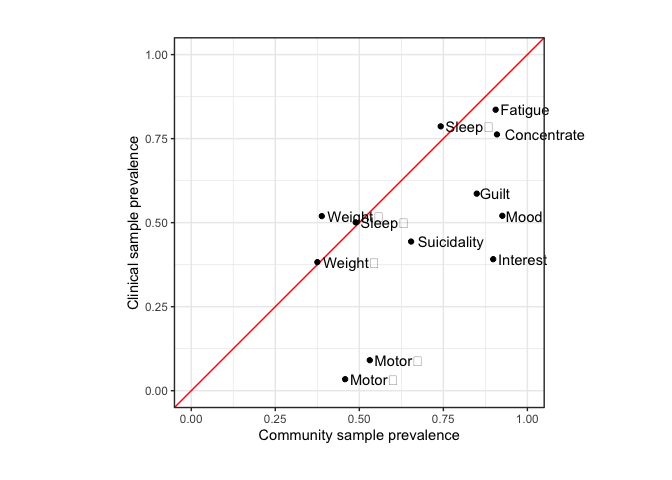

# Setup

## R packages

R version


```r
R.version
```

```
##                _                           
## platform       x86_64-generic-linux-gnu    
## arch           x86_64                      
## os             linux-gnu                   
## system         x86_64, linux-gnu           
## status                                     
## major          4                           
## minor          2.1                         
## year           2022                        
## month          06                          
## day            23                          
## svn rev        82513                       
## language       R                           
## version.string R version 4.2.1 (2022-06-23)
## nickname       Funny-Looking Kid
```

Package installation


```r
required_packages <- c('devtools', 'readr', 'tidyr', 'dplyr', 'ggplot2', 'stringr', 'corrplot')
for(pack in required_packages) if(!require(pack, character.only=TRUE)) install.packages(pack)

library(devtools)

if(!require(GenomicSEM)) install_github("MichelNivard/GenomicSEM")
```

GenomicSEM version

```r
require(readr)
```

```
## Loading required package: readr
```

```r
require(tidyr)
```

```
## Loading required package: tidyr
```

```r
require(stringr)
```

```
## Loading required package: stringr
```

```r
require(dplyr)
```

```
## Loading required package: dplyr
```

```
## 
## Attaching package: 'dplyr'
```

```
## The following objects are masked from 'package:stats':
## 
##     filter, lag
```

```
## The following objects are masked from 'package:base':
## 
##     intersect, setdiff, setequal, union
```

```r
require(ggplot2)
```

```
## Loading required package: ggplot2
```

```r
require(corrplot)
```

```
## Loading required package: corrplot
```

```
## corrplot 0.92 loaded
```

```r
require(GenomicSEM)
```

```
## Loading required package: GenomicSEM
```

```r
packageVersion("GenomicSEM")
```

```
## [1] '0.0.5'
```

## LD Score files

The LDSC support files first need to be downloaded and unpacked


```bash
# LD Score reference files
mkdir -p sumstats/reference
curl -L https://data.broadinstitute.org/alkesgroup/LDSCORE/eur_w_ld_chr.tar.bz2 > sumstats/reference/eur_w_ld_chr.tar.bz2
curl -L https://data.broadinstitute.org/alkesgroup/LDSCORE/w_hm3.snplist.bz2 > sumstats/reference/w_hm3.snplist.bz2


tar -xjf sumstats/reference/eur_w_ld_chr.tar.bz2 -C sumstats/reference
rm sumstats/reference/eur_w_ld_chr.tar.bz2
bunzip2 sumstats/reference/w_hm3.snplist.bz2
```

# Symptom labels

MDD DSM symptoms are numbered 1-9:


```r
# plot labels

dsm_mdd_symptoms_labels <-
read_delim("
MDD1;Mood;Mood;Dep
MDD2;Interest;Interest;Anh
MDD3;Weight⇅;Weight⇆;App
MDD3a;Weight⇊;Weight⇇;AppDec
MDD3b;Weight⇈;Weight⇉;AppInc
MDD4;Sleep⇅;Sleep⇆;Sle
MDD4a;Sleep⇊;Sleep⇇;SleDec
MDD4b;Sleep⇈;Sleep⇉;SleInc
MDD5;Motor⇅;Motor⇆;Moto
MDD5a;Motor⇈;Motor⇉;MotoInc
MDD5b;Motor⇊;Motor⇇;MotoDec
MDD6;Fatigue;Fatigue;Fatig
MDD7;Guilt;Guilt;Guilt
MDD8;Concentrate;Concentrate;Conc
MDD9;Suicidality;Suicidality;Sui
", col_names=c('ref', 'h', 'v', 'abbv'), delim=';')
```

```
## Rows: 15 Columns: 4
## ── Column specification ──────────────────────────────────────────────────
## Delimiter: ";"
## chr (4): ref, h, v, abbv
## 
## ℹ Use `spec()` to retrieve the full column specification for this data.
## ℹ Specify the column types or set `show_col_types = FALSE` to quiet this message.
```

```r
dsm_mdd_symptoms_reference <-
read_delim("
MDD1;Depressed mood most of the day, nearly every day
MDD2;Markedly diminished interest or pleasure in all, or almost all, activities most of the day, nearly every day
MDD3;Significant change in weight or appetite
MDD3a;Significant weight loss or decrease in appetite
MDD3b;Significant weight gain or increase in appetite
MDD4;Sleeping too much or not sleeping enough
MDD4a;Insomnia nearly every day
MDD4b;Hypersomnia nearly every day
MDD5;Changes in speed/amount of moving or speaking
MDD5a;Psychomotor agitation nearly every day
MDD5b;Psychomotor slowing nearly every day
MDD6;Fatigue or loss of energy nearly every day
MDD7;Feelings of worthlessness or excessive or inappropriate guilt
MDD8;Diminished ability to think or concentrate, or indecisiveness
MDD9;Recurrent thoughts of death or suicide or a suicide attempt or a specific plan for attempting suicide
", col_names=c('Reference', 'Description'), delim=';')
```

```
## Rows: 15 Columns: 2
## ── Column specification ──────────────────────────────────────────────────
## Delimiter: ";"
## chr (2): Reference, Description
## 
## ℹ Use `spec()` to retrieve the full column specification for this data.
## ℹ Specify the column types or set `show_col_types = FALSE` to quiet this message.
```

```r
dsm_mdd_symptoms_reference %>%
left_join(dsm_mdd_symptoms_labels, by=c('Reference'='ref')) %>%
select(Reference, Abbreviation=abbv, Label=h, Description)
```

<div class="kable-table">

|Reference |Abbreviation |Label       |Description                                                                                                  |
|:---------|:------------|:-----------|:------------------------------------------------------------------------------------------------------------|
|MDD1      |Dep          |Mood        |Depressed mood most of the day, nearly every day                                                             |
|MDD2      |Anh          |Interest    |Markedly diminished interest or pleasure in all, or almost all, activities most of the day, nearly every day |
|MDD3      |App          |Weight⇅     |Significant change in weight or appetite                                                                     |
|MDD3a     |AppDec       |Weight⇊     |Significant weight loss or decrease in appetite                                                              |
|MDD3b     |AppInc       |Weight⇈     |Significant weight gain or increase in appetite                                                              |
|MDD4      |Sle          |Sleep⇅      |Sleeping too much or not sleeping enough                                                                     |
|MDD4a     |SleDec       |Sleep⇊      |Insomnia nearly every day                                                                                    |
|MDD4b     |SleInc       |Sleep⇈      |Hypersomnia nearly every day                                                                                 |
|MDD5      |Moto         |Motor⇅      |Changes in speed/amount of moving or speaking                                                                |
|MDD5a     |MotoInc      |Motor⇈      |Psychomotor agitation nearly every day                                                                       |
|MDD5b     |MotoDec      |Motor⇊      |Psychomotor slowing nearly every day                                                                         |
|MDD6      |Fatig        |Fatigue     |Fatigue or loss of energy nearly every day                                                                   |
|MDD7      |Guilt        |Guilt       |Feelings of worthlessness or excessive or inappropriate guilt                                                |
|MDD8      |Conc         |Concentrate |Diminished ability to think or concentrate, or indecisiveness                                                |
|MDD9      |Sui          |Suicidality |Recurrent thoughts of death or suicide or a suicide attempt or a specific plan for attempting suicide        |

</div>


# Sumstats munging

GWAS of MDD symptoms for two cohorts were meta-analyzed:

- Population samples: ALSPAC + UK Biobankc
- Case-enriched samples: AGDS + PGC

Meta-analysis was conducted using the Ricopoli [daner](https://docs.google.com/document/d/1TWIhr8-qpCXB13WCXcU1_HDio8lC_MeWoAg2jlggrtU/edit) so the summary statistics are in the  ("**D**osage **An**alyz**er**) format. These can be munged with `munge_sumstats.py` from the [ldsc](https://github.com/bulik/ldsc) program. 

First we need to prepare files for the MDD5 symptoms for the population samples as these were only available in one cohorts (ALSPAC) and therefore not meta-analyzed. These just need to  be copied with the correct names and have sample size columns added.


```bash

mkdir -p meta/distribution/ALSPAC_UKB.MDD5a_psychomotorFast
mkdir -p meta/distribution/ALSPAC_UKB.MDD5b_psychomotorSlow

gunzip -c sumstats/aligned/daner_MDD5a_ALSPAC_CISR.txt.aligned.gz | awk 'BEGIN {OFS="\t"}; {if(NR == 1) {print "CHR", "SNP", "BP", "A1", "A2", "FRQ_A_113", "FRQ_U_3181", "INFO", "OR", "SE", "P", "Nca", "Nco", "Neff_half"} else {print $0, 113, 3181, 218.247}}' | gzip -c > meta/distribution/ALSPAC_UKB.MDD5a_psychomotorFast/daner_ALSPAC_UKB.MDD5a_psychomotorFast.gz

gunzip -c sumstats/aligned/daner_MDD5b_ALSPAC_CISR.txt.aligned.gz | awk 'BEGIN {OFS="\t"}; {if(NR == 1) {print "CHR", "SNP", "BP", "A1", "A2", "FRQ_A_299", "FRQ_U_2995", "INFO", "OR", "SE", "P", "Nca", "Nco", "Neff_half"} else {print $0, 299, 2995, 425.468}}' | gzip -c > meta/distribution/ALSPAC_UKB.MDD5b_psychomotorSlow/daner_ALSPAC_UKB.MDD5b_psychomotorSlow.gz

```

We find all daner files in the meta-analysis directory and loop them through the munge step.


```r
# Munge sumstats for all cohorts symptom GWASs

# find daner sumstats files for format daner_[COHORTS].MDD[N]_[SYMPTOM].gz
daner_files <- list.files("meta/distribution", pattern="^daner_[A-Z_]+\\.MDD[1-9][a-z]*_[A-Za-z]+\\.gz$", full.name=TRUE, recursive=TRUE)

# snp list reference file
hm3_file <- "sumstats/reference/w_hm3.snplist"

trait_names <- names(daner_files)

dir.create(file.path("meta", "munged"), showWarnings=FALSE)
dir.create(file.path("meta", "txt"), showWarnings=FALSE)

for(daner in daner_files) {

  # get traitname from daner filename
  daner_basename <- str_remove(basename(daner), '.gz')
  trait_name <- str_remove(daner_basename, 'daner_')
  
  sumstats_gz <- paste(trait_name, 'sumstats.gz', sep='.')
  munge_log <- paste(trait_name, 'munge.log', sep='_')
  
  if(!file.exists(file.path('meta', 'munged', sumstats_gz))) {
    # calculate effective sample size
    txt <- file.path('meta', 'txt', paste(trait_name, 'txt.gz', sep='.'))
    if(!file.exists(txt)) {
    
      daner_sumstats <- read_tsv(daner)
      txt_sumstats <- daner_sumstats %>%
        select(SNP, A1, A2, FRQ=starts_with('FRQ_A'), OR, SE, P, Neff_half) %>%
        transmute(SNP, A1, A2, FRQ, OR, SE, P, N=2*Neff_half)
    
      write_tsv(txt_sumstats, txt)
    }

    # munge daner sumstats with hm3
    munge(files=txt, hm3=hm3_file, trait.names=trait_name, info.filter=0.9, maf.filter=0.01)
    # move munged files
    file.rename(sumstats_gz, file.path('meta', 'munged', sumstats_gz))
    file.rename(munge_log, file.path('meta', 'munged', munge_log))
  }

}
```

# Symptom prevalences

Running [multivariable LDSC](https://github.com/MichelNivard/GenomicSEM/wiki/3.-Models-without-Individual-SNP-effects) requires knowing the sample prevalences and population prevalences of each symptom. Sample prevalences can be calculated from the GWAS summary statistics output but population prevalences have to be estimated.

## Population prevalences

We include a table of counts of symptom presence and absence for PGC cohorts


```r
pgc_symptom_counts <- read_table2('sumstats/PGC/CasesAllCohorts/pgc_dsm_symptom_counts.txt')
```

```
## Warning: `read_table2()` was deprecated in readr 2.0.0.
## Please use `read_table()` instead.
```

```r
pgc_symptom_counts %>%
  spread(Status, N) %>%
  unite(AbsentPresent, Absent, Present, sep=':') %>%
  mutate(MDD_counts=paste(MDD, '(absent:present)')) %>%
  select(-MDD) %>%
  spread(MDD_counts, AbsentPresent)
```

<div class="kable-table">

|Symptom |Case (absent:present) |Control (absent:present) |
|:-------|:---------------------|:------------------------|
|MDD1    |914:12689             |2809:364                 |
|MDD2    |1451:11671            |2591:234                 |
|MDD3a   |6370:7060             |2742:83                  |
|MDD3b   |9421:2930             |2804:21                  |
|MDD4a   |3340:10209            |2639:186                 |
|MDD4b   |7859:3440             |2793:32                  |
|MDD5a   |5533:5510             |2738:87                  |
|MDD5b   |6405:5815             |2756:69                  |
|MDD6    |1736:11833            |2602:223                 |
|MDD7    |3072:10113            |2703:122                 |
|MDD8    |1501:11209            |2719:106                 |
|MDD9    |6194:7221             |2779:46                  |

</div>

```r
pgc_symptom_counts %>% 
spread(Status, N) %>%
mutate(Total=Absent+Present) %>%
filter(MDD == 'Case') %>%
arrange(Total)
```

<div class="kable-table">

|MDD  |Symptom | Absent| Present| Total|
|:----|:-------|------:|-------:|-----:|
|Case |MDD5a   |   5533|    5510| 11043|
|Case |MDD4b   |   7859|    3440| 11299|
|Case |MDD5b   |   6405|    5815| 12220|
|Case |MDD3b   |   9421|    2930| 12351|
|Case |MDD8    |   1501|   11209| 12710|
|Case |MDD2    |   1451|   11671| 13122|
|Case |MDD7    |   3072|   10113| 13185|
|Case |MDD9    |   6194|    7221| 13415|
|Case |MDD3a   |   6370|    7060| 13430|
|Case |MDD4a   |   3340|   10209| 13549|
|Case |MDD6    |   1736|   11833| 13569|
|Case |MDD1    |    914|   12689| 13603|

</div>

Calculate symptom prevalences separately for cases and controls:


```r
pgc_symptom_prevalences <- 
pgc_symptom_counts %>%
  spread(Status, N) %>%
  mutate(prev=Present / (Present + Absent)) %>%
  select(-Absent, -Present) %>%
  spread(MDD, prev)

pgc_symptom_prevalences %>%
  left_join(dsm_mdd_symptoms_labels, by=c('Symptom'='ref')) %>%
  select(Symptom=h, Case, Control)
```

<div class="kable-table">

|Symptom     |      Case|   Control|
|:-----------|---------:|---------:|
|Mood        | 0.9328089| 0.1147179|
|Interest    | 0.8894223| 0.0828319|
|Weight⇊     | 0.5256888| 0.0293805|
|Weight⇈     | 0.2372278| 0.0074336|
|Sleep⇊      | 0.7534873| 0.0658407|
|Sleep⇈      | 0.3044517| 0.0113274|
|Motor⇈      | 0.4989586| 0.0307965|
|Motor⇊      | 0.4758592| 0.0244248|
|Fatigue     | 0.8720613| 0.0789381|
|Guilt       | 0.7670080| 0.0431858|
|Concentrate | 0.8819040| 0.0375221|
|Suicidality | 0.5382780| 0.0162832|

</div>

```r
pgc_symptom_sample_sizes <- 
pgc_symptom_counts %>%
group_by(Symptom) %>%
summarize(Ntotal=sum(N))
```

Estimation of population prevalence based on average case/control estimates depends on the prevalence of MDD (e.g., [15% in high income countries](https://www.annualreviews.org/doi/10.1146/annurev-publhealth-031912-114409))


```r
pgc_symptom_prev_size <- pgc_symptom_prevalences %>% 
  left_join(pgc_symptom_sample_sizes, by='Symptom')

case_control_prev_lm <- 
lm(Case ~ Control, data=pgc_symptom_prev_size, weights=Ntotal)

summary(case_control_prev_lm)
```

```
## 
## Call:
## lm(formula = Case ~ Control, data = pgc_symptom_prev_size, weights = Ntotal)
## 
## Weighted Residuals:
##     Min      1Q  Median      3Q     Max 
## -21.833  -8.900  -2.081   4.932  35.727 
## 
## Coefficients:
##             Estimate Std. Error t value Pr(>|t|)    
## (Intercept)  0.36979    0.06711   5.510 0.000258 ***
## Control      6.00913    1.18889   5.054 0.000496 ***
## ---
## Signif. codes:  0 '***' 0.001 '**' 0.01 '*' 0.05 '.' 0.1 ' ' 1
## 
## Residual standard error: 16.6 on 10 degrees of freedom
## Multiple R-squared:  0.7187,	Adjusted R-squared:  0.6906 
## F-statistic: 25.55 on 1 and 10 DF,  p-value: 0.000496
```

```r
ggplot(pgc_symptom_prev_size %>% left_join(dsm_mdd_symptoms_labels, by=c('Symptom'='ref')), aes(x=Control, y=Case, weight=Ntotal)) +
  geom_point() +
  stat_smooth(method='lm', fullrange=TRUE) +
  geom_text(hjust=-0.1, aes(label=h)) +
  scale_x_continuous('Sympotom prevalence among contols', limits=c(0, 0.15)) +
  scale_y_continuous('Symptom prevalence among cases') +
  coord_cartesian(xlim=c(0, 0.13), ylim=c(0, 1))
```

```
## `geom_smooth()` using formula 'y ~ x'
```

<!-- -->

Symptoms are are more likely to be present in MDD cases also have higher prevalence in MDD controls. Calculate symptom population prevalences weighted by MDD prevalence: $k_{\mathrm{MDD}N} = k_\mathrm{MDD} * k_{\mathrm{MDD}N,\mathrm{cases}} + (1 - k_\mathrm{MDD}) * k_{\mathrm{MDD}N,\mathrm{controls}}$.


```r
k <- 0.15
pgc_symptoms_pop_prev <- 
pgc_symptom_prevalences %>%
  transmute(Symptom, pop_prev=k*Case + (1-k)*Control)
 
pgc_symptoms_pop_prev %>%
  left_join(dsm_mdd_symptoms_labels, by=c('Symptom'='ref')) %>%
  select(Symptom=h, pop_prev)
```

<div class="kable-table">

|Symptom     |  pop_prev|
|:-----------|---------:|
|Mood        | 0.2374316|
|Interest    | 0.2038204|
|Weight⇊     | 0.1038268|
|Weight⇈     | 0.0419027|
|Sleep⇊      | 0.1689877|
|Sleep⇈      | 0.0552961|
|Motor⇈      | 0.1010208|
|Motor⇊      | 0.0921399|
|Fatigue     | 0.1979065|
|Guilt       | 0.1517592|
|Concentrate | 0.1641794|
|Suicidality | 0.0945824|

</div>

## Cohort sample prevalences

Read in headers from the daner files. The daner format contains headers for the frequency of the referenec allele in cases (A=Affected) and controls (U=Unaffected) where the column name includes the sample size (`FRQ_A_NNNN`, `FRQ_U_MMMM`)


```r
symptoms_sample_prev_file <- 'meta/symptoms_prev.txt'

if(!file.exists(symptoms_sample_prev_file)) {

  # list sumstats distribution directories
  distributions_dirs <- dir(file.path("meta", "distribution"))
  # construct filenames of daner sumstats
  daner_files <- sapply(distributions_dirs, function(dd) file.path("meta", "distribution", dd, paste0('daner_', dd, '.gz')))
  
  # pull out which cohorts and symptom 'x' this is from the filename (COHORTS_MDDx_*)
  cohorts_symptoms <- str_match(names(daner_files), '([A-Z_]+).(MDD[:digit:](a|b)?)')[,2:3]
  colnames(cohorts_symptoms) <- c('cohorts', 'symptom')
  
  # read in header and pull out 6th and 7th columns
  daner_nca_nco <- 
  bind_rows(lapply(daner_files, function(daner) {
      # # get sample size columns from file header
      daner_header <- read.table(daner, nrows=1)
      frq_a_col <- daner_header$V6
      frq_u_col <- daner_header$V7
      # extract sample size information for cases and controls
      nca <- as.integer(str_split(frq_a_col, pattern="_")[[1]][3])
      nco <- as.integer(str_split(frq_u_col, pattern="_")[[1]][3])
      return(data.frame(Nca=nca, Nco=nco))
  }), .id='sumstats')
  
  # merge and calculate sample prevalence
  symptoms_sample_prev <-
  cbind(cohorts_symptoms, daner_nca_nco) %>%
  mutate(samp_prev=Nca/(Nca+Nco))

  write_tsv(symptoms_sample_prev, symptoms_sample_prev_file)

} else {
  symptoms_sample_prev <- read_tsv(symptoms_sample_prev_file)
}
```

```
## Rows: 24 Columns: 6
## ── Column specification ──────────────────────────────────────────────────
## Delimiter: "\t"
## chr (3): cohorts, symptom, sumstats
## dbl (3): Nca, Nco, samp_prev
## 
## ℹ Use `spec()` to retrieve the full column specification for this data.
## ℹ Specify the column types or set `show_col_types = FALSE` to quiet this message.
```

```r
symptoms_sample_prev %>%
  left_join(dsm_mdd_symptoms_labels, by=c('symptom'='ref')) %>%
  select(Cohorts=cohorts, Ref=symptom, Symptom=h, Cases=Nca, Controls=Nco, `Sample prevalence`=samp_prev)
```

<div class="kable-table">

|Cohorts    |Ref   |Symptom     | Cases| Controls| Sample prevalence|
|:----------|:-----|:-----------|-----:|--------:|-----------------:|
|AGDS_PGC   |MDD1  |Mood        | 25820|     1623|         0.9408592|
|AGDS_PGC   |MDD2  |Interest    | 24488|     2421|         0.9100301|
|AGDS_PGC   |MDD3a |Weight⇊     |  9007|    13960|         0.3921714|
|AGDS_PGC   |MDD3b |Weight⇈     |  7510|    14436|         0.3422036|
|AGDS_PGC   |MDD4a |Sleep⇊      | 19368|     6310|         0.7542644|
|AGDS_PGC   |MDD4b |Sleep⇈      | 10559|    13011|         0.4479847|
|AGDS_PGC   |MDD5a |Motor⇈      | 10686|    12570|         0.4594943|
|AGDS_PGC   |MDD5b |Motor⇊      | 12511|    11838|         0.5138199|
|AGDS_PGC   |MDD6  |Fatigue     | 23523|     2179|         0.9152206|
|AGDS_PGC   |MDD7  |Guilt       | 21633|     3727|         0.8530363|
|AGDS_PGC   |MDD8  |Concentrate | 22808|     2020|         0.9186402|
|AGDS_PGC   |MDD9  |Suicidality | 17160|     8330|         0.6732052|
|ALSPAC_UKB |MDD1  |Mood        | 66886|    57613|         0.5372413|
|ALSPAC_UKB |MDD2  |Interest    | 48379|    76077|         0.3887237|
|ALSPAC_UKB |MDD3a |Weight⇊     | 24676|    37066|         0.3996631|
|ALSPAC_UKB |MDD3b |Weight⇈     | 13865|    47877|         0.2245635|
|ALSPAC_UKB |MDD4a |Sleep⇊      | 44655|    17377|         0.7198704|
|ALSPAC_UKB |MDD4b |Sleep⇈      | 10214|    51818|         0.1646570|
|ALSPAC_UKB |MDD5a |Motor⇈      |   113|     3181|         0.0343048|
|ALSPAC_UKB |MDD5b |Motor⇊      |   299|     2995|         0.0907711|
|ALSPAC_UKB |MDD6  |Fatigue     | 51630|    13398|         0.7939657|
|ALSPAC_UKB |MDD7  |Guilt       | 33127|    34370|         0.4907922|
|ALSPAC_UKB |MDD8  |Concentrate | 48052|    15943|         0.7508712|
|ALSPAC_UKB |MDD9  |Suicidality | 33984|    34035|         0.4996251|

</div>


```r
cohorts_sample_prev <-
symptoms_sample_prev %>%
  left_join(dsm_mdd_symptoms_labels, by=c('symptom'='ref')) %>%
  select(cohorts, samp_prev, h) %>%
  pivot_wider(names_from=cohorts, values_from=samp_prev)

ggplot(cohorts_sample_prev, aes(x=AGDS_PGC, y=ALSPAC_UKB)) +
geom_abline(col='red') +
geom_point() +
geom_text(aes(label=h), hjust=-0.1) +
scale_x_continuous('AGDS/PGC sample prevalence', breaks=c(0, 0.25, 0.5, 0.75, 1), limits=c(0, 1)) +
scale_y_continuous('ALSPAC/UKB sample prevalence', breaks=c(0, 0.25, 0.5, 0.75, 1), limits=c(0, 1)) +
coord_fixed(clip='off') +
theme_bw() +
theme(plot.margin=unit(c(1, 1, 1, 1), 'cm'))
```

<!-- -->

```r
ggsave('mdd-symptom-gsem_files/cohorts_symptoms_prev.png', width=5.5, height=5.5)
```

Correlation (Spearman's rho) between sample prevalences in UKB CIDI and PGC DSM:


```r
with(cohorts_sample_prev, cor.test(AGDS_PGC, ALSPAC_UKB, method='spearman', use='pair'))
```

```
## 
## 	Spearman's rank correlation rho
## 
## data:  AGDS_PGC and ALSPAC_UKB
## S = 86, p-value = 0.01454
## alternative hypothesis: true rho is not equal to 0
## sample estimates:
##       rho 
## 0.6993007
```

## Population prevalences

Combine the sample prevalences weighted by assuming 15% population prevalence of MDD and 57% of UKB participants screening positively for mood or anhedonia.


```r
pop_prevs_w <-
symptoms_sample_prev %>%
mutate(w=case_when(cohorts == 'AGDS_PGC' ~ 0.15,
                   symptom %in% c('MDD1', 'MDD2') ~ 1.0,
                   TRUE ~ 0.57)) %>%
mutate(pop_prev=samp_prev*w) %>%
select(symptom, cohorts, pop_prev) %>%
pivot_wider(names_from=cohorts, values_from=pop_prev) %>%
group_by(symptom) %>%
mutate(pop_prev=mean(c(AGDS_PGC, ALSPAC_UKB))) %>%
select(symptom, pop_prev)

pop_prevs_w
```

<div class="kable-table">

|symptom |  pop_prev|
|:-------|---------:|
|MDD1    | 0.3391851|
|MDD2    | 0.2626141|
|MDD3a   | 0.1433168|
|MDD3b   | 0.0896659|
|MDD4a   | 0.2617329|
|MDD4b   | 0.0805261|
|MDD5a   | 0.0442389|
|MDD5b   | 0.0644063|
|MDD6    | 0.2949218|
|MDD7    | 0.2038535|
|MDD8    | 0.2828963|
|MDD9    | 0.1928835|

</div>


# Multivariable LDSC estimation

We list out the munged sumstats for AGDS/PGC and ALSPAC/UKB and unify them with sample and population prevalences, using the symptom reference from the sumstats filename. Sumstats were munged using effective sample size, so we substitute `0.5` as the sample prevalences. We then calculate the multivariable LDSC genomic covariance matrix and write it out as deparsed R code. We use deparsed code instead of R data object serialization (`save()` or `saveRDS()`) so that the data can be inspected with a text editor to check that it does not contain individual-level data before being committed to the version control system. A simple caching strategy is employed to check whether the covariance structure already exists and, if so, to parse it rather than re-running the LD score calculation.

AGDS+PGC and ALSPAC+UKB sumstats

```r
covstruct_prefix <- 'agds_pgc.alspac_ukb.covstruct'
covstruct_r <- file.path('ldsc', paste(covstruct_prefix, 'deparse.R', sep='.'))
covstruct_rds <- file.path('ldsc', paste(covstruct_prefix, 'rds', sep='.'))

if(!file.exists(covstruct_r)) {

  # list sumstats distribution directories
  sumstats_files <- list.files(file.path('meta', 'munged'), '(AGDS_PGC|ALSPAC_UKB).+sumstats\\.gz$', full.names=TRUE)

  # pull out which cohorts and symptom 'x' this is from the filename (COHORTS_MDDx_*)
  cohorts_symptoms <- str_match(basename(sumstats_files), '([A-Z_]+).(MDD[:digit:](a|b)?)')[,1]

  sumstats_paths <- data.frame(filename=sumstats_files, sumstats=str_remove(basename(sumstats_files), '.sumstats.gz'))

  sumstats_prevs <- 
    symptoms_sample_prev %>%
    left_join(sumstats_paths, by='sumstats') %>%
    left_join(pop_prevs_w, by='symptom') %>%
    mutate(trait_name=paste(cohorts, symptom, sep='.'))

  write_tsv(sumstats_prevs, file.path('ldsc', paste(covstruct_prefix, 'prevs', 'txt', sep='.')))

  symptoms_covstruct <- ldsc(traits=sumstats_prevs$filename,
                             sample.prev=rep(0.5, times=length(sumstats_prevs$samp_prev)),
                             population.prev=sumstats_prevs$pop_prev,
                             ld='sumstats/reference/eur_w_ld_chr/',
                             wld='sumstats/reference/eur_w_ld_chr/',
                             trait.names=sumstats_prevs$trait_name)

  dput(symptoms_covstruct, covstruct_r, control=c('exact'))
  saveRDS(symptoms_covstruct, covstruct_rds)
  
  # check for exact match of deparsed object
  identical(dget(covstruct_r), symptoms_covstruct)

} else {

  symptoms_covstruct <- dget(covstruct_r)

  sumstats_prevs <- read_tsv(file.path('ldsc', paste(covstruct_prefix, 'prevs', 'txt', sep='.')))

}
```

```
## Warning in ldsc(traits = sumstats_prevs$filename, sample.prev = rep(0.5, :
## Your genetic covariance matrix includes traits estimated to have a negative
## heritability.
```


AGDS+PGC+ALSPAC+UKB sumstats

```r
all_covstruct_prefix <- 'all.covstruct'
all_covstruct_r <- file.path('ldsc', paste(all_covstruct_prefix, 'deparse.R', sep='.'))
all_covstruct_rds <- file.path('ldsc', paste(all_covstruct_prefix, 'rds', sep='.'))

if(!file.exists(all_covstruct_r)) {

  # list sumstats distribution directories
  all_sumstats_files <- list.files(file.path('meta', 'munged'), 'ALL.+sumstats\\.gz$', full.names=TRUE)

  # pull out which cohorts and symptom 'x' this is from the filename (COHORTS_MDDx_*)
  all_cohorts_symptoms <- str_match(basename(all_sumstats_files), '([A-Z_]+).(MDD[:digit:](a|b)?)')[,1]

  all_sumstats_paths <- data.frame(filename=all_sumstats_files, sumstats=str_remove(basename(all_sumstats_files), '.sumstats.gz'))

  all_sumstats_prevs <- 
    all_sumstats_paths %>%
    mutate(trait_name=all_cohorts_symptoms) %>%
    mutate(symptom=str_match(sumstats, "ALL\\.(MDD[1-9a-b]+)_")[,2]) %>%
    left_join(pop_prevs_w, by='symptom') 
    
   write_tsv(all_sumstats_prevs, file.path('ldsc', paste(all_covstruct_prefix, 'prevs', 'txt', sep='.')))

  all_symptoms_covstruct <- ldsc(traits=all_sumstats_prevs$filename,
                             sample.prev=rep(0.5, times=length(all_sumstats_prevs$samp_prev)),
                             population.prev=all_sumstats_prevs$pop_prev,
                             ld='sumstats/reference/eur_w_ld_chr/',
                             wld='sumstats/reference/eur_w_ld_chr/',
                             trait.names=all_sumstats_prevs$trait_name)

  dput(all_symptoms_covstruct, all_covstruct_r, control=c('exact'))
  saveRDS(all_symptoms_covstruct, all_covstruct_rds)
  
  # check for exact match of deparsed object
  identical(dget(all_covstruct_r), all_symptoms_covstruct)

} else {

  all_symptoms_covstruct <- dget(covstruct_r)
  
  all_sumstats_prevs <- read_tsv(file.path('ldsc', paste(all_covstruct_prefix, 'prevs', 'txt', sep='.')))

}
```

```
## Warning in ldsc(traits = all_sumstats_prevs$filename, sample.prev = rep(0.5, :
## Your genetic covariance matrix includes traits estimated to have a negative
## heritability.
```

## Heritabilities

Run LDSC, using sumstats filenames and estimated prevalences to construct command line arguments for `ldsc.py`. Symptoms with negative heritabilities in PGC cohorts are plotted in a separate facet with its own scale.


```r
sumstats_h2_txt <- 'ldsc/symptoms.h2.txt'

if(!file.exists(sumstats_h2_txt)) {
    
  sumstats_info <- bind_rows(sumstats_prevs, all_sumstats_prevs)

  sumstats_h2 <- plyr::adply(sumstats_info, 1, function(x) {
    
    filename <- x$filename
    samp_prev <- 0.5
    pop_prev <- x$pop_prev
    outname <- paste(filename, 'h2', sep='.')
    logfile <- paste(outname, 'log', sep='.')

    print(filename)
  
  
    #if(!file.exists(logfile)) {
    if(!is.na(samp_prev)) {
       ldsc_command <- paste('ldsc.py --h2', filename, '--ref-ld-chr sumstats/reference/eur_w_ld_chr/ --w-ld-chr sumstats/reference/eur_w_ld_chr/ --out', outname, '--samp-prev', samp_prev, '--pop-prev', pop_prev)
    } else {
       ldsc_command <- paste('ldsc.py --h2', filename, '--ref-ld-chr sumstats/reference/eur_w_ld_chr/ --w-ld-chr sumstats/reference/eur_w_ld_chr/ --out', outname)
    }
    system(ldsc_command)
    #}
  
    h2_log <- read.table(logfile, sep='\t', stringsAsFactors=F)
  
    h2_row <- h2_log$V1[str_detect(h2_log$V1, 'h2:')]
    h2_est_str <- str_extract_all(str_split(h2_row, ':')[[1]][2], '[0-9.\\-]+')[[1]]
    h2 <- as.numeric(h2_est_str[1])
    se <- as.numeric(h2_est_str[2])

    lambda_row <- h2_log$V1[str_detect(h2_log$V1, 'Lambda GC:')]
    lambda_est_str <- str_extract_all(str_split(lambda_row, ':')[[1]][2], '[0-9.\\-]+')[[1]]
    LambdaGC <- as.numeric(lambda_est_str)
  
    meanchisq_row <- h2_log$V1[str_detect(h2_log$V1, 'Mean Chi\\^2:')]
    meanchisq_est_str <- str_extract_all(str_split(meanchisq_row, ':')[[1]][2], '[0-9.\\-]+')[[1]]
    MeanChiSq <- as.numeric(meanchisq_est_str)

    intercept_row <- h2_log$V1[str_detect(h2_log$V1, 'Intercept:')]
    intercept_est_str <- str_extract_all(str_split(intercept_row, ':')[[1]][2], '[0-9.\\-]+')[[1]]
    Intercept <- as.numeric(intercept_est_str[1])
    InterceptSE <- as.numeric(intercept_est_str[2])

    return(data.frame(h2, se, LambdaGC, MeanChiSq, Intercept, InterceptSE))
  
  })

  write_tsv(sumstats_h2, sumstats_h2_txt)

} else {

  sumstats_h2 <- read_tsv(sumstats_h2_txt)

}
```

```
## Rows: 36 Columns: 15
## ── Column specification ──────────────────────────────────────────────────
## Delimiter: "\t"
## chr  (5): cohorts, symptom, sumstats, filename, trait_name
## dbl (10): Nca, Nco, samp_prev, pop_prev, h2, se, LambdaGC, MeanChiSq, Interc...
## 
## ℹ Use `spec()` to retrieve the full column specification for this data.
## ℹ Specify the column types or set `show_col_types = FALSE` to quiet this message.
```


```r
sumstats_h2_labels <-
as_tibble(sumstats_h2) %>%
mutate(ref=paste0('MDD', str_extract(trait_name, '[:digit:](a|b)?')),
       study=str_replace(str_extract(trait_name, '[A-Z_]+'), '_', '+')) %>%
left_join(dsm_mdd_symptoms_labels, by='ref') %>%
mutate(cohorts=case_when(study == 'AGDS+PGC' ~ "Clinical (AGDS+PGS)",
                         study == 'ALSPAC+UKB' ~ "Population (ALSPAC+UKB)",
                         TRUE ~ 'All'))
       
#        %>%
# # split negative estimates into their own facet
# mutate(study_est=case_when(study == 'PGC' & h2 > 0 ~ 'PGC (+)',
#                            study == 'PGC' & h2 <= 0 ~ 'PGC (-)',
#                            TRUE ~ study)) %>%
# filter(is.na(sub_study) | sub_study == '_M') %>%
# mutate(a=1) %>%
# # insert invisible placeholder estimates so that the positive estimates are
# # all plotted on common scale even though the facet has `scale='free'`
# bind_rows(tibble(study_est=rep(c('PGC (-)', 'PGC (+)', 'UKB CIDI', 'UKB PHQ'), times=2),
#                  h='Mood',
#                  a=0,
#                  h2=rep(c(0, 0.26), each=4),
#                  se=0.0))

# filter out traits below sample size cutoff
mdd_symptom_gsem_h2.gg <-
ggplot(sumstats_h2_labels,
        aes(x=abbv,
            y=h2,
            ymin=h2+se*qnorm(0.025),
            ymax=h2+se*qnorm(0.975),
            colour=cohorts, shape=cohorts)) +
geom_hline(yintercept=0, col='grey') +
geom_pointrange(position=position_dodge(width=0.5)) + 
scale_x_discrete('Symptom', limits=rev(unique(sumstats_h2_labels$abbv))) +
scale_y_continuous(expression(h[SNP]^2)) +
theme_bw() + 
theme(axis.text.y=element_text(size=13),
      axis.text.x=element_text(size=10),
      axis.title=element_text(size=12),
      legend.title=element_text(size=12),
      legend.text=element_text(size=14),
      legend.position='top') +
 labs(color  = "Meta-analysis:", shape = "Meta-analysis:")

mdd_symptom_gsem_h2.gg + coord_flip(ylim=c(-0.76, 0.16)) +
scale_y_continuous(expression(h[SNP]^2),
    breaks=c(-0.8, -0.7, -0.6, -0.5, -0.4, -0.3, -0.2, -0.1, 0, 0.1, 0.2))
```

```
## Scale for 'y' is already present. Adding another scale for 'y', which will
## replace the existing scale.
```

<!-- -->

```r
ggsave('mdd-symptom-gsem_files/symptoms_h2_snp.png', width=8, height=4)
```


## Genetic correlation with MDD

Examine how each symptom genetically correlates with MDD case/control status. Positive correlation may suggest the presence of a symptom is a more extreme form of caseness while a negative or zero correlation suggests it is a primary feature of caseness. Use sumstats from PGC cohorts so that phenotype is diagnosed depression. 


```bash
# Munge sumstats for other MDD sumstats

for sumstats in $(ls sumstats/PGC/MDD/daner_*.gz); do

        prefix=$(basename $sumstats .gz)

        munge_sumstats.py --daner-n \
        --sumstats $sumstats \
        --merge-alleles sumstats/reference/w_hm3.snplist \
        --out sumstats/PGC/OtherMDD/${prefix}.ldsc

done

```


```r
mdd29_sumstats_gz <- 'sumstats/PGC/MDD/daner_MDD29.0515a_mds6.0316.ldsc.sumstats.gz'
outname <- paste(mdd29_sumstats_gz, 'rg', sep='.')
logfile <- paste(outname, 'log', sep='.')

if(!file.exists(logfile)) {

  # string together rg and prevalence arguments, separated by commas
  rg_arg <- paste(c(mdd29_sumstats_gz, sumstats_info$filename), collapse=',')
  samp_prev_list <- c(16823/25632, rep(0.5, length(sumstats_info$samp_prev)))
  # use 'nan' for prevalences of quantitative traits 
  samp_prev_arg <- paste(samp_prev_list, collapse=',')
  pop_prev_list <- c(0.15, sumstats_info$pop_prev)
  pop_prev_arg <- paste(ifelse(is.na(pop_prev_list), yes='nan', no=as.character(pop_prev_list)), collapse=',')

  ldsc_command <- paste('/Users/mark/Work/mdd-meta/resources/ldsc/ldsc/ldsc.py --rg', rg_arg, '--ref-ld-chr sumstats/reference/eur_w_ld_chr/ --w-ld-chr sumstats/reference/eur_w_ld_chr/ --out', outname, '--samp-prev', samp_prev_arg, '--pop-prev', pop_prev_arg)

  system(ldsc_command)

}

rg_log <- readLines(logfile)

start_of_results <- which(str_detect(rg_log, 'Summary of Genetic Correlation Results')) + 1
end_of_results <- which(str_detect(rg_log, 'Analysis finished at'))-1

rg_results <- rg_log[start_of_results:end_of_results]

mdd_rgs <- read_table2(paste(rg_results, collapse='\n'))
```


```r
other_mdd_rg_refs <- 
as_tibble(mdd_rgs) %>%
left_join(sumstats_info, by=c('p2'='filename')) %>%
mutate(ref=paste0('MDD', str_extract(trait_name, '[:digit:](a|b)?')),
       study=str_replace(str_extract(trait_name, '[A-Z_]+'), '_', ' ')) %>%
left_join(dsm_mdd_symptoms_labels, by='ref')

ggplot(other_mdd_rg_refs,
      aes(x=h, y=rg, ymin=rg+se*qnorm(0.025), ymax=rg+se*qnorm(0.975))) +
geom_hline(yintercept=0, col='grey') +
geom_hline(yintercept=1, col='grey') +
geom_pointrange() +
facet_grid(cols=vars(study)) +
scale_x_discrete('Symptoms', limits=rev(unique(other_mdd_rg_refs$h))) +
scale_y_continuous('r[g](PGC MDD)') +
coord_flip(ylim=c(-1, 1)) +
theme_bw() + 
theme(axis.text.y=element_text(size=12, family='Apple Symbols'))


ggsave('mdd-symptom-gsem_files/symptoms_mdd_rg_snp.png', width=10, height=4)
```

## Correlation matrix

Load phenotypic correlations 


```r
ukb_cidi_phq_cor <- dget('sumstats/UKB/ukb_cidi_phq_mixed_cor.deparse.R')

pgc_dsm_cor <- dget('sumstats/PGC/CasesAllCohorts/pgc_cases_tetra_cor.deprase.R')


symptoms_pgc_cidi_phqm <- 
c("PGC1", "PGC2", "PGC3a", "PGC3b", "PGC4a", "PGC4b", "PGC5a", 
"PGC5b", "PGC6", "PGC7", "PGC8", "PGC9", "UKB_CIDI1", "UKB_CIDI2", 
"UKB_CIDI3a", "UKB_CIDI3b", "UKB_CIDI4a", "UKB_CIDI4b", "UKB_CIDI6", 
"UKB_CIDI7", "UKB_CIDI8", "UKB_CIDI9",  "UKB_PHQ1_M", "UKB_PHQ2_M", "UKB_PHQ3_M", 
"UKB_PHQ4_M", "UKB_PHQ5_M",  "UKB_PHQ6_M", "UKB_PHQ7_M", "UKB_PHQ8_M", "UKB_PHQ9_M")

pheno_cor <- matrix(NA, nrow=length(symptoms_pgc_cidi_phqm), ncol=length(symptoms_pgc_cidi_phqm), dimnames=list(symptoms_pgc_cidi_phqm, symptoms_pgc_cidi_phqm))


pheno_cor[13:31,13:31] <- ukb_cidi_phq_cor$rho[c(-3,-6), c(-3, -6)]

pheno_cor[1:12,1:12] <- pgc_dsm_cor$rho
```


```r
cov_pos <- which(diag(symptoms_covstruct$S) > 0)

symptoms_cor <- cov2cor(symptoms_covstruct$S[cov_pos,cov_pos])
symptoms_cor[which(symptoms_cor > 1)] <- 1
symptoms_cor[which(symptoms_cor < -1)] <- -1
rownames(symptoms_cor) <- colnames(symptoms_cor)

corrplot(symptoms_cor, 'square')

symptoms_pgc_cidi_phqm_cor <- symptoms_cor[symptoms_pgc_cidi_phqm,symptoms_pgc_cidi_phqm]

# phenotypic correlations in upper diagonal

symptoms_pgc_cidi_phqm_cor[upper.tri(symptoms_pgc_cidi_phqm_cor)] <- pheno_cor[upper.tri(pheno_cor)]

corrplot(symptoms_pgc_cidi_phqm_cor, 'square', na.label='.')

# # output for presentation
# dsm_horizontal_labels <- dsm_mdd_symptoms_labels$h
# dsm_vertical_labels <- dsm_mdd_symptoms_labels$v
# names(dsm_horizontal_labels) <- names(dsm_vertical_labels) <- dsm_mdd_symptoms_labels$ref

# symptoms_pgc_cidi_phqm_cor_refs <- paste0('MDD', str_extract(colnames(symptoms_pgc_cidi_phqm_cor), '[:digit:](a|b)?'))

# symptoms_pgc_cidi_phqm_cor_present <- symptoms_pgc_cidi_phqm_cor

# rownames(symptoms_pgc_cidi_phqm_cor_present) <- dsm_horizontal_labels[symptoms_pgc_cidi_phqm_cor_refs]
# colnames(symptoms_pgc_cidi_phqm_cor_present) <- dsm_vertical_labels[symptoms_pgc_cidi_phqm_cor_refs]

# png('mdd-symptom-gsem_files/symptoms_pgc_cidi_phqm_cor.png', width=3000, height=3000, pointsize=60)
# corrplot(symptoms_pgc_cidi_phqm_cor_present, 'square', na.label='.')
# dev.off()
```
