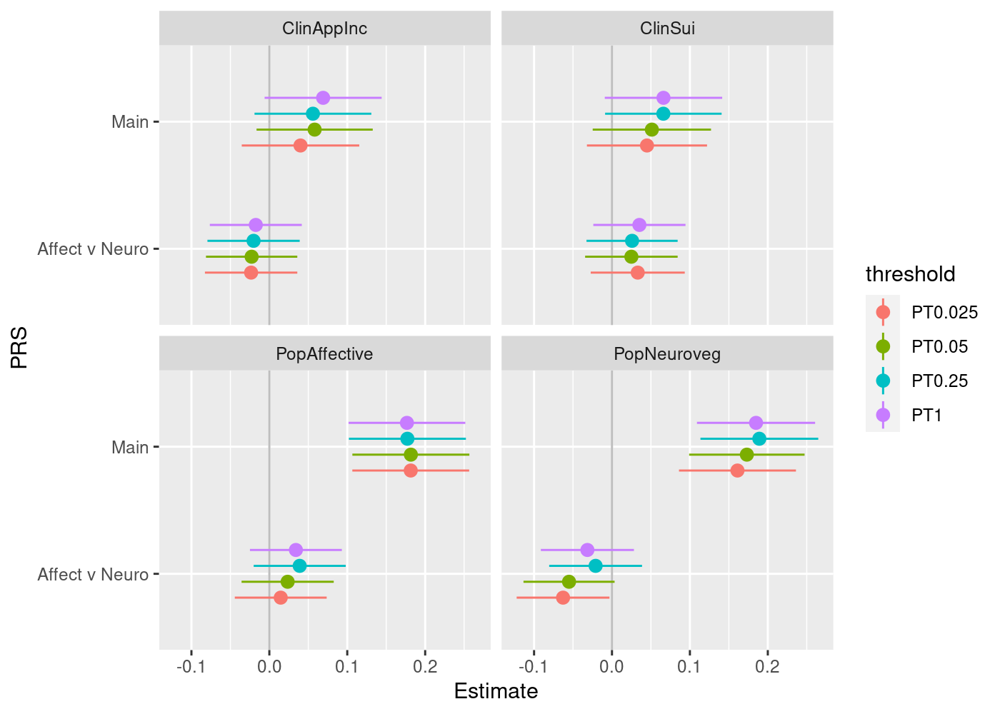
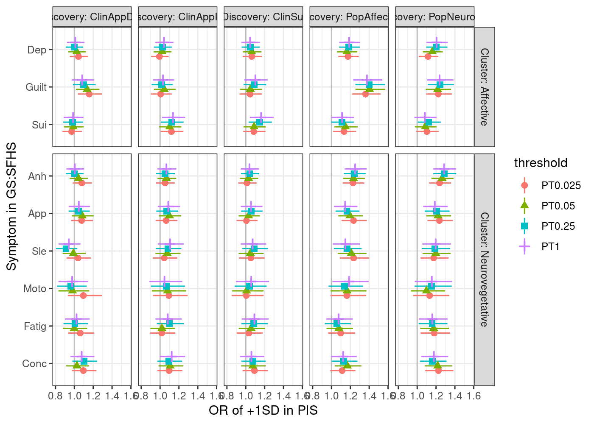
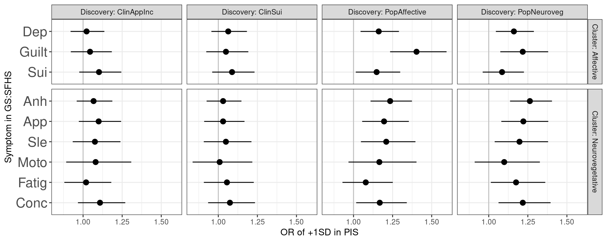

Polygenic index of depression symptoms predicting symptoms in GS
================

Polygenic indices were calculated from GWAS of MDD symptoms and common factor GWAS of sypmtoms in MDD-enriched ("Clinical") and non-enriched ("Population") cohorts and tested in Generation Scotland (GS). PRS were calculated using clumping and thresholding in PRSice at the p-value that was the best predictor of MDD status in GS.

``` {.r}
library(dplyr)
library(readr)
library(tidyr)
library(stringr)
library(ggplot2)
library(lme4)
library(fdrtool)
library(doParallel)

registerDoParallel(cores=4)
```

List of symptoms PRS:

``` {.r}
gwas_symptoms <- c('common', 'affect', 'neuroveg')
names(gwas_symptoms) <- gwas_symptoms

gwas_all_scores <- lapply(gwas_symptoms,
    function(gwas)
    read_table(here::here('prs', paste0(gwas, '_all.all.score'))) %>%
    mutate(across(!c(FID, IID), ~scale(.)[,1])) %>%
    rename_with(~paste0('PT', .x), !c(FID, IID)))
```

Get GenScot MDD SCID and CIDI symptoms, covariates, pedigree, and PCs

``` {.r}
scid <- read_csv(here::here('prs/genscot/phenotypes/SCID_QC_201113_GWASids.csv'))
cidi <- local({load(here::here("prs/genscot/phenotypes/GS_Recontact/STRADL.Rdata")); return(as_tibble(x))})
agesex <- read_csv(here::here("prs/genscot//phenotypes/agesex_all.csv"))
pedigree <- read_csv(here::here("prs/genscot/phenotypes/PEDIGREES/pedigree_031116.csv"))
pcs <- read_csv(here::here("prs/genscot/genetics/genotypes/GS20K_PLINK_files/PCA_MDS_components/HM3mds2R.mds.csv"))
unrel <- read_table(here::here('prs/genscot/genetics/genotypes/GS20K_GCTA_basic/GRMs/unrelated_t0.025_7388/QCdGS20K_unrelated_t0.025.grm.id'), col_names=c('FID', 'IID'))
```

Harmonise the symptoms data

``` {.r}
scid_threshold <- function(A) {
    case_when(A == 1 ~ 0L,
              A %in% 2:3 ~ 1L,
              TRUE ~ NA_integer_)
}

scid_symptoms_current <- scid %>%
select(IID=gwas,
Dep=A1,    Anh=A2, 
App=A3, #AppDec=A4, AppInc=A5,
Sle=A6,   #SleDec=A7, SleInc=A8,
Moto=A9,  #MotoInc=A10, MotoDec=A11,
Fatig=A12, Guilt=A13, Conc=A16, Sui=A19) %>%
mutate(across(Dep:Sui, .fns=scid_threshold)) %>%
mutate(instrument='SCID', timeframe='current')

scid_symptoms_past <- scid %>%
select(IID=gwas,
Dep=A52,    Anh=A53, 
App=A54, #AppDec=A55, AppInc=A56,
Sle=A57,    #SleDec=A58, SleInc=A59, 
Moto=A60,  #MotoInc=A61, MotoDec=A62,
Fatig=A63, Guilt=A64,  Conc=A67,  Sui=A70) %>%
mutate(across(Dep:Sui, scid_threshold)) %>%
mutate(instrument='SCID', timeframe='past')

cidi_weight_threshold <- function(A) {
    case_when(A == 3 ~ 0L,
              A %in% 1:2 ~ 1L,
              TRUE ~ NA_integer_)
}

cidi_symptoms_past <- cidi %>%
transmute(IID=id, 
Dep=CIDI1,
Anh=CIDI2,
Fatig=CIDI5,
App=cidi_weight_threshold(CIDI6),
Sle=CIDI7,
Conc=CIDI8,
Guilt=CIDI9,
Sui=CIDI10) %>%
mutate(instrument='CIDI', timeframe='past')
```

Arrange symptoms into repeated measures format

``` {.r}
symptom_values <- 
bind_rows(scid_symptoms_current, scid_symptoms_past, cidi_symptoms_past) %>%
pivot_longer(cols=Dep:Sui, names_to='symptom', values_to='affected') %>%
filter(!is.na(affected)) %>%
mutate(sym_factorAvN=case_when(symptom %in% c("Dep", "Guilt", "Sui") ~ 0.5,
                       symptom %in% c("Anh", "App", "Sle", "Moto", "Fatig", "Conc") ~ -0.5,
                       TRUE ~ NA_real_),
       sym_cardinal=case_when(symptom %in% c("Dep", "Anh") ~ 0.5,
                              TRUE ~ -0.5))
```

Age at measurement occasions

``` {.r}
covariates <- 
bind_rows(
agesex %>% transmute(IID=id, age, instrument='SCID'),
cidi %>% transmute(IID=id, age=Age, instrument='CIDI')) %>%
inner_join(agesex %>% select(IID=id, sex)) %>%
inner_join(pcs, by=('id'='IID')) %>%
mutate(agez=scale(age)[,1])
```

    ## Joining, by = "IID"

Transform PRS to long format

``` {.r}
gwas_all_scores_long <-
plyr::ldply(gwas_all_scores, I) %>%
pivot_longer(cols=PT0.025:PT1, names_to='threshold', values_to='PRS') %>%
rename(discovery=.id)
```

Unrelated sample

``` {.r}
unrel_scores <- gwas_all_scores_long %>%
filter(IID %in% unrel$IID)
```

Compare to polygenic indices.

``` {.r}
prs_models <-
plyr::dlply(.data=unrel_scores,
.variables=c("discovery", "threshold"),
.parallel=TRUE,
.fun=function(scores) {
    # merge the selected predictor symptom PRS and threshold with outcome data
    sym_prs <- scores %>%
    inner_join(symptom_values, by='IID') %>%
    left_join(covariates, by=c('IID', 'instrument'))
    
    # fit repeated measures family model
    sym_thresh_model <- glmer(affected ~ 1 + agez + sex +
        C1 + C2 + C3 + C4 +
        timeframe + symptom +
        PRS + PRS:sym_factorAvN +
        (1|IID), data=sym_prs, family='binomial', nAGQ=0)

    return(sym_thresh_model)
})
```

``` {.r}
prs_symptoms_models <-
plyr::dlply(.data=unrel_scores,
.variables=c("discovery", "threshold"),
.parallel=TRUE,
.fun=function(scores) {
    # merge the selected predictor symptom PRS and threshold with outcome data
    sym_prs <- scores %>%
    inner_join(symptom_values, by='IID') %>%
    left_join(covariates, by=c('IID', 'instrument'))
    
    # fit repeated measures family model
    sym_thresh_model <- glmer(affected ~ 1 + agez + sex +
        C1 + C2 + C3 + C4 +
        timeframe + symptom +
        PRS + PRS:symptom +
        (1|IID), data=sym_prs, family='binomial', nAGQ=0)

    return(sym_thresh_model)
})
```

Examine models

``` {.r}
# constant (fixed) effects
model_coefs <-
plyr::ldply(prs_models, function(model) as_tibble(summary(model)$coefficients, rownames='term')) %>%
as_tibble() %>%
mutate(GWAS=recode(discovery, common='Common','affect'='Affective', 'neuroveg'='Neuroveg'))

model_coefs_prs <-
model_coefs %>% filter(str_detect(term, 'PRS')) %>%
mutate(PRS=case_when(term == 'PRS' ~ 'Main',
                     term == 'PRS:sym_factorAvN' ~ 'Affect v Neuro'))
                     
ggplot(model_coefs_prs, aes(x=PRS, y=Estimate, ymax=Estimate+2*`Std. Error`, ymin=Estimate-2*`Std. Error`, colour=threshold)) +
geom_hline(yintercept=0, color='gray') +
geom_pointrange(position=position_dodge(width = 0.5)) +
facet_wrap(~GWAS) +
coord_flip() 
```



``` {.r}
knitr::kable(transmute(model_coefs_prs, GWAS, threshold, term, OR=exp(Estimate), p=`Pr(>|z|)`))
```

|GWAS|threshold|term|OR|p|
|:---|:--------|:---|--:|--:|
|Affective|PT0.025|PRS|1.1807455|0.0000103|
|Affective|PT0.025|PRS:sym\_factorAvN|1.0009552|0.9739443|
|Affective|PT0.05|PRS|1.2111563|0.0000003|
|Affective|PT0.05|PRS:sym\_factorAvN|1.0032325|0.9120191|
|Affective|PT0.25|PRS|1.2149004|0.0000002|
|Affective|PT0.25|PRS:sym\_factorAvN|1.0203745|0.4919715|
|Affective|PT1|PRS|1.2078716|0.0000005|
|Affective|PT1|PRS:sym\_factorAvN|1.0253866|0.3964038|
|Common|PT0.025|PRS|1.2301321|0.0000000|
|Common|PT0.025|PRS:sym\_factorAvN|0.9899789|0.7304696|
|Common|PT0.05|PRS|1.2485850|0.0000000|
|Common|PT0.05|PRS:sym\_factorAvN|0.9866260|0.6439492|
|Common|PT0.25|PRS|1.2728336|0.0000000|
|Common|PT0.25|PRS:sym\_factorAvN|0.9892555|0.7184299|
|Common|PT1|PRS|1.2493043|0.0000000|
|Common|PT1|PRS:sym\_factorAvN|0.9959750|0.8923869|
|Neuroveg|PT0.025|PRS|1.1865440|0.0000053|
|Neuroveg|PT0.025|PRS:sym\_factorAvN|0.9459191|0.0568833|
|Neuroveg|PT0.05|PRS|1.2466731|0.0000000|
|Neuroveg|PT0.05|PRS:sym\_factorAvN|0.9460055|0.0586212|
|Neuroveg|PT0.25|PRS|1.2413916|0.0000000|
|Neuroveg|PT0.25|PRS:sym\_factorAvN|0.9589762|0.1516581|
|Neuroveg|PT1|PRS|1.2279930|0.0000001|
|Neuroveg|PT1|PRS:sym\_factorAvN|0.9730771|0.3561293|

Calculate the main PRS effect of each symptom as main PRS effect + symptom interaction, accounting for covariance of coefficients

``` {.r}
# constant (fixed) effects
symptom_model_coefs <-
plyr::ldply(prs_symptoms_models, function(model) as_tibble(summary(model)$coefficients, rownames='term')) %>%
as_tibble() %>%
mutate(GWAS=recode(discovery, common='Common','affect'='Affective', 'neuroveg'='Neuroveg'))

# covariance of each parameter with 'PRS'
symptom_model_coefs_vcov <-
plyr::ldply(prs_symptoms_models, function(model) as_tibble(vcov(model)[,'PRS'], rownames='term'))

# prs effects
symptom_model_coefs_prs <-
symptom_model_coefs %>% filter(str_detect(term, 'PRS')) 

# prs effect covariances
symptom_model_coefs_vcov_prs <-
symptom_model_coefs_vcov %>% filter(str_detect(term, 'PRS')) 


# main effect
symptom_model_coefs_prs_main <- 
symptom_model_coefs_prs %>%
filter(term == 'PRS')

# interaction effects. recode baseline as anhedonia
symptom_model_coefs_prs_interact <- 
symptom_model_coefs_prs %>%
mutate(symptom=if_else(term == 'PRS', true='symptomAnh:PRS', false=term),
       Estimate=if_else(term == 'PRS', true=0, false=Estimate),
       `Std. Error`=if_else(term == 'PRS', true=0, false=`Std. Error`),
       `z value`=if_else(term == 'PRS', true=0, false=`z value`),
       `Pr(>|z|)`=if_else(term == 'PRS', true=NA_real_, false=`Pr(>|z|)`)) %>%
mutate(symptom=str_match(symptom, 'symptom([:alpha:]+):PRS')[,2])

# covariances. recode baseline as anhedonia
symptom_model_coefs_vcov_prs_interact <-
symptom_model_coefs_vcov_prs %>%
mutate(symptom=if_else(term == 'PRS', true='symptomAnh:PRS', false=term),
       vcov=if_else(term == 'PRS', true=0, false=value)) %>%
       mutate(symptom=str_match(symptom, 'symptom([:alpha:]+):PRS')[,2])


symptom_model_coefs_prs_sum <-
symptom_model_coefs_prs_main %>%
select(discovery, threshold, main=Estimate, main_se=`Std. Error`) %>%
right_join(select(symptom_model_coefs_prs_interact, discovery, threshold, GWAS, symptom, beta=Estimate, se=`Std. Error`),
          by=c('discovery', 'threshold')) %>%
left_join(select(symptom_model_coefs_vcov_prs_interact, discovery, threshold, symptom, vcov),
         by=c('discovery', 'threshold', 'symptom')) %>%
transmute(GWAS, threshold, symptom, beta=main+beta, se=sqrt(main_se^2 + se^2 + 2*vcov))

write_tsv(symptom_model_coefs_prs_sum, 'gs_symptoms_prs_model_coefs.table')

symptom_model_coefs_present <-
symptom_model_coefs_prs_sum %>%
mutate(Symptom=factor(symptom,
                      levels=c('Conc', 'Fatig', 'Moto',
                               'Sle', 'App', 'Anh',
                               'Sui', 'Guilt', 'Dep')),
        Discovery=paste('Discovery:', GWAS),
        cluster=if_else(symptom %in% c('Dep', 'Guilt', 'Sui'),
                    true='Affective', false='Neurovegetative'),
        Cluster=paste('Cluster:', cluster))
        
# quantiles for 95% CIs  
qn <- qnorm(0.025, lower.tail=F)
                     
ggplot(symptom_model_coefs_present,
    aes(x=Symptom,
        y=exp(beta), ymax=exp(beta+qn*se), ymin=exp(beta-qn*se),
        colour=threshold, shape=threshold)) +
geom_hline(yintercept=1, color='gray') +
geom_pointrange(position=position_dodge(width = 0.5)) +
scale_x_discrete('Symptom in GS:SFHS') +
scale_y_continuous('OR of +1SD in PIS') +
facet_grid(Cluster~Discovery, scale='free_y', space='free_y') +
coord_flip() +
theme_bw()
```



``` {.r}
ggplot(symptom_model_coefs_present %>% filter(threshold=='PT0.05'),
    aes(x=Symptom,
        y=exp(beta), ymax=exp(beta+qn*se), ymin=exp(beta-qn*se))) +
geom_hline(yintercept=1, color='gray') +
geom_pointrange(position=position_dodge(width = 0.5)) +
scale_x_discrete('Symptom in GS:SFHS') +
scale_y_continuous('OR of +1SD in PIS', breaks=c(1, 1.25, 1.5)) +
facet_grid(Cluster~Discovery, scale='free_y', space='free_y') +
coord_flip() +
theme_bw() +
theme(axis.text.y=element_text(size='14'))
```



Get sample counts

``` {.r}
symptom_values %>%
group_by(IID, symptom) %>%
summarise(affected=max(affected)) %>%
ungroup() %>%
filter(IID %in% unrel_scores$IID, IID %in% covariates$IID) %>%
count(symptom, affected) %>%
mutate(absence_presence=if_else(affected == 0, true='absent', false='present')) %>%
select(-affected) %>%
pivot_wider(names_from=absence_presence, values_from=n) %>%
mutate(PresenceAbsence=str_glue("{present} : {absent}"))
```

    ## `summarise()` has grouped output by 'IID'. You can override using the `.groups`
    ## argument.

    ## # A tibble: 9 × 4
    ##   symptom absent present PresenceAbsence
    ##   <chr>    <int>   <int> <glue>         
    ## 1 Anh       2009    2135 2135 : 2009    
    ## 2 App       1018    1512 1512 : 1018    
    ## 3 Conc       525    1998 1998 : 525     
    ## 4 Dep       1633    2518 2518 : 1633    
    ## 5 Fatig      358    2176 2176 : 358     
    ## 6 Guilt      874    1648 1648 : 874     
    ## 7 Moto       273     746 746 : 273      
    ## 8 Sle        434    2098 2098 : 434     
    ## 9 Sui       1177    1347 1347 : 1177
